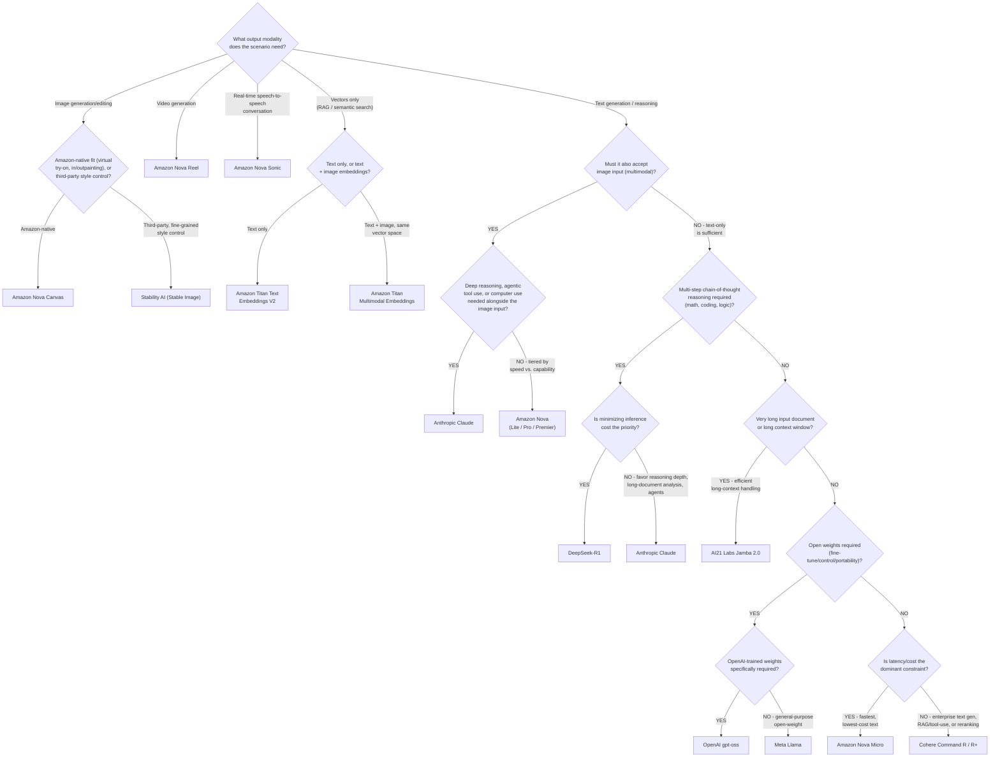
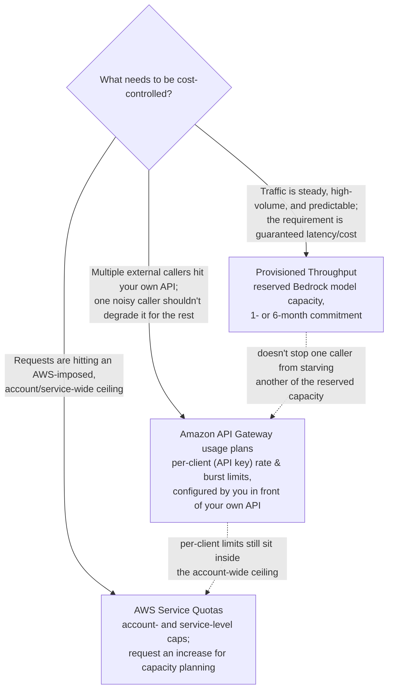

# AWS Service Decision Guide: A Cross-Domain Quick Reference

[Domain 1](domain-1-fundamentals-of-ai-and-ml.md), [Domain 2](domain-2-fundamentals-of-generative-ai.md),
[Domain 3](domain-3-applications-of-foundation-models.md), and
[Domain 5](domain-5-security-compliance-governance.md) each carry their own
comparison table, scoped to that domain's task statements. That's the right
depth for studying a domain in isolation, but the exam (and real-world
architecture decisions) routinely mixes "which AI service?" and "which
security/compliance service?" questions in the same scenario. This page is
a **consolidated quick reference** that sits on top of those domain tables —
it doesn't replace them, it points back to them for the full detail.

Use this page when a scenario gives you a use case and you need to jump
straight to "which AWS service is the exam answer here?" without re-reading
an entire domain guide. If instead you already know the service and want
every place it's discussed across the series (e.g., "everywhere Amazon
Bedrock is mentioned"), see [`aws-service-index.md`](aws-service-index.md) --
an alphabetical, per-service index rather than a decision flow.

---

## 1. Decision flow: SageMaker vs. Bedrock vs. purpose-built AI services

The single most tested decision pattern across Domains 1–3 is **"which AWS
service should I reach for?"** — and it always resolves through the same
three-question flow, regardless of whether the use case is classic ML or
generative AI:

```
START: What are you trying to build?
│
├─ 1. Does the task involve a *foundation model* (generating or reasoning
│     over text, images, code, or other content; chat; summarization;
│     RAG; agents)?
│     │
│     ├─ YES → 2. Do you need a ready-made, fully managed *application*
│     │         rather than a model you integrate yourself?
│     │         │
│     │         ├─ YES → Amazon Q Business (enterprise assistant grounded
│     │         │        in your data), Amazon Q Developer (coding
│     │         │        companion), or PartyRock (no-code prototyping)
│     │         │
│     │         └─ NO  → Amazon Bedrock — choose a foundation model,
│     │                  and layer on Knowledge Bases (RAG), Agents
│     │                  (multi-step task execution), Guardrails (safety
│     │                  filters), and Model Evaluation as needed.
│     │                  Need deep infrastructure control alongside the
│     │                  FM (custom training pipelines, Trainium/
│     │                  Inferentia)? → SageMaker JumpStart instead.
│     │
│     └─ NO  → 3. Does a purpose-built managed AI service already solve
│               this exact use case?
│               │
│               ├─ YES → Use the purpose-built service:
│               │        • Amazon Personalize — recommendations
│               │        • Amazon Forecast — time-series forecasting
│               │        • Amazon Rekognition — image/video analysis
│               │        • Amazon Transcribe — speech-to-text
│               │        • Amazon Comprehend — text/NLP analytics
│               │        • Amazon Polly — text-to-speech
│               │        • Amazon Translate — language translation
│               │        • Amazon Lex — conversational chat/voice bots
│               │        • Amazon Textract — structured document extraction
│               │        • Amazon Fraud Detector — fraud-risk scoring
│               │
│               └─ NO  → Amazon SageMaker — build, train, and deploy a
│                        bespoke model when no managed service covers
│                        the use case, or deep customization is required.
```

> **Exam tip — the rule behind the flow:** at every branch, the more
> "out of the box" and purpose-built a service is for the exact scenario
> described, the more likely it's the correct exam answer. The flow only
> reaches **Amazon Bedrock** (for generative use cases) or **Amazon
> SageMaker** (for everything else) when no purpose-built service already
> covers the ask. Building a custom model or FM integration for a task a
> purpose-built service already handles is a classic exam distractor.

The flow above resolves the top-level "which service family?" question,
but two service-*layering* combinations keep tripping up cross-domain
scenarios once you're already inside the Bedrock branch: whether to put
**Amazon Kendra in front of (or underneath) Bedrock Knowledge Bases** for
retrieval, and whether **Amazon Q Business replaces or sits on top of** a
Bedrock deployment you already built. Both are expansions of the same
"YES → ready-made application" and "RAG" branches above, not separate
decisions.

### Branch expansion: Amazon Kendra + Bedrock vs. Bedrock Knowledge Bases alone

This expands the "layer on Knowledge Bases (RAG)" branch above for the
specific case where **Amazon Kendra** is also in play — either because a
Kendra deployment already exists, or because the scenario asks for
enterprise search as its own deliverable, not just FM grounding:

```
BRANCH: Grounding a Bedrock FM in your own data — is Amazon Kendra
also part of the picture?
│
├─ Does a Kendra index (or Kendra GenAI Index) already exist, or does
│  the scenario call for connector-based enterprise search (SharePoint,
│  S3, Salesforce, etc.) as its own deliverable, independent of any FM?
│  │
│  ├─ YES → Is a generative, FM-produced answer also required (not just
│  │        ranked search results)?
│  │        │
│  │        ├─ YES → Point Bedrock Knowledge Bases at the existing
│  │        │        Amazon Kendra GenAI Index as its retriever — reuse
│  │        │        Kendra's connector-managed index as the retrieval
│  │        │        layer instead of standing up a second vector store.
│  │        │
│  │        └─ NO  → Amazon Kendra alone — no Bedrock, no Knowledge
│  │                 Base; Kendra's own managed relevance ranking is the
│  │                 whole answer.
│  │
│  └─ NO  → Bedrock Knowledge Bases alone, backed by a vector store
│           (Amazon OpenSearch Service/Serverless or Aurora + pgvector)
│           that Knowledge Bases manages for you — the default RAG path
│           when nothing about the scenario forces Kendra in.
```

> **Exam tip:** If a scenario mentions an *existing* Kendra deployment (or
> a **Kendra GenAI Index**) alongside a request for FM-grounded chat, the
> exam answer is "point Knowledge Bases at the Kendra index," not
> "provision a separate OpenSearch/Aurora vector store" — that would be
> duplicating a retrieval layer that already exists. Conversely, if the
> scenario never mentions needing a *generative* answer — just
> "natural-language search across our documents" — adding Bedrock at all
> is the distractor; **Kendra alone** already answers it.

For a full worked example of this branch — setup steps, and a cost/latency
comparison against standing up Aurora + pgvector or OpenSearch Serverless
as a second, duplicate vector store — see [domain-3's "Building a
product-knowledge assistant using Kendra's GenAI Index as a Bedrock
Knowledge Base data source"](domain-3-applications-of-foundation-models.md#worked-example-building-a-product-knowledge-assistant-using-kendras-genai-index-as-a-bedrock-knowledge-base-data-source).

### Branch expansion: layering Amazon Q Business on an existing Bedrock deployment

This expands the "YES → ready-made application" branch above for the case
where a team has *already* built something on Bedrock and the new
requirement sounds like it wants Amazon Q Business instead:

```
BRANCH: A Bedrock application already exists — does Amazon Q Business
replace it, or sit alongside it?
│
├─ Does the new requirement need an out-of-the-box, low-setup assistant
│  grounded in enterprise data sources (SharePoint, S3, Salesforce, etc.)
│  with built-in, data-source-aware access controls — and not custom
│  application logic the existing Bedrock integration already provides?
│  │
│  ├─ YES → Deploy Amazon Q Business as a separate, ready-made
│  │        application layer for that use case. It does not replace or
│  │        require modifying the existing Bedrock deployment — the two
│  │        commonly coexist (e.g., Q Business for internal knowledge
│  │        workers, the existing Bedrock API/Knowledge Base for a
│  │        custom customer-facing product built on the same company
│  │        data).
│  │
│  └─ NO  → Keep extending the existing Bedrock deployment (Knowledge
│           Bases, Agents, Guardrails, Prompt Flows) directly — Q
│           Business is the answer only when the requirement is
│           specifically "pre-built assistant, minimal setup," not a
│           reason to re-platform working custom application logic.
```

> **Exam tip:** "We already have a Bedrock-based application — do we
> switch to Amazon Q Business?" is a distractor pattern. Q Business is a
> separate, pre-built **application** that itself runs on foundation
> models; it is not a replacement for a custom Bedrock integration, and
> adopting it doesn't require decommissioning the existing deployment.
> The exam-tested signal for reaching for Q Business is the *requirement*
> ("ready-made enterprise assistant, minimal setup"), not the presence of
> an existing Bedrock deployment by itself.

For a full worked scenario applying this branch with real numbers — a
200-agent support team choosing between Amazon Q Business and a custom
Bedrock build from scratch, comparing per-user Q Business pricing against
on-demand Bedrock token cost, data-connector breadth across four enterprise
systems, and the customization each option keeps or gives up — see
[Domain 2's worked example: Amazon Q Business vs. a custom Bedrock
assistant for enterprise customer
support](domain-2-fundamentals-of-generative-ai.md#worked-example-amazon-q-business-vs-a-custom-bedrock-assistant-for-enterprise-customer-support).

For the full service-by-service detail behind this flow, see:
- [Domain 1 §5 — AWS managed AI/ML services (conceptual overview)](domain-1-fundamentals-of-ai-and-ml.md#5-aws-managed-aiml-services-conceptual-overview)
  and its [comparison table](domain-1-fundamentals-of-ai-and-ml.md#comparison-table-aws-managed-aiml-services-at-a-glance)
- [Domain 2 §5 — AWS generative AI services and capabilities](domain-2-fundamentals-of-generative-ai.md#5-aws-generative-ai-services-and-capabilities)
  and its [comparison table](domain-2-fundamentals-of-generative-ai.md#comparison-table-aws-generative-ai-services-at-a-glance)
- [Domain 3 §5 — Amazon Bedrock features](domain-3-applications-of-foundation-models.md#5-amazon-bedrock-features)
  and the [customization-approach comparison table](domain-3-applications-of-foundation-models.md#comparison-table-customization-approaches-for-foundation-model-applications)

---

## 2. Comparison table: security, compliance, and governance services

Domain 5 scenarios frequently confuse these four services because they all
touch "compliance" — but each answers a different question:

| Service | Category | What it does | Answers the question... | When it's the exam answer |
|---|---|---|---|---|
| **AWS CloudTrail** | Governance — activity logging | Logs every API call (who, what, when) across your account | "Who invoked this model / changed this resource, and when?" | You need a record of a specific API call, e.g. a specific `InvokeModel` or `CreateEndpoint` |
| **AWS Config** | Governance — configuration tracking | Records resource configuration state and evaluates it against compliance rules over time | "Is this resource compliant right now, and when did its configuration change?" | You need to detect that a SageMaker endpoint or S3 bucket drifted out of an encrypted/private configuration |
| **AWS Audit Manager** | Compliance — evidence collection | Automates collecting audit evidence mapped to a named framework (HIPAA, ISO 27001, SOC 2, etc.) | "Can I generate an audit-ready compliance report?" | You need to assemble evidence for an external or internal audit of an AI system |
| **AWS Artifact** | Compliance — AWS's own attestations | On-demand self-service portal for AWS's own compliance reports and agreements (SOC reports, ISO certifications, the HIPAA BAA) | "Where do I get proof of *AWS's* compliance, or sign an agreement with AWS?" | You need to download a SOC 2 report or execute a Business Associate Addendum (BAA) — it does not audit *your* account |

> **Exam tip:** CloudTrail and Config both watch *your* account, but
> CloudTrail is about **events/actions** while Config is about **resource
> state over time**. Audit Manager and Artifact both relate to
> "compliance," but Audit Manager assembles evidence *about your account*
> while Artifact hands you evidence *about AWS itself*.

See the fuller version of this table (which also covers Amazon Macie and
Amazon GuardDuty) at
[Domain 5 — comparison table: governance and monitoring services](domain-5-security-compliance-governance.md#comparison-table-governance-and-monitoring-services).

### Comparison table: SageMaker Model Monitor vs. Bedrock Model Evaluation

Two other services get confused for a related but different reason: both
**Amazon SageMaker Model Monitor** and **Amazon Bedrock Model Evaluation**
involve "checking a model's quality," but they answer that question at
opposite ends of a model's lifecycle — one watches a *traditional ML model
that's already deployed and serving traffic*, the other compares
*candidate foundation models before you commit to one*.

| Dimension | Amazon SageMaker Model Monitor | Amazon Bedrock Model Evaluation |
|---|---|---|
| Use case | Continuously track a **deployed** model's live prediction quality, input data drift, and concept/bias drift in production, feeding a retraining loop when quality degrades | Compare **candidate foundation models** (or prompt/configuration variants) for quality and task fit **before** committing to one for a Bedrock application |
| Input/output | Input: live inference requests/responses captured from a SageMaker endpoint, plus a baseline statistics profile from training data. Output: drift/violation reports and CloudWatch metrics and alarms | Input: an evaluation prompt dataset plus one or more candidate FMs (and, for human evaluation, a reviewer work team). Output: automatic metric scores and/or human-evaluator ratings comparing model responses |
| Model types supported | Traditional/classical ML models deployed to a SageMaker real-time (or batch) endpoint — classification, regression, etc. | Foundation models available through Amazon Bedrock — text generation, and increasingly multimodal generation/embedding models |
| Typical workflow | Deploy model → capture a baseline → schedule Model Monitor on the endpoint → review drift/violation reports → retrain and redeploy when quality degrades | Define an evaluation prompt dataset and metrics → run automatic and/or human evaluation across candidate FMs → compare results → select a model and build/deploy with it |

> **Exam tip:** The trigger is *timing*, not just "which service." A
> scenario about detecting that a **model already in production** is
> drifting or degrading is **SageMaker Model Monitor** — it doesn't apply
> to Bedrock FMs consumed through the managed API. A scenario about
> **deciding which foundation model to use** before building on it is
> **Bedrock Model Evaluation** — it doesn't apply to a classical model
> you've already trained and deployed to a SageMaker endpoint. Seeing
> both together in a scenario usually means a pipeline that fine-tunes or
> selects an FM (Model Evaluation) and then monitors a separately
> deployed classical model elsewhere in the same system (Model Monitor),
> not a single service doing both jobs.

### Comparison table: model-evaluation and monitoring tools compared

The two-service contrast above resolves the most common mix-up, but a
third tool gets pulled into the same "checking a model" conversation for
a different reason: **Amazon SageMaker Clarify** measures *bias and
explainability*, and it's the one tool of the three that spans **both**
classical ML models and foundation models, rather than sitting
exclusively on one side of the classical-ML/foundation-model line the way
Model Monitor and Model Evaluation do. Learners moving between classical-
ML and generative-AI contexts need a single table that places all three
side by side:

| Tool | Purpose | Applicable model type | Key metrics/outputs | When to use it |
|---|---|---|---|---|
| **Amazon SageMaker Model Monitor** | Continuously track a **deployed** model's live prediction quality and drift in production | Classical/traditional ML models on a SageMaker real-time (or batch) endpoint | Data-quality drift, model-quality drift, bias drift, and feature-attribution drift reports; CloudWatch metrics and alarms | A classical model is already serving live traffic and you need to detect that its inputs or predictions have drifted from a training baseline |
| **Amazon Bedrock Model Evaluation** | Compare **candidate foundation models** (or prompt/configuration variants) for quality and task fit before committing to one | Foundation models available through Amazon Bedrock | Automatic metric scores (e.g., accuracy, robustness, toxicity) and/or human-evaluator ratings comparing model responses | You're choosing which FM (or prompt variant) to build an application on, before anything is in production |
| **Amazon SageMaker Clarify** | Detect bias in datasets/models and generate explainability reports for individual predictions | Both classical ML models **and** foundation models — pre-training data bias checks, post-training/post-deployment bias metrics, and SHAP-based explainability | Pre-training bias metrics (e.g., class imbalance, difference in proportions of labels), post-training bias metrics (e.g., disparate impact), and SHAP-based feature-attribution explanations | A scenario asks about fairness/bias across protected groups, or "why did the model predict this," for either a classical model or a foundation model |

> **Exam tip:** Sort by *what question is being asked*, not just "which
> service checks a model." **Is a model already deployed and drifting?**
> → SageMaker Model Monitor. **Am I choosing between candidate foundation
> models before building on one?** → Bedrock Model Evaluation. **Is the
> question about bias across groups of people, or explaining a specific
> prediction?** → SageMaker Clarify — regardless of whether the model in
> question is a classical SageMaker model or a Bedrock foundation model.
> Clarify is the one tool of the three that doesn't sit exclusively on one
> side of the classical-ML/foundation-model divide, which is exactly why
> it keeps showing up alongside both of the others.

For the full walkthrough of SageMaker Clarify's pre-training and
post-training bias metrics and SHAP-based explanations, see [Domain 4 §2
— Identifying bias and fairness issues in training data and model
outputs](domain-4-guidelines-for-responsible-ai.md#2-identifying-bias-and-fairness-issues-in-training-data-and-model-outputs)
and its [comparison table of AWS responsible AI
tools](domain-4-guidelines-for-responsible-ai.md#comparison-table-aws-responsible-ai-tools-at-a-glance).

---

## 3. Comparison table: encryption and privacy options

| Option | Protects | Key concept | When to use it |
|---|---|---|---|
| **AWS KMS (Key Management Service)** | Data at rest (S3, EBS, SageMaker model artifacts, Bedrock fine-tuning data) | AWS-managed keys are simplest; **customer managed keys (CMKs)** give you control over key policy, rotation, and give you a CloudTrail-logged audit trail of every decrypt | You must encrypt sensitive data at rest and control (or prove control over) exactly who can decrypt it |
| **AWS PrivateLink / VPC endpoints** | Data in transit between your VPC and an AWS service | An **interface VPC endpoint** keeps traffic to a supported AWS service on the AWS network backbone — it never traverses the public internet, and needs no internet gateway, NAT gateway, or public IP | A scenario says a workload runs in a private/isolated VPC (no internet access) but still needs to call an AI service like Bedrock or SageMaker |
| **HIPAA eligibility + BAA (via AWS Artifact)** | Protected health information (PHI) | To legally process PHI on AWS, you must execute a **Business Associate Addendum (BAA)** — obtained through AWS Artifact — and use only **HIPAA-eligible services**, configured per AWS's HIPAA guidance (encryption enabled, access controls applied) | The scenario mentions patient data, PHI, or a healthcare workload — think "BAA + HIPAA-eligible services," not just "encrypt it" |

> **Exam tip:** These three are often layered in the same scenario: a
> healthcare company fine-tuning a model on Bedrock with patient data
> needs a **customer-managed KMS key** (control over decryption), a
> **VPC endpoint** (keep the training traffic off the public internet),
> and a **signed BAA** (the legal prerequisite for touching PHI at all) —
> none of the three substitutes for the others.

For the full walkthrough of each concept, see Domain 5:
[Data encryption at rest and in transit](domain-5-security-compliance-governance.md#data-encryption-at-rest-and-in-transit),
[AWS PrivateLink and VPC endpoints for AI services](domain-5-security-compliance-governance.md#aws-privatelink-and-vpc-endpoints-for-ai-services),
[AWS Artifact](domain-5-security-compliance-governance.md#aws-artifact), and
[HIPAA — conceptual level](domain-5-security-compliance-governance.md#hipaa-health-insurance-portability-and-accountability-act-conceptual-level).

---

## 4. Bedrock model reference: capabilities and use-case fit

The domain guides mention Titan, Claude, Llama, Nova, and other Bedrock
models throughout, but scattered mentions aren't a substitute for a single
place to compare them. Use this table when a scenario names a use case
(or a required modality) and you need to reason about *which family* of
model fits — not the exact model version, which changes too often to be
exam-testable.

> **Staleness warning:** Amazon Bedrock's model catalog changes
> frequently — AWS adds new model versions and deprecates old ones on an
> ongoing basis. The exam tests **model-family capabilities and
> selection criteria** (context window trade-offs, which modality a
> family supports, when multimodal beats text-only), not specific
> version numbers. Always verify exact model names/versions against the
> [Bedrock model catalog](https://docs.aws.amazon.com/bedrock/latest/userguide/model-cards.md)
> before relying on this table outside exam prep.
>
> **Last verified:** 2026-09-02, against the official Bedrock model
> catalog above. Changes found and applied in this pass: **DeepSeek** is
> now available as a new third-party provider in the catalog, with
> **DeepSeek-R1** — an open-weight, chain-of-thought reasoning model
> distinct from both Meta Llama's open-weight text line and OpenAI's
> gpt-oss — so a new row has been added below; **Anthropic Claude** has
> added **computer use** (controlling a desktop via screenshots and
> coordinate-based mouse/keyboard actions) as a supported agentic
> capability, so the row below now reflects that alongside its existing
> reasoning/tool-use strengths; AI21's **Jamba** line was updated to
> **Jamba 2.0**; **virtual try-on** was added to **Amazon Nova Canvas**;
> and **OpenAI's gpt-oss** line was added as a new third-party provider.
> The rest of the catalog (Nova family text/embedding tiers, Titan,
> Cohere, Mistral AI, Stability AI) was re-checked against the catalog
> and found unchanged. The next reviewer should update this date and
> summary after re-checking against the catalog link above.
>
> **Verification process (for maintainers):** the Bedrock catalog is
> observed to change roughly monthly, so treat this table as due for
> re-verification once the **Last verified** date above is more than
> ~60 days old — don't assume a table with no open issues is still
> accurate. To re-verify: open the
> [Bedrock model catalog](https://docs.aws.amazon.com/bedrock/latest/userguide/model-cards.md)
> linked in the staleness warning above, diff its current model list
> against the rows below, update any changed/added/removed rows, and
> then update both the **Last verified** date and the "changes found
> and applied" summary to reflect that pass — a re-verification that
> only bumps the date without recording what was checked defeats the
> purpose of this note.

| Model family | Provider | Modalities | Context window (relative) | Best-fit use case | Exam-style cue |
|---|---|---|---|---|---|
| **Amazon Titan Text** (Lite/Express/Premier) — *retired, see Nova* | Amazon | Text in → text out | Small → large across tiers | No longer offered for new use as of Aug 2026 — retired in favor of Amazon **Nova**'s text tiers. Kept here because older exam material may still name it | "Cost-effective," "Amazon-native" text-generation cues now point to **Nova**, not Titan Text |
| **Amazon Titan Text Embeddings V2** | Amazon | Text in → vector out | N/A (embeddings, not generation) | Converting chunked documents/queries into vectors for RAG / semantic search | "Embeddings," "semantic search," "vector database" |
| **Amazon Titan Multimodal Embeddings** | Amazon | Text and/or image in → vector out | N/A (embeddings, not generation) | Embedding images and text into the same vector space for multimodal search (e.g., "find images similar to this description") | "Multimodal search," "embed images and text together" |
| **Amazon Titan Image Generator G1 v2** | Amazon | Text/image in → image out | N/A | Image generation and editing with built-in invisible watermarking for provenance | "Generate an image," "watermark," "responsible image generation" |
| **Amazon Nova** (Micro/Lite/Pro/Premier) | Amazon | Text; Lite/Pro/Premier add image and video understanding | Micro smallest/fastest → Premier largest/most capable | Latency- and cost-sensitive text tasks (Micro) up to complex multimodal reasoning (Premier); Amazon's current general-purpose text family, superseding Titan Text | "Fast and low-cost," "understand video," "tiered by speed vs. capability" |
| **Amazon Nova Canvas** | Amazon | Text/image in → image out | N/A | Studio-quality image generation and editing (inpainting, outpainting, background removal, virtual try-on) | "Image generation," "edit an existing image," "composite a product onto a model photo" |
| **Amazon Nova Reel** | Amazon | Text/image in → video out | N/A | Short-form video generation from a text or image prompt | "Generate a video" |
| **Amazon Nova Sonic** | Amazon | Speech in → speech/text out (real-time, bidirectional) | N/A | Real-time, low-latency speech-to-speech conversational applications (voice assistants/agents) | "Real-time voice conversation," "speech-to-speech," not just transcription |
| **Anthropic Claude** | Anthropic | Text, and multimodal text+image input | Large (tens of thousands of tokens+) | Complex reasoning, long-document analysis, agentic tool use, careful instruction-following, and **computer use** (controlling a desktop via screenshots and coordinate-based mouse/keyboard actions) | "Long document," "reasoning," "agents," "analyze an image and answer questions about it," "control a desktop application" |
| **Meta Llama** | Meta | Text in → text out for the 3.x line; **Llama 4** (Scout/Maverick) adds native multimodal text+image input | Mid → large depending on version | Open-weight model needs — fine-tuning control, on-prem/portability considerations, cost-efficient general text tasks; multimodal open-weight needs point to Llama 4 | "Open source," "open-weight," "fine-tune and control the weights" |
| **AI21 Labs Jamba 2.0** | AI21 Labs | Text in → text out | Large, efficient long-context handling | Long-context summarization and text generation with efficient inference | "Long context," "efficient at scale" — the older **Jurassic** line has been retired; Jamba 2.0 is AI21's only current Bedrock family |
| **Cohere Command R / Command R+ / Embed / Rerank** | Cohere | Command R/R+: text in → text out, RAG- and tool-use-optimized; Embed: text → vector; Rerank: reorders search results | Mid-large (Command R/R+) | Enterprise text generation and RAG-oriented tool use (Command R/R+), embeddings (Embed), improving RAG retrieval relevance (Rerank) | "Improve search relevance," "rerank retrieved documents" — plain **Command** (non-R) has been retired in favor of Command R/R+ |
| **Mistral AI models** | Mistral AI | Text in → text out for the core line; newer additions add vision (**Pixtral**) and audio (**Voxtral**) input | Small (efficient) → large | Cost-efficient, low-latency text generation; some models support function calling; Pixtral/Voxtral cover multimodal needs in the same family | "Low latency," "function calling," "efficient" |
| **Stability AI (Stable Image)** | Stability AI | Text/image in → image out | N/A | High-control, style-flexible image generation and editing (upscaling, inpainting, outpainting, background removal, style transfer) | "Image generation," "fine-grained style control" — current Bedrock catalog exposes this as the task-specific **Stable Image** line rather than general Stable Diffusion checkpoints |
| **OpenAI gpt-oss** (gpt-oss-120b/gpt-oss-20b) | OpenAI | Text in → text out | Large, reasoning-oriented | Open-weight reasoning and text tasks where a scenario specifically calls for OpenAI-trained weights through Bedrock's managed API, rather than Amazon's or another third party's models | "Open-weight," "OpenAI model," "reasoning model" — don't confuse with Meta Llama, which is the open-weight family the exam more commonly tests |
| **DeepSeek-R1** | DeepSeek | Text in → text out | Large, reasoning-oriented | Open-weight, chain-of-thought reasoning tasks (multi-step math, coding, logic) at lower inference cost than comparably-sized closed-weight models | "Open-weight," "chain-of-thought," "reasoning model," "cost-efficient reasoning" — newest third-party addition to the catalog; distinct from OpenAI's gpt-oss (also open-weight and reasoning-oriented) and from Meta Llama (general-purpose, not reasoning-specialized) |

> **Exam tip — pick the *capability*, not the brand name.** Exam
> scenarios rarely ask "which company makes this model?" They describe a
> requirement — "must generate an image," "must reason over a 200-page
> document," "must run fine-tuning on open weights," "must support video
> understanding" — and the correct answer is whichever **family**
> natively supports that modality or trait. Choosing a text-only model
> (e.g., Meta Llama's 3.x line) for an image-generation scenario, or a
> small/fast model (e.g., Nova Micro) for a task that needs deep
> multi-step reasoning, is a classic distractor pattern.

> **Exam tip — modality mismatch is the #1 trap.** Not every Bedrock
> model supports every modality. Before matching a model to a scenario,
> confirm it: (1) accepts the required **input** modality (text, image,
> or both), (2) produces the required **output** modality (text, image,
> video, embeddings), and (3) if long input is described (a large
> document, a long conversation history), favor a model family known for
> large context windows (Claude, AI21) over one optimized for speed/cost
> (Nova Micro).

### 4.1 Decision flow: choosing a Bedrock model family

The comparison table above is the reference once you know what you're
looking for; this flow is the "I have a scenario, which family does it
point to" decision aid that complements it, in the same spirit as the
SageMaker-vs.-Bedrock-vs.-purpose-built flow in Section 1. Start from the
**output modality** the scenario actually needs, then narrow by
reasoning depth, context-window size, cost/latency sensitivity, and
whether open weights are required:



> **Exam tip:** Modality is the first fork because it's the hardest
> constraint — a family that's otherwise a great fit is still wrong if it
> can't produce the required output type at all (e.g., Jamba 2.0 for an
> image-generation ask). Once modality narrows the field to text
> generation, the remaining forks — reasoning depth, context length,
> open-weight need, and cost/latency — mirror the same criteria the
> comparison table's "Exam-style cue" column tests, just organized as a
> sequence of yes/no questions instead of a table scan.

For the underlying Bedrock feature set these models plug into (Knowledge
Bases, Agents, Guardrails, Model Evaluation, Provisioned Throughput), see
[Domain 3 §5 — Amazon Bedrock features](domain-3-applications-of-foundation-models.md#5-amazon-bedrock-features).
For where each model family is mentioned elsewhere across the series, see
[`aws-service-index.md`](aws-service-index.md).

---

## 5. Consolidated service matrix: all services across domains

Sections 1–4 above are decision aids scoped to a single question each
(which compute/model service, which governance service, which encryption
option, which Bedrock model family). This section is different: it's a
**single flat matrix covering every one of the 45+ AWS services**
referenced anywhere across the five domain guides — the same population of
services [`aws-service-index.md`](aws-service-index.md) lists
alphabetically with jump-links, but reshaped here into one multi-dimensional
table you can scan for "which domain(s) is this tested in, how much does
that domain count on the exam, when do I actually reach for it, and what's
the trap." Use the service index when you know the service and want every
place it's discussed; use this matrix when you want the whole landscape in
one scroll, or want to sanity-check a service you're unsure you've fully
placed.

> **How to read "Exam weight relevance":** each domain's share of the exam
> is fixed — Domain 1 ~20%, Domain 2 ~24%, Domain 3 ~28%, Domain 4 ~14%,
> Domain 5 ~14% (see the [domain weighting table in
> README.md](../README.md#exam-domains)). A service tagged with more than
> one domain isn't "more heavily weighted" by itself — it just means it can
> legitimately show up in scenario questions scored under either domain's
> percentage, so confusing it with a same-domain neighbor costs you twice.

| Service | Domain(s) | Exam weight relevance | When to use it | Common point of confusion |
|---|---|---|---|---|
| **AI Service Cards** | D4 | ~14% | Look up the documented intended use, limitations, and design considerations of a specific pre-built AWS AI service before deploying it | Confused with **SageMaker Model Cards** — Service Cards are AWS-authored docs about a managed service (e.g., Rekognition); Model Cards are documentation *you* author about *your own* trained model |
| **AI21 Labs** | D3 | ~28% | Pick a third-party Bedrock model provider alongside Amazon, Anthropic, Cohere, Meta, Mistral AI, and Stability AI | Confused with the other third-party Bedrock providers — the exam tests that you know Bedrock hosts multiple providers behind one API, not necessarily AI21-specific capabilities. See Cohere's row |
| **Amazon API Gateway** | D5 | ~14% | Put usage plans/API keys in front of your own REST/HTTP API that calls Bedrock or a SageMaker endpoint, to cap each caller's request rate independently | Confused with AWS Service Quotas — API Gateway usage plans are per-client limits you configure yourself; Service Quotas is the AWS-imposed, account-wide ceiling. See section 6 above |
| **Amazon Athena** | D1 | ~20% | Run ad hoc SQL directly over data already sitting in Amazon S3 during exploratory data analysis, without provisioning a database engine | Confused with a full data warehouse — Athena is serverless, pay-per-query SQL over data already in S3, not a place to load and curate a managed warehouse |
| **Amazon Augmented AI (Amazon A2I)** | D4 | ~14% | Insert a human reviewer into the loop for low-confidence or high-stakes ML predictions | Confused with SageMaker Ground Truth (labeling *training* data) — A2I reviews *inference-time* predictions, not training labels |
| **Amazon Aurora (PostgreSQL, with pgvector)** | D3 | ~28% | Store vector embeddings as a column type inside a relational database you already run, via the pgvector extension | Confused with Amazon OpenSearch and Amazon Kendra as "the RAG vector store" — Aurora/pgvector is the right pick specifically when you need embeddings *alongside* existing relational data and SQL joins, not a dedicated search engine |
| **Amazon Bedrock** | D2, D3, D4, D5 | ~24% + ~28% | Access a choice of foundation models from Amazon and third parties through one unified API, and layer on Knowledge Bases, Agents, Guardrails, and Model Evaluation | Confused with Amazon SageMaker — Bedrock is for consuming/customizing *existing* foundation models; SageMaker is for building/training a *bespoke* model or when deep infrastructure control is required |
| **Amazon Bedrock Agents** | D2, D3 | ~24% + ~28% | Let a foundation model plan and execute multi-step tasks by calling your own APIs | Confused with Bedrock Knowledge Bases — Agents take *action*; Knowledge Bases *retrieve information* (RAG). A scenario needing both grounded answers and task execution needs both together |
| **Amazon Bedrock Knowledge Bases** | D2, D3, D5 | ~24% + ~28% | Ground a foundation model's answers in your own data (RAG) with source attribution, without managing the retrieval pipeline yourself | Confused with a raw vector database (OpenSearch/Aurora/Kendra) — Knowledge Bases is the managed *orchestration layer* on top of one of those stores, not a replacement for picking one |
| **Amazon Bedrock Model Evaluation** | D2, D3 | ~24% + ~28% | Compare foundation model quality using automatic metrics or human evaluators before committing to a model choice | Confused with SageMaker Clarify — Model Evaluation compares *FM output quality/fit*; Clarify measures *bias and explainability*, mostly for traditional ML models |
| **Amazon Bedrock Prompt Flows** | D3 | ~28% | Chain multiple prompts and other steps (like a Knowledge Base lookup) into a single visually-built, orchestrated multi-step workflow | Confused with Amazon Bedrock Prompt Management — Prompt Flows orchestrates a *sequence* of prompts/steps; Prompt Management versions a *single* reusable prompt template. See section 7 above |
| **Amazon Bedrock Prompt Management** | D3 | ~28% | Create, version, and share reusable prompt templates so every application call uses a consistent, tested prompt | Confused with Amazon Bedrock Prompt Flows — Prompt Management versions a single prompt's text; Prompt Flows chains multiple prompts/steps into a workflow. See section 7 above |
| **Amazon CloudWatch** | D5 | ~14% | Monitor operational metrics/logs to detect anomalous invocation patterns or model drift in near-real time | Confused with AWS CloudTrail — CloudWatch answers "is something behaving abnormally *right now*"; CloudTrail answers "who called what API, and when" |
| **Amazon Comprehend** | D1, D5 | ~20% + ~14% | Run managed NLP for sentiment, entities, key phrases, PII detection, or topic modeling; use Comprehend Medical for HIPAA-eligible clinical text | Confused with Amazon Textract — Comprehend analyzes/understands text that's already digitized; Textract extracts text/structure *out of* scanned documents in the first place |
| **Amazon DynamoDB** | D5 | ~14% | Reach a managed NoSQL store privately from a VPC via a gateway VPC endpoint (like Amazon S3), instead of the public internet | Confused with the interface VPC endpoints used for Bedrock/SageMaker — S3 and DynamoDB specifically use gateway endpoints, not interface endpoints |
| **Amazon EC2** | D3 | ~28% | Run Trainium- or Inferentia-backed EC2 instances (Trn1/Trn2, Inf1/Inf2) directly when you need infrastructure-level control over training or inference | Confused with SageMaker managed training/inference — EC2 is the raw compute layer those chips are exposed through, not a managed ML platform itself |
| **Amazon Forecast** | D1 | ~20% | Generate time-series forecasts (demand, inventory, financial metrics) without building a custom model | Confused with Amazon Fraud Detector as "another prediction service" — Forecast predicts *future numeric trends over time*; Fraud Detector scores *risk of a single transaction/event* |
| **Amazon Fraud Detector** | D1 | ~20% | Get real-time fraud-risk scores for transactions or account activity using a managed model | Confused with Amazon GuardDuty — Fraud Detector scores *business transaction risk* (an ML/AI service, Domain 1); GuardDuty detects *account/infrastructure security threats* (a security service, Domain 5) |
| **Amazon GuardDuty** | D5 | ~14% | Continuously detect threats and anomalies across an AWS account's infrastructure and API activity | Confused with Amazon Macie — GuardDuty watches for *threats/intrusions*; Macie watches for *sensitive data exposure* in S3 specifically |
| **Amazon Inspector** | D5 | ~14% | Run automated vulnerability scans against compute resources | Confused with AWS Config — Inspector scans for *vulnerabilities*; Config tracks *configuration compliance drift* over time, a different question entirely |
| **Amazon Kendra** | D3 | ~28% | Stand up enterprise search where the service manages embeddings and relevance ranking internally, with minimal tuning | Confused with Amazon OpenSearch Service — Kendra is fully managed and opinionated (less control, faster to stand up); OpenSearch gives you direct control over the vector engine and hybrid search tuning |
| **Amazon Kinesis** | D1 | ~20% | Ingest real-time streaming data feeds (with Amazon MSK) during the data-collection stage of the ML lifecycle | Confused with AWS Glue — Kinesis ingests *streaming* data; Glue performs *batch* ETL on data already landed in a data lake |
| **Amazon Lex** | D1 | ~20% | Build a conversational chatbot or voice-bot interface with built-in speech recognition and language understanding | Confused with Amazon Q Business — Lex builds a *custom* conversational interface you design intents for; Q Business is a pre-built enterprise assistant grounded in your existing company data |
| **Amazon Macie** | D5 | ~14% | Discover and classify sensitive data (e.g., PII) already stored in Amazon S3 | Confused with Amazon Comprehend PII detection — Macie scans *data at rest in S3 buckets*; Comprehend's PII feature analyzes *text passed to it*, regardless of where it's stored |
| **Amazon MSK (Managed Streaming for Apache Kafka)** | D1 | ~20% | Ingest real-time streaming data feeds, alongside Amazon Kinesis, during the data-collection stage of the ML lifecycle | Confused with treating Kinesis as the only streaming-ingestion option — MSK and Kinesis are alternative managed streaming services for the same data-collection stage, not sequential steps |
| **Amazon Nova Canvas** | D2, D3 | ~24% + ~28% | Generate or edit studio-quality images from a text/image prompt on Bedrock | Confused with the Amazon Titan Image Generator — Nova Canvas is the current, actively developed image-generation model; Titan's image generation is the superseded predecessor |
| **Amazon Nova Lite** | D2 | ~24% | Pick a low-cost, multimodal (text + image + video understanding) Nova tier when Micro's text-only scope isn't enough but Pro/Premier's cost isn't justified | Confused with Amazon Nova Micro — Lite adds multimodal understanding that Micro (text-only) doesn't have |
| **Amazon Nova Micro** | D2 | ~24% | Pick the fastest, lowest-cost, text-only Nova tier for latency- and cost-sensitive text tasks | Confused with Amazon Nova Lite — Micro is text-only; Lite is the smallest tier that adds image/video understanding |
| **Amazon Nova Premier** | D2 | ~24% | Pick the largest, most capable Nova tier for complex, multi-step multimodal reasoning | Confused with defaulting to Nova Premier — the exam rewards matching *tier* to task complexity, not always picking the biggest model |
| **Amazon Nova Pro** | D2 | ~24% | Pick a mid-tier, multimodal Nova model balancing capability against cost and speed | Confused with Amazon Nova Premier — Pro is the balanced middle tier; Premier is reserved for the most demanding multimodal reasoning tasks |
| **Amazon Nova Reel** | D2 | ~24% | Generate short-form video from a text or image prompt on Bedrock | Confused with Amazon Nova Canvas — Reel outputs *video*; Canvas outputs *images* |
| **Amazon Nova Sonic** | D2 | ~24% | Build a real-time, low-latency, bidirectional speech-to-speech conversational voice assistant directly on Bedrock | Confused with chaining Amazon Transcribe + a text model + Amazon Polly — that pipeline adds a latency hop at each step; Nova Sonic handles speech-to-speech natively in one real-time model |
| **Amazon OpenSearch Service / Serverless** | D3 | ~28% | Run vector search with a built-in vector engine, especially when you need hybrid vector + keyword search and want direct control over indexing | Confused with Amazon Kendra — OpenSearch is infrastructure you configure; Kendra is a managed search product. Also confused with Aurora/pgvector — OpenSearch is purpose-built for search/analytics, not a general relational store |
| **Amazon Personalize** | D1 | ~20% | Add real-time, individualized recommendations or re-ranking without needing in-house ML expertise | Confused with Bedrock Agents for "personalized responses" — Personalize is a purpose-built recommendation engine (classic ML, Domain 1); it does not involve a foundation model |
| **Amazon Polly** | D1 | ~20% | Convert text into natural, lifelike speech audio | Confused with Amazon Transcribe — Polly goes *text → speech*; Transcribe goes *speech → text*. Easy to swap under exam time pressure |
| **Amazon Q Business** | D2 | ~24% | Deploy a pre-built enterprise generative AI assistant grounded in company data and systems with minimal setup | Confused with Bedrock Knowledge Bases — Q Business is a ready-made *application*; Knowledge Bases is a *building block* you assemble into your own application on top of Bedrock |
| **Amazon Q Developer** | D2 | ~24% | Get a generative AI coding companion and AWS resource assistant integrated into an IDE or the console | Confused with Amazon Q Business — Developer targets *building software and AWS resources*; Business targets *enterprise knowledge work* grounded in company documents |
| **Amazon RDS** | D3 | ~28% | Store vector embeddings in a relational database (for PostgreSQL) when an application already standardizes on RDS rather than Aurora | Confused with Amazon Aurora — both support pgvector for relational + vector storage; RDS is the pick specifically when the application is already committed to RDS |
| **Amazon Rekognition** | D1, D4 | ~20% + ~14% | Run pre-trained or custom computer vision for object/scene detection, facial analysis, or content moderation | Confused with SageMaker for "any vision task" — Rekognition is purpose-built and should win whenever the use case is a standard vision task; only reach for SageMaker when Rekognition's built-in capabilities don't fit |
| **Amazon S3** | D1, D3, D5 | ~20% + ~28% + ~14% | Use as the central data lake for training data, the source-document store behind a RAG pipeline, and a KMS-encrypted-at-rest storage layer | Confused with treating storage as an afterthought — nearly every AI/ML workflow across every domain starts or ends with data landing in S3, so it's rarely the "wrong" answer but also rarely the *complete* answer alone |
| **Amazon SageMaker** | D1, D2, D3, D4, D5 | ~20% + ~24% + ~28% + ~14% + ~14% | Build, train, tune, deploy, and monitor a bespoke ML model when no managed/purpose-built service covers the use case, or when deep customization is required | Confused with Bedrock across every domain it touches — the reflex fix is "does a purpose-built or Bedrock option already cover this?" before defaulting to SageMaker |
| **Amazon SageMaker Autopilot** | D1 | ~20% | Automatically build, train, and tune candidate ML models as a fast baseline to sanity-check whether a hand-built model is worth the extra effort | Confused with SageMaker JumpStart — Autopilot auto-builds a *classic ML* model from your tabular data; JumpStart deploys/fine-tunes a *pretrained foundation model* |
| **Amazon SageMaker Clarify** | D4 | ~14% | Detect bias in a dataset or trained model and generate SHAP-based explainability reports | Confused with Amazon A2I — Clarify is an automated *analysis* tool run against data/models; A2I inserts a *human* into the review loop. They're complementary, not substitutes |
| **Amazon SageMaker Data Wrangler** | D1 | ~20% | Visually prepare data (impute missing values, encode categoricals, engineer features) during exploratory analysis and feature engineering | Confused with SageMaker Feature Store — Data Wrangler *transforms* data; Feature Store *stores and serves* the finished features to prevent training/serving skew |
| **Amazon SageMaker Feature Store** | D1 | ~20% | Publish finished features to a centralized, versioned repository shared between training and inference to avoid training/serving skew | See SageMaker Data Wrangler's row |
| **Amazon SageMaker JumpStart** | D2, D3 | ~24% + ~28% | Deploy or fine-tune a pretrained foundation model when you need deep infrastructure control alongside the model (custom training pipelines, Trainium/Inferentia) | Confused with Bedrock — JumpStart is chosen specifically *because* Bedrock's managed abstraction isn't enough; if the scenario doesn't mention needing that infra control, Bedrock is the simpler correct answer |
| **Amazon SageMaker Model Cards** | D4, D5 | ~14% + ~14% | Produce structured, auditable documentation of a model's intended use, training data, evaluation results, and limitations | Confused with AWS Audit Manager — Model Cards document *a specific model*; Audit Manager assembles *account-wide evidence* against a compliance framework, which may include Model Cards as one input |
| **Amazon SageMaker Model Monitor** | D1, D4, D5 | ~20% + ~14% + ~14% | Track live model quality, input data drift, and concept/bias drift in production after deployment, feeding retraining loops when quality degrades | Confused with Amazon CloudWatch — Model Monitor evaluates *ML-specific* data/prediction drift against a baseline; CloudWatch monitors general operational metrics/logs |
| **Amazon SageMaker RL** | D1 | ~20% | Use managed reinforcement-learning toolkits/environments where an agent learns via trial-and-error reward maximization, when the use case is genuinely RL rather than supervised/unsupervised learning | Confused with AWS DeepRacer — SageMaker RL is the general-purpose managed RL toolkit; DeepRacer is a hands-on RL education product built on the same RL concepts |
| **Amazon Textract** | D1 | ~20% | Extract text, handwriting, forms, and tables from scanned documents while preserving structure | Confused with Amazon Comprehend — Textract's job ends once text/structure is extracted; understanding/analyzing that text (sentiment, entities) is Comprehend's job |
| **Amazon Titan** | D2, D3, D4 | ~24% + ~28% + ~14% | Use Amazon's own foundation model family in Bedrock for text generation or embeddings at low cost | Confused with claiming image-generation capability — that moved to **Amazon Nova Canvas**; Titan today is text and embeddings only |
| **Amazon Titan Text Embeddings** | D3 | ~28% | Convert chunked documents or queries into vectors for RAG or semantic search using Amazon's own Bedrock embeddings model | Confused with Amazon Titan generally — Titan Text Embeddings is specifically the embeddings model, distinct from Titan's (retired) text-generation line |
| **Amazon Transcribe** | D1, D4 | ~20% + ~14% | Convert audio/video speech into text via automatic speech recognition | Confused with Amazon Polly (see Polly's row) and with Amazon Comprehend — Transcribe only produces a text transcript, it does not analyze the transcript's content |
| **Amazon Translate** | D1 | ~20% | Perform neural machine translation between languages | Confused with treating it as a generative/Bedrock capability — Translate is a purpose-built managed service (Domain 1), not a foundation-model use case |
| **Amazon VPC** | D5 | ~14% | Isolate AI workloads in a private network and reach AWS AI services via VPC endpoints instead of the public internet | Confused with the endpoint itself — the VPC is the network boundary; PrivateLink/the VPC endpoint is what bridges it privately to a specific AWS service |
| **Anthropic Claude** | D2, D3 | ~24% + ~28% | Pick a third-party Bedrock model for complex reasoning, long-document analysis, agentic tool use, or multimodal (text + image) input | Confused with Amazon Titan/Nova as "the default Bedrock model" — Claude is a specific third-party family with its own strengths, not one of Amazon's own model lines |
| **AWS Artifact** | D5 | ~14% | Download AWS's own compliance reports (SOC, ISO) or execute a Business Associate Addendum (BAA) for HIPAA | Confused with AWS Audit Manager — Artifact hands you evidence *about AWS itself*; Audit Manager assembles evidence *about your account*. See section 2 above |
| **AWS Audit Manager** | D5 | ~14% | Automate collection of audit-ready evidence mapped to a named compliance framework (HIPAA, ISO 27001, SOC 2) | See AWS Artifact's row — the two are the most frequently confused pair in Domain 5's compliance content |
| **AWS CloudTrail** | D5 | ~14% | Get a record of a specific API call — who invoked it and when (e.g., a specific `InvokeModel` call) | Confused with AWS Config (see section 2 above) — CloudTrail is events/actions, Config is resource state over time |
| **AWS Config** | D5 | ~14% | Detect that a resource (e.g., a SageMaker endpoint or S3 bucket) drifted out of a compliant configuration, and see its configuration history | See AWS CloudTrail's row |
| **AWS Customer Carbon Footprint Tool** | D4 | ~14% | Report estimated carbon emissions associated with your AWS usage | Confused with the Well-Architected Sustainability Pillar — the Footprint Tool *measures* emissions; the Sustainability Pillar *prescribes design principles* to reduce them |
| **AWS DeepRacer** | D1 | ~20% | Teach or learn reinforcement-learning concepts hands-on via an autonomous racing simulator/model, not as production RL infrastructure | Confused with Amazon SageMaker RL — DeepRacer is an RL *education* tool; SageMaker RL is the managed toolkit you'd actually use to build a production RL system |
| **AWS Glue** | D1 | ~20% | Run managed ETL jobs (e.g., incrementally pulling new records into an S3 data lake) during the data-collection stage of the ML lifecycle | Confused with Amazon Kinesis — Glue performs *batch* ETL; Kinesis ingests *streaming* data feeds |
| **AWS Inferentia** | D3 | ~28% | Run inference at high throughput and low cost on a purpose-built ML chip | Confused with AWS Trainium — Inferentia is for **inference**, Trainium is for **training**. The names are the mnemonic, but under time pressure they get swapped |
| **AWS KMS (Key Management Service)** | D5 | ~14% | Encrypt sensitive data at rest and control exactly who can decrypt it, ideally with a customer-managed key (CMK) for audit-logged access control | Confused with AWS PrivateLink — KMS protects data *at rest*; PrivateLink protects data *in transit*. A scenario needing both encryption and network isolation needs both services together |
| **AWS Lambda** | D2, D3 | ~24% + ~28% | Back the custom API/action-group functions a Bedrock Agent invokes to take real-world actions during multi-step task execution | Confused with Bedrock Agents itself — Agents *plans and orchestrates* the multi-step task; Lambda is the compute that *executes* an individual action it calls |
| **AWS Neuron SDK** | D3 | ~28% | Compile and run ML workloads on Trainium and Inferentia chips | Confused with treating Trainium/Inferentia as usable "out of the box" without it — Neuron SDK is the software layer that makes the chips usable, not a separate hardware choice |
| **AWS Organizations** | D5 | ~14% | Centrally manage multiple AWS accounts and use service control policies (SCPs) to enforce rules like data-residency Region restrictions | Confused with IAM — IAM controls what a principal can do *within* an account; Organizations/SCPs set guardrails *across* accounts |
| **AWS PrivateLink** | D5 | ~14% | Keep traffic between your VPC and an AWS service like Bedrock or SageMaker off the public internet via an interface VPC endpoint | See AWS KMS's row; also confused with a VPN or Direct Connect — PrivateLink connects your VPC directly to an AWS *service*, not to another network |
| **AWS Service Quotas** | D5 | ~14% | Detect or raise the account-wide ceiling on a specific AWS API operation (e.g., Bedrock inference calls per second per account/model) when a scenario describes AWS-side throttling or capacity planning | Confused with Amazon API Gateway usage plans — Service Quotas is an AWS-imposed, account-wide ceiling; API Gateway usage plans are per-client limits you configure yourself in front of your own API. See section 6 above |
| **AWS Shield** | D5 | ~14% | Protect AWS resources against DDoS attacks | Confused with HIPAA eligibility, data residency, or encryption controls — Shield Advanced is a frequent exam distractor offered as a wrong answer to compliance/residency/encryption questions it has nothing to do with |
| **AWS Trainium** | D3 | ~28% | Train models cost-efficiently at high performance on a purpose-built ML chip | See AWS Inferentia's row |
| **AWS Trusted Advisor** | D5 | ~14% | Get cost, performance, and security best-practice checks across an account | Confused with Amazon Macie — Trusted Advisor gives account-level best-practice recommendations; Macie performs content-level sensitive-data discovery, a different and more specific job |
| **AWS Well-Architected Framework Sustainability Pillar** | D4 | ~14% | Apply design principles to minimize the environmental impact of an AI/ML workload's architecture | See AWS Customer Carbon Footprint Tool's row |
| **Cohere** | D2, D3 | ~24% + ~28% | Pick a third-party Bedrock model provider alongside Amazon, Anthropic, Meta, Mistral AI, and Stability AI | Confused with the other third-party Bedrock providers — the exam tests that you know Bedrock hosts multiple providers behind one API, not necessarily Cohere-specific capabilities |
| **Guardrails for Amazon Bedrock** | D2, D3, D4, D5 | ~24% + ~28% + ~14% + ~14% | Apply configurable safety/compliance filters (denied topics, content filters, PII redaction, contextual grounding checks) to foundation model inputs and outputs | Confused with IAM — Guardrails filters *content*; IAM controls *who can call the API at all*. Both are commonly needed together in a responsible-AI scenario |
| **IAM (AWS Identity and Access Management)** | D5 | ~14% | Control which user, group, or service can do what, on which AI resource | Confused with IAM Access Analyzer — IAM sets the policies; Access Analyzer *audits* those policies for unintended external sharing |
| **IAM Access Analyzer** | D5 | ~14% | Identify resources (e.g., S3 buckets, Bedrock model resource policies) that are shared with entities outside your AWS account | See IAM's row |
| **Meta Llama** | D2, D3 | ~24% + ~28% | Pick an open-weight Bedrock model when fine-tuning control, portability, or cost-efficient general text tasks matter | Confused with fully-managed, closed-weight providers (Anthropic, Cohere) — Llama's open-weight nature is specifically what makes it the answer when a scenario calls for weight-level control |
| **Mistral AI** | D2, D3 | ~24% + ~28% | Pick a third-party Bedrock model provider alongside Amazon, Anthropic, Cohere, Meta, and Stability AI | See Cohere's row |
| **PartyRock** | D2 | ~24% | Prototype with foundation models in a free, no-code Bedrock playground | Confused with Amazon Bedrock itself — PartyRock is a *no-code experimentation front-end*; production applications still integrate against Bedrock's API directly |
| **Provisioned Throughput (Amazon Bedrock)** | D2, D3 | ~24% + ~28% | Reserve Bedrock model capacity for consistent performance under steady, high-volume traffic | Confused with on-demand Bedrock pricing as "always cheaper" — Provisioned Throughput is a deliberate trade of flexibility for guaranteed capacity/latency, and is the exam answer specifically when traffic is described as steady and high-volume |
| **Stability AI** | D2, D3 | ~24% + ~28% | Pick a third-party Bedrock model provider for image generation, alongside Amazon Nova Canvas | Confused with Amazon Nova Canvas — both handle image generation on Bedrock; Stability AI is the third-party option, Nova Canvas is Amazon's first-party model |

> **Exam tip:** a service appearing in multiple domains is the matrix's
> biggest signal, not noise — it means the *same* service can be the
> correct answer to differently-framed scenario questions. Amazon Bedrock,
> Amazon SageMaker, and Guardrails for Amazon Bedrock are the three
> services with the widest domain spread; make sure you can articulate
> what changes about *how* each is tested from one domain to the next
> (e.g., Bedrock-as-a-generative-AI-service in Domain 2 vs.
> Bedrock-under-the-shared-responsibility-model in Domain 5).

For the full definition and every per-domain jump-link behind each row
above, see [`aws-service-index.md`](aws-service-index.md).

---

## 6. Decision guide: Amazon API Gateway in front of Bedrock/SageMaker endpoints

Domain 5's threat-mitigation content lists **request throttling, Amazon
API Gateway usage plans, and Service Quotas** together in the same
sentence as the fix for a "model denial of service" attack — which reads
like one control, but is actually three, each answering a different
question. This is the same "similar-sounding controls, different
questions" pattern as Section 2 above, just for request volume instead of
compliance evidence.

| Control | What it actually limits | Where it sits | When it's the exam answer |
|---|---|---|---|
| **Amazon API Gateway usage plans / API keys** | Per-client (per API key) request rate and burst limits, enforced at the API layer | In front of *your own* REST/HTTP API, which in turn calls Bedrock or a SageMaker endpoint | A scenario has multiple external callers (partners, tenants, free vs. paid tiers) hitting *your* API, and one misbehaving or overly aggressive caller shouldn't be able to degrade service for the others |
| **AWS Service Quotas** | Account-wide default and adjustable ceilings on a specific AWS API operation (e.g., Bedrock `InvokeModel` transactions per second per account/model) | Set by AWS at the account level, not something you configure per caller | A scenario describes requests being throttled with an AWS-side error and needing a **quota increase**, or capacity planning around a hard account-wide ceiling |
| **Bedrock Provisioned Throughput** | Reserved model capacity guaranteeing consistent throughput/latency | Dedicated capacity purchased for one model, for a 1- or 6-month commitment | Traffic is described as **steady, high-volume, and predictable**, and the requirement is guaranteed latency — not "too many/malicious requests" |
| **Guardrails for Amazon Bedrock** | Content safety (denied topics, PII, filters) — *not* request volume | Applied to model inputs/outputs | A common distractor: if the scenario is about request *rate* or cost from excessive calls, Guardrails is the wrong layer entirely — it doesn't throttle anything |

> **Exam tip:** Separate "who is calling too often" (**API Gateway usage
> plans**, configured in front of your own API) from "what's the account's
> total ceiling" (**Service Quotas**, an AWS-imposed limit you can request
> to raise) from "guaranteed dedicated capacity" (**Provisioned
> Throughput**, a capacity purchase, not a rate limit) from "is the
> *content* safe" (**Guardrails**, unrelated to volume). All four can
> appear in the same "model denial of service" scenario, but only one
> answers the specific question asked.

**Visual summary — cost governance decision tree:** the three
cost-control mechanisms above aren't interchangeable fallbacks for each
other — each one is the right answer for a different shape of scenario.
The diagram below routes a scenario to the right one based on *who* or
*what* is generating the volume that needs to be controlled:



**Exam-style scenario:** A company exposes a customer-support chatbot
backed by Amazon Bedrock through a public REST API, with several external
partner integrations calling it. They want to make sure a single partner
accidentally sending a burst of malformed retry requests can't degrade
response times for every other partner. Which should they configure in
front of the API to enforce a per-partner request rate limit?

A. AWS Service Quotas
B. Amazon API Gateway usage plans
C. Amazon Bedrock Provisioned Throughput
D. Guardrails for Amazon Bedrock

**Answer: B** — the requirement is capping *individual callers*
independently of one another at the API layer, which is exactly what
API Gateway usage plans (and the API keys they're associated with) are
for. Service Quotas (A) is an account-wide AWS-imposed ceiling, not a
per-partner control; Provisioned Throughput (C) buys guaranteed capacity
but doesn't stop one caller from starving others of it; Guardrails (D)
filters content, not request volume.

For the underlying threat this mitigates, see [Domain 5 — Common
security threats to AI systems and how to mitigate them](domain-5-security-compliance-governance.md#common-security-threats-to-ai-systems-and-how-to-mitigate-them)
(the "model denial of service" entry). For Provisioned Throughput's
capacity-planning trade-offs, see [Domain 3 §5 — Amazon Bedrock
features](domain-3-applications-of-foundation-models.md#5-amazon-bedrock-features).

---

## 7. Decision guide: Bedrock Prompt Management vs. Prompt Flows vs. direct prompting

Domain 3 covers prompt templates and prompt chaining as prompt-engineering
*techniques*; this section is the "which AWS feature implements that
technique" decision the exam pairs with it — three ways to get a prompt
from an application to a model, in increasing order of structure.

| Approach | What it is | Adds versioning/reuse? | Handles multi-step workflows? | When it's the exam answer |
|---|---|---|---|---|
| **Direct prompting** (prompt text built and sent by your own application code) | The application constructs and sends the prompt string itself, with no Bedrock-managed layer in between | No — reuse and versioning are whatever your own codebase does | No — orchestration across steps is entirely your own code | Simple, single-call use cases, or early prototyping, where the overhead of a managed prompt/flow resource isn't justified |
| **Amazon Bedrock Prompt Management** | A managed resource for creating, versioning, and sharing reusable **prompt templates** (with placeholders) across an application or team | Yes — this is its core purpose: centrally versioned, reusable templates | No — it manages a single prompt's content and variants, not a sequence of steps | A scenario emphasizes a **consistent, tested, versioned prompt** reused across many calls or by multiple team members — the "prompt template" keyword |
| **Amazon Bedrock Prompt Flows** | A visual builder for chaining multiple prompts and other steps (e.g., a Knowledge Base lookup) into a single orchestrated workflow, where one step's output feeds the next | Yes, at the flow level | Yes — this is its core purpose: multi-step **prompt chaining** with a visual builder | A scenario describes breaking a complex task into a **sequence of prompts/steps** where output feeds input, especially "visual builder" or "no-code chaining" |

> **Exam tip:** The three sit on a spectrum of *how much Bedrock manages
> for you*, not a quality ranking — picking Prompt Flows for a single
> simple prompt is over-engineering, just as re-implementing multi-step
> chaining by hand in application code when Prompt Flows already does it
> is a classic distractor. Match the keyword: "reusable template,"
> "versioned," "shared across the team" → **Prompt Management**;
> "sequence of prompts," "output feeds the next step," "visual builder,"
> "chaining" → **Prompt Flows**; no mention of reuse or multi-step
> orchestration at all → plain **direct prompting** is sufficient and
> adding either managed feature would be unnecessary complexity.

**Exam-style scenario:** A team's generative AI application currently
builds each prompt as a hardcoded string inside application code. As the
team grows, different engineers keep making small, untracked edits to the
same prompt, causing inconsistent output across environments, and there's
no way to see what changed between versions. Which Bedrock capability
most directly solves this?

A. Amazon Bedrock Agents
B. Amazon Bedrock Prompt Flows
C. Amazon Bedrock Prompt Management
D. Amazon Bedrock Guardrails

**Answer: C** — the problem described is inconsistent, unversioned
prompt text edited ad hoc by multiple people, which is exactly what
Prompt Management's versioned, shared, reusable templates solve. Prompt
Flows (B) is for orchestrating a *sequence* of prompts/steps, not for
versioning a single prompt's text; Agents (A) executes multi-step tasks
via tool calls; Guardrails (D) filters content, not prompt authoring.

For the prompt-engineering techniques these features implement, see
[Domain 3 §2 — Prompt engineering techniques](domain-3-applications-of-foundation-models.md#2-prompt-engineering-techniques)
and its [comparison table](domain-3-applications-of-foundation-models.md#comparison-table-prompt-engineering-techniques-at-a-glance).
For where Prompt Management and Prompt Flows fit among Bedrock's other
managed features (Agents, Guardrails, Knowledge Bases), see [Domain 3
§5 — Amazon Bedrock features](domain-3-applications-of-foundation-models.md#5-amazon-bedrock-features).

---

## How this guide relates to the domain guides

This page is intentionally short: it is a **decision aid**, not a
replacement for the domain guides' depth. If a scenario needs more context
than a single table row gives you — the *why* behind a service choice, a
worked AWS example, or an exam-tip explanation of a common distractor —
follow the links above into the relevant domain section. See also the
[cross-domain concept map](cross-domain-concept-map.md) for how Domain 1
fundamentals flow into the later domains' service and governance choices.
