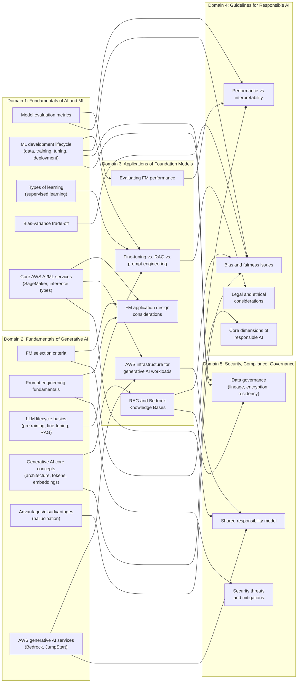
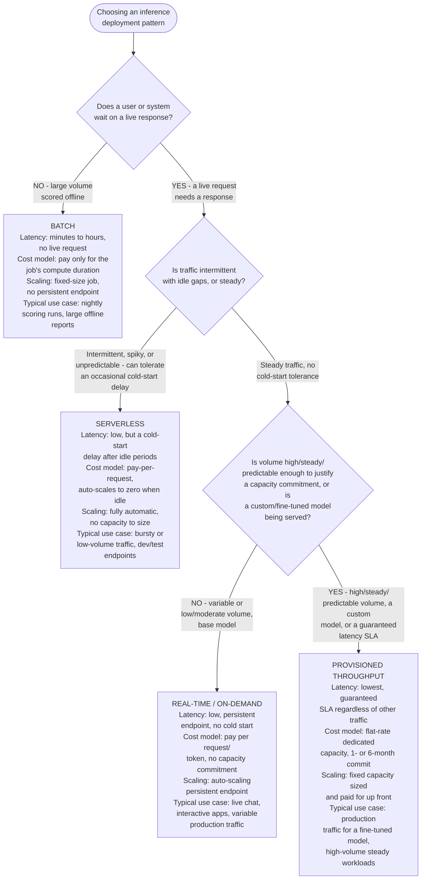

# Cross-Domain Concept Map: How Concepts Flow From Domain 1 and 2 Fundamentals to Domains 3–5

**Last verified:** 2026-09-06 — this page's cross-references to AWS
services and features track the same material covered in the five domain
guides. Re-verify at least every 90 days, or sooner if a linked domain
guide's own **Last verified** date moves.

The five domain guides in this series are written to stand alone — each one
covers its own exam task statements in full. But the AIF-C01 exam does not
test domains in isolation, and neither does real-world practice: the
vocabulary and mental models built in
[**Domain 1: Fundamentals of AI and ML**](domain-1-fundamentals-of-ai-and-ml.md)
(how a model is trained, how you measure whether it's any good, why it
fails) and
[**Domain 2: Fundamentals of Generative AI**](domain-2-fundamentals-of-generative-ai.md)
(how a foundation model is built, selected, and prompted) are the exact
same concepts that reappear — renamed, specialized, or extended — once you
get to foundation model applications, responsible AI, and governance.

This page is a map, not a new topic: every row links back to material that
is already covered in depth in its home domain document. Use it when a
Domain 3–5 guide says "recall from Domain 1..." or "recall from Domain
2...", and you want the direct link, or when you want to see at a glance
how the fundamentals you just studied in Domain 1 and Domain 2 pay off
later — including how a Domain 3 foundation-model application decision
itself creates new considerations that Domains 4 and 5 pick up.

> **How to read this map:** each entry names a Domain 1 concept, the
> downstream concept it flows into, and *why* the connection exists — not
> just that the two topics share a word. Follow the links to jump straight
> to the relevant section in either document.

---

## At a glance

- Model evaluation metrics (D1) → FM performance evaluation (D3)
- ML development lifecycle: training/fine-tuning step (D1) → fine-tuning vs. RAG vs. prompt engineering (D3)
- Types of learning: supervised learning (D1) → fine-tuning as supervised adaptation (D3)
- AWS managed AI/ML services: Amazon SageMaker (D1) → Bedrock vs. SageMaker infrastructure choices (D3)
- Inference types: real-time/batch/serverless (D1) → on-demand vs. provisioned throughput (D3)
- Bias–variance trade-off (D1) → bias detection and fairness (D4)
- Model evaluation vs. interpretability (D1) → balancing performance and interpretability (D4)
- ML lifecycle: data collection/preparation (D1) → sources of bias in training data (D4)
- ML lifecycle: hyperparameter tuning/evaluation (D1) → AWS tools for responsible AI (D4)
- ML lifecycle: deployment/monitoring (D1) → governance and audit services (D5)
- ML lifecycle: data collection/preparation (D1) → data lineage, encryption, and residency (D5)
- AWS managed AI/ML services: Amazon SageMaker (D1) → shared responsibility model (D5)
- Model monitoring for drift (D1) → data governance and monitoring strategies (D5)
- Foundation model selection criteria (D2) → FM application design considerations (D3)
- Prompt engineering fundamentals (D2) → prompt engineering techniques (D3)
- Generative AI core concepts: architecture/training data choice (D2) → core dimensions of responsible AI (D4)
- Advantages and disadvantages of generative AI: hallucination (D2) → bias and fairness issues in model outputs (D4)
- AWS generative AI services and capabilities (D2) → shared responsibility model (D5)
- Prompt engineering fundamentals: prompt injection risk (D2) → security threats and mitigations (D5)
- RAG and Amazon Bedrock Knowledge Bases (D3) → bias and fairness issues in model outputs (D4)
- Evaluating foundation model performance (D3) → balancing performance and interpretability (D4)
- RAG and Amazon Bedrock Knowledge Bases: source citation (D3) → data lineage and governance (D5)
- AWS infrastructure for generative AI workloads (D3) → shared responsibility model (D5)

---

## Visual overview

The tables below are the source of truth — each row links to the exact
section and explains *why* the connection exists. This diagram is the same
information redrawn as a flowchart, for anyone who wants to see the
prerequisite shape at a glance before diving into the row-by-row detail:
Domain 1 and Domain 2 fundamentals feed Domain 3 application decisions, and
both the D1/D2 fundamentals *and* the D3 decisions they produce feed
Domain 4's responsible-AI questions and Domain 5's governance questions.

---

## Inference deployment pattern comparison

[Domain 1's inference-type terminology](domain-1-fundamentals-of-ai-and-ml.md#1-basic-aimldl-terminology-and-concepts)
(real-time, batch, and serverless inference) and
[Domain 3's Bedrock throughput decision](domain-3-applications-of-foundation-models.md#8-aws-infrastructure-for-generative-ai-workloads)
(on-demand vs. provisioned throughput) are two vocabularies for the same
underlying trade-off, covered in scattered prose across both domain
guides. This diagram consolidates all four deployment patterns —
real-time, batch, serverless, and provisioned throughput — into one
side-by-side comparison on latency, cost model, scaling behavior, and
typical use case, so you can see how they relate without flipping between
sections:

The same four factors keep reappearing whichever vocabulary a scenario
uses: **does something wait on the response** (batch vs. everything
else), **how predictable is the traffic** (serverless vs. real-time/
provisioned), and **is a capacity commitment justified by volume, a
custom model, or an SLA** (real-time/on-demand vs. provisioned
throughput).

---

## Domain 1 → Domain 3: Applications of Foundation Models

| Domain 1 fundamental | Flows into (Domain 3) | Why the connection matters |
|---|---|---|
| [Model evaluation basics](domain-1-fundamentals-of-ai-and-ml.md#6-model-evaluation-basics) — accuracy, precision, recall, F1, AUC-ROC | [Evaluating foundation model performance](domain-3-applications-of-foundation-models.md#7-evaluating-foundation-model-performance) | FM evaluation doesn't replace classical model evaluation, it builds on it: **benchmark datasets** score an FM with the same objective, automatable mindset as D1's classification metrics, before layering on human evaluation and business metrics that D1 doesn't need for a simple classifier. |

---

## Domain 2 → Domain 3: Applications of Foundation Models

Domain 2 teaches generative AI concepts at the level of "what is this and
why does it exist"; Domain 3 is where the same concepts become concrete
application-design decisions with cost, latency, and architecture trade-offs
attached.

| Domain 2 fundamental | Flows into (Domain 3) | Why the connection matters |
|---|---|---|
| [Foundation model selection criteria](domain-2-fundamentals-of-generative-ai.md#7-foundation-model-selection-criteria) — modality, context window, cost, latency | [Design considerations for foundation model applications](domain-3-applications-of-foundation-models.md#1-design-considerations-for-foundation-model-applications) | D2 introduces the selection criteria in the abstract, one model against another; D3 §1 applies the exact same criteria set inside a real application design, adding the context-window-vs-cost-vs-latency comparison across model tiers that a bare selection checklist doesn't cover. |
| [Prompt engineering fundamentals](domain-2-fundamentals-of-generative-ai.md#6-prompt-engineering-fundamentals) — zero-shot, few-shot, chain-of-thought | [Prompt engineering techniques](domain-3-applications-of-foundation-models.md#2-prompt-engineering-techniques) | D2 defines the vocabulary for each technique; D3 §2 runs the *same task* through all of them side by side in worked examples, so the exam-relevant skill (pick the right technique for a scenario) only shows up once you've made the D2→D3 jump. |
| [LLM lifecycle basics](domain-2-fundamentals-of-generative-ai.md#2-llm-lifecycle-basics) — pretraining, fine-tuning, RAG, prompt engineering as customization levers | [Fine-tuning vs. continued pre-training vs. RAG vs. prompt engineering](domain-3-applications-of-foundation-models.md#4-fine-tuning-vs-continued-pre-training-vs-rag-vs-prompt-engineering) | D2 names the four customization levers as lifecycle stages; D3 §4 turns them into a decision framework for picking *one* under real cost, data-availability, and latency constraints — the same levers, now competing against each other for a single scenario. |
| [AWS generative AI services and capabilities](domain-2-fundamentals-of-generative-ai.md#5-aws-generative-ai-services-and-capabilities) — Amazon Bedrock introduced as the managed FM service | [Amazon Bedrock features](domain-3-applications-of-foundation-models.md#5-amazon-bedrock-features) | D2 introduces Bedrock at a glance; D3 §5 is the deep dive into the specific Bedrock capabilities (Knowledge Bases, Guardrails, Agents, model evaluation) that later D3 sections — and the D2/D3 rows above — keep assuming you already know. |
| [Generative AI core concepts](domain-2-fundamentals-of-generative-ai.md#1-generative-ai-core-concepts) — tokens and embeddings | [Vector databases and embeddings for search and retrieval](domain-3-applications-of-foundation-models.md#6-vector-databases-and-embeddings-for-search-and-retrieval) | D2 defines what a token and an embedding *are*; D3 §6 makes that definition operational — choosing an embedding model and a vector store so those embeddings can actually power retrieval in a RAG pipeline. |

---

## Domain 2 → Domain 4: Guidelines for Responsible AI

A generative AI architecture or model choice made in Domain 2 is not
responsible-AI-neutral — it directly determines which fairness,
interpretability, and legal risks Domain 4 tells you to look for.

| Domain 2 fundamental | Flows into (Domain 4) | Why the connection matters |
|---|---|---|
| [Generative AI core concepts](domain-2-fundamentals-of-generative-ai.md#1-generative-ai-core-concepts) — foundation model architecture and training data source | [Core dimensions of responsible AI](domain-4-guidelines-for-responsible-ai.md#1-core-dimensions-of-responsible-ai) | The architecture and training corpus you pick in D2 (a licensed dataset vs. broad web-scraped data, for example) directly sets which responsible-AI risks — toxicity, IP exposure, hallucination — D4 §1 requires you to evaluate for that specific model. |
| [Advantages and disadvantages of generative AI](domain-2-fundamentals-of-generative-ai.md#3-advantages-and-disadvantages-of-generative-ai) — hallucination as a generic limitation | [Identifying bias and fairness issues in training data and model outputs](domain-4-guidelines-for-responsible-ai.md#2-identifying-bias-and-fairness-issues-in-training-data-and-model-outputs) | D2 teaches hallucination as "the model makes things up"; D4 §2 is where you learn to tell a hallucination apart from a fairness-driven output skew toward a demographic group — the exam tests exactly that distinction. |
| [Foundation model selection criteria](domain-2-fundamentals-of-generative-ai.md#7-foundation-model-selection-criteria) — cost/latency/context-window trade-offs | [Balancing model performance and interpretability](domain-4-guidelines-for-responsible-ai.md#5-balancing-model-performance-and-interpretability) | The trade-off mindset D2 uses to pick a model on cost, latency, and context window reappears in D4 §5 with a new axis — performance vs. interpretability — and the model you already picked in D2 constrains how explainable its outputs can be. |

---

## Domain 2 → Domain 5: Security, Compliance, and Governance

| Domain 2 fundamental | Flows into (Domain 5) | Why the connection matters |
|---|---|---|
| [AWS generative AI services and capabilities](domain-2-fundamentals-of-generative-ai.md#5-aws-generative-ai-services-and-capabilities) — choosing between Bedrock, SageMaker JumpStart, and purpose-built AI services | [AWS shared responsibility model applied to AI/ML services](domain-5-security-compliance-governance.md#5-aws-shared-responsibility-model-applied-to-aiml-services) | Which managed service you pick in D2 changes exactly where the AWS-managed/customer-managed line falls; D5 §5 spells out that boundary for the same set of services, so the D2 choice determines the D5 obligations. |
| [Prompt engineering fundamentals](domain-2-fundamentals-of-generative-ai.md#6-prompt-engineering-fundamentals) — constructing a prompt from instructions, context, and input | [Common security threats to AI systems and how to mitigate them](domain-5-security-compliance-governance.md#common-security-threats-to-ai-systems-and-how-to-mitigate-them) | D2 teaches how to *build* a prompt; D5's security section covers how an attacker manipulates that same construction (prompt injection) to hijack the model — the two sections describe one surface from opposite sides. |
| [LLM lifecycle basics](domain-2-fundamentals-of-generative-ai.md#2-llm-lifecycle-basics) — where pretraining and fine-tuning data comes from | [Data governance strategies](domain-5-security-compliance-governance.md#4-data-governance-strategies) | The sourcing of the data behind the foundation model you chose in D2 is exactly what D5 §4 requires you to track for data lineage, residency, and monitoring compliance. |

---

## Domain 3 → Domain 4: Guidelines for Responsible AI

Domain 3 walks through building a foundation model *application*; every
architectural choice made there — what goes in a RAG knowledge base, which
customization approach is used, how the model is evaluated — reopens a
responsible-AI question that Domain 4 answers.

| Domain 3 fundamental | Flows into (Domain 4) | Why the connection matters |
|---|---|---|
| [Retrieval Augmented Generation (RAG) and Amazon Bedrock Knowledge Bases](domain-3-applications-of-foundation-models.md#3-retrieval-augmented-generation-rag-and-amazon-bedrock-knowledge-bases) — assembling a retrieval corpus | [Identifying bias and fairness issues in training data and model outputs](domain-4-guidelines-for-responsible-ai.md#2-identifying-bias-and-fairness-issues-in-training-data-and-model-outputs) | The documents you put in a RAG knowledge base in D3 become a *second* source of bias on top of the base model's training data — D4 §2's bias-in-training-data lens has to be reapplied to whatever the retrieval step surfaces, not just to the original model. |
| [Fine-tuning vs. continued pre-training vs. RAG vs. prompt engineering](domain-3-applications-of-foundation-models.md#4-fine-tuning-vs-continued-pre-training-vs-rag-vs-prompt-engineering) — picking a customization approach | [Legal and ethical considerations](domain-4-guidelines-for-responsible-ai.md#4-legal-and-ethical-considerations) | Whichever approach D3 §4 has you pick changes who owns, and is liable for, the resulting outputs — fine-tuning on customer data raises different IP and consent questions than prompt engineering alone — and D4 §4 is where those consequences are spelled out. |
| [Evaluating foundation model performance](domain-3-applications-of-foundation-models.md#7-evaluating-foundation-model-performance) — benchmarks, human evaluation, business metrics | [Balancing model performance and interpretability](domain-4-guidelines-for-responsible-ai.md#5-balancing-model-performance-and-interpretability) | D3 §7's framework for scoring how *good* an FM is measures the same performance axis that D4 §5 asks you to weigh against interpretability — you can't balance performance against interpretability until you can actually measure the performance side. |

---

## Domain 3 → Domain 5: Security, Compliance, and Governance

| Domain 3 fundamental | Flows into (Domain 5) | Why the connection matters |
|---|---|---|
| [Retrieval Augmented Generation (RAG) and Amazon Bedrock Knowledge Bases](domain-3-applications-of-foundation-models.md#3-retrieval-augmented-generation-rag-and-amazon-bedrock-knowledge-bases) — retrieving and citing source documents | [Source citation and data lineage](domain-5-security-compliance-governance.md#source-citation-and-data-lineage) | D3 teaches source citation as a way to make RAG answers trustworthy and traceable; D5 reframes the same citation trail as a data-lineage and governance requirement, not just a UX nicety for the end user. |
| [Amazon Bedrock features](domain-3-applications-of-foundation-models.md#5-amazon-bedrock-features) — Guardrails for content filtering | [Common security threats to AI systems and how to mitigate them](domain-5-security-compliance-governance.md#common-security-threats-to-ai-systems-and-how-to-mitigate-them) | The Guardrails feature D3 §5 introduces as a Bedrock capability is the concrete AWS-native mitigation for the prompt-injection and sensitive-content threats that D5's security section catalogs — the same control, described once as a feature and once as a defense. |
| [AWS infrastructure for generative AI workloads](domain-3-applications-of-foundation-models.md#8-aws-infrastructure-for-generative-ai-workloads) — self-managed EC2/SageMaker vs. fully managed Bedrock | [AWS shared responsibility model applied to AI/ML services](domain-5-security-compliance-governance.md#5-aws-shared-responsibility-model-applied-to-aiml-services) | The infrastructure choice D3 §8 walks through is exactly the axis D5 §5 uses to determine how much of the security stack AWS manages for you versus how much you own — more self-managed infrastructure in D3 means more shared-responsibility obligations in D5. |

---

## Commonly confused concept pairs (quick reference)

The concepts above don't just *relate* across domains — a handful of them
share a name, an acronym, or a superficial similarity with a completely
different concept in another domain, and the exam exploits exactly that
overlap. This table is a single side-by-side lookup for the pairs that
learners most often mix up, pulled from across all five domain guides. Use
it as a last-minute review pass right before the exam.

| Term A vs. Term B | One-line distinction | Source sections |
|---|---|---|
| Statistical bias (bias–variance trade-off) vs. fairness bias | Statistical bias is a *model-fit* property — systematic underfitting error measured against ground truth; fairness bias is a *systematic, unfair skew* in a model's outputs toward or against a demographic group. Same word, two different exam concepts. | [Domain 1 §7](domain-1-fundamentals-of-ai-and-ml.md#7-overfitting-underfitting-and-the-biasvariance-trade-off), [Domain 4 §2](domain-4-guidelines-for-responsible-ai.md#2-identifying-bias-and-fairness-issues-in-training-data-and-model-outputs) |
| Precision vs. recall | Precision = of everything flagged positive, what fraction was actually positive (few false alarms); recall = of everything actually positive, what fraction was caught (few missed cases). Prioritize precision when false positives are costly, recall when false negatives are costly. | [Domain 1 §6](domain-1-fundamentals-of-ai-and-ml.md#6-model-evaluation-basics) |
| Fine-tuning vs. continued pre-training | Fine-tuning adapts a foundation model on a smaller set of *labeled* task-specific prompt/response pairs (supervised learning); continued pre-training further trains it on a large corpus of *unlabeled* domain data (e.g., legal or medical text) to adapt vocabulary before any task-specific fine-tuning happens. | [Domain 1 §2](domain-1-fundamentals-of-ai-and-ml.md#2-the-ml-development-lifecycle), [Domain 3 §4](domain-3-applications-of-foundation-models.md#4-fine-tuning-vs-continued-pre-training-vs-rag-vs-prompt-engineering) |
| CloudTrail vs. Config vs. Audit Manager | CloudTrail logs *who did what, and when* (API call/event history); AWS Config tracks *whether a resource's configuration stays compliant* with a rule over time; Audit Manager continuously collects evidence from both (and more) into audit-ready reports. | [Domain 5 §3](domain-5-security-compliance-governance.md#3-aws-config-aws-audit-manager-and-aws-cloudtrail-for-ai-governance) |
| Model Cards vs. AI Service Cards | A SageMaker Model Card documents a model *your organization built* — intended use, training data, evaluation results, known limitations; an AI Service Card is AWS-published documentation describing an *AWS-managed AI service* (e.g., Rekognition, Transcribe) that you consume as-is. | [Domain 4 §3](domain-4-guidelines-for-responsible-ai.md#3-aws-tools-for-responsible-ai) |
| On-demand vs. provisioned throughput | On-demand is pay-per-token pricing with no commitment — fits variable, spiky, or low-volume traffic; provisioned throughput is a flat-rate, dedicated-capacity commitment (1- or 6-month) — required for most custom/fine-tuned models and needed when traffic is high, steady, and predictable. | [Domain 2 §2](domain-2-fundamentals-of-generative-ai.md#2-llm-lifecycle-basics), [Domain 3 §5](domain-3-applications-of-foundation-models.md#5-amazon-bedrock-features) |
| Real-time vs. batch vs. serverless inference | Real-time inference is a low-latency, persistent endpoint for a live request; batch inference scores a large volume offline with no one waiting on an individual result; serverless inference auto-scales to zero and suits intermittent, unpredictable traffic. | [Domain 1 §1](domain-1-fundamentals-of-ai-and-ml.md#1-basic-aimldl-terminology-and-concepts), [Domain 3 §8](domain-3-applications-of-foundation-models.md#8-aws-infrastructure-for-generative-ai-workloads) |

---

## Why this matters for the exam

AIF-C01 scenario questions frequently combine concepts across domains in a
single item — for example, a question about **fine-tuning a foundation
model on customer data** can simultaneously test D1 (is this
supervised learning? will it overfit on a small dataset?), D3 (is
fine-tuning the right customization option compared to RAG?), D4 (does the
training data introduce bias?), and D5 (is the training data encrypted, and
who is responsible for securing it?). Studying each domain guide in
isolation covers the vocabulary; this map is meant to help you practice
recognizing when a single scenario is really asking about more than one
domain at once.