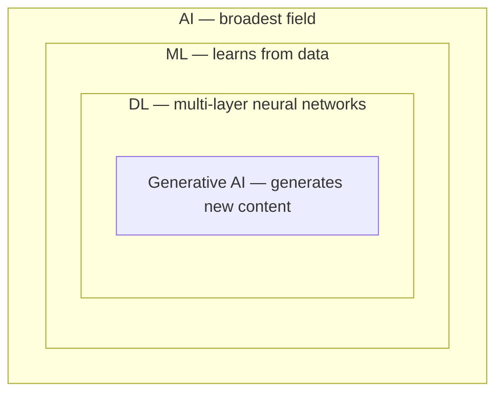
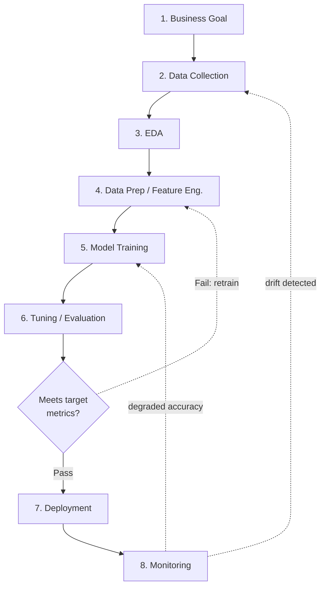
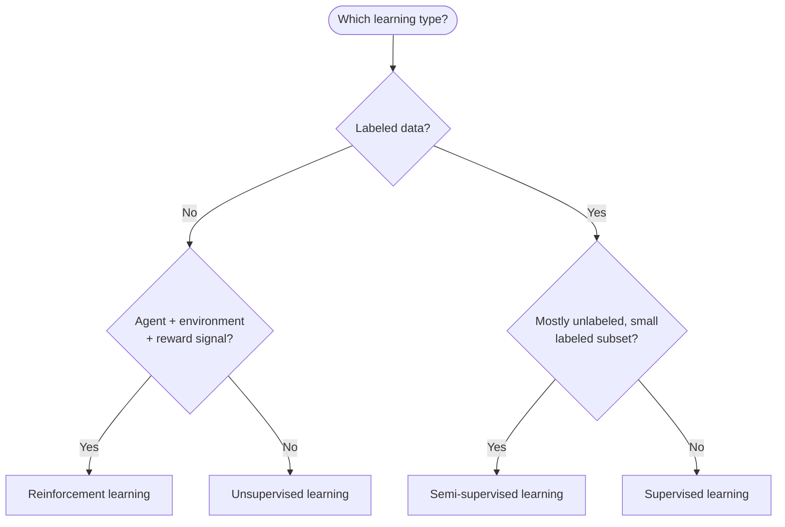
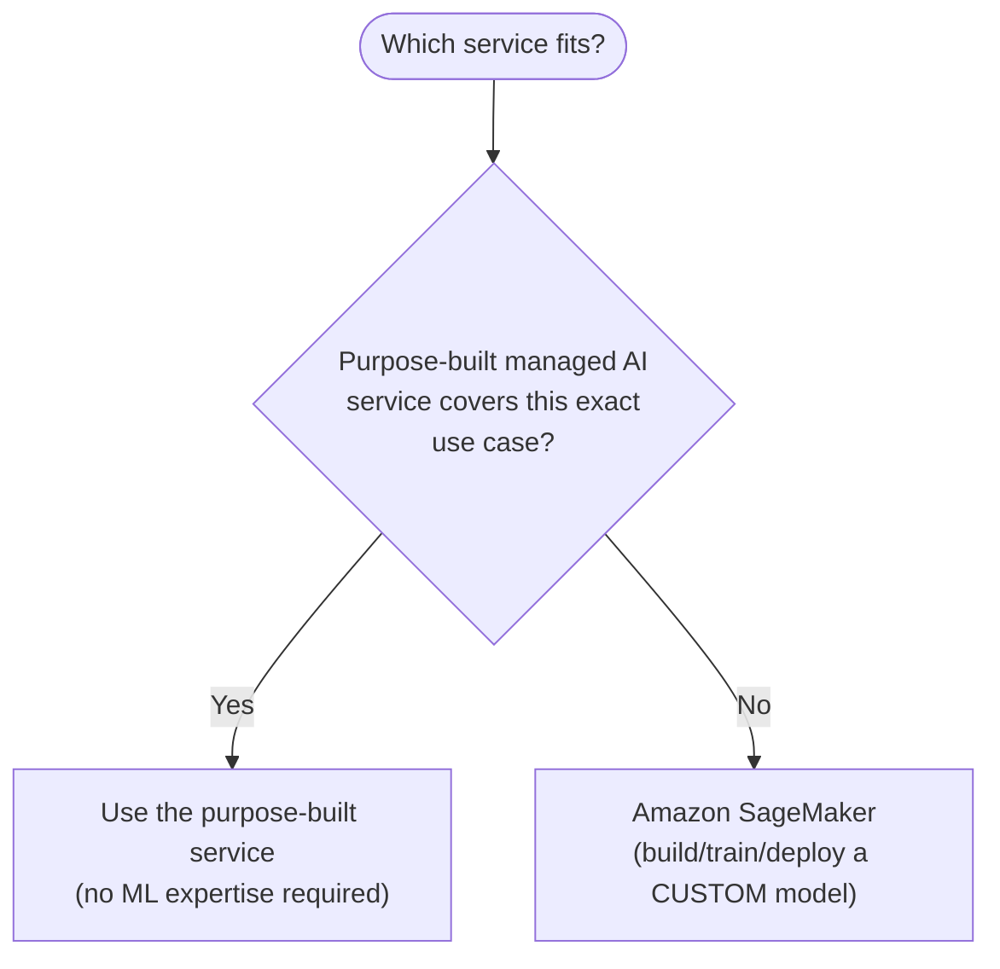
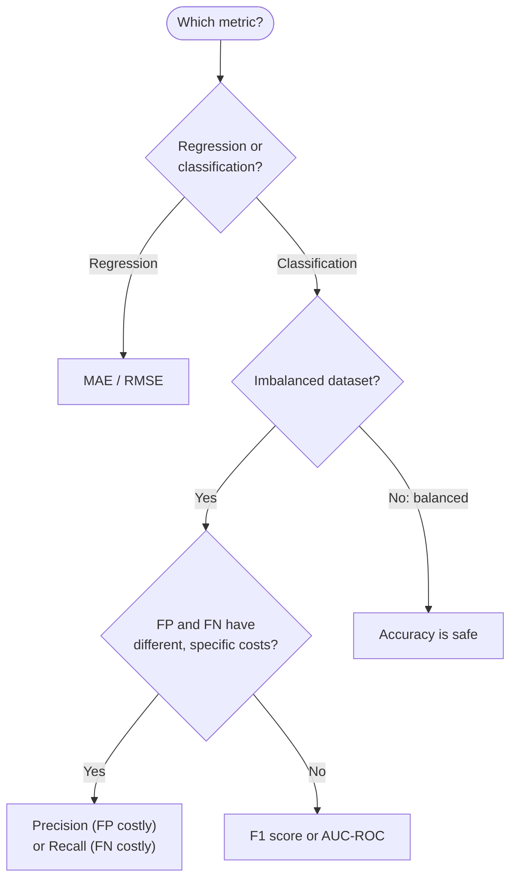
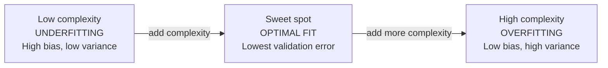

# Domain 1 Fast Track: Fundamentals of AI and ML

**Condensed guide** · full guide: [`docs/domain-1-fundamentals-of-ai-and-ml.md`](../domain-1-fundamentals-of-ai-and-ml.md) (2,030 lines) · **Last verified:** 2026-09-05

## How to use this fast track

This is a ~40%-length condensation of the full Domain 1 study guide, built
on top of that guide's own [Quick-reference cheat
sheet](../domain-1-fundamentals-of-ai-and-ml.md#quick-reference-cheat-sheet)
(line 1524) and expanded with the comparison tables and decision tables
needed to stand on its own as a fast pre-exam review. It keeps **every
testable concept** from the source — the AI/ML/DL hierarchy, the 8-stage
ML lifecycle, the three learning types, the domain's AWS managed
services, every model evaluation metric, the bias–variance trade-off, and
all three ensemble methods — while trimming the worked-example narration,
step-by-step scenarios, and repeated "AWS example" paragraphs down to
their one-line takeaways. Every section links back to the corresponding
section of the full guide for the complete explanation, worked examples,
and practice questions.

Domain 1 makes up roughly **20% of scored questions** on the AWS
Certified AI Practitioner (AIF-C01) exam — the single largest domain.
Read this fast track the day before the exam, or any time you already
know the material and just need the tables refreshed; read the [full
guide](../domain-1-fundamentals-of-ai-and-ml.md) first if any of these
terms are new to you. For an even more condensed version — bullets and
tables only, no prose, meant for the last 15-20 minutes before the exam —
see
[`ULTRA-FAST-LEARN.md`](ULTRA-FAST-LEARN.md).

**Where each section comes from**, for jumping straight to the full
prose, mini-quiz, and AWS example behind any condensed table below:

| This fast track | Full guide section | Approx. full-guide lines |
|---|---|---|
| 1. AI/ML/DL terminology | [Section 1](../domain-1-fundamentals-of-ai-and-ml.md#1-basic-aimldl-terminology-and-concepts) | 53–176 |
| 2. The ML development lifecycle | [Section 2](../domain-1-fundamentals-of-ai-and-ml.md#2-the-ml-development-lifecycle) + Autopilot + deployment-strategies subsections | 178–687 |
| 3. Three learning types | [Section 3](../domain-1-fundamentals-of-ai-and-ml.md#3-types-of-learning) | 688–787 |
| 4. Common use cases for AI/ML | [Section 4](../domain-1-fundamentals-of-ai-and-ml.md#4-common-use-cases-for-aiml) | 789–896 |
| 5. AWS managed AI/ML services | [Section 5](../domain-1-fundamentals-of-ai-and-ml.md#5-aws-managed-aiml-services-conceptual-overview) + [Ground Truth subsection](../domain-1-fundamentals-of-ai-and-ml.md#amazon-sagemaker-ground-truth-data-labeling-and-when-not-to-use-it) | 898–1089 |
| 6. Model evaluation basics | [Section 6](../domain-1-fundamentals-of-ai-and-ml.md#6-model-evaluation-basics) | 1090–1240 |
| 7. Bias–variance trade-off and ensemble methods | [Section 7](../domain-1-fundamentals-of-ai-and-ml.md#7-overfitting-underfitting-and-the-biasvariance-trade-off) + [Ensemble methods subsection](../domain-1-fundamentals-of-ai-and-ml.md#ensemble-methods-bagging-boosting-and-voting) | 1242–1416 |
| Condensed worked example | [Worked example: end-to-end ML lifecycle](../domain-1-fundamentals-of-ai-and-ml.md#worked-example-end-to-end-ml-lifecycle-for-a-loan-default-predictor) | 1418–1499 |
| Rapid-fire key terms | [Key terms glossary](../domain-1-fundamentals-of-ai-and-ml.md#key-terms-glossary) (33 terms, condensed to the highest-yield ~30 here) | 1611–1658 |

## Table of contents

- [1. AI/ML/DL terminology](#1-aimldl-terminology)
- [2. The ML development lifecycle](#2-the-ml-development-lifecycle)
- [3. Three learning types](#3-three-learning-types)
- [4. Common use cases for AI/ML](#4-common-use-cases-for-aiml)
- [5. AWS managed AI/ML services](#5-aws-managed-aiml-services)
- [6. Model evaluation basics](#6-model-evaluation-basics)
- [7. Bias–variance trade-off and ensemble methods](#7-biasvariance-trade-off-and-ensemble-methods)
- [AWS example scenarios at a glance](#aws-example-scenarios-at-a-glance)
- [Commonly confused term pairs](#commonly-confused-term-pairs)
- [Condensed worked example: end-to-end loan-default predictor](#condensed-worked-example-end-to-end-loan-default-predictor)
- [Rapid-fire key terms](#rapid-fire-key-terms)
- [Rapid self-check](#rapid-self-check)
- [Common exam traps checklist](#common-exam-traps-checklist)
- [Cross-domain connections](#cross-domain-connections)
- [Where to go deeper](#where-to-go-deeper)

---

## 1. AI/ML/DL terminology

The exam repeatedly tests the **nesting relationship** between four
fields, from broadest to narrowest:

```
AI  ⊃  ML  ⊃  DL  ⊃  Generative AI
```

- **Artificial Intelligence (AI)** — the broad field of building systems
  that perform tasks normally requiring human intelligence.
- **Machine Learning (ML)** — a subset of AI where a system *learns
  patterns from data* instead of following explicit, hand-written rules,
  producing a **model** that generalizes to new inputs.
- **Deep Learning (DL)** — a subset of ML using multi-layer **neural
  networks** that automatically learn hierarchical feature
  representations from raw or lightly processed data (pixels, audio,
  text), removing most manual feature engineering for unstructured data.
- **Generative AI** — a subset of DL, usually built on the transformer
  architecture, that *generates* new content (text, images, code, audio)
  instead of only predicting a label or number. Covered in depth in
  [Domain 2, Section 1](../domain-2-fundamentals-of-generative-ai.md#1-generative-ai-core-concepts).



**Other core vocabulary you must know cold:**

| Term | Definition | Distinguishing signal |
|---|---|---|
| **Model** | The artifact produced by training — learned parameters that map inputs to outputs | — |
| **Algorithm** | The method used to learn the model (XGBoost, linear regression, k-means, a CNN architecture) | — |
| **Parameter** | A value the model **learns automatically** during training (e.g., a neural network weight) | *Learned*, not configured |
| **Hyperparameter** | A value a human **sets before** training (learning rate, number of trees, epochs, batch size); **SageMaker automatic model tuning** searches these | *Configured by a person*, before training starts |
| **Training data / labels** | Historical examples (and, for supervised learning, correct answers) used to fit the model | — |
| **Inference** | Using a trained model to predict on new data | Real-time / batch / async / serverless (below) |

**Inference deployment patterns** — AWS distinguishes four, compared side
by side in the [cross-domain concept map's inference deployment pattern
comparison](../cross-domain-concept-map.md#inference-deployment-pattern-comparison):

| Pattern | Latency | Best for |
|---|---|---|
| **Real-time inference** | Low-latency, persistent endpoint | Interactive requests needing an immediate response |
| **Batch inference** | Minutes to hours, offline | Large offline jobs run on a schedule |
| **Asynchronous inference** | Minutes-long, queued | Large payloads that can wait, queued rather than served instantly |
| **Serverless inference** | Auto-scales to zero | Intermittent/unpredictable traffic |

> **Exam tip:** Distractors love reversing the nesting order (e.g., "ML is
> a type of deep learning") — memorize AI ⊃ ML ⊃ DL ⊃ Generative AI.
> Also expect a parameter-vs-hyperparameter question: parameters are
> *learned*; hyperparameters are *configured by a person before
> training*. A workload with **large payloads that can tolerate minutes
> of processing and should be queued** is **asynchronous inference**, not
> batch (scheduled offline jobs) or serverless (intermittent traffic).

Full explanation, the SageMaker umbrella-platform AWS example, and
mini-quiz: [full guide, Section
1](../domain-1-fundamentals-of-ai-and-ml.md#1-basic-aimldl-terminology-and-concepts).

---

## 2. The ML development lifecycle

AIF-C01 expects you to know the standard, ordered **8-stage** ML
lifecycle and which AWS tool supports each stage:

| # | Stage | Key AWS tools | Loop-back trigger |
|---|---|---|---|
| 1 | Business goal identification | (define the problem + success metric first — no tooling) | — |
| 2 | Data collection | Amazon S3, AWS Glue, Amazon Kinesis / MSK | Drift/degraded accuracy detected in step 8 |
| 3 | Exploratory data analysis (EDA) | SageMaker Data Wrangler, SageMaker Studio, Amazon Athena | — |
| 4 | Data preparation / feature engineering | SageMaker Data Wrangler, **SageMaker Feature Store** | Failed evaluation in step 6 |
| 5 | Model training | SageMaker Training Jobs, SageMaker JumpStart, Managed Spot Training | Degraded accuracy detected in step 8 |
| 6 | Hyperparameter tuning / evaluation | SageMaker automatic model tuning, SageMaker Clarify | **Decision gate:** pass → step 7; fail → step 4 |
| 7 | Deployment | SageMaker endpoints (real-time), batch transform, serverless/async inference | — |
| 8 | Monitoring | SageMaker Model Monitor, Amazon CloudWatch | — |



This is an **iterative loop, not a waterfall**: memorize the order —
collect → explore (EDA) → prepare/feature-engineer → train →
evaluate/tune → deploy → monitor. Step 6 is a **decision gate**: a
**failed** evaluation loops back to feature engineering (step 4), not to
step 1 or straight to deployment; drift/degraded accuracy caught during
monitoring (step 8) loops back to data collection (step 2) or retraining
(step 5). **SageMaker Feature Store** exists specifically to prevent
**training/serving skew** — it is a feature repository, not a labeling
tool (that's Ground Truth, [Section 5](#5-aws-managed-aiml-services)).

**SageMaker Autopilot** sits *across* several stages at once: given a
tabular dataset and a target column, it automates EDA, feature
engineering (fixed, built-in transformations only), algorithm selection,
and hyperparameter tuning, producing a leaderboard plus an explainability
notebook.

| Use Autopilot when... | Use manual SageMaker training when... |
|---|---|
| You need a fast baseline / rapid prototype | The scenario names a **custom loss function** |
| The team has limited ML expertise | The scenario needs **domain-specific feature engineering** beyond generic imputation/encoding/scaling |
| The dataset is tabular; the problem is standard classification/regression | The scenario needs a **novel model architecture**, or the data is image/audio/unstructured text |

**Managed Spot Training vs. On-Demand** — step 5's other cost lever.
Instance choice for classical ML (XGBoost, Linear Learner, k-NN) is driven
by **memory-to-data-size fit**, not raw vCPU count or a GPU — a
single-instance CPU algorithm gets zero benefit from a GPU instance, since
the GPU sits idle. Once the instance is sized, choose the billing model:

| | Managed Spot Training | On-Demand training |
|---|---|---|
| **Cost** | Up to ~90% cheaper (spare EC2 capacity) | Full price, no discount |
| **Risk** | Can be reclaimed with a 2-minute interruption notice | Never interrupted |
| **Requires** | Periodic **checkpointing** to S3 (`checkpoint_s3_uri`) so an interruption resumes from the last checkpoint, not from 0% | No special handling |
| **Billing** | Only actual compute seconds consumed — not time spent waiting for replacement capacity | Billed for the full run |
| **Best for** | Routine retraining with no fixed deadline (can tolerate a longer wall-clock time) | A drift-triggered emergency retrain under a strict compliance SLA (e.g., must redeploy within 24 hours) |

Skipping the checkpoint step is the trap: without one to resume from, an
interrupted job restarts from **0% progress**, and repeated interruptions
can burn through the entire wait-time budget without ever finishing —
turning an intended cost saving into a missed retrain.

**Production deployment strategies** roll out a new model version safely.
Distinguish by **intent**, not mechanics:

| Pattern | What it does | Intent |
|---|---|---|
| **Canary** | Route a small % of traffic (e.g. 5%) to the new version, gradually increasing while monitoring | Safely roll out one new version, gradually |
| **Blue/green** | Run the new version on a separate fleet, cut traffic over all at once, instant rollback | Safely roll out one new version, all at once |
| **A/B testing** | Split live traffic between two+ versions deliberately, for as long as needed | **Compare** two versions' real-world performance, both kept running on purpose |
| **Shadow deployment** | Send a copy of live traffic to the new version; its predictions never reach users | **Validate** a new version with zero user-facing risk |

**Amazon SageMaker Model Registry** catalogs trained model versions
(grouped into model package groups), stores each version's evaluation
metrics/lineage, and lets a reviewer **approve or reject** a version
before deployment — the auditable "which exact artifact is live" record.
It is *not* Model Monitor (watches an already-deployed model for drift)
and *not* Model Cards (documents intended use/limitations, covered in
[Domain 4](../domain-4-guidelines-for-responsible-ai.md#3-aws-tools-for-responsible-ai)).
A typical flow: train → register as "Pending manual approval" → reviewer
inspects metrics (incl. SageMaker Clarify bias metrics) → sets status to
"Approved" → a deployment pipeline (e.g. SageMaker Pipelines) rolls the
approved version out via canary or blue/green.

> **Exam tip:** "What is the **next** step" or "what's missing" from a
> lifecycle description tests the memorized order above. "Which service
> tracks model versions and requires reviewer approval before deployment"
> → **SageMaker Model Registry**. A scenario emphasizing gradual traffic
> shift with automatic rollback → **canary**; an instant all-at-once
> cutover with instant fallback → **blue/green**; deliberately comparing
> two live versions' business metrics → **A/B testing**; validating a new
> version with zero user-facing risk → **shadow deployment**.

Full explanation, the cost-estimation worked example (managed Spot vs.
on-demand training), and the canary-via-Model-Registry worked example:
[full guide, Section
2](../domain-1-fundamentals-of-ai-and-ml.md#2-the-ml-development-lifecycle).

---

## 3. Three learning types

| Type | Data | Distinguisher | AWS SageMaker examples |
|---|---|---|---|
| **Supervised** | Labeled | Predicts a known target — classification or regression | Linear Learner, XGBoost, k-NN |
| **Unsupervised** | Unlabeled | Finds structure with no target column — clustering or dimensionality reduction | k-means, PCA, Random Cut Forest |
| **Reinforcement (RL)** | None (trial-and-error) | An **agent** takes **actions** in an **environment** to maximize cumulative **reward** | Amazon SageMaker RL, AWS DeepRacer |
| Semi-supervised *(lower emphasis)* | Small labeled + large unlabeled pool | Labeling is expensive, so most data stays unlabeled | — |



**If–then lookup:**

- No labels, agent + environment + reward → **reinforcement learning**
- No labels, finds structure on its own → **unsupervised learning**
- Mostly unlabeled + a small labeled subset → **semi-supervised learning**
- Fully labeled target column → **supervised learning**

> **Exam tip:** The single most common trap — data with **no
> labels/target column** is **unsupervised**, even when the described
> goal sounds like "prediction." RL is defined by *agent + environment +
> reward*, not merely "no labels" — don't conflate it with unsupervised
> learning.

Full explanation, the bank fraud/segmentation/robot AWS example, and
mini-quiz: [full guide, Section
3](../domain-1-fundamentals-of-ai-and-ml.md#3-types-of-learning).

---

## 4. Common use cases for AI/ML

Match the **verb** in a scenario to the AI/ML problem category, top to
bottom, and stop at the first branch that fits:

| Scenario verb | Problem category | AWS service |
|---|---|---|
| "flag fraudulent transactions/accounts/claims" | Fraud detection | **Amazon Fraud Detector** (or custom SageMaker model) |
| "recommend products/content" | Recommendation systems | **Amazon Personalize** |
| "predict future demand/inventory/staffing" | Forecasting | **Amazon Forecast** |
| "extract information from images/video" | Computer vision | **Amazon Rekognition** |
| "understand/extract meaning from plain text" | NLP | **Amazon Comprehend** |
| "convert speech to text" | Speech-to-text | **Amazon Transcribe** |
| "convert text to speech" | Text-to-speech | **Amazon Polly** |
| "pull text/forms/tables from scanned documents" | Document processing (IDP) | **Amazon Textract** |
| "build a voice/text chatbot" | Conversational AI | **Amazon Lex** |
| "translate between languages" | Language translation | **Amazon Translate** |

> **Exam tip:** Read for the **verb**, not the industry. "Read this
> scanned form" is **Textract** (layout/structure extraction), not
> **Comprehend** (which analyzes plain-text *meaning*, not document
> layout) — a frequent distractor pairing.

Full explanation, the four-services-one-insurer AWS example, and
mini-quiz: [full guide, Section
4](../domain-1-fundamentals-of-ai-and-ml.md#4-common-use-cases-for-aiml).

---

## 5. AWS managed AI/ML services

| Service | Category | Primary input | When to choose it over SageMaker |
|---|---|---|---|
| **Amazon SageMaker** | ML platform | Tabular, image, text, any | Need a bespoke model/algorithm not covered below |
| **Amazon Rekognition** | Computer vision | Image / video | Standard vision tasks; no ML expertise needed |
| **Amazon Transcribe** | Speech-to-text | Audio / video | Off-the-shelf ASR, diarization, PII redaction |
| **Amazon Comprehend** | NLP | Text | Standard text analytics (sentiment, entities, PII, topics) |
| **Amazon Polly** | Text-to-speech | Text | Any TTS need, no custom voice model |
| **Amazon Translate** | Machine translation | Text | Standard translation |
| **Amazon Lex** | Conversational AI | Text / voice | Building a chatbot/voice bot interface |
| **Amazon Personalize** | Recommendations | User/item interaction data | Recommendation use case, no ML expertise |
| **Amazon Forecast** | Forecasting | Time-series data | Time-series forecasting, no ML expertise |
| **Amazon Textract** | Document extraction | Scanned documents/images | Need structured extraction (tables, key-value), not plain OCR |
| **Amazon Fraud Detector** | Fraud detection | Transaction/account data | Fraud use case, no custom classifier |



**Golden rule:** if a purpose-built managed AI service matches the
described task, it beats **Amazon SageMaker** — SageMaker wins only when
the use case needs a **custom** model/algorithm or full control.

**SageMaker Ground Truth** is a **human-in-the-loop data labeling**
service (not an inference service) — it *produces* the labeled training
data a supervised model later learns from, combining active learning
(auto-labels confident examples) with human reviewers for ambiguous ones.

| Approach | What it does | Exam-correct when... |
|---|---|---|
| **SageMaker Ground Truth** | Managed human-in-the-loop labeling + built-in active learning | Large pool of **real, unlabeled** data, minimize labeling cost/time |
| **Manual labeling** | People label every record by hand | Small dataset (tens–hundreds of records), quick PoC |
| **SageMaker Data Wrangler** | Cleans/transforms/joins **already-labeled** data | Data is labeled but needs prep/feature engineering, not labels |
| **Active learning (standalone)** | Baseline model picks the *next* most-informative unlabeled examples to label | Tight labeling budget, iterative train → query → label → retrain loop |
| **Weak supervision** | Combines noisy rules/heuristics into probabilistic labels, little manual labeling | Labels needed fast/cheap at scale; experts can express rules |
| **Synthetic data generation** | Manufactures artificial labeled examples | Real data scarce/sensitive/expensive, or a rare class/edge case |

> **Exam tip:** No ML expertise + standard task (vision/speech/text/
> forecast/rec) → the **purpose-built service**, not SageMaker. Among the
> labeling/data-prep options, the deciding detail is the **named
> constraint**: labeling *budget* → active learning; speed/scale with
> *expressible rules* → weak supervision; scarce/rare/sensitive data →
> synthetic data; large genuinely unlabeled pool, no shortcut → Ground
> Truth; already labeled, needs cleaning → Data Wrangler.

Full explanation, the media-company/fraud-team/ticket-classifier AWS
examples, and mini-quizzes: [full guide, Section
5](../domain-1-fundamentals-of-ai-and-ml.md#5-aws-managed-aiml-services-conceptual-overview).

---

## 6. Model evaluation basics

Evaluation happens on a held-out validation/test set the model never
trained on. Start from the **confusion matrix** (binary classification):

|  | Predicted Positive | Predicted Negative |
|---|---|---|
| **Actual Positive** | True Positive (TP) | False Negative (FN) |
| **Actual Negative** | False Positive (FP) | True Negative (TN) |

| Metric | Formula | Answers | Use when |
|---|---|---|---|
| **Accuracy** | (TP + TN) / (TP + TN + FP + FN) | Overall % correct | Classes are **roughly balanced** |
| **Precision** | TP / (TP + FP) | Of flagged-positive, how much was real? | **False positives** are costly |
| **Recall (Sensitivity)** | TP / (TP + FN) | Of actual positives, how many caught? | **False negatives** are costly |
| **F1 score** | 2 × (P × R) / (P + R) | Balanced precision/recall | **Imbalanced classes**, no single asymmetric cost |
| **AUC-ROC** | Area under TPR-vs-FPR curve | Ranking quality across all thresholds | Compare models independent of one fixed threshold (1.0 = perfect, 0.5 = random) |
| **RMSE / MAE** | Avg. distance between predicted & actual numbers | Regression error size | Target is a **continuous number**, not a category |



**Scenario → metric table:**

| Use case | Class balance | Costliest error | Metric |
|---|---|---|---|
| Fraud detection | Highly imbalanced | Missed fraud (FN) | **Recall** |
| Spam filtering | Imbalanced | Legit email flagged (FP) | **Precision** |
| Disease screening | Imbalanced | Missed case (FN) | **Recall** |
| Loan-default prediction | Imbalanced | Both directions matter | **F1** |
| General product classifier | Roughly balanced | No single asymmetric cost | **Accuracy** |
| House-price prediction | N/A (regression) | N/A | **RMSE / MAE** |

**Worked interpretation check:** TP = 32, FP = 18, FN = 8, TN = 942 (1,000
held-out loan applications). Precision = 32/(32+18) = **64%**. Recall =
32/(32+8) = **80%**. F1 = 2×(0.64×0.80)/(0.64+0.80) ≈ **0.71**. Recall
exceeds precision here — the model misses fewer actual defaulters than it
wrongly flags good applicants.

> **Exam tip:** **Accuracy paradox** — a fraud model on 99% "not fraud"
> data scores 99% accuracy while catching zero fraud; whenever a scenario
> mentions **class imbalance**, look for precision, recall, F1, or
> AUC-ROC instead of plain accuracy. Raising the classification threshold
> → **precision up, recall down** (and vice versa) — memorize the
> direction, not just that a trade-off exists.

Full explanation, the SageMaker Clarify/Model Monitor AWS example, and
mini-quiz: [full guide, Section
6](../domain-1-fundamentals-of-ai-and-ml.md#6-model-evaluation-basics).

---

## 7. Bias–variance trade-off and ensemble methods

| | Underfitting (high bias) | Overfitting (high variance) |
|---|---|---|
| **Symptom** | Poor on **both** training and test data | Great on training, poor on test/validation |
| **Root cause** | Model too simple to capture the pattern | Model memorizes training-data noise |
| **Fixes** | More complex model, more/better features, train longer, less regularization | More data, simpler model, regularization (L1/L2, dropout), cross-validation, early stopping, feature selection, data augmentation, **ensembling** |



Total error = Bias² + Variance + irreducible error, minimized at the
model-complexity "sweet spot." Reducing one of bias/variance typically
increases the other.

**Ensemble methods** — a third, architectural remedy beyond "more data"
or "regularize," strongest for **structured/tabular** data:

| Method | Base models | Training pattern | Primarily reduces | Canonical algorithm |
|---|---|---|---|---|
| **Bagging** (bootstrap aggregating) | Same model, many instances | Parallel, each on a random bootstrap sample | **Variance** | Random Forest |
| **Boosting** | Same model, many instances | Sequential — each stage fixes prior errors | **Bias** (also handles weak learners) | Gradient Boosting / SageMaker XGBoost |
| **Voting** | Different model types | Parallel, same full dataset, combine by majority/average | Errors from **diverse** algorithms canceling out | Logistic regression + decision tree + k-NN, etc. |

Bagging trains many decorrelated trees on different bootstrap samples and
averages/votes their predictions — largely uncorrelated errors cancel
out, reducing variance without adding much bias. Boosting trains stages
sequentially, each correcting the prior stage's residuals/misclassified
examples — it reduces bias but is more overfitting-prone than bagging
(fix: fewer rounds/early stopping, shallower trees, lower learning rate).
Voting's diversity comes from combining *different algorithms* on the
same data, helping most when the models make different kinds of errors.

> **Exam tip:** "Great on training, bad on test/production" =
> **overfitting/high variance**; "bad on **both**" = **underfitting/high
> bias**. Structured/tabular data + overfitting + a fix beyond "more
> data"/"regularize" → an **ensemble method** (bagging/Random Forest for
> variance, boosting/XGBoost for bias). The same overfitting symptom on
> **image/audio/text** data is a distractor for tree ensembles — decision
> trees can't learn spatial/sequential structure; the fix is a **deep
> learning architecture** (CNN/transformer) or the matching purpose-built
> AWS AI service, not more trees.

Full explanation, the image-classifier and logistics-delivery AWS
examples, and mini-quizzes: [full guide, Section
7](../domain-1-fundamentals-of-ai-and-ml.md#7-overfitting-underfitting-and-the-biasvariance-trade-off).

---

## AWS example scenarios at a glance

Each numbered section's full "AWS example" paragraph condensed to a
one-row recap — useful for pattern-matching a new scenario against a
known one fast:

| Section | Scenario | Services/concepts it exercises |
|---|---|---|
| 1. Terminology | SageMaker is positioned as the umbrella platform spanning the AI/ML/DL spectrum, not tied to one layer | SageMaker as an any-layer ML platform |
| 2. Lifecycle | A retailer builds a churn model: S3 → Data Wrangler → Feature Store → XGBoost Training Jobs → automatic model tuning → real-time endpoint → Model Monitor | Full 8-stage lifecycle, one company, one model |
| 2. Deployment strategies | A ride-sharing company retrains a fare-estimation model weekly, registers each version in Model Registry, and rolls the approved one out as a canary (5% → 25% → 100%) | SageMaker Model Registry, canary deployment |
| 3. Learning types | A bank uses supervised classification (XGBoost) for fraud, unsupervised clustering (k-means) for customer segments, and RL for a warehouse robot | All three learning types in one organization |
| 4. Use cases | An insurer flags fraudulent claims, recommends add-on policies, forecasts claim volume, and extracts data from scanned forms | Fraud Detector, Personalize, Forecast, Textract — four services, four categories |
| 5. AWS services | A media company moderates images (Rekognition), transcribes video (Transcribe), and builds a support chatbot (Lex) — no custom training for any of them | Three purpose-built services, zero custom models |
| 5. Ground Truth | 100,000 unlabeled images need bounding-box labels; Ground Truth's active learning auto-labels confident cases and routes only ambiguous ones to human reviewers | SageMaker Ground Truth, active learning |
| 6. Evaluation | A fraud model on 99%-imbalanced data reports 99% accuracy but only 40% recall — Clarify and Model Monitor surface the real picture | Accuracy paradox, SageMaker Clarify, Model Monitor |
| 7. Bias–variance | An image classifier hits 99% training accuracy but 65% validation accuracy — classic overfitting, fixed with automatic model tuning and data augmentation | Overfitting diagnosis and remedies |
| 7. Ensembles | A delivery-time classifier's single decision tree overfits (97% train / 71% validation); switching to Random Forest (bagging) and XGBoost (boosting) closes most of the gap | Bagging vs. boosting on the same overfitting symptom |

---

## Commonly confused term pairs

The exam's distractor answers usually swap in one of these look-alike
terms — knowing the *distinguishing question* for each pair is worth more
than memorizing either definition alone:

| Pair | Distinguishing question | Answer |
|---|---|---|
| **Parameter** vs. **hyperparameter** | Is it *learned during training* or *configured by a human before training*? | Learned → parameter; configured beforehand → hyperparameter |
| **Unsupervised learning** vs. **reinforcement learning** | Is there an *agent + environment + reward*, or just *unlabeled structure-finding*? | Agent/environment/reward → RL; structure-finding only → unsupervised |
| **SageMaker** vs. a purpose-built AI service | Does the use case need a *custom* model/algorithm, or does an existing purpose-built service already cover it? | Custom/novel → SageMaker; standard task → purpose-built service |
| **Amazon Textract** vs. **Amazon Comprehend** | Is the task *extracting layout/structure* from a document, or *analyzing the meaning* of plain text? | Layout/structure → Textract; meaning/sentiment → Comprehend |
| **SageMaker Ground Truth** vs. **SageMaker Data Wrangler** | Is the data *unlabeled and needs labels*, or *already labeled and needs cleaning/prep*? | Needs labels → Ground Truth; already labeled → Data Wrangler |
| **Underfitting** vs. **overfitting** | Is performance *poor on both* training and test data, or *great on training, poor on test*? | Poor on both → underfitting/high bias; great-then-poor → overfitting/high variance |
| **Bagging** vs. **boosting** | Are base models trained *in parallel on bootstrap samples*, or *sequentially correcting prior errors*? | Parallel/bootstrap → bagging (reduces variance); sequential/corrective → boosting (reduces bias) |
| **Precision** vs. **recall** | Is a *false positive* or a *false negative* the costlier mistake in this scenario? | False positive costly → precision; false negative costly → recall |
| **SageMaker Model Registry** vs. **SageMaker Model Monitor** | Does the scenario need to *approve/track a version before deployment*, or *watch an already-deployed model for drift*? | Approval/tracking → Model Registry; post-deployment drift → Model Monitor |
| **Canary/blue-green** vs. **A/B testing** vs. **shadow deployment** | Is the goal to *safely roll out* one version, *deliberately compare* two live versions, or *validate with zero user-facing risk*? | Safe rollout → canary/blue-green; deliberate comparison → A/B testing; zero risk → shadow |
| **Statistical bias** (this domain) vs. **fairness bias** ([Domain 4](../domain-4-guidelines-for-responsible-ai.md#2-identifying-bias-and-fairness-issues-in-training-data-and-model-outputs)) | Is this about *how well a model fits the data*, or about *unfair outcomes across groups of people*? | Model fit → statistical bias (this domain); unfair outcomes → fairness bias (Domain 4) |

---

## Condensed worked example: end-to-end loan-default predictor

The full guide strings all eight lifecycle stages together in one
scenario — a regional bank predicting loan default at application time —
because that is exactly how AIF-C01 scenario questions are written (one
paragraph describing several stages, then asking what happens next or
what was done wrong). Condensed to its stage-by-stage decisions:

1. **Business goal:** minimize missed defaults while keeping false
   declines low — points toward **recall-sensitive** evaluation later.
2. **Data collection:** five years of historical applications with
   repaid/defaulted outcomes, landed in **Amazon S3**.
3. **EDA:** **SageMaker Data Wrangler** reveals class imbalance (most
   loans are repaid) — flags that plain accuracy will mislead later.
4. **Feature engineering:** derived features (debt-to-income ratio) built
   and stored in **SageMaker Feature Store** to keep training and serving
   consistent.
5. **Training:** **SageMaker XGBoost** (a supervised, boosting algorithm)
   trained via a Training Job, using **Managed Spot Training** to cut
   cost.
6. **Evaluation:** because of the class imbalance flagged in step 3, the
   team evaluates with **F1** (both false declines and missed defaults
   matter), not accuracy — this is the [Section 6](#6-model-evaluation-basics)
   "loan-default → F1" row in practice, not just in the abstract.
7. **Deployment:** the approved candidate is registered in **SageMaker
   Model Registry** and rolled out via **canary** (10% → 50% → 100%
   traffic, soaking at each stage).
8. **Monitoring:** **SageMaker Model Monitor** watches for data/concept
   drift; a degraded-accuracy alert loops back to retraining (step 5).

> **Exam tip:** A scenario paragraph that touches several lifecycle
> stages at once is testing whether you can trace how an *earlier*
> decision (e.g., class imbalance found in EDA) constrains a *later* one
> (e.g., F1 instead of accuracy) — not just whether you can name each
> stage in isolation.

Full step-by-step walkthrough with exact numbers: [full guide, Worked
example](../domain-1-fundamentals-of-ai-and-ml.md#worked-example-end-to-end-ml-lifecycle-for-a-loan-default-predictor).

---

## Rapid-fire key terms

- **AI** — systems performing tasks that normally require human
  intelligence.
- **ML** — systems that learn patterns from data instead of explicit
  rules.
- **DL** — multi-layer neural networks that learn representations
  automatically.
- **Generative AI** — a subset of DL that generates new content rather
  than only predicting a label/number.
- **Parameter** — a value learned during training (e.g., a neural network
  weight).
- **Hyperparameter** — a configuration value set before training (e.g.,
  learning rate).
- **Inference** — using a trained model to predict on new data; real-time,
  batch, asynchronous, or serverless.
- **Feature engineering** — cleaning, transforming, encoding, and
  selecting model inputs.
- **SageMaker Feature Store** — centralized, versioned feature
  repository; prevents training/serving skew.
- **SageMaker Autopilot** — automates data prep, algorithm selection, and
  tuning for tabular data; can't do custom loss functions or
  domain-specific feature engineering.
- **SageMaker Model Registry** — catalogs model versions, stores
  evaluation metrics, and gates deployment behind reviewer approval.
- **Canary deployment** — gradually shift traffic to a new model version
  while monitoring.
- **Blue/green deployment** — instant cutover to a new version with
  instant rollback.
- **A/B testing** — deliberately compares two live model versions'
  real-world performance.
- **Shadow deployment** — validates a new version on live traffic with
  zero user-facing risk.
- **Supervised learning** — trains on labeled data; classification or
  regression.
- **Unsupervised learning** — trains on unlabeled data; clustering or
  dimensionality reduction.
- **Reinforcement learning** — an agent maximizes cumulative reward
  through trial and error in an environment.
- **SageMaker Ground Truth** — human-in-the-loop data labeling with
  active learning.
- **Confusion matrix** — TP/FP/FN/TN table underlying every
  classification metric.
- **Precision** — TP / (TP + FP); few false alarms.
- **Recall** — TP / (TP + FN); few missed positives.
- **F1 score** — harmonic mean of precision and recall.
- **AUC-ROC** — ranking quality across all classification thresholds.
- **RMSE / MAE** — regression error metrics; lower is better.
- **Underfitting / high bias** — model too simple; poor on both training
  and test data.
- **Overfitting / high variance** — model too sensitive to training
  noise; poor generalization.
- **Regularization** — L1/L2 penalty or dropout that discourages overly
  complex models.
- **Bagging** — parallel ensemble on bootstrap samples; reduces variance
  (Random Forest).
- **Boosting** — sequential ensemble correcting prior errors; reduces
  bias (Gradient Boosting/XGBoost).
- **Voting** — combines different model types by majority vote or
  averaged probabilities.
- **SageMaker Model Monitor** — watches a deployed endpoint for data/
  concept drift.

For the complete 33-term glossary with full definitions: [full guide, Key
terms
glossary](../domain-1-fundamentals-of-ai-and-ml.md#key-terms-glossary).
For terms shared across domains:
[`docs/master-glossary.md`](../master-glossary.md).

---

## Rapid self-check

Fifteen quick recall questions — cover the answer column and try each one
before checking it. These are new questions, not a repeat of the full
guide's practice set.

| # | Question | Answer |
|---|---|---|
| 1 | Which nests inside which: AI, ML, DL, Generative AI? | **AI ⊃ ML ⊃ DL ⊃ Generative AI** |
| 2 | A team sets the learning rate to 0.01 before training — parameter or hyperparameter? | **Hyperparameter** — set by a human before training |
| 3 | A failed evaluation gate (lifecycle step 6) loops back to which step? | **Step 4 — feature engineering** |
| 4 | Which SageMaker capability exists specifically to prevent training/serving skew? | **SageMaker Feature Store** |
| 5 | A dataset has no labels and no target column, but the goal "sounds like prediction" — which learning type? | **Unsupervised learning** |
| 6 | What three elements define reinforcement learning? | **Agent, environment, and reward** |
| 7 | A company has no ML expertise and wants facial analysis — which service? | **Amazon Rekognition**, not SageMaker |
| 8 | 100,000 unlabeled images need bounding-box labels, no existing model or heuristics — which approach? | **SageMaker Ground Truth** |
| 9 | On a 99%-negative dataset, a model that always predicts "negative" scores 99% accuracy — what does this illustrate? | **The accuracy paradox** — accuracy is misleading on imbalanced data |
| 10 | Raising the classification threshold typically does what to precision and recall? | **Precision up, recall down** |
| 11 | A model scores 97% on training but 71% on validation — which failure mode, and which ensemble method targets it first? | **Overfitting/high variance** — **bagging (Random Forest)** |
| 12 | Which service tracks model versions and requires reviewer approval before deployment? | **SageMaker Model Registry** |
| 13 | A scenario needs an explanation of "which factors mattered" for a fraud model's flagged transactions — which SageMaker capability surfaces this alongside precision/recall/F1? | **SageMaker Clarify** |
| 14 | An overfitting delivery-time classifier is structured/tabular data — name one bagging and one boosting fix. | **Random Forest** (bagging) and **Gradient Boosting/XGBoost** (boosting) |
| 15 | A scenario emphasizes validating a new model version on live traffic with its predictions never reaching users — which rollout pattern? | **Shadow deployment** |

---

## Common exam traps checklist

- [ ] **AI ⊃ ML ⊃ DL ⊃ Generative AI** — distractors reverse this
      nesting order.
- [ ] **Parameter vs. hyperparameter** — learned automatically vs. set by
      a human before training.
- [ ] **No labels/target column** → **unsupervised**, even if the goal
      sounds like "prediction." RL needs agent + environment + reward —
      don't conflate it with unsupervised.
- [ ] **A failed evaluation gate loops back to feature engineering**
      (step 4), not to business goal identification or straight to
      deployment.
- [ ] **"No ML expertise + standard task"** → the **purpose-built
      service**, not SageMaker. SageMaker wins only for custom
      models/algorithms.
- [ ] **Accuracy is misleading on imbalanced data** — look for precision,
      recall, F1, or AUC-ROC.
- [ ] **Raising the threshold** → precision up, recall down (not both up
      or both down).
- [ ] **"Great on training, bad on test" = overfitting**; **"bad on
      both" = underfitting** — don't swap them.
- [ ] **Tabular overfitting → bagging/boosting**; **image/audio/text
      overfitting → a deep learning architecture**, not more trees.
- [ ] **Feature Store solves training/serving skew** — it is not a
      labeling tool (that's Ground Truth).
- [ ] **Ground Truth vs. Data Wrangler vs. active learning vs. weak
      supervision vs. synthetic data** — the deciding detail is the named
      constraint (budget, speed/rules, scarcity, or "already labeled").
- [ ] **Canary/blue-green are about safe rollout; A/B testing is about
      deliberate comparison; shadow deployment is zero user-facing
      risk** — don't conflate the four.
- [ ] **SageMaker Model Registry ≠ Model Monitor ≠ Model Cards** — version
      tracking + approval vs. post-deployment drift watching vs.
      documentation.
- [ ] **Asynchronous inference** (large payloads, minutes, queued) is a
      distractor-prone pairing against batch (scheduled, offline) and
      serverless (intermittent traffic).

---

## Cross-domain connections

Domain 1 is the vocabulary and mental model every later domain assumes —
the exam frequently blends a Domain 1 concept with one of these:

| Connects to | Shared concept | Why they're easy to conflate |
|---|---|---|
| [Domain 2, Section 1](../domain-2-fundamentals-of-generative-ai.md#1-generative-ai-core-concepts) | The AI/ML/DL/Generative AI nesting | Domain 2 builds directly on top of "Generative AI is a subset of DL" from this domain |
| [Domain 3, Section 1](../domain-3-applications-of-foundation-models.md#1-design-considerations-for-foundation-model-applications) | Inference deployment patterns (real-time/batch/async/serverless) | Domain 3 adds provisioned throughput on top of the same four patterns introduced here |
| [Domain 4, Section 2](../domain-4-guidelines-for-responsible-ai.md#2-identifying-bias-and-fairness-issues-in-training-data-and-model-outputs) | The word "bias" | Domain 4's fairness bias and this domain's statistical bias (bias–variance trade-off) share a name but mean unrelated things |
| [Domain 4, Section 3](../domain-4-guidelines-for-responsible-ai.md#3-aws-tools-for-responsible-ai) | SageMaker Clarify, Model Cards | This domain introduces Clarify for bias/evaluation metrics and Model Registry for versioning; Domain 4 layers Model Cards and Guardrails on top |
| [Domain 5, Section 1](../domain-5-security-compliance-governance.md#1-securing-ai-systems) | Model Registry approval as a governance record | This domain's "approve before deploy" step is the artifact Domain 5's governance/audit processes build on |
| [`cross-domain-concept-map.md`](../cross-domain-concept-map.md#domain-1--domain-3-applications-of-foundation-models) | Domain 1 → Domain 3 concept flow | Maps every Domain 1 concept (evaluation metrics, the ML lifecycle) forward into Domain 3's foundation-model application design |

---

## Where to go deeper

This fast track intentionally omits the full guide's step-by-step worked
examples, AWS-example paragraphs, mini-quizzes, and 24-question practice
set. Go back to the full guide for:

- [Domain overview and exam
  weighting](../domain-1-fundamentals-of-ai-and-ml.md#domain-overview)
- The **cost-estimation worked example** (managed Spot Training vs.
  on-demand) and the **canary-via-Model-Registry worked example**
- [Mini-quizzes](../domain-1-fundamentals-of-ai-and-ml.md#1-basic-aimldl-terminology-and-concepts)
  embedded after each numbered section
- [24 practice questions with a full answer
  key](../domain-1-fundamentals-of-ai-and-ml.md#practice-questions)
- The full guide's own [Quick-reference cheat
  sheet](../domain-1-fundamentals-of-ai-and-ml.md#quick-reference-cheat-sheet)
  (line 1524), which this fast track expands to full section coverage

For an even more condensed, bullets-and-tables-only cram sheet for the
last 15-20 minutes before the exam, see
[`ULTRA-FAST-LEARN.md`](ULTRA-FAST-LEARN.md). For material that spans
multiple domains, see
[`docs/cross-domain-concept-map.md`](../cross-domain-concept-map.md) and
[`docs/cross-domain-scenario-questions.md`](../cross-domain-scenario-questions.md).

[← Back to the full Domain 1 guide](../domain-1-fundamentals-of-ai-and-ml.md) · [Domain 2: Fundamentals of Generative AI →](../domain-2-fundamentals-of-generative-ai.md)
