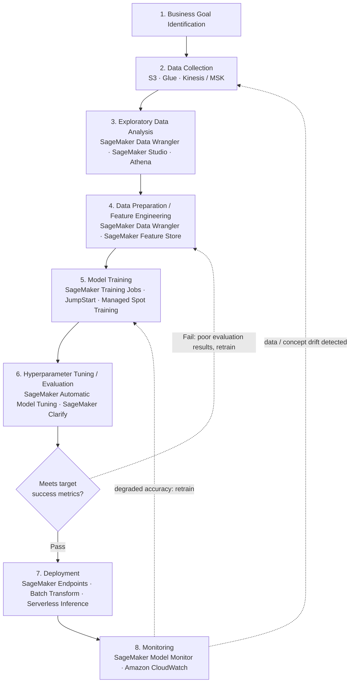
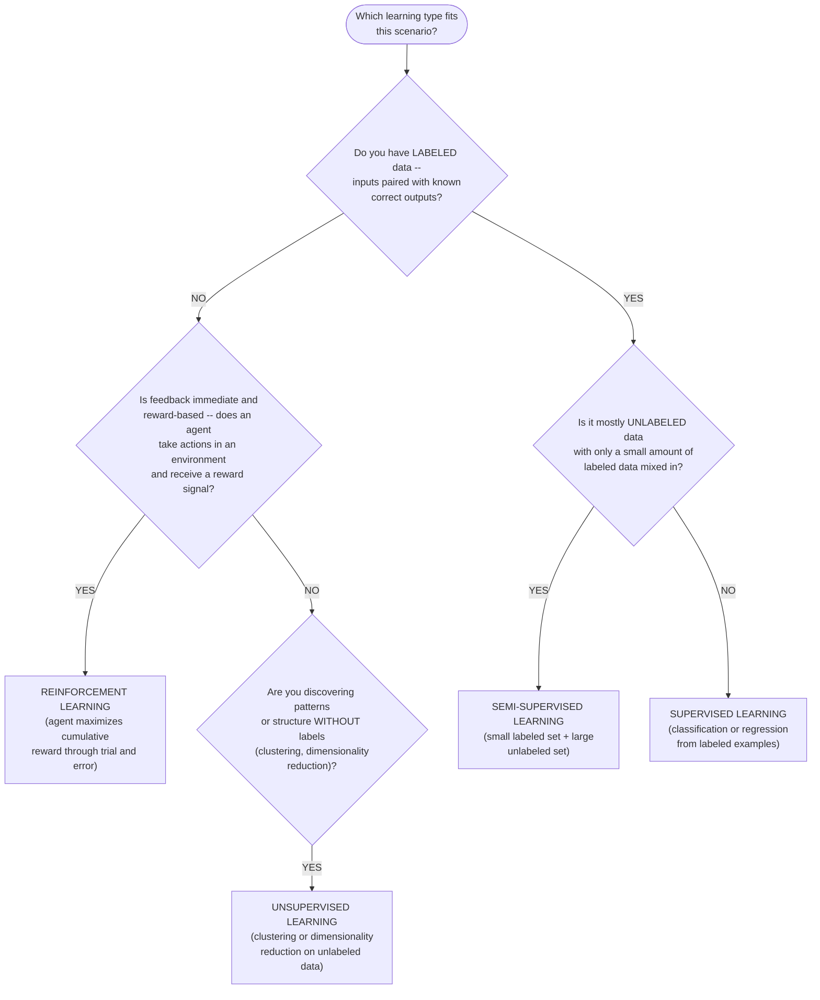
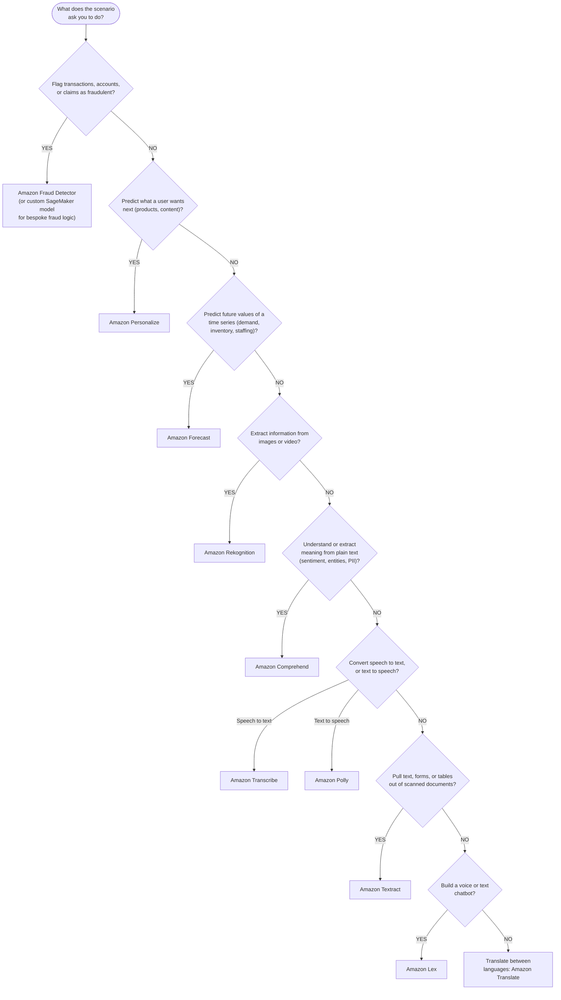
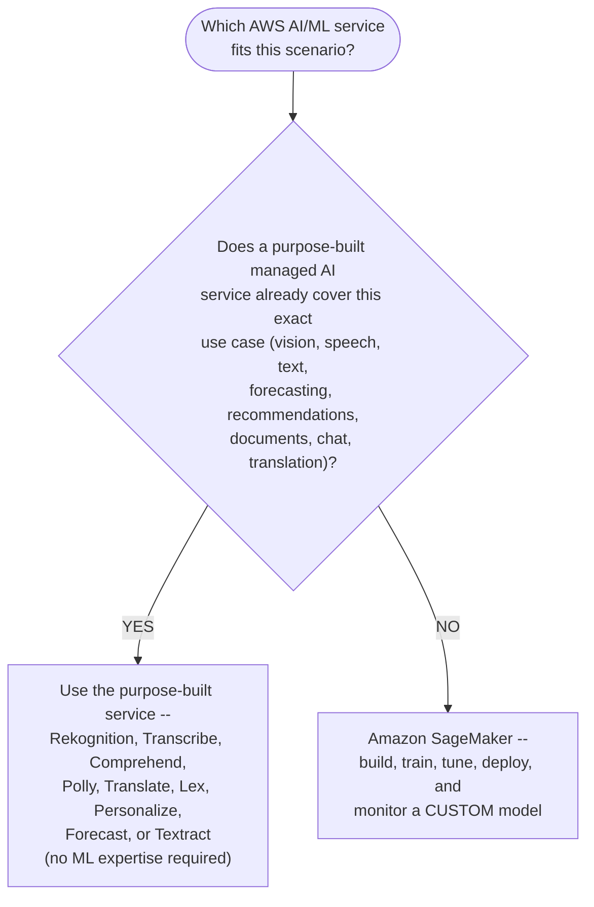
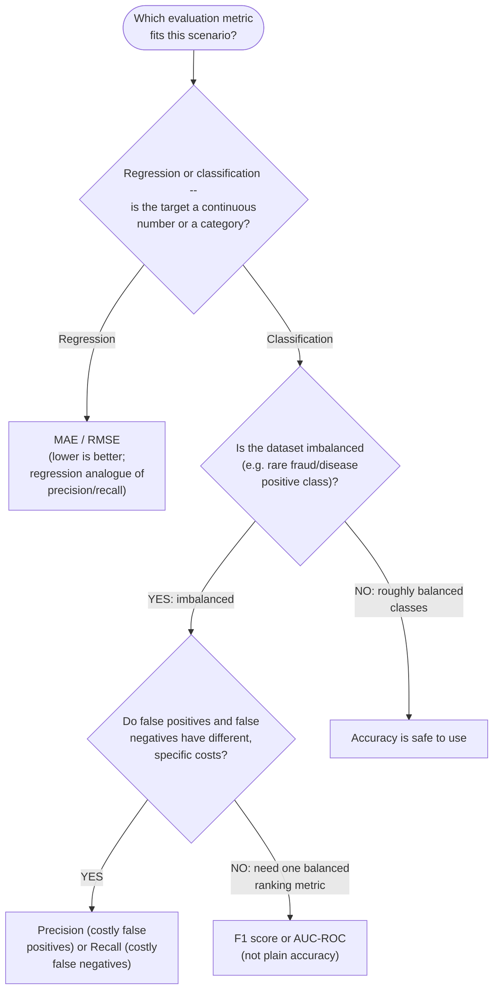
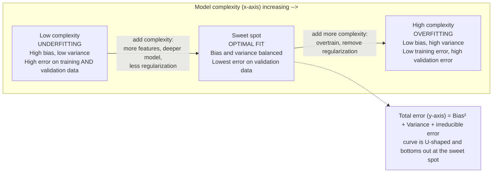

# Domain 1: Fundamentals of AI and ML

[← README](../README.md) · **Domain 1 of 5** · [Domain 2: Fundamentals of Generative AI →](domain-2-fundamentals-of-generative-ai.md)

**Last verified:** 2026-09-02

## Table of contents

- [1. Basic AI/ML/DL terminology and concepts](#1-basic-aimldl-terminology-and-concepts)
- [2. The ML development lifecycle](#2-the-ml-development-lifecycle)
  - [Production deployment strategies and model versioning](#production-deployment-strategies-and-model-versioning)
    - [Worked example: promoting a new model version with canary deployment via SageMaker Model Registry](#worked-example-promoting-a-new-model-version-with-canary-deployment-via-sagemaker-model-registry)
- [3. Types of learning](#3-types-of-learning)
- [4. Common use cases for AI/ML](#4-common-use-cases-for-aiml)
- [5. AWS managed AI/ML services (conceptual overview)](#5-aws-managed-aiml-services-conceptual-overview)
- [6. Model evaluation basics](#6-model-evaluation-basics)
- [7. Overfitting, underfitting, and the bias–variance trade-off](#7-overfitting-underfitting-and-the-biasvariance-trade-off)
- [Worked example: end-to-end ML lifecycle for a loan-default predictor](#worked-example-end-to-end-ml-lifecycle-for-a-loan-default-predictor)
- [Comparison table: AWS managed AI/ML services at a glance](#comparison-table-aws-managed-aiml-services-at-a-glance)
- [Quick-reference cheat sheet](#quick-reference-cheat-sheet)
- [Key terms glossary](#key-terms-glossary)
- [Practice questions](#practice-questions)
- [Answer key and explanations](#answer-key-and-explanations)

## Domain overview

Domain 1 is the largest single knowledge domain on the AWS Certified AI
Practitioner (AIF-C01) exam at roughly **20% of scored questions**. It tests
whether you understand what AI, ML, and deep learning actually are, how a
model goes from raw data to a production endpoint, the three major learning
paradigms, where AI/ML solves real business problems, which AWS managed
service maps to which problem, and how to tell — using basic metrics — whether
a model is any good.

This domain matters because every later domain
([generative AI](domain-2-fundamentals-of-generative-ai.md#1-generative-ai-core-concepts),
[foundation model applications](domain-3-applications-of-foundation-models.md#1-design-considerations-for-foundation-model-applications),
[responsible AI](domain-4-guidelines-for-responsible-ai.md#1-core-dimensions-of-responsible-ai), and
[security/governance](domain-5-security-compliance-governance.md#1-securing-ai-systems)) assumes you
already have this vocabulary and mental model. Questions here are rarely
about memorizing an API call; they are scenario-based ("a company wants to
do X — which AWS service and which technique fit?") and reward being able to
reason from first principles about the ML lifecycle and about which managed
AI service removes the most undifferentiated heavy lifting for a given use
case.

---

## 1. Basic AI/ML/DL terminology and concepts

**Artificial Intelligence (AI)** is the broad field of building systems that
perform tasks normally requiring human intelligence — perception, reasoning,
language understanding, decision-making.

**Machine Learning (ML)** is a subset of AI in which a system *learns
patterns from data* instead of following explicit, hand-written rules. You
give an algorithm examples (data) and it produces a **model** that
generalizes to new, unseen inputs.

**Deep Learning (DL)** is a subset of ML that uses **neural networks** with
many layers ("deep" networks) to automatically learn hierarchical feature
representations from raw or lightly processed data (pixels, audio waveforms,
raw text tokens). DL typically needs more data and more compute than
classical ML, but it removes most manual feature engineering for
unstructured data like images, audio, and text.

**Generative AI (GenAI)** is a further subset of DL that focuses on models
(often foundation models built on the transformer architecture) that
*generate* new content — text, images, code, audio — rather than only
predicting a label or a number. Generative AI is covered in depth in
[Domain 2](domain-2-fundamentals-of-generative-ai.md#1-generative-ai-core-concepts), but you should know it nests inside DL, which nests inside ML, which
nests inside AI:

```
AI  ⊃  ML  ⊃  DL  ⊃  Generative AI
```

Other core vocabulary you must know cold:

- **Model** — the artifact produced by training; a set of learned
  parameters (weights) that maps inputs to outputs.
- **Algorithm** — the method used to learn the model (e.g., XGBoost,
  linear regression, k-means, a convolutional neural network architecture).
- **Parameters** — values the model learns automatically during training
  (e.g., neural network weights).
- **Hyperparameters** — values set by a human *before* training that
  control the learning process (e.g., learning rate, number of trees,
  number of epochs, batch size). AWS SageMaker's **automatic model tuning**
  (hyperparameter optimization) searches these for you.
- **Training data / labels** — the historical examples (and, for supervised
  learning, the correct answers) used to fit the model.
- **Inference** — using a trained model to make a prediction on new data.
  AWS distinguishes **real-time inference** (low-latency, persistent
  endpoint), **batch inference** (large offline jobs), **asynchronous
  inference** (large payloads, minutes-long processing, queued), and
  **serverless inference** (intermittent traffic, auto-scales to zero).

**AWS example:** Amazon SageMaker is AWS's umbrella ML platform — it doesn't
force you to pick AI vs. ML vs. DL; it gives you the tooling (notebooks,
built-in algorithms, framework containers for TensorFlow/PyTorch, and
managed infrastructure) to build models anywhere on that spectrum, from a
simple linear regression to a deep neural network.

> **Exam tip:** The exam loves testing the *nesting* relationship (AI ⊃ ML ⊃
> DL ⊃ Generative AI) with distractor answers that reverse it (e.g., "ML is
> a type of deep learning"). Also expect a question that asks you to
> distinguish a **parameter** from a **hyperparameter** — parameters are
> *learned*, hyperparameters are *configured by a person before training*.

#### Mini-quiz: Test your understanding of AI/ML/DL terminology

Quick self-check before moving on — try to answer before reading the
explanation.

1. Which of the following correctly orders these fields from broadest to
   narrowest?
   A. ML, AI, DL, Generative AI
   B. AI, ML, DL, Generative AI
   C. DL, ML, AI, Generative AI
   D. Generative AI, DL, ML, AI

   **Answer: B** — AI is the broadest field, ML is a subset of AI, DL is a
   subset of ML, and Generative AI is a subset of DL (AI ⊃ ML ⊃ DL ⊃
   Generative AI).

2. A data scientist sets the number of training epochs to 50 before
   launching a training job. Is "number of epochs" a parameter or a
   hyperparameter?
   A. A parameter, because it affects the final model
   B. A hyperparameter, because it is set by a human before training begins
   C. A parameter, because it is learned automatically during training
   D. Neither — it is not related to model training

   **Answer: B** — Hyperparameters (learning rate, epochs, batch size,
   number of trees) are configured by a person before training starts;
   parameters (like neural network weights) are learned automatically.

3. Which inference option best fits a workload with large payloads that can
   tolerate minutes of processing time and should be queued rather than
   served instantly?
   A. Real-time inference
   B. Batch inference
   C. Asynchronous inference
   D. Serverless inference

   **Answer: C** — Asynchronous inference is designed for large payloads
   and longer processing times via a queue. Real-time (A) needs low
   latency; batch (B) is for large offline jobs run on a schedule, not a
   queued single request; serverless (D) targets intermittent traffic, not
   payload size.

---

## 2. The ML development lifecycle

AIF-C01 expects you to know the standard, ordered ML lifecycle and which
AWS tool/SageMaker capability supports each stage:

1. **Business goal identification** — define the problem and the success
   metric *before* touching data (e.g., "reduce fraudulent transactions by
   X% while keeping false declines below Y%").
2. **Data collection** — gather data from data lakes, warehouses,
   streaming sources, etc. AWS: Amazon S3 (storage), AWS Glue (ETL),
   Amazon Kinesis / MSK (streaming ingestion).
3. **Exploratory data analysis (EDA)** — understand distributions, spot
   missing values, outliers, class imbalance, and correlations. AWS:
   **SageMaker Data Wrangler**, **SageMaker Studio** notebooks, Amazon
   Athena for ad hoc SQL over S3 data.
4. **Data preparation / feature engineering** — clean, transform, encode,
   and select the input variables ("features") the model will actually
   consume: normalization/scaling, one-hot encoding of categoricals,
   handling missing values, creating derived features. AWS: **SageMaker
   Data Wrangler** (visual data prep), **SageMaker Feature Store**
   (centralized, versioned, reusable feature repository shared between
   training and inference to avoid training/serving skew).
5. **Model training** — fit an algorithm to the prepared training data.
   AWS: **SageMaker** built-in algorithms, **SageMaker JumpStart**
   (pretrained models/prebuilt solutions), managed Spot Training for
   cheaper training jobs, **SageMaker distributed training** for very
   large models.
6. **Hyperparameter tuning / evaluation** — measure model quality on a
   held-out validation/test set that the model never trained on, and
   iterate. AWS: **SageMaker automatic model tuning** (hyperparameter
   optimization), **SageMaker Clarify** (bias and explainability metrics).
7. **Deployment** — expose the trained model for inference. AWS:
   **SageMaker endpoints** (real-time), **SageMaker batch transform**
   (batch), **SageMaker Serverless Inference**, **SageMaker asynchronous
   inference**, multi-model/multi-container endpoints.
8. **Monitoring** — track live model quality, input data drift, and
   concept drift after deployment, since real-world data distributions
   change over time. AWS: **SageMaker Model Monitor**, Amazon CloudWatch
   for operational metrics.

This is an **iterative loop**, not a strict waterfall: poor evaluation or
monitoring results send you back to data collection, feature engineering,
or retraining. Step 6 in particular is a **decision point**, not just a
measurement: if the model *passes* its target metrics it proceeds to
deployment; if it *fails*, the loop sends it back to feature engineering
(or earlier) to retrain rather than shipping a model that doesn't meet the
success criteria defined in step 1.



The same lifecycle, shown as plain-text ASCII for readers without Mermaid
rendering:

```
1. Business Goal Identification
        ↓
2. Data Collection
        ↓
3. Exploratory Data Analysis (EDA)
        ↓
4. Data Preparation / Feature Engineering
        ↓
5. Model Training
        ↓
6. Hyperparameter Tuning / Evaluation
        ↓
   ┌─── Meets target metrics? ───┐
  PASS                          FAIL
   ↓                             │
7. Deployment                    │
   ↓                             │
8. Monitoring                    │
   │                             │
   └──── iterate: drift or degraded accuracy loops back to Data
         Collection or Model Training ─────────────────────────▶
         (back to step 2 / 5); a FAILed evaluation loops back
         directly to Feature Engineering (step 4) to retrain ──▶
```

**AWS example:** A retailer builds a churn-prediction model. They land raw
event data in S3, use SageMaker Data Wrangler for EDA and feature
engineering, store reusable features in SageMaker Feature Store, train an
XGBoost model with SageMaker Training Jobs, tune hyperparameters with
SageMaker automatic model tuning, deploy to a real-time SageMaker endpoint,
and continuously watch for drift with SageMaker Model Monitor — retraining
when accuracy degrades.

> **Exam tip:** Questions often describe a scenario and ask "what is the
> **next** step" or "what is missing" from a lifecycle description. Memorize
> the order: collect → explore (EDA) → prepare/feature-engineer → train →
> evaluate/tune → deploy → monitor. Also know that **Feature Store** exists
> specifically to prevent *training/serving skew* (features computed
> differently at training time vs. inference time).

### Production deployment strategies and model versioning

Step 7 above ("Deployment") describes *how* to expose a trained model for
inference, but production systems also need a controlled way to **roll
out a new model version** without risking a bad release, and a reliable
way to **track which version is running**. Cross-domain scenario
questions about production rollouts and model governance draw on four
staged-rollout patterns, plus the AWS service used to track and promote
model versions.

**Staged rollout patterns** — these trade off risk, cost, and how quickly
you learn about a new model version's real-world quality:

- **Canary deployment** — route a small percentage of live traffic (e.g.,
  5%) to the new model version while the majority of traffic stays on the
  current version, then gradually increase the new version's share as
  confidence grows, monitoring for errors or quality regressions at each
  step. SageMaker endpoints support this via traffic-shifting deployment
  configurations.
- **Blue/green deployment** — run the new model version ("green") on a
  fully separate fleet alongside the current version ("blue"), then cut
  traffic over all at once once confidence is high, with an instant
  rollback by shifting traffic back to blue if problems appear. SageMaker
  supports blue/green deployment guardrails for endpoints, with linear or
  canary traffic-shifting strategies during the cutover.
- **A/B testing** — deliberately split live traffic between two (or more)
  model versions to statistically compare business or model-quality
  metrics (e.g., conversion rate, click-through rate) side by side, not
  just to safely roll one version out. Both versions keep running and
  receiving real traffic for as long as needed to reach a statistically
  meaningful result. SageMaker endpoints can host multiple **production
  variants** with configurable weighted traffic splits for exactly this.
- **Shadow deployment (shadow testing)** — send a copy of live production
  traffic to the new model version in parallel, without its predictions
  ever being returned to users or affecting any real decision, then
  compare the shadow version's predictions against the live version's
  offline. This validates that a new version behaves acceptably on real
  traffic with zero user-facing risk, at the cost of running duplicate
  inference capacity. SageMaker inference supports shadow variants for
  this pattern.

The shared theme: every pattern except an all-at-once cutover keeps the
previous version live and serving traffic, so a bad new version can be
rolled back or throttled instead of taking production down.

**Model versioning and promotion: SageMaker Model Registry.** Choosing a
rollout pattern only helps if you can reliably identify *which trained
model artifact* a given version actually is. **Amazon SageMaker Model
Registry** is the AWS service for this: it catalogs trained model
versions grouped into **model package groups**, stores each version's
metadata (evaluation metrics, lineage, approval status), and lets a
reviewer **approve or reject** a version before it can be deployed. A
typical flow: a training job registers a new candidate version as
"Pending manual approval" → a reviewer inspects its evaluation metrics
(and, per [Section 6](#6-model-evaluation-basics), any SageMaker Clarify
bias metrics) → the reviewer sets the version's status to "Approved" → a
deployment pipeline (e.g., built with SageMaker Pipelines) picks up the
approved version and rolls it out using one of the staged-rollout
patterns above. This gives governance reviewers (see
[Domain 5](domain-5-security-compliance-governance.md#1-securing-ai-systems))
an auditable record of exactly which approved version is serving
production traffic, and a clear path to roll back to a previous approved
version if the new one underperforms.

**AWS example:** A ride-sharing company retrains its fare-estimation
model weekly. Each new training run registers a candidate version in
**SageMaker Model Registry**. A data scientist reviews the candidate's
evaluation metrics against the currently deployed version and, if they
clear the bar, approves it. The deployment pipeline then rolls the
approved version out as a **canary**: 5% of estimation requests for one
hour, then 25%, then 100%, automatically rolling back to the previously
approved version if error rates spike at any stage.

> **Exam tip:** Distinguish the four patterns by *intent*, not just
> mechanics: canary and blue/green are both about **safely rolling out**
> one new version (gradual traffic shift vs. instant cutover with
> fallback); A/B testing is about **deliberately comparing two versions'**
> real-world performance, with both kept running on purpose; shadow
> deployment is about **validating a new version with zero user-facing
> risk**, since its predictions never reach users. If a question asks
> which service tracks model versions and lets a reviewer approve one
> before deployment, the answer is **SageMaker Model Registry** — not
> Model Monitor (which watches an already-deployed model for drift) and
> not Model Cards (which document a model's intended use and limitations,
> not its deployment version).

#### Worked example: promoting a new model version with canary deployment via SageMaker Model Registry

The callouts above describe the rollout patterns and SageMaker Model
Registry in isolation. This walkthrough stitches both together into one
concrete sequence, since cross-domain scenario questions describe exactly
this end-to-end flow (register → approve → stage traffic → monitor →
promote or roll back) rather than testing either half alone.

**Scenario:** An online retailer's product-recommendation model is
retrained every week on the latest purchase data. The MLOps team needs a
repeatable way to promote each new version into production that (1)
records exactly which approved artifact is serving live traffic, and (2)
limits the blast radius of a bad version instead of cutting every shopper
over to it at once.

1. **Register the candidate version.** The weekly training job's output
   model artifact is registered as a new version inside an existing
   **SageMaker Model Registry** model package group (e.g.
   `product-recommender`), with status **"Pending manual approval"** and
   its evaluation metrics (offline precision@k against a held-out
   validation set) attached as metadata.
2. **Review and approve.** A data scientist compares the candidate's
   metrics against the currently deployed version's. The candidate clears
   the bar, so the reviewer flips its Model Registry status to
   **"Approved"** — the single auditable action that says "this specific
   artifact is cleared for production," satisfying the governance record
   [Domain 5](domain-5-security-compliance-governance.md#1-securing-ai-systems)
   expects.
3. **Stage the canary rollout.** A SageMaker Pipelines deployment job
   picks up the newly Approved version and shifts **10%** of live
   recommendation traffic to it behind the same endpoint, leaving the
   remaining 90% on the prior Approved version.
4. **Monitor at each stage.** A CloudWatch alarm watches the canary
   slice's error rate and latency for a fixed soak period (e.g. 30
   minutes). If the alarm stays green, the pipeline widens the shift to
   **50%**, then **100%** of traffic, soaking at each step before
   advancing further.
5. **Roll back automatically on regression.** If the CloudWatch alarm
   trips at *any* stage — say, the canary slice's error rate spikes well
   above the baseline version's — the pipeline shifts traffic straight
   back to the prior Approved version instead of continuing the rollout,
   with no manual intervention needed to stop the bleeding.
6. **Record the outcome.** Whichever version ends up serving 100% of
   traffic, its Model Registry entry remains the auditable record of what
   is live; a rolled-back candidate's status can be set to **"Rejected"**
   so the next deployment attempt doesn't accidentally pick it up again.

A **blue/green** rollout of the same Approved version looks almost
identical through step 2, then diverges at step 3: instead of a gradual
traffic shift, the new version ("green") is stood up on a fully separate
fleet, validated against a small smoke-test slice, and then cut over all
at once — with the old fleet ("blue") kept warm so a regression triggers
an instant full cutback rather than a staged retreat.

> **Exam tip:** A scenario that says a company must know *which exact
> model artifact* is serving production and needs a **reviewer approval
> step** before anything deploys is describing **SageMaker Model
> Registry**, regardless of which rollout pattern it pairs with. A
> scenario that emphasizes *gradually increasing traffic while watching
> for errors, with automatic rollback* is describing **canary**; one that
> emphasizes *an instant, all-at-once cutover with an instant fallback* is
> describing **blue/green** — the registry-and-approval step is the same
> either way, only the traffic-shifting mechanics differ.

#### Mini-quiz: Test your understanding of the ML lifecycle

1. Which step comes immediately before model training in the standard ML
   lifecycle?
   A. Deployment
   B. Data preparation / feature engineering
   C. Monitoring
   D. Business goal identification

   **Answer: B** — The order is collect → explore (EDA) → prepare/feature
   engineer → **train** → evaluate/tune → deploy → monitor, so feature
   engineering is the step immediately before training.

2. What is the primary purpose of SageMaker Feature Store in the
   lifecycle?
   A. To visually explore data distributions
   B. To store and reuse curated features consistently between training and
      inference
   C. To tune hyperparameters automatically
   D. To monitor deployed models for drift

   **Answer: B** — Feature Store exists specifically to prevent
   training/serving skew by giving training and inference the same curated
   feature definitions.

3. A model fails its evaluation gate (step 6 in the lifecycle diagram).
   Where does the loop send the team back to?
   A. Directly to deployment anyway
   B. Feature engineering, to retrain
   C. Business goal identification only
   D. Nowhere — a failed model is discarded permanently

   **Answer: B** — A failed evaluation loops back to data
   preparation/feature engineering (step 4) to retrain, rather than
   shipping a model that misses its target metrics.

---

## 3. Types of learning

- **Supervised learning** — trains on **labeled** data (inputs paired with
  known correct outputs). Used for **classification** (predict a category,
  e.g., "fraud" vs. "not fraud") and **regression** (predict a continuous
  number, e.g., house price). Examples of AWS SageMaker built-in supervised
  algorithms: **Linear Learner**, **XGBoost**, **k-Nearest Neighbors (k-NN)**.
- **Unsupervised learning** — trains on **unlabeled** data; the algorithm
  finds structure on its own. Used for **clustering** (grouping similar
  items, e.g., customer segmentation) and **dimensionality reduction**
  (compressing features while preserving information, e.g., anomaly
  detection preprocessing). AWS SageMaker examples: **k-means** (clustering),
  **PCA** (dimensionality reduction), **Random Cut Forest** (anomaly
  detection).
- **Reinforcement learning (RL)** — an **agent** learns by taking
  **actions** in an **environment** to maximize cumulative **reward**
  through trial and error, rather than learning from a fixed labeled
  dataset. Used for robotics, game playing, and resource optimization.
  AWS: **Amazon SageMaker RL** (managed RL toolkits/environments), AWS
  DeepRacer (RL-based autonomous racing, used for education).
- **Semi-supervised learning** (know the term, lower emphasis) — trains on
  a small amount of labeled data combined with a large amount of unlabeled
  data, useful when labeling is expensive.

**AWS example:** A bank wants to flag suspicious transactions and has
historical transactions labeled "fraud"/"not fraud" — that's **supervised
classification** (e.g., SageMaker XGBoost). The same bank wants to discover
previously unknown customer segments for marketing, with no labels — that's
**unsupervised clustering** (e.g., SageMaker k-means). A warehouse robot
learning to navigate and pick items through trial and error, receiving a
reward signal for success, is **reinforcement learning**.

> **Exam tip:** The single most common trap: a scenario gives you data with
> **no labels/target column** and asks which learning type to use —
> answer **unsupervised**, not supervised, even if the described goal
> sounds like "prediction." Also: RL is defined by *agent + environment +
> reward*, not simply "learning without labels" — don't confuse it with
> unsupervised learning.

**Decision tree:** work an exam scenario by following the branch that
matches what the question tells you about the data and the feedback
signal:



**Quick reference (if–then):** the same branches as one-line lookups:

- No labels, and the goal is trial-and-error actions that earn a reward
  from an environment → **reinforcement learning**
- No labels, and the goal is finding structure/groupings on your own →
  **unsupervised learning**
- Labeled data, but only a small amount alongside a much larger unlabeled
  pool → **semi-supervised learning**
- Labeled data covering the whole training set → **supervised learning**

#### Mini-quiz: Test your understanding of types of learning

1. A retailer has purchase histories with no predefined customer
   categories and wants to find natural groupings. Which learning type
   applies?
   A. Supervised learning
   B. Unsupervised learning
   C. Reinforcement learning
   D. Semi-supervised learning

   **Answer: B** — With no labels/target column, the algorithm must find
   structure on its own, which is unsupervised clustering.

2. What three elements define reinforcement learning?
   A. Labels, features, and a loss function
   B. Clusters, centroids, and distance metrics
   C. An agent, an environment, and a reward signal
   D. Training data, validation data, and test data

   **Answer: C** — RL is defined by an agent taking actions in an
   environment to maximize cumulative reward, not simply "no labels."

3. Which AWS SageMaker built-in algorithm is an example of a supervised
   learning algorithm?
   A. k-means
   B. Random Cut Forest
   C. PCA
   D. XGBoost

   **Answer: D** — XGBoost is a supervised algorithm (classification/
   regression on labeled data). k-means (A) and PCA (C) are unsupervised;
   Random Cut Forest (B) is used for unsupervised anomaly detection.

---

## 4. Common use cases for AI/ML

Know how to match a business scenario to the *category* of ML problem, and
which managed AWS service is purpose-built for it:

- **Fraud detection** — classify transactions/accounts/claims as
  legitimate or fraudulent in near real time. AWS: **Amazon Fraud
  Detector** (purpose-built, no ML expertise required) or a custom
  SageMaker classification model for bespoke fraud logic.
- **Recommendation systems** — predict what a user is likely to want next
  (products, content). AWS: **Amazon Personalize** (same recommendation
  technology used by Amazon.com retail).
- **Forecasting** — predict future values of a time series (demand,
  inventory, staffing, financial metrics). AWS: **Amazon Forecast**
  (time-series forecasting using ML, no ML expertise required).
- **Computer vision** — extract information from images/video: object
  detection, facial analysis, content moderation, activity detection. AWS:
  **Amazon Rekognition**.
- **Natural language processing (NLP)** — understand and extract meaning
  from text: sentiment, entities, key phrases, language detection, PII
  detection, topic modeling. AWS: **Amazon Comprehend**.
- **Speech** — convert speech to text (**Amazon Transcribe**) or text to
  lifelike speech (**Amazon Polly**).
- **Document processing / intelligent document processing (IDP)** —
  extract printed text, handwriting, forms, and tables from scanned
  documents. AWS: **Amazon Textract**.
- **Conversational AI / chatbots** — build voice and text bots. AWS:
  **Amazon Lex** (the same conversational engine that powers Alexa).
- **Language translation** — automatic translation between languages.
  AWS: **Amazon Translate**.

**AWS example:** An insurance company wants to (1) auto-flag suspicious
claims, (2) recommend relevant add-on policies to existing customers, (3)
forecast next quarter's claim volume, and (4) pull structured data out of
scanned paper claim forms. That maps to Amazon Fraud Detector, Amazon
Personalize, Amazon Forecast, and Amazon Textract, respectively — four
different managed services for four different problem categories.

> **Exam tip:** AIF-C01 frequently gives a one-sentence business scenario
> and asks you to pick the single best-fit *AI service category* (not the
> underlying algorithm). Read for the **verb**: "detect fraud" →
> classification/Fraud Detector; "recommend" → Personalize; "predict future
> demand" → Forecast; "read this scanned form" → Textract (not
> Comprehend — Textract handles the *layout/extraction*, Comprehend
> analyzes *plain text meaning*).

**Decision tree:** work an exam scenario by matching the verb in the
question to the branch below, top to bottom — stop at the first branch
that fits:



#### Mini-quiz: Test your understanding of common AI/ML use cases

1. Which AWS service best fits "extract structured data such as tables and
   key-value pairs from scanned forms"?
   A. Amazon Comprehend
   B. Amazon Textract
   C. Amazon Rekognition
   D. Amazon Translate

   **Answer: B** — Textract handles layout/structure extraction from
   scanned documents; Comprehend (A) analyzes plain text meaning, not
   document layout.

2. A company wants to predict next quarter's inventory needs from
   historical time-series data. Which service fits best?
   A. Amazon Personalize
   B. Amazon Forecast
   C. Amazon Fraud Detector
   D. Amazon Lex

   **Answer: B** — Forecast is purpose-built for time-series forecasting.
   Personalize (A) is for recommendations, not forecasting.

3. Which service is purpose-built for detecting sentiment and extracting
   entities from plain text?
   A. Amazon Textract
   B. Amazon Comprehend
   C. Amazon Transcribe
   D. Amazon Polly

   **Answer: B** — Comprehend performs NLP tasks like sentiment, entities,
   and key phrases on plain text. Transcribe (C) converts speech to text
   but doesn't analyze meaning; Polly (D) is text-to-speech.

---

## 5. AWS managed AI/ML services (conceptual overview)

At the AI Practitioner level you need to know **what each service does and
when to reach for it**, not its API syntax.

- **Amazon SageMaker** — the end-to-end, fully managed platform to build,
  train, tune, deploy, and monitor **custom** ML models at any point on the
  AI/ML/DL spectrum. Use it when a purpose-built AI service doesn't fit
  your specific data/problem and you need full control (algorithm choice,
  custom training, MLOps pipelines).
- **Amazon Rekognition** — pre-trained and custom **computer vision**:
  object/scene detection, facial analysis and comparison, text-in-image,
  content moderation, celebrity recognition, video analysis.
- **Amazon Transcribe** — **automatic speech recognition (ASR)**;
  converts audio/video speech into text, with support for custom
  vocabularies, speaker identification (diarization), and PII redaction.
- **Amazon Comprehend** — **NLP**; extracts sentiment, entities, key
  phrases, language, syntax, PII, and topics from text; supports custom
  classification and custom entity recognition.
- **Amazon Polly** — **text-to-speech (TTS)**; turns text into natural,
  lifelike speech audio in many voices/languages.
- **Amazon Translate** — **neural machine translation** between
  languages.
- **Amazon Lex** — builds **conversational interfaces** (chatbots/voice
  bots) using automatic speech recognition and natural language
  understanding; the technology behind Alexa.
- **Amazon Personalize** — real-time, individualized **recommendations**
  and re-ranking, built on the same tech Amazon.com uses; requires no ML
  expertise.
- **Amazon Forecast** — managed **time-series forecasting** (demand,
  inventory, financials) using ML, requires no ML expertise.
- **Amazon Textract** — extracts text, handwriting, forms, and **tables**
  from scanned documents (goes beyond plain OCR by preserving structure
  and key-value relationships).

> **Exam tip:** A recurring exam pattern is "the company has no ML
> expertise and wants X" → the answer is almost always the **purpose-built
> managed AI service** (Rekognition/Comprehend/Personalize/Forecast/etc.),
> **not SageMaker** — SageMaker is the answer only when the scenario needs
> a **custom model** or a use case not covered by any purpose-built
> service.

**AWS example:** A media company needs to (1) moderate user-uploaded
images, (2) transcribe uploaded video for closed captions, and (3) build a
support chatbot — three different problems solved by three different
purpose-built services (Rekognition, Transcribe, and Lex) with no custom
model training required for any of them.

**Decision tree: purpose-built service or SageMaker?** the same "no ML
expertise" exam pattern above, as a flowchart:



#### Mini-quiz: Test your understanding of AWS managed AI/ML services

1. A company has no in-house ML expertise and wants to add facial analysis
   to its app. Which service should it use?
   A. Amazon SageMaker
   B. Amazon Rekognition
   C. Amazon Forecast
   D. Amazon Lex

   **Answer: B** — Rekognition is the purpose-built computer vision
   service; SageMaker (A) would require building a custom model.

2. When is Amazon SageMaker the better exam answer over a purpose-built AI
   service?
   A. Whenever cost matters
   B. When the use case needs a custom model or algorithm not covered by a
      purpose-built service
   C. Whenever the workload involves text
   D. Never — purpose-built services always win

   **Answer: B** — SageMaker is the answer only when no purpose-built
   service fits, or full customization/control is required.

3. Which AWS service converts text into lifelike spoken audio?
   A. Amazon Transcribe
   B. Amazon Polly
   C. Amazon Translate
   D. Amazon Lex

   **Answer: B** — Polly is text-to-speech; Transcribe (A) does the
   reverse (speech-to-text).

---

## 6. Model evaluation basics

Evaluation happens on data the model did **not** train on (a held-out
validation or test set) so the metric reflects real generalization.

**Confusion matrix** (binary classification) — a 2×2 table comparing
predicted vs. actual class:

|                     | Predicted Positive | Predicted Negative |
|---------------------|--------------------|--------------------|
| **Actual Positive** | True Positive (TP) | False Negative (FN) |
| **Actual Negative** | False Positive (FP) | True Negative (TN) |

From this table:

- **Accuracy** = (TP + TN) / (TP + TN + FP + FN) — overall percent
  correct. **Misleading on imbalanced data** (e.g., 99% non-fraud, 1%
  fraud: a model that always predicts "not fraud" scores 99% accuracy
  while being useless).
- **Precision** = TP / (TP + FP) — of everything the model *flagged
  positive*, what fraction was actually positive. High precision means
  **few false alarms**. Prioritize precision when false positives are
  costly (e.g., flagging a legitimate transaction as fraud and blocking a
  customer).
- **Recall (Sensitivity)** = TP / (TP + FN) — of everything that was
  *actually positive*, what fraction did the model catch. High recall
  means **few missed cases**. Prioritize recall when false negatives are
  costly (e.g., missing an actual fraudulent transaction, or missing a
  cancer diagnosis).
- **F1 score** = 2 × (Precision × Recall) / (Precision + Recall) — the
  harmonic mean of precision and recall; a single balanced metric useful
  when you need both false positives and false negatives to matter, and
  especially useful on **imbalanced classes**.
- **AUC-ROC** — the Area Under the Receiver Operating Characteristic
  curve, which plots the true positive rate against the false positive
  rate across all classification thresholds. AUC summarizes how well the
  model **ranks** positives above negatives regardless of a single fixed
  threshold; 1.0 is a perfect classifier, 0.5 is random guessing.
- **RMSE / MAE** (for regression, not classification) — Root Mean Squared
  Error and Mean Absolute Error measure how far predicted numeric values
  are from actual numeric values; lower is better. Know that these are
  the *regression* analogue of classification metrics like precision/recall.

**AWS example:** A fraud-detection model on a dataset that is 99% "not
fraud" reports 99% accuracy but only 40% recall — meaning it misses 60% of
actual fraud cases. **Amazon SageMaker Clarify** and SageMaker's built-in
evaluation reports surface precision, recall, F1, and AUC so you don't rely
on accuracy alone. **Amazon SageMaker Model Monitor** then tracks these
metrics in production over time to detect quality drift.

> **Exam tip:** Whenever a question mentions **class imbalance** (fraud,
> disease detection, rare events), the correct metric is almost never
> plain accuracy — look for precision, recall, F1, or AUC-ROC as the
> answer. Also memorize the precision/recall trade-off direction: raising
> the classification threshold typically **increases precision and
> decreases recall**, and vice versa.

**Decision tree: which metric should I use?** Work an exam scenario by
following the branch that matches what the question tells you about the
problem type and the class balance:



**Quick reference (if–then):** the same branches as one-line lookups:

- Target is a continuous number, not a category → **MAE / RMSE**
  (regression)
- Classification on an **imbalanced** dataset, no single asymmetric cost →
  **F1 score or AUC-ROC**, not accuracy
- Classification where false positives and false negatives have different
  costs → **Precision** (false positives costly) or **Recall** (false
  negatives costly)
- Classification on a **roughly balanced** dataset → **Accuracy** is a
  reasonable summary metric

#### Mini-quiz: Test your understanding of model evaluation

1. On a dataset that is 98% negative and 2% positive, a model that always
   predicts "negative" scores 98% accuracy. What does this illustrate?
   A. The model is excellent
   B. Accuracy is misleading on imbalanced data
   C. Precision is always misleading
   D. AUC-ROC cannot be computed

   **Answer: B** — This is the accuracy paradox: on imbalanced data, a
   useless model can still post a high accuracy score.

2. Which metric should be prioritized when false positives are especially
   costly (e.g., blocking a legitimate customer transaction)?
   A. Recall
   B. Precision
   C. RMSE
   D. MAE

   **Answer: B** — High precision means few false alarms, which is what
   you want when false positives are expensive.

3. What does raising the classification threshold typically do to
   precision and recall?
   A. Increases both
   B. Decreases both
   C. Increases precision, decreases recall
   D. Increases recall, decreases precision

   **Answer: C** — Raising the threshold makes the model more selective
   about what it flags positive, typically raising precision while
   lowering recall.

---

## 7. Overfitting, underfitting, and the bias–variance trade-off

- **Underfitting** — the model is too simple to capture the underlying
  pattern in the data. Symptoms: **poor performance on both training and
  test data**. This is a **high-bias** problem. Fixes: use a more complex
  model, add more/better features, train longer, reduce regularization.
- **Overfitting** — the model memorizes noise and specific quirks of the
  training data instead of the general pattern. Symptoms: **very good
  performance on training data but poor performance on test/validation
  data**. This is a **high-variance** problem. Fixes: get more training
  data, use simpler models, apply **regularization** (L1/L2, dropout in
  neural networks), use **cross-validation**, **early stopping**, feature
  selection/reduction, or data augmentation.
- **Bias–variance trade-off** — **bias** is error from overly simplistic
  assumptions (underfitting); **variance** is error from excessive
  sensitivity to the training data's noise (overfitting). Reducing one
  typically increases the other; the goal is the sweet spot that
  minimizes total error on unseen data.

The diagram below plots this trade-off with **model complexity on the
x-axis** and **error on the y-axis**, spanning the underfitting → optimal →
overfitting spectrum:



**AWS example:** A team training an image classifier with SageMaker
notices 99% training accuracy but only 65% validation accuracy — classic
**overfitting**. They use **SageMaker automatic model tuning** to search
for better regularization hyperparameters, add data augmentation, and use
a validation split/cross-validation during training jobs to catch this
before deploying to a SageMaker endpoint.

> **Exam tip:** If a scenario says "great score on training data, bad score
> on test/production data," the answer is **overfitting / high variance**.
> If it says "bad score on *both* training and test data," the answer is
> **underfitting / high bias**. Regularization and more data are the two
> most commonly tested overfitting remedies.

#### Mini-quiz: Test your understanding of overfitting, underfitting, and bias-variance

1. A model performs poorly on both training and test data. What is this
   called?
   A. Overfitting
   B. Underfitting
   C. High variance
   D. Data leakage

   **Answer: B** — Poor performance on *both* sets is the textbook symptom
   of underfitting (high bias), not overfitting.

2. Which technique is a standard remedy for overfitting?
   A. Increasing model complexity
   B. Removing regularization
   C. Adding regularization (e.g., L2 penalty)
   D. Training on less data

   **Answer: C** — Regularization discourages overly complex models and is
   a standard overfitting remedy, along with more data, cross-validation,
   and early stopping.

3. In the bias-variance trade-off, high variance is most closely
   associated with which condition?
   A. Underfitting
   B. Overfitting
   C. Balanced generalization
   D. Missing data

   **Answer: B** — High variance means the model is overly sensitive to
   training-data noise, which is the definition of overfitting.

---

## Worked example: end-to-end ML lifecycle for a loan-default predictor

The callouts above show *isolated* AWS-service decisions. This walkthrough
strings all eight lifecycle stages from [Section 2](#2-the-ml-development-lifecycle)
together into one continuous scenario, so you can see how the decisions at
each stage constrain the next one — which is exactly how AIF-C01 scenario
questions are written (a paragraph describing several stages at once, then
asking what happens next or what was done wrong).

**Scenario:** A regional bank wants to predict, at the time a loan
application is submitted, whether the applicant is likely to default. The
bank has five years of historical loan applications with outcomes (repaid
vs. defaulted) in an on-premises database, and a compliance requirement to
explain any adverse decision to a rejected applicant.

1. **Business goal identification.** The team defines the success metric
   *before* touching data: reduce defaults funded by 15% while keeping the
   false-decline rate (good applicants wrongly rejected) under 5%, because
   over-rejecting creditworthy customers has its own business cost. This
   framing already tells you it is a **binary classification** problem
   with an explicit precision/recall trade-off ([Section 6](#6-model-evaluation-basics)) — not a
   regression or clustering problem.
2. **Data collection.** The historical loan records are exported and
   landed in **Amazon S3** as the durable, central data lake. A nightly
   **AWS Glue** ETL job incrementally pulls new applications from the
   on-premises database into the same S3 bucket so the training data stays
   current.
3. **Exploratory data analysis (EDA).** In **SageMaker Studio**, the team
   profiles the data and discovers two problems: 3% of rows are missing
   income values, and only 4% of historical applications actually
   defaulted (severe **class imbalance** — see [Section 6](#6-model-evaluation-basics)). They also
   run ad hoc SQL over the raw S3 data with **Amazon Athena** to check for
   duplicate applicant records before committing to a feature design.
4. **Data preparation / feature engineering.** Using **SageMaker Data
   Wrangler**, the team imputes missing income with a median-by-region
   value, one-hot encodes categorical fields (loan purpose, employment
   type), and engineers a debt-to-income ratio feature. Because this same
   debt-to-income calculation must be reproduced identically at inference
   time on live applications, the finished features are published to
   **SageMaker Feature Store** — this is precisely the training/serving
   skew problem Feature Store exists to prevent.
5. **Model training.** The team trains a **SageMaker XGBoost** built-in
   algorithm job (a strong default for structured/tabular data), and
   additionally launches a **SageMaker Autopilot** run as a fast baseline
   to sanity-check that a hand-built model is worth the extra effort.
   Training jobs use **Managed Spot Training** to cut compute cost, since
   these are not time-critical, interactive jobs.
6. **Hyperparameter tuning / evaluation.** **SageMaker automatic model
   tuning** searches XGBoost's hyperparameters (tree depth, learning rate,
   number of rounds) against a held-out validation split. Because of the
   4% default rate identified in EDA, the team evaluates with **precision,
   recall, and F1** rather than plain accuracy (a model that always
   predicts "no default" would score 96% accuracy while being useless),
   and reviews **SageMaker Clarify** bias metrics across protected
   attributes (age, ZIP code as a proxy for race) to satisfy the
   compliance requirement for explainable, non-discriminatory decisions.
7. **Deployment.** The chosen model is deployed to a **SageMaker
   real-time endpoint** so a yes/no decision (with a Clarify-generated
   feature-importance explanation attached for compliance) can be returned
   synchronously while a loan officer has the applicant on the phone. A
   separate nightly **SageMaker batch transform** job re-scores the entire
   existing loan portfolio for early-warning risk monitoring, since that
   workload has no latency requirement.
8. **Monitoring.** **SageMaker Model Monitor** watches the live endpoint
   for data drift (e.g., applicant income distributions shifting after a
   local factory closes) and prediction-quality drift once true default
   outcomes become known months later. A monitor alarm — say, drift
   detected in the income feature — triggers exactly the loop-back shown
   in the [Section 2 lifecycle diagram](#2-the-ml-development-lifecycle):
   back to data collection to refresh the training set and retrain, not a
   one-off manual patch.

> **Exam tip:** When a question walks through several lifecycle stages in
> one paragraph, identify what's *missing* or *out of order* rather than
> what's present. A classic distractor scenario trains a model, deploys it,
> and never mentions monitoring — the correct answer is almost always "add
> monitoring for data/concept drift," because a static model silently
> degrades as real-world data shifts.

---

## Comparison table: AWS managed AI/ML services at a glance

| Service | Category | Primary input | What it's for | When to choose it over SageMaker |
|---|---|---|---|---|
| **Amazon SageMaker** | ML platform | Tabular, image, text, any | Build/train/deploy **custom** models end to end | You need a bespoke model or algorithm not covered by a purpose-built service |
| **Amazon Rekognition** | Computer vision | Image / video | Object/scene detection, facial analysis, moderation | Standard vision tasks; no ML expertise or custom training needed |
| **Amazon Transcribe** | Speech-to-text | Audio / video | Convert spoken audio to text, diarization | Off-the-shelf ASR without training a custom acoustic model |
| **Amazon Comprehend** | NLP | Text | Sentiment, entities, key phrases, PII, topics | Standard text analytics without training custom NLP models |
| **Amazon Polly** | Text-to-speech | Text | Generate natural spoken audio from text | Any TTS need; no custom voice model required |
| **Amazon Translate** | Machine translation | Text | Translate text between languages | Standard translation without training a custom MT model |
| **Amazon Lex** | Conversational AI | Text / voice | Build chatbots and voice bots | Building a conversational interface, not a raw NLU model |
| **Amazon Personalize** | Recommendations | User/item interaction data | Real-time personalized recommendations | Recommendation use case; avoids building a recommender from scratch |
| **Amazon Forecast** | Forecasting | Time-series data | Predict future values (demand, inventory) | Time-series forecasting without building custom models |
| **Amazon Textract** | Document extraction | Scanned documents/images | Extract text, forms, and tables with structure | Need structured extraction, not just plain OCR text |
| **Amazon Fraud Detector** | Fraud detection | Transaction/account data | Real-time fraud-risk scoring | Fraud use case without building a custom classifier |

> **Exam tip:** The unifying rule tested across nearly every row of this
> table: **if a purpose-built managed AI service exists for the described
> use case, it is almost always the better exam answer than building a
> custom SageMaker model** — SageMaker is for cases the purpose-built
> services don't cover, or when deep customization/control is explicitly
> required.

---

## Quick-reference cheat sheet

A condensed, one-to-two-page (print-friendly) recap of this domain's
highest-yield material for last-minute review right before the exam. It
restates material covered in full in [Section 2](#2-the-ml-development-lifecycle),
[Section 3](#3-types-of-learning), and
[Section 5](#5-aws-managed-aiml-services-conceptual-overview) — it is not a
substitute for reading those sections, only a fast recall aid once you
already have.

**The 8-stage ML development lifecycle — memorize the order:**

| # | Stage | Key AWS tools |
|---|---|---|
| 1 | Business goal identification | (no tooling — define the problem/success metric first) |
| 2 | Data collection | S3, AWS Glue, Kinesis / MSK |
| 3 | Exploratory data analysis (EDA) | SageMaker Data Wrangler, SageMaker Studio, Athena |
| 4 | Data preparation / feature engineering | SageMaker Data Wrangler, SageMaker Feature Store |
| 5 | Model training | SageMaker Training Jobs, JumpStart, Managed Spot Training |
| 6 | Hyperparameter tuning / evaluation | SageMaker automatic model tuning, SageMaker Clarify |
| 7 | Deployment | SageMaker endpoints (real-time), batch transform, serverless inference |
| 8 | Monitoring | SageMaker Model Monitor, Amazon CloudWatch |

Collect → explore (EDA) → prepare/feature-engineer → train → evaluate/tune
→ deploy → monitor. It's an **iterative loop**: a **failed** evaluation
(step 6) loops back to feature engineering (step 4) to retrain; drift or
degraded accuracy detected during monitoring (step 8) loops back to data
collection (step 2) or retraining (step 5). **Feature Store** exists to
prevent *training/serving skew*.

**Three learning types — one-line distinguishers:**

| Type | Data | Distinguisher | AWS SageMaker examples |
|---|---|---|---|
| **Supervised** | Labeled | Predicts a known target (classification/regression) | Linear Learner, XGBoost, k-NN |
| **Unsupervised** | Unlabeled | Finds structure with no target column (clustering/dimensionality reduction) | k-means, PCA, Random Cut Forest |
| **Reinforcement (RL)** | None (trial-and-error) | An **agent** takes **actions** in an **environment** to maximize cumulative **reward** | SageMaker RL, AWS DeepRacer |

> No labels/target column → **unsupervised**, even if the goal sounds like
> "prediction." RL is defined by *agent + environment + reward*, not
> merely "no labels" — don't conflate it with unsupervised learning.

**AWS managed AI/ML service decision table — match the scenario keyword to the service:**

| If the scenario says... | The service is... |
|---|---|
| "no ML expertise, needs a custom model or algorithm not covered below" | Amazon SageMaker |
| "images/video: objects, faces, moderation" | Amazon Rekognition |
| "convert speech/audio to text" | Amazon Transcribe |
| "analyze text: sentiment, entities, key phrases, PII" | Amazon Comprehend |
| "convert text to lifelike speech" | Amazon Polly |
| "translate between languages" | Amazon Translate |
| "build a chatbot or voice bot" | Amazon Lex |
| "personalized product/content recommendations" | Amazon Personalize |
| "forecast demand, inventory, or other time-series values" | Amazon Forecast |
| "extract text, forms, and tables from scanned documents" | Amazon Textract |
| "real-time fraud-risk scoring" | Amazon Fraud Detector |

**Decision tree for choosing a service:**

```
Does a purpose-built managed AI service match the described input/task?
├── Yes → use that purpose-built service (Rekognition, Transcribe,
│         Comprehend, Polly, Translate, Lex, Personalize, Forecast,
│         Textract, Fraud Detector) — no ML expertise required.
└── No → does the use case need a custom model/algorithm, or full
          control over training and deployment?
          ├── Yes → Amazon SageMaker
          └── No  → re-check the table above; a purpose-built service
                    almost always exists for AIF-C01 scenarios.
```

**Common exam traps:**

- "No ML expertise + standard task (vision/speech/text/forecast/rec)" →
  the **purpose-built service**, not SageMaker. SageMaker wins only when
  the use case needs a **custom** model.
- A scenario with **no labels/target column** → **unsupervised**, not
  supervised — even if it sounds like a prediction task.
- **Accuracy is misleading on imbalanced data** (e.g., fraud, disease
  detection) — look for precision, recall, F1, or AUC-ROC instead.
- A **failed** evaluation gate loops back to **feature engineering**
  (step 4), not straight back to business goal identification or straight
  to deployment.

---

## Key terms glossary

> Looking for a term from another domain? [`docs/master-glossary.md`](master-glossary.md) indexes every domain's key terms alphabetically with domain tags (e.g. `[D1, D3]`) and links back here.

- **AI (Artificial Intelligence)** — broad field of systems performing
  tasks that normally require human intelligence.
- **ML (Machine Learning)** — subset of AI where systems learn patterns
  from data instead of explicit rules.
- **DL (Deep Learning)** — subset of ML using multi-layer neural networks
  to learn representations automatically.
- **Model** — the trained artifact that maps inputs to outputs.
- **Algorithm** — the method used to train a model (e.g., XGBoost, k-means).
- **Parameter** — a value learned by the model during training (e.g.,
  neural network weight).
- **Hyperparameter** — a configuration value set before training (e.g.,
  learning rate, number of epochs).
- **Training data** — historical data (with labels, for supervised
  learning) used to fit a model.
- **Inference** — using a trained model to generate predictions on new data.
- **Labeled data** — data where each example has a known, correct output/target.
- **Supervised learning** — learning from labeled data (classification/regression).
- **Unsupervised learning** — learning structure from unlabeled data (clustering/dimensionality reduction).
- **Reinforcement learning** — an agent learns via trial-and-error actions in an environment to maximize cumulative reward.
- **Classification** — predicting a discrete category/label.
- **Regression** — predicting a continuous numeric value.
- **Clustering** — grouping similar unlabeled data points together.
- **Feature** — an individual measurable input variable used by a model.
- **Feature engineering** — creating/transforming input variables to improve model performance.
- **Feature Store** — a centralized repository (e.g., SageMaker Feature Store) for storing and reusing curated features consistently between training and inference.
- **Exploratory data analysis (EDA)** — analyzing data (distributions, missing values, outliers) before modeling.
- **Confusion matrix** — table comparing predicted vs. actual classifications (TP/TN/FP/FN).
- **Accuracy** — proportion of all predictions that were correct.
- **Precision** — proportion of predicted positives that were actually positive.
- **Recall (Sensitivity)** — proportion of actual positives correctly predicted.
- **F1 score** — harmonic mean of precision and recall.
- **AUC-ROC** — area under the ROC curve; measures ranking quality across thresholds.
- **Overfitting** — model fits training data (including noise) too closely and generalizes poorly (high variance).
- **Underfitting** — model is too simple to capture the pattern in the data (high bias).
- **Bias–variance trade-off** — balance between error from oversimplified assumptions (bias) and error from sensitivity to training data noise (variance).
- **Regularization** — techniques (L1/L2, dropout) that discourage overly complex models to reduce overfitting.
- **Cross-validation** — repeatedly splitting data into train/validation folds to get a more robust performance estimate.
- **Real-time inference** — low-latency predictions served from a persistent endpoint.
- **Batch inference** — predictions computed offline over large datasets at once.
- **Model drift / data drift** — degradation in model performance over time as real-world data distributions change from training data.

---

## Practice questions

1. **[Intermediate]** A company wants to group its customers into segments based on purchasing
   behavior, but it has no predefined categories or labels. Which type of
   machine learning should it use?
   A. Supervised learning
   B. Unsupervised learning
   C. Reinforcement learning
   D. Semi-supervised learning

2. **[Beginner]** Which of the following best describes the relationship between AI, ML,
   and deep learning?
   A. Deep learning is a broader field that contains machine learning, which contains AI
   B. AI, ML, and deep learning are unrelated, independently developed fields
   C. AI is the broadest field; ML is a subset of AI; deep learning is a subset of ML
   D. ML and deep learning are the same technique with different names

3. **[Intermediate]** A data scientist notices a model achieves 98% accuracy on training data
   but only 61% accuracy on the test data. What is the most likely problem?
   A. Underfitting
   B. Overfitting
   C. Data leakage prevention
   D. Insufficient hyperparameters

4. **[Beginner]** Which AWS service should a company with no in-house ML expertise use to
   add real-time, individualized product recommendations to its e-commerce site?
   A. Amazon SageMaker
   B. Amazon Personalize
   C. Amazon Forecast
   D. Amazon Comprehend

5. **[Advanced]** A hospital is building a diagnostic model to detect a rare disease that
   occurs in 1% of patients. Which evaluation metric is LEAST appropriate
   on its own for this use case?
   A. Recall
   B. Precision
   C. Accuracy
   D. F1 score

6. **[Beginner]** In the standard ML development lifecycle, which step comes immediately
   after model training and before deployment?
   A. Data collection
   B. Exploratory data analysis
   C. Evaluation and hyperparameter tuning
   D. Monitoring

7. **[Beginner]** Which AWS service is purpose-built to extract text, key-value pairs, and
   tables (preserving structure) from scanned documents?
   A. Amazon Comprehend
   B. Amazon Rekognition
   C. Amazon Textract
   D. Amazon Transcribe

8. **[Intermediate]** A robotics team is training a warehouse robot to learn the optimal path
   for picking items, where the robot receives a numeric reward after each
   action and has no fixed labeled dataset. Which learning type is this?
   A. Supervised learning
   B. Unsupervised learning
   C. Reinforcement learning
   D. Batch learning

9. **[Beginner]** Which of the following is a hyperparameter rather than a parameter?
   A. A neural network's learned weight values
   B. The learning rate used during training
   C. The bias term learned by a linear regression model
   D. The coefficients learned by a regression model

10. **[Intermediate]** A company wants to convert customer service call recordings into text
    transcripts, including identifying which speaker said what. Which AWS
    service best fits this need?
    A. Amazon Polly
    B. Amazon Comprehend
    C. Amazon Transcribe
    D. Amazon Lex

11. **[Beginner]** Which SageMaker capability is specifically designed to store and share
    curated features consistently between model training and real-time
    inference to avoid training/serving skew?
    A. SageMaker Data Wrangler
    B. SageMaker Feature Store
    C. SageMaker Clarify
    D. SageMaker Model Monitor

12. **[Advanced]** A model classifying loan applications as "approve" or "reject" has the
    following confusion matrix on test data: TP = 180, FP = 20, FN = 60,
    TN = 740. What is the recall of the model (rounded)?
    A. 90%
    B. 75%
    C. 25%
    D. 96%

13. **[Advanced]** Which two AWS services would BEST fit a company that wants to (1)
    forecast next quarter's product demand and (2) automatically translate
    its product listings into five languages? (Select TWO.)
    A. Amazon Forecast
    B. Amazon Translate
    C. Amazon Personalize
    D. Amazon Comprehend
    E. Amazon Textract

14. **[Intermediate]** Which technique is generally the LEAST effective way to reduce overfitting?
    A. Adding regularization (e.g., L2 penalty)
    B. Collecting more diverse training data
    C. Increasing model complexity further
    D. Using cross-validation and early stopping

15. **[Beginner]** A company wants to build a text-based chatbot that can hold a
    conversation with customers and integrate speech recognition. Which
    AWS service is purpose-built for this?
    A. Amazon Comprehend
    B. Amazon Lex
    C. Amazon Translate
    D. Amazon Polly

16. **[Intermediate]** Which metric summarizes a binary classifier's ability to rank positive
    cases above negative cases across all possible decision thresholds?
    A. Accuracy
    B. Precision
    C. AUC-ROC
    D. Mean Absolute Error (MAE)

17. **[Intermediate]** A team is building a completely custom fraud model using a proprietary
    algorithm and unique internal features that no managed AWS AI service
    supports out of the box. Which AWS service should they use?
    A. Amazon Fraud Detector
    B. Amazon SageMaker
    C. Amazon Comprehend
    D. Amazon Personalize

18. **[Intermediate]** Which of the following statements about the bias–variance trade-off is correct?
    A. High bias and high variance always increase or decrease together
    B. High bias is associated with overfitting, and high variance with underfitting
    C. High bias is associated with underfitting, and high variance with overfitting
    D. Bias and variance are unrelated to model generalization error

19. **[Intermediate]** During exploratory data analysis, a data scientist discovers a dataset
    is missing 40% of values in one column and contains several extreme
    outliers in another. In the ML lifecycle, which stage should address
    these issues before training begins?
    A. Model monitoring
    B. Data preparation / feature engineering
    C. Model deployment
    D. Hyperparameter tuning

20. **[Beginner]** A retail company wants to detect potentially fraudulent returns in
    real time without building or training its own ML model. Which AWS
    service is the best fit?
    A. Amazon SageMaker
    B. Amazon Fraud Detector
    C. Amazon Rekognition
    D. Amazon Forecast

21. **[Intermediate]** A company receives scanned customer feedback forms that contain
    both structured fields (name, order number) and a handwritten
    open-ended comments section. It wants to (1) extract the structured
    field values, preserving the form's layout, and (2) determine whether
    the sentiment of the open-ended comments is positive or negative.
    Walking the Section 4 decision tree for each sub-task in turn, which
    two AWS services should it use, in order?
    A. Amazon Comprehend, then Amazon Textract
    B. Amazon Textract, then Amazon Comprehend
    C. Amazon Rekognition, then Amazon Translate
    D. Amazon Textract, then Amazon Rekognition
    E. Amazon Comprehend, then Amazon Lex

22. **[Advanced]** A subscription-box company wants a single program covering two
    needs this quarter: (1) automatically decline orders that look like
    stolen-card fraud in real time, and (2) recommend which add-on
    products a loyal subscriber is likely to want next. A colleague
    proposes using Amazon Personalize for both, arguing that fraud
    flagging and recommending are both just "predicting user behavior."
    Which option correctly applies the Section 4 decision tree?
    A. Amazon Personalize is correct for both, since both tasks predict
       behavior from data
    B. Use Amazon Fraud Detector for the fraud check (the tree's
       fraud-flagging branch) and Amazon Personalize for the
       recommendation (a separate, later branch) — the two tasks map to
       different branches even though both involve predicting behavior
    C. Use Amazon Forecast for the fraud check and Amazon Comprehend for
       the recommendation
    D. Use Amazon SageMaker for both, since a purpose-built service can
       never cover two related tasks in the same product

23. **[Advanced]** An HR software vendor wants to add two features this quarter: (1)
    let users dictate meeting notes that get converted into text
    automatically, and (2) have the app read a written summary aloud to
    users with visual impairments. Applying the decision tree's speech
    branch, which two AWS services fit these needs, respectively?
    A. Amazon Translate and Amazon Lex
    B. Amazon Transcribe and Amazon Polly
    C. Amazon Polly and Amazon Transcribe
    D. Amazon Comprehend and Amazon Translate
    E. Amazon Lex and Amazon Comprehend

24. **[Intermediate]** A travel-booking startup wants a single assistant that (1) holds
    a multi-turn typed conversation with users to book a flight, and (2)
    translates the assistant's final confirmation message into the
    user's preferred language for non-English-speaking users. Walking
    the decision tree from the top for each requirement, which two
    services are the correct fits, respectively?
    A. Amazon Comprehend and Amazon Polly
    B. Amazon Lex and Amazon Translate
    C. Amazon Translate and Amazon Lex
    D. Amazon Rekognition and Amazon Textract
    E. Amazon Forecast and Amazon Personalize

---

## Answer key and explanations

1. **B — Unsupervised learning.** No labels/categories exist, so the
   algorithm must find structure on its own (clustering). Supervised (A)
   requires labeled outcomes; reinforcement (C) requires an agent/reward
   loop, not present here; semi-supervised (D) requires at least some
   labeled data.

2. **C — AI is the broadest field; ML is a subset of AI; deep learning is a
   subset of ML.** This is the standard nesting relationship. A reverses
   the hierarchy; B is false since the fields are directly related by
   subset; D incorrectly equates ML and deep learning, which differ in
   technique and data requirements.

3. **B — Overfitting.** Very high training performance with much lower
   test performance is the textbook symptom of overfitting (high
   variance), where the model memorized training data. Underfitting (A)
   would show poor performance on *both* sets. C and D are not real
   diagnoses matching these symptoms.

4. **B — Amazon Personalize.** It is a purpose-built, managed
   recommendation service requiring no ML expertise. SageMaker (A) would
   require building a custom model; Forecast (C) is for time-series
   prediction, not recommendations; Comprehend (D) is for text analytics.

5. **C — Accuracy.** With only 1% positive cases, a model predicting
   "negative" for everyone would still score ~99% accuracy while being
   clinically useless — the accuracy paradox on imbalanced data. Recall,
   precision, and F1 (A, B, D) are all more informative for rare-event
   detection.

6. **C — Evaluation and hyperparameter tuning.** The standard lifecycle
   order is train → evaluate/tune → deploy → monitor. Data collection (A)
   and EDA (B) happen before training; monitoring (D) happens after
   deployment.

7. **C — Amazon Textract.** It is specifically built to extract text,
   forms, and tables with structural/layout awareness from scanned
   documents. Comprehend (A) analyzes plain text meaning, not document
   layout; Rekognition (B) is for images/video content, not structured
   document data; Transcribe (D) converts speech, not scanned documents.

8. **C — Reinforcement learning.** An agent (robot) takes actions in an
   environment and learns from a reward signal through trial and error,
   with no fixed labeled dataset — the defining trait of RL. A and B
   require labeled or unlabeled static datasets respectively, not a
   reward loop; D is not a standard ML learning-type category.

9. **B — The learning rate used during training.** Hyperparameters are
   set by a person before training begins. A, C, and D are all values the
   model itself learns during training (parameters).

10. **C — Amazon Transcribe.** It performs automatic speech recognition
    and supports speaker identification (diarization) for call
    recordings. Polly (A) does the reverse (text-to-speech); Comprehend
    (B) analyzes text, not audio; Lex (D) builds conversational bots, not
    transcription pipelines.

11. **B — SageMaker Feature Store.** It is purpose-built as a centralized,
    versioned feature repository shared between training and inference.
    Data Wrangler (A) is for data prep/EDA; Clarify (C) is for bias and
    explainability; Model Monitor (D) tracks live model/data quality
    post-deployment.

12. **B — 75%.** Recall = TP / (TP + FN) = 180 / (180 + 60) = 180/240 =
    0.75 = 75%. Option A (90%) is actually the model's *precision*
    (180/200) — a common distractor; accuracy would be (180+740)/1000 =
    92%, and option C/D do not match any of these standard formulas.

13. **A and B — Amazon Forecast and Amazon Translate.** Forecast is
    purpose-built for time-series demand forecasting; Translate is
    purpose-built for automatic language translation. Personalize (C) is
    for recommendations, not forecasting or translation; Comprehend (D)
    analyzes text meaning, not translation; Textract (E) extracts data
    from scanned documents, unrelated to either need.

14. **C — Increasing model complexity further.** Adding complexity
    increases the model's capacity to memorize noise, making overfitting
    *worse*, not better. A, B, and D are all standard, effective
    overfitting remedies.

15. **B — Amazon Lex.** It is purpose-built for conversational
    interfaces, combining automatic speech recognition and natural
    language understanding for chatbots/voice bots. Comprehend (A)
    analyzes text but doesn't manage dialog/conversation state; Translate
    (C) translates languages; Polly (D) only converts text to speech.

16. **C — AUC-ROC.** It measures ranking quality (true positive rate vs.
    false positive rate) across all thresholds. Accuracy (A) and
    precision (B) are single-threshold metrics; MAE (D) is a regression
    error metric, not applicable to classification ranking.

17. **B — Amazon SageMaker.** When the use case requires a fully custom
    algorithm and proprietary features not supported by any purpose-built
    managed AI service, SageMaker provides the flexibility to build,
    train, and deploy that custom model. Fraud Detector (A), Comprehend
    (C), and Personalize (D) are purpose-built services with fixed
    capabilities that don't support arbitrary custom algorithms/features.

18. **C — High bias is associated with underfitting, and high variance
    with overfitting.** This is the standard definition of the
    bias–variance trade-off. A is false because bias and variance
    typically trade off *against* each other, not move together; B
    reverses the correct associations; D is false since bias and variance
    are the two components that together determine generalization error.

19. **B — Data preparation / feature engineering.** Handling missing
    values and outliers is core data cleaning/preparation work that must
    happen before training, typically alongside or right after EDA.
    Monitoring (A) and deployment (C) happen after a model already
    exists; hyperparameter tuning (D) operates on the training process,
    not on fixing raw data quality issues.

20. **B — Amazon Fraud Detector.** It is a purpose-built, managed
    real-time fraud-detection service requiring no custom model
    development. SageMaker (A) would require building and training a
    custom model; Rekognition (C) analyzes images/video, not transaction
    data; Forecast (D) predicts time-series values, not fraud risk.

21. **B — Amazon Textract, then Amazon Comprehend.** The decision tree's
    document-processing branch fires first for extracting structured
    field values from a scanned form's layout (Textract), and its
    NLP branch fires separately for judging the sentiment of the
    freeform comments text (Comprehend). Option A reverses the order and
    therefore the roles; Rekognition (C) analyzes image content, not
    document layout, and Comprehend does sentiment, not Translate;
    Rekognition (D) doesn't extract form structure; Lex (E) builds
    chatbots, not sentiment analysis.

22. **B — Use Amazon Fraud Detector for the fraud check and Amazon
    Personalize for the recommendation.** The Section 4 decision tree
    evaluates each requirement independently against its own branch:
    "flag as fraudulent" stops at the Fraud Detector branch regardless of
    how the task is framed, and "predict what a user wants next" stops at
    the Personalize branch. Option A collapses two distinct branches into
    one service just because both involve prediction, which is exactly
    the reasoning error the tree is designed to prevent; C swaps in
    Forecast (time-series prediction) and Comprehend (text meaning),
    neither of which matches either branch; D ignores that purpose-built
    services are routinely combined side by side for different sub-tasks
    within one product.

23. **B — Amazon Transcribe and Amazon Polly.** The decision tree's
    speech branch splits on direction: "speech to text" (dictating notes
    into text) routes to Transcribe, and "text to speech" (reading a
    summary aloud) routes to Polly. Option C reverses the two services
    against their sub-tasks; A and D substitute Translate/Comprehend,
    which handle language translation and text meaning, not audio
    conversion; E substitutes Lex/Comprehend, which build chatbots and
    analyze text, neither of which converts between speech and text.

24. **B — Amazon Lex and Amazon Translate.** Holding a multi-turn typed
    conversation to complete a booking matches the tree's chatbot branch
    (Lex) before falling through to any other branch; translating the
    final message into another language then matches the tree's
    catch-all translation branch (Translate). Option C reverses the two
    services against their requirements; A substitutes Comprehend (text
    analytics) and Polly (text-to-speech), neither of which builds a
    conversational flow or translates languages; D and E substitute
    document/image and forecasting/recommendation services that fit
    neither requirement in this scenario.

---

[← README](../README.md) · **Domain 1 of 5** · [Domain 2: Fundamentals of Generative AI →](domain-2-fundamentals-of-generative-ai.md)
