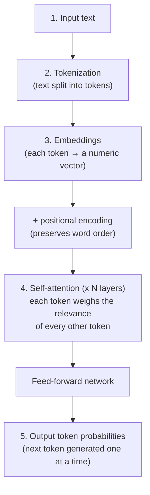
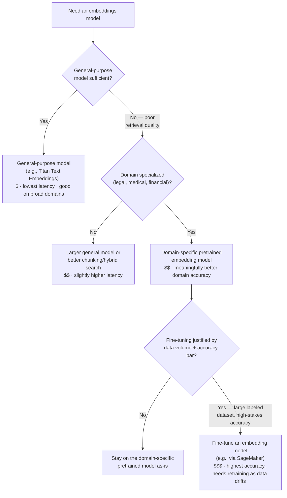
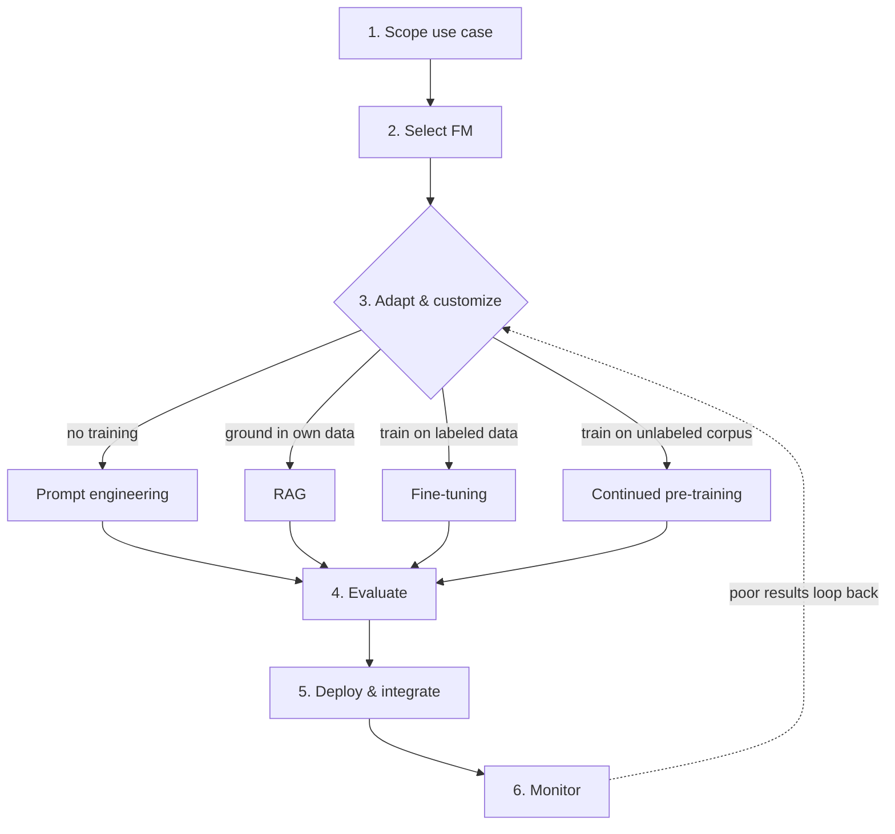
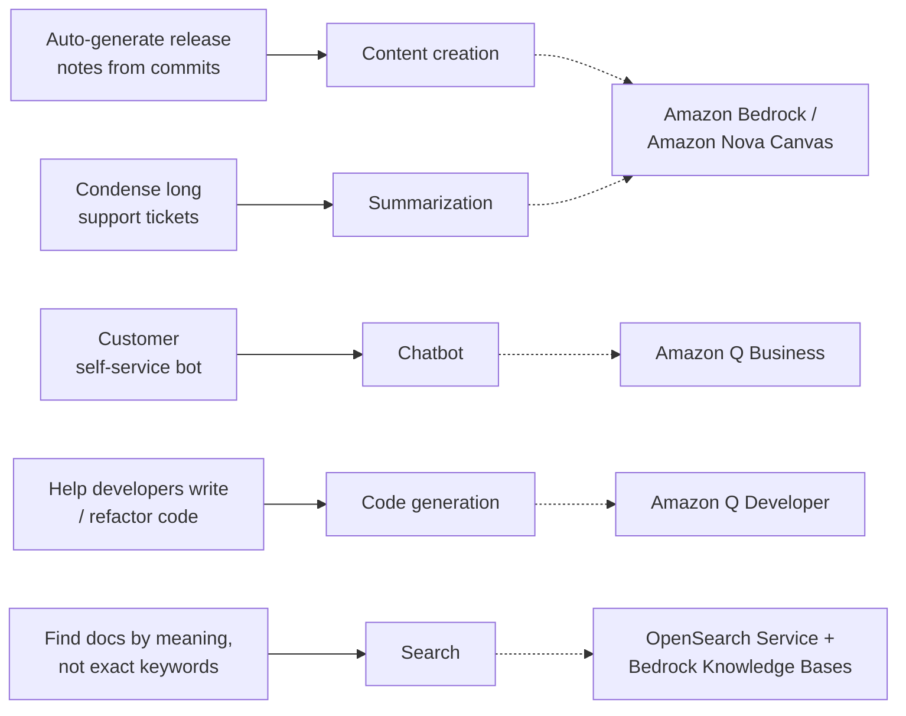
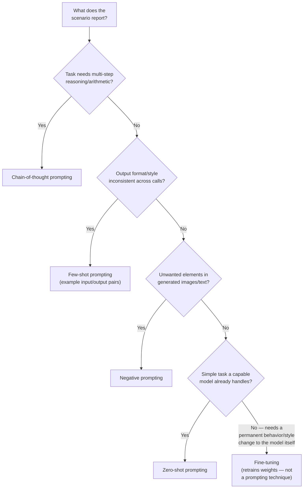
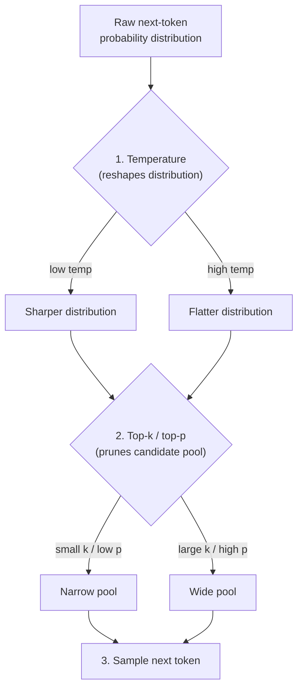
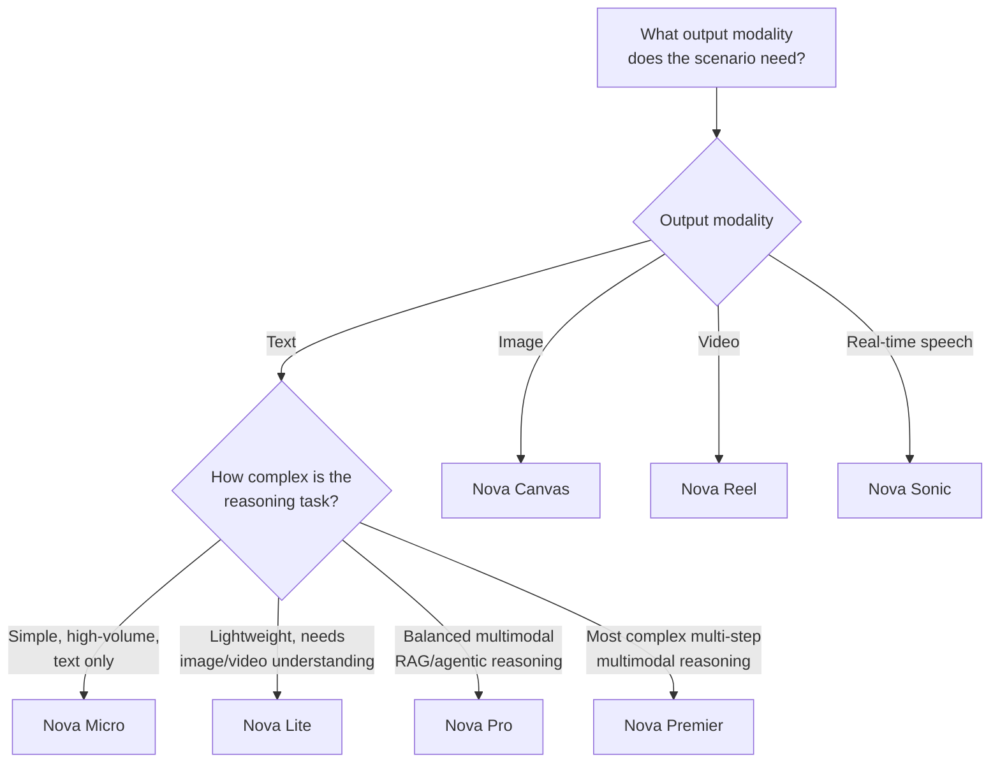
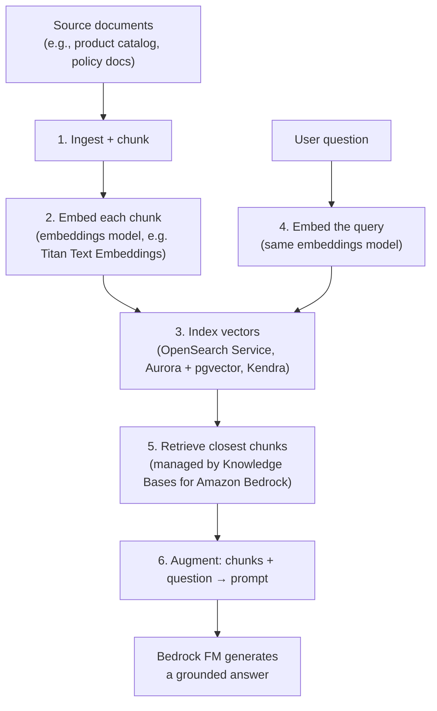

# Domain 2 Fast Track: Fundamentals of Generative AI

**Condensed guide** · full guide: [`docs/domain-2-fundamentals-of-generative-ai.md`](../domain-2-fundamentals-of-generative-ai.md) (2,213 lines) · **Last verified:** 2026-09-05

## How to use this fast track

This is a ~40%-length condensation of the full Domain 2 study guide, built
on top of that guide's own [Quick-reference cheat
sheet](../domain-2-fundamentals-of-generative-ai.md#quick-reference-cheat-sheet)
(line 1668) and expanded with the business-use-case, AWS-service,
prompt-engineering, and RAG material the cheat sheet only touches in
passing. It keeps **every testable concept** from the source — transformer
mechanics, the embedding-model selection tree, every GenAI advantage and
disadvantage, every prompt-engineering technique, the temperature/top-p/
top-k interaction table, every foundation-model selection criterion, the
full Amazon Nova family, RAG's six-step retrieval flow, and every AWS
generative AI service — while trimming the worked-example narration,
step-by-step scenarios, and repeated "AWS example" paragraphs down to
their one-line takeaways. Every section links back to the corresponding
section of the full guide for the complete explanation, worked examples,
and mini-quizzes.

Domain 2 is the **largest single domain** on the AWS Certified AI
Practitioner (AIF-C01) exam, at roughly **24% of scored questions**. Read
this fast track once you already know the material and just need the
tables and diagrams refreshed; read the [full
guide](../domain-2-fundamentals-of-generative-ai.md) first if any of these
terms are new to you. For the last 15-20 minutes before the exam, drop
down further to [`ULTRA-FAST-LEARN.md`](ULTRA-FAST-LEARN.md) — a
bullets-and-tables-only cram sheet built on top of this file.

**Where each section comes from**, for jumping straight to the full
prose, mini-quiz, and AWS example behind any condensed table below:

| This fast track | Full guide section | Approx. full-guide lines |
|---|---|---|
| 1. Transformer architecture and core concepts | [Section 1](../domain-2-fundamentals-of-generative-ai.md#1-generative-ai-core-concepts) | 52–299 |
| 2. Foundation model / LLM lifecycle | [Section 2](../domain-2-fundamentals-of-generative-ai.md#2-llm-lifecycle-basics) | 300–441 |
| 3. Advantages and disadvantages of generative AI | [Section 3](../domain-2-fundamentals-of-generative-ai.md#3-advantages-and-disadvantages-of-generative-ai) | 442–540 |
| 4. Business use cases | [Section 4](../domain-2-fundamentals-of-generative-ai.md#4-business-use-cases-for-generative-ai) | 541–625 |
| 5. AWS generative AI services and capabilities | [Section 5](../domain-2-fundamentals-of-generative-ai.md#5-aws-generative-ai-services-and-capabilities) | 626–742 |
| 6. Prompt engineering fundamentals | [Section 6](../domain-2-fundamentals-of-generative-ai.md#6-prompt-engineering-fundamentals) | 743–987 |
| 7. Foundation model selection criteria | [Section 7](../domain-2-fundamentals-of-generative-ai.md#7-foundation-model-selection-criteria) | 988–1122 |
| RAG architecture at a glance | Scattered across [Section 1](../domain-2-fundamentals-of-generative-ai.md#1-generative-ai-core-concepts), [Section 2](../domain-2-fundamentals-of-generative-ai.md#2-llm-lifecycle-basics), and [Section 5](../domain-2-fundamentals-of-generative-ai.md#5-aws-generative-ai-services-and-capabilities) | 197–226, 316–318, 633–635 |
| AWS service → use case table | [Comparison table](../domain-2-fundamentals-of-generative-ai.md#comparison-table-aws-generative-ai-services-at-a-glance) | 1648–1665 |
| Rapid-fire key terms | [Key terms glossary](../domain-2-fundamentals-of-generative-ai.md#key-terms-glossary) (31 terms, condensed to the highest-yield ~28 here) | 1745–1820 |

## Table of contents

- [1. Transformer architecture and core concepts](#1-transformer-architecture-and-core-concepts)
- [2. Foundation model / LLM lifecycle](#2-foundation-model--llm-lifecycle)
- [3. Advantages and disadvantages of generative AI](#3-advantages-and-disadvantages-of-generative-ai)
- [4. Business use cases](#4-business-use-cases)
- [5. AWS generative AI services and capabilities](#5-aws-generative-ai-services-and-capabilities)
- [6. Prompt engineering fundamentals](#6-prompt-engineering-fundamentals)
- [7. Foundation model selection criteria](#7-foundation-model-selection-criteria)
- [RAG architecture at a glance](#rag-architecture-at-a-glance)
- [AWS generative AI services comparison](#aws-generative-ai-services-comparison)
- [AWS service → use case table](#aws-service-use-case-table)
- [Worked-example distillations](#worked-example-distillations)
- [Rapid-fire key terms](#rapid-fire-key-terms)
- [Rapid self-check](#rapid-self-check)
- [Common exam traps checklist](#common-exam-traps-checklist)
- [Cross-domain connections](#cross-domain-connections)
- [Where to go deeper](#where-to-go-deeper)

---

## 1. Transformer architecture and core concepts

**Generative AI** is a subset of deep learning where models *generate* new
content (text, images, audio, code, video) instead of only predicting a
label or a number. Most text/code generative AI is built on **foundation
models (FMs)** — very large models pretrained on massive, broad datasets
and then adapted to many downstream tasks, unlike traditional ML models
trained from scratch for one narrow task.

**Core vocabulary:**

| Term | Definition |
|---|---|
| **Token** | The basic unit of text an LLM reads/generates (often a word, sub-word, or punctuation mark). **Tokens ≠ words** — pricing and context windows are measured in tokens. |
| **Embedding** | A numeric representation of data (word, sentence, document, image) capturing its *meaning* so a model can compute with it. |
| **Vector** | The actual array of numbers (e.g., `[0.12, -0.87, 0.33, ...]`) an embedding is stored as. Semantically similar inputs → numerically close vectors, enabling **semantic search**. |
| **Vector database** | Where vectors are stored/queried, e.g., Amazon OpenSearch Service, Aurora + `pgvector`, Amazon Kendra. |
| **Prompt / prompt engineering** | The input text given to an FM, and the practice of designing it for better output (see [Section 6](#6-prompt-engineering-fundamentals)). |
| **Foundation model (FM)** | A large model pretrained on broad data, adaptable via prompting, RAG, or fine-tuning. |
| **Large language model (LLM)** | An FM specialized for natural-language text — a subset of FMs, not a synonym for all FMs. |
| **Multimodal model** | An FM that accepts and/or generates more than one content type; input and output modalities can differ (e.g., text in, image out). |

**Transformer architecture** is the neural network design behind nearly
all modern LLMs. Its defining innovation is **self-attention**: each
token weighs the relevance of *every other token* in the input,
regardless of distance, instead of processing text strictly left to right
like older recurrent architectures. This gives transformers both
**long-range context** and **efficient parallel training**.

**Why self-attention matters:** because it computes a relevance weight
between *every* pair of tokens directly (not step-by-step through
intermediate tokens), a long-range link — e.g., resolving what "it" refers
to several sentences earlier — costs the same to compute as a link
between adjacent tokens. In "The cat sat on the mat because it was
tired," a trained attention layer assigns "it" its highest weight (0.62)
back to "cat," six tokens earlier, correctly resolving the pronoun.

> **Exam tip:** Distinguish an **embedding** (the semantic representation)
> from a **vector** (the numeric array it's stored as) from a **vector
> database** (where those arrays live). Also expect a **tokens ≠ words**
> question — a single word can be multiple tokens.

**AWS example:** a retailer wants a chatbot that answers questions using
its internal product catalog. Catalog documents are converted into
**embeddings** and stored as **vectors** in Amazon OpenSearch Service.
When a customer asks a question, it's embedded the same way, and
OpenSearch finds the closest catalog vectors — the retrieval step of
**RAG**, orchestrated by **Knowledge Bases for Amazon Bedrock**, which
passes the retrieved text plus the question as a prompt to an LLM (e.g.,
Claude on Bedrock) to generate the answer. See [RAG architecture at a
glance](#rag-architecture-at-a-glance) for the full six-step flow.

**Choosing an embedding model** is a genuine cost/accuracy trade-off, not
"always pick the best model." Work down the tree only as far as needed —
jumping straight to fine-tuning "to be safe" usually just adds training
and maintenance cost for accuracy a cheaper option already delivers:

## 2. Foundation model / LLM lifecycle

The generative AI lifecycle mirrors [Domain 1's ML development
lifecycle](../domain-1-fundamentals-of-ai-and-ml.md#2-the-ml-development-lifecycle),
but you're usually **adapting an existing FM** rather than training one
from scratch:

| # | Stage | AWS |
|---|---|---|
| 1 | **Scope the use case** — define the problem; is generative AI even the right fit? | — |
| 2 | **Select a foundation model** — modality, cost, latency, context window, licensing ([Section 7](#7-foundation-model-selection-criteria)) | Amazon Bedrock, SageMaker JumpStart |
| 3 | **Adapt and customize**, lightest to heaviest touch: prompt engineering → RAG → fine-tuning → continued pre-training | Bedrock prompt console; Knowledge Bases; Bedrock custom models/JumpStart fine-tuning; Bedrock continued pre-training |
| 4 | **Evaluate the model** against the use case | Amazon Bedrock Model Evaluation |
| 5 | **Deploy and integrate** | Bedrock API (on-demand/Provisioned Throughput) or a SageMaker endpoint |
| 6 | **Monitor** quality, cost, latency, safety; iterate | CloudWatch metrics; Guardrails for Amazon Bedrock |

This is an **iterative loop**: a poor evaluation sends you back to prompt
redesign, a different retrieval strategy, or fine-tuning — long before
you'd consider pretraining a brand-new FM (enormously expensive, almost
never the right exam answer for a business use case).

> **Exam tip:** "Up-to-date or proprietary company data without
> retraining" → **RAG**. "Learn a specific tone, format, or specialized
> labeled task" → **fine-tuning**. Full pretraining of a new FM is almost
> never the correct answer for a business use case.

**Bolded distinction:** **RAG** grounds answers in retrieved data *at
inference time* — it never touches model weights. **Fine-tuning** and
**continued pre-training** both retrain weights, on labeled task data and
unlabeled domain corpora respectively.

**AWS example:** a software company scopes an internal support assistant,
selects a mid-size text FM in **Amazon Bedrock**, first tries plain
**prompt engineering**, finds answers aren't grounded in the actual
runbooks, adds **Knowledge Bases for Amazon Bedrock** for RAG, evaluates
output quality with **Amazon Bedrock Model Evaluation**, deploys through
the Bedrock API, and monitors invocation metrics and feedback with
CloudWatch — iterating on retrieval and prompt design as gaps surface.

## 3. Advantages and disadvantages of generative AI

| Advantage | What it means |
|---|---|
| **Adaptability** | One FM handles many tasks (summarization, drafting, Q&A, code) via prompting alone |
| **Responsiveness** | Interactive, real-time conversational responses (chatbots, assistants) |
| **Simplicity / creativity** | Produces novel content/ideas instead of just a label or number |
| **Scalability** | One deployed FM serves many use cases/users, versus dozens of bespoke models |

| Disadvantage | Definition | Primary mitigation |
|---|---|---|
| **Hallucination** | Fluent, confident output that is **factually incorrect or fabricated** (a fundamental characteristic of next-token prediction, not a rare bug) | **RAG** grounds answers in real data; lower temperature helps marginally |
| **Interpretability (lack of)** | "Black box" — hard to explain *why* an FM produced a specific output | Human review; not fixed by inference parameters |
| **Inaccuracy** | Output is simply wrong/outdated/low quality — distinct from confidently fabricating | Model evaluation, RAG, fine-tuning on better data |
| **Nondeterminism** | Same prompt → **different outputs across runs** (sampling from a probability distribution) | Lower temperature/top-p/top-k (reduces, doesn't eliminate) |
| **Cost and compute intensity** | Large FMs, long context windows, and retries can be expensive at scale | Right-size the model; cap max tokens; lower temperature to cut retries |

**AWS example:** a legal team drafts contract summaries with an FM on
Bedrock (**adaptability**, **responsiveness**), then finds it occasionally
cites a clause number that doesn't exist (**hallucination**). They add
**RAG** via **Knowledge Bases for Amazon Bedrock** to ground responses in
the actual document, lower **temperature** to cut **nondeterminism**, and
require human review before anything reaches a client — since full
**interpretability** of *why* the model chose particular wording isn't
available regardless of these mitigations.

> **Exam tip:** **Hallucination** (confidently fabricating specifics) ≠
> **inaccuracy** (just wrong/low quality) — the exam tests this
> distinction directly. **Lowering temperature reduces (but does not
> eliminate) nondeterminism and hallucination risk**; **RAG** reduces
> hallucination by grounding answers in retrieved data, but does not
> restore interpretability or guarantee correctness.

## 4. Business use cases

| Use case | What it covers | AWS |
|---|---|---|
| **Content creation** | Draft marketing copy, product descriptions, emails, images from a prompt | Amazon Bedrock, Amazon Nova Canvas |
| **Summarization** | Condense long documents/transcripts/tickets into short summaries | Amazon Bedrock |
| **Chatbots / conversational assistants** | Natural-language help, often RAG-grounded in company data | Amazon Bedrock (custom) or **Amazon Q Business** (pre-built) |
| **Code generation** | Generate, explain, complete, refactor code from natural language | **Amazon Q Developer** |
| **Search** | **Semantic search** — find results by meaning via embeddings/vector similarity | Amazon OpenSearch Service + Bedrock Knowledge Bases |

Other exam-relevant use cases: translation, personalization of generated
content, **data augmentation** (synthetic training data for other ML
models), and text-to-image/text-to-video generation for design and
marketing.

**One company, five initiatives at once** — a favorite scenario shape
maps each stated initiative to exactly one use case and one AWS service,
never more than one of each:

> **Exam tip:** "Assistant grounded in **their own enterprise data with
> minimal setup**" → prefer the purpose-built **Amazon Q Business** over a
> custom Bedrock build from scratch — the same "purpose-built beats
> custom" pattern [Domain 1](../domain-1-fundamentals-of-ai-and-ml.md#5-aws-managed-aiml-services-conceptual-overview)
> uses for managed AI services vs. custom SageMaker models. Reserve a
> custom Bedrock build for deeper customization than a purpose-built
> assistant offers.

## 5. AWS generative AI services and capabilities

**Amazon Bedrock** — fully managed access to a choice of FMs from Amazon
and third parties (Anthropic, Meta, Mistral AI, Cohere, Stability AI)
through a **single, unified API**, no infrastructure to manage. Key
Bedrock capabilities:

| Capability | What it does |
|---|---|
| **Knowledge Bases for Amazon Bedrock** | Managed RAG: connects an FM to your own data (e.g., Amazon S3) for grounded, up-to-date answers |
| **Agents for Amazon Bedrock** | Lets an FM plan and execute multi-step tasks by calling your APIs/Lambda functions |
| **Guardrails for Amazon Bedrock** | Configurable safety/compliance filters — harmful content, denied topics, PII redaction |
| **Amazon Bedrock Model Evaluation** | Compares FM outputs (automatic metrics or human evaluators) to pick the best model |
| **Amazon Titan** | Amazon's own FM family in Bedrock (text and embeddings models) |
| **Amazon Nova** | Amazon's newer FM family — text, image (Nova Canvas), video (Nova Reel), real-time speech-to-speech (Nova Sonic); see [Section 7](#7-foundation-model-selection-criteria) |
| **Provisioned Throughput** | Reserved model capacity for consistent, predictable performance at steady, high-volume traffic (vs. on-demand) |

**Amazon Q** — generative-AI-powered assistants:

| Service | Purpose |
|---|---|
| **Amazon Q Business** | Fully managed enterprise assistant, answers/summarizes/acts **grounded in your company's own data and systems** (S3, SharePoint, Salesforce), with built-in access controls |
| **Amazon Q Developer** | Coding companion — code suggestions/explanations, security scanning, AWS resource Q&A, troubleshooting/cost optimization via natural language |

**Amazon SageMaker JumpStart** — a model hub inside SageMaker with
pretrained FMs and prebuilt ML solutions you can deploy/fine-tune with
more low-level control than Bedrock — for deeper customization, custom
infrastructure control, or mixing FMs with traditional ML inside
SageMaker's ecosystem.

**PartyRock** — a free, no-code Amazon Bedrock **Playground** website for
experimenting with FMs and prototyping simple generative AI apps quickly
— for learning/rapid prototyping, not production workloads.

**AWS example:** a company lets non-technical staff prototype a hackathon
app in **PartyRock**, builds a production chatbot grounded in its own
knowledge base with full API control in **Amazon Bedrock**, gives
employees an out-of-the-box assistant over SharePoint/Salesforce with
**Amazon Q Business**, speeds up code review with **Amazon Q Developer**,
and fine-tunes an open-source FM inside its existing SageMaker MLOps
pipelines with **Amazon SageMaker JumpStart** — five different needs, five
different services, one account.

> **Exam tip:** "No-code, quick experimentation" → **PartyRock**; "fully
> managed, single API across multiple FMs, minimal infra" → **Amazon
> Bedrock**; "pre-built assistant grounded in enterprise data out of the
> box" → **Amazon Q Business**; "help writing/reviewing code or asking
> about my AWS resources" → **Amazon Q Developer**; "deep customization,
> custom infra, or mix with SageMaker ML pipelines" → **SageMaker
> JumpStart**.

## 6. Prompt engineering fundamentals

**Prompt engineering** designs the input text given to an FM to reliably
get a desired output **without changing the model's weights**. A
well-formed prompt combines: **instruction + context + input data +
output indicator**.

| Technique | What it does | Changes model weights? |
|---|---|---|
| **Zero-shot prompting** | Perform a task with **no examples**, relying on pretraining alone | No |
| **Few-shot prompting** | Include a **small number of example input/output pairs** to show the desired pattern/format | No |
| **Chain-of-thought (CoT) prompting** | Instruct the model to reason **step by step** before the final answer — improves multi-step reasoning/arithmetic, at the cost of a longer response | No |
| **Negative prompting** | Tell the model what **not** to include or do (common in image generation, e.g., "no text, no watermark") | No |
| **Fine-tuning** *(contrast, not a prompting technique)* | Retrains the model's weights on labeled examples | **Yes** |

**Picking a technique from a scenario** — match the reported symptom to
the lightest-touch fix, and only reach for fine-tuning once prompting
alone can't fix the *specific* problem described:

Other tested concepts: **prompt template** (reusable prompt structure
with placeholders for variable content) and **prompt injection**
(malicious input tries to override a prompt's original instructions —
mitigated with input validation + **Guardrails for Amazon Bedrock**;
deep-dived in [Domain 4](../domain-4-guidelines-for-responsible-ai.md)/[Domain 5](../domain-5-security-compliance-governance.md)).

**Inference parameters** — tuned independently of the prompt text:

| Parameter | Controls | Low / small value | High / large value |
|---|---|---|---|
| **Temperature** | Randomness of next-token choice | More focused, deterministic, repeatable | More creative, varied, random |
| **Top-p** (nucleus sampling) | Cumulative-probability candidate pool | Narrower pool → safer, less varied | Wider pool → more diverse |
| **Top-k** | Fixed-size candidate pool (k most-likely tokens) | Small k → safer, less varied | Large k → more diverse |
| **Max tokens** (maximum length) | Cap on response length | Shorter responses, may truncate | Longer responses allowed |
| **Stop sequences** | Halts generation when matched | A matched string stops generation immediately (no gradient) | — |

**These three parameters are not independent** — they apply in sequence
to the same probability distribution:

| Temperature | Top-p / top-k | Effect | Why |
|---|---|---|---|
| Low | Low | **Deterministic, narrowly focused** | Sharp distribution + narrow pool both push toward the same few tokens |
| Low | High | **Still mostly deterministic** despite "wide" settings | Low temperature already concentrates probability mass on a handful of tokens |
| High | High | **Highly creative, varied** | Flat distribution + wide pool: many tokens have a real chance |
| High | Low | **Unexpectedly narrow/repetitive** — the classic trap | A small top-k/top-p throws away the long tail temperature just flattened in |
| Moderate | Moderate | **Balanced** | Common starting point for general-purpose chat |

**Cost/latency:** sampling settings don't change the per-token price —
they change **how many tokens you end up paying for and waiting on**,
through two indirect levers: (1) **retries from inconsistent output** —
high temperature/top-p producing a structured-output failure means a full
extra request/response cycle; (2) **response length before a stop
condition** — low temperature tends to produce terser completions that
stop sooner. **Max tokens** and **stop sequences** remain the *direct*
cost/latency levers; temperature/top-p/top-k are *indirect*, probabilistic
ones. (Worked example: dropping temperature 0.9 → 0.2 on a 50,000-call/day
JSON-classification workload cut the retry rate from 12% to 1.5%, saving
~$283.50/month and ~10,500 seconds/day of generation time — see the [full
guide's cost/latency
subsection](../domain-2-fundamentals-of-generative-ai.md#cost-and-latency-implications-of-temperature-top-p-and-top-k)
for the complete math.)

> **Exam tip:** A chatbot needing engaging creativity but never unsafe
> content needs a **low-to-moderate temperature** *plus* **Guardrails for
> Amazon Bedrock** as a separate safety layer — inference parameters
> control *how tokens are sampled*, they cannot enforce a content policy.
> Multi-step arithmetic/logic task, improve accuracy without retraining →
> **chain-of-thought**. Inconsistent format/style across calls →
> **few-shot**. Unwanted elements in generated images → **negative
> prompting**.

## 7. Foundation model selection criteria

| Factor | Ask yourself |
|---|---|
| **Cost** | Per-token (on-demand) or **Provisioned Throughput** — bigger/more capable models cost more per token |
| **Modality** | Does the model accept/produce the needed input/output types (text, image, audio, video)? |
| **Latency** | Real-time/interactive use cases need fast (usually smaller) models; batch/async workloads tolerate more |
| **Context window** | Is the input (plus any retrieved context) small enough to fit without chunking? |
| **Fine-tuning / customization support** | Can this model/provider be fine-tuned or continued-pre-trained if needed? |
| **Model size, accuracy, licensing** | Parameter count as a rough capability/cost proxy; validate accuracy with **Amazon Bedrock Model Evaluation**; check compliance/licensing terms |

**AWS example:** a real-time customer chatbot needs **low latency** and
only **text** modality, so the team picks a smaller, fast text FM instead
of a large multimodal one. A separate team summarizing lengthy legal
contracts needs a **large context window** to avoid chunking, and isn't
latency-sensitive since summaries run as an overnight batch job — a
different FM optimized for long-context accuracy over speed. Both teams
compare candidates with **Amazon Bedrock Model Evaluation** before
committing.

> **Exam tip:** Scenarios give **two or three constraints at once**
> ("real-time," "very long documents," "fixed budget") and expect you to
> weigh **all** of them — the biggest, most capable model is not
> automatically correct if latency or cost is called out.

**Amazon Nova family** — not one cost/latency ladder; pick by **output
modality** first, then by capability tier:

| Variant | Modality (in → out) | Relative cost/latency | Use for |
|---|---|---|---|
| **Nova Micro** | Text → text | Lowest | High-volume, cheap, latency-sensitive text (simple chat, classification) |
| **Nova Lite** | Text/image/video → text | Low | Lightweight multimodal chat, document Q&A with images |
| **Nova Pro** | Text/image/video → text | Moderate | Balanced multimodal RAG, moderate agentic reasoning |
| **Nova Premier** | Text/image/video → text | Highest | Most complex multi-step multimodal reasoning; teacher model for distillation |
| **Nova Canvas** | Text/image → image | Priced per image | Studio-quality image generation/editing |
| **Nova Reel** | Text/image → video | Priced per second | Short-form video generation (async) |
| **Nova Sonic** | Speech → speech | Priced per duration | Real-time speech-to-speech (voice assistants, IVR) |

> **Exam tip:** Inside the **text** tiers, Micro/Lite/Pro/Premier climb
> together in cost/latency/capability — pick the cheapest tier that meets
> the accuracy bar. **Canvas**, **Reel**, and **Sonic** are *not* a
> pricier rung on that same ladder — they're separate models chosen by
> required **output modality**, so image/video/real-time-voice scenarios
> point straight at them regardless of the text tiers.

## RAG architecture at a glance

**Retrieval Augmented Generation (RAG)** grounds an FM's answers in
retrieved external data **at inference time — it never retrains the
model**. This is what distinguishes it from fine-tuning, and it's the
primary lever for reducing **hallucination**.

| Step | What happens | AWS |
|---|---|---|
| 1. Ingest | Source documents loaded from a data source | Amazon S3, SharePoint, Salesforce |
| 2. Chunk + embed | Documents split into chunks; each converted to an embedding vector | Amazon Titan Text Embeddings |
| 3. Index | Vectors stored for similarity search | Amazon OpenSearch Service, Aurora + `pgvector`, Amazon Kendra |
| 4. Query embed | The user's question embedded the same way | Same embeddings model |
| 5. Retrieve | Vector store returns the closest chunks to the query vector | Managed by **Knowledge Bases for Amazon Bedrock** |
| 6. Augment + generate | Retrieved chunks + question passed as a prompt to an LLM, which generates a grounded answer | Bedrock FM (e.g., Claude, Titan) |

**Knowledge Bases for Amazon Bedrock** is the managed, no-retrain way to
wire steps 1–6 together without building custom retrieval code — it's the
answer any time a scenario says "ground FM answers in our own data
without retraining."

> **Exam tip:** **Fabricated/wrong facts** → reach for **RAG**. **Wrong
> tone, format, or style** → reach for **prompt engineering or
> fine-tuning**, not RAG. RAG grounds answers in data — it does **not**
> restore interpretability or guarantee correctness, and it does not by
> itself reduce nondeterminism.

## AWS generative AI services comparison

The full guide's [comparison
table](../domain-2-fundamentals-of-generative-ai.md#comparison-table-aws-generative-ai-services-at-a-glance)
lines up every service from [Section 5](#5-aws-generative-ai-services-and-capabilities)
against **customization level**, since that's the axis the exam actually
tests — not just "what is it":

| Service | What it is | Primary use case | Customization level | When to choose it |
|---|---|---|---|---|
| **Amazon Bedrock** | Fully managed access to multiple FMs via one API | Build custom generative AI applications (chat, RAG, agents, content generation) | High — prompt engineering, RAG, fine-tuning, agents, guardrails | Programmatic, production integration with a choice of FMs and fine-grained control |
| **Knowledge Bases for Amazon Bedrock** | Managed RAG capability within Bedrock | Ground FM answers in your own data without retraining | Medium — configure data sources and retrieval | Up-to-date, proprietary-data-grounded answers without fine-tuning |
| **Agents for Amazon Bedrock** | Managed orchestration for multi-step FM task execution | FM plans and calls your APIs/Lambda to complete tasks | Medium-High — define actions/APIs | The FM needs to take multi-step actions, not just answer questions |
| **Amazon Q Business** | Pre-built enterprise assistant | Answer questions/summarize/act over company data and systems | Low — connect data sources, minimal setup | A ready-made assistant fast, with built-in access controls, no custom app logic needed |
| **Amazon Q Developer** | Generative AI coding companion | Code suggestions, code explanation, security scans, AWS resource Q&A | Low — install/enable, no model management | Developer productivity and AWS troubleshooting, not a custom end-user app |
| **Amazon SageMaker JumpStart** | Model hub inside SageMaker | Deploy/fine-tune pretrained FMs and ML solutions with deep infra control | High — full SageMaker MLOps control | Deep customization/infra control, or FMs alongside traditional SageMaker ML pipelines |
| **PartyRock** | No-code Bedrock playground | Rapid, free, hands-on prompt/FM experimentation and prototyping | Low — no code, no infra | Learning prompt engineering or quickly prototyping an idea, not production workloads |

> **Exam tip:** the more "out of the box" a scenario needs, the more the
> answer shifts toward **Amazon Q** or **PartyRock**; the more custom,
> production-grade integration and control it needs, the more it shifts
> toward **Amazon Bedrock** or **SageMaker JumpStart**.

## AWS service → use case table

| If the scenario says... | Use... |
|---|---|
| "single API across multiple FMs, fully managed, minimal infra" | **Amazon Bedrock** |
| "ground FM answers in our own data without retraining" | **Knowledge Bases for Amazon Bedrock** (RAG) |
| "FM should plan/execute multi-step tasks calling our APIs/Lambda" | **Agents for Amazon Bedrock** |
| "block harmful content, denied topics, redact PII" | **Guardrails for Amazon Bedrock** |
| "compare FM outputs to pick the best model for a task" | **Amazon Bedrock Model Evaluation** |
| "reserved capacity for steady, high-volume, predictable performance" | **Provisioned Throughput** |
| "pre-built enterprise assistant grounded in company data/systems out of the box" | **Amazon Q Business** |
| "code suggestions, explanations, security scans, AWS resource Q&A" | **Amazon Q Developer** |
| "deploy/fine-tune pretrained FMs with deep infra control, mix with SageMaker MLOps" | **Amazon SageMaker JumpStart** |
| "free, no-code, quick FM experimentation/prototyping" | **PartyRock** |
| "text-to-image generation/editing" | **Amazon Nova Canvas** |
| "text/image-to-video generation" | **Amazon Nova Reel** |
| "real-time, bidirectional speech-to-speech" | **Amazon Nova Sonic** |

**Golden rule:** the more "out of the box" a scenario needs, the more the
answer shifts toward **Amazon Q** or **PartyRock**; the more custom,
production-grade control it needs, the more it shifts toward **Amazon
Bedrock** or **SageMaker JumpStart**.

---

## Worked-example distillations

The full guide closes with five step-by-step "## Worked example" sections.
Their scenario narration is trimmed here, but their **decision logic** is
exactly the kind of reasoning pattern scenario questions test — condensed
below to the rule each one teaches.

**Token budgeting for context window (RAG and long-document
summarization):** tokens ≠ words — use **1 token ≈ ¾ of an English word**
(equivalently, 100 words ≈ ~133 tokens) to translate a scenario's stated
document length or retrieved-passage count into an approximate token
count, then add prompt/instruction overhead and response headroom before
comparing against a candidate model's context window:

| Scenario shape | Approx. token budget | Sizing takeaway |
|---|---|---|
| RAG request: system prompt + 5 retrieved passages + conversation history + question + response headroom | ~1,900 tokens | Comfortably fits an 8K-token model with headroom to grow |
| Summarize a 40-page document (~20,000 words) in one prompt, no chunking | ~27,000 tokens | An 8K model can't hold it at all; a 32K model fits with modest headroom; a 200K model fits comfortably |

A request that exceeds the context window is **rejected as invalid
input**, not silently trimmed — "close enough" token estimates that skip
the overhead can point you at a model that's actually too small.

**Building an end-to-end generative AI support assistant** strings the
lifecycle, service choices, and prompting techniques into one build —
exactly the shape AIF-C01 scenario questions favor ("which single step is
missing or wrong?"):

| Build step | AWS choice | What it prevents |
|---|---|---|
| Scope + success criteria before picking a model | — | Choosing a model before the problem is defined |
| Access several candidate FMs through one API | **Amazon Bedrock** | Provisioning and hosting open-source models directly |
| Iterate on tone/format before writing app code | Zero-shot for FAQs, few-shot for reply tone (Bedrock playground) | Hard-coding formatting logic in the application |
| Block pricing-sheet leakage, harmful content, PII | **Guardrails for Amazon Bedrock** | A clever prompt talking the model out of the safety policy |
| Let the assistant take real action (order lookup) | **Agents for Amazon Bedrock** | The FM guessing an order status from training data |
| Compare models/prompts on real historical data | **Amazon Bedrock Model Evaluation** | Launching without confirming the hallucination-risk trade-off is acceptable |

> **Exam tip:** a scenario describing a generative AI project that skips
> guardrails, skips evaluation, or calls an open-source model directly
> instead of through a managed service — the correct answer is almost
> always to **add the missing AWS-managed safeguard**, not to write custom
> code to solve the same problem.

**Modality trade-off for a real-time voice assistant:** a scenario asking
for hands-free, sub-second, interruptible spoken conversation should point
at **Amazon Nova Sonic** (true audio-in/audio-out in one model call), not
a three-hop **Amazon Transcribe → Bedrock text FM → Amazon Polly**
pipeline — every extra network hop between "customer speaks" and
"assistant speaks back" works against a real-time latency requirement,
and a transcription error in hop one silently corrupts what the text
model reasons over in hop two. The same **Transcribe + text FM + Polly**
pipeline becomes the *better* fit once the requirement turns
**asynchronous** (e.g., overnight transcription/summarization of support
calls) — the deciding factor is always whether the scenario demands live,
real-time conversation or tolerates a one-directional/async workflow.

**Escalating lightest-touch to heaviest-touch (insurance claims-triage
lifecycle):** when a scenario reports that a lighter-touch customization
is insufficient, match the *specific* failure to the next-heaviest option
rather than jumping straight to full pretraining:

| Reported failure | Next step |
|---|---|
| Model fabricates or omits real facts (e.g., a policy clause that doesn't exist) | **RAG** — ground answers in the actual source documents |
| Output has the right facts but the wrong tone, format, or house style | **Fine-tuning** on labeled examples of the desired output |
| Model doesn't understand large-scale, specialized, **unlabeled** vocabulary before any labeled task begins | **Continued pre-training** |
| None of the above — needs a model that doesn't exist yet | Full pretraining (almost never the correct exam answer) |

**Amazon Q Business vs. a custom Bedrock assistant (cost and connector
trade-off):** the two options bill on different axes — Q Business charges
**per named user/month** regardless of usage volume; a custom Bedrock
assistant bills **per token generated**, tracking conversation volume
regardless of headcount. A lower raw token total does not automatically
win: Q Business's dozens of pre-built connectors (Zendesk, Salesforce,
Confluence, SharePoint, and more) and its **automatic inheritance of each
source system's own access permissions** absorb engineering cost — custom
ingestion pipelines and a hand-built, ACL-aware permissions layer — that a
bare token-cost comparison leaves out entirely.

> **Exam tip:** When a scenario states "minimal setup, ready-made,
> out-of-the-box, multiple existing enterprise data sources," a lower raw
> dollar total for the *other* option is a distractor, not a reason to
> build custom. When it instead needs deep customization, a bespoke
> multi-step agent, or only a single already-integrated source, the
> calculus flips toward a custom Bedrock build.

## Rapid-fire key terms

- **Generative AI** — subset of deep learning where models generate new
  content rather than only predicting a label or number.
- **Foundation model (FM)** — large model pretrained on broad data,
  adaptable to many tasks via prompting, RAG, or fine-tuning.
- **Large language model (LLM)** — an FM specialized for natural-language
  text; a subset of FMs, not a synonym for all FMs.
- **Multimodal model** — accepts and/or generates more than one content
  type; input and output modalities can differ.
- **Token** — the basic unit of text an LLM reads/generates; tokens ≠
  words.
- **Embedding** — a numeric representation capturing semantic meaning.
- **Vector** — the numeric array an embedding is stored as.
- **Vector database** — stores/queries embeddings by similarity.
- **Semantic search** — search by meaning (embeddings/vectors), not exact
  keyword match.
- **Transformer architecture** — the neural network architecture behind
  most modern LLMs, built on self-attention.
- **Self-attention** — lets each token weigh the relevance of every other
  token, regardless of distance.
- **Context window** — max tokens (input + often output) a model can
  consider at once.
- **Zero-shot / few-shot prompting** — no examples vs. a few example
  input/output pairs in the prompt.
- **Chain-of-thought prompting** — step-by-step reasoning before the
  final answer.
- **Negative prompting** — explicitly stating what to exclude.
- **Prompt injection** — malicious input overriding a prompt's original
  instructions.
- **Temperature / top-p / top-k** — inference parameters controlling
  randomness/diversity of next-token sampling.
- **Retrieval Augmented Generation (RAG)** — grounds FM answers in
  retrieved external data at inference time, without retraining.
- **Fine-tuning** — further training an FM's weights on labeled data.
- **Continued pre-training** — further training an FM on a large corpus
  of unlabeled domain data before task-specific fine-tuning.
- **Hallucination** — confident but fabricated/incorrect output.
- **Interpretability (lack of)** — the "black box" problem: hard to
  explain why an FM produced a given output.
- **Nondeterminism** — same prompt, different output across runs.
- **Amazon Bedrock** — managed access to multiple FMs via one API.
- **Knowledge Bases for Amazon Bedrock** — managed RAG capability.
- **Agents for Amazon Bedrock** — managed capability for FMs to plan and
  execute multi-step tasks.
- **Guardrails for Amazon Bedrock** — configurable safety/compliance
  filters.
- **Amazon Q Business / Amazon Q Developer** — pre-built enterprise
  assistant / generative AI coding companion.
- **Amazon SageMaker JumpStart** — model hub for deploying/fine-tuning
  pretrained FMs.
- **Provisioned Throughput** — reserved Bedrock capacity for steady,
  high-volume traffic.

## Rapid self-check

Fifteen quick recall questions — cover the answer column and try each one
before checking it. These are new questions, not a repeat of the full
guide's practice set.

| # | Question | Answer |
|---|---|---|
| 1 | An array like `[0.12, -0.87, 0.33, ...]` that captures a sentence's meaning — what is it called, and what produced it? | It's a **vector**; the process that derived it is called **embedding** |
| 2 | Why can self-attention resolve a pronoun several sentences back at no extra compute cost? | It computes a relevance weight between **every pair of tokens directly**, not step-by-step through intermediate tokens |
| 3 | A team needs domain-specific embeddings but has only a small labeled dataset — general-purpose embeddings underperform. What's the right stopping point on the embedding-model decision tree? | A **domain-specific pretrained embedding model**, not fine-tuning (limited labeled data doesn't justify it) |
| 4 | A scenario wants a model to use up-to-date, proprietary company data *without retraining* — which lifecycle option? | **RAG** |
| 5 | A scenario wants the model to adopt a specific tone and labeled output format — which lifecycle option? | **Fine-tuning** |
| 6 | Which GenAI disadvantage is "confidently stating a fact that is fabricated," distinct from just being wrong? | **Hallucination** |
| 7 | Which single technique reduces run-to-run output variation for an identical prompt? | Lowering **temperature** |
| 8 | A company wants a ready-made assistant grounded in Salesforce/SharePoint data with minimal setup — which service? | **Amazon Q Business** |
| 9 | Which Bedrock capability lets an FM call your own APIs/Lambda functions to complete multi-step tasks? | **Agents for Amazon Bedrock** |
| 10 | A developer includes three example Q&A pairs in a prompt before the real question. Which technique, and does it change model weights? | **Few-shot prompting**; **no**, weights are unchanged |
| 11 | Which inference parameter restricts sampling to the smallest set of tokens whose *cumulative probability* exceeds a threshold? | **Top-p** (nucleus sampling) — not top-k, which uses a fixed count |
| 12 | High temperature paired with a small top-k still produces narrow, repetitive output — why? | Top-k prunes away the long tail temperature just flattened in, before sampling happens |
| 13 | A team summarizing a 40-page contract in one prompt without chunking cares most about which selection criterion? | **Context window** |
| 14 | Inside the Amazon Nova family, which three variants are chosen by *output modality* rather than a text-capability tier? | **Nova Canvas** (image), **Nova Reel** (video), **Nova Sonic** (speech) |
| 15 | Which AWS capability is the answer whenever a scenario needs harmful content blocked or PII redacted from FM output? | **Guardrails for Amazon Bedrock** |

---

## Common exam traps checklist

- [ ] **Hallucination** (confidently fabricated specifics) ≠
      **inaccuracy** (just wrong/low quality) — don't conflate them.
- [ ] Lowering **temperature** reduces nondeterminism, but does **not**
      eliminate hallucination risk (that comes from training data/RAG,
      not sampling).
- [ ] **Top-p** = cumulative-probability threshold; **top-k** = fixed
      count of top tokens — don't swap these under pressure.
- [ ] High temperature + narrow top-p/top-k can still be repetitive; low
      temperature + wide top-p/top-k can still be near-deterministic —
      the three parameters interact, they aren't independent dials.
- [ ] **Few-shot prompting** changes nothing about model weights; only
      **fine-tuning** retrains them.
- [ ] Fabricated/wrong **facts** → **RAG**; wrong **tone/format/style** →
      prompt engineering or fine-tuning, not RAG.
- [ ] **RAG** grounds answers in data — it does **not** restore
      interpretability or guarantee correctness.
- [ ] A scenario with **two or three constraints at once** (real-time +
      long documents + fixed budget) wants you to weigh **all** of them,
      not just pick the biggest model.
- [ ] "No-code, quick experimentation" → **PartyRock**; "pre-built,
      grounded in enterprise data out of the box" → **Amazon Q
      Business**; "deep infra control / mix with SageMaker" →
      **SageMaker JumpStart**.
- [ ] Content-safety questions need **Guardrails for Amazon Bedrock** —
      raising/lowering inference parameters alone cannot enforce a
      content policy.
- [ ] Inside the Nova family, **Micro/Lite/Pro/Premier** are one
      cost/capability ladder; **Canvas/Reel/Sonic** are separate models
      picked by output modality, not a pricier rung on that ladder.
- [ ] Lowering temperature doesn't lower the per-token **price** — it
      lowers cost/latency *indirectly*, via fewer retries and shorter
      completions.

---

## Cross-domain connections

Domain 2 fundamentals feed directly into how later domains reason about
architecture, responsible AI, and security:

| Connects to | Shared concept | Why they're easy to conflate |
|---|---|---|
| [Domain 1, Section 2](../domain-1-fundamentals-of-ai-and-ml.md#2-the-ml-development-lifecycle) | The ML development lifecycle | Domain 2's FM lifecycle (Section 2 above) mirrors Domain 1's stages but swaps "train from scratch" for "adapt an existing FM" |
| [Domain 3, Section 1](../domain-3-applications-of-foundation-models.md#1-design-considerations-for-foundation-model-applications) | Foundation model selection criteria | Domain 2 introduces the criteria in the abstract; Domain 3 §1 applies the same set inside a full application design |
| [Domain 3, Section 2](../domain-3-applications-of-foundation-models.md#2-prompt-engineering-techniques) | Prompt engineering techniques | Domain 2 defines the vocabulary; Domain 3 §2 runs the same task through all techniques side by side |
| [Domain 3, Section 6](../domain-3-applications-of-foundation-models.md#6-vector-databases-and-embeddings-for-search-and-retrieval) | Embeddings and vector stores | Domain 2 defines tokens/embeddings; Domain 3 §6 makes the choice operational for a real RAG pipeline |
| [Domain 4, Section 2](../domain-4-guidelines-for-responsible-ai.md#2-identifying-bias-and-fairness-issues-in-training-data-and-model-outputs) | Hallucination vs. fairness-driven skew | Domain 2 teaches hallucination as a generic limitation; Domain 4 §2 distinguishes it from a demographic output skew |
| [Domain 5, security threats section](../domain-5-security-compliance-governance.md#common-security-threats-to-ai-systems-and-how-to-mitigate-them) | Prompt injection | Domain 2 teaches how to *build* a prompt; Domain 5 covers how an attacker manipulates that same construction |

---

## Where to go deeper

This fast track intentionally omits the full guide's step-by-step worked
examples, AWS-example paragraphs, mini-quizzes, and 24-question practice
set. Go back to the full guide for:

- [Domain overview and exam weighting](../domain-2-fundamentals-of-generative-ai.md#domain-overview)
- Five full "## Worked example" walkthroughs: RAG/long-document token
  estimation, an end-to-end generative AI support assistant, selecting
  models for a real-time voice assistant, the LLM lifecycle for an
  insurance claims-triage assistant, and Amazon Q Business vs. a custom
  Bedrock assistant
- Mini-quizzes embedded after each numbered section
- [Practice questions with a full answer
  key](../domain-2-fundamentals-of-generative-ai.md#practice-questions)

**What the 24 full-guide practice questions cover, by topic**, so you can
tell which of the tables above to re-check if you miss one:

| Question(s) | Topic |
|---|---|
| 1 | Nondeterminism vs. hallucination |
| 2, 7 | Amazon Bedrock; PartyRock |
| 3, 13 | RAG; embeddings + vector database for semantic search (select two) |
| 4 | Self-attention |
| 5, 9 | Chain-of-thought prompting; negative prompting |
| 6, 20 | Lack of interpretability ("black box"); hallucination |
| 8 | Temperature |
| 10, 14, 18 | Amazon Q Business; Amazon Q Developer; SageMaker JumpStart |
| 11, 16 | Context window; latency as the binding selection criterion |
| 12 | Few-shot prompting vs. fine-tuning |
| 15, 17 | Foundation model definition; token definition |
| 19, 21, 23, 24 | Business use cases: summarization, content creation with negative prompting, search + summarization pairing, multi-initiative mapping |
| 22 | Amazon Q Business vs. custom Bedrock application, paired to the right requirement |

For an even more condensed, bullets-only cram sheet, see
[`ULTRA-FAST-LEARN.md`](ULTRA-FAST-LEARN.md) in this same directory. For
material spanning multiple domains, see
[`docs/cross-domain-concept-map.md`](../cross-domain-concept-map.md) and
[`docs/cross-domain-scenario-questions.md`](../cross-domain-scenario-questions.md).

[← Back to the full Domain 2 guide](../domain-2-fundamentals-of-generative-ai.md)
