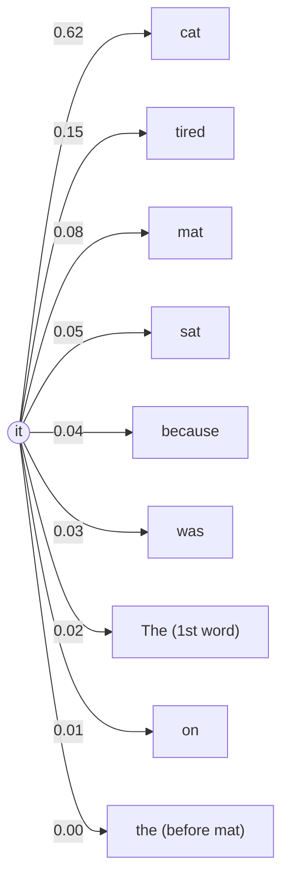
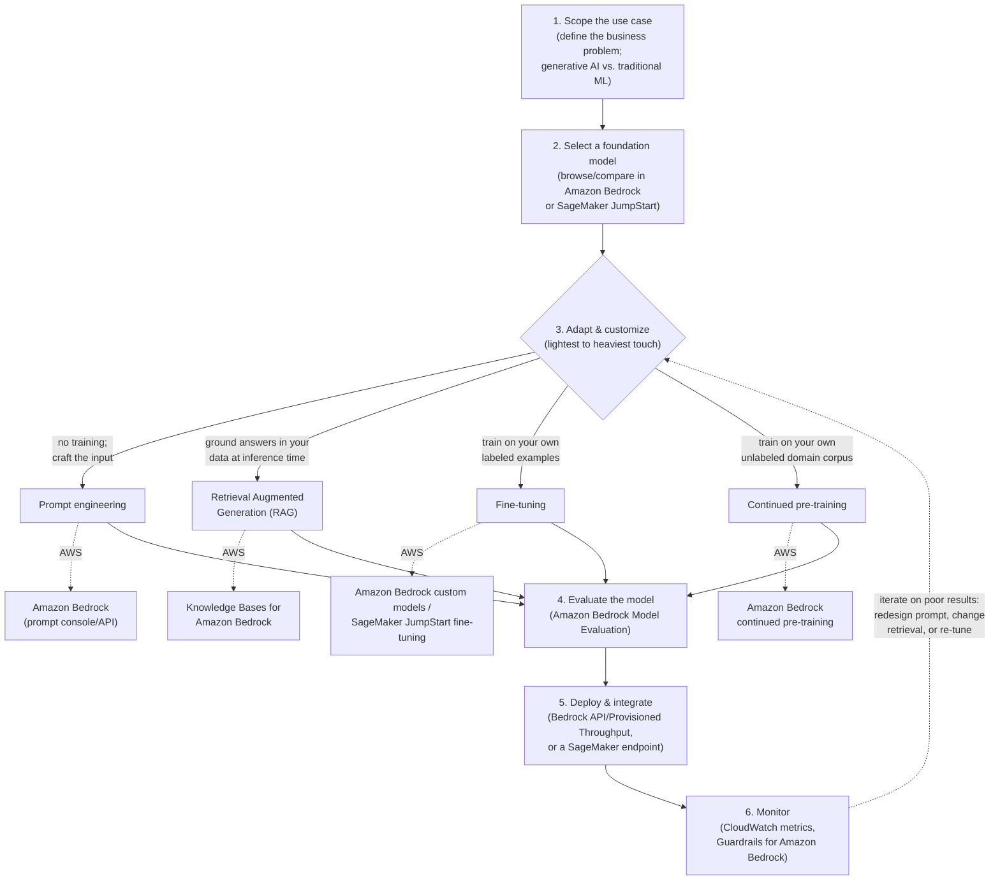
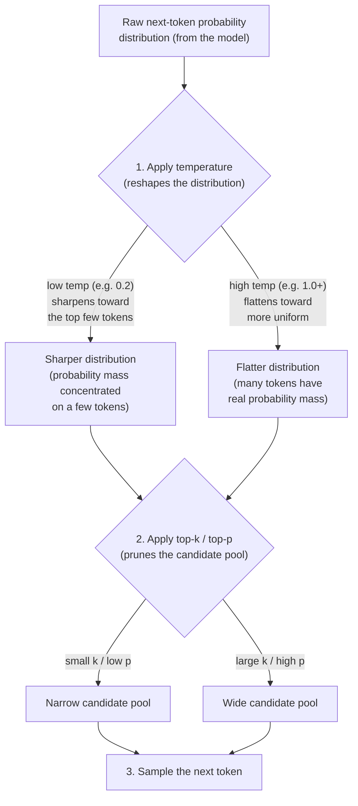

# Domain 2: Fundamentals of Generative AI

[← Domain 1: Fundamentals of AI and ML](domain-1-fundamentals-of-ai-and-ml.md) · **Domain 2 of 5** · [Domain 3: Applications of Foundation Models →](domain-3-applications-of-foundation-models.md)

**Last verified:** 2026-08-30

## Table of contents

- [1. Generative AI core concepts](#1-generative-ai-core-concepts)
- [2. LLM lifecycle basics](#2-llm-lifecycle-basics)
- [3. Advantages and disadvantages of generative AI](#3-advantages-and-disadvantages-of-generative-ai)
- [4. Business use cases for generative AI](#4-business-use-cases-for-generative-ai)
- [5. AWS generative AI services and capabilities](#5-aws-generative-ai-services-and-capabilities)
- [6. Prompt engineering fundamentals](#6-prompt-engineering-fundamentals)
- [7. Foundation model selection criteria](#7-foundation-model-selection-criteria)
- [Worked example: estimating tokens for RAG retrieval and long-document summarization](#worked-example-estimating-tokens-for-rag-retrieval-and-long-document-summarization)
- [Worked example: building an end-to-end generative AI support assistant](#worked-example-building-an-end-to-end-generative-ai-support-assistant)
- [Comparison table: AWS generative AI services at a glance](#comparison-table-aws-generative-ai-services-at-a-glance)
- [Quick-reference cheat sheet](#quick-reference-cheat-sheet)
- [Key terms glossary](#key-terms-glossary)
- [Practice questions](#practice-questions)
- [Answer key and explanations](#answer-key-and-explanations)

## Domain overview

Domain 2 is the **largest single knowledge domain** on the AWS Certified AI
Practitioner (AIF-C01) exam at roughly **24% of scored questions**. It tests
whether you understand the core building blocks of generative AI (tokens,
embeddings, vectors, transformers, foundation models), the basic lifecycle
of building a generative AI application, the genuine trade-offs generative
AI introduces (creativity and adaptability versus hallucination and
nondeterminism), where generative AI creates real business value, which AWS
service to reach for, how to steer a foundation model with a prompt, and how
to choose between competing foundation models for a given use case.

This domain matters because it is the conceptual foundation for [Domain 3](domain-3-applications-of-foundation-models.md)
(applications of foundation models — RAG, agents, fine-tuning, prompt
engineering techniques in depth) and [Domain 4](domain-4-guidelines-for-responsible-ai.md) (responsible AI). Questions
here are rarely about writing code; they are scenario-based ("a company
wants to do X with generative AI — which concept, technique, or AWS service
fits?") and reward being able to reason about *why* generative AI behaves
differently from traditional predictive ML.

---

## 1. Generative AI core concepts

**Generative AI** is a subset of deep learning in which models *generate*
new content (text, images, audio, code, video) rather than only predicting
a label or a number. Most modern generative AI for text and code is built
on **foundation models (FMs)** — very large models pretrained on massive,
broad datasets that can be adapted to many downstream tasks, as opposed to
traditional ML models that are trained from scratch for one narrow task.

Core vocabulary you must know cold:

- **Token** — the basic unit of text a large language model (LLM) reads and
  generates. A token is often a word, part of a word, or punctuation (not
  always a whole word). Text is **tokenized** before being fed into a
  model, and the model generates output one token at a time. Pricing and
  context-window limits for LLMs are usually measured **in tokens**, not
  words or characters.
- **Embedding** — a numeric representation of a piece of data (a word,
  sentence, document, image, etc.) that captures its *meaning* in a way a
  model can compute with. Embeddings are produced by an **embeddings
  model**.
- **Vector** — the actual array of numbers (e.g., `[0.12, -0.87, 0.33, ...]`)
  that an embedding is stored as. Semantically similar inputs produce
  vectors that are numerically close together in that high-dimensional
  vector space, which is what allows **semantic search** — finding results
  by *meaning* rather than by exact keyword match. AWS stores and queries
  these vectors using a **vector database/vector store** — for example,
  Amazon OpenSearch Service with its vector engine, Amazon Aurora with
  `pgvector`, or Amazon Kendra for retrieval.
- **Prompt / prompt engineering** — the input text you give a foundation
  model to elicit a desired output, and the practice of designing that
  input to get better, more reliable results. Covered in depth in Section
  6.
- **Transformer architecture (high level)** — the neural network
  architecture behind nearly all modern LLMs. Its key innovation is the
  **self-attention mechanism**, which lets the model weigh the relevance of
  every other token in the input when processing each token — regardless of
  distance between them — instead of processing text strictly left to right
  like older recurrent architectures. This is what lets transformers
  capture long-range context (e.g., resolving what a pronoun refers to many
  sentences earlier) and train efficiently in parallel on huge datasets. At
  a high level: input text → tokenization → embeddings → multiple layers of
  self-attention and feed-forward transformations → output token
  probabilities, generated one token at a time.
- **Foundation model (FM)** — a large model pretrained on a broad, massive
  corpus of data (text, code, images, etc.) that can be *adapted* to many
  different downstream tasks (summarization, Q&A, classification, content
  generation) through prompting, fine-tuning, or retrieval augmentation,
  instead of being trained from scratch for each task. Examples available
  through Amazon Bedrock include the Amazon Titan family, Anthropic's
  Claude, Meta's Llama, and others.
- **Large language model (LLM)** — a foundation model specialized for
  understanding and generating natural language text; a subset of
  foundation models.
- **Multimodal model** — a foundation model that can accept and/or generate
  more than one type of content — for example, an image-and-text model that
  can answer questions about an uploaded image, or a model that generates
  images from a text prompt. Multimodality applies to both **input**
  (what the model can understand) and **output** (what the model can
  produce), and the two don't have to match (e.g., a model can take a text
  prompt as input and generate an image as output).

Illustrating the transformer pipeline described above, tracing a short
example sentence from raw text to the model's next-token prediction:

```mermaid
%% Input text → Tokenization → Embeddings → Transformer block
%% (Self-Attention → Feed-Forward) → Output token probabilities
graph TD
    subgraph Input["1. Input text"]
        TEXT["\"The cat sat\""]
    end

    subgraph Tokenize["2. Tokenization"]
        TEXT --> T1["Token: The"]
        TEXT --> T2["Token: cat"]
        TEXT --> T3["Token: sat"]
    end

    subgraph Embed["3. Embeddings layer"]
        T1 --> E1["Vector: [0.12, -0.87, 0.33, ...]"]
        T2 --> E2["Vector: [0.55, 0.09, -0.61, ...]"]
        T3 --> E3["Vector: [-0.21, 0.66, 0.18, ...]"]
        E1 & E2 & E3 --> POS["+ positional encoding\n(preserves word order:\nThe, then cat, then sat)"]
    end

    subgraph Transformer["4. Transformer block (x N layers)"]
        POS --> ATTN["Self-Attention\n(each token weighs the relevance\nof every other token, e.g. 'sat'\nattends strongly to 'cat')"]
        ATTN --> FF["Feed-Forward network"]
    end

    subgraph Output["5. Output"]
        FF --> PROB["Output token probabilities"]
        PROB --> NEXT["Next token generated: \"on\"\n(one token at a time,\nfed back in for the next step)"]
    end
```

Self-attention for the token "it" in "The cat sat on the mat because it was
tired" — this is the row of the attention-weight matrix for query token
"it" against every other token (all keys) in the sentence, with the actual
numeric weights that a trained self-attention layer might produce (each
row of the full matrix sums to 1.0):



| Key token (attended to) | Attention weight from "it" |
| ------------------------ | --------------------------: |
| cat                       |                         0.62 |
| tired                     |                         0.15 |
| mat                       |                         0.08 |
| sat                       |                         0.05 |
| because                   |                         0.04 |
| was                       |                         0.03 |
| The (1st word)            |                         0.02 |
| on                        |                         0.01 |
| the (before mat)          |                         0.00 |
| **Total**                 |                     **1.00** |

The token "it" assigns its highest weight (0.62) back to "cat" — six
tokens earlier in the sentence — correctly resolving the pronoun's
antecedent, with a secondary weight (0.15) on "tired" to capture what "it"
is being described as. Because self-attention computes a weight between
*every* pair of tokens directly (rather than propagating state
step-by-step through intermediate tokens), this long-range link costs the
same to compute as a link between adjacent tokens — which is exactly why
transformers handle long-range dependencies so much better than older
recurrent architectures.

**AWS example:** A retailer wants a chatbot that can answer natural-language
questions using its internal product catalog. The catalog documents are
converted into **embeddings** and stored as **vectors** in Amazon
OpenSearch Service. When a customer asks a question, the question is also
embedded, and OpenSearch finds the catalog vectors closest to it — this is
the retrieval step of **Retrieval Augmented Generation (RAG)**, which is
orchestrated in Amazon Bedrock via **Knowledge Bases for Amazon Bedrock**,
which then passes the retrieved text plus the question as a **prompt** to
an LLM such as Claude on Bedrock to generate the final natural-language
answer.

> **Exam tip:** The exam frequently asks you to distinguish an
> **embedding** (the semantic representation) from a **vector** (the
> numeric array the embedding is stored as) and from a **vector database**
> (where those arrays are stored and searched). Also expect a question
> testing that **tokens ≠ words** — a single word can be multiple tokens,
> which is why context windows and LLM pricing are measured in tokens.

#### Mini-quiz: Test your understanding of generative AI core concepts

Quick self-check before moving on — try to answer before reading the
explanation.

1. A model converts the sentence "the customer is happy" into an array of
   numbers like `[0.41, -0.19, 0.88, ...]` that captures its meaning. What
   is this array called?
   A. A token
   B. A vector
   C. A prompt template
   D. A checkpoint

   **Answer: B** — A vector. The array of numbers itself is the vector;
   the process of deriving meaning as that array is called embedding. (A)
   is the unit of text the model reads, not the numeric output; (C) and
   (D) are unrelated terms.

2. Which statement correctly distinguishes a large language model (LLM)
   from a foundation model (FM)?
   A. An LLM is unrelated to foundation models
   B. An LLM is a foundation model specialized for natural-language text; all FMs are LLMs
   C. An LLM is a foundation model specialized for natural-language text; an LLM is one subset of the broader FM category
   D. A foundation model is always smaller than an LLM

   **Answer: C** — LLMs are a subset of foundation models focused on
   language; not every FM is an LLM (e.g., an image-generation FM is not
   a language model). (B) is wrong because FMs also include non-language
   modalities.

3. What makes the self-attention mechanism in a transformer different
   from older recurrent, left-to-right architectures?
   A. It processes tokens strictly in sequential order
   B. It lets each token weigh the relevance of every other token in the input, regardless of distance
   C. It eliminates the need for tokenization
   D. It only considers the immediately preceding token

   **Answer: B** — Self-attention compares each token against every
   other token in the input in parallel, which is what allows
   transformers to capture long-range context and train efficiently on
   large datasets.

---

## 2. LLM lifecycle basics

The generative AI / foundation model lifecycle is similar in spirit to the
traditional ML lifecycle from [Domain 1](domain-1-fundamentals-of-ai-and-ml.md#2-the-ml-development-lifecycle), but the stages and the AWS tooling
differ because you are usually **adapting an existing foundation model**
rather than training one from scratch:

1. **Scope the use case** — define the business problem and whether
   generative AI (versus traditional ML) is even the right fit.
2. **Select a foundation model** — choose an FM based on modality, cost,
   latency, context window, and licensing (see [Section 7](#7-foundation-model-selection-criteria)). AWS: browse and
   compare models in **Amazon Bedrock** or **Amazon SageMaker JumpStart**.
3. **Adapt and customize the model** for your use case, from lightest-touch
   to heaviest-touch:
   - **Prompt engineering** — no training at all; just craft the input
     ([Section 6](#6-prompt-engineering-fundamentals)).
   - **Retrieval Augmented Generation (RAG)** — ground the model's answers
     in your own data at inference time without changing model weights.
     AWS: **Knowledge Bases for Amazon Bedrock**.
   - **Fine-tuning** — further train the FM on your own labeled examples to
     adjust its weights for a specific task or style. AWS: **Amazon
     Bedrock custom models** (fine-tuning), **SageMaker JumpStart**
     fine-tuning.
   - **Continued pre-training** — further train the FM on a large corpus of
     your own *unlabeled* domain data to adapt it to specialized vocabulary
     (e.g., legal or medical text) before task-specific fine-tuning. AWS:
     **Amazon Bedrock continued pre-training**.
4. **Evaluate the model** — measure output quality against your use case.
   AWS: **Amazon Bedrock Model Evaluation** (automatic metrics or
   human-in-the-loop evaluation) to compare candidate FMs or fine-tuned
   variants.
5. **Deploy and integrate** — expose the model to your application. AWS:
   call FMs through the **Amazon Bedrock** API (on-demand or **Provisioned
   Throughput**), or deploy a SageMaker JumpStart model to a **SageMaker
   endpoint**.
6. **Monitor** — track output quality, cost, latency, and safety in
   production, and gather feedback to iterate. AWS: Amazon CloudWatch
   metrics for Bedrock invocations, **Guardrails for Amazon Bedrock** for
   ongoing safety/compliance filtering.

This is an **iterative loop**: poor evaluation results can send you back to
prompt redesign, a different retrieval strategy, or fine-tuning — usually
long before you'd consider pretraining a brand-new foundation model, which
is enormously expensive and rarely the right answer for a business
application.

**Visual summary — LLM/foundation model lifecycle:** the diagram below
traces the six stages end-to-end, shows how stage 3 branches into the four
customization options (lightest to heaviest touch), which AWS service
supports each option, and how a poor evaluation result can loop back into
another round of adaptation:



**AWS example:** A software company wants an internal support assistant.
They scope the use case (answer questions about internal runbooks), select
a mid-size text FM in **Amazon Bedrock**, first try plain **prompt
engineering**, find answers aren't grounded in their actual runbooks, add
**Knowledge Bases for Amazon Bedrock** for RAG, evaluate output quality with
**Amazon Bedrock Model Evaluation**, deploy the integration into their
support portal via the Bedrock API, and monitor invocation metrics and user
feedback with CloudWatch — iterating on the retrieval and prompt design as
gaps are found.

> **Exam tip:** When a scenario describes wanting a model to use
> **up-to-date or proprietary company data without retraining**, the answer
> is **RAG**, not fine-tuning. When a scenario wants the model to learn a
> **specific tone, format, or specialized labeled task**, the answer is
> **fine-tuning**. Full pretraining of a brand-new foundation model is
> almost never the correct exam answer for a business use case — it is
> the most expensive, slowest option and is rarely necessary.

#### Mini-quiz: Test your understanding of LLM lifecycle basics

Quick self-check before moving on — try to answer before reading the
explanation.

1. A team has already scoped its use case and selected a foundation model
   in Amazon Bedrock. Which lifecycle stage comes next?
   A. Monitor
   B. Adapt and customize the model
   C. Deploy and integrate
   D. Full pretraining

   **Answer: B** — After scoping and selecting a model, the next stage
   is adapting/customizing it (prompt engineering, RAG, fine-tuning, or
   continued pre-training) before evaluation and deployment.

2. Which customization option involves no training of any kind — only
   crafting the input given to the model?
   A. Fine-tuning
   B. Continued pre-training
   C. Prompt engineering
   D. Retrieval Augmented Generation (RAG)

   **Answer: C** — Prompt engineering is the lightest-touch option: it
   changes only the input text, not the model's weights or any
   retrieval pipeline.

3. A team wants to adapt a foundation model to specialized legal
   vocabulary using a large corpus of *unlabeled* legal documents, before
   later fine-tuning it for a specific labeled task. Which lifecycle
   option does this describe?
   A. Continued pre-training
   B. Prompt engineering
   C. Deployment
   D. Monitoring

   **Answer: A** — Continued pre-training. It further trains an FM on a
   large corpus of unlabeled, domain-specific data (e.g., legal or
   medical text) to adapt its vocabulary before task-specific
   fine-tuning.

---

## 3. Advantages and disadvantages of generative AI

**Advantages:**

- **Adaptability** — a single foundation model can be applied to many
  different tasks (summarization, drafting, Q&A, classification, code)
  through prompting alone, without building a separate model per task.
- **Responsiveness** — generative AI can produce interactive,
  conversational responses in real time, enabling natural-language
  interfaces (chatbots, assistants) instead of rigid forms or menus.
- **Simplicity / creativity** — generative AI can produce novel content
  (drafts, variations, ideas, code) rather than just a classification or a
  number, lowering the effort needed to start from a blank page.
- **Scalability** — a single deployed FM can serve many use cases and many
  users simultaneously, reducing the need to build and maintain dozens of
  bespoke models.

**Disadvantages:**

- **Hallucination** — the model generates output that is fluent and
  confident-sounding but **factually incorrect or fabricated** (e.g.,
  inventing a citation, an API, or a fact that does not exist). This is a
  fundamental characteristic of how generative models work (predicting
  plausible next tokens), not a rare bug.
- **Interpretability (lack of)** — it is difficult to explain *why* an FM
  produced a particular output, because the reasoning is distributed across
  billions of parameters rather than explicit rules — this is often called
  the "black box" problem.
- **Inaccuracy** — beyond outright hallucination, generated content can
  simply be wrong, outdated, or low quality, especially for narrow domains
  the model wasn't well trained on.
- **Nondeterminism** — the same prompt can produce **different outputs on
  different runs**, because generation involves sampling from a probability
  distribution over possible next tokens (controlled by parameters like
  temperature). This makes generative AI outputs harder to test and
  reproduce than traditional deterministic software.
- **Cost and compute intensity** — running large foundation models,
  especially at scale or with long context windows, can be significantly
  more expensive than traditional ML inference.

**AWS example:** A legal team uses an FM through Amazon Bedrock to draft
contract summaries (**adaptability**, **responsiveness**) but discovers the
model occasionally cites a clause number that doesn't exist in the source
document (**hallucination**). They mitigate this by grounding responses in
the actual document with **RAG (Knowledge Bases for Amazon Bedrock)**,
lowering the model's **temperature** to reduce **nondeterminism**, and
applying **Guardrails for Amazon Bedrock** plus mandatory human review
before anything is sent to a client, since full interpretability of *why*
the model chose particular wording is not available.

> **Exam tip:** Distinguish **hallucination** (fabricating specific facts
> confidently) from general **inaccuracy** (just being wrong/low quality) —
> the exam sometimes tests this nuance. Also know that **lowering
> temperature reduces (but does not eliminate) nondeterminism and
> hallucination risk**, and that RAG reduces hallucination by grounding
> answers in retrieved source data, but does not fully restore
> interpretability or guarantee correctness.

#### Mini-quiz: Test your understanding of advantages and disadvantages of generative AI

Quick self-check before moving on — try to answer before reading the
explanation.

1. A single foundation model can be prompted to draft emails, summarize
   documents, and answer questions, without building a separate model for
   each task. Which advantage does this illustrate?
   A. Hallucination
   B. Adaptability
   C. Interpretability
   D. Nondeterminism

   **Answer: B** — Adaptability. One FM handling many different tasks
   through prompting alone is the definition of adaptability; the other
   options are either disadvantages or unrelated.

2. A generative AI model confidently states a legal precedent that does
   not actually exist. What specific disadvantage is this an example of?
   A. Nondeterminism
   B. Cost and compute intensity
   C. Hallucination
   D. Scalability

   **Answer: C** — Hallucination. Fluent, confident, but fabricated
   output is the defining characteristic of hallucination, distinct from
   run-to-run output variation (nondeterminism).

3. Which technique reduces (without fully eliminating) run-to-run output
   variation for the same prompt?
   A. Raising the temperature parameter
   B. Lowering the temperature parameter
   C. Increasing the context window
   D. Switching to a multimodal model

   **Answer: B** — Lowering temperature makes the model's next-token
   probability distribution more peaked, reducing (but not eliminating)
   nondeterminism.

---

## 4. Business use cases for generative AI

- **Content creation** — draft marketing copy, product descriptions,
  emails, images, or other creative assets from a natural-language prompt,
  dramatically speeding up first-draft creation.
- **Summarization** — condense long documents, meeting transcripts, or
  customer support threads into short, digestible summaries.
- **Chatbots / conversational assistants** — provide natural-language,
  interactive help to customers or employees, often grounded in company
  data via RAG. AWS: build with **Amazon Bedrock** (custom) or deploy
  **Amazon Q Business** (pre-built enterprise assistant).
- **Code generation** — generate, explain, complete, and refactor code
  from natural-language descriptions or existing code context, speeding up
  software development. AWS: **Amazon Q Developer**.
- **Search** — power **semantic search** (finding results by meaning, not
  just keyword match) over documents, code, or product catalogs using
  embeddings and vector similarity, often paired with an LLM to generate a
  natural-language answer instead of a raw list of links.

Other exam-relevant use cases worth knowing: translation, personalization
of generated content, data augmentation (generating synthetic training
data for other ML models), and text-to-image/text-to-video generation for
design and marketing.

**AWS example:** A software company wants to (1) auto-generate release
notes from commit messages (content creation), (2) summarize long customer
support tickets for agents (summarization), (3) let customers self-serve
via a natural-language help bot (chatbot — Amazon Q Business), (4) help
developers write and refactor code faster (code generation — Amazon Q
Developer), and (5) let employees search internal documentation using
natural language instead of exact keywords (search — semantic search via
embeddings in Amazon OpenSearch Service, orchestrated through Amazon
Bedrock Knowledge Bases).

> **Exam tip:** When a scenario says a business wants an assistant that
> answers questions grounded in **their own enterprise data with minimal
> setup**, prefer the purpose-built **Amazon Q Business** over building a
> custom Bedrock application from scratch — similar to how [Domain 1](domain-1-fundamentals-of-ai-and-ml.md#5-aws-managed-aiml-services-conceptual-overview) favors
> purpose-built AI services over custom SageMaker models when one fits.
> Reserve a custom Amazon Bedrock build for cases needing deeper
> customization than a purpose-built assistant offers.

#### Mini-quiz: Test your understanding of business use cases for generative AI

Quick self-check before moving on — try to answer before reading the
explanation.

1. A company wants to condense long customer support call transcripts
   into short digests for supervisors to skim. Which business use case is
   this?
   A. Code generation
   B. Search
   C. Summarization
   D. Data augmentation

   **Answer: C** — Summarization. Condensing long content into a
   shorter digestible form is the definition of the summarization use
   case.

2. An engineering team wants developers to get natural-language
   explanations and completions of existing code. Which use case and AWS
   service pairing best fits?
   A. Search — Amazon OpenSearch Service
   B. Code generation — Amazon Q Developer
   C. Chatbot — Amazon Q Business
   D. Content creation — Amazon Nova Canvas

   **Answer: B** — Code generation (suggesting, explaining, completing
   code) is the use case, and Amazon Q Developer is the AWS service
   purpose-built for it.

3. A retailer wants employees to find internal documents by meaning
   rather than by typing the exact keywords used in the document. Which
   use case does this describe?
   A. Personalization
   B. Search (semantic search)
   C. Translation
   D. Content creation

   **Answer: B** — Finding results by meaning rather than exact keyword
   match is the definition of semantic search, powered by embeddings and
   vector similarity.

---

## 5. AWS generative AI services and capabilities

- **Amazon Bedrock** — a fully managed service providing access to a
  choice of high-performing **foundation models** from Amazon and
  third-party providers (e.g., Anthropic, Meta, Mistral AI, Cohere,
  Stability AI) through a **single, unified API**, without managing any
  underlying infrastructure. Key Bedrock capabilities:
  - **Knowledge Bases for Amazon Bedrock** — managed RAG: connects an FM to
    your own data sources (e.g., Amazon S3) for grounded, up-to-date
    answers.
  - **Agents for Amazon Bedrock** — lets an FM plan and execute
    multi-step tasks by calling your APIs/Lambda functions and reasoning
    over the results.
  - **Guardrails for Amazon Bedrock** — configurable safety and compliance
    filters (blocking harmful content, denied topics, PII redaction) applied
    consistently across models.
  - **Amazon Bedrock Model Evaluation** — compare FM outputs using
    automatic metrics or human evaluators to choose the best model for a
    task.
  - **Amazon Titan** — Amazon's own family of foundation models available
    in Bedrock (text and embeddings models).
  - **Amazon Nova** — Amazon's newer generation of foundation models on
    Bedrock, spanning text, image (**Amazon Nova Canvas**), and video
    (**Amazon Nova Reel**) generation; Nova Canvas is now Amazon's
    first-party image-generation model on Bedrock, superseding the
    original Titan Image Generator.
  - **Provisioned Throughput** — reserved model capacity for consistent,
    predictable performance at higher, steady traffic (versus flexible,
    consumption-based **on-demand** pricing).
- **Amazon Q** — a family of generative-AI-powered assistants:
  - **Amazon Q Business** — a fully managed, enterprise assistant that
    answers questions, summarizes, and takes action **grounded in your
    company's own data and systems** (e.g., S3, SharePoint, Salesforce),
    with built-in access controls that respect existing data permissions.
  - **Amazon Q Developer** — a generative-AI coding companion that
    provides code suggestions, code explanations, security scanning, and
    can also answer questions about your AWS account/resources and help
    troubleshoot, optimize cost, and perform AWS console tasks via natural
    language.
- **Amazon SageMaker JumpStart** — a model hub within Amazon SageMaker
  offering pretrained foundation models and end-to-end prebuilt ML
  solutions that you can deploy, fine-tune, and customize with more
  low-level control than Bedrock — useful when you need deeper
  customization, custom infrastructure control, or a wider mix of
  foundation and traditional ML models inside SageMaker's ecosystem.
- **PartyRock** — an Amazon Bedrock **Playground**: a free, no-code,
  hands-on website for experimenting with foundation models and building
  simple generative AI apps quickly, primarily used for learning and
  rapid prototyping/experimentation rather than production workloads.

**AWS example:** A company wants to (1) quickly let non-technical staff
experiment with prompts and prototype a small app for a hackathon
(**PartyRock**), (2) build a production customer-facing chatbot grounded in
their own knowledge base with full API control (**Amazon Bedrock** with
Knowledge Bases), (3) give employees an out-of-the-box assistant over their
internal SharePoint/Salesforce data (**Amazon Q Business**), (4) help their
developers write and review code faster (**Amazon Q Developer**), and (5)
fine-tune an open-source foundation model with deep infrastructure control
inside their existing SageMaker MLOps pipelines (**Amazon SageMaker
JumpStart**).

> **Exam tip:** A common exam pattern: "no-code, quick experimentation" →
> **PartyRock**; "fully managed, single API across multiple third-party
> FMs, minimal infrastructure" → **Amazon Bedrock**; "pre-built assistant
> grounded in enterprise data/systems out of the box" → **Amazon Q
> Business**; "help writing/reviewing code, or asking about my AWS
> resources" → **Amazon Q Developer**; "need deep customization, custom
> infra, or to mix with traditional SageMaker ML pipelines" → **SageMaker
> JumpStart**.

#### Mini-quiz: Test your understanding of AWS generative AI services and capabilities

Quick self-check before moving on — try to answer before reading the
explanation.

1. Which Amazon Bedrock capability connects a foundation model to your
   own data sources (e.g., Amazon S3) for grounded, up-to-date answers,
   without retraining the model?
   A. Guardrails for Amazon Bedrock
   B. Knowledge Bases for Amazon Bedrock
   C. Amazon Bedrock Model Evaluation
   D. Provisioned Throughput

   **Answer: B** — Knowledge Bases for Amazon Bedrock is the managed
   RAG capability that grounds FM answers in your own connected data
   sources.

2. A company wants reserved, dedicated model capacity in Amazon Bedrock
   for consistent performance under steady, high-volume traffic, instead
   of flexible consumption-based pricing. Which capability fits?
   A. Provisioned Throughput
   B. Agents for Amazon Bedrock
   C. Amazon Titan
   D. PartyRock

   **Answer: A** — Provisioned Throughput reserves model capacity for
   predictable performance at steady, high-volume traffic, versus
   on-demand pricing.

3. Which AWS offering lets a foundation model plan and execute multi-step
   tasks by calling your own APIs or Lambda functions and reasoning over
   the results?
   A. Amazon Bedrock Guardrails
   B. Agents for Amazon Bedrock
   C. Amazon Q Developer
   D. Amazon SageMaker JumpStart

   **Answer: B** — Agents for Amazon Bedrock is specifically built for
   FMs to plan and execute multi-step tasks against your APIs/Lambda
   functions.

---

## 6. Prompt engineering fundamentals

**Prompt engineering** is the practice of designing the input text
("prompt") given to a foundation model to reliably get the desired output,
**without changing the model's underlying weights**. A well-formed prompt
typically includes some combination of: an **instruction**, **context**,
**input data**, and an **output indicator** (a hint about the desired
format).

Core prompting techniques:

- **Zero-shot prompting** — ask the model to perform a task with
  **no examples**, relying entirely on what it learned during pretraining
  (e.g., "Summarize this article in three sentences."). Works well for
  general tasks large, capable FMs already handle well.
- **Few-shot prompting** — include a **small number of example
  input/output pairs** in the prompt before the actual task, to show the
  model the pattern or format you want (e.g., three example
  question/answer pairs before the real question). Improves consistency
  and format-adherence over zero-shot, especially for narrower or more
  unusual tasks, without any fine-tuning.
- **Chain-of-thought (CoT) prompting** — instruct the model to reason
  **step by step** before giving a final answer (e.g., "Think through this
  step by step" or "explain your reasoning, then give the final answer").
  Improves performance on tasks requiring multi-step reasoning or
  arithmetic/logic, at the cost of a longer (and more expensive) response.
- **Negative prompting** — explicitly tell the model what **not** to
  include or do (e.g., in image generation, "no text, no watermark, no
 blurry background"; in text generation, "do not include any
  disclaimers"). Most commonly associated with image-generation models,
  but applicable to text generation as well.

Other prompt-engineering concepts tested on the exam:

- **Prompt template** — a reusable prompt structure with placeholders for
  variable content, so a consistent instruction/format is applied across
  many inputs.
- **Inference parameters** you can tune independently of the prompt text:
  - **Temperature** — controls randomness/creativity. Lower values (near
    0) make output more focused and deterministic; higher values increase
    randomness and creative variation.
  - **Top-p (nucleus sampling)** — restricts the model to sampling from the
    smallest set of next-token candidates whose cumulative probability
    exceeds p, controlling diversity.
  - **Top-k** — restricts the model to sampling from only the k
    most-likely next tokens.
  - **Maximum length / max tokens** — caps how many tokens the response can
    contain.
  - **Stop sequences** — strings that, when generated, tell the model to
    stop generating further output.
- **Prompt injection** — a security risk where malicious input tries to
  override or manipulate the original instructions in a prompt (mitigated
  with input validation and **Guardrails for Amazon Bedrock**); covered
  further in [Domain 4](domain-4-guidelines-for-responsible-ai.md)/[Domain 5](domain-5-security-compliance-governance.md), but the term itself is fair game in Domain 2.

**How temperature, top-p, and top-k interact:** these three parameters are
not independent dials — they apply in sequence to the same underlying
probability distribution, so changing one changes what the others actually
do. The exam expects you to reason about the *combination*, not just each
parameter in isolation:



Because temperature is applied *first*, it determines how much probability
mass is even available for top-p/top-k to work with. This produces some
non-obvious combinations that the exam likes to test:

| Temperature | Top-p | Top-k | Qualitative effect | Why |
|---|---|---|---|---|
| Low (0.1–0.3) | Low (0.3–0.5) | Small (10–20) | **Deterministic, repeatable, narrowly focused** | Sharp distribution + narrow pool both push toward the same few high-probability tokens — good for classification, extraction, structured/JSON output. |
| Low (0.1–0.3) | High (0.9–1.0) | Large (200+) | **Still mostly deterministic**, despite the "wide" pool settings | Low temperature already concentrates almost all probability mass on a handful of tokens, so widening top-p/top-k barely changes what gets sampled — the extra candidates have near-zero probability anyway. |
| High (0.8–1.0) | High (0.9–1.0) | Large (200+) | **Highly creative, varied, less predictable** | Flat distribution *and* a wide candidate pool mean many tokens have a genuine chance of being picked. |
| High (0.8–1.0) | Low (0.2–0.3) | Small (5–10) | **Unexpectedly narrow / repetitive despite "high creativity" settings** — the classic interaction trap | Raising temperature alone flattens the distribution, but a small top-k/top-p still throws away the long tail immediately, so the model is forced back onto a handful of tokens — the creativity that temperature was supposed to add never survives the pruning step. This is why setting **top-k without adjusting temperature** (or vice versa) can produce surprising behavior. |
| Moderate (0.4–0.6) | Moderate (0.6–0.8) | Moderate (40–50) | **Balanced** — some variation without going off the rails | A middle setting on all three avoids both extremes; a common starting point for general-purpose chat. |

> **Exam scenario:** A chatbot needs to sound engaging and creative, but
> must never produce harmful or unsafe content. Simply raising temperature
> (or top-p/top-k) to get more creativity also raises the chance that an
> unsafe or off-policy response slips through — inference parameters only
> control *how tokens are sampled*, they cannot enforce a content policy.
> The correct approach combines a **low-to-moderate temperature** (enough
> creativity without maximizing randomness) with **Guardrails for Amazon
> Bedrock** as a separate safety layer that filters harmful content
> regardless of sampling settings. "Set temperature to 0" is wrong because
> it removes the creativity the use case requires; "raise top-k" alone is
> wrong because it does nothing to address harm — only guardrails do.

**AWS example:** A developer testing prompts in **PartyRock** or the
**Amazon Bedrock** console starts with a **zero-shot** prompt asking a model
to classify support tickets by urgency. Accuracy is inconsistent, so they
switch to **few-shot** prompting with five labeled example tickets, which
improves consistency. For a tickets-to-refund-decision task requiring
multi-step reasoning, they add **chain-of-thought** instructions ("first
list the relevant policy points, then decide"). For an image-generation
use case with **Amazon Nova Canvas**, they add **negative prompting**
("no logos, no people") to avoid unwanted elements, and lower
**temperature** for more predictable output formatting.

> **Exam tip:** Know the difference between **few-shot** (giving examples in
> the prompt) and **fine-tuning** (retraining the model's weights on
> labeled examples) — few-shot changes *nothing* about the model itself and
> only affects that single request. Also, if a question describes a task
> needing multi-step arithmetic or logical reasoning and asks how to
> improve accuracy *without* retraining, **chain-of-thought prompting** is
> almost always the correct answer.

#### Mini-quiz: Test your understanding of prompt engineering fundamentals

Quick self-check before moving on — try to answer before reading the
explanation.

1. A prompt engineer asks a model to classify support tickets with no
   examples in the prompt, relying entirely on what the model learned
   during pretraining. Which technique is this?
   A. Few-shot prompting
   B. Zero-shot prompting
   C. Chain-of-thought prompting
   D. Negative prompting

   **Answer: B** — Zero-shot prompting. Asking a model to perform a
   task with no examples at all is the definition of zero-shot
   prompting.

2. Which inference parameter restricts the model to sampling only from
   the smallest set of next-token candidates whose cumulative
   probability exceeds a threshold p?
   A. Temperature
   B. Top-k
   C. Top-p (nucleus sampling)
   D. Maximum length

   **Answer: C** — Top-p (nucleus sampling). Top-p restricts sampling to
   the smallest set of candidates whose cumulative probability exceeds
   p; top-k (B) instead restricts to a fixed count of the k most-likely
   tokens.

3. A developer includes three example question/answer pairs in the
   prompt before asking the model to answer a new, similar question.
   Which technique is this?
   A. Zero-shot prompting
   B. Few-shot prompting
   C. Fine-tuning
   D. Continued pre-training

   **Answer: B** — Few-shot prompting. Including a small number of
   input/output examples in the prompt to show the desired pattern is
   few-shot prompting; unlike fine-tuning (C), it changes nothing about
   the model's weights.

4. Which string, when generated by the model, tells it to stop producing
   further output?
   A. A prompt template
   B. A stop sequence
   C. A negative prompt
   D. A context window

   **Answer: B** — A stop sequence. Stop sequences are strings that,
   once generated, signal the model to stop generating further tokens.

---

## 7. Foundation model selection criteria

When a scenario asks you to choose between candidate foundation models,
evaluate them against these criteria:

- **Cost** — pricing is typically per input/output token (on-demand) or via
  **Provisioned Throughput** for steady, high-volume workloads; larger,
  more capable models generally cost more per token. Balance the smallest,
  cheapest model that still meets your accuracy bar against a larger,
  pricier model for harder tasks.
- **Modality** — what type(s) of data the model accepts as input and can
  produce as output (text-only, image generation, multimodal
  text+image, etc.) — the model must support the modalities your use case
  needs.
- **Latency** — how quickly the model responds; matters greatly for
  real-time, interactive use cases (chatbots) and less for asynchronous,
  batch workloads (overnight document summarization). Smaller models
  generally have lower latency than larger ones.
- **Context window** — the maximum number of tokens (input + often output)
  a model can consider at once. A large context window matters for tasks
  needing a lot of source material in a single prompt (e.g., summarizing a
  very long document without chunking), and is a key differentiator
  between candidate FMs.
- **Fine-tuning / customization support** — whether the model/provider
  supports fine-tuning, continued pre-training, or other customization
  (some FMs offered through Bedrock support customization, others are
  available only for on-demand inference as-is).
- Additional factors worth knowing: **model size** (parameter count, as a
  rough proxy for capability and cost), **accuracy/quality** for your
  specific task (best measured with **Amazon Bedrock Model Evaluation**),
  and **licensing/compliance** requirements for the provider's terms of
  use.

**AWS example:** A company building a real-time customer chatbot needs
**low latency** and only **text** modality, so they choose a smaller, fast
text FM in Amazon Bedrock rather than a large multimodal model. A separate
team summarizing lengthy legal contracts needs a **large context window**
to avoid splitting documents into chunks, and isn't latency-sensitive since
summaries run as an overnight batch job, so they choose a different FM
optimized for long-context accuracy over speed. Both teams use **Amazon
Bedrock Model Evaluation** to compare candidate models on their specific
data before committing.

> **Exam tip:** Scenario questions in this area usually give you two or
> three constraints at once (e.g., "real-time," "must process very long
> documents," "must stay within a fixed budget") and expect you to weigh
> **all** the stated constraints together, not optimize for a single
> factor — picking the biggest, most capable model is not always the
> correct exam answer if latency or cost constraints are called out.

#### Mini-quiz: Test your understanding of foundation model selection criteria

Quick self-check before moving on — try to answer before reading the
explanation.

1. A team building a real-time chatbot needs the fastest possible
   response time above all else. Which selection criterion matters most?
   A. Context window
   B. Latency
   C. Licensing
   D. Model size alone

   **Answer: B** — Latency. Real-time, interactive use cases are highly
   latency-sensitive, so response speed is the most directly relevant
   criterion.

2. A team summarizing very long legal contracts in a single prompt,
   without chunking the document, cares most about which selection
   criterion?
   A. Context window
   B. Latency
   C. Modality
   D. Cost per invocation only

   **Answer: A** — Context window. The maximum number of tokens a model
   can consider at once determines whether a long document fits in a
   single prompt without splitting it into chunks.

3. Which factor determines whether a foundation model can accept image
   input and produce text output, versus text-only input and output?
   A. Cost
   B. Modality
   C. Context window
   D. Fine-tuning support

   **Answer: B** — Modality. Modality describes what type(s) of data a
   model accepts as input and can produce as output (text, image,
   multimodal), and the model must support the modalities the use case
   needs.

---

## Worked example: estimating tokens for RAG retrieval and long-document summarization

[Section 7](#7-foundation-model-selection-criteria) lists context window as
a selection criterion, and its AWS example states that a team summarizing
lengthy legal contracts needs "a large context window" — but neither says
*how large is large enough*. Exam scenarios that describe a source
document's length, a conversation history, or a number of retrieved
passages expect you to translate that into an approximate token count and
compare it against a candidate model's window, not just recognize the
term. This walkthrough does that math for two of the most common scenario
shapes: a **RAG pipeline** and a **long-document summarization** job.
([Domain 3's context-window worked
example](domain-3-applications-of-foundation-models.md#worked-example-estimating-a-context-window-token-budget)
extends this into a full multi-model, multi-turn comparison.)

**Rule of thumb:** as [Section 1](#1-generative-ai-core-concepts) notes,
tokens ≠ words — a commonly used estimate is that **1 token ≈ ¾ of an
English word**, or equivalently, **100 words ≈ ~133 tokens**. This is an
approximation (actual tokenization varies by model and vocabulary), but
it's precise enough to eliminate models that are obviously too small,
which is what exam scenarios test.

**Example 1: token budget for a RAG pipeline.** A support team builds a
RAG pipeline on **Knowledge Bases for Amazon Bedrock**
([Section 5](#5-aws-generative-ai-services-and-capabilities)) that
retrieves passages from a product manual to answer a customer question.
One request to the model has to fit all of the following in its context
window at once:

| Request component | Approx. length | Approx. tokens |
|---|---|---|
| System prompt / instructions | ~150 words | ~200 tokens |
| Retrieved context (5 passages retrieved, ~120 words each) | ~600 words | ~800 tokens |
| Conversation history so far | ~300 words | ~400 tokens |
| User's current question | ~20 words | ~27 tokens |
| Headroom reserved for the model's response | — | ~500 tokens |
| **Total for this request** | | **~1,927 tokens** |

A model with an 8K-token context window comfortably fits this request with
plenty of headroom to grow. A model with only a 2K-token window would
already be tight before the response headroom is even reserved, forcing
the application to retrieve fewer passages, trim conversation history, or
move to a larger-context model.

**Example 2: token budget for long-document summarization.** A separate
team needs to summarize a 40-page internal policy document in a single
prompt, without splitting it into chunks:

1. Estimate words in the source document: ~500 words per page × 40 pages =
   **~20,000 words**.
2. Convert to tokens using the rule of thumb above: 20,000 words ÷ 0.75 ≈
   **~26,700 tokens** for the document alone.
3. Add a short summarization instruction (~50 tokens) and headroom for the
   summary output (~500 tokens): **~27,250 tokens** total.

Against that budget, an 8K-token model cannot hold the document in a
single prompt at all — it would need chunking despite the requirement not
to chunk it. A 32K-token model fits with modest headroom. A 200K-token
model (e.g., the Claude tier from [Domain 3, Section
1](domain-3-applications-of-foundation-models.md#context-window-vs-cost-and-latency-comparing-model-tiers))
fits comfortably, with room to spare for an even longer document or a
back-and-forth revision conversation about the summary.

> **Exam tip:** When a scenario gives you a page count, a word count, or a
> number of retrieved chunks, do the same two-step conversion: (1) words →
> tokens using the ~¾ rule of thumb, then (2) add prompt overhead and
> response headroom before comparing the total against each candidate
> model's stated context window. A request that exceeds the window isn't
> silently trimmed — it's rejected as invalid input, so "close enough"
> estimates that ignore overhead can lead you to the wrong model in a
> scenario question.

**AWS example:** The support team above estimates its per-request token
budget as shown in Example 1, confirms it comfortably fits an 8K-token
model, and keeps that smaller, cheaper, lower-latency model in **Amazon
Bedrock** rather than over-provisioning a larger-context model it doesn't
need. The policy team in Example 2 does the same math, finds their 40-page
document requires a much larger window, and selects a **200K-context**
model in Bedrock instead — the same estimation process leads two teams to
two different, correctly-sized model choices.

---

## Worked example: building an end-to-end generative AI support assistant

The callouts above illustrate one concept at a time. This walkthrough
combines the [LLM lifecycle](#2-llm-lifecycle-basics), [service
choices](#5-aws-generative-ai-services-and-capabilities), and [prompt
engineering](#6-prompt-engineering-fundamentals) into one continuous
build, since AIF-C01 scenario questions frequently describe a project this
way and ask which single step is missing or wrong.

**Scenario:** A software company wants to launch a generative AI assistant
that answers customer questions about its product, drafts first-pass
replies to support tickets, and never leaks the internal pricing sheet an
employee accidentally pastes into a prompt.

1. **Define the use case and success criteria.** The team scopes the
   assistant to two tasks — question answering and reply drafting — and
   sets a measurable bar (e.g., 80% of drafted replies need no more than a
   light edit before sending) before selecting any model, mirroring how
   Domain 1's lifecycle starts with the business goal, not the data (see
   [Domain 1, Section 2](domain-1-fundamentals-of-ai-and-ml.md#2-the-ml-development-lifecycle)).
2. **Choose the foundation model in Amazon Bedrock.** Rather than
   provisioning GPU infrastructure and hosting an open-source model
   themselves, the team accesses several candidate FMs (from providers
   such as Anthropic, Meta, and Amazon) through **Amazon Bedrock**'s
   single API, so they can swap models without re-architecting the
   application. They pick a lower-latency, lower-cost model for live chat
   and evaluate a larger model for offline ticket-reply drafting, applying
   the selection criteria in [Section 7](#7-foundation-model-selection-criteria).
3. **Prompt-engineer the base behavior.** Before writing any application
   code, the team iterates in the **Amazon Bedrock playground**, using
   **zero-shot** prompts for straightforward FAQ-style questions and
   **few-shot** prompts (2–3 example ticket/ideal-reply pairs) to steer the
   tone and format of drafted replies, per the techniques in [Section
   6](#6-prompt-engineering-fundamentals).
4. **Add guardrails before exposing it to customers.** The team configures
   **Amazon Bedrock Guardrails** to block prompts and outputs that mention
   pricing-sheet-style content, filter harmful content, and redact any PII
   a customer might paste into the chat — enforced independently of
   whatever the underlying FM would otherwise do, so a clever prompt can't
   talk the model out of the policy.
5. **Wire up business-system actions with an agent.** For the "check my
   order status" sub-flow, the team configures an **Amazon Bedrock Agent**
   that can call the company's internal order-lookup API and return a
   grounded, real-time answer instead of the FM guessing from its training
   data — turning the assistant from a pure text generator into an
   application that takes action.
6. **Evaluate before launch.** The team runs **Amazon Bedrock Model
   Evaluation**, comparing candidate models and prompt variants on a
   held-out set of real historical tickets using both automatic metrics
   and human review, and specifically checks the **advantages/disadvantages
   trade-offs** from [Section 3](#3-advantages-and-disadvantages-of-generative-ai) — confirming the
   productivity gain from drafted replies is worth the residual
   hallucination risk given the guardrails now in place.
7. **Deploy and monitor.** The assistant goes live behind the existing
   support-chat UI, calling the Bedrock API for both the chat and
   ticket-drafting paths. The team logs every prompt/response pair (with
   PII already redacted by Guardrails) and periodically re-runs Model
   Evaluation as new FM versions become available in Bedrock, treating
   model selection as an ongoing decision rather than a one-time choice.

> **Exam tip:** A common scenario pattern describes a generative AI project
> that skips guardrails, skips evaluation, or has the application call an
> open-source model directly instead of through a managed service — the
> correct answer is almost always to add the missing AWS-managed
> safeguard (**Guardrails**, **Model Evaluation**) rather than to write
> custom code to solve the same problem, since "least implementation
> effort using a managed AWS service" is the exam's default preference.

---

## Comparison table: AWS generative AI services at a glance

| Service | What it is | Primary use case | Customization level | When to choose it |
|---|---|---|---|---|
| **Amazon Bedrock** | Fully managed access to multiple FMs via one API | Build custom generative AI applications (chat, RAG, agents, content generation) | High — prompt engineering, RAG, fine-tuning, agents, guardrails | You need programmatic, production integration with a choice of FMs and fine-grained control |
| **Knowledge Bases for Amazon Bedrock** | Managed RAG capability within Bedrock | Ground FM answers in your own data without retraining | Medium — configure data sources and retrieval | You need up-to-date, proprietary-data-grounded answers without fine-tuning |
| **Agents for Amazon Bedrock** | Managed orchestration for multi-step FM task execution | FM plans and calls your APIs/Lambda to complete tasks | Medium-High — define actions/APIs | You need the FM to take multi-step actions, not just answer questions |
| **Amazon Q Business** | Pre-built enterprise assistant | Answer questions/summarize/act over company data and systems | Low — connect data sources, minimal setup | You want a ready-made assistant fast, with built-in access controls, and don't need custom app logic |
| **Amazon Q Developer** | Generative AI coding companion | Code suggestions, code explanation, security scans, AWS resource Q&A | Low — install/enable, no model management | Your goal is developer productivity and AWS troubleshooting, not a custom end-user app |
| **Amazon SageMaker JumpStart** | Model hub inside SageMaker | Deploy/fine-tune pretrained FMs and ML solutions with deep infra control | High — full SageMaker MLOps control | You need deep customization/infra control or want FMs alongside traditional SageMaker ML pipelines |
| **PartyRock** | No-code Bedrock playground | Rapid, free, hands-on prompt/FM experimentation and prototyping | Low — no code, no infra | You want to learn prompt engineering or quickly prototype an idea, not run production workloads |

> **Exam tip:** The unifying pattern tested across this table: **the more
> "out of the box" a scenario needs to be, the more the answer shifts
> toward Amazon Q or PartyRock; the more custom, production-grade
> integration and control it needs, the more the answer shifts toward
> Amazon Bedrock or SageMaker JumpStart.**

---

## Quick-reference cheat sheet

A condensed, one-page (print-friendly) recap of this domain's
highest-yield material for last-minute review right before the exam.
Domain 2 is the largest single knowledge domain on the exam (**~24%** of
scored questions), so this page is worth a final pass the morning of the
exam. It restates material covered in full in [Section 1](#1-generative-ai-core-concepts), [Section 6](#6-prompt-engineering-fundamentals), and [Section 7](#7-foundation-model-selection-criteria) —
it is not a substitute for reading those sections, only a fast recall
aid once you already have.

**Transformer architecture and self-attention at a glance (Section 1):**

| Stage | What happens |
|---|---|
| Input text | Raw text the model will process |
| Tokenization | Text split into tokens (word/sub-word units) |
| Embeddings | Each token mapped to a numeric vector capturing meaning |
| Positional encoding | Added to embeddings so word order is preserved |
| Self-attention (× N layers) | Each token weighs the relevance of **every other token**, regardless of distance |
| Feed-forward network | Per-token transformation applied after attention |
| Output | Next-token probabilities, generated **one token at a time** |

- **Self-attention is the defining innovation** — unlike older recurrent
  (left-to-right, one-token-at-a-time-dependency) architectures, it
  computes a relevance weight between *every* pair of tokens directly, so
  a long-range link (e.g., resolving a pronoun several sentences back)
  costs no more to compute than a link between adjacent tokens.
- This is what gives transformers both **long-range context** and
  **efficient parallel training** on huge datasets.

**Inference parameters — qualitative effect cheat sheet (Section 6):**

| Parameter | Controls | Low / small value | High / large value |
|---|---|---|---|
| Temperature | Randomness of next-token choice | More focused, deterministic, repeatable | More creative, varied, random |
| Top-p (nucleus sampling) | Cumulative-probability candidate pool | Narrower candidate pool → safer, less varied | Wider candidate pool → more diverse |
| Top-k | Fixed-size candidate pool (k most-likely tokens) | Small k → safer, less varied | Large k → more diverse |
| Max tokens (maximum length) | Cap on response length | Shorter responses, may truncate | Longer responses allowed |
| Stop sequences | N/A — not a scale | A matched string halts generation immediately (no gradient) | |

- Temperature, top-p, and top-k all trade off **predictability vs.
  creativity/diversity** — none of them retrain or change model weights.
- None of these parameters reduce **hallucination**; only grounding
  techniques like RAG address factual accuracy.

**Foundation model selection criteria checklist (Section 7) — weigh all together, not one at a time:**

| Factor | Ask yourself |
|---|---|
| Cost | Per-token (on-demand) or Provisioned Throughput — bigger/more capable models cost more per token |
| Modality | Does the model accept/produce the needed input/output types (text, image, audio, video)? |
| Latency | Real-time/interactive use cases need fast (usually smaller) models; batch/async workloads can tolerate more |
| Context window | Is the input (plus any retrieved context) small enough to fit without chunking? |
| Fine-tuning / customization support | Can this model/provider be fine-tuned or continued-pre-trained if needed? |
| Model size, accuracy, licensing | Parameter count as a rough capability/cost proxy; task-specific accuracy (validate with Bedrock Model Evaluation); compliance/licensing terms |

**Common exam traps:**

- A scenario giving **two or three constraints at once** (e.g.,
  "real-time" + "must process very long documents" + "fixed budget")
  wants you to weigh **all** stated constraints — the biggest, most
  capable model is not automatically correct if latency or cost is
  called out.
- **Top-p** restricts sampling to the smallest set of candidates whose
  *cumulative probability* exceeds a threshold; **top-k** restricts to a
  *fixed count* of the most-likely tokens — don't swap these under
  pressure.
- **Few-shot prompting** (examples in the prompt) changes nothing about
  the model's weights and only affects that one request; **fine-tuning**
  retrains the weights on labeled data. Don't confuse the two.
- Lowering **temperature** reduces (but does not eliminate)
  nondeterminism — it does not remove hallucination risk, which comes
  from the model's underlying knowledge/training, not its sampling
  parameters.

---

## Key terms glossary

> Looking for a term from another domain? [`docs/master-glossary.md`](master-glossary.md) indexes every domain's key terms alphabetically with domain tags (e.g. `[D1, D3]`) and links back here.

- **Generative AI** — subset of deep learning where models generate new
  content (text, images, audio, code) rather than only predicting a label.
- **Foundation model (FM)** — a large model pretrained on broad data that
  can be adapted to many downstream tasks via prompting, RAG, or
  fine-tuning.
- **Large language model (LLM)** — a foundation model specialized for
  understanding and generating natural language text.
- **Multimodal model** — a model that can accept and/or generate more than
  one type of content (e.g., text and images).
- **Token** — the basic unit of text an LLM processes and generates; often
  a word or part of a word.
- **Embedding** — a numeric representation of data that captures its
  semantic meaning.
- **Vector** — the numeric array an embedding is stored as; semantically
  similar items have vectors that are numerically close together.
- **Vector database** — a database optimized for storing and querying
  embeddings by similarity (e.g., Amazon OpenSearch Service vector engine).
- **Semantic search** — search that matches by meaning (via embeddings/
  vectors) rather than exact keyword match.
- **Transformer architecture** — the neural network architecture behind
  most modern LLMs, built on the self-attention mechanism.
- **Self-attention** — the mechanism that lets a transformer weigh the
  relevance of every other token when processing each token.
- **Prompt** — the input text given to a foundation model to elicit a
  desired output.
- **Prompt engineering** — designing prompts to reliably get better model
  output without changing model weights.
- **Zero-shot prompting** — asking a model to perform a task with no
  examples in the prompt.
- **Few-shot prompting** — including a small number of example input/output
  pairs in the prompt to demonstrate the desired pattern.
- **Chain-of-thought prompting** — instructing a model to reason step by
  step before answering.
- **Negative prompting** — explicitly telling a model what not to include
  or do.
- **Temperature** — an inference parameter controlling randomness; lower
  values are more deterministic, higher values are more creative/random.
- **Top-p / Top-k** — inference parameters that restrict next-token
  sampling to the most probable candidates, controlling output diversity.
- **Context window** — the maximum number of tokens a model can consider
  in a single prompt/response.
- **Hallucination** — fluent, confident model output that is factually
  incorrect or fabricated.
- **Nondeterminism** — the same prompt can produce different outputs on
  different runs due to sampling.
- **Retrieval Augmented Generation (RAG)** — grounding an FM's answers in
  retrieved external data at inference time, without retraining the model.
- **Fine-tuning** — further training a foundation model on your own labeled
  data to adapt its weights for a specific task or style.
- **Continued pre-training** — further training a foundation model on a
  large corpus of unlabeled domain data before task-specific fine-tuning.
- **Amazon Bedrock** — fully managed service offering a choice of
  foundation models via a single API.
- **Knowledge Bases for Amazon Bedrock** — managed RAG capability in
  Bedrock.
- **Agents for Amazon Bedrock** — managed capability for FMs to plan and
  execute multi-step tasks by calling your APIs.
- **Guardrails for Amazon Bedrock** — configurable safety/compliance
  filters applied to FM inputs and outputs.
- **Amazon Q Business** — pre-built enterprise generative AI assistant
  grounded in company data and systems.
- **Amazon Q Developer** — generative AI coding companion and AWS resource
  assistant.
- **Amazon SageMaker JumpStart** — model hub for deploying/fine-tuning
  pretrained foundation models within SageMaker.
- **PartyRock** — a free, no-code Amazon Bedrock playground for
  experimenting with foundation models.
- **Provisioned Throughput** — reserved Bedrock model capacity for
  consistent performance at steady, high-volume traffic.
- **Prompt injection** — a security risk where malicious input tries to
  override a prompt's original instructions.

---

## Practice questions

1. **[Intermediate]** A developer notices that the same prompt sent to a foundation model
   twice produces two noticeably different responses. Which concept best
   explains this behavior?
   A. Hallucination
   B. Nondeterminism
   C. Overfitting
   D. Fine-tuning

2. **[Beginner]** Which AWS service provides access to a choice of foundation models from
   Amazon and third-party providers through a single, unified API without
   managing any underlying infrastructure?
   A. Amazon SageMaker JumpStart
   B. Amazon Q Developer
   C. Amazon Bedrock
   D. Amazon Comprehend

3. **[Intermediate]** A company wants its support chatbot to answer questions using its own,
   frequently changing internal documentation, without retraining the
   underlying model. Which approach best fits this need?
   A. Full pretraining of a new foundation model
   B. Fine-tuning on internal documentation
   C. Retrieval Augmented Generation (RAG)
   D. Increasing the temperature parameter

4. **[Advanced]** In the transformer architecture, which mechanism allows a model to weigh
   the relevance of every other token in the input when processing a given
   token, regardless of distance between them?
   A. Convolution
   B. Self-attention
   C. Gradient descent
   D. Regularization

5. **[Intermediate]** A prompt engineer wants to improve a model's accuracy on a multi-step
   arithmetic word problem without fine-tuning or adding examples. Which
   prompting technique is most appropriate?
   A. Zero-shot prompting
   B. Negative prompting
   C. Chain-of-thought prompting
   D. Top-k sampling

6. **[Beginner]** Which of the following is a genuine disadvantage of generative AI that
   the exam associates with the "black box" nature of large models?
   A. Adaptability
   B. Responsiveness
   C. Lack of interpretability
   D. Scalability

7. **[Beginner]** A company wants non-technical employees to quickly and freely
   experiment with foundation models and prototype a simple app for an
   internal hackathon, with no coding and no infrastructure setup. Which
   AWS offering best fits?
   A. Amazon SageMaker JumpStart
   B. PartyRock
   C. Amazon Bedrock Agents
   D. Amazon Q Developer

8. **[Beginner]** Which inference parameter, when lowered, makes a foundation model's
   output more focused and deterministic?
   A. Maximum length
   B. Top-k
   C. Temperature
   D. Context window

9. **[Intermediate]** A marketing team wants to generate product images but wants to exclude
   any watermark, logo, or text from appearing in the generated images.
   Which prompting technique should they use?
   A. Few-shot prompting
   B. Negative prompting
   C. Chain-of-thought prompting
   D. Zero-shot prompting

10. **[Beginner]** Which AWS service is purpose-built to give employees a ready-made,
    generative-AI assistant that answers questions grounded in company data
    from systems like SharePoint and Salesforce, with minimal setup and
    built-in access controls?
    A. Amazon Bedrock
    B. Amazon SageMaker JumpStart
    C. Amazon Q Business
    D. PartyRock

11. **[Intermediate]** A team is choosing between two foundation models for summarizing very
    long legal contracts in an overnight batch job where latency is not a
    concern. Which selection criterion should they weigh most heavily?
    A. Latency
    B. Context window
    C. Modality
    D. Cost per invocation only

12. **[Intermediate]** What is the primary difference between few-shot prompting and
    fine-tuning?
    A. Few-shot prompting permanently updates the model's weights; fine-tuning does not
    B. Few-shot prompting only works with negative prompts; fine-tuning does not
    C. Few-shot prompting supplies examples within a single prompt and changes nothing about the model; fine-tuning retrains the model's weights on labeled data
    D. There is no meaningful difference; both terms describe the same process

13. **[Advanced]** Which combination of AWS generative AI concepts would a company use to
    let employees search internal documents by meaning rather than exact
    keyword match? (Select TWO.)
    A. Embeddings model to convert documents into vectors
    B. A vector database to store and query the vectors by similarity
    C. Amazon Forecast to predict document access patterns
    D. Fine-tuning a classification model to label documents as spam
    E. Amazon Polly to convert documents to speech

14. **[Beginner]** A company wants a coding assistant that can suggest code completions,
    explain code, run security scans, and answer natural-language questions
    about their AWS account resources. Which AWS service is the best fit?
    A. Amazon Q Business
    B. Amazon Q Developer
    C. Amazon Comprehend
    D. Amazon Textract

15. **[Beginner]** Which statement about foundation models is correct?
    A. A foundation model must be trained from scratch for every new task
    B. A foundation model is pretrained on broad data and can be adapted to many downstream tasks
    C. A foundation model can only process text input and text output
    D. A foundation model cannot be customized in any way after pretraining

16. **[Beginner]** A data scientist is comparing two candidate FMs in Amazon Bedrock for a
    real-time chat application and needs the fastest possible response
    time. Which selection criterion is most directly relevant?
    A. Context window
    B. Latency
    C. Fine-tuning support
    D. Modality

17. **[Beginner]** Which of the following best describes what a "token" is in the context
    of a large language model?
    A. A security credential used to authenticate API calls to the model
    B. The basic unit of text, such as a word or part of a word, that the model processes and generates
    C. A single parameter learned during model pretraining
    D. A unit of measurement for GPU memory usage

18. **[Intermediate]** A retailer needs deep infrastructure control to fine-tune an
    open-source foundation model and integrate it directly into its
    existing SageMaker-based MLOps pipelines. Which AWS offering is the
    best fit?
    A. PartyRock
    B. Amazon Q Business
    C. Amazon SageMaker JumpStart
    D. Amazon Q Developer

19. **[Beginner]** Which of the following is the best example of using generative AI for
    "summarization" as a business use case?
    A. Automatically flagging fraudulent transactions in real time
    B. Condensing a 40-page customer contract into a one-paragraph summary for a reviewer
    C. Predicting next quarter's inventory demand
    D. Translating a product listing into five languages

20. **[Beginner]** A company deploys a chatbot built on a foundation model and later finds
    it occasionally states incorrect, fabricated facts with high
    confidence, such as citing a policy clause that does not exist. Which
    concept describes this specific behavior?
    A. Nondeterminism
    B. Overfitting
    C. Hallucination
    D. Underfitting

---

## Answer key and explanations

1. **B — Nondeterminism.** Generative models sample from a probability
   distribution over possible next tokens, so identical prompts can yield
   different outputs across runs. Hallucination (A) refers to fabricated
   facts, not run-to-run variation; overfitting (C) and fine-tuning (D) are
   unrelated training concepts, not response-to-response behavior.

2. **C — Amazon Bedrock.** It is specifically the fully managed service
   offering a choice of FMs from Amazon and third parties via one unified
   API with no infrastructure to manage. SageMaker JumpStart (A) requires
   deploying models onto managed infrastructure you control; Q Developer
   (B) is a coding assistant, not a general multi-model API; Comprehend (D)
   is a traditional NLP service, not a foundation model access layer.

3. **C — Retrieval Augmented Generation (RAG).** RAG grounds model outputs
   in externally retrieved, current data at inference time without
   changing model weights, ideal for frequently changing documentation.
   Full pretraining (A) is extremely costly and unnecessary; fine-tuning
   (B) would need to be repeated every time the documentation changes;
   raising temperature (D) increases randomness and has nothing to do with
   grounding answers in data.

4. **B — Self-attention.** This is the transformer's defining mechanism,
   allowing every token to attend to every other token regardless of
   distance. Convolution (A) is used in CNNs for vision, not transformers;
   gradient descent (C) is a general optimization method, not an attention
   mechanism; regularization (D) reduces overfitting and is unrelated to
   attention.

5. **C — Chain-of-thought prompting.** Instructing the model to reason step
   by step measurably improves performance on multi-step reasoning tasks
   like arithmetic word problems. Zero-shot (A) provides no reasoning
   scaffold; negative prompting (B) tells the model what to avoid, not how
   to reason; top-k (D) is an inference sampling parameter, not a
   reasoning technique.

6. **C — Lack of interpretability.** It is difficult to explain why an FM
   produced a specific output because reasoning is distributed across
   billions of parameters — the "black box" problem. Adaptability (A),
   responsiveness (B), and scalability (D) are all genuine advantages of
   generative AI, not disadvantages.

7. **B — PartyRock.** It is a free, no-code Amazon Bedrock playground built
   specifically for rapid, hands-on experimentation and prototyping with no
   infrastructure setup. SageMaker JumpStart (A) requires more
   infrastructure and ML familiarity; Bedrock Agents (C) requires defining
   APIs/actions and is not no-code; Q Developer (D) is a coding assistant,
   not a general app-prototyping playground.

8. **C — Temperature.** Lower temperature makes the probability
   distribution over next tokens more peaked, producing more focused,
   deterministic output. Maximum length (A) caps response size, not
   randomness; top-k (B) restricts candidate tokens but temperature is the
   parameter most directly described as controlling randomness/focus;
   context window (D) limits how much input/output the model can consider,
   not the randomness of generation.

9. **B — Negative prompting.** Explicitly stating what to exclude (no
   watermark, logo, or text) is the definition of negative prompting, most
   common in image generation. Few-shot (A) would require example
   image/prompt pairs, not exclusions; chain-of-thought (C) is for
   reasoning tasks, not image constraints; zero-shot (D) simply means no
   examples are given, which doesn't describe exclusion instructions.

10. **C — Amazon Q Business.** It is purpose-built as a ready-made
    enterprise assistant that connects to systems like SharePoint and
    Salesforce with minimal setup and respects existing access controls.
    Bedrock (A) requires building a custom application; SageMaker
    JumpStart (B) is for deploying/customizing models, not a turnkey
    assistant; PartyRock (D) is for no-code experimentation, not
    enterprise data integration with access controls.

11. **B — Context window.** A long legal contract needs to fit within the
    model's context window to be summarized in one pass without chunking;
    since latency isn't a concern for an overnight batch job, it's not the
    priority here. Latency (A) was explicitly stated as not a concern;
    modality (C) is irrelevant since both models handle text; cost alone
    (D) ignores the stated technical requirement of handling long
    documents.

12. **C — Few-shot prompting supplies examples within a single prompt and
    changes nothing about the model; fine-tuning retrains the model's
    weights on labeled data.** This is the core distinction tested
    repeatedly on the exam. A reverses the two techniques' effects; B
    conflates unrelated prompting techniques; D is false since the two
    approaches have fundamentally different costs, durability, and
    mechanisms.

13. **A and B — An embeddings model to convert documents into vectors, and
    a vector database to store and query the vectors by similarity.**
    Semantic search requires generating embeddings and then searching them
    by vector similarity. Forecast (C) predicts time-series values, not
    search relevance; fine-tuning a spam classifier (D) solves a different
    problem (labeling, not retrieval); Polly (E) converts text to speech
    and has nothing to do with search.

14. **B — Amazon Q Developer.** It is purpose-built for code suggestions,
    code explanation, security scanning, and natural-language Q&A about a
    user's AWS resources. Q Business (A) is a general enterprise assistant
    over company data/systems, not a coding-specific tool; Comprehend (C)
    performs text analytics, not code assistance; Textract (D) extracts
    data from scanned documents, unrelated to coding.

15. **B — A foundation model is pretrained on broad data and can be
    adapted to many downstream tasks.** This is the defining
    characteristic of a foundation model. A contradicts the entire point of
    foundation models (avoiding training from scratch per task); C is
    false since multimodal foundation models exist; D is false since FMs
    can be customized via prompting, RAG, or fine-tuning.

16. **B — Latency.** Real-time chat applications are highly
    latency-sensitive, so response speed is the most directly relevant
    criterion described. Context window (A) matters for handling long
    inputs, not response speed; fine-tuning support (C) and modality (D)
    are not what the scenario is asking about (speed of response).

17. **B — The basic unit of text, such as a word or part of a word, that
    the model processes and generates.** This is the standard definition of
    a token in LLM context. A describes an authentication credential, an
    unrelated concept that happens to share the word "token"; C describes
    a model parameter, not an input/output unit; D is unrelated to
    tokenization.

18. **C — Amazon SageMaker JumpStart.** It offers the deep infrastructure
    control needed to fine-tune open-source FMs and integrate them into
    existing SageMaker MLOps pipelines. PartyRock (A) is for no-code
    experimentation, not production infrastructure integration; Q Business
    (B) and Q Developer (D) are pre-built assistants with no model
    fine-tuning or infrastructure control available.

19. **B — Condensing a 40-page customer contract into a one-paragraph
    summary for a reviewer.** This directly matches the summarization use
    case: compressing long content into a shorter form. Fraud detection
    (A) is a classification use case; demand prediction (C) is a
    forecasting use case; translation (D) is a distinct use case from
    summarization.

20. **C — Hallucination.** Confidently stating specific fabricated facts
    (like a nonexistent policy clause) is the textbook definition of
    hallucination. Nondeterminism (A) refers to output varying across
    runs, not fabricated content itself; overfitting (B) and underfitting
    (D) are traditional ML training diagnoses that don't describe a
    deployed generative model fabricating facts at inference time.

---

[← Domain 1: Fundamentals of AI and ML](domain-1-fundamentals-of-ai-and-ml.md) · **Domain 2 of 5** · [Domain 3: Applications of Foundation Models →](domain-3-applications-of-foundation-models.md)
