# Domain 3: Applications of Foundation Models

[← Domain 2: Fundamentals of Generative AI](domain-2-fundamentals-of-generative-ai.md) · **Domain 3 of 5** · [Domain 4: Guidelines for Responsible AI →](domain-4-guidelines-for-responsible-ai.md)

**Last verified:** 2026-09-02

## Table of contents

- [1. Design considerations for foundation model applications](#1-design-considerations-for-foundation-model-applications)
- [2. Prompt engineering techniques](#2-prompt-engineering-techniques)
  - [Comparison table: prompt engineering techniques at a glance](#comparison-table-prompt-engineering-techniques-at-a-glance)
- [3. Retrieval Augmented Generation (RAG) and Amazon Bedrock Knowledge Bases](#3-retrieval-augmented-generation-rag-and-amazon-bedrock-knowledge-bases)
- [4. Fine-tuning vs. continued pre-training vs. RAG vs. prompt engineering](#4-fine-tuning-vs-continued-pre-training-vs-rag-vs-prompt-engineering)
  - [Fine-tuning efficiency techniques: full fine-tuning vs. LoRA vs. QLoRA vs. instruction tuning](#fine-tuning-efficiency-techniques-full-fine-tuning-vs-lora-vs-qlora-vs-instruction-tuning)
- [5. Amazon Bedrock features](#5-amazon-bedrock-features)
  - [Bedrock Agents vs. Prompt Flows vs. prompt chaining: choosing an orchestration approach](#bedrock-agents-vs-prompt-flows-vs-prompt-chaining-choosing-an-orchestration-approach)
  - [Cost governance: bounding per-request cost with max tokens and provisioned throughput](#cost-governance-bounding-per-request-cost-with-max-tokens-and-provisioned-throughput)
- [6. Vector databases and embeddings for search and retrieval](#6-vector-databases-and-embeddings-for-search-and-retrieval)
  - [Choosing an embedding model: domain-specific vs. general vs. fine-tuned](#choosing-an-embedding-model-domain-specific-vs-general-vs-fine-tuned)
  - [Reranking and hybrid search: sharpening vector-only results](#reranking-and-hybrid-search-sharpening-vector-only-results)
- [7. Evaluating foundation model performance](#7-evaluating-foundation-model-performance)
  - [Worked example: is a 2-point BLEU/ROUGE improvement statistically significant?](#worked-example-is-a-2-point-bleurouge-improvement-statistically-significant)
  - [Worked example: picking evaluation metrics for a scenario](#worked-example-picking-evaluation-metrics-for-a-scenario)
- [8. AWS infrastructure for generative AI workloads](#8-aws-infrastructure-for-generative-ai-workloads)
- [Worked example: implementing RAG for an internal policy-lookup assistant](#worked-example-implementing-rag-for-an-internal-policy-lookup-assistant)
- [Worked example: troubleshooting a failing RAG system](#worked-example-troubleshooting-a-failing-rag-system)
- [Worked example: selecting a foundation model under multiple competing constraints](#worked-example-selecting-a-foundation-model-under-multiple-competing-constraints)
- [Worked example: estimating a context-window token budget](#worked-example-estimating-a-context-window-token-budget)
- [Worked example: estimating tokens for long-document summarization](#worked-example-estimating-tokens-for-long-document-summarization)
- [Worked example: estimating and comparing monthly inference costs across three model tiers](#worked-example-estimating-and-comparing-monthly-inference-costs-across-three-model-tiers)
- [Worked example: comparing fine-tuning and prompt engineering on the same task](#worked-example-comparing-fine-tuning-and-prompt-engineering-on-the-same-task)
- [Worked example: a Bedrock Agent executing a multi-step task with tool calling](#worked-example-a-bedrock-agent-executing-a-multi-step-task-with-tool-calling)
- [Comparison table: customization approaches for foundation model applications](#comparison-table-customization-approaches-for-foundation-model-applications)
- [Quick-reference cheat sheet](#quick-reference-cheat-sheet)
- [Key terms glossary](#key-terms-glossary)
- [Practice questions](#practice-questions)
- [Answer key and explanations](#answer-key-and-explanations)

## Domain overview

Domain 3 is the largest domain on the AWS Certified AI Practitioner
(AIF-C01) exam, making up roughly **28% of scored questions**. Where
[Domain 2](domain-2-fundamentals-of-generative-ai.md) tests whether you understand *what* generative AI and foundation
models (FMs) are, Domain 3 tests whether you can reason about how to
**build a real application on top of one** — how to choose a model for a
scenario, how to make it accurate and grounded in your own data, how to
customize its behavior, how to evaluate whether it's actually working, and
which AWS services and infrastructure you'd reach for at each step.

Concretely, this domain covers: design considerations for FM applications
(model selection, cost, latency, modality, customization options); prompt
engineering; Retrieval Augmented Generation (RAG) and **Amazon Bedrock
Knowledge Bases**; the trade-offs between prompt engineering, RAG,
fine-tuning, and continued pre-training; core **Amazon Bedrock** platform
features (model access, Agents, Guardrails, Knowledge Bases, model
evaluation, provisioned throughput); vector databases and embeddings; how
to evaluate FM performance (human evaluation, benchmark datasets, business
metrics); and the AWS infrastructure that powers generative AI workloads
(Amazon SageMaker, and the purpose-built ML chips AWS Trainium and AWS
Inferentia).

Expect heavily scenario-based questions: "a company needs X — which
customization approach / AWS service / chip fits best?" The exam rewards
knowing not just *what* each option does, but *when* to pick it over a
similar-sounding alternative — RAG vs. fine-tuning, Amazon Kendra vs. a
vector database, Trainium vs. Inferentia, on-demand vs. provisioned
throughput. This guide is organized so each of those decision points gets
its own explanation, a concrete AWS example, and an exam tip flagging the
tricky wording the real exam likes to use.

---

## 1. Design considerations for foundation model applications

Before writing a single prompt, an AIF-C01 candidate is expected to know
the factors that go into **choosing and architecting a foundation model
application**. The exam frames this as a set of design considerations you
weigh against each other, since improving one often costs you on another:

- **Model selection** — no single FM is best for every job. Selection
  criteria include: task fit (summarization vs. code generation vs.
  classification), context window size, supported modalities, accuracy on
  your use case, inference cost, latency, and whether the model can be
  customized (fine-tuned) if needed. On **Amazon Bedrock**, you can
  compare and swap foundation models from multiple providers (Amazon,
  Anthropic, AI21 Labs, Cohere, Meta, Mistral AI, Stability AI) behind a
  single unified API without re-architecting your application.
- **Cost** — generative AI inference is typically billed per input/output
  **token** (on-demand) or as a flat rate for reserved capacity
  (**provisioned throughput**, [Section 5](#5-amazon-bedrock-features)). Larger, more capable models
  cost more per token than smaller models. Cost is also driven by prompt
  length (more context = more input tokens) and how many customization
  steps (fine-tuning, continued pre-training) you invest in up front.
- **Latency** — the time to receive a response. Smaller models generally
  respond faster than larger ones; response **streaming** (returning
  tokens as they're generated) improves *perceived* latency for
  user-facing chat applications even when total generation time is
  unchanged. Latency-sensitive use cases (real-time chat, voice
  assistants) generally favor smaller, faster models or provisioned
  throughput to avoid variable on-demand queueing.
- **Modality** — whether the application needs to handle text, images,
  audio, video, or some combination (**multimodal**). Not every FM
  supports every modality — e.g., **Amazon Nova Canvas** and
  Stability AI models on Bedrock handle image generation, while Anthropic
  Claude models on Bedrock support multimodal (text + image) input.
  Choosing a model that doesn't support your required modality is a
  common exam distractor.

**Inference parameters also feed back into cost and latency**, alongside
model tier: temperature, top-p, and top-k don't change a model's per-token
price, but a high-temperature/high-top-p setting that produces
inconsistent or overly long completions drives up **retries** and total
output tokens, while low temperature reduces both. [Domain 2's cost and
latency subsection](domain-2-fundamentals-of-generative-ai.md#cost-and-latency-implications-of-temperature-top-p-and-top-k)
walks through that mechanism with a worked budget example — the same
lever a design-considerations question in this domain may expect you to
reach for when a scenario needs to cut cost or latency without swapping
models.

### Context window vs. cost and latency: comparing model tiers

Model selection above lists context window as one criterion among several
— but in practice it never moves independently of cost and latency.
Within a single model family, the tier with the largest context window is
also usually the most expensive per token and the slowest to respond, the
same way [Section 6](#6-vector-databases-and-embeddings-for-search-and-retrieval)'s
vector-store table and the [FM-capability table](#worked-example-selecting-a-foundation-model-under-multiple-competing-constraints)
later in this domain let you compare options on more than one axis at
once. The table below makes that trade-off concrete across two model
families available on **Amazon Bedrock** — Anthropic's Claude family and
Meta's Llama family — so a context-window requirement can be weighed
against cost and latency instead of considered in isolation.

| Model tier | Context window | Relative cost per token | Relative inference latency | Recommended use case |
|---|---|---|---|---|
| **Claude Haiku** (Anthropic) | Large (~200K tokens) | Lowest | Lowest | High-volume, latency-sensitive tasks: chat, classification, simple extraction, real-time assistants |
| **Claude Sonnet** (Anthropic) | Large (~200K tokens) | Moderate | Moderate | Balanced production workloads: RAG over medium-to-long documents, summarization, general-purpose agents |
| **Claude Opus** (Anthropic) | Large (~200K tokens) | Highest | Highest | Complex, multi-step reasoning where accuracy matters more than speed or cost: deep analysis, agentic planning |
| **Llama 8B** (Meta) | Small (~8K tokens) | Lowest | Lowest | Lightweight or self-hosted workloads that don't need long context: short-form generation, on-prem/edge inference, fine-tuning experiments |
| **Llama 70B** (Meta) | Small (~8K tokens) | Moderate–high | Moderate–high | Higher-accuracy open-weight tasks where a long context window isn't required, but more reasoning capability than the 8B tier is |

> **Exam tip:** Notice that context window doesn't automatically scale with
> a model's "size" or capability. Inside the Claude family, all three
> tiers share the same large context window, so choosing among them is
> purely a cost/latency-vs.-reasoning-depth decision. Inside the Llama
> family, moving from the 8B to the 70B tier buys more capability at
> higher cost and latency, but **not** a larger context window. If a
> scenario requires summarizing a very long document or a full
> conversation history in a single prompt, context window — not raw
> model size — is the constraint that eliminates otherwise-attractive
> smaller or cheaper tiers. The
> [multi-constraint worked example](#worked-example-selecting-a-foundation-model-under-multiple-competing-constraints)
> walks through applying context window alongside cost, latency, and
> modality together, and the
> [token-budget worked example](#worked-example-estimating-a-context-window-token-budget)
> later in this domain shows how to actually estimate whether a scenario's
> requirements fit inside a candidate window before you compare cost and
> latency at all. The
> [monthly cost worked example](#worked-example-estimating-and-comparing-monthly-inference-costs-across-three-model-tiers)
> goes the other direction — from this table's relative "Lowest/Moderate/
> Highest" cost ranking to an actual monthly dollar comparison across the
> three Claude tiers.

#### Worked example: two concrete model-pair comparisons

The table above ranks whole model families against each other in relative
terms. Exam scenarios often narrow the decision down to exactly two named
models and expect you to reason through *why* one wins — not just recite
"cost vs. latency" as an abstract trade-off. The two short examples below
each pick a specific pair and walk through the decision the same way:
scenario, decision factors, resolution.

**Example 1: Claude Sonnet vs. Amazon Nova Premier — cost vs. capability**

*Scenario:* A legal-tech startup is building a contract-review assistant
that reads an entire 40-page vendor contract in one pass and flags clauses
that deviate from the company's standard terms. The team has narrowed its
Bedrock shortlist to two models: **Claude Sonnet** and **Amazon Nova
Premier**.

*Decision factors:*

- **Capability:** Nova Premier is the largest, most capable tier in
  Amazon's Nova family, built for complex, multi-step multimodal reasoning;
  Claude Sonnet is Anthropic's balanced, moderate-cost mid-tier model (per
  the table above). Cross-referencing dozens of clauses against a
  standard-terms checklist in one pass is a moderately complex
  document-analysis task — well within Claude Sonnet's range — not the
  kind of multi-step, multi-data-type reasoning Nova Premier is reserved
  for.
- **Cost:** Nova Premier sits at the top of the Nova line's per-token
  pricing, the same position Claude Opus occupies in the Claude family;
  Claude Sonnet, by contrast, is priced as a moderate mid-tier model, not
  the account's most expensive option.
- **Context window:** both candidates comfortably fit a 40-page contract —
  roughly 26,000 tokens using the [token-budget worked example's](#worked-example-estimating-a-context-window-token-budget)
  ~650-tokens-per-page estimate, well under either model's window — so
  context window doesn't separate the two here.

*Resolution:* Because the task doesn't demand Nova Premier's top-of-line
multimodal reasoning — it's a text-only, single-document review, not an
agentic workflow spanning several data types — **Claude Sonnet** wins on
moderate cost without giving up the accuracy the task actually needs. Nova
Premier would only become the right answer if the scenario added a
requirement Sonnet couldn't meet, such as reasoning jointly over the
contract text and scanned exhibit images. This is the same "confirm every
constraint before paying for the top tier" discipline the
[multi-constraint worked example](#worked-example-selecting-a-foundation-model-under-multiple-competing-constraints)
uses.

**Example 2: Claude Haiku vs. Claude Opus — latency across tiers for the
same product**

*Scenario:* A retailer wants foundation models to power two different
features: a **live chat widget** that answers simple order-status
questions, and an **overnight batch job** that reads each day's chat
transcripts and writes a detailed root-cause summary for support-quality
review.

*Decision factors:*

- **Live chat widget:** per the table above, Claude Haiku has the lowest
  relative latency in the Claude family — illustratively, a short
  order-status prompt returns in roughly a second or two, fast enough to
  feel conversational. Claude Opus, tuned for reasoning depth over speed,
  would add a noticeably longer pause before the first token of that same
  short prompt — latency the live widget's UX can't absorb.
- **Overnight batch summary:** the root-cause summary runs with no user
  watching a spinner, so the extra seconds Opus's deeper reasoning takes
  per transcript cost nothing in perceived responsiveness — and
  synthesizing a root cause from a messy transcript is closer to the
  "complex, multi-step reasoning" profile Opus is recommended for.

*Resolution:* The same two Claude tiers split cleanly by which axis each
feature is actually sensitive to: **Haiku for the latency-sensitive chat
widget**, **Opus for the latency-insensitive batch job** — even though both
features belong to the same product. Picking one tier for both would either
make the chat widget feel sluggish (Opus) or under-power the root-cause
analysis (Haiku); the
[multi-constraint worked example](#worked-example-selecting-a-foundation-model-under-multiple-competing-constraints)
applies the same principle across a wider set of constraints, but the
takeaway is identical — decide model tier per task, not per product.

> **Exam tip:** When a scenario names two specific models rather than two
> tiers in the abstract, map each one to the single design consideration
> ([Section 1](#1-design-considerations-for-foundation-model-applications))
> it's *strongest* on before comparing cost. The higher-priced model is the
> right answer whenever the scenario states a capability or latency
> requirement only that model meets, and the wrong answer whenever it
> doesn't.

#### Mini-quiz: Test your understanding of FM application design considerations

Quick self-check before moving on — try to answer before reading the
explanation.

1. A team is choosing between two foundation models for a voice assistant
   that must feel conversational and responsive. Which design
   consideration should weigh most heavily?
   A. Latency
   B. Modality
   C. Fine-tuning support
   D. Prompt template versioning

   **Answer: A** — A "conversational, responsive" voice assistant is a
   latency-sensitive use case, so the team should favor a smaller,
   faster model or provisioned throughput. Modality (B) only matters if
   the required input/output type is in question, which it isn't here;
   fine-tuning support (C) and prompt template versioning (D) are
   customization/tooling concerns, not what drives a real-time feel.

2. Which pricing model is generally most cost-effective for a workload
   with unpredictable, spiky traffic?
   A. Provisioned throughput
   B. On-demand
   C. Continued pre-training
   D. Reserved model units regardless of volume

   **Answer: B** — On-demand pricing (pay per token, no commitment)
   fits variable or unpredictable traffic best. Provisioned throughput
   (A, D) is cost-effective only for high, steady, predictable volume;
   continued pre-training (C) is a customization technique, not a
   pricing model.

3. On Amazon Bedrock, what lets an application swap foundation models
   from different providers without re-architecting the application?
   A. A separate SDK per provider
   B. Amazon Bedrock's single, unified API across providers
   C. Fine-tuning every candidate model first
   D. Amazon Bedrock Agents

   **Answer: B** — Bedrock exposes FMs from Amazon, Anthropic, AI21
   Labs, Cohere, Meta, Mistral AI, and Stability AI behind one API, so
   switching models is a config change rather than a rewrite. A
   contradicts how Bedrock works; fine-tuning (C) is an optional
   customization step, not a prerequisite for swapping models; Agents
   (D) orchestrate multi-step tasks, they don't provide model-provider
   abstraction.

---

## 2. Prompt engineering techniques

**Prompt engineering** is the practice of crafting the input (prompt) to a
foundation model to reliably get the output you want, without changing the
model's underlying weights. It is the cheapest, fastest customization
option and the exam's most detailed topic within "applications."

Key techniques:

- **Zero-shot prompting** — asking the model to perform a task with only
  an instruction and no examples (e.g., "Classify this review as positive
  or negative: ..."). Works well for simpler tasks a large, well-trained
  FM already generalizes to.
- **Few-shot prompting** — including a small number of example
  input/output pairs in the prompt before the actual task, so the model
  infers the desired pattern, format, or tone. Improves reliability on
  tasks with a specific expected output structure.
- **Chain-of-thought (CoT) prompting** — instructing the model to reason
  step-by-step (e.g., "think through this step by step") before giving a
  final answer, which improves accuracy on multi-step reasoning, math, and
  logic tasks.
- **Prompt templates** — reusable prompt structures with placeholders
  (e.g., `{customer_question}`) that standardize how an application
  constructs prompts, ensuring consistent instructions, tone, and format
  across many requests. **Amazon Bedrock Prompt Management** lets teams
  create, version, and share prompt templates.
- **Negative prompting** — explicitly telling the model what to avoid
  (e.g., "do not include pricing information" or, for image generation,
  "no text, no watermark") to steer output away from undesired content.
- **Prompt chaining / prompt flows** — breaking a complex task into a
  sequence of smaller prompts, where the output of one prompt feeds the
  input of the next. **Amazon Bedrock Prompt Flows** provides a visual
  builder for chaining prompts and other steps (like Knowledge Base
  lookups) into a single workflow.
- **System prompts / role prompting** — setting persistent instructions
  (persona, tone, constraints, guardrails on behavior) that apply across
  an entire conversation, separate from the user's individual turns.
- **Prompt injection** — a security risk, not a technique: a malicious
  user embeds instructions in their input designed to override the
  application's intended prompt/system instructions (e.g., "ignore all
  previous instructions"). Mitigations include input validation and
  **Guardrails for Amazon Bedrock** ([Section 5](#5-amazon-bedrock-features)).

**AWS example:** A retail company builds a support-ticket triage tool on
Amazon Bedrock. They use a **few-shot** prompt with five labeled example
tickets to teach the model their exact category taxonomy, add a
**negative prompt** instructing the model never to promise refunds, and
wrap it all in a versioned **prompt template** managed through Bedrock
Prompt Management so every application call uses a consistent, tested
prompt.

> **Exam tip:** Prompt engineering **never changes the model's weights** —
> it's the only customization option in [Section 4](#4-fine-tuning-vs-continued-pre-training-vs-rag-vs-prompt-engineering) that requires no
> training data and no training job, which is why it's always the
> cheapest and fastest to implement. If a scenario needs a multi-step
> reasoning improvement (math, logic) with no extra data or cost, the
> answer is almost always **chain-of-thought prompting**, not fine-tuning.

### Worked examples: the same task, four techniques

Concepts are easier to compare side by side. Below, the identical task —
classify a customer review as **Positive**, **Negative**, or **Neutral** —
is run through four techniques against the exact same input, so you can
see how the prompt changes and how that changes the output.

**Input review (same for all four examples):** "The product arrived two
days late and the box was a little dented, but everything inside works
perfectly and customer support was quick to apologize."

**1. Zero-shot prompting** — only an instruction, no examples.

Prompt:

```
Classify the sentiment of this customer review as Positive, Negative, or Neutral.

Review: "The product arrived two days late and the box was a little dented,
but everything inside works perfectly and customer support was quick to
apologize."
```

Model output:

```
Sentiment: Positive
```

Fast to write and cheap to run, but with no example to anchor it, the
model decides the output format on its own — here a single label, but a
different model or phrasing could just as easily return a full paragraph.

**2. Few-shot prompting** — a couple of labeled examples establish the
exact output format before the real task.

Prompt:

```
Classify each review's sentiment as Positive, Negative, or Neutral.
Respond in the format "Label: <one-sentence reason>".

Review: "Fast shipping and the item matched the description exactly."
Label: Positive: praises shipping speed and accuracy with no complaints.

Review: "Package never arrived and support never responded to my emails."
Label: Negative: describes a failed delivery and unresponsive support.

Review: "The product arrived two days late and the box was a little dented,
but everything inside works perfectly and customer support was quick to
apologize."
Label:
```

Model output:

```
Label: Positive: minor shipping and packaging issues are outweighed by a
fully functional product and a responsive apology from support.
```

The two labeled examples teach the model the exact `Label: <reason>`
format and the level of nuance expected, so the output is now reliably
structured instead of just a bare word.

**3. Chain-of-thought prompting** — the model reasons step-by-step before
committing to a label, which helps on a review with mixed signals like
this one.

Prompt:

```
Classify the sentiment of this review as Positive, Negative, or Neutral.
Think through the positive and negative signals in the review step by
step, then give your final answer on the last line as
"Final sentiment: <label>".

Review: "The product arrived two days late and the box was a little dented,
but everything inside works perfectly and customer support was quick to
apologize."
```

Model output:

```
Step 1 - Negative signals: late arrival, dented box.
Step 2 - Positive signals: product works perfectly, support apologized
quickly and took ownership.
Step 3 - Weighing them: the negative signals are about logistics, not the
product itself, and were promptly addressed; the positive signals are
about the core product and service experience.
Final sentiment: Positive
```

The visible reasoning makes the borderline call auditable — you can see
*why* the model landed on Positive instead of Neutral, which the bare
zero-shot label couldn't show you.

**4. Negative prompting** — an explicit constraint steers the model away
from an unwanted response shape.

Prompt:

```
Classify the sentiment of this review as Positive, Negative, or Neutral.
Do not answer Neutral for a review that describes a fully working product,
even if there is a delivery or packaging complaint. Do not include any
text besides the single word label.

Review: "The product arrived two days late and the box was a little dented,
but everything inside works perfectly and customer support was quick to
apologize."
```

Model output:

```
Positive
```

Without that constraint, a model faced with mixed signals like this one
might hedge and answer "Neutral"; explicitly ruling that out — and ruling
out extra commentary — forces a decisive, single-word answer suited for
automated downstream processing.

Put side by side, the trade-off is clear: zero-shot is cheapest but least
controllable, few-shot locks in format and nuance with a couple of
examples, chain-of-thought spends extra output tokens to make reasoning
on ambiguous cases auditable, and negative prompting is a cheap way to
eliminate one specific failure mode (here, over-using "Neutral" as a
hedge) without restructuring the whole prompt.

#### Mini-quiz: Test your understanding of prompt engineering techniques

Quick self-check before moving on — try to answer before reading the
explanation.

1. A team wants a model to produce consistently formatted output across
   many different application calls, using a reusable structure with
   placeholders like `{customer_name}`. Which technique fits best?
   A. Negative prompting
   B. Prompt template
   C. Fine-tuning
   D. Continued pre-training

   **Answer: B** — Prompt templates are reusable prompt structures with
   placeholders that standardize how an application constructs prompts, so
   every call gets a consistent instruction/format without retraining
   anything.

2. Which of the following is a security risk rather than a legitimate
   prompt engineering technique?
   A. Few-shot prompting
   B. Chain-of-thought prompting
   C. Prompt injection
   D. Prompt chaining

   **Answer: C** — Prompt injection is a malicious user embedding
   instructions designed to override the application's intended
   prompt/system instructions; it's a risk to mitigate (e.g., with
   Guardrails), not a technique to apply.

3. A developer breaks a complex task into a sequence of prompts, where the
   output of one feeds the input of the next, using Amazon Bedrock's
   visual builder for this. Which capability are they using?
   A. Amazon Bedrock Prompt Flows
   B. Amazon Bedrock Guardrails
   C. Amazon Bedrock Agents
   D. Amazon Bedrock model evaluation

   **Answer: A** — Amazon Bedrock Prompt Flows provides a visual builder
   for chaining prompts (and other steps, like Knowledge Base lookups)
   into a single workflow, which is prompt chaining in practice.

### Comparison table: prompt engineering techniques at a glance

Eight techniques were just introduced across four worked examples — the
table below puts all of them side by side against the dimensions the exam
actually tests (cost, complexity, control over output, use-case fit, and
the keywords a question stem tends to use to signal each one), so the
trade-offs can be scanned at a glance instead of re-reading the narrative
above:

| Technique | Cost | Complexity | Control over output | Best use-case fit | Exam keywords |
|---|---|---|---|---|---|
| **Zero-shot prompting** | Lowest — just an instruction, no examples | Lowest — single prompt, no setup | Low — model decides format/structure on its own | Simple tasks a large, well-trained FM already generalizes to | "no examples," "instruction only," "simplest task" |
| **Few-shot prompting** | Low — a few example pairs added to the prompt | Low/medium — must author and maintain good examples | Medium/high — examples anchor the exact output format and tone | Tasks needing a specific, consistent output structure | "example input/output pairs," "learn the format," "consistent structure" |
| **Chain-of-thought (CoT) prompting** | Low — extra output tokens for the reasoning steps | Medium — prompt must explicitly request step-by-step reasoning | High for reasoning tasks — makes the logic auditable | Multi-step reasoning, math, logic, ambiguous/borderline cases | "step by step," "reasoning," "multi-step," "show your work" |
| **Prompt templates** | Lowest — one-time authoring, reused across calls | Low — placeholders defined once, versioned centrally | High for consistency — every call gets the same instructions/format | Standardizing prompts across many application calls | "reusable structure," "placeholders," "{variable}," "Bedrock Prompt Management" |
| **Negative prompting** | Lowest — a short added constraint | Lowest — one or two extra sentences in the prompt | Medium — rules out specific unwanted outputs, doesn't dictate the whole shape | Eliminating one specific failure mode (a hedge answer, unwanted content/text) | "do not include," "avoid," "no text/watermark," "steer away from" |
| **Prompt chaining / Prompt Flows** | Medium — multiple prompt calls per task, more tokens overall | Medium/high — must design and orchestrate the sequence of steps | High — each stage's output is validated/shaped before feeding the next | Complex multi-step tasks that are unreliable as a single prompt | "sequence of prompts," "output feeds the next," "Amazon Bedrock Prompt Flows," "visual builder" |
| **System prompts / role prompting** | Lowest — set once per conversation/application | Low — a single persistent instruction block | High for persona/tone/guardrails across an entire conversation | Enforcing a consistent persona, tone, or behavioral constraint app-wide | "persona," "role," "persistent instructions," "across the conversation" |
| **Prompt injection** | N/A — not a technique, a security risk | N/A — attacker-controlled, not designed by the application | None (from the defender's perspective) — attacker attempts to hijack output | Something to *mitigate*, not apply — via input validation and Guardrails | "ignore previous instructions," "malicious input," "override the system prompt" |

> **Exam tip:** If a table row reads "N/A" or "not a technique," that's
> your cue — the exam likes to plant **prompt injection** in a list of
> techniques and ask which one is actually a *security risk* rather than
> a legitimate customization tool (see question 2 above). For everything
> else, notice that cost and complexity track together (zero-shot,
> negative prompting, and system prompts are all cheap, low-setup ways to
> nudge output) while chain-of-thought and prompt chaining spend more
> tokens/effort in exchange for auditability or multi-step reliability.

---

## 3. Retrieval Augmented Generation (RAG) and Amazon Bedrock Knowledge Bases

**Retrieval Augmented Generation (RAG)** is a technique that retrieves
relevant information from an external knowledge source at query time and
inserts it into the prompt, so the FM generates its response grounded in
that retrieved content instead of relying solely on what it learned during
training. RAG directly addresses two core FM limitations: **stale
knowledge** (the model's training data has a cutoff date) and
**hallucination** (the model confidently generating incorrect
information) — by giving the model authoritative source text to draw
from.

The typical RAG pipeline:

1. **Ingestion** — source documents (PDFs, HTML, text files, etc.,
   typically from **Amazon S3**) are loaded.
2. **Chunking** — documents are split into smaller passages so retrieval
   can return focused, relevant sections rather than entire documents.
3. **Embedding** — each chunk is converted into a numeric vector
   (**embedding**) using an embeddings model (e.g., **Amazon Titan Text
   Embeddings**), capturing its semantic meaning.
4. **Indexing/storage** — the embeddings are stored in a **vector
   database** ([Section 6](#6-vector-databases-and-embeddings-for-search-and-retrieval)) for fast similarity search.
5. **Retrieval** — at query time, the user's question is embedded the same
   way, and the vector store returns the most semantically similar chunks.
6. **Augmentation and generation** — the retrieved chunks are inserted into
   the prompt as context, and the FM generates an answer grounded in that
   context.

**Visual summary — RAG system architecture:** the diagram below traces one
query end-to-end, from source documents being indexed offline through to a
cited answer being returned at query time, and marks which AWS service
typically handles each stage:

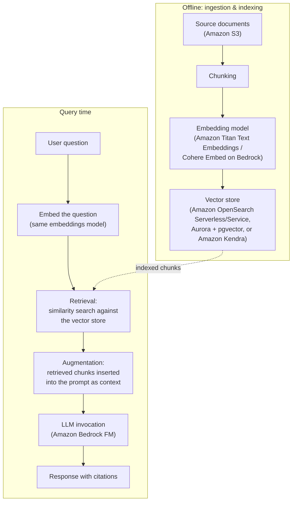

**Amazon Bedrock Knowledge Bases** is the fully managed AWS implementation
of this entire pipeline: point it at a data source (typically an S3
bucket), and it automatically handles ingestion, chunking, embedding
(using a Bedrock embeddings model you choose), and storage/indexing in a
supported vector store (Amazon OpenSearch Serverless by default, or
Amazon OpenSearch Service, Amazon Aurora with the pgvector extension,
Amazon RDS for PostgreSQL, Redis Enterprise Cloud, MongoDB Atlas, or
Pinecone). Your application calls the `Retrieve` or `RetrieveAndGenerate`
API and Bedrock handles the retrieval-plus-prompting for you.

**AWS example:** A software company wants an internal chatbot that
answers employee questions using the company's constantly updated internal
wiki, without retraining a model every time the wiki changes. They set up
an **Amazon Bedrock Knowledge Base** pointed at an S3 bucket synced from
the wiki, using **Amazon OpenSearch Serverless** as the vector store and
**Amazon Titan Text Embeddings** to generate embeddings. When an employee
asks a question, Bedrock retrieves the most relevant wiki passages and
generates a grounded answer citing them — and when the wiki updates, they
simply re-sync the S3 data source instead of retraining anything.

> **Exam tip:** RAG **does not modify the foundation model's weights** —
> it changes what's in the *prompt*, not the model itself. If a scenario's
> goal is "keep responses current with frequently changing data" or
> "reduce hallucination by grounding answers in our own documents,"
> **RAG / Amazon Bedrock Knowledge Bases** is almost always the answer —
> not fine-tuning, which is comparatively slow/expensive to update and
> doesn't inherently reduce hallucination on facts outside the fine-tuning
> data.

#### Mini-quiz: Test your understanding of RAG and Amazon Bedrock Knowledge Bases

Quick self-check before moving on — try to answer before reading the
explanation.

1. Which two foundation model limitations does RAG directly address?
   A. High inference cost and slow latency
   B. Stale knowledge and hallucination
   C. Limited context window and lack of multimodal support
   D. Prompt injection and toxic output

   **Answer: B** — RAG grounds generation in retrieved, authoritative
   source text, which directly counters a model's training-data cutoff
   (stale knowledge) and its tendency to confidently generate incorrect
   information (hallucination).

2. In the RAG pipeline, what is the purpose of the chunking step?
   A. Converting text into numeric vectors
   B. Splitting documents into smaller passages so retrieval can return
      focused, relevant sections
   C. Storing embeddings in a vector database for fast similarity search
   D. Generating the final answer grounded in retrieved context

   **Answer: B** — Chunking splits source documents into smaller passages
   *before* embedding, so retrieval returns focused sections instead of
   entire documents; converting to vectors is embedding (A), storing them
   is indexing (C), and producing the final answer is generation (D).

3. Which Amazon Bedrock Knowledge Bases API call lets an application send a
   user question and receive an answer generated from automatically
   retrieved context in a single call?
   A. Retrieve
   B. RetrieveAndGenerate
   C. InvokeModel
   D. CreateKnowledgeBase

   **Answer: B** — `RetrieveAndGenerate` performs the retrieval-plus-
   prompting-plus-generation steps together; `Retrieve` (A) only returns
   the matching chunks without generating an answer, and the other two
   options aren't Knowledge Bases retrieval/generation calls.

### Vector store decision guide: OpenSearch vs. Aurora + pgvector vs. Amazon Kendra

The RAG pipeline above names three AWS options for the "indexing/storage"
step — **Amazon OpenSearch**, **Amazon Aurora with pgvector**, and
**Amazon Kendra** — and the exam expects you to pick the right one from a
scenario description, not just recognize the names. They aren't
interchangeable: OpenSearch and Aurora/pgvector are vector databases *you*
architect and query, while Kendra is a fully managed enterprise search
service that hides the embeddings/indexing layer entirely. The table below
compares them on the dimensions the exam tests most.

| Dimension | Amazon OpenSearch (Service / Serverless) | Amazon Aurora (PostgreSQL) + pgvector | Amazon Kendra |
|---|---|---|---|
| **Hybrid search support** | Native — a built-in **vector engine** does k-NN vector search alongside traditional keyword/full-text search in the same query. Strongest hybrid-search story of the three. | Possible (combine a SQL `WHERE` filter or Postgres full-text search with a `pgvector` similarity query) but you assemble it yourself — no single built-in "hybrid" query type. | Built in and automatic — Kendra's ranking model blends semantic and keyword relevance internally; you don't configure it. |
| **Embedding model options** | Bring your own — you pick an embeddings model (e.g., **Amazon Titan Text Embeddings**, Cohere Embed) and generate vectors yourself, then index them. Full control over which model, and you can change models later. | Bring your own, same as OpenSearch — embeddings are computed outside the database and stored as a `vector` column type via SQL. | None to choose — Kendra generates and manages relevance signals internally; there's no user-facing "pick an embeddings model" step. |
| **Management overhead** | Moderate (OpenSearch Service — you size and manage a cluster/domain) to low (**OpenSearch Serverless** — AWS autoscales capacity, still your index to design). | Low if the team already operates Aurora/RDS PostgreSQL — it's normal database administration plus enabling and tuning the `pgvector` extension and its index type. | Lowest — fully managed; no cluster, index, or embeddings pipeline to build, size, or patch. Point it at a data source connector and it handles the rest. |
| **Scalability model** | Horizontal — add nodes/shards (OpenSearch Service) or let capacity auto-scale with load (OpenSearch Serverless); built for large, high-throughput vector + text workloads. | Scales with the underlying Aurora database — storage auto-scales, compute scales vertically or via read replicas; vector search performance is bounded by the relational engine and pgvector index. | Scales automatically and transparently with document volume and number of connectors; AWS manages capacity behind the scenes. |
| **Exam keywords that signal this choice** | "hybrid search," "keyword *and* semantic search," "large-scale vector search," "default vector store for Bedrock Knowledge Bases." | "we already run Aurora/PostgreSQL," "query embeddings with SQL," "avoid standing up a separate search service." | "enterprise search," "automatic relevance ranking," "no infrastructure to manage," "connectors to S3/SharePoint/Salesforce," "natural-language search without building a RAG pipeline." |

**Decision tree:** the flowchart below turns the table above into a
sequence of yes/no questions — the fastest way to work an exam scenario
that describes requirements instead of naming a service:

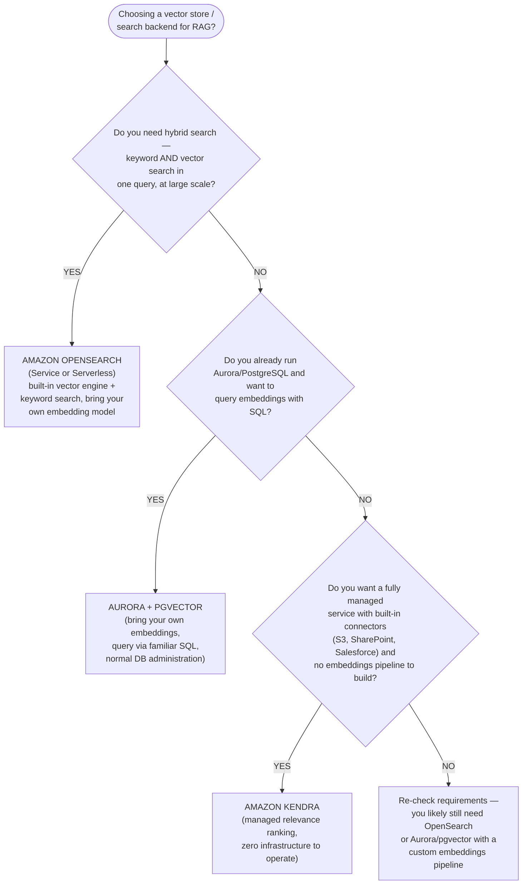

**Worked scenario — Amazon OpenSearch:** A retail company needs its
product-search RAG assistant to combine exact filtering (SKU codes, brand
names) with semantic similarity over product descriptions, at a scale of
tens of millions of documents and unpredictable traffic spikes during
sales events. The requirement for *both* keyword and vector search in one
query, at large scale, with autoscaling, points to **Amazon OpenSearch
Serverless** with its vector engine.

**Worked scenario — Aurora with pgvector:** A fintech startup already
stores all of its account and transaction metadata in **Amazon Aurora
PostgreSQL** and wants to add semantic search over its compliance
documents so support staff can ask natural-language questions. The team
knows SQL well and doesn't want to operate a second, dedicated search
service just for this one feature. Because the data already lives in
Aurora and the team wants to query embeddings with familiar SQL rather
than adopt new infrastructure, **Aurora PostgreSQL with the pgvector
extension** is the fit.

**Worked scenario — Amazon Kendra:** A company wants employees to search
natural-language questions across documents scattered over S3, SharePoint,
and Salesforce, with automatic relevance ranking, and explicitly does not
want to build or manage an embeddings pipeline or a vector index — "a
company wants automatic relevance ranking without managing
infrastructure." That combination — multiple document-repository
connectors, managed ranking, zero infrastructure — is the signature of
**Amazon Kendra**, not a vector database the team would have to architect
itself.

> **Exam tip:** If a scenario says the team **chooses an embeddings model**
> and **manages a vector index**, it's OpenSearch or Aurora/pgvector — and
> between those two, "we already run PostgreSQL/Aurora" points to
> **pgvector**, while "we need hybrid keyword + vector search at scale"
> points to **OpenSearch**. If the scenario emphasizes **no embeddings
> pipeline to build** and **automatic relevance ranking** over existing
> enterprise repositories, it's **Amazon Kendra**. [Section 6](#6-vector-databases-and-embeddings-for-search-and-retrieval)
> goes deeper on vector databases and embeddings in general.

---

## 4. Fine-tuning vs. continued pre-training vs. RAG vs. prompt engineering

The exam expects you to place these four customization approaches on a
single spectrum and pick the right one for a scenario:

- **Prompt engineering** — no training, no extra data beyond what's in the
  prompt. Cheapest and fastest. Limited by the model's context window and
  by what the base model already "knows." Covered in [Section 2](#2-prompt-engineering-techniques).
- **Retrieval Augmented Generation (RAG)** — no training; augments prompts
  with retrieved external data at query time. Best for grounding responses
  in **frequently changing or proprietary knowledge** without retraining.
  Covered in [Section 3](#3-retrieval-augmented-generation-rag-and-amazon-bedrock-knowledge-bases).
- **Fine-tuning** — further trains a copy of a pretrained FM on a
  smaller, **labeled** dataset of your own input/output examples, updating
  the model's weights so it reliably produces a particular style,
  format, tone, or task behavior. Requires more time, cost, and ML
  expertise than prompting or RAG, and updates require re-running the
  fine-tuning job. On Bedrock, **fine-tuning creates a custom model** that
  typically must be accessed via **provisioned throughput** ([Section 5](#5-amazon-bedrock-features)).
- **Continued pre-training (a.k.a. domain adaptation)** — further trains a
  pretrained FM on a large volume of **unlabeled**, domain-specific text
  using the same self-supervised objective as original pretraining (e.g.,
  predicting the next token). It deepens the model's general knowledge and
  vocabulary of a domain (e.g., legal, medical, or a company's internal
  jargon) rather than teaching it a specific labeled task. It's more
  data- and compute-intensive than fine-tuning and doesn't require labeled
  input/output pairs.

**Visual summary — comparison matrix:** the diagram below lines up all
four approaches side by side across the five dimensions the exam tests
most (cost, complexity, accuracy, speed to implement, and data
requirements), so the trade-offs can be scanned at a glance instead of
re-reading the narrative above:

```mermaid
graph LR
    subgraph PE["Prompt engineering"]
        PE_COST["Cost: Lowest"]
        PE_COMPLEXITY["Complexity: Lowest -\nno training pipeline"]
        PE_ACCURACY["Accuracy: Limited by base\nmodel + context window"]
        PE_SPEED["Speed: Fastest -\nminutes to iterate"]
        PE_DATA["Data: None beyond\nthe prompt itself"]
    end

    subgraph RAG_G["RAG"]
        RAG_COST["Cost: Low"]
        RAG_COMPLEXITY["Complexity: Low/medium -\nretrieval pipeline to build"]
        RAG_ACCURACY["Accuracy: High for current/\nproprietary, grounded facts"]
        RAG_SPEED["Speed: Fast -\nhours to days to stand up"]
        RAG_DATA["Data: Unlabeled external\nknowledge source (documents)"]
    end

    subgraph FT["Fine-tuning"]
        FT_COST["Cost: High"]
        FT_COMPLEXITY["Complexity: High -\ntraining job + ML expertise"]
        FT_ACCURACY["Accuracy: High for the\nspecific trained task/style"]
        FT_SPEED["Speed: Slow -\ndays to weeks per training run"]
        FT_DATA["Data: Labeled\ninput/output example pairs"]
    end

    subgraph CPT["Continued pre-training"]
        CPT_COST["Cost: Highest"]
        CPT_COMPLEXITY["Complexity: Highest -\nlarge-scale self-supervised training"]
        CPT_ACCURACY["Accuracy: Deepens domain\nfluency, not one specific task"]
        CPT_SPEED["Speed: Slowest -\nweeks or more"]
        CPT_DATA["Data: Large volume of\nunlabeled domain-specific text"]
    end

    PE --> RAG_G --> FT --> CPT
```

**How to decide:**

| Need | Best fit |
|---|---|
| Change tone/format/style reliably for a specific task, have labeled examples | Fine-tuning |
| Deepen the model's understanding of domain-specific language/concepts from large unlabeled text | Continued pre-training |
| Ground answers in current, frequently changing, or proprietary knowledge without retraining | RAG |
| Quick behavior adjustment, no training data, lowest cost/fastest to iterate | Prompt engineering |

**Decision tree:** the flowchart below is the fastest way to work an exam
scenario — read the symptom the question describes, follow the matching
branch, and land on the customization approach it implies:

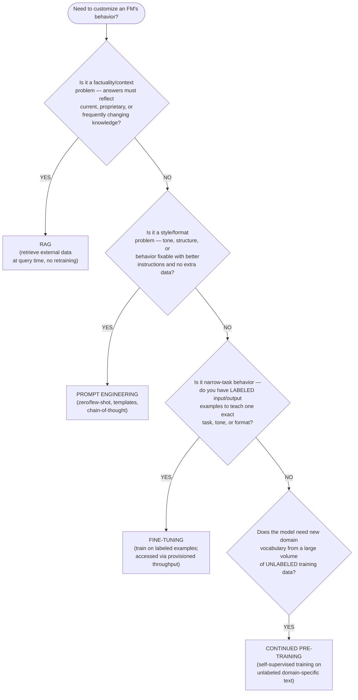

**Quick reference (if–then):** the same branches as one-line lookups, for
the fastest possible exam-time recall:

- Data changes frequently or is proprietary, but model weights shouldn't
  change → **RAG**
- Just need better formatting, tone, or output style, with no extra
  training data → **prompt engineering**
- Model needs to reliably perform a new, narrow, proprietary task and you
  have labeled input/output examples for it → **fine-tuning**
- Model needs broader domain vocabulary/fluency from a large body of
  unlabeled text, not one specific task → **continued pre-training**

These are not mutually exclusive — a production application commonly
combines several, e.g., prompt engineering **and** RAG together, or a
fine-tuned model accessed **through** a RAG pipeline.

This section's guidance is qualitative — "fine-tuning costs more but is
more accurate for a specific task" — until you actually price both
approaches out. The [fine-tuning vs. prompt engineering worked
example](#worked-example-comparing-fine-tuning-and-prompt-engineering-on-the-same-task)
later in this domain runs the same task through both approaches and
compares token cost, latency, and accuracy with concrete numbers.

**AWS example:** A legal-tech company builds a contract-analysis
assistant. They start with **prompt engineering** (fastest to prototype).
They add **Amazon Bedrock Knowledge Bases (RAG)** so the assistant can
cite the specific contract clauses it's answering about. Because outputs
must always follow a strict, firm-specific summary format, they then
**fine-tune** a Bedrock model on hundreds of labeled example
summaries in that exact format. Separately, because the firm's contracts
are dense with specialized legal terminology poorly represented in general
web text, they also evaluate **continued pre-training** on a large corpus
of unlabeled legal documents to improve the base model's grasp of legal
language before fine-tuning on top of it.

> **Exam tip:** The single most common trap: a scenario says "the company
> wants the model to always have access to the latest product catalog" —
> this is **RAG**, not fine-tuning, because fine-tuning bakes knowledge
> into static weights that go stale. Conversely, "the company wants every
> response to follow an exact required format/tone, and has example
> data" is **fine-tuning**. Remember **fine-tuning needs labeled
> input/output pairs; continued pre-training needs only unlabeled
> domain text** — that labeled-vs-unlabeled distinction is exactly what
> the exam tests between these two.

### Fine-tuning efficiency techniques: full fine-tuning vs. LoRA vs. QLoRA vs. instruction tuning

The comparison above treats "fine-tuning" as one option, but the exam also
expects you to distinguish **how** a model gets fine-tuned once you've
decided fine-tuning is the right approach — especially in a
**resource-constrained scenario** (limited GPU budget, limited time,
limited labeled data). These are the four techniques you need to be able
to tell apart:

- **Full fine-tuning** — updates **every weight** in the model on your
  labeled dataset. Produces the highest possible task-specific quality
  ceiling, but requires storing and updating a complete copy of the
  model's parameters, the most GPU memory and compute of any option, and
  the longest training time. Each fine-tuned task needs its own full
  copy of the model.
- **LoRA (Low-Rank Adaptation)** — freezes the original model weights and
  trains a **small pair of low-rank matrices** injected into the model's
  layers, so only a tiny fraction of parameters (often under 1%) is
  updated. Dramatically cuts training time, GPU memory, and storage
  (you only save the small adapter, not a full model copy) versus full
  fine-tuning, at a modest, usually acceptable, quality trade-off.
- **QLoRA (Quantized LoRA)** — the same low-rank-adapter approach as LoRA,
  but the frozen base model is first **quantized to a lower precision**
  (e.g., 4-bit) before adapters are trained on top of it. Cuts GPU memory
  further still, which is what makes fine-tuning a large model feasible
  on a **single, smaller GPU** — at the cost of a small amount of
  additional quality loss from quantization on top of LoRA's own
  trade-off.
- **Instruction tuning** — a **fine-tuning objective**, not a parameter
  strategy: it further trains a model on a dataset of
  (instruction, response) pairs so the model learns to follow natural-
  language instructions generally, rather than one narrow task. It can be
  performed as full fine-tuning or with a parameter-efficient method like
  LoRA/QLoRA — the resource cost depends on which of those it's layered
  on top of, not on "instruction tuning" itself.

**Visual summary:** the diagram below lines up full fine-tuning, LoRA,
and QLoRA on the dimensions the exam tests most — training
speedup, GPU/resource cost, and quality trade-off relative to full
fine-tuning — so you can recognize which technique fits a
resource-constrained scenario at a glance:

```mermaid
graph LR
    subgraph FULL["Full fine-tuning"]
        FULL_PARAMS["Parameters updated: 100%\n(every weight)"]
        FULL_SPEED["Training speedup: Baseline -\nslowest, longest to train"]
        FULL_RESOURCE["Resource cost: Highest -\nmost GPU memory + storage"]
        FULL_QUALITY["Quality: Highest ceiling -\nfull-capacity adaptation"]
    end

    subgraph LORA["LoRA"]
        LORA_PARAMS["Parameters updated: <1% -\nsmall low-rank adapter matrices"]
        LORA_SPEED["Training speedup: Much faster -\nfewer gradients to compute"]
        LORA_RESOURCE["Resource cost: Low -\nsmall adapter to store, less memory"]
        LORA_QUALITY["Quality: Modest trade-off vs.\nfull fine-tuning, usually acceptable"]
    end

    subgraph QLORA["QLoRA"]
        QLORA_PARAMS["Parameters updated: <1% -\nLoRA adapters on a quantized base"]
        QLORA_SPEED["Training speedup: Fastest to fit -\nenables single smaller GPU"]
        QLORA_RESOURCE["Resource cost: Lowest -\n4-bit quantized base model"]
        QLORA_QUALITY["Quality: Small added loss vs.\nLoRA, from quantization"]
    end

    FULL --> LORA --> QLORA
```

**Comparison table:**

| Technique | Parameters updated | Training speedup | Resource cost | Quality trade-off | Best fit |
|---|---|---|---|---|---|
| Full fine-tuning | 100% of model weights | Baseline (slowest) | Highest — full model copy in GPU memory + storage per task | Highest quality ceiling | Ample GPU budget, need maximum task-specific accuracy |
| LoRA | Small low-rank adapter matrices (<1% of weights) | Much faster than full fine-tuning | Low — only the small adapter is trained and stored | Modest, usually acceptable trade-off vs. full fine-tuning | Resource-constrained teams that still need good quality and fast iteration |
| QLoRA | Same as LoRA, on a quantized (e.g., 4-bit) frozen base | Fastest to fit a training run | Lowest — fits large models on a single smaller GPU | Small additional loss vs. LoRA from quantization | Fine-tuning a large model when GPU memory is the hard constraint |
| Instruction tuning | Depends on the method it's layered on (full, LoRA, or QLoRA) | Depends on the underlying method | Depends on the underlying method | Improves general instruction-following rather than one narrow task | Want a model that reliably follows varied natural-language instructions, not just one fixed task |

> **Exam tip:** If a scenario says "limited GPU budget" or "fine-tune a
> large model on a single GPU," that's **QLoRA**. If it says "faster,
> cheaper fine-tuning with only a small quality trade-off, without
> quantization mentioned," that's **LoRA**. If it says "needs the
> absolute best possible accuracy and cost/time isn't the constraint,"
> that's **full fine-tuning**. And if the scenario describes teaching a
> model to follow **general instructions** (not one narrow labeled task),
> that's **instruction tuning** — remember it's an orthogonal choice of
> *training objective*, and it's commonly combined with LoRA or QLoRA to
> keep the resource cost down.

#### Mini-quiz: Test your understanding of customization approach trade-offs

Quick self-check before moving on — try to answer before reading the
explanation.

1. Which customization approach requires **labeled** input/output example
   pairs to update the model's weights toward a specific task or style?
   A. Prompt engineering
   B. RAG
   C. Fine-tuning
   D. None of these change the model's weights

   **Answer: C** — Fine-tuning trains a copy of a pretrained FM on a
   smaller, labeled dataset of input/output examples, updating its weights
   for a specific behavior; prompt engineering and RAG never touch the
   model's weights at all.

2. Which approach trains on a large volume of **unlabeled** domain-specific
   text using the original self-supervised pretraining objective, to
   deepen a model's general domain fluency rather than teach one task?
   A. RAG
   B. Continued pre-training
   C. Prompt engineering
   D. Fine-tuning

   **Answer: B** — Continued pre-training deepens domain knowledge and
   vocabulary using large volumes of unlabeled text, unlike fine-tuning,
   which needs labeled task-specific examples.

3. A company wants a generative AI assistant to always reflect the latest
   version of a product catalog that changes daily, without retraining a
   model every day. Which approach best fits?
   A. Fine-tuning
   B. Continued pre-training
   C. RAG
   D. Prompt engineering alone, with no external data

   **Answer: C** — RAG retrieves current external data at query time
   without any retraining, exactly fitting a frequently changing data
   source; fine-tuning and continued pre-training both bake knowledge into
   static weights that would need daily retraining to stay current.

---

## 5. Amazon Bedrock features

**Amazon Bedrock** is AWS's fully managed service for building generative
AI applications on top of foundation models, without managing any
infrastructure. Its core features, each tested individually on the exam:

- **Model access** — Bedrock provides a single, unified API to access FMs
  from multiple third-party and Amazon providers. Before use, an AWS
  account must explicitly **request model access** in the Bedrock console
  for each model. This lets applications swap FMs with minimal code
  changes.
- **Amazon Bedrock Agents** — orchestrates multi-step tasks by letting an
  FM reason about a user's request, break it into steps, and invoke
  external **action groups** (API calls, backed by AWS Lambda functions)
  and Knowledge Bases to complete the task — for example, checking order
  status via a company API and then answering a follow-up question from a
  Knowledge Base, all within one conversational session. Agents follow a
  reasoning-and-acting loop (plan → invoke a tool → observe the result →
  continue) to complete multi-step goals autonomously.
- **Guardrails for Amazon Bedrock** — a configurable safety layer applied
  to model inputs/outputs: denied topics, content filters, word filters,
  sensitive information (PII) filters, and contextual grounding checks
  (covered in depth in the [Domain 4 study guide](domain-4-guidelines-for-responsible-ai.md#3-aws-tools-for-responsible-ai), since it's primarily a
  responsible-AI control — but the exam also tests it here as a Bedrock
  platform feature you attach to any model or Agent).
- **Amazon Bedrock Knowledge Bases** — the managed RAG feature described
  in [Section 3](#3-retrieval-augmented-generation-rag-and-amazon-bedrock-knowledge-bases): automatic ingestion, chunking, embedding, and retrieval
  over your own data.
- **Model evaluation** — Bedrock lets you run **evaluation jobs** to
  compare FMs or assess a specific model's quality before choosing it for
  production, in two modes:
  - **Automatic evaluation** — uses built-in metrics (e.g., accuracy,
    robustness, toxicity) computed against built-in or your own
    prompt datasets — fast, low-cost, and objective, but limited to
    metrics that can be computed programmatically.
  - **Human evaluation** — a human work team (your own employees, or an
    AWS-managed team) reviews and scores model outputs on subjective
    criteria (e.g., relevance, style, friendliness) that automatic metrics
    can't capture.
- **Provisioned throughput** — lets you purchase dedicated inference
  capacity (measured in **model units**) for a model, for a 1-month or
  6-month commitment, guaranteeing consistent throughput and latency
  regardless of other customers' demand. It's the pricing/capacity mode
  required to use **custom (fine-tuned or continued-pre-trained)
  models** in most cases, and it's generally cost-effective only for
  **high, consistent, predictable** request volumes — as opposed to
  **on-demand** pricing (pay per token, no commitment), which fits
  variable or unpredictable traffic.

**AWS example:** An airline builds a Bedrock Agent that lets customers
change flight bookings conversationally: the Agent calls the airline's
booking API (via an action group backed by Lambda) to look up a
reservation, consults a **Knowledge Base** for baggage-policy questions,
and has **Guardrails** attached to block requests unrelated to travel.
Before launch, the team runs a Bedrock **automatic model evaluation** job
to compare candidate models on accuracy and toxicity, then a **human
evaluation** job to judge tone quality. At launch, because traffic volume
is high and predictable (peak booking season), they purchase **provisioned
throughput** instead of paying on-demand rates.

> **Exam tip:** Match the keyword to the feature: "the assistant needs to
> take actions / call APIs / complete multi-step tasks" → **Agents**;
> "block harmful or off-topic content" → **Guardrails**; "answer from our
> own documents" → **Knowledge Bases**; "compare model quality
> objectively/at scale" → **automatic evaluation**; "judge subjective
> quality like tone" → **human evaluation**; "guarantee consistent
> throughput for a custom/fine-tuned model at high, steady volume" →
> **provisioned throughput**; "unpredictable/low/spiky volume, pay only
> for what's used" → **on-demand**.

### Bedrock Agents vs. Prompt Flows vs. prompt chaining: choosing an orchestration approach

Bedrock Agents (above) and Prompt Flows / prompt chaining ([Section
2](#2-prompt-engineering-techniques)) are all ways of stringing multiple
prompts or steps into one workflow, and the exam expects you to pick the
right one from a scenario rather than just recognize the names. The
distinguishing question isn't *whether* multiple steps happen — all three
do that — it's **who decides what the next step is, and when that
decision gets made**:

- **Amazon Bedrock Agents** — the FM itself reasons at *runtime* about
  which steps to take, in what order, and which tools to invoke, looping
  through plan → invoke a tool → observe the result → continue until the
  goal is met. Best when the sequence of steps genuinely varies per
  request — for example, "look up an order's status, and only if it's
  delayed, also check the refund policy in a Knowledge Base."
- **Amazon Bedrock Prompt Flows** — a visual, low-code builder for wiring
  a sequence of nodes (prompts, Knowledge Base lookups, Lambda calls,
  simple conditional branches) into a workflow that's defined at *design
  time*. It's still fundamentally prompt chaining, just built visually
  instead of in code — there's no autonomous re-planning once the flow
  runs.
- **Plain prompt chaining (manual)** — application code calls the model
  multiple times, feeding one prompt's output into the next prompt's
  input, with no managed Bedrock orchestration feature involved at all.
  The developer writes and maintains every step of the sequencing logic.

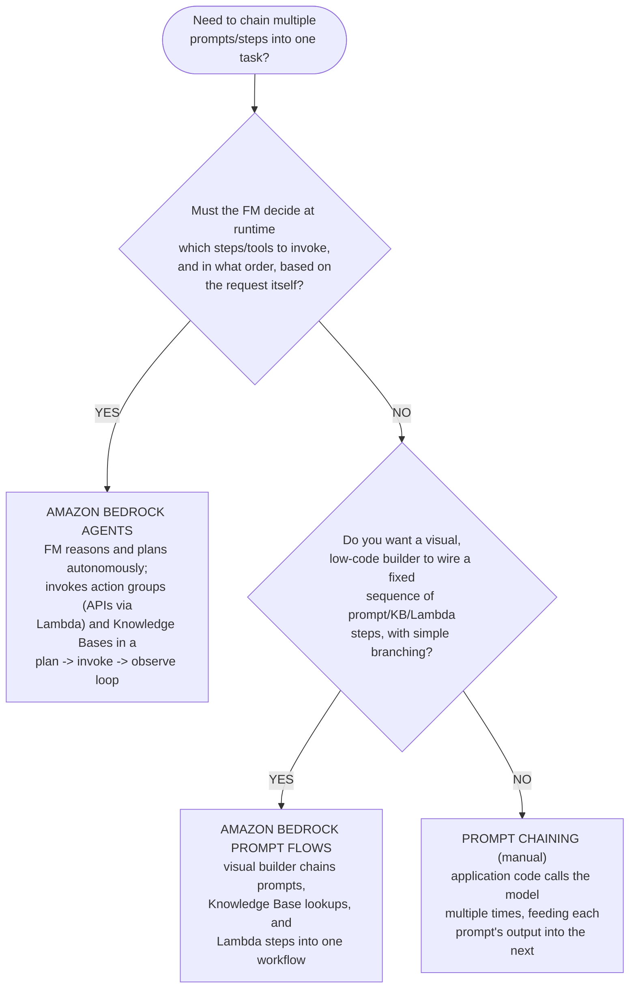

| Dimension | Amazon Bedrock Agents | Amazon Bedrock Prompt Flows | Plain prompt chaining |
|---|---|---|---|
| **Who decides the next step** | The FM, at runtime — reasons about the request and can re-plan mid-task | The developer, at design time — the flow's structure is fixed when built | The developer, at design time — hardcoded directly in application code |
| **Tool / API calling** | Built in — action groups invoke Lambda-backed APIs as part of the reasoning loop | Supported as flow nodes (e.g., a Lambda node) but not autonomously chosen | Manual — application code decides which API to call and when |
| **Build experience** | Configure an agent (instructions, action groups, Knowledge Bases) via the Bedrock console/API | Visual, low-code drag-and-drop builder in the Bedrock console | Regular application code — no managed builder or console UI |
| **Adaptability at runtime** | Fully dynamic — can skip, repeat, or reorder steps based on intermediate results | Simple conditional branches between otherwise fixed nodes | Whatever the developer's code implements — unmanaged but fully flexible |
| **Best for** | Complex, variable multi-step tasks that need autonomous tool use | Simpler, mostly linear workflows a team wants to visually assemble and maintain | A small number of steps where the team wants full control without adopting a managed feature |
| **Exam keywords** | "reason and act," "invoke APIs/action groups autonomously," "multi-step task," "agent" | "visual builder," "Bedrock Prompt Flows," "low-code workflow," "chain prompts and Knowledge Base lookups" | "sequence of prompts," "output feeds the next," no named Bedrock orchestration feature in the scenario |

> **Exam tip:** If the scenario says the model **decides for itself** which
> APIs to call or how many steps are needed, it's **Agents**. If it
> describes a **visual/low-code builder** for connecting prompts and
> Knowledge Base steps, it's **Prompt Flows**. If it's just "call the model
> more than once, feed one output into the next prompt" with no Bedrock
> feature named, it's plain **prompt chaining** — Prompt Flows is the
> managed version of the same idea, not a different concept.

### Cost governance: bounding per-request cost with max tokens and provisioned throughput
Cost *estimation* (the [monthly-cost worked
example](#worked-example-estimating-and-comparing-monthly-inference-costs-across-three-model-tiers)
later in this domain) tells you what a workload is expected to cost. Cost
*governance* is the separate, operational discipline of actively bounding
what it actually costs at runtime, independent of any single estimate:
- **Max tokens (response-length bounding)** — because Bedrock on-demand
  pricing bills output tokens per response, the **max tokens** inference
  parameter (introduced in the [Domain 2 study
  guide](domain-2-fundamentals-of-generative-ai.md#6-prompt-engineering-fundamentals))
  is the most direct per-call cost control: setting it no higher than the
  task genuinely needs caps the worst-case output-token cost of every
  single request, regardless of prompt content or model behavior. A
  chatbot that "sometimes returns extremely long, rambling answers" is a
  cost problem to fix by lowering max tokens first, before reaching for
  anything else.
- **Provisioned throughput ROI** — as covered above, **provisioned
  throughput** trades a fixed, committed cost (1-month or 6-month capacity
  purchase) for guaranteed throughput. It only pays off operationally for
  **high, steady, predictable** request volume, where the committed cost
  is reliably lower than the on-demand alternative would have been; for
  variable, spiky, or low volume, on-demand pricing remains cheaper and
  safer — sizing provisioned throughput for a worst-case traffic spike is
  itself an unpredictable, high fixed cost paid whether or not that spike
  ever materializes.

Bounding *individual* request cost (max tokens, provisioned-throughput
sizing) is necessarily incomplete on its own: neither stops a traffic
spike or a flood of malicious requests from multiplying that per-request
cost across an unbounded number of calls. Capping *aggregate* spend that
way is a Domain 5 concern — see [Cost governance: bounding total spend
with Service Quotas and API Gateway usage
plans](domain-5-security-compliance-governance.md#cost-governance-bounding-total-spend-with-service-quotas-and-api-gateway-usage-plans)
— and the exam expects both halves together, not either alone.

**AWS example:** A support-chatbot team lowers `max_tokens` from 2,048 to
400 after Finance flags an unexpectedly high per-request bill, cutting
worst-case output-token cost by over 80% without touching the model or
prompt. Separately, once that team's traffic becomes high and steady
enough that on-demand cost consistently exceeds a committed rate, they
purchase provisioned throughput for the sustained baseline load and keep
on-demand capacity only for occasional overflow.

> **Exam tip:** If the question's cost concern is *how big is each
> individual response*, the answer is max tokens. If it's *is committed
> capacity worth it for this traffic pattern*, the answer is provisioned
> throughput (yes for high/steady/predictable volume, no for
> spiky/unpredictable/low volume — sizing provisioned throughput for a
> worst-case spike is a distractor, not a genuine cost control). If the
> concern is *how many requests total can hit the endpoint*, that's a
> Domain 5 Service Quotas / API Gateway usage-plan question, not a Domain
> 3 inference-parameter one.

#### Mini-quiz: Test your understanding of Amazon Bedrock features

Quick self-check before moving on — try to answer before reading the
explanation.

1. Which Bedrock feature lets an FM plan a multi-step task and invoke
   external APIs via action groups?
   A. Guardrails for Amazon Bedrock
   B. Amazon Bedrock Agents
   C. Amazon Bedrock model evaluation
   D. Provisioned throughput

   **Answer: B** — Agents orchestrate multi-step tasks by letting an FM
   reason about a request, break it into steps, and invoke external action
   groups (API calls via Lambda) and Knowledge Bases.

2. Which Bedrock capability blocks denied topics and filters sensitive
   information (PII) from a model's inputs and outputs?
   A. Amazon Bedrock Knowledge Bases
   B. Amazon Bedrock Agents
   C. Guardrails for Amazon Bedrock
   D. Model access

   **Answer: C** — Guardrails is the configurable safety layer covering
   denied topics, content filters, word filters, PII filters, and
   contextual grounding checks.

3. A team expects high, steady, predictable request volume for a custom
   fine-tuned model in production and wants guaranteed, consistent
   throughput. Which capacity option should they choose?
   A. On-demand pricing
   B. Provisioned throughput
   C. Automatic model evaluation
   D. Requesting model access

   **Answer: B** — Provisioned throughput purchases dedicated inference
   capacity for a commitment period, guaranteeing consistent
   throughput/latency, and is generally the required and cost-effective
   choice for high, steady, predictable volume on a custom model.

---

## 6. Vector databases and embeddings for search and retrieval

**Embeddings** are numeric vector representations of text (or images,
audio) that capture semantic meaning — pieces of content with similar
meaning end up as vectors that are close together in the vector space,
even if they don't share exact words. Embeddings models (e.g., **Amazon
Titan Text Embeddings**, Cohere Embed on Bedrock) convert raw content into
these vectors.

A **vector database** stores embeddings and efficiently performs
**similarity search** (commonly k-nearest-neighbor / k-NN search using
cosine similarity or Euclidean distance) to find the stored vectors
closest to a query vector — the mechanism that powers **semantic search**
(finding conceptually related content, not just exact keyword matches)
and is the retrieval half of RAG. AWS options tested on the exam:

- **Amazon OpenSearch Service** (and its serverless option, **Amazon
  OpenSearch Serverless**) — a search and analytics service with a
  built-in **vector engine**, supporting k-NN vector search alongside
  traditional keyword/full-text search. A common choice as the vector
  store behind Bedrock Knowledge Bases, and useful when you need both
  vector *and* keyword (hybrid) search.
- **Amazon Aurora (PostgreSQL-compatible) with the pgvector extension** —
  lets you store vector embeddings as a column type directly inside a
  relational **Amazon Aurora** or **Amazon RDS for PostgreSQL** database
  and query them with SQL, using the open-source `pgvector` extension.
  A good fit when a team already runs PostgreSQL and wants vector search
  without adopting a separate, dedicated search service.
- **Amazon Kendra** — an intelligent, ML-powered **enterprise search**
  service, not a general-purpose vector database. Kendra indexes
  documents from many connectors (S3, SharePoint, Salesforce, etc.) and
  handles embedding, ranking, and relevance internally — you don't manage
  embeddings or a vector index yourself. It's the right choice for
  "add natural-language enterprise search over our existing document
  repositories" without building a custom RAG/embeddings pipeline;
  Bedrock Knowledge Bases can also use an existing **Amazon Kendra
  GenAI Index** as a retriever.

**AWS example:** A healthcare software vendor builds a clinical-reference
chatbot. They generate embeddings for medical documents using **Amazon
Titan Text Embeddings** and store them in **Amazon OpenSearch Service**
for low-latency semantic + keyword hybrid search inside a Bedrock
Knowledge Base. A separate internal team, wanting quick natural-language
search across existing SharePoint and S3 document repositories without
building an embeddings pipeline at all, instead deploys **Amazon Kendra**
and points it at those repositories directly.

> **Exam tip:** If a scenario describes managing your own embeddings model
> and choosing a similarity-search index, that's a **vector database**
> (OpenSearch Service, or Aurora/RDS PostgreSQL with **pgvector**). If a
> scenario just wants "search across our existing enterprise documents in
> natural language" with minimal setup and no mention of managing
> embeddings, that's **Amazon Kendra** — a fully managed enterprise search
> service, not a database you architect yourself.

**Decision tree: choosing a vector database or search backend.** The
bullets above describe what each option *is*; the flowchart below turns
the same choice into a sequence of yes/no questions centered on whether
Amazon RDS/Aurora infrastructure already exists, whether the use case
needs vector-only search or hybrid (vector + keyword) search, and
scale/throughput requirements — a visual complement to the table above,
consistent with the customization decision tree in [Section 4](#4-fine-tuning-vs-continued-pre-training-vs-rag-vs-prompt-engineering):

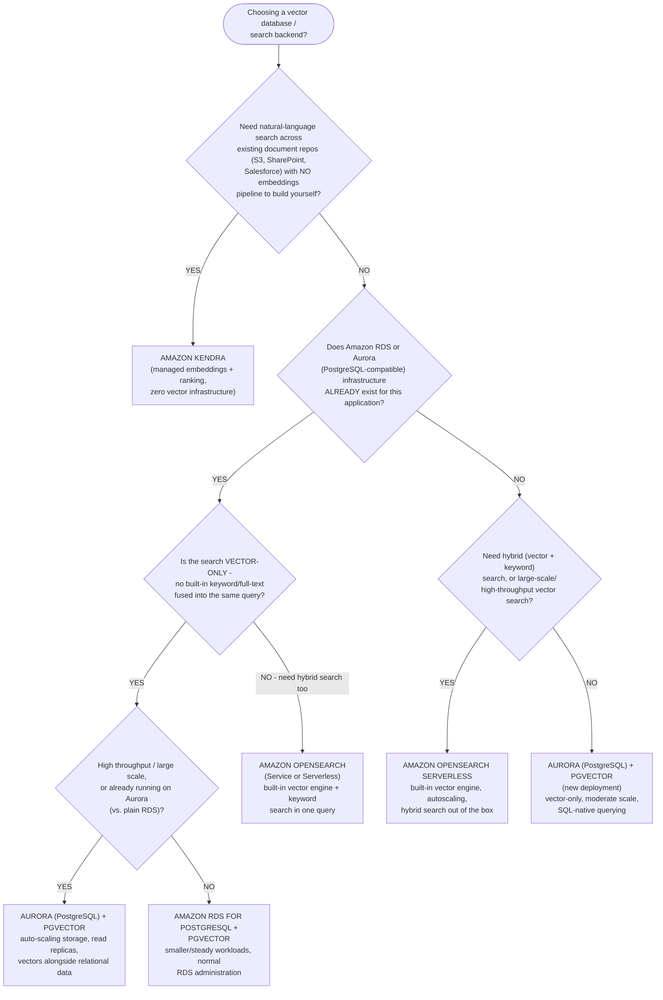

> **Exam tip:** Amazon RDS and Amazon Aurora both support `pgvector`, and
> the exam distinguishes them by what the application already standardizes
> on: a scenario that says the team already runs **RDS for PostgreSQL**
> points to **RDS + pgvector**, while "needs auto-scaling storage, read
> replicas, or is already on Aurora" points to **Aurora + pgvector**. If
> the scenario adds "and we also need keyword/full-text search fused into
> the same query," that pulls the answer toward **OpenSearch** instead,
> regardless of which relational database is already in place.

### Choosing an embedding model: domain-specific vs. general vs. fine-tuned

The guidance above treats "pick an embeddings model" as a solved,
one-line step — in practice it's its own decision, and picking the wrong
embedding model is one of the most common root causes of poor RAG
retrieval (see [failure mode 2 in the RAG troubleshooting worked
example](#failure-mode-2-an-embedding-model-mismatched-to-the-domain)).
There are three tiers to choose from, not one:

- **General-purpose embedding model** (e.g., **Amazon Titan Text
  Embeddings**, Cohere Embed on Bedrock) — pretrained on broad, general
  web/text corpora. Zero extra training, cheapest, fastest to ship, and
  the right default when the content is everyday business language.
  Struggles when the corpus is dense with specialized vocabulary the
  model rarely saw during pretraining (legal clauses, medical
  terminology, internal jargon/abbreviations) — those terms get embedded
  close to unrelated general-English concepts instead of to each other.
- **Domain-specific pretrained embedding model** — a model (often a
  third-party or open-source option, rather than a Bedrock built-in)
  pretrained or continually trained specifically on legal, medical,
  financial, or similar domain text. Captures domain vocabulary
  out of the box with no training pipeline of your own to build, at the
  cost of an extra model to evaluate, license, and host outside (or
  alongside) Bedrock's built-in embeddings models.
- **Fine-tuned embedding model** — a general-purpose or domain-specific
  embedding model further trained on **your own** labeled query/relevant-
  passage pairs so its vector space reflects exactly how *your* users
  phrase questions and *your* documents use terminology. Highest accuracy
  ceiling for a narrow corpus, but also the highest cost and complexity:
  you need a labeled dataset, ML expertise, and — because Amazon Bedrock
  does not offer a managed fine-tuning workflow for embedding models the
  way it does for text-generation FMs — typically a separate training and
  hosting pipeline (e.g., fine-tuning an open-source embedding model on
  **Amazon SageMaker**) rather than a Bedrock fine-tuning job.

| Dimension | General-purpose (Titan Text Embeddings / Cohere Embed) | Domain-specific pretrained | Fine-tuned on your data |
|---|---|---|---|
| **Best fit** | Everyday business language; broad, mixed-topic corpora | Corpus is dominated by one well-known specialized domain (legal, medical, financial) | A narrow corpus with its own vocabulary/phrasing *and* you can produce labeled query/passage pairs |
| **Setup cost/complexity** | Lowest — call the Bedrock API, no training | Low/medium — evaluate and integrate a third-party model, no training pipeline | Highest — labeled data, training job, hosting/versioning (typically via SageMaker, not a Bedrock fine-tuning job) |
| **Where it runs** | Amazon Bedrock (fully managed) | Often outside Bedrock (self-hosted or third-party API), sometimes alongside a Bedrock Knowledge Base | Self-hosted/managed by your team (e.g., Amazon SageMaker endpoint) |
| **When fine-tuning pays off** | N/A | N/A | When retrieval quality tests show *even* a domain-specific pretrained model still misses your users' exact phrasing/jargon, and you have (or can generate) enough labeled pairs to justify the training and hosting cost |

**Decision tree: general-purpose vs. domain-specific vs. fine-tuned
embeddings.** Read the corpus and data situation a scenario describes and
follow the matching branch:

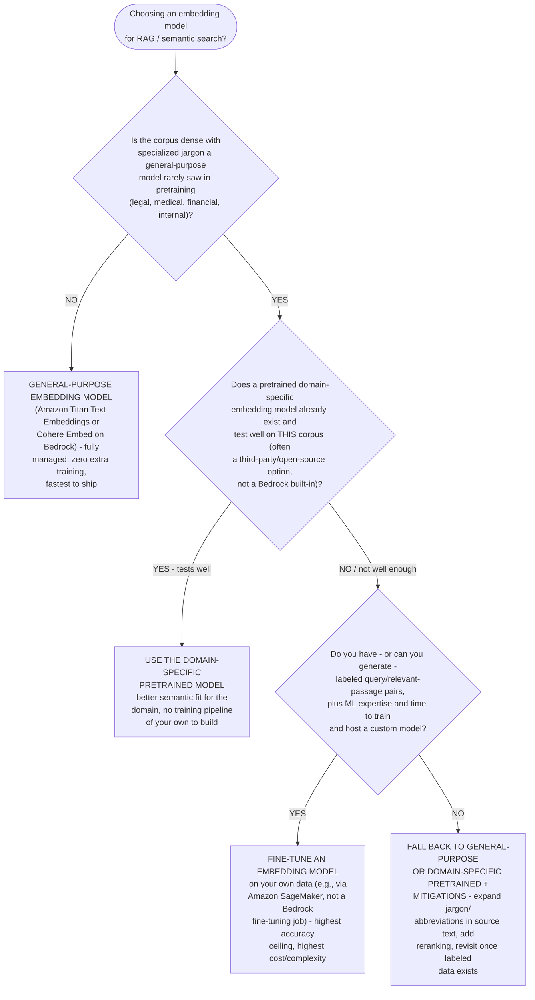

**AWS example:** A legal-tech vendor's contract-analysis RAG assistant
starts with **Amazon Titan Text Embeddings** because the first release
only handles general correspondence. Once the product expands to dense
litigation filings full of legal-specific phrasing, retrieval quality
drops — the team evaluates a **domain-specific, legal-tuned third-party
embedding model** and finds it separates their clauses far better than
the general-purpose model did. A separate team building the same
capability for a single, narrow, highly repetitive contract template
(where they already have hundreds of labeled query/clause pairs from
past support tickets) instead **fine-tunes an embedding model on Amazon
SageMaker**, since their corpus is narrow enough and their labeled data
plentiful enough to make the extra training investment worthwhile.

> **Exam tip:** Default to **Amazon Titan Text Embeddings** (or Cohere
> Embed on Bedrock) whenever a scenario doesn't call out a specialized
> domain — it's the fully managed, lowest-effort answer. A scenario that
> emphasizes **legal/medical/financial-specific terminology** and retrieval
> quality problems traceable to the embedding model (not the vector store
> or chunking) is pointing at a **domain-specific pretrained embedding
> model**. Only pick **fine-tuning an embedding model** when the scenario
> explicitly mentions **your own labeled query/passage examples** *and*
> a narrow, stable domain — and remember fine-tuning an embedding model is
> **not** a Bedrock-native workflow the way fine-tuning a text-generation
> FM is.

### Reranking and hybrid search: sharpening vector-only results

Plain vector similarity search returns the chunks *closest* to the query vector
— not necessarily the chunks that best *answer* it, and not necessarily
chunks that contain an exact term the user cares about (a product code, a
person's name, an acronym). Two techniques address these gaps, and the
exam expects you to know when each is worth the added cost/latency versus
when plain vector search is already good enough:

- **Reranking** — retrieve an initial candidate set with fast vector
  similarity search (e.g., top 50), then run those candidates through a
  separate, more expensive **reranking model** that scores each one for
  relevance to the specific query and re-orders them before the top few
  are sent to the FM as context. Reranking catches cases where the
  correct chunk is topically close but not the closest vector match —
  the same relevance-drift failure mode discussed in the [RAG
  troubleshooting worked
  example](#worked-example-troubleshooting-a-failing-rag-system).
- **Hybrid search** — combine vector (semantic) search with traditional
  keyword/full-text search in the same query, then fuse the two result
  sets (e.g., via a weighted score or reciprocal rank fusion). Hybrid
  search catches cases where semantic similarity alone misses an exact
  term — a query containing a specific SKU, error code, or proper noun
  that a purely semantic match might rank low because the *surrounding*
  words don't line up.

| Dimension | Reranking | Hybrid (vector + keyword) search |
|---|---|---|
| **When it's essential** | Retrieved chunks are topically related but the FM keeps citing the *wrong* one among several plausible candidates — relevance needs a second, finer-grained pass. High-stakes answers (legal, medical, financial) where picking the *most* relevant chunk, not just *a* relevant chunk, matters. | Queries routinely include exact terms — product codes, IDs, names, acronyms, error messages — that a semantic-only match can bury under topically similar but wrong content. |
| **When it's nice-to-have (not essential)** | Retrieval is already precise (a small, narrow corpus) and the top vector match is consistently correct — added latency/cost of a second model isn't buying much. | The corpus is conceptual/narrative (policies, guides) with few exact-match terms, so semantic similarity alone already surfaces the right content. |
| **Cost/latency tradeoff** | Adds an extra model call per query (on the candidate set, not the whole corpus) — moderate added latency for a relevance boost. | Adds a second (keyword) query path and a fusion step — lower added latency than reranking, but requires a search backend that supports keyword search alongside vectors. |
| **How Amazon Bedrock Knowledge Bases relates** | Bedrock Knowledge Bases supports plugging in a **reranking model** as an optional step in the retrieval flow, re-scoring the chunks it retrieves before they're passed to the FM — you opt in, you don't have to build the reranking pipeline yourself. | Bedrock Knowledge Bases can perform hybrid search automatically when its underlying vector store supports it (e.g., **Amazon OpenSearch Service/Serverless**) — again, no custom fusion logic to write; you choose a vector store with hybrid support and enable it. |

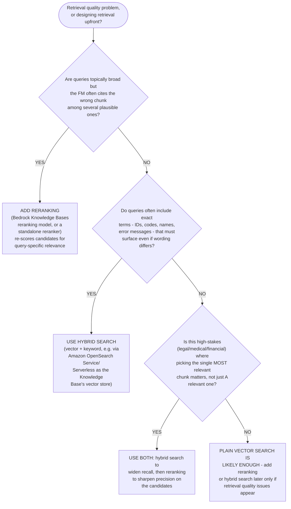

> **Exam tip:** A scenario describing the FM giving answers built from
> "close but not quite right" retrieved content — after ruling out a bad
> embedding model — is pointing at **reranking**. A scenario where users
> search for exact codes, names, or error messages and don't get them
> back is pointing at **hybrid search**. Both are configured *within*
> **Amazon Bedrock Knowledge Bases** (a reranking model option, and a
> vector store that supports hybrid search, such as OpenSearch) rather
> than requiring you to build a separate pipeline.

#### Mini-quiz: Test your understanding of vector databases and embeddings

Quick self-check before moving on — try to answer before reading the
explanation.

1. What mechanism does a vector database use to find the stored vectors
   closest to a query vector?
   A. Exact keyword matching only
   B. Similarity search (e.g., k-nearest-neighbor / k-NN)
   C. Chain-of-thought reasoning
   D. Prompt templating

   **Answer: B** — Vector databases perform similarity search (commonly
   k-NN using cosine similarity or Euclidean distance) to find vectors
   close to a query vector, which is the mechanism behind semantic search.

2. A team already runs its data in Amazon Aurora PostgreSQL and wants to
   add vector similarity search without adopting a separate dedicated
   search service. Which option fits best?
   A. Amazon Kendra
   B. Amazon Aurora (PostgreSQL-compatible) with the pgvector extension
   C. AWS Trainium
   D. Amazon Bedrock Agents

   **Answer: B** — pgvector lets the team store embeddings as a column
   type directly inside the PostgreSQL database they already operate and
   query them with SQL, avoiding a new dedicated service.

3. Which AWS service handles embedding, ranking, and relevance internally,
   making it the right fit for natural-language search across existing
   enterprise document repositories without building a custom embeddings
   pipeline?
   A. Amazon OpenSearch Service
   B. Amazon Aurora with pgvector
   C. Amazon Kendra
   D. AWS Inferentia

   **Answer: C** — Amazon Kendra is a fully managed enterprise search
   service that indexes documents from connectors like S3 and SharePoint
   and handles embeddings and relevance internally, so no custom pipeline
   is required.

---

## 7. Evaluating foundation model performance

Choosing and shipping a foundation model requires evaluating it, and the
exam expects you to know three complementary evaluation approaches:

- **Human evaluation** — people (either your own subject-matter experts
  or an AWS-managed work team via Bedrock's human evaluation jobs) review
  model outputs and score them against criteria that are hard to automate:
  tone, creativity, helpfulness, cultural appropriateness, or nuanced
  correctness. Slower and more expensive than automatic evaluation, but
  necessary for subjective quality judgments.
- **Benchmark datasets** — standardized, often publicly available datasets
  paired with automatically computable metrics (e.g., accuracy, F1 score,
  BLEU/ROUGE for text similarity) used to score a model objectively and
  reproducibly, and to compare models against each other on a level
  playing field. **Amazon Bedrock automatic model evaluation** runs jobs
  against built-in curated prompt datasets and metrics, or your own
  custom prompt dataset.
- **Business metrics** — ultimately, an FM application must be judged by
  whether it moves outcomes the organization cares about: task completion
  rate, average handling time, customer satisfaction (CSAT) score,
  conversion rate, cost per interaction, or reduction in human escalation
  rate. A model can score well on benchmark metrics yet fail to improve
  the business metric it was built for (or vice versa) — the exam expects
  you to recognize business metrics as the final, outcome-oriented layer
  of evaluation, distinct from (but informed by) model-quality metrics.

**AWS example:** A telecom company evaluates two candidate Bedrock models
for a customer-service assistant. They first run an **automatic model
evaluation** job using a benchmark dataset to compare accuracy and
robustness objectively. The top two candidates then go through a **human
evaluation** job where support agents score sample conversations for tone
and helpfulness. After launch, the company tracks the **business
metric** of average call-deflection rate (how many issues the assistant
resolves without escalation to a human agent) to judge real-world impact —
which is ultimately what determines whether the project is considered
successful, regardless of how well the model scored on benchmarks.

> **Exam tip:** Keep the three layers distinct: **benchmark datasets**
> measure model quality **objectively and automatically**; **human
> evaluation** measures quality **subjectively**, using people;
> **business metrics** measure real-world **outcome impact**, and are the
> only one of the three tied directly to organizational goals rather than
> model output quality itself. A question about "comparing multiple
> models quickly and cheaply at scale" points to benchmark-based automatic
> evaluation; a question about "judging tone or creativity" points to
> human evaluation; a question about "did this actually help the
> business" points to a business metric.

**Common named benchmark datasets:** The exam won't ask you to compute a
benchmark score, but it may describe a scenario or name a benchmark and
expect you to recognize what kind of capability it measures. A handful of
well-known benchmarks recur across FM leaderboards and documentation:

| Benchmark | Task type it measures | What it looks like |
| --- | --- | --- |
| **MMLU** (Massive Multitask Language Understanding) | General knowledge and reasoning across 57 subjects (history, law, medicine, math, etc.) | Multiple-choice exam questions spanning academic and professional subjects |
| **ARC** (AI2 Reasoning Challenge) | Science reasoning | Grade-school-level science questions that require reasoning, not just recall |
| **HumanEval** | Code generation | Programming problems with a docstring/prompt; the model's generated function is checked by running unit tests against it |
| **GSM8K** (Grade School Math 8K) | Math word problems | Multi-step arithmetic word problems requiring chained reasoning to reach a numeric answer |

> **Exam tip:** If a scenario mentions evaluating a model's ability to
> *answer general knowledge or professional-subject questions*, that's
> pointing at **MMLU**; *science reasoning* points at **ARC**; *generating
> or completing code that must pass tests* points at **HumanEval**; and
> *multi-step math word problems* points at **GSM8K**. You don't need to
> memorize benchmark internals — just match the described task type to the
> benchmark name so you can recognize what a question is implying.

**Beyond named benchmarks: additional automated metrics.** Named benchmarks
like MMLU and GSM8K score a specific task against a fixed answer key, but
they don't cover every property an FM application needs evaluated. Three
metrics fill gaps that recur on the exam and in real evaluation pipelines:
safety, similarity-to-reference, and raw language-model fluency.

| Metric | What it measures | How to interpret it |
| --- | --- | --- |
| **Toxicity scoring** | Whether generated output contains harmful, hateful, or unsafe language | A classifier scores each output on a 0–1 scale; **lower is better** (closer to 0 = safer). **Amazon Bedrock automatic model evaluation** includes a built-in toxicity metric, so this can run in the same automated job as accuracy/robustness checks, without a human reading every output. |
| **Semantic similarity (BERTScore)** | How close a generated output is *in meaning* to a reference answer, even when the wording differs | Encodes the candidate and reference into contextual embeddings and compares them; **higher is better** (closer to 1 = closer meaning). Unlike BLEU/ROUGE, which reward exact n-gram/word overlap, BERTScore recognizes a correctly paraphrased answer as a good match — useful whenever there's more than one acceptable way to phrase a correct response (e.g., summarization, open-ended Q&A). |
| **Perplexity** | How well a language model predicts held-out text — a fluency/confidence measure, not a correctness measure | Computed from the probability the model assigns to the actual next tokens in a sample of text; **lower is better** (lower perplexity means the model was less "surprised" by the real text, i.e., a better statistical fit to that language distribution). A model can have low perplexity (fluent, confident) while still being factually wrong, so perplexity is best used to compare candidate models' general language fit — not to judge whether an application's answers are correct. |

> **Exam tip:** Match the metric to what's actually being screened for: *is
> this output safe to show a user* → **toxicity scoring**; *does this
> output mean the same thing as a reference answer, allowing for different
> wording* → **BERTScore** (semantic similarity); *how fluent/confident is
> the model's language modeling, independent of task correctness* →
> **perplexity**. Also note the direction of "better" differs by metric:
> toxicity and perplexity are **lower-is-better**, while MMLU/ARC/HumanEval/
> GSM8K accuracy and BERTScore are **higher-is-better** — a question asking
> you to pick the model with the "best" score needs you to know which
> direction counts as good for that particular metric.

**Interpreting benchmark and metric scores.** A raw number like "MMLU:
68%" or "perplexity: 12.4" is close to meaningless in isolation — the exam
expects you to reason about scores comparatively, not as pass/fail
thresholds:

- **Compare, don't isolate.** A score is only informative next to a
  baseline: the previous production model, a competing candidate, or a
  published leaderboard number for the same benchmark, evaluated under the
  same conditions (same prompt template, same number of few-shot examples).
  "Model A scores 68% on MMLU" tells you little on its own; "Model A scores
  5 points higher than Model B on the same MMLU run" tells you it's
  comparatively stronger at broad knowledge and reasoning.
- **Know which direction is "better"** for the metric in play (see the exam
  tip above) before concluding a higher or lower number is the win.
- **Match the metric family to the property under test:** accuracy-style
  benchmarks (MMLU/ARC/HumanEval/GSM8K) for task correctness and reasoning;
  similarity metrics (BLEU/ROUGE/BERTScore) for how closely generated text
  matches a reference; toxicity scoring for safety; perplexity for general
  language-modeling fluency.
- **No single metric tells the whole story.** A model can top one axis and
  fail another — fluent (low perplexity) but toxic, or strong on MMLU but
  weak at matching your domain's expected phrasing (low BERTScore against
  your own reference answers). Combine at least one correctness/reasoning
  metric, one similarity/quality metric, and the toxicity metric before
  treating a candidate as ready to ship.

**Decision tree: which evaluation approach should I use?** Work an exam
scenario by following the branch that matches what the question tells you
about the goal and the constraints (cost, latency, interpretability) in
play:

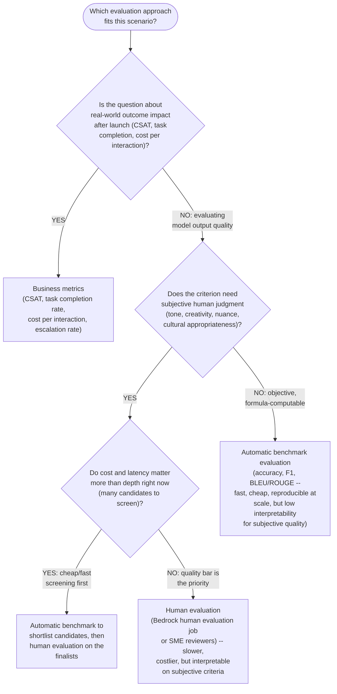

**Quick reference (if–then):** the same branches as one-line lookups:

- Question is about whether the app **moved a real business result** after
  launch → **business metrics** (CSAT, task completion rate, cost per
  interaction, escalation rate)
- Judging **subjective quality** (tone, creativity, nuance) with **many
  candidates** and cost/latency matter → **automatic benchmark to
  shortlist, then human evaluation** on the finalists
- Judging **subjective quality** with a **small candidate set** where the
  quality bar is the priority → **human evaluation** alone
- Judging **objective, formula-computable** quality (accuracy, F1,
  BLEU/ROUGE) fast and cheaply at scale → **automatic benchmark
  evaluation**, accepting lower interpretability for subjective criteria

#### Mini-quiz: Test your understanding of evaluating foundation model performance

Quick self-check before moving on — try to answer before reading the
explanation.

1. Which evaluation approach uses standardized datasets paired with
   automatically computable metrics such as accuracy or F1 score?
   A. Human evaluation
   B. Benchmark datasets
   C. Business metrics
   D. Provisioned throughput

   **Answer: B** — Benchmark datasets are standardized, often public
   datasets paired with automatically computable metrics used to score a
   model objectively and reproducibly.

2. Which of the three evaluation layers is tied directly to organizational
   outcomes rather than to model output quality itself?
   A. Benchmark datasets
   B. Human evaluation
   C. Business metrics
   D. Automatic model evaluation

   **Answer: C** — Business metrics (e.g., CSAT, task completion rate,
   cost per interaction) measure real-world outcome impact; a model can
   score well on benchmarks or human evaluation yet still fail to move the
   business metric it was built for.

3. A team wants to judge tone and creativity — criteria that are hard to
   compute automatically. Which evaluation approach fits best?
   A. Benchmark datasets
   B. Human evaluation
   C. Business metrics
   D. Automatic evaluation only

   **Answer: B** — Human evaluation uses people to score outputs on
   subjective criteria like tone and creativity that automatic metrics
   can't capture.

4. A team wants to check whether a generated answer means the same thing
   as a reference answer, even when the exact wording differs. Which
   metric is best suited to this, compared with BLEU/ROUGE?
   A. Perplexity
   B. Toxicity scoring
   C. BERTScore
   D. GSM8K

   **Answer: C** — BERTScore compares contextual embeddings of the
   candidate and reference text, so it recognizes correct paraphrases as a
   good match; BLEU/ROUGE instead reward exact n-gram overlap and would
   penalize valid rewordings.

### Worked example: is a 2-point BLEU/ROUGE improvement statistically significant?

A benchmark score by itself doesn't say whether an improvement is real or
just noise. The exam expects you to connect "automatic metrics" and "human
evaluation" (above) to the statistical rigor needed to actually trust a
comparison: **sample size**, **confidence intervals**, and **inter-rater
agreement**.

**Scenario:** A team fine-tunes a candidate summarization model and
evaluates it against the current production model on a held-out set of
prompts, scoring each output with ROUGE-L. The candidate's *mean* ROUGE-L
is 2.0 points higher than the baseline's. Is that a real improvement, or
could it be sampling noise?

**Step 1: Compare paired differences, not two separate averages.**
Because both models scored the *same* prompts, compute one difference per
prompt (candidate score − baseline score) instead of just subtracting the
two overall averages. This paired comparison cancels out prompt-to-prompt
difficulty and isolates the model effect.

**Step 2: Build a confidence interval for the mean difference.**

| Quantity | Symbol | Value |
| --- | --- | --- |
| Held-out prompts evaluated | n | 200 |
| Mean per-prompt score difference | d̄ | 2.1 |
| Standard deviation of the differences | σ | 9.4 |
| Standard error of the mean difference | SE = σ/√n | 9.4/√200 ≈ 0.66 |
| 95% confidence interval | d̄ ± 1.96·SE | 2.1 ± 1.30 → **[0.80, 3.40]** |

Because the 95% CI does not cross zero, the 2-point gain is statistically
significant at the conventional 95% confidence level — the team can be
reasonably confident the candidate model is genuinely better on this
metric, not merely luckier on this particular sample.

**Step 3: See what happens with too few examples.**
Run the identical calculation with only n = 20 held-out prompts (same
σ = 9.4): SE = 9.4/√20 ≈ 2.10, so the 95% CI becomes
2.1 ± 4.12 → **[−2.02, 6.22]**. The interval now spans zero — with too
small a sample, the same 2-point improvement is statistically
indistinguishable from noise. **Sample size, not just the point estimate,
determines whether an improvement can be trusted.**

**Step 4: Size the evaluation set before you run it, not after.**
A standard formula for the minimum sample size needed to reliably detect a
mean difference δ, given standard deviation σ, significance level α, and
power (1 − β):

n ≈ (z_α/2 + z_β)² · σ² / δ²

For a 95%-confidence, 80%-power test (z_0.025 = 1.96, z_0.20 = 0.84) aiming
to reliably detect a δ = 2-point improvement with σ = 9.4:

n ≈ (1.96 + 0.84)² × 9.4² / 2² = 7.84 × 88.36 / 4 ≈ **174 held-out
prompts**

That's why the n = 200 evaluation set in Step 2 was adequate and the n = 20
one in Step 3 wasn't: 200 clears the minimum sample size needed to detect a
2-point effect reliably, while 20 falls well short of it.

**Step 5: Apply the same logic to human evaluation — one rater isn't a
consensus.**
A single human rater's score is itself a noisy estimate, subject to that
rater's fatigue, bias, and interpretation of the rubric. Two practices turn
human evaluation from anecdote into evidence:

- **Use multiple raters per output** — typically **3–5** — and aggregate
  with a majority vote (categorical judgments) or a median/mean score
  (numeric ratings), rather than shipping a decision based on a single
  rater's opinion.
- **Measure inter-rater agreement** before trusting the aggregate score:
  **Cohen's kappa** for two raters, or **Krippendorff's alpha** for three
  or more. Agreement below roughly 0.4 means the rubric or raters are
  inconsistent and the resulting "consensus" isn't reliable evidence of
  anything; 0.6+ is generally treated as "substantial" agreement worth
  trusting.

**AWS example:** Using **Amazon Bedrock automatic model evaluation**, a
team measures a 2-point ROUGE-L improvement over 200 held-out prompts and
computes a 95% confidence interval of [0.80, 3.40], confirming the gain is
real rather than noise. They then submit the same 200 outputs to a
**Bedrock human evaluation** job with **3 human raters** per output.
Because Bedrock reports the automatic metric and the raw human ratings but
not statistical significance or inter-rater agreement, the team computes
the confidence interval and Krippendorff's alpha themselves before
declaring the candidate model ready to replace the baseline in production.

> **Exam tip:** Evaluation questions can go beyond "which evaluation type
> fits" to "is this result trustworthy." Remember three levers: (1) a
> **larger evaluation set narrows the confidence interval**, making small
> true improvements detectable; (2) **a confidence interval that spans
> zero means "not statistically significant,"** no matter how good the
> point estimate looks; (3) **human evaluation needs multiple raters plus
> a measured agreement score** (Cohen's kappa / Krippendorff's alpha) — a
> single rater's opinion is not a reliable evaluation result.

### Worked example: picking evaluation metrics for a scenario

Naming the right benchmarks and metrics is only useful if you can map a
concrete scenario's requirements onto them. Work through one scenario
end-to-end.

**Scenario:** A team is building a Bedrock-based customer-support
assistant that must (1) give factually correct answers to policy questions
pulled from a knowledge base, (2) respond in the company's approved tone
even when its wording differs from any single reference answer, (3) never
return toxic or offensive language to a customer, and (4) sound fluent and
natural. Which evaluation metric fits each requirement?

| Requirement | Property being tested | Best-fit metric | Why |
| --- | --- | --- | --- |
| Factually correct policy answers | Task correctness against a labeled answer set | Accuracy against a held-out labeled QA set (benchmark-style automatic evaluation) | Closed-domain question answering has a defined right answer, so an objective accuracy metric is cheap to compute and directly measures the property that matters. |
| Same meaning as a reference answer, different wording allowed | Semantic similarity, not exact wording | BERTScore | BLEU/ROUGE would penalize a correctly paraphrased answer for not matching the reference's exact words; BERTScore's contextual-embedding comparison rewards it for matching the *meaning* instead. |
| Never toxic or offensive to a customer | Safety | Toxicity scoring | This is a screening gate, not a quality score — every output should be checked, and anything above a toxicity threshold blocked or routed to a human, regardless of how well it scores on other metrics. |
| Fluent, natural-sounding language | Raw language-modeling fluency, independent of task correctness | Perplexity, computed on a sample of company-domain text, during model *selection* | Comparing candidate models' perplexity on text written in the company's own style shows which model's language distribution fits before spending time on deeper task-specific evaluation; unlike toxicity scoring, it isn't run per customer-facing output in production. |

**Step-by-step reasoning:**

**Step 1:** Start from what each requirement is actually testing —
correctness, similarity, safety, or fluency — since that determines the
metric family, not the other way around.

**Step 2:** For the correctness requirement, because there's a labeled
answer set, reach for an accuracy-style automatic evaluation rather than a
similarity or human-judgment metric — it's the cheapest option that
directly measures what's needed.

**Step 3:** For the tone requirement, recognize that exact-wording metrics
(BLEU/ROUGE) would produce false negatives on valid paraphrases, so
BERTScore is the better fit.

**Step 4:** For the safety requirement, treat toxicity scoring as a gate
applied to every production output, not a one-time model-selection metric.

**Step 5:** For the fluency requirement, use perplexity as an upfront
model-selection filter comparing candidates before deeper evaluation, not
as an ongoing production check — the other three metrics already cover the
task-specific properties.

**AWS example:** The team runs an **Amazon Bedrock automatic model
evaluation** job comparing three candidate models: it scores task accuracy
against the labeled policy-QA set, computes BERTScore against a set of
approved reference responses to check tonal/semantic match, and applies the
built-in toxicity metric to every generated output. Before finalizing the
shortlist, they also compare each candidate's perplexity on a sample of the
company's internal policy documents to confirm its language style is a good
fit. The top candidate from that combined evaluation then goes through a
**Bedrock human evaluation** job where support agents give a final
subjective check on tone.

> **Exam tip:** When a scenario lists multiple requirements (correctness,
> tone/style, safety, fluency), expect the answer to combine metrics rather
> than pick just one — the exam tests whether you can match each
> requirement to the metric that actually measures it, not whether you can
> name a single "best" metric for an entire scenario.

---

## 8. AWS infrastructure for generative AI workloads

Behind Bedrock's managed experience, and for teams building or training
custom models directly, AWS provides infrastructure purpose-built for
generative AI and deep learning workloads:

- **Amazon SageMaker** — AWS's fully managed service for building,
  training, and deploying machine learning models, including foundation
  models. **SageMaker JumpStart** provides a hub of pretrained foundation
  models and pre-built solution templates that can be deployed or
  fine-tuned with a few clicks, for teams that need more control over
  model hosting/customization than Bedrock's fully managed API offers
  (e.g., deploying to a specific instance type, or a model not available
  on Bedrock).
- **AWS Trainium** — a purpose-built AWS silicon (ML chip) optimized for
  **high-performance, cost-efficient training** of deep learning and
  foundation models at scale. Available via Amazon EC2 **Trn1/Trn2**
  instances.
- **AWS Inferentia** — a purpose-built AWS silicon (ML chip) optimized for
  **high-throughput, low-latency, cost-efficient inference**. Available
  via Amazon EC2 **Inf1/Inf2** instances.
- Both chip families are programmed via the **AWS Neuron SDK**, and both
  exist specifically to reduce the cost of large-scale deep learning
  compared to general-purpose GPU instances, while remaining compatible
  with common ML frameworks (PyTorch, TensorFlow).

**AWS example:** An AI startup pretrains a custom foundation model from
scratch on **Amazon EC2 Trn1** instances powered by **AWS Trainium** to
minimize training cost at scale. Once trained, they deploy the model for
production inference on **Amazon EC2 Inf2** instances powered by **AWS
Inferentia2**, achieving low per-request latency and lower cost per
inference than equivalent GPU instances. For experimentation and
fine-tuning of openly available foundation models without managing this
infrastructure directly, a different team at the same company uses
**Amazon SageMaker JumpStart**.

> **Exam tip:** Memorize the mapping precisely, since the exam frequently
> tests it directly: **AWS Trainium → training**, **AWS Inferentia →
> inference**. Both are purpose-built chips (not general-purpose GPUs)
> whose primary selling point is **lower cost at high scale** for deep
> learning workloads specifically — pick Trainium/Inferentia over generic
> EC2 GPU instances when a scenario emphasizes minimizing the cost of
> training or serving large models at scale.

**Decision tree: from the Domain 1 inference-type question to the Domain 3
Bedrock throughput decision.** [The cross-domain concept map](cross-domain-concept-map.md#domain-1-domain-3-applications-of-foundation-models)
notes that Bedrock's on-demand vs. provisioned-throughput choice ([Section
5](#5-amazon-bedrock-features)) is the generative-AI-specific version of the
Domain 1 inference-type decision (real-time, batch, asynchronous, or
serverless inference) -- both trade latency and cost against traffic
predictability. The flowchart below turns that cross-domain link into a
walkable sequence of questions:

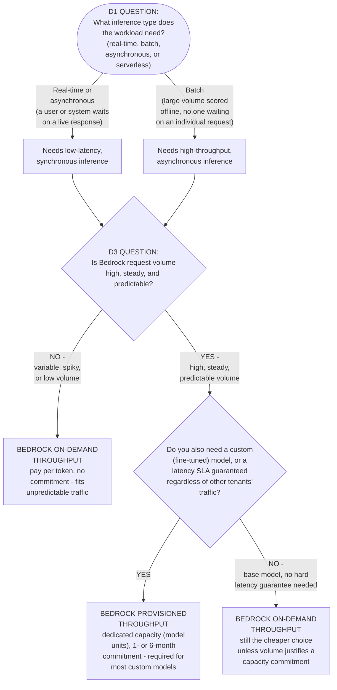

The three deciding factors are the same ones Domain 1 already trades off for
real-time vs. batch inference, just re-applied to Bedrock's pricing model:
**traffic predictability** (steady/high volume vs. variable/spiky),
**latency needs** (a guaranteed, consistent SLA vs. best-effort), and
**cost model** (a flat-rate capacity commitment vs. pay-per-token). For a
single consolidated view of all four deployment patterns side by side —
real-time, batch, serverless, and provisioned throughput, compared on
latency, cost model, scaling behavior, and typical use case — see the
[cross-domain concept map's inference deployment pattern
comparison](cross-domain-concept-map.md#inference-deployment-pattern-comparison).

#### Mini-quiz: Test your understanding of AWS infrastructure for generative AI workloads

Quick self-check before moving on — try to answer before reading the
explanation.

1. Which purpose-built AWS chip is optimized specifically for
   high-performance, cost-efficient **training** of deep learning and
   foundation models at scale?
   A. AWS Inferentia
   B. AWS Trainium
   C. AWS Graviton
   D. AWS Nitro

   **Answer: B** — Trainium is purpose-built for high-performance,
   cost-efficient training, available via EC2 Trn1/Trn2 instances.

2. Which purpose-built AWS chip is optimized specifically for
   high-throughput, low-latency, cost-efficient **inference**?
   A. AWS Trainium
   B. AWS Inferentia
   C. AWS Graviton
   D. AWS Nitro

   **Answer: B** — Inferentia is purpose-built for high-throughput,
   low-latency, cost-efficient inference, available via EC2 Inf1/Inf2
   instances; Trainium (A) targets training, not inference.

3. Which AWS service provides a hub of pretrained foundation models and
   pre-built solution templates that can be deployed or fine-tuned with
   more direct control over hosting than Amazon Bedrock's fully managed
   API?
   A. Amazon Bedrock Knowledge Bases
   B. Amazon SageMaker JumpStart
   C. Amazon Kendra
   D. AWS Neuron SDK

   **Answer: B** — SageMaker JumpStart offers pretrained models and
   templates deployable/fine-tunable with more control over hosting (e.g.,
   a specific instance type or a model not available on Bedrock).

---

## Worked example: implementing RAG for an internal policy-lookup assistant

[Section 3](#3-retrieval-augmented-generation-rag-and-amazon-bedrock-knowledge-bases) introduced the RAG pipeline conceptually. This
walkthrough follows one company through every step of actually building
it, including the customization-approach decision from [Section
4](#4-fine-tuning-vs-continued-pre-training-vs-rag-vs-prompt-engineering) and the evaluation step from [Section
7](#7-evaluating-foundation-model-performance) — the level of detail AIF-C01 scenario questions expect
you to reason through even though the exam itself is multiple-choice.

**Scenario:** An insurance company's HR team fields the same questions
over and over ("how many vacation days do I have," "what's the parental
leave policy") against a 300-page internal policy handbook that legal
revises every quarter. Employees currently search a shared drive full of
PDFs, and answers are often wrong because employees read an outdated
version.

1. **Rule out the alternatives first.** The team checks the customization
   spectrum from [Section 4](#4-fine-tuning-vs-continued-pre-training-vs-rag-vs-prompt-engineering): fine-tuning would require creating
   thousands of labeled question/answer pairs from the handbook *and*
   re-running that training job every quarter when legal revises it —
   too slow and too expensive for a document that changes often. Prompt
   engineering alone can't work either, because the 300-page handbook
   does not fit in a single prompt. That combination of "frequently
   changing source data" and "too large for the context window" is the
   textbook signal for **RAG**.
2. **Ingestion.** The handbook PDFs (and any policy addenda) are uploaded
   to an **Amazon S3** bucket, which becomes the data source for an
   **Amazon Bedrock Knowledge Base**.
3. **Chunking.** The team lets Bedrock's default chunking strategy split
   each PDF into passages of a few hundred tokens with slight overlap
   between consecutive chunks, so a policy detail that falls near a page
   boundary still appears intact in at least one retrievable chunk.
4. **Embedding.** Each chunk is converted to a vector with **Amazon Titan
   Text Embeddings**, chosen because the team is already using other
   Titan models elsewhere and wants one consistent embedding space.
5. **Indexing/storage.** The embeddings are stored in **Amazon OpenSearch
   Serverless**, which the Knowledge Base provisions and manages
   automatically — the team never has to size or patch a search cluster.
6. **Retrieval and augmentation at query time.** An employee asks, "How
   many weeks of parental leave do I get?" The question is embedded with
   the same Titan model, **Amazon OpenSearch Serverless** returns the most
   semantically similar handbook chunks (the parental-leave section, even
   if the employee's wording doesn't match the handbook's exact phrasing),
   and those chunks are inserted into the prompt sent to the FM via
   Bedrock's `RetrieveAndGenerate` API.
7. **Generation with citations.** The FM answers using only the retrieved
   passages as grounding, and the application surfaces which handbook
   section the answer came from — directly addressing the "employees
   trust the wrong answer" problem, since HR can now verify any answer
   against a cited source.
8. **Evaluation before rollout.** Using the criteria from [Section
   7](#7-evaluating-foundation-model-performance), the team checks retrieval quality (are the *right*
   chunks coming back for a test set of real HR questions?) separately
   from generation quality (given the right chunks, does the FM produce a
   correct, well-formed answer?) — because a wrong answer could stem from
   either half of the pipeline, and conflating them makes the failure
   impossible to debug.
9. **Handling the quarterly update.** When legal revises the handbook next
   quarter, the team simply re-uploads the changed PDFs to the same S3
   bucket and re-syncs the Knowledge Base's data source — no retraining,
   no redeployment, and the assistant is answering from the current
   policy within minutes.

> **Exam tip:** If a scenario emphasizes that source data **changes
> frequently** and/or is **too large to fit in a prompt**, and the goal is
> **grounded, current, citable answers**, the answer is **RAG / Amazon
> Bedrock Knowledge Bases** — not fine-tuning (too slow to keep current)
> and not prompt engineering alone (can't fit a 300-page document). Watch
> for distractor scenarios that describe this exact setup but then ask
> "how do you keep it current" with a fine-tuning-flavored answer choice —
> re-syncing the S3 data source is always cheaper and faster.

---

## Worked example: troubleshooting a failing RAG system

[Section 3](#3-retrieval-augmented-generation-rag-and-amazon-bedrock-knowledge-bases)
and the worked example above both walk through RAG on the *happy path*,
where retrieval quietly returns the right chunks. Real deployments —
and scenario questions that describe a RAG system already in production —
usually start from a system that answers badly, and expect you to reason
about *which pipeline stage* is broken before picking a fix. This
walkthrough follows one team through four separate RAG failures on the
same system, diagnosing each before applying a targeted remediation.

**Scenario:** The insurance company from the worked example above has
shipped its HR policy-lookup assistant. Three months in, HR starts
escalating complaints that the assistant gives wrong or unhelpful
answers. The team pulls transcripts and finds four distinct failure
patterns.

### Failure mode 1: chunks too small to answer the query

**Symptom:** An employee asks, "How many weeks of parental leave do I get
and do I need to use vacation days first?" The assistant answers only the
first half of the question ("12 weeks") and ignores the vacation-day
interaction entirely, even though the handbook covers both in the same
paragraph.

**Diagnosis.** The team inspects which chunks were actually retrieved
(the raw output of the `Retrieve` API, before generation) and finds the
chunking strategy split the parental-leave paragraph mid-sentence: one
150-token chunk ends right after "employees receive 12 weeks of paid
parental leave," and the very next sentence — "vacation days accrued
prior to leave must be exhausted first" — landed in a *different* chunk
that wasn't among the top results returned for this query. The chunk size
was tuned too small, so a single self-contained policy explanation got
split across chunk boundaries and retrieval surfaced only one fragment.

**Remediation.** The team increases the chunk size and adds chunk
overlap so related sentences are less likely to be split across a
boundary, and re-indexes the Knowledge Base. They also test whether
retrieving a larger number of chunks (a higher `numberOfResults` on the
`Retrieve` call) reduces the chance of losing the second half of an
answer, since a bigger chunk window and slight overlap between
consecutive chunks means a policy detail near a boundary still appears
intact in at least one retrieved chunk.

### Failure mode 2: an embedding model mismatched to the domain

**Symptom:** Employees who ask questions using internal jargon — "Does
PTO carry over across the FY boundary?" — get irrelevant chunks back
entirely (the assistant retrieves passages about *performance reviews*,
not paid time off), even though the handbook clearly answers the
question in plain language a few sections away.

**Diagnosis.** The team compares the embedding vectors for the query
against the embedding vectors for the correct handbook chunk and finds
they aren't close in vector space at all — this isn't a chunking problem,
because the correct chunk exists and is well-formed; it's a retrieval
problem. Digging further, the embeddings model in use is a general-purpose
model that was never exposed to the company's internal abbreviations
("PTO," "FY") during training, so it embeds those tokens close to
unrelated general-English concepts instead of close to "vacation" or
"time off." A **general-purpose embedding model applied to a
jargon-heavy internal domain** is the root cause: retrieval can only be
as good as the semantic space the embeddings model produces.

**Remediation.** The team swaps to a different Bedrock embeddings model
better suited to the domain and re-embeds the entire corpus (embeddings
models aren't interchangeable after the fact — every chunk must be
re-embedded and re-indexed with the new model, and queries must be
embedded with that same model going forward). Where a wholesale model
swap isn't practical, expanding internal abbreviations in the source
documents before chunking (writing out "paid time off (PTO)" instead of
just "PTO") is a lower-cost mitigation that helps a general-purpose
embedding model land closer to the right chunks.

### Failure mode 3: retrieval returning plausible but irrelevant results

**Symptom:** An employee asks, "What's the process for expensing a
conference registration fee?" and the assistant confidently answers using
a chunk about *travel* expense reports — semantically related, but the
wrong policy — instead of the chunk that specifically covers conference
and training expenses.

**Diagnosis.** Unlike failure mode 2, the embeddings here are reasonable:
travel expenses and conference expenses genuinely are semantically close
in vector space, which is exactly the problem. Pure vector similarity
search returns the *closest* chunks, not necessarily the *correct* ones,
and when several chunks discuss adjacent topics, similarity search alone
can't distinguish "close enough to be retrieved" from "the one that
actually answers this question."

**Remediation.** The team adds two complementary fixes:

- **Reranking** — instead of sending the top vector-search results
  straight to the FM, a reranking step re-scores the retrieved candidates
  against the original query using a model built for relevance ranking
  (rather than pure vector similarity) and reorders them before
  generation, pushing the conference-expense chunk above the travel
  chunk.
- **Hybrid search** — combining the semantic (vector) search with a
  traditional keyword/lexical search (available through Amazon
  OpenSearch) so an exact term match like "conference registration fee"
  can pull in the right chunk even when its embedding sits close to a
  different topic. Hybrid search catches the cases where the literal
  words in the query matter as much as their meaning.

### Failure mode 4: query and document phrased in mismatched terminology

**Symptom:** An employee asks, "Can I get reimbursed for a client
dinner?" and the assistant returns no useful chunks at all — not even a
topically-close one — even though the handbook has a clearly written
section titled "Business Meal Expense Policy" that answers exactly this
question: "Employees may claim reimbursement for meals with clients or
prospects, subject to the per-person cap in Appendix B."

**Diagnosis.** This isn't failure mode 2 (a domain-mismatched embeddings
model) or failure mode 3 (a topically-close-but-wrong chunk) — the team
confirms the embeddings model handles the company's vocabulary fine, and
the correct chunk isn't even in the raw candidate set, no matter how high
`numberOfResults` is set. The root cause is a different, more subtle gap:
the query is a short, casual **question** ("Can I get reimbursed...")
while the source chunk is a long, formal **policy statement** ("Employees
may claim reimbursement..."), and these are different *kinds* of text.
Bi-encoder embedding models — the kind used to embed queries and chunks
independently for vector search — are trained mostly on symmetric
text-to-text similarity and don't always bridge that question-vs-statement
asymmetry, even when a human reader would immediately recognize the two as
a matching Q&A pair. This is a query/document terminology mismatch, not a
domain-vocabulary gap, and no amount of expanding jargon in the source
text (the failure mode 2 fix) resolves it.

**Remediation.** The team applies fixes on both sides of the retrieval
step rather than expecting a single embeddings-model swap to fix it:

- **Reranking on a wider candidate set** — raising `numberOfResults` so
  borderline matches are considered, then reranking down to the best few.
  Rerankers are typically cross-encoders that score the query and the
  chunk *together* rather than as two independently embedded vectors, so
  they're far less sensitive to this same question-vs-statement asymmetry
  than pure vector similarity is. This makes reranking a standard,
  general-purpose retrieval fix — not just a remedy for failure mode 3.
- **Query rewriting before embedding** — an intermediate step rewrites
  the casual question into more document-like phrasing, or generates a
  short hypothetical answer and embeds *that* instead of the raw question
  (a technique known as HyDE — Hypothetical Document Embeddings), so what
  gets embedded resembles the phrasing style used in the source corpus.
- **Document-side augmentation** — generating and indexing a handful of
  likely question phrasings alongside each chunk at ingestion time, so a
  literally-phrased query has a matching question embedded nearby, not
  just the formal policy text.

### Summary: matching the symptom to the fix

| Symptom | Root cause | Fix |
|---|---|---|
| Answer is correct but incomplete, cuts off mid-explanation | Chunks too small / split a self-contained answer across a boundary | Increase chunk size, add chunk overlap, retrieve more chunks |
| Retrieved chunks are unrelated to the query's actual topic | Embedding model doesn't understand domain-specific vocabulary | Swap to a better-suited embeddings model and re-embed the corpus; expand jargon/abbreviations in source text |
| Retrieved chunks are topically related but not the specific right answer | Vector similarity alone can't distinguish "close" from "correct" | Add reranking; add hybrid (keyword + vector) search |
| Retrieval returns nothing relevant even though a clearly-worded answer exists in the corpus | Query/document terminology mismatch — a question embeds differently than the statement that answers it | Rerank a wider candidate set; rewrite/expand the query before embedding (e.g., HyDE); index likely question phrasings alongside each chunk |

> **Exam tip:** When a scenario describes a RAG system that's already
> live and *underperforming*, the question is testing whether you can map
> a described symptom back to a specific pipeline stage — chunking,
> embedding, or retrieval — rather than just reciting "use RAG." An
> incomplete-but-correct answer points to **chunking**; retrieved content
> that's off-topic entirely points to the **embedding model**; retrieved
> content that's topically close but not quite right, or missing entirely
> despite a good answer existing, points to needing **reranking, hybrid
> search, or query rewriting** on top of plain vector similarity search.
> Fine-tuning the FM itself does not fix any of these — all four failure
> modes live in the retrieval half of the pipeline, before the FM ever
> sees a prompt.

### Decision tree: diagnosing RAG retrieval failures

The four failure modes above are worked end-to-end for one system, but an
exam scenario (or a real on-call page) usually hands you just the
*symptom* — hallucinated facts, off-topic chunks, a truncated response, an
answer that's close-but-not-quite — and expects you to work backward to the
broken pipeline stage. The flowchart below adds two symptoms not covered by
the worked example (hallucination and token-limit overflow) alongside the
first three above, so it can be used as a single lookup table for "the RAG
system is misbehaving — where do I look first?":

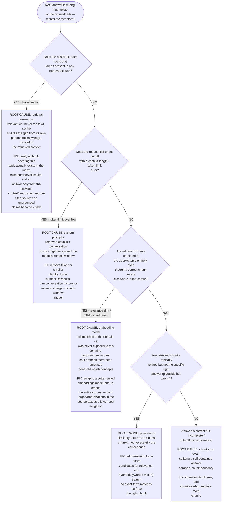

> **Exam tip:** Hallucination and token-limit overflow are two more RAG
> symptoms worth recognizing on sight, alongside the four chunking /
> embedding / retrieval / terminology failure modes walked through above.
> **Hallucination** in an otherwise-working RAG system almost always means
> retrieval came back empty or thin for that query — the fix lives in
> retrieval coverage and prompt instructions, not in fine-tuning the model
> to "hallucinate less." **Token-limit / context-length errors** are a
> budgeting problem — see the [context-window token-budget worked
> example](#worked-example-estimating-a-context-window-token-budget) — and
> are fixed by retrieving less, not by retrieving differently.

### Debugging method: isolating the broken pipeline stage

The decision tree above starts from a *symptom* and works backward to a
root cause. It's just as useful to have a repeatable *procedure* for the
opposite direction: given a failing query, methodically narrow down which
of the four RAG pipeline stages — **embedding** (turning text into
vectors and indexing it), **retrieval** (the initial vector-search
candidate set), **ranking** (reranking/hybrid fusion that orders those
candidates), or **generation** (the FM producing an answer from whatever
context it received) — actually produced the failure, by inspecting raw
output at each stage boundary in order:

1. **Check the embedding stage first: does the correct chunk exist,
   well-formed, in the index at all?** Look up the source passage that
   should answer the query. If it was never chunked or indexed, or the
   chunk is malformed, the fault is upstream of retrieval entirely — an
   ingestion/chunking problem, not an embeddings-model problem.
2. **Check the retrieval stage: does the correct chunk appear anywhere in
   the raw candidate set, before any reranking?** Set `numberOfResults`
   high (e.g., 50) and inspect the raw `Retrieve` output directly. If the
   correct chunk never shows up, even at rank 50, the fault is in
   embedding/retrieval — the query vector and the chunk vector simply
   aren't close, whether from a domain-mismatched embeddings model
   (failure mode 2) or a query/document terminology mismatch (failure
   mode 4). No amount of reranking or prompt tuning downstream can recover
   a chunk retrieval never surfaced.
3. **Check the ranking stage: is the correct chunk in that wide candidate
   set, but not in the final top-K actually sent to the FM?** If step 2
   shows the chunk is retrievable at a wide `numberOfResults` but doesn't
   survive being narrowed to the top 3–5, the fault is in ranking, not
   embedding or retrieval — plain vector-distance ordering put the right
   chunk too low. This is exactly the gap **reranking** and **hybrid
   search** close: they replace or supplement raw vector distance with a
   relevance-aware ordering before the final top-K is chosen.
4. **Check the generation stage last: did the correct chunk actually
   reach the FM's prompt, and did the FM still answer wrong?** Log the
   exact prompt sent for the failing query (system instructions plus
   retrieved chunks). If the correct chunk is sitting right there in the
   context and the FM still ignores it, contradicts it, or answers from
   outside it, the fault is in generation — a prompting or
   model-capability problem, not a retrieval problem at all. Every fix
   discussed earlier in this section (chunking, embeddings, reranking,
   hybrid search, query rewriting) leaves this stage completely untouched.

Working the checks in this order — embedding, then retrieval, then
ranking, then generation — confirms each earlier stage is innocent before
spending effort on the next, instead of guessing which of the four to fix
first.

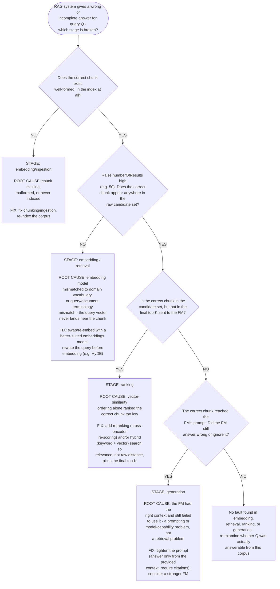

> **Exam tip:** When a scenario gives you a failing RAG system without
> telling you which stage broke, work the pipeline in order —
> **embedding/indexing → retrieval → ranking → generation** — instead of
> guessing. A chunk missing at a wide `numberOfResults` points to
> **embedding/retrieval**; a chunk that's retrievable but not in the final
> top-K points to **ranking** (the standard fix is reranking or hybrid
> search); a chunk that reached the FM's prompt but was still ignored
> points to **generation** (prompting or model choice) — which is the one
> stage none of RAG's retrieval-side fixes can touch.

---

## Worked example: selecting a foundation model under multiple competing constraints

[Section 1](#1-design-considerations-for-foundation-model-applications) and
[Domain 2, Section 7](domain-2-fundamentals-of-generative-ai.md#7-foundation-model-selection-criteria)
each introduce foundation model selection criteria (modality, cost,
latency, context window, fine-tuning support) one at a time. Real exam
scenarios rarely give you just one constraint — they stack four or five at
once and expect you to eliminate candidate models constraint by constraint
until exactly one survives. This walkthrough works through a scenario that
way.

**Scenario:** A media company is adding an AI-assisted support-triage
feature to its live chat widget. The requirements gathered from three
different stakeholders are:

- **Modality:** customers frequently attach a photo of the damaged or
  defective product, so the model must accept **image input alongside
  text** (multimodal).
- **Latency:** the feature sits inside a **live chat widget** — replies
  must feel conversational, not delayed.
- **Cost:** finance has capped inference spend, ruling out the account's
  most expensive, largest frontier-tier model for this feature.
- **Fine-tuning support:** the support team wants to later fine-tune the
  model on thousands of labeled historical transcripts so it reliably
  matches the brand's exact tone and escalation format — the model must be
  a Bedrock model that supports customization, not an on-demand-only
  model.
- **Context window:** when an issue escalates, the assistant must
  summarize the **entire ticket history** for that customer — sometimes
  tens of thousands of tokens of past messages — in a single prompt,
  without chunking it across multiple calls.

Five foundation models are available in the team's Amazon Bedrock model
catalog:

| Model | Modality | Relative cost | Latency | Fine-tuning support | Context window |
|---|---|---|---|---|---|
| **Model A** | Text + image | High (largest, frontier-tier) | High | Yes | 200K tokens |
| **Model B** | Text only | Low | Low | Yes | 8K tokens |
| **Model C** | Text + image | Low | Low | No (on-demand only) | 32K tokens |
| **Model D** | Text + image | Moderate | Moderate | Yes | 4K tokens |
| **Model E** | Text + image | Moderate | Low | Yes | 128K tokens |

Rather than trying to weigh all five constraints against all five models at
once, work through them one constraint at a time, eliminating any model
that fails it, the same way you should on the exam:

1. **Modality eliminates Model B first.** The feature must accept
   image attachments, and Model B is text-only. Modality is usually the
   right constraint to apply first ([Section 1](#1-design-considerations-for-foundation-model-applications) calls this out explicitly),
   because no amount of low cost or low latency makes a model that can't
   even read the required input viable. Remaining: **A, C, D, E**.
2. **Cost eliminates Model A next.** Model A satisfies every other
   requirement — it's multimodal, fine-tunable, and has the largest
   context window of the group — but it's the account's most expensive,
   frontier-tier model, and finance has explicitly capped inference spend
   for this feature. A model that's disqualified on cost stays
   disqualified regardless of how well it scores elsewhere. Remaining:
   **C, D, E**.
3. **Fine-tuning support eliminates Model C.** Model C is cheap and
   low-latency, but it's only available for on-demand inference and
   doesn't support customization — and the support team has a firm
   requirement to fine-tune on labeled transcripts later. Remaining:
   **D, E**.
4. **Context window eliminates Model D.** Both D and E are multimodal,
   moderately priced, and fine-tunable. But D's 4K-token context window
   can't hold a tens-of-thousands-of-token ticket history in one prompt,
   while E's 128K-token window can. Remaining: **E**.
5. **Confirm the survivor against every constraint.** Model E is
   multimodal (✓ modality), low-latency (✓ latency for a live chat
   widget), moderately priced and within budget (✓ cost), fine-tunable
   (✓ customization), and has a 128K-token context window large enough for
   a full escalation history (✓ context window). Because it is the only
   model left standing after each constraint was applied, **Model E** is
   the answer — not because it "wins" on any single dimension, but because
   it's the only one that fails none of them.

**Visual summary — multi-constraint elimination decision tree:** the
diagram below traces the exact same walkthrough as a flowchart, so you can
see all five constraints applied in sequence against all five candidate
models in one picture, instead of re-reading the numbered steps:


Notice what this process avoids: picking Model A because it looks most
capable on paper (it fails cost), or picking Model C because it looks
cheapest and fastest (it fails fine-tuning support). A model that's
excellent on three out of four stated constraints is still the wrong
answer if a scenario states all four as requirements — the exam is testing
whether you'll eliminate on every stated constraint, not just the
most obvious one.

> **Exam tip:** When a scenario lists several requirements at once, don't
> try to mentally rank or average them — **eliminate candidates one
> constraint at a time**, in whatever order the constraints are easiest to
> check (a hard modality or cost cutoff is usually fastest to apply
> first), until only one candidate remains. A distractor answer choice in
> this kind of question is almost always a model that satisfies most, but
> not all, of the stated constraints.

---

## Worked example: estimating a context-window token budget

[Section 1](#1-design-considerations-for-foundation-model-applications) lists
context window as a selection criterion and shows that it doesn't move
independently of cost and latency, and the worked example above treats it as
one pass/fail constraint among several. Neither one shows *how* to arrive at
the number that makes context window pass or fail in the first place. Exam
scenarios that describe a document length, a conversation length, or a
number of retrieved passages expect you to actually estimate a token count
and compare it against a candidate model's window — not just reason
qualitatively about "long" vs. "short."

**Scenario:** A retailer is building a customer-service chatbot. Two
requirements stack on the same request: the bot must carry on a **multi-turn
conversation** with the customer, and it must answer policy questions by
**retrieving passages (RAG) from a 100-page internal returns-and-warranty
policy document** ([Section 3](#3-retrieval-augmented-generation-rag-and-amazon-bedrock-knowledge-bases)).
The team is deciding between an **8K-context model** and **Claude, with a
200K-token context window** ([Section 1's context-window table](#context-window-vs-cost-and-latency-comparing-model-tiers)).

**Step 1: Estimate tokens per page of the source document.**
Using the common rule of thumb that a token is roughly ¾ of an English word
(about 100 tokens per 75 words), a typical single-spaced policy-document
page of ~500 words works out to **~650 tokens per page**. Applied to the
full 100-page policy document, that's a ~65,000-token corpus — but that
total is only relevant to how the document gets *chunked and embedded*
([Section 3](#3-retrieval-augmented-generation-rag-and-amazon-bedrock-knowledge-bases),
[Section 6](#6-vector-databases-and-embeddings-for-search-and-retrieval)).
RAG never sends the whole document to the model; it sends only the chunks
retrieved for a given question. With chunk size set to roughly one page
equivalent (~650 tokens — large enough to avoid the mid-sentence splitting
covered in the [RAG troubleshooting worked example's](#worked-example-troubleshooting-a-failing-rag-system)
first failure mode), each retrieved chunk costs ~650 tokens against the
request's context window.

**Step 2: Break a single request into its token-budget components.**
What actually counts against the context window is everything sent *in one
request*: the system prompt, the conversation history so far, the retrieved
chunks for the current question, the current question itself, and headroom
reserved for the model's reply.

| Request component | Typical turn (turn 8, 4 retrieved chunks) | Escalated turn (turn 20, 8 retrieved chunks) |
|---|---|---|
| System / instruction prompt | 300 | 300 |
| Retrieved RAG context (chunks × ~650 tokens) | 4 × 650 = 2,600 | 8 × 650 = 5,200 |
| Conversation history so far (turn pairs × ~160 tokens) | 8 × 160 = 1,280 | 20 × 160 = 3,200 |
| Current user question | 40 | 40 |
| Reserved output budget for the reply | 300 | 300 |
| **Total tokens needed** | **4,520** | **9,040** |

The "typical turn" models a customer roughly midway through a support
conversation, asking a question answered by 4 retrieved chunks. The
"escalated turn" models a longer conversation that has dragged on for 20
turn pairs and a question broad enough that retrieval pulls in 8 chunks
spanning multiple policy sections — the same kind of worst case a scenario
question expects you to check, not just the easy first turn.

**Step 3: Compare the estimated budget against each candidate model's
context window.**

| Model | Context window | Typical turn (4,520 tokens) | Escalated turn (9,040 tokens) |
|---|---|---|---|
| 8K-context model (e.g., the Llama 8B tier from [Section 1's table](#context-window-vs-cost-and-latency-comparing-model-tiers)) | 8,000 tokens | Fits — but only ~3,480 tokens (~43%) of headroom left | **Doesn't fit — 1,040 tokens over budget** |
| Claude (200K context) | 200,000 tokens | Fits — ~2% of the window used | Fits — ~4.5% of the window used |

The 8K model isn't just slower to grow into — it fails outright once the
conversation escalates. A request that exceeds a model's context window
doesn't get silently trimmed to fit; it's rejected as invalid input, so the
application would need its own truncation or conversation-summarization
logic (dropping older turns, or capping retrieved chunks below what best
answers the question) purely to stay under 8K, well before the account ever
sees a cost or latency difference between the two models.

**Step 4: Weigh the resulting cost/capability trade-off.**
Per [Section 1's context-window table](#context-window-vs-cost-and-latency-comparing-model-tiers),
an 8K-context model costs less per token than Claude. But cheaper-per-token
is only a real saving if the request fits in the first place. Here, the
escalated-turn estimate (9,040 tokens) already exceeds the 8K window before
factoring in any future growth — a second reference document, a higher
retrieval `numberOfResults`, or longer support conversations would only
widen the gap. Choosing the 8K model would mean either accepting degraded
answers on escalated conversations (dropped history or under-retrieved
context) or building and maintaining truncation/summarization logic to
force every request under budget. Choosing Claude's 200K window costs more
per token but comfortably absorbs both the typical and escalated cases with
no truncation logic at all, which is why context window — not raw
per-token cost — is the constraint that decides this scenario, the same
conclusion the [multi-constraint worked example](#worked-example-selecting-a-foundation-model-under-multiple-competing-constraints)
reaches when context window is a hard requirement rather than a nice-to-have.

**AWS example:** The team estimates its request-level token budget (as
above), confirms it can exceed 8,000 tokens once a conversation escalates,
and selects **Claude on Amazon Bedrock** for the 200K context window. They
still cap `numberOfResults` on the Knowledge Base **Retrieve** call at a
sensible number (rather than retrieving unbounded chunks) so that even a
200K window isn't approached carelessly — token budget estimation applies
to every model, it just changes which side of the estimate the risk sits
on.

> **Exam tip:** When a scenario gives you enough detail to estimate a token
> count — a document length, a number of conversation turns, a number of
> retrieved chunks — the exam expects you to actually do the arithmetic
> instead of reasoning qualitatively about "big" vs. "small" context. Always
> check the **worst case a real conversation reaches**, not just its first
> turn: a model that comfortably fits an opening question but overflows once
> the conversation grows or retrieval widens is not "context-window
> suitable" for that scenario, no matter how cheap or fast it is per token.

---

## Worked example: estimating tokens for long-document summarization

The worked example above sizes a context window for a RAG-plus-conversation
request. A different common exam scenario skips retrieval entirely:
summarizing one long document (a contract, a transcript, a report) in a
single prompt. The token math is simpler, but the same "estimate first,
then compare against the model" discipline decides whether the prompt fits
or needs to be split.

**Scenario:** A legal team wants Amazon Bedrock to summarize a single
**90-page** merger agreement in one prompt, without splitting it into
chunks, so the summary can reference relationships between clauses that
live in different parts of the document.

**Step 1: Estimate the source document in tokens.**
Legal documents run denser than the ~500-word/page estimate used in [the
RAG worked example above](#worked-example-estimating-a-context-window-token-budget)
— call it ~600 words per page for dense contract text. Using the same
¾-token-per-word rule of thumb ([Domain 2's version of this
estimate](domain-2-fundamentals-of-generative-ai.md#worked-example-estimating-tokens-for-rag-retrieval-and-long-document-summarization)
walks through the conversion in more detail):

90 pages × 600 words/page = 54,000 words → 54,000 ÷ 0.75 ≈ **~72,000
tokens** for the document text alone.

**Step 2: Add prompt overhead and output headroom.**

| Request component | Approx. tokens |
|---|---|
| Summarization instructions (desired format, length, focus areas) | ~150 |
| Full document text | ~72,000 |
| Reserved headroom for the summary itself | ~1,500 |
| **Total tokens needed** | **~73,650** |

**Step 3: Compare against candidate models.**

| Model | Context window | Fits a 73,650-token request? |
|---|---|---|
| 8K-context model | 8,000 tokens | No — the document alone (~72,000 tokens) is already ~9x the entire window |
| 32K-context model | 32,000 tokens | No — still roughly 2.3x over budget |
| Claude, 200K context ([Section 1's table](#context-window-vs-cost-and-latency-comparing-model-tiers)) | 200,000 tokens | Yes — ~37% of the window used, with room for a longer agreement or a follow-up question about the summary |

**Step 4: Decide between a bigger window and chunking.**
If no candidate model's window comfortably covers the estimate, the
scenario isn't really asking you to pick between models — it's asking
whether to move to a larger-context model or fall back to a **map-reduce
summarization** pattern (summarize each chunk separately, then summarize
the summaries), which reintroduces the chunk-boundary trade-offs from
[Section 3](#3-retrieval-augmented-generation-rag-and-amazon-bedrock-knowledge-bases)
and the [RAG troubleshooting worked
example](#worked-example-troubleshooting-a-failing-rag-system) even though
this scenario has no retrieval step at all. Here, a single 200K-context
model avoids that complexity entirely, which is why "must summarize a very
long document in one pass, without chunking" is one of the clearest
scenario signals that context window — not cost or latency — is the
deciding selection criterion.

**AWS example:** The legal team runs the estimate above, confirms the
merger agreement needs roughly 73,650 tokens per request, and selects a
200K-context model in **Amazon Bedrock** rather than building and
maintaining a map-reduce summarization pipeline just to fit a
smaller-context model.

> **Exam tip:** "Summarize a single long document in one prompt, without
> chunking" and "summarize retrieved passages across a long conversation"
> (the worked example above) are both context-window sizing questions, but
> they estimate different things: a summarization prompt's dominant cost is
> the **whole source document**, while a RAG prompt's dominant cost is
> **however many chunks retrieval returns for one question** — usually a
> small fraction of the source corpus. Confusing the two leads to wildly
> overestimating a RAG request or underestimating a summarization request.

---

## Worked example: estimating and comparing monthly inference costs across three model tiers

[Section 1's model-tier table](#context-window-vs-cost-and-latency-comparing-model-tiers)
ranks Claude Haiku, Sonnet, and Opus as **Lowest**, **Moderate**, and
**Highest** relative cost per token, and lists cost as a model-selection
criterion alongside context window and latency. That table is deliberately
qualitative — it tells you the *order* of the three tiers, not what any of
them actually costs a real application in a month. Exam scenarios that give
you a request volume and a token size per request expect you to turn that
qualitative ranking into an actual monthly figure before recommending a
tier, the same "estimate first, then compare" discipline the [token-budget
worked example](#worked-example-estimating-a-context-window-token-budget)
uses for context window instead of cost.

**Scenario:** The same retailer's customer-support chat assistant from the
[token-budget worked example](#worked-example-estimating-a-context-window-token-budget)
is going into production on **Amazon Bedrock**. The team forecasts
**500,000 requests per month**, and estimates (the same way as that earlier
example: system prompt + retrieved RAG context + conversation history) that
each request averages **800 input tokens** and **200 output tokens**. They
need to compare projected monthly cost across the three Claude tiers from
Section 1's table — Haiku, Sonnet, and Opus — before picking one.

**Step 1: Convert monthly request volume into total monthly input and
output tokens.**

- Input tokens/month: 500,000 requests × 800 input tokens = **400,000,000
  input tokens**
- Output tokens/month: 500,000 requests × 200 output tokens = **100,000,000
  output tokens**

Input and output must be tracked separately — Bedrock (like most FM
providers) bills them at **different per-token rates**, and output tokens
are consistently priced higher than input tokens across every tier.

**Step 2: Apply each tier's on-demand rate to the monthly token totals.**
The table below uses **illustrative on-demand rates** (round numbers picked
for this exercise, not a live quote) to show the arithmetic — always check
the current Bedrock pricing page for actual rates, since per-token pricing
changes over time and by region.

| Model tier | Input rate (per 1,000 tokens) | Output rate (per 1,000 tokens) | Monthly input cost (400M tokens) | Monthly output cost (100M tokens) | **Total monthly cost** |
|---|---|---|---|---|---|
| **Claude Haiku** (Lowest) | $0.00025 | $0.00125 | 400,000 × $0.00025 = $100 | 100,000 × $0.00125 = $125 | **$225** |
| **Claude Sonnet** (Moderate) | $0.003 | $0.015 | 400,000 × $0.003 = $1,200 | 100,000 × $0.015 = $1,500 | **$2,700** |
| **Claude Opus** (Highest) | $0.015 | $0.075 | 400,000 × $0.015 = $6,000 | 100,000 × $0.075 = $7,500 | **$13,500** |

**Step 3: Compare the tiers in absolute dollars, not just relative rank.**
Section 1's table only says Sonnet costs "Moderate" and Opus costs
"Highest" relative to Haiku — it doesn't say by how much. Worked in full:
Sonnet costs **12x** Haiku's monthly total ($2,700 vs. $225), and Opus costs
**60x** Haiku's ($13,500 vs. $225) and **5x** Sonnet's. At this request
volume, the gap between tiers isn't a rounding error — moving the whole
workload from Haiku to Opus adds roughly **$13,275 per month**, money that
has to be justified by an actual accuracy or reasoning-quality requirement,
not assumed away because "Opus is the best model."

**Step 4: Weigh the cost delta against what each tier is actually for.**
Per [Section 1's table](#context-window-vs-cost-and-latency-comparing-model-tiers),
Haiku is recommended for "high-volume, latency-sensitive tasks" — which is
exactly this scenario's profile (500,000 requests/month, a chat assistant).
If Haiku's accuracy on the support-chat task is good enough, the $225/month
estimate is the number that matters and the other two tiers are needlessly
expensive. If evaluation ([Section 7](#7-evaluating-foundation-model-performance))
shows Haiku's answers are unreliable on complex policy questions, the
scenario is really asking whether the accuracy gain from Sonnet (or Opus)
is worth its monthly delta — not whether a cheaper model exists in the
abstract. And if this 500,000-request/month volume turns out to be high and
steady rather than spiky, [Section 5's provisioned throughput](#5-amazon-bedrock-features)
is worth pricing separately, since a flat monthly commitment can undercut
on-demand per-token billing at sustained volume even though it doesn't
change which tier fits the task.

**AWS example:** The team runs the estimate above for all three tiers,
evaluates Haiku's accuracy on a sample of real support conversations
([Section 5's automatic and human evaluation](#5-amazon-bedrock-features)),
finds it acceptable for routine questions, and launches on **Claude Haiku
via Amazon Bedrock** at a projected **~$225/month** on-demand — well under
Sonnet's ~$2,700/month — while keeping the evaluation results on hand to
justify escalating a subset of harder conversations to Sonnet later if
Haiku's answers prove insufficient in production.

> **Exam tip:** When a scenario gives you a request volume and an
> average input/output token size per request, the exam expects you to
> multiply out a **monthly total** (requests × tokens/request × rate) for
> each candidate tier before answering "which model is most cost-effective"
> — not just pick the tier labeled cheapest in isolation. Always price
> **input and output tokens separately**, since output tokens cost more per
> token than input tokens at every tier, and a request pattern with a high
> output-to-input ratio (e.g., long-form generation) shifts the total cost
> comparison more than the same token count split the other way.

---

## Worked example: comparing fine-tuning and prompt engineering on the same task

[Section 4's decision guide](#4-fine-tuning-vs-continued-pre-training-vs-rag-vs-prompt-engineering)
says fine-tuning fits a narrow task with labeled examples and an exact
required format, while prompt engineering fits a quick behavior adjustment
with no training data — but that framing stays qualitative until the two
approaches are actually priced out on the same task. This walkthrough runs
one concrete scenario through both approaches and compares token cost,
latency, and accuracy side by side, the same "estimate first, then
compare" discipline the [monthly cost worked
example](#worked-example-estimating-and-comparing-monthly-inference-costs-across-three-model-tiers)
applies to model tiers.

**Scenario:** A software company's support team wants every inbound
ticket automatically classified into one of 12 internal categories and
returned as strict JSON (`{"category": ..., "priority": ..., "summary":
...}`) in the company's exact internal format. They forecast **1,000,000
tickets/month** and already have **4,000 labeled example tickets** (ticket
text plus the correct JSON output) from a year of manual triage. Two
approaches are on the table:

- **Prompt engineering:** keep the base model as-is and steer it with a
  **few-shot prompt** — fixed instructions plus 10 worked examples pulled
  from the labeled set — sent in full on **every single request**.
- **Fine-tuning:** use the same 4,000 labeled examples to fine-tune a
  custom Bedrock model once, then call it with only a short system
  instruction and the ticket text. No worked examples are needed at
  inference time, because the desired behavior is baked into the model's
  weights instead of re-explained on every call.

**Step 1: Size the input tokens per request for each approach.**

| Component | Prompt engineering | Fine-tuning |
|---|---|---|
| Fixed instructions | ~300 tokens | ~100 tokens |
| Few-shot examples (10 × ~150 tokens) | ~1,500 tokens | 0 (not needed) |
| Ticket text | ~200 tokens | ~200 tokens |
| **Total input tokens/request** | **~2,000 tokens** | **~300 tokens** |

The few-shot examples are what make prompt engineering's per-request input
**more than 6x larger** than fine-tuning's — all 10 worked examples travel
over the wire and get processed by the model on **every** call, while
fine-tuning paid that "teaching cost" once, during training, instead of on
every request.

**Step 2: Convert to monthly token totals and price them.** Output size is
the same for both approaches (~100 tokens of JSON), so only input tokens
change the comparison. Using the same illustrative on-demand rates as the
[monthly cost worked
example](#worked-example-estimating-and-comparing-monthly-inference-costs-across-three-model-tiers)
($0.00025 per 1,000 input tokens, $0.00125 per 1,000 output tokens):

| Approach | Monthly input tokens | Monthly output tokens | Input cost | Output cost | **Total monthly inference cost** |
|---|---|---|---|---|---|
| **Prompt engineering** | 1,000,000 × 2,000 = 2,000,000,000 | 1,000,000 × 100 = 100,000,000 | 2,000,000 × $0.00025 = $500 | 100,000 × $0.00125 = $125 | **$625** |
| **Fine-tuning** | 1,000,000 × 300 = 300,000,000 | 1,000,000 × 100 = 100,000,000 | 300,000 × $0.00025 = $75 | 100,000 × $0.00125 = $125 | **$200** |

On raw per-token inference cost alone, fine-tuning looks cheaper —
**$200/month vs. $625/month**, a savings of $425/month (about 68%) purely
from not re-sending 10 few-shot examples on every call.

**Step 3: Add the cost prompt engineering doesn't have — fine-tuning's
fixed costs.** That $200 vs. $625 comparison is incomplete, and this is
the step exam scenarios expect you to catch. Two costs apply to
fine-tuning that prompt engineering never incurs:

- A **one-time training cost** to run the fine-tuning job on the 4,000
  labeled examples.
- **Provisioned throughput**, which [Section 4](#4-fine-tuning-vs-continued-pre-training-vs-rag-vs-prompt-engineering)
  notes Bedrock custom models typically require instead of on-demand
  billing — a **flat monthly commitment**, illustratively **~$4,000/month**
  for the smallest model-unit commitment that covers this volume,
  regardless of whether all 1,000,000 requests actually arrive that month.

Once that fixed cost is added, fine-tuning's *effective* monthly total is
roughly **$4,200** (~$200 inference + ~$4,000 provisioned throughput)
versus prompt engineering's **$625** — prompt engineering is actually
**cheaper overall at this volume**, even though it's more expensive per
token. Fine-tuning's per-token advantage only overcomes its large fixed
cost at much higher request volume, or when several fine-tuned use cases
share the same provisioned throughput commitment.

**Step 4: Compare latency.** Prompt-processing time scales with input
tokens, not just output length, because a request must process every
input token before it can start generating a response. At roughly 2,000
input tokens, prompt engineering's few-shot block adds a measurable fixed
processing delay to **every** request before the model even reaches the
actual ticket text; at ~300 input tokens, fine-tuning's much shorter
prompt reaches the ticket almost immediately. Illustratively, that's the
difference between **~450ms** of prompt-processing time (prompt
engineering) and **~90ms** (fine-tuning) ahead of generation — a gap that
compounds across 1,000,000 requests/month and matters most for a
latency-sensitive, real-time triage queue.

**Step 5: Compare accuracy on the actual task.** Token cost and latency
each favor a different approach depending on volume, but accuracy on this
specific task — strict JSON in an exact internal format — tends to favor
fine-tuning, because [Section 4](#4-fine-tuning-vs-continued-pre-training-vs-rag-vs-prompt-engineering)
is right that fine-tuning updates the model's weights toward one exact
behavior instead of relying on the model to *infer* the pattern from 10
examples on every call. Evaluated against the same 200-ticket held-out
labeled set ([Section 7's evaluation approach](#7-evaluating-foundation-model-performance)),
illustratively: the few-shot prompt-engineered approach hits **82%
exact-format compliance** (some responses drift from the required JSON
schema or misclassify edge-case categories the 10 examples didn't cover),
while the fine-tuned model hits **97%** (the 4,000-example training set
covers far more of the 12 categories' edge cases than 10 few-shot examples
ever could).

**Weighing it together:** no single approach wins on all three dimensions
here. Prompt engineering is cheaper in total dollars at this request
volume and needs no training pipeline, but it's slower per request and
less accurate on the exact-format task. Fine-tuning is faster per request
and meaningfully more accurate, but only pays for itself in dollar terms
once provisioned throughput's flat cost is spread across enough requests
(or enough other fine-tuned workloads) to beat prompt engineering's
per-token total. Which one is "correct" depends on which constraint a
scenario emphasizes: a cost-capped pilot points to prompt engineering; a
latency- or accuracy-critical production rollout at higher sustained
volume points to fine-tuning.

**AWS example:** The team pilots prompt engineering first — cheapest to
ship, no training pipeline required — and monitors accuracy in production
using [Bedrock's evaluation tooling](#7-evaluating-foundation-model-performance).
Once ticket volume grows past the point where provisioned throughput's
flat cost is justified by the accuracy and latency gap, and the labeled
dataset has grown past 4,000 examples, they fine-tune a Bedrock custom
model and migrate the triage workload onto it, keeping the original
few-shot prompt as a fallback for categories the fine-tuned model hasn't
seen enough labeled examples of yet.

> **Exam tip:** A scenario that only emphasizes accuracy or exact-format
> compliance points you toward fine-tuning, per [Section 4](#4-fine-tuning-vs-continued-pre-training-vs-rag-vs-prompt-engineering)'s
> decision guide. But a scenario that gives you **both a request volume
> and a fine-tuning fixed cost** (training or provisioned throughput)
> expects you to compare **total** monthly cost, not just per-token or
> per-request cost. Fine-tuning's shorter prompts routinely make its
> *per-token* cost cheaper, while its *total* monthly cost can still be
> higher than prompt engineering's at low-to-moderate volume, because
> provisioned throughput is billed as a flat commitment, not per token.

---

## Worked example: a Bedrock Agent executing a multi-step task with tool calling

[Section 5](#5-amazon-bedrock-features) introduces Amazon Bedrock Agents at
a conceptual level — an FM that reasons about a request, breaks it into
steps, and invokes action groups and Knowledge Bases in a plan → invoke →
observe → continue loop. This walkthrough follows that loop through one
actual multi-step request end to end, since AIF-C01 scenario questions
about Agents are almost always framed as "walk through what happens when
the user asks X," not "define an Agent."

**Scenario:** An electronics retailer builds a Bedrock Agent for its
support chat widget. A customer types: *"Where's my order #48213, and if
it's going to be late, can I get a $15 credit?"* — a single message that
actually requires information the Agent doesn't have yet, plus a policy
decision that depends on what that information turns out to be.

The team configures the Agent with:

- An **instruction prompt** describing the Agent's role and boundaries
  ("You help customers track orders and apply approved goodwill credits;
  never approve a credit above $20 without escalating.").
- Two **action groups**, each defined by an OpenAPI schema and backed by
  an AWS Lambda function: `CheckOrderStatus` (takes an order ID, returns
  carrier, ETA, and a delay flag) and `IssueCredit` (takes a customer ID
  and dollar amount, returns a confirmation ID).
- A **Knowledge Base** containing the current goodwill-credit policy
  document.

Trace the Agent's reasoning-and-acting loop for this one request:

1. **Plan.** The underlying FM parses the request and determines it can't
   answer directly — it needs the order's current status first. It selects
   the `CheckOrderStatus` action group and extracts `order_id=48213` from
   the user's message as the parameter.
2. **Invoke (step 1).** The Agent calls the `CheckOrderStatus` Lambda
   function with `order_id=48213`.
3. **Observe (step 1).** The function returns `{"carrier": "Regional
   Freight", "eta": "2026-09-10", "delay_flag": true}` — the order is, in
   fact, running late.
4. **Re-plan.** Because `delay_flag` came back `true`, the Agent
   determines the second half of the question ("can I get a $15 credit")
   is now relevant, and it needs the goodwill-credit policy before it can
   answer — a step it would have skipped entirely had the order been on
   time. This is the part a single tool call or a fixed prompt chain can't
   do: the set of steps taken depends on an intermediate result observed
   mid-task, not on a script decided in advance.
5. **Invoke (step 2).** The Agent queries the attached **Knowledge Base**
   for the goodwill-credit policy.
6. **Observe (step 2).** The retrieved policy passage says credits up to
   $20 are pre-approved for shipments delayed more than 3 days past the
   original ETA, without human review.
7. **Invoke (step 3).** Confirming that $15 is within the Agent's
   instructed $20 ceiling and that the delay qualifies, the Agent calls the
   `IssueCredit` action group with `customer_id` and `amount=15`.
8. **Observe (step 3).** The function issues the credit and returns a
   confirmation ID.
9. **Final response.** The Agent composes one reply grounded in all three
   tool results: the order's carrier and new ETA, an explanation that the
   delay qualifies under policy, and confirmation that the $15 credit has
   already been applied — all from a single customer message, with no
   human in the loop and no hardcoded sequence of steps written by a
   developer.

Notice what made this a job for an Agent rather than a single tool call or
a fixed Prompt Flow: **the number and order of steps was not known in
advance.** A customer whose order was on time would have triggered only
steps 1–3 and a short "your order is on schedule" reply, never touching
the Knowledge Base or the `IssueCredit` action group at all. That runtime,
result-dependent branching is exactly the "who decides the next step"
distinction from the [Agents vs. Prompt Flows vs. prompt chaining
comparison](#bedrock-agents-vs-prompt-flows-vs-prompt-chaining-choosing-an-orchestration-approach)
earlier in this domain.

**AWS example:** A travel-booking company's Bedrock Agent handles "I need
to cancel my flight and see if I get a refund" by invoking a
`CancelBooking` action group first, observing whether the fare class
returned is refundable, and only then conditionally invoking a
`ProcessRefund` action group — skipping it entirely, and instead
explaining the non-refundable fare's terms from a Knowledge Base, whenever
the fare class isn't eligible.

> **Exam tip:** A scenario that describes a single request producing a
> **variable number of API calls depending on an intermediate result**
> ("only check the refund policy if the order is late," "only issue a
> credit if the delay exceeds 3 days") is describing the Bedrock Agents
> reasoning-and-acting loop — not a single tool call, and not a Prompt
> Flow. If every answer choice mentions "action groups" but only one also
> describes the Agent **re-planning based on what a prior tool call
> returned**, that's the correct one: the behavior actually being tested is
> the autonomous, runtime decision of *whether and which* tool to invoke
> next, not merely that tools get called at all.

---

## Comparison table: customization approaches for foundation model applications

| Approach | Changes model weights? | Data required | Relative cost/speed | Best for |
|---|---|---|---|---|
| **Prompt engineering** | No | None beyond the prompt itself | Lowest cost, fastest to iterate | Quick behavior/format adjustments; no training data available |
| **RAG (Amazon Bedrock Knowledge Bases)** | No | External knowledge source (documents), no labeling needed | Low cost, fast to set up; retrieval adds some runtime latency | Grounding answers in current, frequently changing, or proprietary data; reducing hallucination |
| **Fine-tuning** | Yes | Labeled input/output example pairs | Higher cost, slower (requires a training job) | Reliable task-specific style/format/behavior; often needs provisioned throughput to serve |
| **Continued pre-training** | Yes | Large volume of unlabeled domain-specific text | Highest cost, slowest, most compute-intensive | Deepening a model's general knowledge/vocabulary of a specialized domain |

> **Exam tip:** This table is the domain's most-tested decision. As
> complexity/cost increases left to right, so does how deeply the model
> itself is changed: prompt engineering and RAG never touch the model's
> weights (the model is used "as-is," just given different input); fine-
> tuning and continued pre-training both retrain the model and typically
> require the resulting custom model to be served via **provisioned
> throughput** on Bedrock.

---

## Quick-reference cheat sheet

A condensed, one-page (print-friendly) recap of this domain's
highest-yield material for last-minute review right before the exam.
Domain 3 carries the largest single share of scored questions
(**~28%**), so this is the single most valuable page-and-a-half in this
guide to re-read the morning of the exam. It restates material covered
in full in [Section 1](#1-design-considerations-for-foundation-model-applications), [Section 3](#3-retrieval-augmented-generation-rag-and-amazon-bedrock-knowledge-bases), [Section 4](#4-fine-tuning-vs-continued-pre-training-vs-rag-vs-prompt-engineering), and [Section 5](#5-amazon-bedrock-features) —
it is not a substitute for reading those sections, only a fast recall
aid once you already have.

**FM selection criteria (Section 1) — weigh all six against each other:**

| Factor | Ask yourself |
|---|---|
| Task fit | Does the model handle this task type (summarization, code, classification, chat) well? |
| Context window | Is the input (plus retrieved/RAG context) small enough to fit? |
| Modality | Does the model accept/produce the needed input/output types (text, image, audio, video)? |
| Accuracy | Does it perform well enough on *this* use case, not just on generic benchmarks? |
| Cost | Per-token (on-demand) or reserved-capacity (provisioned throughput) — bigger models cost more per token |
| Latency | Smaller models respond faster; streaming improves *perceived* latency only |
| Customization | Can it be fine-tuned or continued-pre-trained if prompt engineering/RAG isn't enough? |

**RAG architecture (Section 3) — six steps, in order:**

Ingestion (S3) → Chunking → Embedding (e.g., Amazon Titan Text
Embeddings) → Indexing/storage (vector database) → Retrieval (similarity
search on the embedded query) → Augmentation and generation (retrieved
chunks inserted into the prompt, FM generates a grounded answer). Amazon
Bedrock Knowledge Bases automates all six steps for you via the
`Retrieve` / `RetrieveAndGenerate` APIs. **RAG never changes model
weights** — it changes what goes into the prompt.

**Customization spectrum (Section 4) — one-line-per-approach recall:**

- **Prompt engineering** → no data, no training, cheapest/fastest → style/format tweaks.
- **RAG** → external data, no training → current/frequently changing/proprietary facts, less hallucination.
- **Fine-tuning** → labeled data, retrains weights → a specific narrow task/style done reliably.
- **Continued pre-training** → unlabeled data, retrains weights, priciest/slowest → broad domain vocabulary/fluency.

**Bedrock feature set (Section 5) — match the keyword to the feature:**

| If the scenario says... | The feature is... |
|---|---|
| "explicitly enable a model before calling it" | Model access |
| "take actions / call APIs / multi-step tasks" | Agents (action groups) |
| "block harmful, off-topic, or PII content" | Guardrails |
| "answer from our own documents" | Knowledge Bases |
| "compare model quality objectively/at scale" | Automatic model evaluation |
| "judge subjective quality like tone" | Human evaluation |
| "guaranteed throughput, high/steady/predictable volume, custom model" | Provisioned throughput |
| "unpredictable/low/spiky volume, pay per use" | On-demand |

**Key definitions to have cold:** embedding (numeric vector capturing
semantic meaning) · chunking (splitting documents before embedding) ·
vector database (optimized for similarity/k-NN search) · hallucination
(a model confidently generating incorrect information) · provisioned
throughput (reserved capacity, in *model units*, for a commitment
period) · action group (the APIs a Bedrock Agent can invoke, typically
via Lambda).

**Common exam traps:**

- "Frequently changing data" or "reduce hallucination from our own
  documents" → **RAG**, not fine-tuning. Fine-tuning is slow/expensive to
  update and doesn't ground answers in facts outside its training data.
- A **fine-tuned or continued-pre-trained** model almost always needs
  **provisioned throughput** to serve reliably — don't pick on-demand for
  a custom model under steady high load.
- **Guardrails** filters content; it does **not** retrieve knowledge or
  invoke APIs — don't confuse it with Knowledge Bases or Agents.
- **Streaming** improves *perceived* latency (tokens appear sooner); it
  does not reduce total generation time or cost.
- Continued pre-training uses **unlabeled** text for broad domain
  fluency; fine-tuning uses **labeled** input/output pairs for a narrow
  task — the labeled/unlabeled distinction is the fastest way to tell
  the two apart under exam pressure.

---

## Key terms glossary

> Looking for a term from another domain? [`docs/master-glossary.md`](master-glossary.md) indexes every domain's key terms alphabetically with domain tags (e.g. `[D1, D3]`) and links back here.

- **Foundation model (FM) application design** — the process of choosing
  a model and architecture based on task fit, cost, latency, modality, and
  customization needs.
- **Modality** — the type(s) of input/output a model handles (text,
  image, audio, video); **multimodal** models handle more than one.
- **Prompt engineering** — crafting model input to reliably produce a
  desired output, without changing model weights.
- **Zero-shot prompting** — asking a model to perform a task with no
  example demonstrations.
- **Few-shot prompting** — including example input/output pairs in a
  prompt to guide the model's output pattern.
- **Chain-of-thought (CoT) prompting** — instructing a model to reason
  step-by-step before answering, improving multi-step reasoning accuracy.
- **Negative prompting** — explicitly instructing a model what to avoid
  producing.
- **Prompt template** — a reusable prompt structure with placeholders for
  consistent, repeatable prompt construction.
- **Prompt chaining** — breaking a task into a sequence of prompts where
  each output feeds the next input.
- **Prompt injection** — a malicious attempt to override an application's
  intended prompt/system instructions via user input.
- **Retrieval Augmented Generation (RAG)** — retrieving relevant external
  data at query time and inserting it into the prompt to ground a model's
  response, without retraining.
- **Amazon Bedrock Knowledge Bases** — Bedrock's fully managed RAG
  feature: automatic ingestion, chunking, embedding, and retrieval over
  your own data source.
- **Chunking** — splitting documents into smaller passages before
  embedding, so retrieval returns focused, relevant content.
- **Embedding** — a numeric vector representation of text (or other
  content) capturing its semantic meaning.
- **Amazon Titan Text Embeddings** — an Amazon Bedrock embeddings model
  used to generate vector embeddings from text.
- **Vector database** — a data store optimized for similarity search over
  embeddings (e.g., k-NN search).
- **Semantic search** — search based on meaning/similarity rather than
  exact keyword matching, powered by embeddings and vector search.
- **Amazon OpenSearch Service / Serverless** — an AWS search and analytics
  service with a built-in vector engine, supporting hybrid vector +
  keyword search.
- **pgvector** — an open-source PostgreSQL extension for storing and
  querying vector embeddings in Amazon Aurora or Amazon RDS for
  PostgreSQL.
- **Amazon Kendra** — a fully managed, ML-powered enterprise search
  service that handles embeddings and relevance internally.
- **Fine-tuning** — further training a pretrained FM on a smaller labeled
  dataset to change its weights for a specific task, style, or format.
- **Continued pre-training (domain adaptation)** — further training a
  pretrained FM on large volumes of unlabeled domain-specific text using
  the original pretraining objective.
- **Amazon Bedrock model access** — the requirement to explicitly request
  access to a specific foundation model in the Bedrock console before use.
- **Amazon Bedrock Agents** — a Bedrock feature that lets an FM plan and
  execute multi-step tasks by invoking external APIs (action groups) and
  Knowledge Bases.
- **Action group (Bedrock Agents)** — a defined set of APIs (typically
  backed by AWS Lambda) that a Bedrock Agent can invoke to take actions.
- **Guardrails for Amazon Bedrock** — configurable safety filters applied
  to FM inputs/outputs (denied topics, content filters, PII redaction,
  contextual grounding checks).
- **Bedrock model evaluation** — Bedrock jobs that assess FM quality via
  automatic (benchmark-based) or human evaluation.
- **Automatic model evaluation** — evaluation using built-in or custom
  metrics computed programmatically against a prompt dataset.
- **Human evaluation (model evaluation)** — evaluation where people score
  model outputs on subjective criteria.
- **Benchmark dataset** — a standardized dataset (often public) used to
  objectively and reproducibly score and compare model quality.
- **Business metric** — an outcome-oriented measure (e.g., conversion
  rate, CSAT, cost per interaction) used to judge an application's
  real-world impact, distinct from model-quality metrics.
- **Provisioned throughput** — dedicated, reserved inference capacity
  (model units) purchased for a commitment period, guaranteeing
  consistent throughput/latency; typically required to serve custom
  (fine-tuned) models.
- **On-demand (Bedrock pricing)** — pay-per-token inference pricing with
  no capacity commitment, suited to variable/unpredictable traffic.
- **Amazon SageMaker** — AWS's fully managed service for building,
  training, and deploying ML models.
- **Amazon SageMaker JumpStart** — a hub of pretrained foundation models
  and solution templates deployable/fine-tunable within SageMaker.
- **AWS Trainium** — AWS's purpose-built ML chip optimized for
  cost-efficient, high-performance model training (EC2 Trn1/Trn2).
- **AWS Inferentia** — AWS's purpose-built ML chip optimized for
  cost-efficient, high-throughput, low-latency inference (EC2 Inf1/Inf2).
- **AWS Neuron SDK** — the software development kit used to run ML
  workloads on Trainium and Inferentia chips.

---

## Practice questions

1. **[Intermediate]** A company wants its generative AI assistant to always answer using the
   most current version of its product catalog, which changes daily, and
   cannot afford to retrain a model every day. Which approach best fits
   this requirement?
   A. Fine-tuning
   B. Continued pre-training
   C. Retrieval Augmented Generation (RAG) with Amazon Bedrock Knowledge Bases
   D. Increasing the model's temperature parameter

2. **[Beginner]** Which factor should a team prioritize first when a use case requires
   the model to generate both text and images from a single prompt?
   A. Cost per token
   B. Modality support
   C. Provisioned throughput commitment length
   D. Chain-of-thought prompting

3. **[Intermediate]** A developer wants a foundation model to reliably output responses in a
   very specific JSON schema by showing it several example input/output
   pairs directly inside the prompt, without any training job. Which
   prompt engineering technique is this?
   A. Zero-shot prompting
   B. Few-shot prompting
   C. Continued pre-training
   D. Fine-tuning

4. **[Intermediate]** A model is prone to giving a final answer to multi-step math word
   problems without correctly working through the intermediate steps.
   Which prompting technique would most directly help, at no additional
   training cost?
   A. Negative prompting
   B. Chain-of-thought prompting
   C. Provisioned throughput
   D. Continued pre-training

5. **[Beginner]** Which of the following best describes the purpose of Amazon Bedrock
   Knowledge Bases?
   A. It fine-tunes a foundation model's weights on labeled data
   B. It automatically manages ingestion, chunking, embedding, and retrieval of your own data to ground FM responses
   C. It provides dedicated, reserved inference capacity for a model
   D. It filters harmful content from model outputs

6. **[Advanced]** A company wants a foundation model to deeply understand highly
   specialized medical terminology found throughout a large volume of
   unlabeled clinical text, improving its general fluency in that domain
   rather than teaching it one specific task. Which customization approach
   fits best?
   A. Prompt engineering
   B. RAG
   C. Continued pre-training
   D. Provisioned throughput

7. **[Advanced]** Which statement correctly distinguishes fine-tuning from continued
   pre-training?
   A. Fine-tuning requires unlabeled data; continued pre-training requires labeled data
   B. Fine-tuning uses labeled input/output examples to adapt a model to a specific task; continued pre-training uses large volumes of unlabeled domain text to deepen general domain knowledge
   C. They are the same process with different names
   D. Neither approach changes the model's weights

8. **[Intermediate]** A company wants a Bedrock-based assistant to (1) look up a
   customer's order status by calling an internal REST API, and (2)
   answer a follow-up question by retrieving relevant passages from
   internal documentation, all within one conversation. Which two Amazon
   Bedrock capabilities respectively fit these two needs? (Select TWO.)
   A. Amazon Bedrock Agents
   B. Amazon Bedrock Knowledge Bases
   C. Guardrails for Amazon Bedrock
   D. Provisioned throughput
   E. Amazon Bedrock model evaluation

9. **[Beginner]** Before an AWS account can invoke a specific foundation model on Amazon
   Bedrock, what must first be done?
   A. Purchase provisioned throughput for that model
   B. Request and be granted model access for that model in the Bedrock console
   C. Fine-tune the model on custom data
   D. Deploy the model to Amazon SageMaker JumpStart

10. **[Intermediate]** A company expects high, steady, predictable request volume for a
    custom fine-tuned model in production and wants guaranteed, consistent
    throughput. Which Bedrock capacity option should they choose?
    A. On-demand pricing
    B. Provisioned throughput
    C. Automatic model evaluation
    D. Continued pre-training

11. **[Beginner]** A team needs to compare several candidate foundation models on
    accuracy and robustness quickly, cheaply, and objectively before
    narrowing down to finalists. Which approach fits best?
    A. Human evaluation
    B. Automatic model evaluation using benchmark datasets
    C. Business metric tracking
    D. Provisioned throughput

12. **[Intermediate]** After launch, which of the following is a business metric (as
    distinct from a model-quality metric) for a generative AI customer
    support assistant?
    A. BLEU score against a benchmark dataset
    B. Toxicity score from an automatic evaluation job
    C. Customer satisfaction (CSAT) score and call-deflection rate
    D. F1 score on a labeled test set

13. **[Beginner]** Which AWS service should a team use to generate vector embeddings from
    text for use in a semantic search application?
    A. AWS Trainium
    B. Amazon Titan Text Embeddings
    C. AWS Inferentia
    D. Amazon SageMaker JumpStart

14. **[Intermediate]** A team already runs its application data in Amazon Aurora PostgreSQL
    and wants to add vector similarity search without adopting a separate
    dedicated search service. Which option fits best?
    A. Amazon Kendra
    B. Amazon Aurora with the pgvector extension
    C. AWS Trainium
    D. Amazon Bedrock Agents

15. **[Beginner]** A team wants to add natural-language search across its existing
    SharePoint and Amazon S3 document repositories, without building or
    managing an embeddings pipeline themselves. Which AWS service is the
    best fit?
    A. Amazon Kendra
    B. AWS Inferentia
    C. Amazon Aurora with pgvector
    D. AWS Trainium

16. **[Beginner]** Which purpose-built AWS chip is optimized specifically for
    cost-efficient, high-performance training of deep learning and
    foundation models at scale?
    A. AWS Inferentia
    B. AWS Trainium
    C. AWS Graviton
    D. AWS Nitro

17. **[Intermediate]** A company has already trained a large custom model and now needs to
    serve it for production inference with low latency and low
    cost-per-request at high volume. Which AWS infrastructure choice
    is purpose-built for this?
    A. Amazon EC2 instances powered by AWS Trainium
    B. Amazon EC2 instances powered by AWS Inferentia
    C. AWS Neuron SDK alone, without any EC2 instance
    D. Amazon Bedrock Knowledge Bases

18. **[Intermediate]** A company wants to quickly deploy and optionally fine-tune a
    pretrained foundation model with more direct control over hosting than
    Amazon Bedrock's fully managed API provides. Which AWS capability best
    fits this need?
    A. Amazon Bedrock Guardrails
    B. Amazon SageMaker JumpStart
    C. Amazon Kendra
    D. Amazon Bedrock model evaluation

19. **[Advanced]** Which combination of factors is part of "design considerations for
    foundation model applications" as tested on the AIF-C01 exam? (Select
    TWO.)
    A. The modality (text, image, audio) the application must support
    B. The latency requirements of the use case
    C. The specific AWS Region's time zone offset
    D. The font used to render the application's UI
    E. The color palette of the company's marketing website

20. **[Advanced]** A retail company wants a generative AI assistant to consistently
    output product descriptions in the company's exact required tone and
    format, and has hundreds of labeled example descriptions already
    written by their copywriting team. Which customization approach is the
    best fit?
    A. Prompt engineering only
    B. RAG only
    C. Fine-tuning
    D. Increasing the context window

21. **[Intermediate]** A company's RAG-based HR policy assistant answers a two-part
    question ("How many weeks of parental leave do I get, and do I need to
    use vacation days first?") by giving only the first half of the answer,
    even though the employee handbook covers both points in the same
    paragraph. Inspecting the raw retrieved chunks shows that paragraph was
    split mid-sentence across a chunk boundary. What is the most direct fix?
    A. Fine-tune the foundation model on more example question/answer pairs
    B. Increase the chunk size and add chunk overlap, then re-index the knowledge base
    C. Switch the model from on-demand pricing to provisioned throughput
    D. Lower the foundation model's temperature parameter

22. **[Advanced]** Employees at a company ask its RAG assistant questions using
    internal jargon (for example, "Does PTO carry over across the FY
    boundary?") and consistently get back chunks about an unrelated topic,
    even though a handbook section written in plain language clearly
    answers the question. The team confirms the correct chunk is
    well-formed and present in the index, but its embedding vector isn't
    close to the query's embedding vector at all. What is the most likely
    root cause?
    A. The chunks are too large to embed accurately
    B. The reranking model is mis-scoring the retrieved candidates
    C. A general-purpose embeddings model was never exposed to this company's internal abbreviations during training
    D. The foundation model's context window is too small for the query

23. **[Advanced]** A RAG assistant answers "What's the process for expensing a
    conference registration fee?" using a chunk about general travel
    expenses instead of the chunk that specifically covers conference and
    training expenses. Both chunks are well-formed, correctly embedded, and
    genuinely close to the query in vector space, but only one of them is
    actually correct. Which combination of fixes most directly addresses
    this failure? (Select TWO.)
    A. Add a reranking step that re-scores retrieved candidates for relevance before generation
    B. Increase the chunk size used during ingestion
    C. Add hybrid search that combines keyword (lexical) search with vector search
    D. Swap to a smaller, cheaper foundation model
    E. Raise the model's temperature parameter

24. **[Intermediate]** A logistics company is choosing a foundation model for an
    internal dispatcher chatbot. Requirements: text-only input and output,
    the ability to summarize an entire multi-day ticket thread of roughly
    50,000 tokens in a single prompt, low latency for live chat, and the
    ability to later fine-tune on the company's historical dispatch logs.
    Four Bedrock models are available:
    Model F — text-only, 8K-token context window, low latency, fine-tunable
    Model G — text-only, 100K-token context window, low latency, fine-tunable
    Model H — text-only, 100K-token context window, high latency, fine-tunable
    Model I — text-only, 100K-token context window, low latency, on-demand only (no fine-tuning support)
    Which model satisfies every stated requirement?
    A. Model F
    B. Model G
    C. Model H
    D. Model I

25. **[Beginner]** A team comparing two candidate foundation models finds that Model
    J is cheaper and faster than Model K, but Model J cannot accept the
    image attachments the use case requires, while Model K can. Which
    model should the team choose?
    A. Model J, because it is cheaper
    B. Model J, because it is faster
    C. Model K, because it satisfies the required modality even though it costs more
    D. Whichever model has the larger context window

26. **[Advanced]** A startup wants to fine-tune a 70-billion-parameter foundation
    model but has only a single, smaller GPU available and a limited
    budget. Fitting the training job into available GPU memory is the
    highest priority, even at the cost of a small amount of additional
    quality loss beyond what a comparable low-rank-adapter approach would
    cost. Which technique fits best?
    A. Full fine-tuning
    B. LoRA
    C. QLoRA
    D. Continued pre-training

---

## Answer key and explanations

1. **C — Retrieval Augmented Generation (RAG) with Amazon Bedrock
   Knowledge Bases.** RAG retrieves current external data at query time
   without retraining, exactly fitting a daily-changing catalog.
   Fine-tuning (A) and continued pre-training (B) bake knowledge into
   static weights and would require retraining daily; changing temperature
   (D) affects randomness of output, not knowledge freshness.

2. **B — Modality support.** If a model can't process/generate the
   required input/output types, no amount of cost or prompting technique
   makes it viable, so modality must be filtered on first. Cost (A) and
   provisioned throughput (C) are capacity/pricing decisions made after
   narrowing to modality-capable models; chain-of-thought prompting (D)
   is a reasoning technique, unrelated to modality support.

3. **B — Few-shot prompting.** Providing example input/output pairs
   directly in the prompt to shape output format is the definition of
   few-shot prompting. Zero-shot (A) provides no examples; continued
   pre-training (C) and fine-tuning (D) both require a training job and
   change model weights, which the scenario explicitly rules out.

4. **B — Chain-of-thought prompting.** Instructing the model to reason
   step-by-step directly improves multi-step reasoning accuracy at no
   training cost. Negative prompting (A) tells the model what to avoid,
   not how to reason; provisioned throughput (C) is a capacity/pricing
   feature; continued pre-training (D) requires a costly training job the
   scenario doesn't call for.

5. **B — It automatically manages ingestion, chunking, embedding, and
   retrieval of your own data to ground FM responses.** This is Knowledge
   Bases' defining purpose (managed RAG). Fine-tuning weights (A) is a
   separate Bedrock customization feature; reserved capacity (C) describes
   provisioned throughput; content filtering (D) describes Guardrails.

6. **C — Continued pre-training.** Deepening general domain
   understanding from a large volume of unlabeled text, rather than
   teaching one specific task, is exactly what continued pre-training
   does. Prompt engineering (A) doesn't change the model's underlying
   knowledge; RAG (B) retrieves facts at query time rather than deepening
   the model's fluency; provisioned throughput (D) is a capacity feature
   unrelated to customization.

7. **B — Fine-tuning uses labeled input/output examples to adapt a model
   to a specific task; continued pre-training uses large volumes of
   unlabeled domain text to deepen general domain knowledge.** This is the
   precise labeled-vs-unlabeled, task-vs-domain distinction the exam
   tests. A reverses the data requirements; C is false, they are distinct
   processes; D is false, both approaches update model weights.

8. **A and B — Amazon Bedrock Agents, and Amazon Bedrock Knowledge Bases.**
   Agents are purpose-built to plan and execute multi-step tasks,
   including invoking external APIs (action groups) such as an order-status
   lookup; Knowledge Bases retrieves relevant passages from your own
   documentation via RAG to ground a follow-up answer. Guardrails (C)
   filters content, it doesn't call APIs or retrieve documents;
   provisioned throughput (D) is a capacity feature; model evaluation (E)
   assesses model quality, it isn't a runtime orchestration or retrieval
   feature.

9. **B — Request and be granted model access for that model in the
   Bedrock console.** Bedrock requires explicit model access approval per
   model before it can be invoked. Provisioned throughput (A) is an
   optional capacity purchase, not a prerequisite for basic access;
   fine-tuning (C) is an optional customization step; SageMaker JumpStart
   (D) is a separate deployment path, not required for Bedrock access.

10. **B — Provisioned throughput.** High, steady, predictable volume for a
    custom model is exactly the scenario provisioned throughput is
    designed and cost-effective for, and it's typically required to serve
    fine-tuned custom models. On-demand (A) suits variable/unpredictable
    traffic, not steady high volume; automatic model evaluation (C) and
    continued pre-training (D) are unrelated to serving capacity.

11. **B — Automatic model evaluation using benchmark datasets.** Automatic
    evaluation against benchmark datasets is fast, low-cost, and
    objective — ideal for quickly comparing many candidates. Human
    evaluation (A) is slower and more expensive, better suited to
    subjective criteria; business metrics (C) are measured post-launch on
    real usage, not during model comparison; provisioned throughput (D) is
    a capacity feature, not an evaluation method.

12. **C — Customer satisfaction (CSAT) score and call-deflection rate.**
    These are outcome-oriented business metrics reflecting real-world
    impact. BLEU score (A), toxicity score (B), and F1 score (D) are all
    model-quality metrics computed against datasets, not business outcome
    measures.

13. **B — Amazon Titan Text Embeddings.** This is a Bedrock embeddings
    model purpose-built to convert text into vector embeddings for
    semantic search. AWS Trainium (A) and AWS Inferentia (C) are compute
    chips for training/inference generally, not an embeddings model
    themselves; SageMaker JumpStart (D) is a model hub/deployment tool,
    not an embeddings generator itself.

14. **B — Amazon Aurora with the pgvector extension.** This lets the team
    add vector similarity search directly inside the PostgreSQL database
    they already operate, via SQL, without adopting a new dedicated
    service. Amazon Kendra (A) is a separate managed search service, not
    integrated into their existing database; AWS Trainium (C) is a
    training chip, unrelated to vector search; Bedrock Agents (D)
    orchestrates tasks, it isn't a vector store.

15. **A — Amazon Kendra.** Kendra is a fully managed enterprise search
    service that indexes connectors like SharePoint and S3 and handles
    embeddings/relevance internally, requiring no custom embeddings
    pipeline. AWS Inferentia (B) and AWS Trainium (D) are ML chips, not
    search services; Aurora with pgvector (C) still requires the team to
    generate and manage embeddings themselves, which the scenario wants
    to avoid.

16. **B — AWS Trainium.** Trainium is AWS's purpose-built chip optimized
    specifically for cost-efficient, high-performance training at scale.
    AWS Inferentia (A) is optimized for inference, not training; AWS
    Graviton (C) is a general-purpose AWS CPU, not ML-training-specific;
    AWS Nitro (D) is the underlying EC2 virtualization/security system,
    not an ML training chip.

17. **B — Amazon EC2 instances powered by AWS Inferentia.** Inferentia is
    purpose-built for high-throughput, low-latency, cost-efficient
    inference at scale, matching the described serving need. Trainium (A)
    is optimized for training, not inference; the Neuron SDK alone (C)
    is software, not compute infrastructure — it still requires
    Trainium/Inferentia-backed EC2 instances to run on; Bedrock Knowledge
    Bases (D) is a RAG feature, unrelated to chip-level inference
    infrastructure.

18. **B — Amazon SageMaker JumpStart.** JumpStart provides pretrained
    foundation models and templates deployable and fine-tunable with more
    direct control over hosting than Bedrock's fully managed API.
    Guardrails (A) is a safety filter feature within Bedrock; Amazon
    Kendra (C) is an enterprise search service, unrelated to model
    hosting; Bedrock model evaluation (D) assesses model quality, it
    doesn't deploy or host models.

19. **A and B — The modality the application must support, and the
    latency requirements of the use case.** Both are core, exam-defined
    design considerations for FM applications (alongside model selection
    and cost). Region time zone offset (C), UI font (D), and marketing
    website color palette (E) are unrelated to foundation model
    application design.

20. **C — Fine-tuning.** Having hundreds of labeled example
    input/output pairs and needing consistently reproduced tone/format is
    exactly the scenario fine-tuning is designed for. Prompt engineering
    alone (A) is less reliable at scale for a strict required format
    without weight updates; RAG alone (B) grounds facts in external data
    but doesn't teach a consistent output style; increasing the context
    window (D) allows more input text, but doesn't itself teach the model
    a specific tone or format.

21. **B — Increase the chunk size and add chunk overlap, then re-index the
    knowledge base.** The retrieved chunks show a self-contained answer
    was split mid-sentence across a chunk boundary, so a larger chunk size
    plus overlap keeps related sentences together and re-indexing applies
    the fix. Fine-tuning (A) doesn't touch the retrieval pipeline where
    this failure actually lives; provisioned throughput (C) is a capacity
    feature unrelated to chunk boundaries; lowering temperature (D)
    affects output randomness, not which chunks get retrieved.

22. **C — A general-purpose embeddings model was never exposed to this
    company's internal abbreviations during training.** The correct chunk
    exists and is well-formed, but its embedding isn't close to the
    query's embedding, which points to the embeddings model itself
    misunderstanding domain-specific jargon rather than a chunking or
    generation problem. Oversized chunks (A) and a mis-scoring reranker
    (B) would still leave the correct chunk *among* the candidates, which
    isn't the case here; a small context window (D) would cause truncation
    or a token-limit error, not off-topic retrieval.

23. **A and C — Add a reranking step that re-scores retrieved candidates for
    relevance, and add hybrid search combining keyword and vector search.**
    Both chunks are well-embedded and genuinely close to the query in
    vector space, so pure vector similarity can't distinguish "close" from
    "correct" — reranking re-scores candidates for actual relevance, and
    hybrid search lets an exact keyword match ("conference registration
    fee") pull in the right chunk. Increasing chunk size (B) doesn't
    address a ranking problem between two already well-formed chunks;
    swapping to a smaller model (D) and raising temperature (E) affect
    generation, not which chunk gets retrieved and ranked.

24. **B — Model G.** Model G is the only candidate that satisfies every
    stated requirement: text-only, a 100K-token context window large
    enough for the 50,000-token ticket thread, low latency for live chat,
    and fine-tuning support. Model F (A) is fine-tunable and low-latency
    but its 8K-token window can't hold the full ticket thread; Model H (C)
    has the context window and fine-tuning support but fails the latency
    requirement; Model I (D) has the context window and latency but is
    on-demand only, with no fine-tuning support.

25. **C — Model K, because it satisfies the required modality even though
    it costs more.** Modality is a hard, binary requirement: if a model
    can't accept the required input type at all, no amount of lower cost
    or lower latency makes it viable for this use case. Choosing Model J
    for being cheaper (A) or faster (B) ignores that it fails the required
    capability entirely; context window (D) is a separate consideration
    not mentioned as a differentiator here.

26. **C — QLoRA.** Quantizing the frozen base model to a lower precision
    before training low-rank adapters on top of it is what lets a
    70-billion-parameter model's fine-tuning job fit on a single, smaller
    GPU, at the cost of a small amount of additional quality loss beyond
    LoRA alone. Full fine-tuning (A) requires the most GPU memory of any
    option and wouldn't fit the stated constraint; LoRA (B) is more
    resource-efficient than full fine-tuning but doesn't quantize the base
    model, so it needs more GPU memory than QLoRA; continued pre-training
    (D) deepens general domain knowledge from unlabeled text and is a
    different customization approach entirely, not a resource-efficiency
    technique for fine-tuning.

---

[← Domain 2: Fundamentals of Generative AI](domain-2-fundamentals-of-generative-ai.md) · **Domain 3 of 5** · [Domain 4: Guidelines for Responsible AI →](domain-4-guidelines-for-responsible-ai.md)
