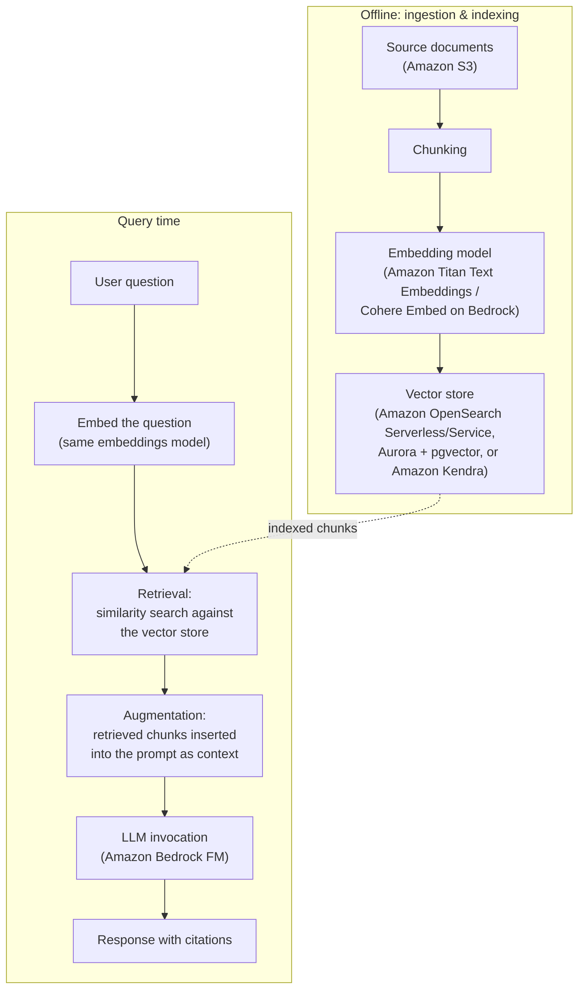

# Domain 3: Applications of Foundation Models

[← Domain 2: Fundamentals of Generative AI](domain-2-fundamentals-of-generative-ai.md) · **Domain 3 of 5** · [Domain 4: Guidelines for Responsible AI →](domain-4-guidelines-for-responsible-ai.md)

## Table of contents

- [1. Design considerations for foundation model applications](#1-design-considerations-for-foundation-model-applications)
- [2. Prompt engineering techniques](#2-prompt-engineering-techniques)
- [3. Retrieval Augmented Generation (RAG) and Amazon Bedrock Knowledge Bases](#3-retrieval-augmented-generation-rag-and-amazon-bedrock-knowledge-bases)
- [4. Fine-tuning vs. continued pre-training vs. RAG vs. prompt engineering](#4-fine-tuning-vs-continued-pre-training-vs-rag-vs-prompt-engineering)
- [5. Amazon Bedrock features](#5-amazon-bedrock-features)
- [6. Vector databases and embeddings for search and retrieval](#6-vector-databases-and-embeddings-for-search-and-retrieval)
- [7. Evaluating foundation model performance](#7-evaluating-foundation-model-performance)
- [8. AWS infrastructure for generative AI workloads](#8-aws-infrastructure-for-generative-ai-workloads)
- [Comparison table: customization approaches for foundation model applications](#comparison-table-customization-approaches-for-foundation-model-applications)
- [Key terms glossary](#key-terms-glossary)
- [Practice questions](#practice-questions)
- [Answer key and explanations](#answer-key-and-explanations)

## Domain overview

Domain 3 is the largest domain on the AWS Certified AI Practitioner
(AIF-C01) exam, making up roughly **28% of scored questions**. Where
[Domain 2](domain-2-fundamentals-of-generative-ai.md) tests whether you understand *what* generative AI and foundation
models (FMs) are, Domain 3 tests whether you can reason about how to
**build a real application on top of one** — how to choose a model for a
scenario, how to make it accurate and grounded in your own data, how to
customize its behavior, how to evaluate whether it's actually working, and
which AWS services and infrastructure you'd reach for at each step.

Concretely, this domain covers: design considerations for FM applications
(model selection, cost, latency, modality, customization options); prompt
engineering; Retrieval Augmented Generation (RAG) and **Amazon Bedrock
Knowledge Bases**; the trade-offs between prompt engineering, RAG,
fine-tuning, and continued pre-training; core **Amazon Bedrock** platform
features (model access, Agents, Guardrails, Knowledge Bases, model
evaluation, provisioned throughput); vector databases and embeddings; how
to evaluate FM performance (human evaluation, benchmark datasets, business
metrics); and the AWS infrastructure that powers generative AI workloads
(Amazon SageMaker, and the purpose-built ML chips AWS Trainium and AWS
Inferentia).

Expect heavily scenario-based questions: "a company needs X — which
customization approach / AWS service / chip fits best?" The exam rewards
knowing not just *what* each option does, but *when* to pick it over a
similar-sounding alternative — RAG vs. fine-tuning, Amazon Kendra vs. a
vector database, Trainium vs. Inferentia, on-demand vs. provisioned
throughput. This guide is organized so each of those decision points gets
its own explanation, a concrete AWS example, and an exam tip flagging the
tricky wording the real exam likes to use.

---

## 1. Design considerations for foundation model applications

Before writing a single prompt, an AIF-C01 candidate is expected to know
the factors that go into **choosing and architecting a foundation model
application**. The exam frames this as a set of design considerations you
weigh against each other, since improving one often costs you on another:

- **Model selection** — no single FM is best for every job. Selection
  criteria include: task fit (summarization vs. code generation vs.
  classification), context window size, supported modalities, accuracy on
  your use case, inference cost, latency, and whether the model can be
  customized (fine-tuned) if needed. On **Amazon Bedrock**, you can
  compare and swap foundation models from multiple providers (Amazon,
  Anthropic, AI21 Labs, Cohere, Meta, Mistral AI, Stability AI) behind a
  single unified API without re-architecting your application.
- **Cost** — generative AI inference is typically billed per input/output
  **token** (on-demand) or as a flat rate for reserved capacity
  (**provisioned throughput**, [Section 5](#5-amazon-bedrock-features)). Larger, more capable models
  cost more per token than smaller models. Cost is also driven by prompt
  length (more context = more input tokens) and how many customization
  steps (fine-tuning, continued pre-training) you invest in up front.
- **Latency** — the time to receive a response. Smaller models generally
  respond faster than larger ones; response **streaming** (returning
  tokens as they're generated) improves *perceived* latency for
  user-facing chat applications even when total generation time is
  unchanged. Latency-sensitive use cases (real-time chat, voice
  assistants) generally favor smaller, faster models or provisioned
  throughput to avoid variable on-demand queueing.
- **Modality** — whether the application needs to handle text, images,
  audio, video, or some combination (**multimodal**). Not every FM
  supports every modality — e.g., Amazon Titan Image Generator and
  Stability AI models on Bedrock handle image generation, while Anthropic
  Claude models on Bedrock support multimodal (text + image) input.
  Choosing a model that doesn't support your required modality is a
  common exam distractor.
- **Customization options** — how much the base model's behavior needs to
  change for your use case: prompt engineering only, Retrieval Augmented
  Generation (RAG) to ground it in your data, fine-tuning to change its
  behavior/style, or continued pre-training to deepen domain knowledge.
  These four options form a **cost/complexity spectrum**, covered in full
  in [Section 4](#4-fine-tuning-vs-continued-pre-training-vs-rag-vs-prompt-engineering).

**AWS example:** A company builds two generative AI features on Amazon
Bedrock: (1) a real-time customer-support chat widget, where they choose a
smaller, low-latency model, enable response streaming, and use prompt
engineering only (cheapest, fastest to ship); and (2) an internal
compliance-document summarizer, where accuracy matters more than latency,
so they choose a larger, more capable model and pair it with **Amazon
Bedrock Knowledge Bases** (RAG) to ground summaries in the actual
compliance corpus rather than the model's general training data.

> **Exam tip:** When a scenario emphasizes "real-time," "responsive," or
> "conversational," think **latency** and favor a smaller model or
> provisioned throughput. When it emphasizes "cost-sensitive" or
> "unpredictable/spiky traffic," favor **on-demand** pricing over
> provisioned throughput. When it names a specific input/output type
> (images, audio), first filter to models that support that **modality**
> before considering cost or latency at all — a cheap model that can't
> process images is never the right answer.

---

## 2. Prompt engineering techniques

**Prompt engineering** is the practice of crafting the input (prompt) to a
foundation model to reliably get the output you want, without changing the
model's underlying weights. It is the cheapest, fastest customization
option and the exam's most detailed topic within "applications."

Key techniques:

- **Zero-shot prompting** — asking the model to perform a task with only
  an instruction and no examples (e.g., "Classify this review as positive
  or negative: ..."). Works well for simpler tasks a large, well-trained
  FM already generalizes to.
- **Few-shot prompting** — including a small number of example
  input/output pairs in the prompt before the actual task, so the model
  infers the desired pattern, format, or tone. Improves reliability on
  tasks with a specific expected output structure.
- **Chain-of-thought (CoT) prompting** — instructing the model to reason
  step-by-step (e.g., "think through this step by step") before giving a
  final answer, which improves accuracy on multi-step reasoning, math, and
  logic tasks.
- **Prompt templates** — reusable prompt structures with placeholders
  (e.g., `{customer_question}`) that standardize how an application
  constructs prompts, ensuring consistent instructions, tone, and format
  across many requests. **Amazon Bedrock Prompt Management** lets teams
  create, version, and share prompt templates.
- **Negative prompting** — explicitly telling the model what to avoid
  (e.g., "do not include pricing information" or, for image generation,
  "no text, no watermark") to steer output away from undesired content.
- **Prompt chaining / prompt flows** — breaking a complex task into a
  sequence of smaller prompts, where the output of one prompt feeds the
  input of the next. **Amazon Bedrock Prompt Flows** provides a visual
  builder for chaining prompts and other steps (like Knowledge Base
  lookups) into a single workflow.
- **System prompts / role prompting** — setting persistent instructions
  (persona, tone, constraints, guardrails on behavior) that apply across
  an entire conversation, separate from the user's individual turns.
- **Prompt injection** — a security risk, not a technique: a malicious
  user embeds instructions in their input designed to override the
  application's intended prompt/system instructions (e.g., "ignore all
  previous instructions"). Mitigations include input validation and
  **Guardrails for Amazon Bedrock** ([Section 5](#5-amazon-bedrock-features)).

**AWS example:** A retail company builds a support-ticket triage tool on
Amazon Bedrock. They use a **few-shot** prompt with five labeled example
tickets to teach the model their exact category taxonomy, add a
**negative prompt** instructing the model never to promise refunds, and
wrap it all in a versioned **prompt template** managed through Bedrock
Prompt Management so every application call uses a consistent, tested
prompt.

> **Exam tip:** Prompt engineering **never changes the model's weights** —
> it's the only customization option in [Section 4](#4-fine-tuning-vs-continued-pre-training-vs-rag-vs-prompt-engineering) that requires no
> training data and no training job, which is why it's always the
> cheapest and fastest to implement. If a scenario needs a multi-step
> reasoning improvement (math, logic) with no extra data or cost, the
> answer is almost always **chain-of-thought prompting**, not fine-tuning.

---

## 3. Retrieval Augmented Generation (RAG) and Amazon Bedrock Knowledge Bases

**Retrieval Augmented Generation (RAG)** is a technique that retrieves
relevant information from an external knowledge source at query time and
inserts it into the prompt, so the FM generates its response grounded in
that retrieved content instead of relying solely on what it learned during
training. RAG directly addresses two core FM limitations: **stale
knowledge** (the model's training data has a cutoff date) and
**hallucination** (the model confidently generating incorrect
information) — by giving the model authoritative source text to draw
from.

The typical RAG pipeline:

1. **Ingestion** — source documents (PDFs, HTML, text files, etc.,
   typically from **Amazon S3**) are loaded.
2. **Chunking** — documents are split into smaller passages so retrieval
   can return focused, relevant sections rather than entire documents.
3. **Embedding** — each chunk is converted into a numeric vector
   (**embedding**) using an embeddings model (e.g., **Amazon Titan Text
   Embeddings**), capturing its semantic meaning.
4. **Indexing/storage** — the embeddings are stored in a **vector
   database** ([Section 6](#6-vector-databases-and-embeddings-for-search-and-retrieval)) for fast similarity search.
5. **Retrieval** — at query time, the user's question is embedded the same
   way, and the vector store returns the most semantically similar chunks.
6. **Augmentation and generation** — the retrieved chunks are inserted into
   the prompt as context, and the FM generates an answer grounded in that
   context.

**Visual summary — RAG system architecture:** the diagram below traces one
query end-to-end, from source documents being indexed offline through to a
cited answer being returned at query time, and marks which AWS service
typically handles each stage:



**Amazon Bedrock Knowledge Bases** is the fully managed AWS implementation
of this entire pipeline: point it at a data source (typically an S3
bucket), and it automatically handles ingestion, chunking, embedding
(using a Bedrock embeddings model you choose), and storage/indexing in a
supported vector store (Amazon OpenSearch Serverless by default, or
Amazon OpenSearch Service, Amazon Aurora with the pgvector extension,
Amazon RDS for PostgreSQL, Redis Enterprise Cloud, MongoDB Atlas, or
Pinecone). Your application calls the `Retrieve` or `RetrieveAndGenerate`
API and Bedrock handles the retrieval-plus-prompting for you.

**AWS example:** A software company wants an internal chatbot that
answers employee questions using the company's constantly updated internal
wiki, without retraining a model every time the wiki changes. They set up
an **Amazon Bedrock Knowledge Base** pointed at an S3 bucket synced from
the wiki, using **Amazon OpenSearch Serverless** as the vector store and
**Amazon Titan Text Embeddings** to generate embeddings. When an employee
asks a question, Bedrock retrieves the most relevant wiki passages and
generates a grounded answer citing them — and when the wiki updates, they
simply re-sync the S3 data source instead of retraining anything.

> **Exam tip:** RAG **does not modify the foundation model's weights** —
> it changes what's in the *prompt*, not the model itself. If a scenario's
> goal is "keep responses current with frequently changing data" or
> "reduce hallucination by grounding answers in our own documents,"
> **RAG / Amazon Bedrock Knowledge Bases** is almost always the answer —
> not fine-tuning, which is comparatively slow/expensive to update and
> doesn't inherently reduce hallucination on facts outside the fine-tuning
> data.

---

## 4. Fine-tuning vs. continued pre-training vs. RAG vs. prompt engineering

The exam expects you to place these four customization approaches on a
single spectrum and pick the right one for a scenario:

- **Prompt engineering** — no training, no extra data beyond what's in the
  prompt. Cheapest and fastest. Limited by the model's context window and
  by what the base model already "knows." Covered in [Section 2](#2-prompt-engineering-techniques).
- **Retrieval Augmented Generation (RAG)** — no training; augments prompts
  with retrieved external data at query time. Best for grounding responses
  in **frequently changing or proprietary knowledge** without retraining.
  Covered in [Section 3](#3-retrieval-augmented-generation-rag-and-amazon-bedrock-knowledge-bases).
- **Fine-tuning** — further trains a copy of a pretrained FM on a
  smaller, **labeled** dataset of your own input/output examples, updating
  the model's weights so it reliably produces a particular style,
  format, tone, or task behavior. Requires more time, cost, and ML
  expertise than prompting or RAG, and updates require re-running the
  fine-tuning job. On Bedrock, **fine-tuning creates a custom model** that
  typically must be accessed via **provisioned throughput** ([Section 5](#5-amazon-bedrock-features)).
- **Continued pre-training (a.k.a. domain adaptation)** — further trains a
  pretrained FM on a large volume of **unlabeled**, domain-specific text
  using the same self-supervised objective as original pretraining (e.g.,
  predicting the next token). It deepens the model's general knowledge and
  vocabulary of a domain (e.g., legal, medical, or a company's internal
  jargon) rather than teaching it a specific labeled task. It's more
  data- and compute-intensive than fine-tuning and doesn't require labeled
  input/output pairs.

**How to decide:**

| Need | Best fit |
|---|---|
| Change tone/format/style reliably for a specific task, have labeled examples | Fine-tuning |
| Deepen the model's understanding of domain-specific language/concepts from large unlabeled text | Continued pre-training |
| Ground answers in current, frequently changing, or proprietary knowledge without retraining | RAG |
| Quick behavior adjustment, no training data, lowest cost/fastest to iterate | Prompt engineering |

**Decision tree:**
```
        START: need to customize a foundation model's behavior?
                              │
                              ▼
        Q1: Can prompt wording alone get an acceptable result,
            with no extra data and the lowest cost/fastest iteration?
              │                                   │
             YES                                  NO
              │                                   │
              ▼                                   ▼
     PROMPT ENGINEERING              Q2: Do answers need to reflect current,
                                         frequently changing, or proprietary
                                         knowledge WITHOUT retraining?
                                           │                    │
                                          YES                   NO
                                           │                    │
                                           ▼                    ▼
                                          RAG          Q3: Do you have LABELED
                                                            input/output examples to
                                                            teach an exact task,
                                                            tone, or format?
                                                              │                │
                                                             YES               NO
                                                              │                │
                                                              ▼                ▼
                                                       FINE-TUNING     CONTINUED PRE-TRAINING
                                                                       (large UNLABELED domain
                                                                        text to deepen vocabulary)
```

These are not mutually exclusive — a production application commonly
combines several, e.g., prompt engineering **and** RAG together, or a
fine-tuned model accessed **through** a RAG pipeline.

**AWS example:** A legal-tech company builds a contract-analysis
assistant. They start with **prompt engineering** (fastest to prototype).
They add **Amazon Bedrock Knowledge Bases (RAG)** so the assistant can
cite the specific contract clauses it's answering about. Because outputs
must always follow a strict, firm-specific summary format, they then
**fine-tune** a Bedrock model on hundreds of labeled example
summaries in that exact format. Separately, because the firm's contracts
are dense with specialized legal terminology poorly represented in general
web text, they also evaluate **continued pre-training** on a large corpus
of unlabeled legal documents to improve the base model's grasp of legal
language before fine-tuning on top of it.

> **Exam tip:** The single most common trap: a scenario says "the company
> wants the model to always have access to the latest product catalog" —
> this is **RAG**, not fine-tuning, because fine-tuning bakes knowledge
> into static weights that go stale. Conversely, "the company wants every
> response to follow an exact required format/tone, and has example
> data" is **fine-tuning**. Remember **fine-tuning needs labeled
> input/output pairs; continued pre-training needs only unlabeled
> domain text** — that labeled-vs-unlabeled distinction is exactly what
> the exam tests between these two.

---

## 5. Amazon Bedrock features

**Amazon Bedrock** is AWS's fully managed service for building generative
AI applications on top of foundation models, without managing any
infrastructure. Its core features, each tested individually on the exam:

- **Model access** — Bedrock provides a single, unified API to access FMs
  from multiple third-party and Amazon providers. Before use, an AWS
  account must explicitly **request model access** in the Bedrock console
  for each model. This lets applications swap FMs with minimal code
  changes.
- **Amazon Bedrock Agents** — orchestrates multi-step tasks by letting an
  FM reason about a user's request, break it into steps, and invoke
  external **action groups** (API calls, backed by AWS Lambda functions)
  and Knowledge Bases to complete the task — for example, checking order
  status via a company API and then answering a follow-up question from a
  Knowledge Base, all within one conversational session. Agents follow a
  reasoning-and-acting loop (plan → invoke a tool → observe the result →
  continue) to complete multi-step goals autonomously.
- **Guardrails for Amazon Bedrock** — a configurable safety layer applied
  to model inputs/outputs: denied topics, content filters, word filters,
  sensitive information (PII) filters, and contextual grounding checks
  (covered in depth in the [Domain 4](domain-4-guidelines-for-responsible-ai.md) study guide, since it's primarily a
  responsible-AI control — but the exam also tests it here as a Bedrock
  platform feature you attach to any model or Agent).
- **Amazon Bedrock Knowledge Bases** — the managed RAG feature described
  in [Section 3](#3-retrieval-augmented-generation-rag-and-amazon-bedrock-knowledge-bases): automatic ingestion, chunking, embedding, and retrieval
  over your own data.
- **Model evaluation** — Bedrock lets you run **evaluation jobs** to
  compare FMs or assess a specific model's quality before choosing it for
  production, in two modes:
  - **Automatic evaluation** — uses built-in metrics (e.g., accuracy,
    robustness, toxicity) computed against built-in or your own
    prompt datasets — fast, low-cost, and objective, but limited to
    metrics that can be computed programmatically.
  - **Human evaluation** — a human work team (your own employees, or an
    AWS-managed team) reviews and scores model outputs on subjective
    criteria (e.g., relevance, style, friendliness) that automatic metrics
    can't capture.
- **Provisioned throughput** — lets you purchase dedicated inference
  capacity (measured in **model units**) for a model, for a 1-month or
  6-month commitment, guaranteeing consistent throughput and latency
  regardless of other customers' demand. It's the pricing/capacity mode
  required to use **custom (fine-tuned or continued-pre-trained)
  models** in most cases, and it's generally cost-effective only for
  **high, consistent, predictable** request volumes — as opposed to
  **on-demand** pricing (pay per token, no commitment), which fits
  variable or unpredictable traffic.

**AWS example:** An airline builds a Bedrock Agent that lets customers
change flight bookings conversationally: the Agent calls the airline's
booking API (via an action group backed by Lambda) to look up a
reservation, consults a **Knowledge Base** for baggage-policy questions,
and has **Guardrails** attached to block requests unrelated to travel.
Before launch, the team runs a Bedrock **automatic model evaluation** job
to compare candidate models on accuracy and toxicity, then a **human
evaluation** job to judge tone quality. At launch, because traffic volume
is high and predictable (peak booking season), they purchase **provisioned
throughput** instead of paying on-demand rates.

> **Exam tip:** Match the keyword to the feature: "the assistant needs to
> take actions / call APIs / complete multi-step tasks" → **Agents**;
> "block harmful or off-topic content" → **Guardrails**; "answer from our
> own documents" → **Knowledge Bases**; "compare model quality
> objectively/at scale" → **automatic evaluation**; "judge subjective
> quality like tone" → **human evaluation**; "guarantee consistent
> throughput for a custom/fine-tuned model at high, steady volume" →
> **provisioned throughput**; "unpredictable/low/spiky volume, pay only
> for what's used" → **on-demand**.

---

## 6. Vector databases and embeddings for search and retrieval

**Embeddings** are numeric vector representations of text (or images,
audio) that capture semantic meaning — pieces of content with similar
meaning end up as vectors that are close together in the vector space,
even if they don't share exact words. Embeddings models (e.g., **Amazon
Titan Text Embeddings**, Cohere Embed on Bedrock) convert raw content into
these vectors.

A **vector database** stores embeddings and efficiently performs
**similarity search** (commonly k-nearest-neighbor / k-NN search using
cosine similarity or Euclidean distance) to find the stored vectors
closest to a query vector — the mechanism that powers **semantic search**
(finding conceptually related content, not just exact keyword matches)
and is the retrieval half of RAG. AWS options tested on the exam:

- **Amazon OpenSearch Service** (and its serverless option, **Amazon
  OpenSearch Serverless**) — a search and analytics service with a
  built-in **vector engine**, supporting k-NN vector search alongside
  traditional keyword/full-text search. A common choice as the vector
  store behind Bedrock Knowledge Bases, and useful when you need both
  vector *and* keyword (hybrid) search.
- **Amazon Aurora (PostgreSQL-compatible) with the pgvector extension** —
  lets you store vector embeddings as a column type directly inside a
  relational **Amazon Aurora** or **Amazon RDS for PostgreSQL** database
  and query them with SQL, using the open-source `pgvector` extension.
  A good fit when a team already runs PostgreSQL and wants vector search
  without adopting a separate, dedicated search service.
- **Amazon Kendra** — an intelligent, ML-powered **enterprise search**
  service, not a general-purpose vector database. Kendra indexes
  documents from many connectors (S3, SharePoint, Salesforce, etc.) and
  handles embedding, ranking, and relevance internally — you don't manage
  embeddings or a vector index yourself. It's the right choice for
  "add natural-language enterprise search over our existing document
  repositories" without building a custom RAG/embeddings pipeline;
  Bedrock Knowledge Bases can also use an existing **Amazon Kendra
  GenAI Index** as a retriever.

**AWS example:** A healthcare software vendor builds a clinical-reference
chatbot. They generate embeddings for medical documents using **Amazon
Titan Text Embeddings** and store them in **Amazon OpenSearch Service**
for low-latency semantic + keyword hybrid search inside a Bedrock
Knowledge Base. A separate internal team, wanting quick natural-language
search across existing SharePoint and S3 document repositories without
building an embeddings pipeline at all, instead deploys **Amazon Kendra**
and points it at those repositories directly.

> **Exam tip:** If a scenario describes managing your own embeddings model
> and choosing a similarity-search index, that's a **vector database**
> (OpenSearch Service, or Aurora/RDS PostgreSQL with **pgvector**). If a
> scenario just wants "search across our existing enterprise documents in
> natural language" with minimal setup and no mention of managing
> embeddings, that's **Amazon Kendra** — a fully managed enterprise search
> service, not a database you architect yourself.

---

## 7. Evaluating foundation model performance

Choosing and shipping a foundation model requires evaluating it, and the
exam expects you to know three complementary evaluation approaches:

- **Human evaluation** — people (either your own subject-matter experts
  or an AWS-managed work team via Bedrock's human evaluation jobs) review
  model outputs and score them against criteria that are hard to automate:
  tone, creativity, helpfulness, cultural appropriateness, or nuanced
  correctness. Slower and more expensive than automatic evaluation, but
  necessary for subjective quality judgments.
- **Benchmark datasets** — standardized, often publicly available datasets
  paired with automatically computable metrics (e.g., accuracy, F1 score,
  BLEU/ROUGE for text similarity) used to score a model objectively and
  reproducibly, and to compare models against each other on a level
  playing field. **Amazon Bedrock automatic model evaluation** runs jobs
  against built-in curated prompt datasets and metrics, or your own
  custom prompt dataset.
- **Business metrics** — ultimately, an FM application must be judged by
  whether it moves outcomes the organization cares about: task completion
  rate, average handling time, customer satisfaction (CSAT) score,
  conversion rate, cost per interaction, or reduction in human escalation
  rate. A model can score well on benchmark metrics yet fail to improve
  the business metric it was built for (or vice versa) — the exam expects
  you to recognize business metrics as the final, outcome-oriented layer
  of evaluation, distinct from (but informed by) model-quality metrics.

**AWS example:** A telecom company evaluates two candidate Bedrock models
for a customer-service assistant. They first run an **automatic model
evaluation** job using a benchmark dataset to compare accuracy and
robustness objectively. The top two candidates then go through a **human
evaluation** job where support agents score sample conversations for tone
and helpfulness. After launch, the company tracks the **business
metric** of average call-deflection rate (how many issues the assistant
resolves without escalation to a human agent) to judge real-world impact —
which is ultimately what determines whether the project is considered
successful, regardless of how well the model scored on benchmarks.

> **Exam tip:** Keep the three layers distinct: **benchmark datasets**
> measure model quality **objectively and automatically**; **human
> evaluation** measures quality **subjectively**, using people;
> **business metrics** measure real-world **outcome impact**, and are the
> only one of the three tied directly to organizational goals rather than
> model output quality itself. A question about "comparing multiple
> models quickly and cheaply at scale" points to benchmark-based automatic
> evaluation; a question about "judging tone or creativity" points to
> human evaluation; a question about "did this actually help the
> business" points to a business metric.

---

## 8. AWS infrastructure for generative AI workloads

Behind Bedrock's managed experience, and for teams building or training
custom models directly, AWS provides infrastructure purpose-built for
generative AI and deep learning workloads:

- **Amazon SageMaker** — AWS's fully managed service for building,
  training, and deploying machine learning models, including foundation
  models. **SageMaker JumpStart** provides a hub of pretrained foundation
  models and pre-built solution templates that can be deployed or
  fine-tuned with a few clicks, for teams that need more control over
  model hosting/customization than Bedrock's fully managed API offers
  (e.g., deploying to a specific instance type, or a model not available
  on Bedrock).
- **AWS Trainium** — a purpose-built AWS silicon (ML chip) optimized for
  **high-performance, cost-efficient training** of deep learning and
  foundation models at scale. Available via Amazon EC2 **Trn1/Trn2**
  instances.
- **AWS Inferentia** — a purpose-built AWS silicon (ML chip) optimized for
  **high-throughput, low-latency, cost-efficient inference**. Available
  via Amazon EC2 **Inf1/Inf2** instances.
- Both chip families are programmed via the **AWS Neuron SDK**, and both
  exist specifically to reduce the cost of large-scale deep learning
  compared to general-purpose GPU instances, while remaining compatible
  with common ML frameworks (PyTorch, TensorFlow).

**AWS example:** An AI startup pretrains a custom foundation model from
scratch on **Amazon EC2 Trn1** instances powered by **AWS Trainium** to
minimize training cost at scale. Once trained, they deploy the model for
production inference on **Amazon EC2 Inf2** instances powered by **AWS
Inferentia2**, achieving low per-request latency and lower cost per
inference than equivalent GPU instances. For experimentation and
fine-tuning of openly available foundation models without managing this
infrastructure directly, a different team at the same company uses
**Amazon SageMaker JumpStart**.

> **Exam tip:** Memorize the mapping precisely, since the exam frequently
> tests it directly: **AWS Trainium → training**, **AWS Inferentia →
> inference**. Both are purpose-built chips (not general-purpose GPUs)
> whose primary selling point is **lower cost at high scale** for deep
> learning workloads specifically — pick Trainium/Inferentia over generic
> EC2 GPU instances when a scenario emphasizes minimizing the cost of
> training or serving large models at scale.

---

## Comparison table: customization approaches for foundation model applications

| Approach | Changes model weights? | Data required | Relative cost/speed | Best for |
|---|---|---|---|---|
| **Prompt engineering** | No | None beyond the prompt itself | Lowest cost, fastest to iterate | Quick behavior/format adjustments; no training data available |
| **RAG (Amazon Bedrock Knowledge Bases)** | No | External knowledge source (documents), no labeling needed | Low cost, fast to set up; retrieval adds some runtime latency | Grounding answers in current, frequently changing, or proprietary data; reducing hallucination |
| **Fine-tuning** | Yes | Labeled input/output example pairs | Higher cost, slower (requires a training job) | Reliable task-specific style/format/behavior; often needs provisioned throughput to serve |
| **Continued pre-training** | Yes | Large volume of unlabeled domain-specific text | Highest cost, slowest, most compute-intensive | Deepening a model's general knowledge/vocabulary of a specialized domain |

> **Exam tip:** This table is the domain's most-tested decision. As
> complexity/cost increases left to right, so does how deeply the model
> itself is changed: prompt engineering and RAG never touch the model's
> weights (the model is used "as-is," just given different input); fine-
> tuning and continued pre-training both retrain the model and typically
> require the resulting custom model to be served via **provisioned
> throughput** on Bedrock.

---

## Key terms glossary

> Looking for a term from another domain? [`docs/master-glossary.md`](master-glossary.md) indexes every domain's key terms alphabetically with domain tags (e.g. `[D1, D3]`) and links back here.

- **Foundation model (FM) application design** — the process of choosing
  a model and architecture based on task fit, cost, latency, modality, and
  customization needs.
- **Modality** — the type(s) of input/output a model handles (text,
  image, audio, video); **multimodal** models handle more than one.
- **Prompt engineering** — crafting model input to reliably produce a
  desired output, without changing model weights.
- **Zero-shot prompting** — asking a model to perform a task with no
  example demonstrations.
- **Few-shot prompting** — including example input/output pairs in a
  prompt to guide the model's output pattern.
- **Chain-of-thought (CoT) prompting** — instructing a model to reason
  step-by-step before answering, improving multi-step reasoning accuracy.
- **Negative prompting** — explicitly instructing a model what to avoid
  producing.
- **Prompt template** — a reusable prompt structure with placeholders for
  consistent, repeatable prompt construction.
- **Prompt chaining** — breaking a task into a sequence of prompts where
  each output feeds the next input.
- **Prompt injection** — a malicious attempt to override an application's
  intended prompt/system instructions via user input.
- **Retrieval Augmented Generation (RAG)** — retrieving relevant external
  data at query time and inserting it into the prompt to ground a model's
  response, without retraining.
- **Amazon Bedrock Knowledge Bases** — Bedrock's fully managed RAG
  feature: automatic ingestion, chunking, embedding, and retrieval over
  your own data source.
- **Chunking** — splitting documents into smaller passages before
  embedding, so retrieval returns focused, relevant content.
- **Embedding** — a numeric vector representation of text (or other
  content) capturing its semantic meaning.
- **Amazon Titan Text Embeddings** — an Amazon Bedrock embeddings model
  used to generate vector embeddings from text.
- **Vector database** — a data store optimized for similarity search over
  embeddings (e.g., k-NN search).
- **Semantic search** — search based on meaning/similarity rather than
  exact keyword matching, powered by embeddings and vector search.
- **Amazon OpenSearch Service / Serverless** — an AWS search and analytics
  service with a built-in vector engine, supporting hybrid vector +
  keyword search.
- **pgvector** — an open-source PostgreSQL extension for storing and
  querying vector embeddings in Amazon Aurora or Amazon RDS for
  PostgreSQL.
- **Amazon Kendra** — a fully managed, ML-powered enterprise search
  service that handles embeddings and relevance internally.
- **Fine-tuning** — further training a pretrained FM on a smaller labeled
  dataset to change its weights for a specific task, style, or format.
- **Continued pre-training (domain adaptation)** — further training a
  pretrained FM on large volumes of unlabeled domain-specific text using
  the original pretraining objective.
- **Amazon Bedrock model access** — the requirement to explicitly request
  access to a specific foundation model in the Bedrock console before use.
- **Amazon Bedrock Agents** — a Bedrock feature that lets an FM plan and
  execute multi-step tasks by invoking external APIs (action groups) and
  Knowledge Bases.
- **Action group (Bedrock Agents)** — a defined set of APIs (typically
  backed by AWS Lambda) that a Bedrock Agent can invoke to take actions.
- **Guardrails for Amazon Bedrock** — configurable safety filters applied
  to FM inputs/outputs (denied topics, content filters, PII redaction,
  contextual grounding checks).
- **Bedrock model evaluation** — Bedrock jobs that assess FM quality via
  automatic (benchmark-based) or human evaluation.
- **Automatic model evaluation** — evaluation using built-in or custom
  metrics computed programmatically against a prompt dataset.
- **Human evaluation (model evaluation)** — evaluation where people score
  model outputs on subjective criteria.
- **Benchmark dataset** — a standardized dataset (often public) used to
  objectively and reproducibly score and compare model quality.
- **Business metric** — an outcome-oriented measure (e.g., conversion
  rate, CSAT, cost per interaction) used to judge an application's
  real-world impact, distinct from model-quality metrics.
- **Provisioned throughput** — dedicated, reserved inference capacity
  (model units) purchased for a commitment period, guaranteeing
  consistent throughput/latency; typically required to serve custom
  (fine-tuned) models.
- **On-demand (Bedrock pricing)** — pay-per-token inference pricing with
  no capacity commitment, suited to variable/unpredictable traffic.
- **Amazon SageMaker** — AWS's fully managed service for building,
  training, and deploying ML models.
- **Amazon SageMaker JumpStart** — a hub of pretrained foundation models
  and solution templates deployable/fine-tunable within SageMaker.
- **AWS Trainium** — AWS's purpose-built ML chip optimized for
  cost-efficient, high-performance model training (EC2 Trn1/Trn2).
- **AWS Inferentia** — AWS's purpose-built ML chip optimized for
  cost-efficient, high-throughput, low-latency inference (EC2 Inf1/Inf2).
- **AWS Neuron SDK** — the software development kit used to run ML
  workloads on Trainium and Inferentia chips.

---

## Practice questions

1. **[Intermediate]** A company wants its generative AI assistant to always answer using the
   most current version of its product catalog, which changes daily, and
   cannot afford to retrain a model every day. Which approach best fits
   this requirement?
   A. Fine-tuning
   B. Continued pre-training
   C. Retrieval Augmented Generation (RAG) with Amazon Bedrock Knowledge Bases
   D. Increasing the model's temperature parameter

2. **[Beginner]** Which factor should a team prioritize first when a use case requires
   the model to generate both text and images from a single prompt?
   A. Cost per token
   B. Modality support
   C. Provisioned throughput commitment length
   D. Chain-of-thought prompting

3. **[Intermediate]** A developer wants a foundation model to reliably output responses in a
   very specific JSON schema by showing it several example input/output
   pairs directly inside the prompt, without any training job. Which
   prompt engineering technique is this?
   A. Zero-shot prompting
   B. Few-shot prompting
   C. Continued pre-training
   D. Fine-tuning

4. **[Intermediate]** A model is prone to giving a final answer to multi-step math word
   problems without correctly working through the intermediate steps.
   Which prompting technique would most directly help, at no additional
   training cost?
   A. Negative prompting
   B. Chain-of-thought prompting
   C. Provisioned throughput
   D. Continued pre-training

5. **[Beginner]** Which of the following best describes the purpose of Amazon Bedrock
   Knowledge Bases?
   A. It fine-tunes a foundation model's weights on labeled data
   B. It automatically manages ingestion, chunking, embedding, and retrieval of your own data to ground FM responses
   C. It provides dedicated, reserved inference capacity for a model
   D. It filters harmful content from model outputs

6. **[Advanced]** A company wants a foundation model to deeply understand highly
   specialized medical terminology found throughout a large volume of
   unlabeled clinical text, improving its general fluency in that domain
   rather than teaching it one specific task. Which customization approach
   fits best?
   A. Prompt engineering
   B. RAG
   C. Continued pre-training
   D. Provisioned throughput

7. **[Advanced]** Which statement correctly distinguishes fine-tuning from continued
   pre-training?
   A. Fine-tuning requires unlabeled data; continued pre-training requires labeled data
   B. Fine-tuning uses labeled input/output examples to adapt a model to a specific task; continued pre-training uses large volumes of unlabeled domain text to deepen general domain knowledge
   C. They are the same process with different names
   D. Neither approach changes the model's weights

8. **[Intermediate]** A company wants a Bedrock-based assistant to look up a customer's order
   status by calling an internal REST API and then answer a follow-up
   question using internal documentation, all within one conversation.
   Which Amazon Bedrock feature is designed for this?
   A. Guardrails for Amazon Bedrock
   B. Amazon Bedrock Agents
   C. Provisioned throughput
   D. Amazon Bedrock model evaluation

9. **[Beginner]** Before an AWS account can invoke a specific foundation model on Amazon
   Bedrock, what must first be done?
   A. Purchase provisioned throughput for that model
   B. Request and be granted model access for that model in the Bedrock console
   C. Fine-tune the model on custom data
   D. Deploy the model to Amazon SageMaker JumpStart

10. **[Intermediate]** A company expects high, steady, predictable request volume for a
    custom fine-tuned model in production and wants guaranteed, consistent
    throughput. Which Bedrock capacity option should they choose?
    A. On-demand pricing
    B. Provisioned throughput
    C. Automatic model evaluation
    D. Continued pre-training

11. **[Beginner]** A team needs to compare several candidate foundation models on
    accuracy and robustness quickly, cheaply, and objectively before
    narrowing down to finalists. Which approach fits best?
    A. Human evaluation
    B. Automatic model evaluation using benchmark datasets
    C. Business metric tracking
    D. Provisioned throughput

12. **[Intermediate]** After launch, which of the following is a business metric (as
    distinct from a model-quality metric) for a generative AI customer
    support assistant?
    A. BLEU score against a benchmark dataset
    B. Toxicity score from an automatic evaluation job
    C. Customer satisfaction (CSAT) score and call-deflection rate
    D. F1 score on a labeled test set

13. **[Beginner]** Which AWS service should a team use to generate vector embeddings from
    text for use in a semantic search application?
    A. AWS Trainium
    B. Amazon Titan Text Embeddings
    C. AWS Inferentia
    D. Amazon SageMaker JumpStart

14. **[Intermediate]** A team already runs its application data in Amazon Aurora PostgreSQL
    and wants to add vector similarity search without adopting a separate
    dedicated search service. Which option fits best?
    A. Amazon Kendra
    B. Amazon Aurora with the pgvector extension
    C. AWS Trainium
    D. Amazon Bedrock Agents

15. **[Beginner]** A team wants to add natural-language search across its existing
    SharePoint and Amazon S3 document repositories, without building or
    managing an embeddings pipeline themselves. Which AWS service is the
    best fit?
    A. Amazon Kendra
    B. AWS Inferentia
    C. Amazon Aurora with pgvector
    D. AWS Trainium

16. **[Beginner]** Which purpose-built AWS chip is optimized specifically for
    cost-efficient, high-performance training of deep learning and
    foundation models at scale?
    A. AWS Inferentia
    B. AWS Trainium
    C. AWS Graviton
    D. AWS Nitro

17. **[Intermediate]** A company has already trained a large custom model and now needs to
    serve it for production inference with low latency and low
    cost-per-request at high volume. Which AWS infrastructure choice
    is purpose-built for this?
    A. Amazon EC2 instances powered by AWS Trainium
    B. Amazon EC2 instances powered by AWS Inferentia
    C. AWS Neuron SDK alone, without any EC2 instance
    D. Amazon Bedrock Knowledge Bases

18. **[Intermediate]** A company wants to quickly deploy and optionally fine-tune a
    pretrained foundation model with more direct control over hosting than
    Amazon Bedrock's fully managed API provides. Which AWS capability best
    fits this need?
    A. Amazon Bedrock Guardrails
    B. Amazon SageMaker JumpStart
    C. Amazon Kendra
    D. Amazon Bedrock model evaluation

19. **[Advanced]** Which combination of factors is part of "design considerations for
    foundation model applications" as tested on the AIF-C01 exam? (Select
    TWO.)
    A. The modality (text, image, audio) the application must support
    B. The latency requirements of the use case
    C. The specific AWS Region's time zone offset
    D. The font used to render the application's UI
    E. The color palette of the company's marketing website

20. **[Advanced]** A retail company wants a generative AI assistant to consistently
    output product descriptions in the company's exact required tone and
    format, and has hundreds of labeled example descriptions already
    written by their copywriting team. Which customization approach is the
    best fit?
    A. Prompt engineering only
    B. RAG only
    C. Fine-tuning
    D. Increasing the context window

---

## Answer key and explanations

1. **C — Retrieval Augmented Generation (RAG) with Amazon Bedrock
   Knowledge Bases.** RAG retrieves current external data at query time
   without retraining, exactly fitting a daily-changing catalog.
   Fine-tuning (A) and continued pre-training (B) bake knowledge into
   static weights and would require retraining daily; changing temperature
   (D) affects randomness of output, not knowledge freshness.

2. **B — Modality support.** If a model can't process/generate the
   required input/output types, no amount of cost or prompting technique
   makes it viable, so modality must be filtered on first. Cost (A) and
   provisioned throughput (C) are capacity/pricing decisions made after
   narrowing to modality-capable models; chain-of-thought prompting (D)
   is a reasoning technique, unrelated to modality support.

3. **B — Few-shot prompting.** Providing example input/output pairs
   directly in the prompt to shape output format is the definition of
   few-shot prompting. Zero-shot (A) provides no examples; continued
   pre-training (C) and fine-tuning (D) both require a training job and
   change model weights, which the scenario explicitly rules out.

4. **B — Chain-of-thought prompting.** Instructing the model to reason
   step-by-step directly improves multi-step reasoning accuracy at no
   training cost. Negative prompting (A) tells the model what to avoid,
   not how to reason; provisioned throughput (C) is a capacity/pricing
   feature; continued pre-training (D) requires a costly training job the
   scenario doesn't call for.

5. **B — It automatically manages ingestion, chunking, embedding, and
   retrieval of your own data to ground FM responses.** This is Knowledge
   Bases' defining purpose (managed RAG). Fine-tuning weights (A) is a
   separate Bedrock customization feature; reserved capacity (C) describes
   provisioned throughput; content filtering (D) describes Guardrails.

6. **C — Continued pre-training.** Deepening general domain
   understanding from a large volume of unlabeled text, rather than
   teaching one specific task, is exactly what continued pre-training
   does. Prompt engineering (A) doesn't change the model's underlying
   knowledge; RAG (B) retrieves facts at query time rather than deepening
   the model's fluency; provisioned throughput (D) is a capacity feature
   unrelated to customization.

7. **B — Fine-tuning uses labeled input/output examples to adapt a model
   to a specific task; continued pre-training uses large volumes of
   unlabeled domain text to deepen general domain knowledge.** This is the
   precise labeled-vs-unlabeled, task-vs-domain distinction the exam
   tests. A reverses the data requirements; C is false, they are distinct
   processes; D is false, both approaches update model weights.

8. **B — Amazon Bedrock Agents.** Agents are purpose-built to plan and
   execute multi-step tasks, including invoking external APIs (action
   groups) and consulting Knowledge Bases within one interaction.
   Guardrails (A) filters content, it doesn't call APIs or orchestrate
   steps; provisioned throughput (C) is a capacity feature; model
   evaluation (D) assesses model quality, it isn't a runtime orchestration
   feature.

9. **B — Request and be granted model access for that model in the
   Bedrock console.** Bedrock requires explicit model access approval per
   model before it can be invoked. Provisioned throughput (A) is an
   optional capacity purchase, not a prerequisite for basic access;
   fine-tuning (C) is an optional customization step; SageMaker JumpStart
   (D) is a separate deployment path, not required for Bedrock access.

10. **B — Provisioned throughput.** High, steady, predictable volume for a
    custom model is exactly the scenario provisioned throughput is
    designed and cost-effective for, and it's typically required to serve
    fine-tuned custom models. On-demand (A) suits variable/unpredictable
    traffic, not steady high volume; automatic model evaluation (C) and
    continued pre-training (D) are unrelated to serving capacity.

11. **B — Automatic model evaluation using benchmark datasets.** Automatic
    evaluation against benchmark datasets is fast, low-cost, and
    objective — ideal for quickly comparing many candidates. Human
    evaluation (A) is slower and more expensive, better suited to
    subjective criteria; business metrics (C) are measured post-launch on
    real usage, not during model comparison; provisioned throughput (D) is
    a capacity feature, not an evaluation method.

12. **C — Customer satisfaction (CSAT) score and call-deflection rate.**
    These are outcome-oriented business metrics reflecting real-world
    impact. BLEU score (A), toxicity score (B), and F1 score (D) are all
    model-quality metrics computed against datasets, not business outcome
    measures.

13. **B — Amazon Titan Text Embeddings.** This is a Bedrock embeddings
    model purpose-built to convert text into vector embeddings for
    semantic search. AWS Trainium (A) and AWS Inferentia (C) are compute
    chips for training/inference generally, not an embeddings model
    themselves; SageMaker JumpStart (D) is a model hub/deployment tool,
    not an embeddings generator itself.

14. **B — Amazon Aurora with the pgvector extension.** This lets the team
    add vector similarity search directly inside the PostgreSQL database
    they already operate, via SQL, without adopting a new dedicated
    service. Amazon Kendra (A) is a separate managed search service, not
    integrated into their existing database; AWS Trainium (C) is a
    training chip, unrelated to vector search; Bedrock Agents (D)
    orchestrates tasks, it isn't a vector store.

15. **A — Amazon Kendra.** Kendra is a fully managed enterprise search
    service that indexes connectors like SharePoint and S3 and handles
    embeddings/relevance internally, requiring no custom embeddings
    pipeline. AWS Inferentia (B) and AWS Trainium (D) are ML chips, not
    search services; Aurora with pgvector (C) still requires the team to
    generate and manage embeddings themselves, which the scenario wants
    to avoid.

16. **B — AWS Trainium.** Trainium is AWS's purpose-built chip optimized
    specifically for cost-efficient, high-performance training at scale.
    AWS Inferentia (A) is optimized for inference, not training; AWS
    Graviton (C) is a general-purpose AWS CPU, not ML-training-specific;
    AWS Nitro (D) is the underlying EC2 virtualization/security system,
    not an ML training chip.

17. **B — Amazon EC2 instances powered by AWS Inferentia.** Inferentia is
    purpose-built for high-throughput, low-latency, cost-efficient
    inference at scale, matching the described serving need. Trainium (A)
    is optimized for training, not inference; the Neuron SDK alone (C)
    is software, not compute infrastructure — it still requires
    Trainium/Inferentia-backed EC2 instances to run on; Bedrock Knowledge
    Bases (D) is a RAG feature, unrelated to chip-level inference
    infrastructure.

18. **B — Amazon SageMaker JumpStart.** JumpStart provides pretrained
    foundation models and templates deployable and fine-tunable with more
    direct control over hosting than Bedrock's fully managed API.
    Guardrails (A) is a safety filter feature within Bedrock; Amazon
    Kendra (C) is an enterprise search service, unrelated to model
    hosting; Bedrock model evaluation (D) assesses model quality, it
    doesn't deploy or host models.

19. **A and B — The modality the application must support, and the
    latency requirements of the use case.** Both are core, exam-defined
    design considerations for FM applications (alongside model selection
    and cost). Region time zone offset (C), UI font (D), and marketing
    website color palette (E) are unrelated to foundation model
    application design.

20. **C — Fine-tuning.** Having hundreds of labeled example
    input/output pairs and needing consistently reproduced tone/format is
    exactly the scenario fine-tuning is designed for. Prompt engineering
    alone (A) is less reliable at scale for a strict required format
    without weight updates; RAG alone (B) grounds facts in external data
    but doesn't teach a consistent output style; increasing the context
    window (D) allows more input text, but doesn't itself teach the model
    a specific tone or format.

---

[← Domain 2: Fundamentals of Generative AI](domain-2-fundamentals-of-generative-ai.md) · **Domain 3 of 5** · [Domain 4: Guidelines for Responsible AI →](domain-4-guidelines-for-responsible-ai.md)
