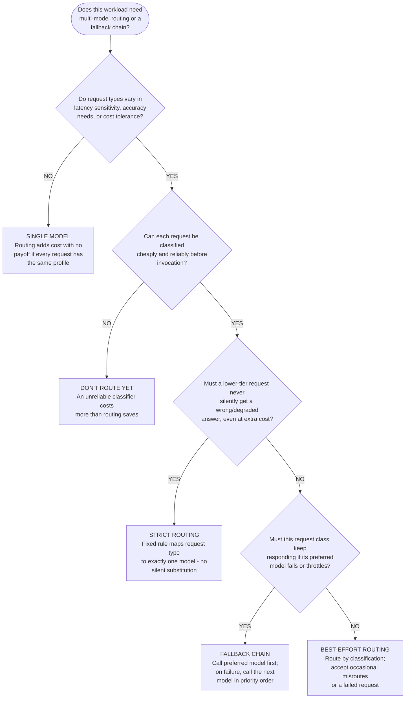
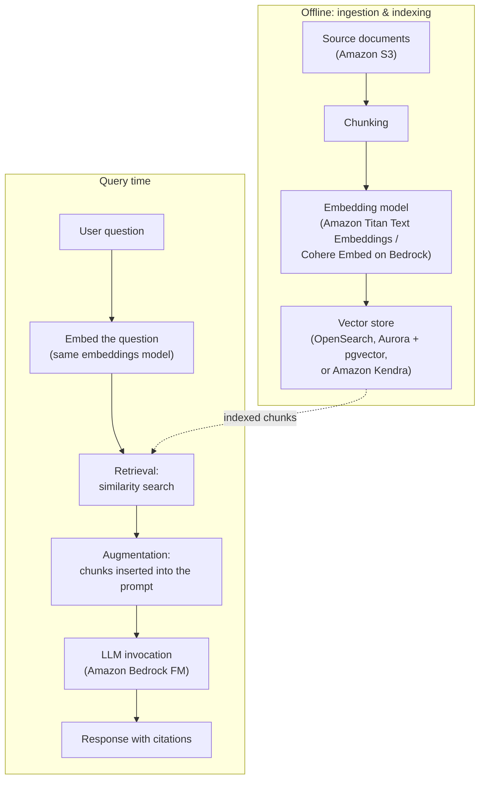
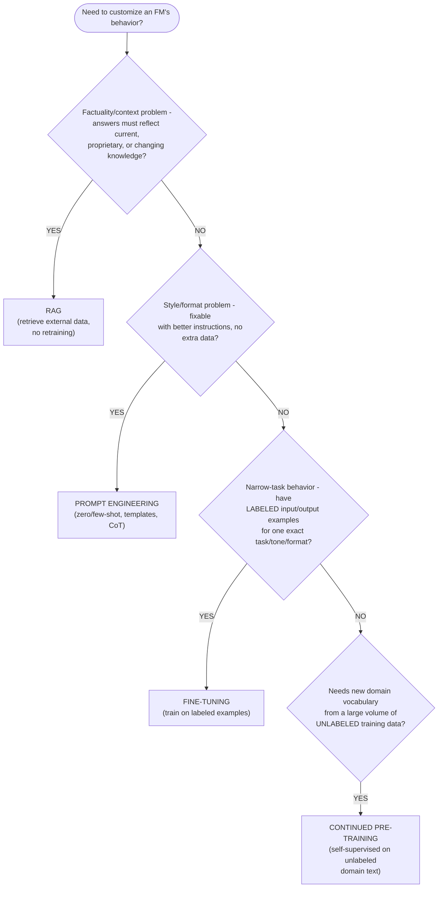
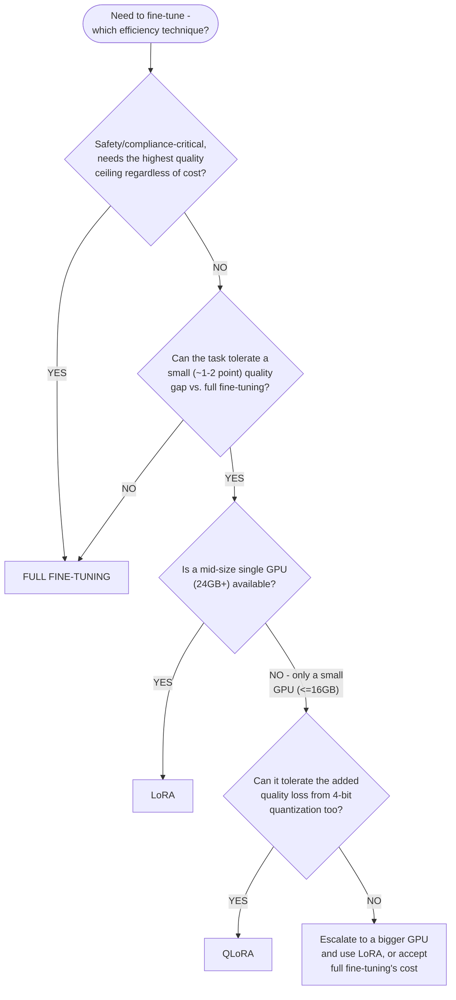

# Domain 3 Fast Track, Part 1: FM Application Design & Customization Methods

**Condensed guide, part 1 of 3** · full guide: [`docs/domain-3-applications-of-foundation-models.md`](../domain-3-applications-of-foundation-models.md) (6,957 lines) · **Last verified:** 2026-09-05

## How to use this part

Domain 3 (Applications of Foundation Models) is too long — 6,957 lines
across 25 Mermaid diagrams and dozens of worked examples — for one
condensed guide, so its Fast Track is split into three parts. **This
part** covers **Sections 1-4**: the design considerations behind picking
and routing foundation models, prompt engineering, Retrieval Augmented
Generation (RAG) fundamentals, and all six customization methods a
scenario can ask you to choose between — prompt engineering, RAG,
fine-tuning, LoRA/QLoRA, RLHF, and continued pre-training. **[Part
2](part-2-inference-and-multimodal.md)** covers Sections 5-7 (Bedrock
inference architecture, Guardrails and prompt-injection prevention,
vector databases/embeddings, multi-modal application patterns, and
evaluation); **[Part 3](part-3-deployment-and-troubleshooting.md)** covers
Section 8 onward (production deployment and troubleshooting).

It keeps **every testable decision point** from its scope — every design
consideration, every routing/fallback rule, all eight prompt-engineering
techniques, the full RAG pipeline, the customization decision tree, every
fine-tuning efficiency technique's GPU/quality trade-off, all three RLHF
stages, and the dataset-curation size thresholds and quality checklist —
as compact tables and decision trees instead of full worked-example
narration. Every section links back to the corresponding section of the
full guide for the complete scenario, worked examples, and mini-quizzes.

Domain 3 makes up roughly **28% of scored questions** — the exam's
heaviest-weighted domain. Read this fast track the day before the exam,
or any time you already know the material and just need the tables
refreshed; read the [full guide](../domain-3-applications-of-foundation-models.md)
first if any of these terms are new to you.

**Where each section comes from**, for jumping straight to the full
prose, worked examples, and mini-quizzes behind any condensed table
below:

| This fast track | Full guide section | Approx. full-guide lines |
|---|---|---|
| 1. Design considerations for FM applications | [Section 1](../domain-3-applications-of-foundation-models.md#1-design-considerations-for-foundation-model-applications) | 98-353 |
| 2. Multi-model routing and fallback strategies | [Multi-model routing and fallback strategies](../domain-3-applications-of-foundation-models.md#multi-model-routing-and-fallback-strategies-routing-requests-to-the-right-model-at-request-time) | 354-682 |
| 3. Prompt engineering techniques | [Section 2](../domain-3-applications-of-foundation-models.md#2-prompt-engineering-techniques) | 684-945 |
| 4. RAG and Amazon Bedrock Knowledge Bases | [Section 3](../domain-3-applications-of-foundation-models.md#3-retrieval-augmented-generation-rag-and-amazon-bedrock-knowledge-bases) | 947-1068 |
| 5. Customization decision framework | [Section 4](../domain-3-applications-of-foundation-models.md#4-fine-tuning-vs-continued-pre-training-vs-rag-vs-prompt-engineering) | 1564-1705 |
| 6. Fine-tuning efficiency techniques | [Fine-tuning efficiency techniques](../domain-3-applications-of-foundation-models.md#fine-tuning-efficiency-techniques-full-fine-tuning-vs-lora-vs-qlora-vs-instruction-tuning) | 1706-2011 |
| 7. RLHF | [Reinforcement Learning from Human Feedback (RLHF)](../domain-3-applications-of-foundation-models.md#reinforcement-learning-from-human-feedback-rlhf-aligning-fine-tuned-models-to-human-preferences) | 2053-2129 |
| 8. Curating a fine-tuning dataset | [Curating a fine-tuning dataset](../domain-3-applications-of-foundation-models.md#curating-a-fine-tuning-dataset-size-thresholds-a-quality-checklist-and-synthetic-vs-real-data) | 2130-2284 |

## Table of contents

- [1. Design considerations for FM applications](#1-design-considerations-for-fm-applications)
- [2. Multi-model routing and fallback strategies](#2-multi-model-routing-and-fallback-strategies)
- [3. Prompt engineering techniques](#3-prompt-engineering-techniques)
- [4. RAG and Amazon Bedrock Knowledge Bases](#4-rag-and-amazon-bedrock-knowledge-bases)
- [5. Customization decision framework: prompt engineering vs. RAG vs. fine-tuning vs. continued pre-training](#5-customization-decision-framework-prompt-engineering-vs-rag-vs-fine-tuning-vs-continued-pre-training)
- [6. Fine-tuning efficiency techniques: full fine-tuning vs. LoRA vs. QLoRA vs. instruction tuning](#6-fine-tuning-efficiency-techniques-full-fine-tuning-vs-lora-vs-qlora-vs-instruction-tuning)
- [7. RLHF: aligning fine-tuned models to human preferences](#7-rlhf-aligning-fine-tuned-models-to-human-preferences)
- [8. Curating a fine-tuning dataset](#8-curating-a-fine-tuning-dataset)
- [Rapid-fire key terms](#rapid-fire-key-terms)
- [Rapid self-check](#rapid-self-check)
- [Common exam traps checklist](#common-exam-traps-checklist)
- [Cross-domain connections](#cross-domain-connections)
- [Where to go deeper](#where-to-go-deeper)

---

## 1. Design considerations for FM applications

No single FM is best for every job. The exam frames model selection as a
set of factors traded off against each other:

| Factor | What it covers | Key exam signal |
|---|---|---|
| **Model selection** | Task fit, context window, modality, accuracy, cost, latency, customizability | **Amazon Bedrock** compares/swaps FMs from Amazon, Anthropic, AI21 Labs, Cohere, Meta, Mistral AI, and Stability AI behind one unified API — no re-architecting to switch models |
| **Cost** | Billed per input/output **token** (on-demand) or a flat rate for reserved capacity (**provisioned throughput**) | Bigger/more capable models cost more per token; prompt length and customization investment also drive cost |
| **Latency** | Time to first/complete response | Smaller models respond faster; **streaming** improves *perceived* latency without changing total generation time; latency-sensitive use cases favor small models or provisioned throughput |
| **Modality** | Text, image, audio, video, or multimodal | Not every FM supports every modality (e.g., Nova Canvas/Stability AI for images, Claude for multimodal text+image input) — picking a model that lacks the required modality is a common distractor |

**Inference parameters feed back into cost/latency too:** temperature,
top-p, and top-k don't change per-token price, but a high-temperature/
high-top-p setting that produces inconsistent or overly long completions
drives up retries and total output tokens — while low temperature reduces
both. See [Domain 2's cost and latency
subsection](../domain-2-fundamentals-of-generative-ai.md#cost-and-latency-implications-of-temperature-top-p-and-top-k)
for the worked budget example behind this mechanism.

**Within a single provider, model selection can also span modalities**:
Amazon's own **Nova** family alone spans seven variants across four
modalities — text (**Nova Micro/Lite/Pro/Premier**), image (**Nova
Canvas**), video (**Nova Reel**), and speech (**Nova Sonic**). See
[Domain 2's Nova comparison
table](../domain-2-fundamentals-of-generative-ai.md#comparing-amazon-nova-model-variants)
for how the four text tiers trade off cost and latency against each
other and against the three non-text variants.

**Context window doesn't scale with model size.** Within Anthropic's
Claude family, Haiku/Sonnet/Opus all share the same large (~200K-token)
context window — the choice among them is purely cost/latency-vs.-
reasoning-depth. Within Meta's Llama family, moving from 8B to 70B buys
more capability and cost, but **not** a larger context window.

| Model tier | Context window | Relative cost/token | Relative latency | Best-fit use case |
|---|---|---|---|---|
| **Claude Haiku** | Large (~200K) | Lowest | Lowest | High-volume, latency-sensitive: chat, classification, real-time assistants |
| **Claude Sonnet** | Large (~200K) | Moderate | Moderate | Balanced production: RAG over medium/long documents, general agents |
| **Claude Opus** | Large (~200K) | Highest | Highest | Complex, multi-step reasoning where accuracy beats speed/cost |
| **Llama 8B** | Small (~8K) | Lowest | Lowest | Lightweight/self-hosted, short-form generation, edge inference |
| **Llama 70B** | Small (~8K) | Moderate-high | Moderate-high | Higher-accuracy open-weight tasks that don't need long context |

> **Exam tip:** When a scenario names two specific models rather than two
> abstract tiers, map each to the single design consideration it's
> *strongest* on before comparing cost. If a scenario emphasizes **volume**
> ("thousands of documents a day") alongside a long-context need, favor a
> model whose cost profile is built for repeating that call cheaply at
> scale (e.g., AI21 Labs Jamba 2.0's efficient long-context positioning)
> over a general-purpose model that merely also has a large window.

**Three worked model-pair comparisons, condensed to their resolution:**

| Pair | Scenario | Deciding factor | Resolution |
|---|---|---|---|
| Claude Sonnet vs. Amazon Nova Premier | Contract-review assistant reading a 40-page vendor contract in one pass | Task is moderately complex document analysis, not multi-step multimodal reasoning; both fit the context window | **Claude Sonnet** — moderate cost without giving up needed accuracy; Nova Premier only wins if a requirement Sonnet can't meet is added |
| Claude Haiku vs. Claude Opus | Same product needs a live chat widget (order status) and an overnight batch root-cause report | Chat is latency-sensitive; the batch job has no user waiting and needs deeper reasoning | **Haiku for chat, Opus for the batch job** — decide model tier per task, not per product |
| AI21 Labs Jamba 2.0 vs. Claude Haiku | Thousands of long-form documents summarized daily on a tight budget | Both fit the document in context; only one is built for cheap long-context calls at high repeat volume | **Jamba 2.0** for the bulk pipeline; Haiku stays for separate, low-volume, higher-nuance questions |

Full explanation and the mini-quiz: [full guide, Section
1](../domain-3-applications-of-foundation-models.md#1-design-considerations-for-foundation-model-applications).

---

## 2. Multi-model routing and fallback strategies

Real applications often route different request types to different
models at invocation time, and define a **fallback chain** for when the
routed model times out, throttles, or errors.

| Routing strategy | Behavior on preferred-model failure | Latency | Cost | Best fit |
|---|---|---|---|---|
| **Strict routing** | Fails/queues — never silently substitutes a model | Predictable | Predictable | Correctness-critical classes (e.g., compliance lookups) |
| **Best-effort routing** | May fail or degrade; no automatic retry | Usually low | Lowest | Non-critical, high-volume classes |
| **Fallback chain** | Automatically retries the next model in priority order | Adds failed-attempt time on the fallback path only | Highest on failed requests; no extra cost on the common path | Availability-critical, user-facing features that must never hard-fail |

**Runtime fallback check order — every request, every candidate, in this
order:** availability → rate limits → cost. An unreachable or throttled
model is skipped before cost is even considered; cost is only a
tie-breaker among models that are already available and unthrottled. If
every configured candidate fails all three checks, the request fails (or
routes to a human) rather than silently landing on an unusable model.

**Implementation patterns:** **Amazon Bedrock Agents** multi-agent
collaboration lets a supervisor agent hand a sub-task to a collaborator
backed by a different FM (routing among Bedrock-hosted models); **Amazon
SageMaker multi-model endpoints (MMEs)** host many self-hosted/fine-tuned
models behind one endpoint, loading each on demand from S3 (a
`TargetModel` header selects which model handles a request) — the
trade-off is a cold-start penalty on a model's first invocation, so MMEs
fit routing among many similarly-sized models rather than a strict
low-latency/high-accuracy split.

**Worked example, condensed — a three-candidate customer support fallback
chain** (Claude Sonnet primary, Nova Lite as FM-2, Claude Haiku as FM-3),
walking the same availability → rate-limits → cost checks on every
incoming chat message:

| Branch | Condition | Model called | Outcome |
|---|---|---|---|
| 1 | Sonnet healthy, not rate-limited, within cost ceiling | **Claude Sonnet (primary)** | Full-quality answer at normal cost — the common-path outcome |
| 2 | Sonnet rate-limited (e.g., a regional traffic spike) | **Nova Lite (FM-2)** | Chat keeps responding, slightly less nuanced, at lower cost |
| 3 | Sonnet down **and** Nova Lite also rate-limited/down | **Claude Haiku (FM-3)** | Assistant still responds, favoring availability over depth |
| 4 | All three candidates fail availability, rate-limit, or cost checks | **None — chain exhausted** | Routes to a queued human agent rather than a degraded auto-response with no floor |

> **Exam tip:** More fallback candidates doesn't change the check order —
> each candidate is evaluated availability-then-rate-limits-then-cost in
> priority order, and the chain only fails over to a human once *every*
> candidate has failed at least one check, not after the first candidate
> alone fails.

> **Exam tip:** A fallback chain retries against a **different** model
> after the preferred one fails — not a retry of the *same* model (that's
> [resilience patterns](part-3-deployment-and-troubleshooting.md#5-resilience-patterns-retry-backoff-circuit-breaker),
> covered in Part 3). A fallback model being *more expensive* than the
> primary is not a bug — cost is checked last, after availability and
> rate limits, so an available answer always beats a cheaper one that's
> never attempted.

**Worked example, condensed — routing a dashboard-and-batch analytics
feature by latency sensitivity:** one application serves both a
real-time dashboard query (a user watches a loading spinner) and an
overnight batch narrative report (no user watching).

| Request type | Latency sensitivity | Reasoning depth needed | Volume | Availability requirement | Resolution |
|---|---|---|---|---|---|
| Real-time dashboard query | High — interactive | Low — a narrow question against a known schema | High — thousands/day, cost compounds | Yes — must still respond if the model fails | **Claude Haiku**, strict-routed by API endpoint, with a **fallback chain** to Amazon Nova Micro |
| Overnight batch report | None — no user waiting | High — synthesizes a full day into a narrative | Low — once per customer per night | No — can simply retry the job later | **Claude Opus**, strict-routed, no fallback (same-job retry on failure) |

Full explanation, the decision flowchart, and Bedrock/SageMaker
implementation detail: [full guide, Multi-model routing and fallback
strategies](../domain-3-applications-of-foundation-models.md#multi-model-routing-and-fallback-strategies-routing-requests-to-the-right-model-at-request-time).

---

## 3. Prompt engineering techniques

**Prompt engineering** crafts the input to an FM to reliably get the
output you want, **without changing the model's weights** — the cheapest,
fastest customization option, and the only one of the six methods in this
guide that needs no training data or training job.

| Technique | Cost | Control over output | Best use-case fit | Exam keywords |
|---|---|---|---|---|
| **Zero-shot prompting** | Lowest | Low — model decides format | Simple tasks a large FM already generalizes to | "no examples," "instruction only" |
| **Few-shot prompting** | Low | Medium/high — examples anchor format/tone | Tasks needing a specific, consistent output structure | "example input/output pairs," "learn the format" |
| **Chain-of-thought (CoT) prompting** | Low | High for reasoning — makes logic auditable | Multi-step reasoning, math, logic, ambiguous cases | "step by step," "reasoning," "show your work" |
| **Prompt templates** | Lowest | High for consistency across calls | Standardizing prompts across many application calls (**Amazon Bedrock Prompt Management**) | "reusable structure," "placeholders," "{variable}" |
| **Negative prompting** | Lowest | Medium — rules out one unwanted output | Eliminating one specific failure mode | "do not include," "avoid," "no text/watermark" |
| **Prompt chaining / Prompt Flows** | Medium | High — each stage validated before the next | Complex multi-step tasks unreliable as one prompt (**Amazon Bedrock Prompt Flows** visual builder) | "sequence of prompts," "output feeds the next" |
| **System prompts / role prompting** | Lowest | High for persona/tone/guardrails app-wide | Enforcing a persistent persona or constraint across a conversation | "persona," "role," "persistent instructions" |
| **Prompt injection** | N/A — a security risk, not a technique | None (attacker-controlled) | Something to *mitigate* (input validation, Guardrails), not apply | "ignore previous instructions," "override the system prompt" |

> **Exam tip:** The exam likes to plant **prompt injection** in a list of
> "techniques" and ask which one is actually a security risk. For
> everything else: chain-of-thought and prompt chaining spend more
> tokens/effort in exchange for auditability or multi-step reliability;
> zero-shot, negative prompting, and system prompts are cheap, low-setup
> nudges. If a scenario needs a multi-step reasoning improvement (math,
> logic) with no extra data or cost, the answer is almost always
> **chain-of-thought prompting**, not fine-tuning.

**Worked example, condensed — the same mixed-signal review** ("arrived
two days late and the box was a little dented, but everything inside
works perfectly and support was quick to apologize") **run through four
techniques:**

| Technique | Prompt addition | Resulting output | What it demonstrates |
|---|---|---|---|
| Zero-shot | Instruction only | `Sentiment: Positive` | Fast, cheap, but the model picks its own output format |
| Few-shot | Two labeled example reviews + a required `Label: <reason>` format | `Label: Positive: minor shipping/packaging issues outweighed by a fully functional product and a responsive apology` | Examples lock in the exact output format and expected nuance |
| Chain-of-thought | "Think through positive and negative signals step by step" | Numbered reasoning steps, then `Final sentiment: Positive` | Makes a borderline call auditable — you can see *why* |
| Negative prompting | "Do not answer Neutral for a fully working product... no extra text" | `Positive` | Cheaply eliminates one specific failure mode (hedging to "Neutral") |

Full explanation and the mini-quiz: [full guide, Section
2](../domain-3-applications-of-foundation-models.md#2-prompt-engineering-techniques).

---

## 4. RAG and Amazon Bedrock Knowledge Bases

**Retrieval Augmented Generation (RAG)** retrieves relevant information
from an external knowledge source at query time and inserts it into the
prompt, grounding the FM's response instead of relying solely on training
data. RAG directly addresses two FM limitations: **stale knowledge**
(training-data cutoff) and **hallucination** — **without modifying the
model's weights**.

**The RAG pipeline:**

1. **Ingestion** — source documents (typically Amazon S3) are loaded.
2. **Chunking** — documents split into smaller passages for focused
   retrieval.
3. **Embedding** — each chunk converted into a numeric vector via an
   embeddings model.
4. **Indexing/storage** — embeddings stored in a **vector database** for
   fast similarity search (full comparison in Part 2).
5. **Retrieval** — the query is embedded the same way; the vector store
   returns the most semantically similar chunks.
6. **Augmentation and generation** — retrieved chunks inserted as prompt
   context; the FM generates a grounded answer.

**Amazon Bedrock Knowledge Bases** is the fully managed implementation of
this whole pipeline — point it at an S3 data source and it handles
ingestion, chunking, embedding, and storage. Your application calls
**`Retrieve`** (returns matching chunks only) or **`RetrieveAndGenerate`**
(retrieval + prompting + generation in one call).

**AWS example, condensed:** a software company wants an internal chatbot
that answers employee questions from a constantly updated wiki, without
retraining anything every time the wiki changes. They point an **Amazon
Bedrock Knowledge Base** at an S3 bucket synced from the wiki, using
**Amazon OpenSearch Serverless** as the vector store and **Amazon Titan
Text Embeddings**. When the wiki updates, they simply re-sync the S3 data
source — no retraining.

> **Exam tip:** If a scenario's goal is "keep responses current with
> frequently changing data" or "reduce hallucination by grounding answers
> in our own documents," **RAG** is almost always the answer — not
> fine-tuning, which is comparatively slow/expensive to update and
> doesn't inherently reduce hallucination on facts outside its training
> data.

Full explanation, the mini-quiz, the vector store selection guide, and
the multimodal RAG worked examples: [full guide, Section
3](../domain-3-applications-of-foundation-models.md#3-retrieval-augmented-generation-rag-and-amazon-bedrock-knowledge-bases)
(vector database/embedding depth is Part 2 scope).

---

## 5. Customization decision framework: prompt engineering vs. RAG vs. fine-tuning vs. continued pre-training

Four of this guide's six customization methods sit on one spectrum. The
exam expects you to place a scenario on it correctly:

| Method | Changes weights? | Data needed | Cost/complexity | Speed to iterate |
|---|---|---|---|---|
| **Prompt engineering** | No | None beyond the prompt | Lowest | Fastest — minutes |
| **RAG** | No | Unlabeled external knowledge source | Low | Fast — hours to days |
| **Fine-tuning** | Yes | **Labeled** input/output example pairs | High | Slow — days to weeks; served via **provisioned throughput** |
| **Continued pre-training** | Yes | Large volume of **unlabeled** domain text | Highest | Slowest — weeks or more |

**Quick reference (if-then):**

- Data changes frequently or is proprietary, weights shouldn't change →
  **RAG**
- Better formatting/tone/style, no extra training data → **prompt
  engineering**
- New, narrow, proprietary task with labeled input/output examples →
  **fine-tuning**
- Broader domain vocabulary/fluency from a large body of unlabeled text →
  **continued pre-training**

These aren't mutually exclusive — a production app commonly combines
several (e.g., prompt engineering **and** RAG, or a fine-tuned model
accessed **through** a RAG pipeline).

> **Exam tip:** The single most common trap: "the company wants the model
> to always have access to the latest product catalog" is **RAG**, not
> fine-tuning (fine-tuning bakes knowledge into static weights that go
> stale). Conversely, "every response must follow an exact required
> format/tone, and there's example data" is **fine-tuning**. Remember:
> **fine-tuning needs labeled pairs; continued pre-training needs only
> unlabeled domain text** — that distinction is exactly what the exam
> tests between the two.

Full explanation, the comparison-matrix diagram, and a worked AWS example
(legal-tech contract assistant using all four methods together): [full
guide, Section
4](../domain-3-applications-of-foundation-models.md#4-fine-tuning-vs-continued-pre-training-vs-rag-vs-prompt-engineering).
The [fine-tuning vs. prompt engineering worked
example](../domain-3-applications-of-foundation-models.md#worked-example-comparing-fine-tuning-and-prompt-engineering-on-the-same-task)
prices both approaches out with concrete token-cost and accuracy numbers.

---

## 6. Fine-tuning efficiency techniques: full fine-tuning vs. LoRA vs. QLoRA vs. instruction tuning

Once fine-tuning is the right approach, the exam also tests **how** it's
done — especially under GPU/time/data constraints:

- **Full fine-tuning** — updates **every weight**. Highest quality
  ceiling, most GPU memory/storage/time. Each task needs its own full
  model copy.
- **LoRA (Low-Rank Adaptation)** — freezes the base model, trains a small
  pair of **low-rank matrices** injected into its layers (often <1% of
  parameters). Much faster and cheaper than full fine-tuning, modest
  quality trade-off.
- **QLoRA (Quantized LoRA)** — LoRA on a base model first **quantized to
  a lower precision** (e.g., 4-bit). Cuts GPU memory further — enables
  fine-tuning a large model on a **single, smaller GPU** — at a small
  additional quality loss vs. LoRA.
- **Instruction tuning** — a fine-tuning **objective**, not a parameter
  strategy: trains on (instruction, response) pairs so the model follows
  natural-language instructions generally. Layered on top of full
  fine-tuning, LoRA, or QLoRA — its resource cost depends on which.

**Comparison — qualitative:**

| Technique | Parameters updated | Training speed | Resource cost | Quality trade-off | Best fit |
|---|---|---|---|---|---|
| Full fine-tuning | 100% of weights | Baseline (slowest) | Highest | Highest ceiling | Ample GPU budget, max accuracy needed |
| LoRA | <1% (adapter matrices) | Much faster | Low | Modest, usually acceptable | Resource-constrained, still need good quality |
| QLoRA | Same as LoRA, on quantized base | Fastest to fit a run | Lowest | Small added loss vs. LoRA | Large model, GPU memory is the hard constraint |
| Instruction tuning | Depends on the underlying method | Depends on the underlying method | Depends on the underlying method | Improves general instruction-following | Reliable, varied instruction-following, not one fixed task |

**Comparison — quantitative, ~7B-parameter model (illustrative
order-of-magnitude figures; memorize the *shape*, not the exact numbers):**

| Technique | Approx. GPU memory | Approx. training time (vs. full FT) | Approx. quality (vs. full FT) | Unlocks |
|---|---|---|---|---|
| Full fine-tuning | ~112 GB | 1.0x (baseline) | 100% (reference) | Multiple 40-80 GB data-center GPUs |
| LoRA | ~16-24 GB | ~0.3-0.4x (≈3x faster) | ~98-99% | A single mid-size GPU (24 GB A10G-class) |
| QLoRA | ~6-10 GB | ~0.4-0.5x | ~93-97% | A single small GPU (16 GB T4/L4-class) |

**QLoRA in production — two extra gaps the exam can test:**

**1. Inference latency depends on *how the adapter is served*, not on
which technique trained it.** A **merged** adapter (folded back into base
weights after training) serves at the same latency as full fine-tuning —
a QLoRA-merged model must first dequantize to fp16/bf16, which discards
its memory savings at serving time. An **unmerged** adapter (kept
separate so many task/customer adapters can share one base model) adds a
small latency tax for LoRA, and both that tax *and* a repeated
dequantization cost for QLoRA:

| Serving strategy | Approx. latency (vs. full fine-tuning) | Memory footprint at serving | When it's used |
|---|---|---|---|
| Full fine-tuning (dense weights) | 1.0x (baseline) | Full model size | Single dedicated task |
| LoRA, merged | ~1.0x | Full model size | Single task, zero runtime overhead wanted |
| LoRA, unmerged | ~1.05-1.15x | Full model size + tiny adapter | Multiple task adapters sharing one base model |
| QLoRA, merged (dequantized) | ~1.0x | Full model size (savings lost) | Trained cheaply, then served like a normal model |
| QLoRA, unmerged (served quantized) | ~1.15-1.3x | Reduced (quantized base + adapter) | Memory-constrained serving, or many adapters on one quantized base |

**QLoRA can't be both low-memory and low-latency at serving time** — pick
one: dequantize/merge for baseline latency, or stay quantized for the
memory saving and accept the latency tax.

**2. Quality degradation generalizes across metrics**, not just one
worked example's ROUGE-L (illustrative, order-of-magnitude figures
relative to full fine-tuning as the 100% reference):

| Technique | BLEU (translation/generation) | ROUGE-L (summarization) | F1 (classification/extraction) |
|---|---|---|---|
| Full fine-tuning | Reference (100%) | Reference (100%) | Reference (100%) |
| LoRA | -0.5 to -2 points (~98-99% relative) | -1 to -2 points (~98-99% relative) | -0.5 to -1.5 points (~98-99% relative) |
| QLoRA | -1.5 to -4 points (~93-97% relative) | -2 to -5 points (~93-97% relative) | -1 to -3 points (~93-97% relative) |

**Decision guidance:** define the task's quality floor *first* (a metric
threshold or a safety-error rate), never start from "QLoRA is cheaper."
QLoRA is sufficient when the floor tolerates a few points of loss **and**
either GPU memory is the binding training constraint or the plan is to
dequantize/merge before serving. Full fine-tuning is required when the
floor allows less than roughly **1 point** of degradation, or when the
cost of one bad output (clinical, legal, financial) outweighs GPU
savings. LoRA is the middle ground whenever a mid-size GPU is available.

> **Worked-example takeaway (clinical documentation vs. an internal tone
> bot):** the *same* three techniques, benchmarked on a held-out set,
> gave QLoRA 4.8 factual-consistency errors per 100 summaries against a
> 2.0 safety bar — **QLoRA fails** for the clinical task, so the team
> either upgrades to a 24 GB GPU and uses LoRA (1.6 errors) or pays for
> full fine-tuning (1.2 errors). The identical QLoRA quality gap is
> **fully acceptable** for a low-stakes internal Slack-tone bot with no
> safety review. The technique that's "obviously right" changes with the
> task's stakes, not just the GPU budget.

> **Exam tip:** "Limited GPU budget" / "fine-tune a large model on a
> single GPU" → **QLoRA**. "Faster, cheaper fine-tuning with only a small
> quality trade-off, no quantization mentioned" → **LoRA**. "Needs the
> absolute best accuracy, cost/time isn't the constraint" → **full
> fine-tuning**. "Teach a model to follow general instructions" (not one
> narrow labeled task) → **instruction tuning**, layered on any of the
> three above.

Full explanation, the GPU-memory/training-time decision flowchart, both
worked examples (QLoRA's quality-loss threshold, generalized latency/
quality tables), and the mini-quiz: [full guide, Fine-tuning efficiency
techniques](../domain-3-applications-of-foundation-models.md#fine-tuning-efficiency-techniques-full-fine-tuning-vs-lora-vs-qlora-vs-instruction-tuning).

---

## 7. RLHF: aligning fine-tuned models to human preferences

Full fine-tuning, LoRA, QLoRA, and instruction tuning are all
**supervised fine-tuning (SFT)** — trained against a single "correct"
labeled target. **RLHF (Reinforcement Learning from Human Feedback)** is
a distinct, fourth-stage technique layered *on top of* SFT, optimizing
for something SFT can't capture: which of several plausible responses
**humans actually prefer**.

**Three stages:**

1. **Start from an SFT model** — fine-tune (or instruction-tune) a
   pretrained FM on labeled examples; this becomes the baseline policy.
2. **Train a reward model on human preference data** — labelers rank/
   compare multiple outputs for the same prompt; a separate **reward
   model** learns to predict a scalar preference score.
3. **Fine-tune the SFT model against the reward model via reinforcement
   learning** (commonly **Proximal Policy Optimization**, PPO) — the
   model's weights update to maximize expected reward without drifting so
   far from the SFT baseline that coherence degrades.

| Need | Best fit |
|---|---|
| Teach one narrow, well-defined labeled task/format, no ambiguity about "correct" | SFT alone |
| Improve open-ended chat/instruction-following — helpfulness, tone, honesty, refusing unsafe requests | SFT, then layer **RLHF** on top |
| Ground answers in current/proprietary/changing knowledge | **RAG** — RLHF does not fix stale or missing knowledge, only *how* the model expresses what it already knows |
| Quick behavior adjustment, no training data or labeler budget | Prompt engineering |

> **Exam tip:** A fixed, well-specified labeled task ("always output a
> JSON summary in this exact schema") needs only **SFT/fine-tuning** —
> RLHF adds cost for a problem SFT already solves. An **open-ended chat
> or instruction-following assistant** where humans must judge *which of
> several responses is better* is **RLHF layered on an SFT baseline**. If
> the complaint is outdated or missing proprietary knowledge, RLHF is the
> wrong lever — reach for **RAG** instead.

**AWS worked example, condensed:** a SaaS company's support-chat
assistant runs **SFT** first, on labeled transcript/response pairs, so
the model learns company tone and terminology. Support leads then notice
technically-correct-but-terse answers — a *degree-of-quality* problem SFT
can't fix by adding one more "correct" label. The team collects human
rankings of multiple candidate responses per prompt and runs **RLHF** to
align the SFT model toward the responses reviewers consistently
preferred. Because the assistant must also answer questions about the
current product catalog and open tickets, the team keeps a **RAG** layer
(Amazon Bedrock Knowledge Bases) in front of the whole pipeline — RLHF
improves *how* the model responds; RAG ensures *what* it knows stays
current. All three techniques solve different, non-overlapping problems
in the same production system.

Full explanation: [full guide,
RLHF](../domain-3-applications-of-foundation-models.md#reinforcement-learning-from-human-feedback-rlhf-aligning-fine-tuned-models-to-human-preferences).

---

## 8. Curating a fine-tuning dataset

Building the labeled dataset is usually fine-tuning's long pole, and
where most avoidable failures happen (underfitting from too little data,
**overfitting** from a small memorized dataset, or learning the wrong
thing from noisy/skewed labels).

**Recommended minimum labeled examples (order-of-magnitude rules of
thumb — the relative ordering is what the exam tests):**

| Technique / model scale | Recommended minimum | Why |
|---|---|---|
| LoRA/QLoRA, small-to-mid model (≤13B), one task | ~100-500 | Adapter carries little load; base model's knowledge does most of the work |
| LoRA/QLoRA, large model (34B+), one task | ~500-1,000 | Larger models still need proportionally more examples |
| Instruction tuning, any size | ~1,000-10,000+ across many task types | Breadth matters more than depth on one task |
| Full fine-tuning, small-to-mid model, one task | ~1,000-10,000 | Every weight updates, so more examples are needed to avoid overfitting |
| Full fine-tuning, large model (34B+), one task | ~10,000-100,000+ | Most data-hungry combination; risks **catastrophic forgetting** if underfed |
| Continued pre-training, any size | Millions-billions of unlabeled tokens | Self-supervised training needs volume, not labels |

> **Exam tip:** Fewer than roughly 50-100 examples per class/task usually
> signals the exam wants **prompt engineering (few-shot)** or **RAG**
> instead of fine-tuning — too small a dataset is more likely to cause
> overfitting than teach a new behavior reliably.

**Avoiding overfitting on a small dataset:** hold out a validation set
and use **early stopping**; prefer LoRA/QLoRA over full fine-tuning
(training fewer parameters is itself a regularizer); lower the LoRA
rank/add dropout if the model starts reproducing training examples
verbatim; augment/synthesize rather than training many epochs on the
same small set.

**Data-quality checklist (size alone isn't sufficient):**

- [ ] **Diversity** — spans the full range of production inputs
      (phrasings, lengths, formats, personas, locales), not just the
      common cases.
- [ ] **Edge-case coverage** — boundary/adversarial/minority cases are
      deliberately included, not just typical ones.
- [ ] **Label correctness** — labeled/reviewed by real subject-matter
      expertise, with measured **inter-annotator agreement**; a few
      confidently wrong labels teach worse behavior than missing
      examples.
- [ ] **Class/category balance** — distribution checked against
      production needs; imbalance corrected (oversampling, undersampling,
      loss weighting) rather than left as-is.

**Synthetic vs. real training data:**

| Dimension | Synthetic data | Real (human-produced) data |
|---|---|---|
| Cost/speed | Low cost, fast — thousands of examples in hours | High cost, slow — collection and/or expert labeling |
| Rare edge-case coverage | Steerable on demand | Depends on what actually occurred in the wild |
| Label fidelity | Only as accurate as the generating model — propagates its errors | Reflects real-world ground truth, subject to human error |
| Bias risk | Higher — can amplify the generating model's biases | Lower, but inherits real-world source biases |
| Best use | Filling identified gaps (rare classes, adversarial cases) | The foundation, especially for the highest-stakes behavior |

> **Exam tip:** The safest pattern is **real data as the foundation,
> synthetic data to fill specific, identified gaps** — never the reverse.
> A dataset that is *entirely* synthetic for a high-stakes task should
> raise a flag: the model risks learning the generating model's errors
> and biases rather than ground truth.

**Worked example, condensed — curating 600 claims-adjuster notes for an
8-category classification fine-tune (LoRA on a ≤13B model):** 600
examples clears the ~100-500 minimum, but the checklist catches four
independent problems volume alone can't:

| Checklist item | What the audit found | Fix applied |
|---|---|---|
| Class balance | "Approved" = 480 of 600 (80%); "requires manual review" = only 12 | **Oversample** minority classes; add a bounded number of reviewed **synthetic** notes for the rarest classes |
| Diversity | Nearly all notes came from one regional office's writing style | Deliberately source additional real notes from other regional offices |
| Label correctness | 6% label-error rate, concentrated at one category boundary | Relabel the audited errors using a clarified rubric |
| Edge-case coverage | Almost no conflicting/incomplete-information claims | Deliberately add examples of exactly that boundary case |

The team then holds out a stratified 15% validation split and trains with
LoRA using early stopping — the fixes target the checklist failures
directly, rather than just collecting more data of the same skewed,
error-prone shape.

Full explanation: [full guide, Curating a fine-tuning
dataset](../domain-3-applications-of-foundation-models.md#curating-a-fine-tuning-dataset-size-thresholds-a-quality-checklist-and-synthetic-vs-real-data).

---

## Rapid-fire key terms

- **Prompt engineering** — crafting input to steer FM output; never
  changes model weights.
- **Few-shot prompting** — example input/output pairs included in the
  prompt to anchor format/tone.
- **Chain-of-thought (CoT) prompting** — instructing step-by-step
  reasoning before a final answer.
- **Prompt template** — a reusable prompt structure with placeholders,
  managed via **Amazon Bedrock Prompt Management**.
- **Prompt chaining / Prompt Flows** — a sequence of prompts where one's
  output feeds the next; **Amazon Bedrock Prompt Flows** is the visual
  builder.
- **Prompt injection** — a security risk where malicious input overrides
  intended instructions, not a technique.
- **Retrieval Augmented Generation (RAG)** — grounding FM output in
  externally retrieved data at query time; never changes model weights.
- **Amazon Bedrock Knowledge Bases** — the managed AWS implementation of
  the full RAG pipeline.
- **`Retrieve` vs. `RetrieveAndGenerate`** — return matching chunks only,
  vs. retrieval + prompting + generation in one call.
- **Fine-tuning** — further training a copy of an FM on a **labeled**
  dataset, updating weights for a specific task/style.
- **Continued pre-training** — further training on a large volume of
  **unlabeled** domain text using the original self-supervised objective.
- **LoRA (Low-Rank Adaptation)** — freezes base weights, trains small
  low-rank adapter matrices (<1% of parameters).
- **QLoRA (Quantized LoRA)** — LoRA on a base model quantized to lower
  precision (e.g., 4-bit); enables fine-tuning on a single smaller GPU.
- **Instruction tuning** — a training objective (not a parameter
  strategy) using (instruction, response) pairs for general
  instruction-following.
- **Supervised fine-tuning (SFT)** — training against a fixed, single
  "correct" labeled target — what full fine-tuning/LoRA/QLoRA/instruction
  tuning all are.
- **RLHF (Reinforcement Learning from Human Feedback)** — a technique
  layered on SFT that aligns a model to human-preferred responses via a
  trained reward model and reinforcement learning (commonly PPO).
- **Reward model** — a model trained on human preference rankings to
  predict a scalar preference score.
- **Catastrophic forgetting** — a large model, fully fine-tuned on too
  little data, losing general capabilities it previously had.
- **Overfitting** — a model memorizing a small training set instead of
  generalizing.
- **Early stopping** — halting training once validation loss stops
  improving, to guard against overfitting.
- **Inter-annotator agreement** — a measured rate of agreement between
  multiple human labelers, used to judge label correctness.
- **Multi-model routing** — sending different requests to different FMs
  at invocation time based on classification.
- **Fallback chain** — automatically retrying a different model when the
  preferred one fails, throttles, or times out.
- **Amazon SageMaker multi-model endpoints (MMEs)** — many models hosted
  behind one endpoint, loaded on demand from S3.
- **Streaming** — returning tokens as they're generated, improving
  perceived (not actual) latency.
- **Provisioned throughput** — reserved capacity billed at a flat rate,
  typically required to serve a Bedrock fine-tuned custom model.
- **Context window** — the maximum amount of text (tokens) a model can
  consider at once; doesn't automatically scale with a model's size or
  price tier.
- **Amazon Bedrock Agents** — orchestrates multi-step tasks; its
  multi-agent collaboration feature can route sub-tasks to different
  underlying FMs.
- **Amazon Bedrock Prompt Management** — creates, versions, and shares
  prompt templates across an application.

For the complete glossary: [full guide, Key terms
glossary](../domain-3-applications-of-foundation-models.md#key-terms-glossary).
For terms shared across domains: [`docs/master-glossary.md`](../master-glossary.md).

---

## Rapid self-check

Twelve quick recall questions — cover the answer column and try each one
before checking it. These are new questions, not a repeat of the full
guide's practice set.

| # | Question | Answer |
|---|---|---|
| 1 | A scenario needs a multi-step math/logic improvement with no extra data or cost — which technique? | **Chain-of-thought prompting**, not fine-tuning |
| 2 | Which two FM limitations does RAG directly address? | **Stale knowledge and hallucination** |
| 3 | Does RAG or fine-tuning modify the model's weights? | **Neither modifies weights via RAG**; only fine-tuning (and continued pre-training) do |
| 4 | "The model must always reflect the latest product catalog" — RAG or fine-tuning? | **RAG** — fine-tuning bakes in static, staling knowledge |
| 5 | What's the key data difference between fine-tuning and continued pre-training? | Fine-tuning needs **labeled** input/output pairs; continued pre-training needs only **unlabeled** domain text |
| 6 | A team has only one 16 GB GPU and a strict safety-error bar the benchmarked QLoRA run misses — what's the fix? | Upgrade to a 24 GB GPU and use **LoRA**, or accept **full fine-tuning's** cost — not ship QLoRA anyway |
| 7 | Does a QLoRA adapter serve at low latency **and** a small memory footprint simultaneously? | **No** — merging for low latency dequantizes and loses the memory saving; staying quantized for low memory adds latency |
| 8 | A scenario wants a model to follow varied natural-language instructions generally, not one fixed task — which technique? | **Instruction tuning**, layered on full fine-tuning, LoRA, or QLoRA |
| 9 | An open-ended chat assistant needs humans to judge which of several responses is better — SFT alone, or SFT + RLHF? | **SFT, then layer RLHF** |
| 10 | Does RLHF fix a model's stale or missing factual knowledge? | **No** — reach for RAG; RLHF only reshapes response style/preference alignment |
| 11 | A dataset has fewer than 50 examples per class for a proposed fine-tuning task — what should you consider instead? | **Prompt engineering (few-shot)** or **RAG** |
| 12 | A fallback chain calls a pricier backup model while the primary was healthy and within budget — is that correct behavior? | **No** — cost is checked last; a healthy, in-budget primary should be called first |

---

## Common exam traps checklist

- [ ] **Prompt engineering and RAG never touch model weights**; fine-tuning
      and continued pre-training both do — the exam tests this split
      directly.
- [ ] **Fine-tuning needs labeled pairs; continued pre-training needs only
      unlabeled domain text** — don't swap the two.
- [ ] **"Latest data" or "reduce hallucination via our own documents" →
      RAG, not fine-tuning** — fine-tuning is comparatively slow/expensive
      to refresh and doesn't inherently reduce hallucination on
      out-of-training facts.
- [ ] **Prompt injection is a security risk, not a prompt-engineering
      technique** — a common distractor in technique lists.
- [ ] **A fallback chain retries a *different* model; retrying the same
      model on failure is a resilience pattern**, not routing.
- [ ] **Cost is the last check in the routing/fallback decision** —
      availability and rate limits are checked first; a pricier fallback
      being called is not a bug.
- [ ] **QLoRA's memory savings and low serving latency are mutually
      exclusive** — merging/dequantizing for speed gives up the memory
      saving; staying quantized for memory adds latency.
- [ ] **A GPU constraint and a strict quality bar can conflict** — always
      check the technique's quality trade-off against the task's actual
      quality floor before picking a technique from resource savings
      alone.
- [ ] **Instruction tuning is an objective, not a parameter-efficiency
      technique** — it's layered on top of full fine-tuning, LoRA, or
      QLoRA, and its own resource cost depends on which.
- [ ] **RLHF is layered on top of SFT, not a replacement for it** — and it
      changes *how* a model expresses what it knows, never *what* it
      knows factually.
- [ ] **A dataset can pass a size threshold and still fail** — class
      imbalance, thin diversity, mislabeling, and missing edge cases each
      independently sink a fine-tuning run regardless of example count.
- [ ] **Synthetic data supplements real data; it should never be the
      entire foundation** for a high-stakes fine-tuning dataset.

---

## Cross-domain connections

| Connects to | Shared concept | Why they're easy to conflate |
|---|---|---|
| [Domain 2, Nova model family comparison](../domain-2-fundamentals-of-generative-ai.md#comparing-amazon-nova-model-variants) | Model-tier cost/latency trade-offs | Domain 2 introduces the Nova family's own tiers; this domain applies the same cost/latency/context-window reasoning across providers when selecting a model for an application |
| [Domain 2, cost and latency implications of inference parameters](../domain-2-fundamentals-of-generative-ai.md#cost-and-latency-implications-of-temperature-top-p-and-top-k) | Temperature/top-p/top-k feeding back into cost | This part's design-considerations section reuses Domain 2's mechanism (inconsistent completions driving up retries/output tokens) as a lever for cutting cost without swapping models |
| [Domain 4, Legal and ethical considerations](../domain-4-guidelines-for-responsible-ai.md#4-legal-and-ethical-considerations) | Bias in training data | This part's synthetic-vs-real data trade-off (bias amplification risk) is the fine-tuning-dataset version of Domain 4's broader treatment of training-data bias |
| Full guide, [Section 5, Cost governance](../domain-3-applications-of-foundation-models.md#cost-governance-bounding-per-request-cost-with-max-tokens-and-provisioned-throughput) | Provisioned throughput for fine-tuned models | This part notes fine-tuned Bedrock custom models typically require provisioned throughput; Section 5 (Part 2 scope) covers the cost mechanics of that choice in depth |
| [Domain 1, Section 6](../domain-1-fundamentals-of-ai-and-ml.md#6-model-evaluation-basics) | Overfitting and validation holdouts | Both this part's dataset-curation guidance and Domain 1's classical-ML evaluation basics rest on the same principle: a held-out validation set is what catches overfitting, regardless of model type |
| [`cross-domain-scenario-questions.md`](../cross-domain-scenario-questions.md#practice-questions) | Choosing the right customization approach under competing constraints | Several cross-domain scenario questions test whether a fix belongs to this domain's customization spectrum (RAG/fine-tuning/RLHF) or a Domain 4 responsible-AI control |
| [Domain 5, Cost governance](../domain-5-security-compliance-governance.md#cost-governance-bounding-total-spend-with-service-quotas-and-api-gateway-usage-plans) | Per-request vs. aggregate cost control | This part's model-selection cost/latency trade-offs bound *one* response's cost; Domain 5 bounds *how many* requests can be made in total — the exam expects both together |

---

## Where to go deeper

This part intentionally omits the full guide's step-by-step worked
examples, AWS-example paragraphs, mini-quizzes, and the domain's shared
20-question practice set (which spans all three parts). Go back to the
full guide for:

- [Domain overview and exam weighting](../domain-3-applications-of-foundation-models.md#domain-overview)
- Three worked model-selection comparisons, two multi-model routing
  worked examples, and a three-candidate fallback-chain worked example
- The four-technique prompt-engineering worked example (zero-shot,
  few-shot, chain-of-thought, negative prompting on the same review)
- The QLoRA quality-threshold worked example (clinical documentation vs.
  an internal tone bot) and the dataset-curation worked example (600
  claims-adjuster notes)
- The AWS worked example combining SFT, RLHF, and RAG for a support-chat
  assistant
- Five mini-quizzes embedded after the relevant subsections in Sections
  1-4
- [Practice questions and answer key](../domain-3-applications-of-foundation-models.md#practice-questions)

**Not covered by this part — see [Part
2](part-2-inference-and-multimodal.md)** (Bedrock inference architecture,
Guardrails and prompt-injection prevention, vector databases/embeddings,
multi-modal application patterns, and evaluation). **[Part
3](part-3-deployment-and-troubleshooting.md)** (production deployment and
troubleshooting) covers Section 8 onward.

For material that spans multiple domains, see
[`docs/cross-domain-concept-map.md`](../cross-domain-concept-map.md) and
[`docs/cross-domain-scenario-questions.md`](../cross-domain-scenario-questions.md).
For the ultra-condensed cram-sheet version of all of Domain 3 (including
this part's customization trade-off table), see
[`docs/domain-3-fast-track/ULTRA-FAST-LEARN.md`](ULTRA-FAST-LEARN.md#1-customization-trade-off-table-the-most-tested-decision).
For active-recall / spaced-repetition practice, see
[`docs/domain-3-fast-track/FLASHCARDS.md`](FLASHCARDS.md) — it covers the
entire domain in one deck, not split by part.

[← Back to the full Domain 3 guide](../domain-3-applications-of-foundation-models.md#1-design-considerations-for-foundation-model-applications) · [Domain 3 Fast Track, Part 2: Inference Architecture & Multi-Modal Applications →](part-2-inference-and-multimodal.md)
