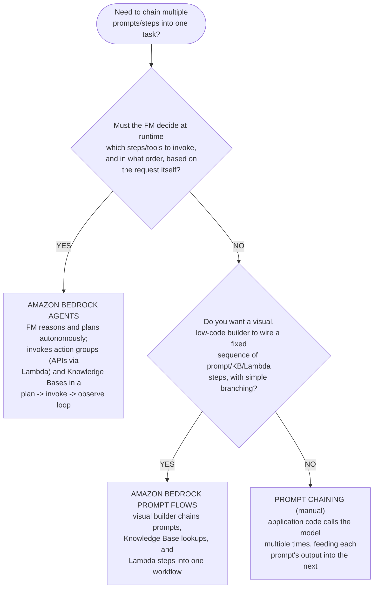
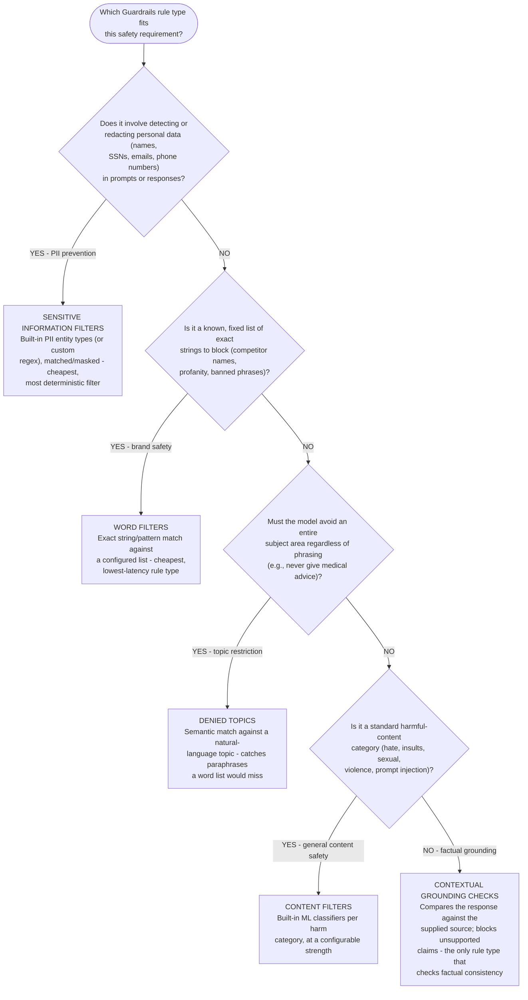
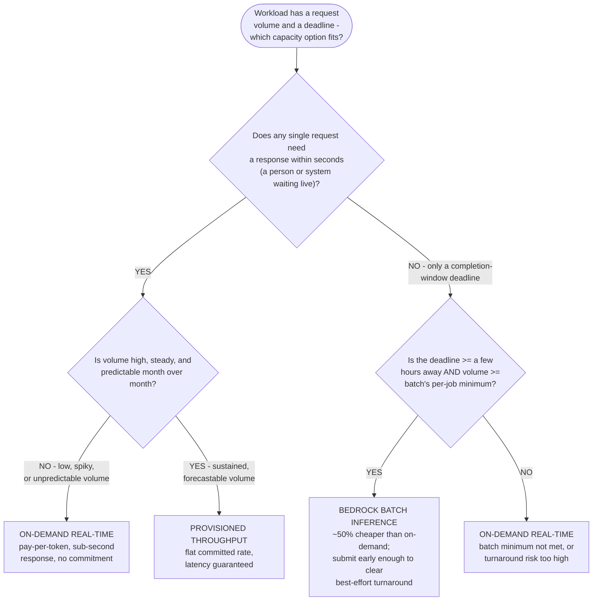
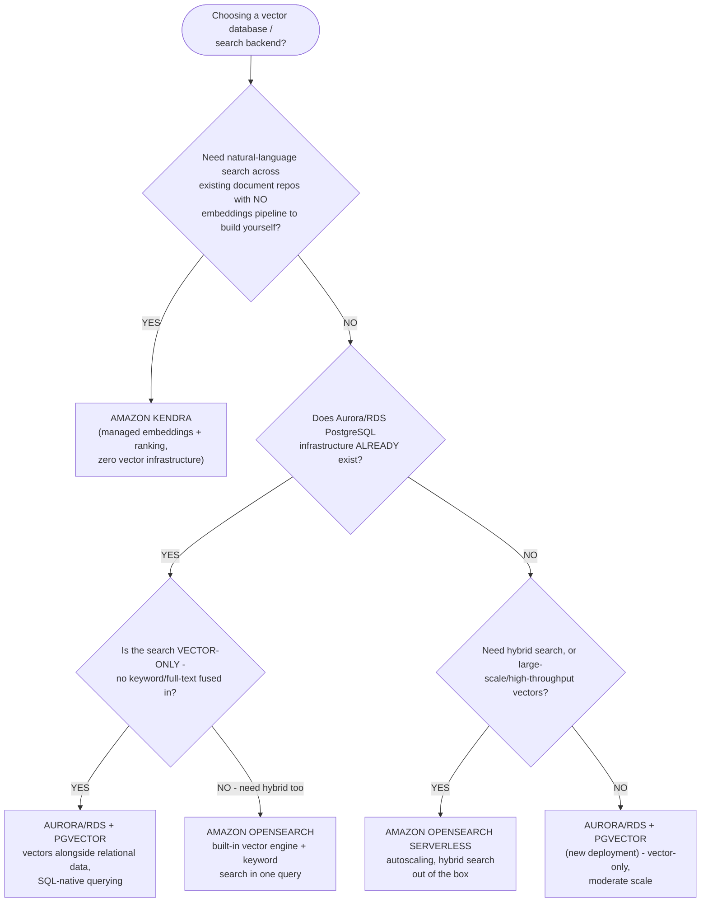
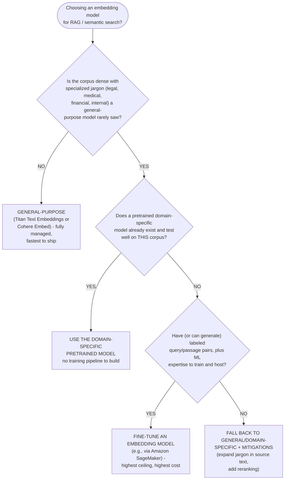
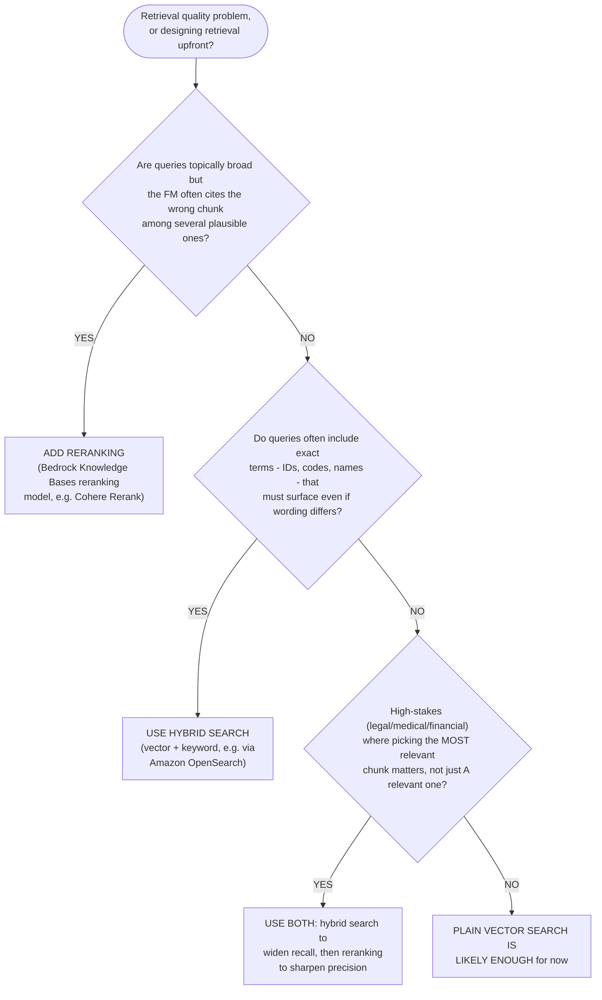
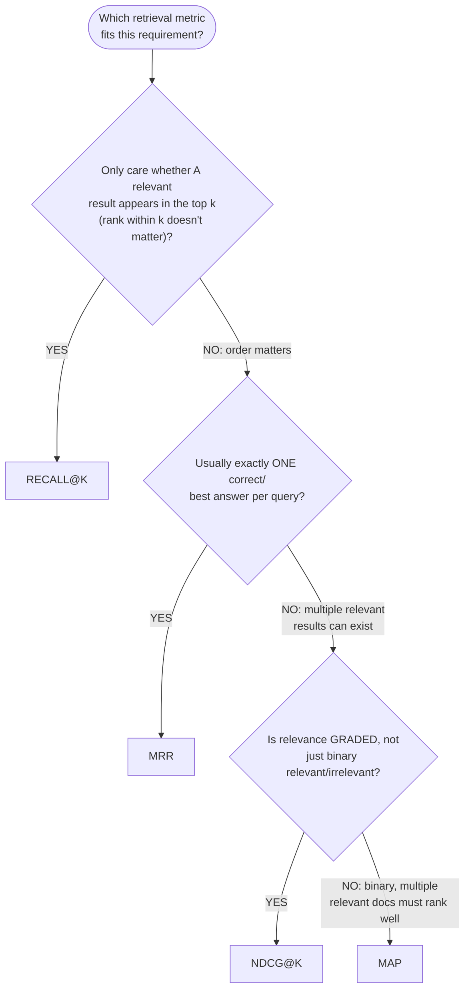
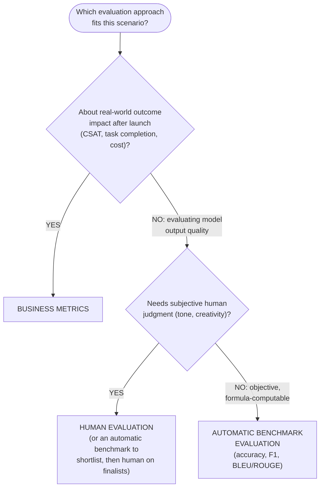

# Domain 3 Fast Track, Part 2: Inference Architecture & Multi-Modal Applications

**Condensed guide, part 2 of 3** · full guide: [`docs/domain-3-applications-of-foundation-models.md`](../domain-3-applications-of-foundation-models.md) (6,957 lines) · **Last verified:** 2026-09-05

## How to use this part

Domain 3 (Applications of Foundation Models) is too long — 6,957 lines
across 25 Mermaid diagrams and dozens of worked examples — for one
condensed guide, so its Fast Track is split into three parts. **[Part
1](part-1-application-design-and-customization.md)** covers Sections 1-4
(design considerations, prompt engineering, RAG fundamentals, and the six
customization methods). **This part** covers **Sections 5-7**: Amazon
Bedrock's inference architecture (model access, Agents, Prompt Flows,
Guardrails and prompt-injection prevention, cost governance, and the
on-demand/provisioned-throughput/batch capacity decision), vector
databases and embeddings (including multi-modal embeddings and multi-modal
RAG retrieval patterns), and evaluating foundation model performance.
**[Part 3](part-3-deployment-and-troubleshooting.md)** covers Section 8
onward (production deployment and troubleshooting).

It keeps **every testable decision point** from its scope — the Guardrails
rule-type decision tree, the Agents-vs-Prompt-Flows-vs-chaining
distinction, the on-demand/provisioned-throughput/batch capacity decision,
the vector-database and embedding-model selection trees, reranking vs.
hybrid search, the multi-modal dual-index-vs-single-index retrieval
decision, per-content-type multi-modal token budgeting, retrieval-ranking
metrics, and the three evaluation approaches — as compact tables and
decision trees instead of full worked-example narration. Every section
links back to the corresponding section of the full guide for the
complete scenario, worked examples, and mini-quizzes.

Domain 3 makes up roughly **28% of scored questions** — the exam's
heaviest-weighted domain. Read this fast track the day before the exam,
or any time you already know the material and just need the tables
refreshed; read the [full guide](../domain-3-applications-of-foundation-models.md)
first if any of these terms are new to you.

**Where each section comes from**, for jumping straight to the full
prose, worked examples, and mini-quizzes behind any condensed table
below:

| This fast track | Full guide section | Approx. full-guide lines |
|---|---|---|
| 1. Bedrock inference architecture: model access and orchestration | [Section 5](../domain-3-applications-of-foundation-models.md#5-amazon-bedrock-features) | 2285-2502 |
| 2. Guardrails and prompt injection prevention | [Guardrails rule-type decision tree](../domain-3-applications-of-foundation-models.md#guardrails-rule-type-decision-tree-matching-the-use-case-to-the-right-filter) | 2355-2447 |
| 3. Cost governance and capacity decision guide | [Cost governance](../domain-3-applications-of-foundation-models.md#cost-governance-bounding-per-request-cost-with-max-tokens-and-provisioned-throughput) | 2503-2882 |
| 4. Vector databases and embeddings: choosing a backend | [Section 6](../domain-3-applications-of-foundation-models.md#6-vector-databases-and-embeddings-for-search-and-retrieval) | 2931-3018 |
| 5. Choosing an embedding model | [Choosing an embedding model](../domain-3-applications-of-foundation-models.md#choosing-an-embedding-model-domain-specific-vs-general-vs-fine-tuned) | 3019-3101 |
| 6. Reranking and hybrid search | [Reranking and hybrid search](../domain-3-applications-of-foundation-models.md#reranking-and-hybrid-search-sharpening-vector-only-results) | 3102-3371 |
| 7. Multi-modal application patterns | [Multi-modal retrieval worked example](../domain-3-applications-of-foundation-models.md#worked-example-retrieval-patterns-for-a-multimodal-product-catalog-rag-system-text-images) and [token-budget worked example](../domain-3-applications-of-foundation-models.md#worked-example-budgeting-tokens-for-a-multimodal-financial-report-rag-pipeline-text-tables-images) | 1404-1562, 3372-3512 |
| 8. Retrieval quality metrics | [Retrieval quality metrics](../domain-3-applications-of-foundation-models.md#retrieval-quality-metrics-ndcg-map-recallk-and-mrr-a-selection-decision-guide) | 3513-3738 |
| 9. Evaluating foundation model performance | [Section 7](../domain-3-applications-of-foundation-models.md#7-evaluating-foundation-model-performance) | 3739-4223 |

## Table of contents

- [1. Bedrock inference architecture: model access and orchestration](#1-bedrock-inference-architecture-model-access-and-orchestration)
- [2. Guardrails and prompt injection prevention](#2-guardrails-and-prompt-injection-prevention)
- [3. Cost governance and capacity decision guide: on-demand vs. provisioned throughput vs. batch](#3-cost-governance-and-capacity-decision-guide-on-demand-vs-provisioned-throughput-vs-batch)
- [4. Vector databases and embeddings: choosing a backend](#4-vector-databases-and-embeddings-choosing-a-backend)
- [5. Choosing an embedding model: general-purpose vs. domain-specific vs. fine-tuned](#5-choosing-an-embedding-model-general-purpose-vs-domain-specific-vs-fine-tuned)
- [6. Reranking and hybrid search](#6-reranking-and-hybrid-search)
- [7. Multi-modal application patterns](#7-multi-modal-application-patterns)
- [8. Retrieval quality metrics](#8-retrieval-quality-metrics)
- [9. Evaluating foundation model performance](#9-evaluating-foundation-model-performance)
- [Rapid-fire key terms](#rapid-fire-key-terms)
- [Rapid self-check](#rapid-self-check)
- [Common exam traps checklist](#common-exam-traps-checklist)
- [Cross-domain connections](#cross-domain-connections)
- [Where to go deeper](#where-to-go-deeper)

---

## 1. Bedrock inference architecture: model access and orchestration

**Amazon Bedrock** is AWS's fully managed service for building generative
AI applications on foundation models, without managing any infrastructure.
Its core architectural pieces, each independently testable:

| Feature | What it does | Exam signal |
|---|---|---|
| **Model access** | A single, unified API across FMs from Amazon, Anthropic, AI21 Labs, Cohere, Meta, Mistral AI, and Stability AI | An AWS account must explicitly **request model access** per model before invoking it; swapping FMs needs minimal code changes |
| **Amazon Bedrock Agents** | Lets an FM reason about a request, break it into steps, and invoke external **action groups** (Lambda-backed APIs) and Knowledge Bases | "Reason and act autonomously," "invoke APIs/tools," "multi-step task" |
| **Guardrails for Amazon Bedrock** | Configurable input/output safety layer: denied topics, content filters, word filters, PII filters, contextual grounding checks | Covered in depth in [Section 2 below](#2-guardrails-and-prompt-injection-prevention) |
| **Amazon Bedrock Knowledge Bases** | Managed RAG: ingestion, chunking, embedding, retrieval over your own data | See [Part 1, Section 4](part-1-application-design-and-customization.md#4-rag-and-amazon-bedrock-knowledge-bases) |
| **Model evaluation** | Automatic (built-in metrics) or human (subjective criteria) evaluation jobs | See [Section 9 below](#9-evaluating-foundation-model-performance) |
| **Provisioned throughput** | Dedicated inference capacity (**model units**), 1- or 6-month commitment | See [Section 3 below](#3-cost-governance-and-capacity-decision-guide-on-demand-vs-provisioned-throughput-vs-batch) |

**Three orchestration options string multiple prompts/steps into one
workflow** — Bedrock Agents, Bedrock Prompt Flows, and plain prompt
chaining ([Part 1, Section 3](part-1-application-design-and-customization.md#3-prompt-engineering-techniques)).
All three chain steps; the distinguishing question is **who decides the
next step, and when**:

| Dimension | Amazon Bedrock Agents | Amazon Bedrock Prompt Flows | Plain prompt chaining |
|---|---|---|---|
| **Who decides the next step** | The FM, at runtime | The developer, at design time | The developer, at design time (in code) |
| **Tool/API calling** | Built in — action groups invoke Lambda-backed APIs during reasoning | Supported as flow nodes, not autonomously chosen | Manual — application code decides |
| **Build experience** | Configure an agent (instructions, action groups, Knowledge Bases) | Visual, low-code drag-and-drop builder | Regular application code, no console UI |
| **Adaptability at runtime** | Fully dynamic — can skip/repeat/reorder steps | Simple conditional branches between fixed nodes | Whatever the developer's code implements |
| **Exam keywords** | "reason and act," "agent," "invoke APIs autonomously" | "visual builder," "low-code workflow" | "sequence of prompts," no named Bedrock feature |

**AWS example, condensed:** An airline's Bedrock Agent calls a booking API
(action group via Lambda) to look up a reservation and consults a
Knowledge Base for baggage-policy questions, all in one conversational
session — the FM decides which of those two tools to invoke and in what
order, based on the customer's actual question.

> **Exam tip:** "The model decides for itself which APIs to call or how
> many steps are needed" → **Agents**. "A visual/low-code builder for
> connecting prompts and Knowledge Base steps" → **Prompt Flows**. "Call
> the model more than once, feed one output into the next" with no named
> Bedrock feature → plain **prompt chaining** — Prompt Flows is the
> managed version of the same idea, not a different concept.

Full explanation and the mini-quiz: [full guide, Section
5](../domain-3-applications-of-foundation-models.md#5-amazon-bedrock-features).

---

## 2. Guardrails and prompt injection prevention

**Guardrails for Amazon Bedrock** is a configurable safety layer applied
to model inputs/outputs, with **five rule types** that each match content
a different way — picking the wrong one either misses the violation or
burns cost on a heavier check than the job needs:

| Use case | Rule type | Why it's the efficient choice |
|---|---|---|
| **PII prevention** | Sensitive information filters | Deterministic pattern matching — no ML inference needed |
| **Brand safety** | Word filters | The set of bad strings is fully known ahead of time |
| **Topic restriction** | Denied topics | Catches paraphrases a word list would miss |
| **Factual grounding** (reduce hallucination) | Contextual grounding checks | The only rule type checking truthfulness against a source |
| **General harmful content** (hate, violence, sexual, **prompt injection**) | Content filters | Built-in ML classifiers per harm category |

**Worked example, condensed — a retailer blocking competitor-brand
mentions:** a content filter doesn't apply (not hate/violence/sexual
content); contextual grounding doesn't apply (not a factuality problem);
denied topics would eventually catch it but costs a full semantic
evaluation per response for no accuracy gain. **Word filters** — a known,
finite list of competitor names — is the efficient match. If the
requirement later grows to "never discuss competitors in any form, named
or not," that shift from an exact-match to a semantic problem is the
signal to switch to **denied topics** instead.

### Preventing prompt injection

**Prompt injection** is malicious input that tries to override a model's
or application's original instructions — **directly** (embedded in the
user's own prompt) or **indirectly** (hidden in a document a RAG pipeline
retrieves and inserts into the prompt as if it were trusted context). The
exam tests it from two angles in this domain: as a **content filter**
category inside Guardrails (above), and as a **defense-in-depth
architecture problem** that no single filter fully solves alone.

**Layered prevention checklist:**

- [ ] **Content filters** (Guardrails) — the Bedrock-native, first-line
      mitigation; scores input/output against a built-in prompt-injection
      classifier alongside other harm categories.
- [ ] **Treat all retrieved content as untrusted data, never as
      instructions** — the single most important architectural defense
      against **indirect** prompt injection via a Knowledge Base document,
      a scraped web page, or a forum post.
- [ ] **Separate the system prompt from user/retrieved input** with clear
      delimiters or structured message roles, so the model has a stronger
      signal about which text is an instruction and which is data to
      reason over.
- [ ] **Least-privilege IAM on every Agent action group and Lambda
      function** — even a successful injection can only do as much damage
      as the invoked tool's permissions allow (an insecure-plugin-design
      and excessive-agency mitigation).
- [ ] **Contextual grounding checks** — catch a hijacked response that
      contradicts or invents content beyond what the source material
      actually supports.
- [ ] **Output validation before any downstream use** — never pass raw FM
      output directly to a shell, database query, or another API without
      treating it as untrusted input first.

> **Exam tip:** The exam likes to plant **prompt injection** in a list of
> prompt-engineering "techniques" and ask which one is actually a security
> risk (it's the one you *mitigate*, never *apply*). A scenario describing
> hidden text in a **retrieved document** that hijacks the model's
> behavior is **indirect prompt injection** — the fix is architectural
> (treat retrieved content as untrusted) as much as it is a Guardrails
> content filter. Full threat-catalog depth (data poisoning, model
> extraction, excessive agency, insecure plugin design, and more) is a
> Domain 5 topic — see [Cross-domain connections](#cross-domain-connections)
> below.

Full explanation, the worked example, and the mini-quiz: [full guide,
Guardrails rule-type decision
tree](../domain-3-applications-of-foundation-models.md#guardrails-rule-type-decision-tree-matching-the-use-case-to-the-right-filter).

---

## 3. Cost governance and capacity decision guide: on-demand vs. provisioned throughput vs. batch

**Cost governance** actively bounds what a workload costs at runtime,
separate from estimating cost up front:

- **Max tokens** — the single most direct per-call cost control. Bedrock
  on-demand pricing bills output tokens per response, so capping
  `max_tokens` at what the task genuinely needs bounds the worst-case cost
  of every request, regardless of prompt content or model behavior.
- **Provisioned throughput ROI** — a fixed, committed cost (1- or 6-month
  model-unit purchase) that only pays off for **high, steady, predictable**
  volume; for spiky/low volume, on-demand stays cheaper.

Bounding *individual* request cost is necessarily incomplete — it doesn't
stop a traffic spike or a flood of requests from multiplying that
per-request cost. Capping *aggregate* spend (Service Quotas, API Gateway
usage plans) is a [Domain 5 concern](../domain-5-security-compliance-governance.md#cost-governance-bounding-total-spend-with-service-quotas-and-api-gateway-usage-plans)
the exam expects alongside this one, not instead of it.

**Every Bedrock capacity decision reduces to two questions, in order:**
does any single request need a response while something is waiting live
(chosen between on-demand and provisioned throughput, by volume), or does
the workload only have a completion-window deadline (chosen between batch
and on-demand, by window length and record count).

| Per-request SLA | Request volume | Cost-optimal choice | Why |
|---|---|---|---|
| Hard — seconds | Low, spiky, unpredictable | **On-demand real-time** | A flat provisioned rate is paid whether or not it's used; volume never clears break-even |
| Hard — seconds | High, steady, predictable, above break-even | **Provisioned throughput** | Fixed hourly rate undercuts accumulating on-demand cost, plus a guaranteed latency ceiling |
| None — completion-window deadline | Clears batch's per-job minimum, window ≥ a few hours | **Bedrock batch inference** | Same per-token rate as on-demand at an illustrative ~50% discount — nothing is waiting on any single response |
| None — completion-window deadline | Below batch's minimum, or window too short | **On-demand real-time** | Batch either doesn't fit or carries too much turnaround risk |

**Two worked comparisons, condensed to their numbers** (illustrative
Claude Haiku on-demand rates: $0.00025/1K input tokens, $0.00125/1K output
tokens; provisioned throughput: $3.00/hour/model unit):

| Scenario | On-demand monthly cost | Provisioned monthly cost | Batch monthly cost | Verdict |
|---|---|---|---|---|
| 6,000,000 requests/mo, hard SLA, steady support chatbot | $3,375 | **$2,190** | N/A (hard SLA rules out batch) | **Provisioned throughput** — volume sits ~1.5x above the ~3.89M-request/mo break-even point |
| 600,000 requests/mo, no SLA, 8-hour overnight window, email digests | $180 | $2,190 (~12x above this volume's break-even) | **$90** | **Batch inference** — cheapest by far; nothing is waiting on an individual response |

**Reading a scenario, four short examples:** a live chat widget with
spiky launch-day traffic and a hard SLA → **on-demand**; a steady
6M-request/month API with a hard SLA → **provisioned throughput**; a
nightly digest with an 8-hour window → **batch**; a one-off 40-ticket job
due within the hour → **on-demand** (too small and too tight a window for
batch, even with no one waiting).

> **Exam tip:** A high volume number alone does not imply provisioned
> throughput — it only does so paired with a **hard per-request SLA**. The
> same high volume paired with **no SLA and a completion-window deadline**
> points to batch inference instead, at a fraction of the cost. Reaching
> for provisioned throughput just because a scenario mentions "a lot of
> requests" is the distractor being tested.

Full explanation, both full worked comparisons, and the implementation
notes for batching JSONL payloads: [full guide, Cost
governance](../domain-3-applications-of-foundation-models.md#cost-governance-bounding-per-request-cost-with-max-tokens-and-provisioned-throughput).

---

## 4. Vector databases and embeddings: choosing a backend

A **vector database** stores **embeddings** (numeric vectors capturing
semantic meaning) and performs **similarity search** (commonly k-NN with
cosine similarity) — the retrieval half of RAG.

| Option | What it is | Best fit |
|---|---|---|
| **Amazon OpenSearch Service / Serverless** | Search and analytics service with a built-in vector engine, supporting k-NN alongside keyword search | Need both vector *and* keyword (hybrid) search; a common Bedrock Knowledge Bases vector store |
| **Amazon Aurora (PostgreSQL) / RDS for PostgreSQL + `pgvector`** | Vector embeddings as a column type inside a relational database, queried with SQL | A team already runs PostgreSQL/Aurora and wants vector search without a separate service |
| **Amazon Kendra** | Managed, ML-powered enterprise search — handles embedding, ranking, relevance internally | "Add natural-language search over existing document repos" with **zero embeddings pipeline** to build |

> **Exam tip:** A scenario describing managing your own embeddings and a
> similarity index → a **vector database** (OpenSearch, or Aurora/RDS +
> `pgvector`, chosen by what infrastructure already exists and whether
> hybrid search is needed). "Search across our existing enterprise
> documents in natural language" with no embeddings pipeline mentioned →
> **Amazon Kendra**.

**AWS example, condensed:** A healthcare vendor embeds medical documents
with **Amazon Titan Text Embeddings** and stores them in **Amazon
OpenSearch Service** for low-latency semantic + keyword hybrid search
inside a Bedrock Knowledge Base. A separate internal team wanting quick
natural-language search across existing SharePoint and S3 repositories,
with no embeddings pipeline of its own to build, instead deploys **Amazon
Kendra** directly against those repositories.

**Reuse before you provision: an existing Kendra GenAI Index**

The three-way table above assumes a blank slate. If an **Amazon Kendra
GenAI Index** already exists over the target content, the decision
changes:

- A **Knowledge Base** can also reuse an existing **Kendra GenAI
  Index** as its retriever — the exam-favored answer when one already
  exists, over standing up a second index in OpenSearch/Aurora.
- Reuse an existing **Kendra GenAI Index** as a Knowledge Base's
  retriever when one already exists, instead of standing up a second
  OpenSearch/Aurora index for the same content.

**Compliance-document Q&A example:** from a blank slate, the choice
still follows the table above (hybrid/large scale → OpenSearch;
existing Aurora + a team that can operate an embeddings pipeline →
Aurora + `pgvector`; zero embeddings infrastructure to build → Kendra).
But if a **Kendra GenAI Index** is already deployed over those same
compliance documents, reuse it as the Bedrock Knowledge Base's retriever
rather than provisioning a separate OpenSearch or Aurora + `pgvector`
vector store for the same content.

Full explanation and the AWS example: [full guide, Section
6](../domain-3-applications-of-foundation-models.md#6-vector-databases-and-embeddings-for-search-and-retrieval).
The Kendra GenAI Index worked example lives in [full guide, Section
3](../domain-3-applications-of-foundation-models.md#worked-example-building-a-product-knowledge-assistant-using-kendras-genai-index-as-a-bedrock-knowledge-base-data-source).

---

## 5. Choosing an embedding model: general-purpose vs. domain-specific vs. fine-tuned

Picking the wrong embedding model is one of the most common root causes
of poor RAG retrieval. Three tiers:

| Tier | Setup cost | Best fit |
|---|---|---|
| **General-purpose** (Amazon Titan Text Embeddings, Cohere Embed on Bedrock) | Lowest — fully managed, zero training | Everyday business language; the right default absent a specialized domain |
| **Domain-specific pretrained** (often third-party/open-source) | Low/medium — evaluate and integrate, no training pipeline | Corpus dense with legal/medical/financial/internal jargon a general model rarely saw |
| **Fine-tuned on your own data** (typically via Amazon SageMaker, not a Bedrock fine-tuning job) | Highest — labeled query/passage pairs, ML expertise, hosting | A narrow corpus with its own phrasing, plus labeled data to justify the investment |

> **Exam tip:** Default to **Amazon Titan Text Embeddings** whenever a
> scenario doesn't call out a specialized domain. Legal/medical/financial
> terminology with traceable retrieval problems → **domain-specific
> pretrained**. Only pick **fine-tuning an embedding model** when the
> scenario names **your own labeled query/passage examples** *and* a
> narrow, stable domain — and remember it's typically a SageMaker
> workflow, not a Bedrock-native fine-tuning job.

**AWS example, condensed:** A legal-tech vendor's contract-analysis RAG
assistant starts with **Amazon Titan Text Embeddings** for general
correspondence. Once the product expands to dense litigation filings, the
team evaluates a **domain-specific, legal-tuned third-party embedding
model** and finds it separates clauses far better. A second team, with a
single narrow contract template and hundreds of labeled query/clause
pairs already on hand, instead **fine-tunes an embedding model on Amazon
SageMaker**, since their corpus is narrow and their labeled data
plentiful enough to justify it.

Full explanation and the AWS example: [full guide, Choosing an embedding
model](../domain-3-applications-of-foundation-models.md#choosing-an-embedding-model-domain-specific-vs-general-vs-fine-tuned).

---

## 6. Reranking and hybrid search

Plain vector similarity search returns the chunks *closest* to the query
vector — not necessarily the chunks that best *answer* it, and not
necessarily chunks with an exact term (a SKU, a name, an error code) the
user cares about. Two techniques sharpen results, each solving a
different gap:

| Dimension | **Reranking** | **Hybrid (vector + keyword) search** |
|---|---|---|
| When it's essential | Chunks are topically related but the FM cites the *wrong* one among several plausible candidates | Queries routinely include exact terms a semantic-only match can bury |
| When it's nice-to-have | Retrieval is already precise on a small, narrow corpus | Corpus is conceptual/narrative with few exact-match terms |
| Cost/latency | An extra model call on the candidate set — moderate latency for a relevance boost | A second (keyword) query path plus fusion — lower added latency |
| In Bedrock Knowledge Bases | Plug in a **reranking model** (e.g., Cohere Rerank) as an opt-in retrieval step | Automatic when the vector store supports it (e.g., **Amazon OpenSearch**) |

**Worked example, condensed — Cohere Rerank on two catalogs**, measured
against a labeled offline evaluation set (not assumed):

| Dimension | Large retailer (800K SKUs, 2M queries/mo) | Boutique retailer (5K SKUs, 20K queries/mo) |
|---|---|---|
| Precision@5, vector-only | 0.62 | 0.93 |
| Precision@5, with Cohere Rerank | 0.85 (**+23 points**) | 0.95 (+2 points) |
| Recall@50 (unchanged by reranking) | 0.81 | already high |
| Added latency / cost per query | +120ms / ~$0.002 | +120ms / ~$0.002 |
| Added monthly cost | ~$4,000 | ~$40 |
| **Verdict** | **Add reranking** — precision gain is worth far more than the cost | **Skip it** — little headroom left to gain |

A **large gap between Recall@50 and Precision@5** is the quantitative
signal that a reranker has room to help — the right answer is already
retrieved, it just isn't sorted correctly yet.

> **Exam tip:** "Close but not quite right" retrieved content — after
> ruling out a bad embedding model — points to **reranking**. Users
> searching for exact codes/names/error messages and not getting them back
> points to **hybrid search**. Both configure *within* Bedrock Knowledge
> Bases rather than requiring a separate pipeline.

Full explanation and the full worked example: [full guide, Reranking and
hybrid
search](../domain-3-applications-of-foundation-models.md#reranking-and-hybrid-search-sharpening-vector-only-results).

---

## 7. Multi-modal application patterns

[Part 1's design-considerations section](part-1-application-design-and-customization.md#1-design-considerations-for-fm-applications)
flags **modality** (text, image, audio, video, or **multimodal**) as a
model-selection factor. Retrieval and generation over multiple modalities
in the same application need their own deliberate design decisions —
picking a vector store alone isn't enough.

**Multi-modal embeddings** (e.g., **Amazon Titan Multimodal Embeddings**)
map both text and images into the same vector space, enabling retrieval
across modalities. Two architectural patterns for combining text and
image retrieval over the same catalog/entity:

| Pattern | How it works | Guaranteed modality floor? |
|---|---|---|
| **Option A — dual embedding indexes + merge (e.g., Reciprocal Rank Fusion)** | Text and images embedded and indexed separately; both queried independently, then fused by **rank position**, not raw similarity | **Yes** — top-k pulled from each index before fusion |
| **Option B — single combined multimodal index** | Text and image chunks embedded with the same multimodal model into **one** shared index; one query, one ranked list | **No** — unconstrained; whichever modality has higher average similarity can dominate |

**Worked example, condensed — an 80,000-SKU furniture catalog** (text
descriptions + product photos), queried with mixed spec+style questions
("mid-century modern accent chair in walnut with brass legs"):

| Metric | Option A: dual indexes + RRF | Option B: single index |
|---|---|---|
| Recall@10, spec-only queries ("brass legs") | **0.87** | 0.61 |
| Recall@10, style-only queries | 0.84 | 0.85 |
| Precision@5, mixed queries | **0.90** | 0.68 |
| Added latency vs. single-index query | +30-60ms | baseline |

**Choice: Option A.** Spec terms ("walnut," "brass legs") live almost
exclusively in text; Option B lets the higher-average-similarity modality
(here, images) crowd out text hits the query actually needs. A single
combined index (Option B) only wins when one modality is clearly primary
and the other carries little independent signal (e.g., a visual-first
catalog with minimal text descriptions).

**Per-content-type token budgeting** — a document mixing prose, tables,
and charts needs a representation decision *per content type*, not one
blanket choice, because multimodal image input is priced in
token-equivalent units:

| Representation | Tokens per table (~40x6 rows) | Preserves | Best fit |
|---|---|---|---|
| **Text summary only** | ~80 | Gist, not exact figures | Never — for precision-sensitive queries, discards cell-level data |
| **OCR/extract to structured text** | ~330 (~4x summary) | Every exact figure | Machine-readable tables — cheapest option that keeps precision |
| **Raw image embed** | ~1,600 (~20x summary, ~5x OCR) | Visual structure (merged cells, a chart's shape) | Content with no extractable cells — charts, scans, handwritten pages |

At 5 retrieved tables per request, Option B (OCR) costs **~1,650 tokens**
vs. Option C (raw images) at **~8,000 tokens** — enough to overflow an
8K-context model on a single query. The exam-tested resolution: **extract
machine-readable tables to text; embed only genuinely non-extractable
content (charts, scans) as images** — mixing representations by content
type, not defaulting every table and chart to the same option.

> **Exam tip:** A scenario describing retrieval over **both text and
> images for the same catalog/entity** is testing whether you know
> multi-modal retrieval needs an explicit merge-strategy decision, not just
> "pick a vector store." Default to **dual indexes + rank-based fusion**
> whenever both modalities carry independent signal. For **document**
> multi-modality (tables/charts embedded in text), the token-cost gap
> between text extraction and raw image embedding (**5-20x**) means
> extracting to text is the default, and raw image embedding is reserved
> for content text extraction genuinely cannot capture.

Full explanation and the code sketch for Reciprocal Rank Fusion: [full
guide, multi-modal retrieval worked
example](../domain-3-applications-of-foundation-models.md#worked-example-retrieval-patterns-for-a-multimodal-product-catalog-rag-system-text-images)
and [token-budget worked
example](../domain-3-applications-of-foundation-models.md#worked-example-budgeting-tokens-for-a-multimodal-financial-report-rag-pipeline-text-tables-images).

---

## 8. Retrieval quality metrics

**Precision@k** and **Recall@k** only tell you *whether* relevant content
was retrieved — not whether it was **ranked** well. Four metrics answer
that:

| Metric | What it measures | Use it when |
|---|---|---|
| **Recall@k** | Whether a relevant item appears *anywhere* in the top *k* | Any of the top *k* results counts as a win — rank inside the window doesn't matter |
| **MRR (Mean Reciprocal Rank)** | How early the *first* relevant result appears | Each query has essentially **one** correct/best answer |
| **MAP (Mean Average Precision)** | Precision averaged across every relevant item's rank | **Multiple** relevant, binary-labeled documents per query; both finding all and ranking them matters |
| **NDCG@k** | Ranking quality with **graded** (not binary) relevance | Relevance comes in degrees and result **order** is the requirement (e.g., product search) |

> **Exam tip:** "The right answer must be findable somewhere in the top 5"
> → **Recall@5**. "A single-answer FAQ bot's best answer should rank near
> #1" → **MRR**. "Rank the most relevant results highest" on a graded
> scale → **NDCG@k**. "Find all relevant documents, ranked as high as
> possible" with binary labels → **MAP**.

Full explanation: [full guide, Retrieval quality
metrics](../domain-3-applications-of-foundation-models.md#retrieval-quality-metrics-ndcg-map-recallk-and-mrr-a-selection-decision-guide).

---

## 9. Evaluating foundation model performance

Three complementary evaluation layers, each answering a different
question:

| Approach | What it measures | Speed/cost |
|---|---|---|
| **Human evaluation** | Subjective criteria automatic metrics can't capture — tone, creativity, nuanced correctness | Slower, more expensive |
| **Benchmark datasets** (automatic evaluation) | Objective, reproducible model quality via standardized metrics | Fast, cheap, scalable |
| **Business metrics** | Real-world outcome impact (task completion rate, CSAT, cost per interaction) | The only layer tied directly to organizational goals |

**Named benchmarks and additional metrics** the exam expects you to
recognize by description, not compute:

| Benchmark/metric | Measures | Direction |
|---|---|---|
| **MMLU** | General knowledge/reasoning across 57 subjects | Higher is better |
| **ARC** | Science reasoning | Higher is better |
| **HumanEval** | Code generation, checked by running unit tests | Higher is better |
| **GSM8K** | Multi-step math word problems | Higher is better |
| **Toxicity scoring** | Harmful/unsafe language in output | **Lower** is better |
| **BERTScore** | Semantic similarity to a reference, tolerant of paraphrasing (unlike BLEU/ROUGE) | Higher is better |
| **Perplexity** | Language-model fluency/confidence, not correctness | **Lower** is better |

A model can top one axis and fail another — fluent (low perplexity) but
toxic, or strong on MMLU but weak on BERTScore against domain-specific
reference answers. Combine at least one correctness metric, one
similarity metric, and toxicity before treating a candidate as ready to
ship. A 2-point benchmark improvement is only trustworthy with a
**confidence interval that doesn't cross zero** — a large enough
evaluation sample matters more than the raw point estimate.

> **Exam tip:** "Comparing multiple models quickly and cheaply at scale" →
> **automatic benchmark evaluation**. "Judging tone or creativity" →
> **human evaluation**. "Did this actually help the business" → a
> **business metric**. Keep the three distinct: a model can score well on
> benchmarks yet fail to move the business metric it was built for.

**AWS example, condensed:** A telecom company runs an **automatic model
evaluation** job on a benchmark dataset to compare two candidate Bedrock
models on accuracy and robustness. The top two then go through a **human
evaluation** job where support agents score sample conversations for tone
and helpfulness. After launch, the company tracks the **business metric**
of call-deflection rate — which ultimately determines whether the project
is judged successful, regardless of how well either candidate scored on
benchmarks.

Full explanation, the statistical-significance worked example, and the
mini-quiz: [full guide, Section
7](../domain-3-applications-of-foundation-models.md#7-evaluating-foundation-model-performance).

---

## Rapid-fire key terms

- **Amazon Bedrock Agents** — an FM reasons at runtime about which steps
  and tools (action groups, Knowledge Bases) to invoke.
- **Amazon Bedrock Prompt Flows** — a visual, low-code builder for a
  design-time-fixed sequence of prompt/Knowledge-Base/Lambda steps.
- **Guardrails for Amazon Bedrock** — a configurable input/output safety
  layer: denied topics, content filters, word filters, sensitive
  information filters, contextual grounding checks.
- **Denied topics** — a Guardrails rule matching an entire subject area
  semantically, regardless of phrasing.
- **Content filters** — built-in ML classifiers per harm category (hate,
  violence, sexual, **prompt injection**), at a configurable strength.
- **Word filters** — exact string/pattern match against a known, fixed
  list; cheapest Guardrails rule type.
- **Sensitive information filters** — detect/redact PII via built-in
  entity types or custom regex.
- **Contextual grounding checks** — the only Guardrails rule type that
  compares a response against source content for factual consistency.
- **Prompt injection** — malicious input overriding intended instructions,
  either directly (in the prompt) or **indirectly** (hidden in retrieved
  content).
- **Provisioned throughput** — dedicated inference capacity purchased for
  a 1- or 6-month commitment, billed at a flat rate regardless of usage.
- **On-demand pricing** — pay-per-token, no commitment; fits variable/
  spiky/low-volume traffic.
- **Bedrock batch inference** — asynchronous, best-effort job processing
  at an illustrative ~50% discount vs. on-demand, for workloads with a
  completion-window deadline instead of a per-request SLA.
- **Max tokens** — the inference parameter that bounds worst-case
  per-request output-token cost.
- **Embeddings** — numeric vector representations of text/images/audio
  capturing semantic meaning.
- **Vector database** — stores embeddings and performs similarity
  (k-NN) search; e.g., Amazon OpenSearch, Aurora/RDS + `pgvector`.
- **Amazon Kendra** — managed enterprise search with embeddings/ranking
  handled internally; not a vector database you architect yourself.
- **Amazon Titan Multimodal Embeddings** — maps text and images into the
  same vector space for cross-modal retrieval.
- **Reranking** — a second, more expensive model re-scores an initial
  candidate set for query-specific relevance.
- **Hybrid search** — vector (semantic) search combined with keyword/
  full-text search in one query.
- **Reciprocal Rank Fusion (RRF)** — merges independently ranked result
  lists by rank position, not raw similarity, avoiding one modality's
  higher average similarity from crowding out another.
- **Recall@k / MRR / MAP / NDCG@k** — retrieval-ranking metrics for
  "found anywhere in top k," "one best answer near #1," "all relevant
  docs ranked well (binary)," and "graded relevance ranked well,"
  respectively.
- **Human evaluation** — people scoring FM output on subjective criteria.
- **Benchmark datasets / automatic evaluation** — standardized datasets
  and computable metrics (MMLU, GSM8K, HumanEval, ARC) for objective,
  reproducible scoring.
- **Business metrics** — real-world outcome measures (CSAT, task
  completion rate, cost per interaction) distinct from model-quality
  metrics.
- **Toxicity scoring / BERTScore / perplexity** — lower-is-better safety,
  higher-is-better paraphrase-tolerant similarity, and lower-is-better
  fluency metrics, respectively.

For the complete glossary: [full guide, Key terms
glossary](../domain-3-applications-of-foundation-models.md#key-terms-glossary).
For terms shared across domains: [`docs/master-glossary.md`](../master-glossary.md).

---

## Rapid self-check

Twelve quick recall questions — cover the answer column and try each one
before checking it. These are new questions, not a repeat of the full
guide's practice set.

| # | Question | Answer |
|---|---|---|
| 1 | A scenario says the model decides for itself which APIs to call and in what order — Agents or Prompt Flows? | **Amazon Bedrock Agents** — the FM reasons at runtime |
| 2 | A team must block a known, fixed list of competitor brand names as cheaply as possible — which Guardrails rule type? | **Word filters** |
| 3 | Which Guardrails rule type is the only one that checks whether a response is actually supported by its source? | **Contextual grounding checks** |
| 4 | Hidden text in a retrieved document hijacks the model's behavior — direct or indirect prompt injection? | **Indirect** — the fix includes treating retrieved content as untrusted, not just a content filter |
| 5 | A workload has high, steady, predictable volume and a hard per-request SLA — on-demand, provisioned throughput, or batch? | **Provisioned throughput** |
| 6 | A workload has no per-request SLA, only a "ready by morning" deadline, and clears the volume minimum — which capacity option? | **Bedrock batch inference** |
| 7 | A RAG corpus is full of legal jargon and a general-purpose embedding model underperforms — what's the next tier to try before fine-tuning? | **Domain-specific pretrained embedding model** |
| 8 | Recall@50 is high but Precision@5 is much lower — what does that combination signal? | The right answer is already retrieved but poorly sorted — **add reranking** |
| 9 | A furniture catalog's query needs both an exact spec term ("brass legs") and a visual style — dual indexes or a single combined multimodal index? | **Dual embedding indexes with rank-based fusion (RRF)** — guarantees both modalities are represented |
| 10 | A financial report's line-item table is machine-readable — OCR to text, or embed as a raw image? | **OCR/extract to structured text** — far cheaper in tokens and preserves exact figures |
| 11 | A chart has no extractable cell data — which multi-modal representation is the only one that works? | **Embed the raw image** |
| 12 | Which of the three evaluation layers is tied directly to organizational outcomes, not model output quality? | **Business metrics** |

---

## Common exam traps checklist

- [ ] **A high request volume alone does not imply provisioned
      throughput** — it only does paired with a hard per-request SLA; the
      same volume with a completion-window deadline points to batch
      inference instead.
- [ ] **Prompt injection is a security risk, never a technique to apply**
      — a common distractor when it's planted in a list of "capabilities."
- [ ] **Indirect prompt injection needs an architectural fix, not just a
      content filter** — retrieved content must be treated as untrusted
      data, never as instructions.
- [ ] **Word filters vs. denied topics**: a known, fixed string list is
      word filters; an entire subject area regardless of phrasing is
      denied topics — don't reach for the semantic (costlier) option when
      the cheaper exact-match one already covers the case.
- [ ] **Only contextual grounding checks verify factual consistency
      against a source** — content filters, word filters, and denied
      topics all evaluate text in isolation.
- [ ] **A single combined multimodal index has no guaranteed modality
      floor** — the modality with higher average similarity can crowd out
      the other regardless of which is actually more relevant.
- [ ] **Multi-modal token budgeting is a per-content-type decision** —
      raw image embedding runs 5-20x the token cost of extracted text;
      reserve it for content (charts, scans) that text extraction
      genuinely can't capture.
- [ ] **Recall@k and Precision@k don't measure ranking quality** — a large
      gap between a high Recall@50 and a lower Precision@5 signals a
      reranking opportunity, not a retrieval-coverage problem.
- [ ] **Amazon Kendra is not a vector database you architect** — it's
      managed enterprise search with embeddings handled internally.
- [ ] **Benchmark scores, human evaluation, and business metrics measure
      three different things** — a model can win on one and lose on
      another; business metrics are the only outcome-tied layer.
- [ ] **Toxicity scoring and perplexity are lower-is-better**; benchmark
      accuracy scores and BERTScore are higher-is-better — know the
      direction before calling a score "the best."
- [ ] **Fine-tuning an embedding model is typically a SageMaker workflow,
      not a Bedrock-native fine-tuning job** — don't conflate it with
      fine-tuning a text-generation FM.

---

## Cross-domain connections

| Connects to | Shared concept | Why they're easy to conflate |
|---|---|---|
| [Domain 5, Common security threats to AI systems](../domain-5-security-compliance-governance.md#common-security-threats-to-ai-systems-and-how-to-mitigate-them) | Prompt injection, excessive agency, insecure plugin design | This part's Guardrails/least-privilege prevention checklist is the Bedrock-feature side of Domain 5's fuller AI-specific threat catalog and mitigation categories |
| [Domain 4, AWS tools for responsible AI](../domain-4-guidelines-for-responsible-ai.md#3-aws-tools-for-responsible-ai) | Guardrails as a responsible-AI control | This part covers Guardrails as a Bedrock platform feature you attach to a model/Agent; Domain 4 covers the same feature as a responsible-AI/bias-and-safety control |
| [Domain 5, Cost governance: bounding total spend](../domain-5-security-compliance-governance.md#cost-governance-bounding-total-spend-with-service-quotas-and-api-gateway-usage-plans) | Per-request vs. aggregate cost control | This part's max-tokens/provisioned-throughput controls bound *one* request's cost; Domain 5 bounds *how many* requests can be made in total — the exam expects both together |
| [Part 1, Design considerations for FM applications](part-1-application-design-and-customization.md#1-design-considerations-for-fm-applications) | Modality as a model-selection factor | Part 1 introduces modality (text/image/audio/video/multimodal) as one design consideration; this part covers the retrieval and token-budgeting architecture needed once an application actually combines modalities |
| [Domain 1, Section 6](../domain-1-fundamentals-of-ai-and-ml.md#6-model-evaluation-basics) | Evaluation metrics and statistical rigor | Both this part's confidence-interval caution on benchmark deltas and Domain 1's classical-ML evaluation basics rest on the same principle: a point estimate alone doesn't establish a real improvement |
| [`cross-domain-scenario-questions.md`](../cross-domain-scenario-questions.md#practice-questions) | Choosing the right retrieval/safety control under competing constraints | Several cross-domain scenario questions test whether a fix belongs to this domain's inference-architecture toolkit or a Domain 4/5 responsible-AI or security control |

---

## Where to go deeper

This part intentionally omits the full guide's step-by-step worked
examples, AWS-example paragraphs, mini-quizzes, and the domain's shared
20-question practice set (which spans all three parts). Go back to the
full guide for:

- [Domain overview and exam weighting](../domain-3-applications-of-foundation-models.md#domain-overview)
- The full Bedrock Agents-vs-Prompt-Flows worked example and the airline
  Agent AWS example
- The full on-demand-vs-provisioned-throughput and batch-vs-real-time
  worked cost comparisons, including the break-even derivations and
  batch-job implementation notes (JSONL payloads, EventBridge scheduling)
- The full Cohere Rerank worked example, including the offline
  precision/recall measurement methodology
- The full multi-modal retrieval worked example, including the
  Reciprocal Rank Fusion code sketch
- The statistical-significance worked example (confidence intervals,
  minimum sample size, inter-rater agreement)
- Mini-quizzes embedded after Sections 5-7
- [Practice questions and answer key](../domain-3-applications-of-foundation-models.md#practice-questions)

For material that spans multiple domains, see
[`docs/cross-domain-concept-map.md`](../cross-domain-concept-map.md) and
[`docs/cross-domain-scenario-questions.md`](../cross-domain-scenario-questions.md).
For the ultra-condensed cram-sheet version of all of Domain 3, see
[`docs/domain-3-fast-track/ULTRA-FAST-LEARN.md`](ULTRA-FAST-LEARN.md).
For active-recall / spaced-repetition practice, see
[`docs/domain-3-fast-track/FLASHCARDS.md`](FLASHCARDS.md) — it covers the
entire domain in one deck, not split by part.

[← Domain 3 Fast Track, Part 1: FM Application Design & Customization](part-1-application-design-and-customization.md) · [Back to the full Domain 3 guide](../domain-3-applications-of-foundation-models.md#5-amazon-bedrock-features) · [Domain 3 Fast Track, Part 3: Production Deployment & Troubleshooting →](part-3-deployment-and-troubleshooting.md)
