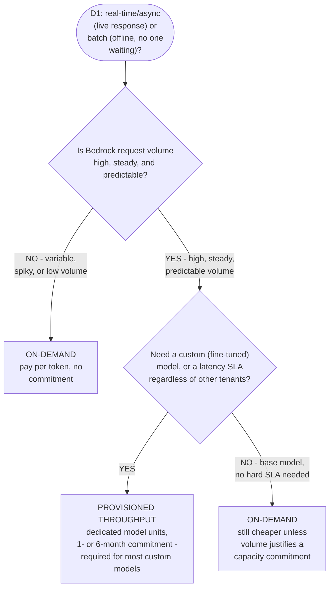
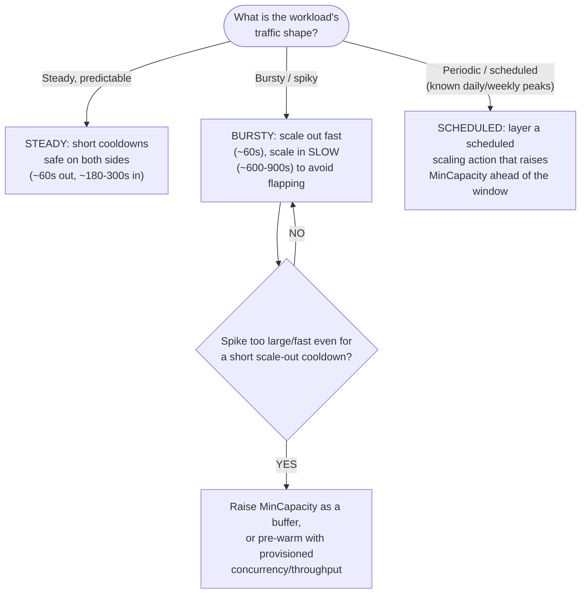
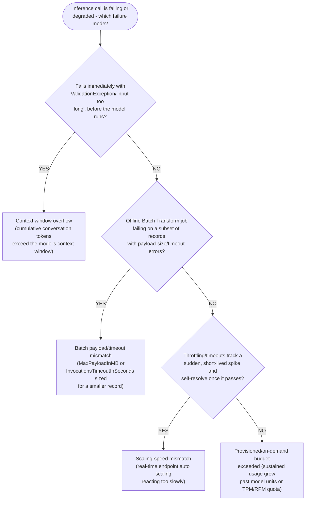
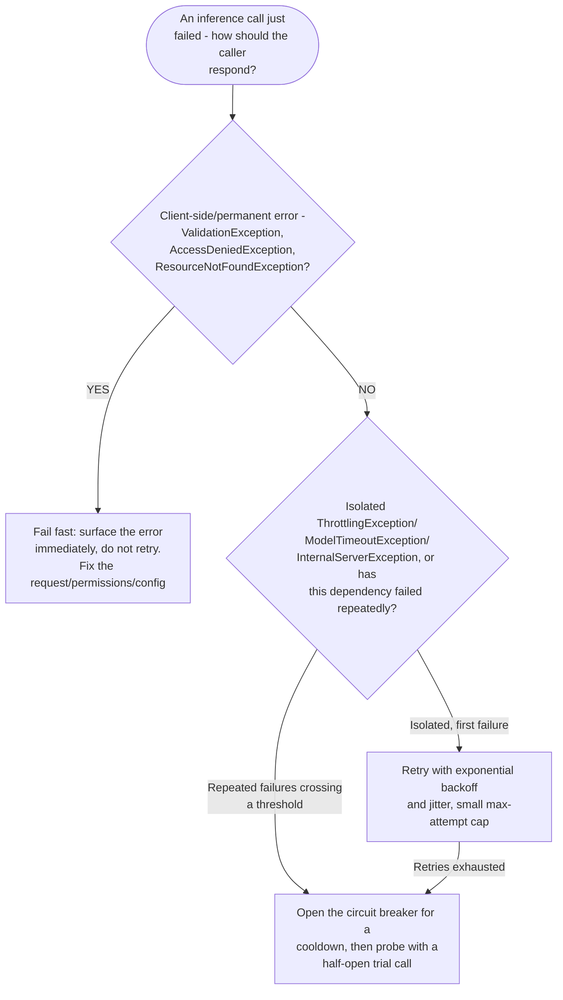
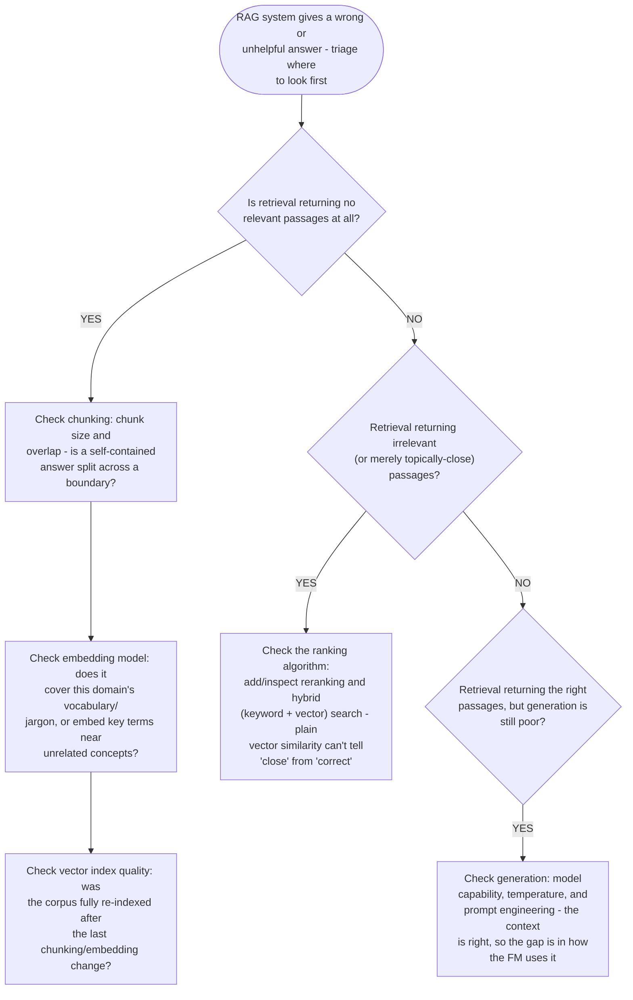
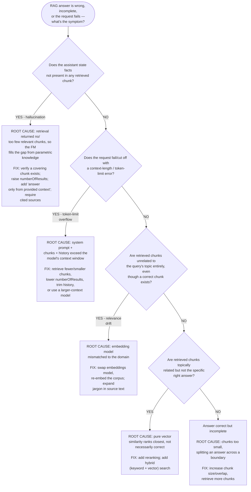
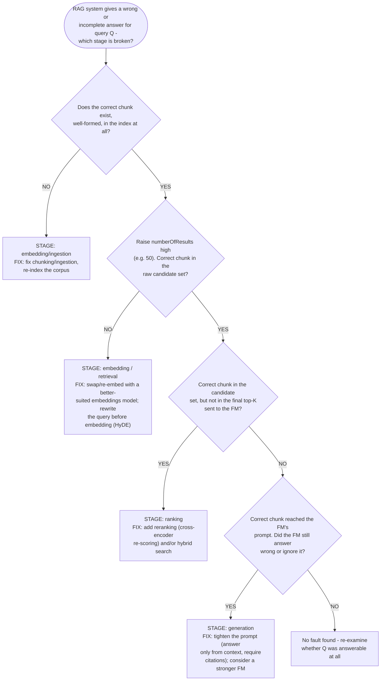

# Domain 3 Fast Track, Part 3: Production Deployment & Troubleshooting

**Condensed guide, part 3 of 3** · full guide: [`docs/domain-3-applications-of-foundation-models.md`](../domain-3-applications-of-foundation-models.md) (6,957 lines) · **Last verified:** 2026-09-05

## How to use this part

Domain 3 (Applications of Foundation Models) is too long — 6,957 lines
across 25 Mermaid diagrams and dozens of worked examples — for one
condensed guide, so its Fast Track is split into three parts. **[Part
1](part-1-application-design-and-customization.md)** and **[Part
2](part-2-inference-and-multimodal.md)** condense Sections 1-7 (design
considerations, prompt engineering, RAG fundamentals, customization
trade-offs, Bedrock inference architecture, Guardrails and
prompt-injection prevention, vector databases/embeddings, multi-modal
application patterns, and evaluation). **This part**
covers what happens *after* a foundation model application ships: the
infrastructure choices behind production deployment (Section 8), how
real-time endpoints and batch jobs fail once traffic outgrows their
original sizing, the retry/circuit-breaker patterns that keep a calling
application resilient, and the RAG-specific troubleshooting triage flow
for chunking, embedding, ranking, and generation failures.

It keeps **every testable fact** from the source — the Trainium/Inferentia
split, every auto-scaling knob, all four inference-failure scenarios, all
three resilience strategies, and all four RAG failure modes — as compact
decision trees and tables instead of full worked-example narration. Every
section links back to the corresponding section of the full guide for the
complete scenario, remediation/prevention bullets, and exam tips.

**Where each section comes from:**

| This part | Full guide section | Approx. full-guide lines |
|---|---|---|
| 1. AWS infrastructure for generative AI | [Section 8](../domain-3-applications-of-foundation-models.md#8-aws-infrastructure-for-generative-ai-workloads) | 4224-4267 |
| 2. Bedrock throughput decision flow | [Section 8](../domain-3-applications-of-foundation-models.md#8-aws-infrastructure-for-generative-ai-workloads) | 4268-4300 |
| 3. Auto-scaling decision guide | [SageMaker endpoint auto-scaling](../domain-3-applications-of-foundation-models.md#sagemaker-endpoint-auto-scaling-a-parameter-tuning-decision-guide) | 4301-4409 |
| 4. Inference failure triage (4 scenarios) | [Inference failures and recovery strategies](../domain-3-applications-of-foundation-models.md#inference-failures-and-recovery-strategies) | 4452-4878 |
| 5. Resilience patterns | [Inference error handling and resilience patterns](../domain-3-applications-of-foundation-models.md#inference-error-handling-and-resilience-patterns) | 4881-5113 |
| 6. RAG troubleshooting (4 failure modes) | [Worked example: troubleshooting a failing RAG system](../domain-3-applications-of-foundation-models.md#worked-example-troubleshooting-a-failing-rag-system) | 5190-5386 |
| 7. RAG symptom decision tree | [Decision tree: diagnosing RAG retrieval failures](../domain-3-applications-of-foundation-models.md#decision-tree-diagnosing-rag-retrieval-failures) | 5387-5421 |
| 8. Debugging method (stage isolation) | [Debugging method: isolating the broken pipeline stage](../domain-3-applications-of-foundation-models.md#debugging-method-isolating-the-broken-pipeline-stage) | 5423-5494 |

## Table of contents

- [1. AWS infrastructure for generative AI workloads](#1-aws-infrastructure-for-generative-ai-workloads)
- [2. Bedrock throughput: on-demand vs. provisioned decision flow](#2-bedrock-throughput-on-demand-vs-provisioned-decision-flow)
- [3. SageMaker endpoint auto-scaling decision guide](#3-sagemaker-endpoint-auto-scaling-decision-guide)
- [4. Inference failure triage: four production scenarios](#4-inference-failure-triage-four-production-scenarios)
- [5. Resilience patterns: retry, backoff, circuit breaker](#5-resilience-patterns-retry-backoff-circuit-breaker)
- [6. RAG troubleshooting triage: four failure modes](#6-rag-troubleshooting-triage-four-failure-modes)
- [7. RAG symptom-to-root-cause decision tree](#7-rag-symptom-to-root-cause-decision-tree)
- [8. Debugging method: isolating the broken RAG pipeline stage](#8-debugging-method-isolating-the-broken-rag-pipeline-stage)
- [Pre-launch production checklist](#pre-launch-production-checklist)
- [Error-code cheat sheet](#error-code-cheat-sheet)
- [Rapid-fire key terms](#rapid-fire-key-terms)
- [Rapid self-check](#rapid-self-check)
- [Common exam traps checklist](#common-exam-traps-checklist)
- [Cross-domain connections](#cross-domain-connections)
- [Where to go deeper](#where-to-go-deeper)

---

## 1. AWS infrastructure for generative AI workloads

| Component | Purpose-built for | Access pattern | Exam-tested pairing |
|---|---|---|---|
| **Amazon SageMaker JumpStart** | A hub of pretrained foundation models + solution templates, deployable/fine-tunable with more control over hosting than Bedrock's managed API | Deploy to a specific instance type, or a model not on Bedrock | "More control over hosting/customization than Bedrock" |
| **AWS Trainium** | High-performance, cost-efficient **training** of deep learning/foundation models at scale | Amazon EC2 **Trn1/Trn2** instances | "Pretrain/train a custom FM from scratch, minimize training cost" |
| **AWS Inferentia** | High-throughput, low-latency, cost-efficient **inference** | Amazon EC2 **Inf1/Inf2** instances | "Serve production inference, minimize per-request cost/latency" |

- [ ] Both chip families are purpose-built AWS silicon (not general-purpose
      GPUs), programmed via the **AWS Neuron SDK**, and compatible with
      PyTorch/TensorFlow. Their entire selling point is **lower cost at
      high scale** versus generic GPU EC2 instances.
- [ ] **Memorize the split exactly** — the exam tests it directly:
      **Trainium → training**, **Inferentia → inference**. Never reversed.
- [ ] A scenario that trains from scratch on Trn1 and serves on Inf2, while
      a *different* team fine-tunes an openly available model without
      managing infrastructure at all, is testing whether you can place
      **SageMaker JumpStart** in that third role (managed fine-tuning/hosting)
      rather than reaching for raw EC2 + Neuron SDK for every workload.

**AWS example, condensed:** an AI startup pretrains a custom foundation
model from scratch on **EC2 Trn1** (Trainium) to minimize training cost at
scale, then deploys it for production inference on **EC2 Inf2**
(Inferentia2) for low per-request latency and cost. A different team at
the same company fine-tunes an openly available model via **SageMaker
JumpStart** instead of managing that infrastructure directly — three
distinct roles for three distinct tools, all in the same organization.

Full explanation and AWS example: [full guide, Section
8](../domain-3-applications-of-foundation-models.md#8-aws-infrastructure-for-generative-ai-workloads).

---

## 2. Bedrock throughput: on-demand vs. provisioned decision flow

The Domain 1 real-time/batch/asynchronous/serverless inference-type
decision has a Bedrock-specific version: once you know the workload needs
low-latency synchronous inference or high-throughput offline scoring, a
second question decides **on-demand vs. provisioned throughput** pricing.



- [ ] The three deciding factors are always the same three: **traffic
      predictability**, **latency guarantee needed**, and **cost model**
      (flat-rate commitment vs. pay-per-token).
- [ ] **Custom/fine-tuned model almost always forces provisioned
      throughput** — that's the single fastest tell in a scenario.

**All four deployment patterns side by side** (the full picture behind the
flowchart above — real-time/on-demand and provisioned throughput are the
two Bedrock-specific branches; batch and serverless are the other two
Domain 1 inference types applied to the same decision):

| Pattern | Latency | Cost model | Scaling | Typical use case |
|---|---|---|---|---|
| **Batch** | Minutes to hours, no live request | Pay only for the job's compute duration | Fixed-size job, no persistent endpoint | Nightly scoring runs, large offline reports |
| **Serverless** | Low, but a cold-start delay after idle periods | Pay-per-request, auto-scales to zero when idle | Fully automatic, no capacity to size | Bursty/low-volume traffic, dev/test endpoints |
| **Real-time / on-demand** | Low, persistent endpoint, no cold start | Pay per request/token, no capacity commitment | Auto-scaling persistent endpoint | Live chat, interactive apps, variable production traffic |
| **Provisioned throughput** | Lowest, guaranteed SLA regardless of other traffic | Flat-rate dedicated capacity, 1- or 6-month commit | Fixed capacity sized and paid for up front | Production traffic for a fine-tuned model, high-volume steady workloads |

- [ ] The same three questions decide among all four, whichever vocabulary
      a scenario uses: **does anything wait on the response** (batch vs.
      everything else), **how predictable is the traffic** (serverless vs.
      real-time/provisioned), and **does volume, a custom model, or an SLA
      justify a capacity commitment** (real-time/on-demand vs. provisioned
      throughput).

Full four-way flowchart: [cross-domain concept map's inference deployment
pattern
comparison](../cross-domain-concept-map.md#inference-deployment-pattern-comparison).
Full explanation: [full guide, Section
8](../domain-3-applications-of-foundation-models.md#8-aws-infrastructure-for-generative-ai-workloads).

---

## 3. SageMaker endpoint auto-scaling decision guide

Every real-time endpoint auto-scaling policy (via **Application Auto
Scaling**) is five knobs: **target metric** (usually
`SageMakerVariantInvocationsPerInstance`, or CPU/GPU utilization for
compute-bound workloads), **target value**, **scale-out cooldown**,
**scale-in cooldown**, and **MinCapacity/MaxCapacity**.

**The core trade-off:** shorter cooldown = faster reaction but risks
flapping; longer cooldown = no flapping but slower reaction. The right
value depends on traffic *shape*, not a universal "best practice" number:



> **Exam tip:** The asymmetry is the tested idea — bursty traffic needs a
> **longer scale-in** cooldown, not a longer scale-out cooldown too. A
> workload should scale out quickly while still scaling in slowly. Steady
> traffic is the *only* profile where short cooldowns on both sides are
> safe.

**Worked example, condensed:** a fine-tuned chatbot endpoint (`ml.g5.xlarge`,
single instance ceiling ~650 invocations/minute) sees bursty traffic —
quiet outside business hours, sudden spikes on a promotional email.

| Parameter | Chosen value | Why |
|---|---|---|
| Target value | 450 invocations/instance/minute | ~70% of the measured ceiling, leaving headroom while new capacity launches |
| Scale-out cooldown | 60 seconds | Bursty traffic needs capacity added quickly |
| Scale-in cooldown | 900 seconds | Long enough that a brief lull mid-spike doesn't trigger a premature scale-in (flapping) |
| MinCapacity / MaxCapacity | 2 / 12 | Covers quiet-period baseline without paying for idle peak capacity; sized to the largest observed spike |

When a promotional email drives traffic from ~800 to ~4,000
invocations/minute, the policy needs `ceil(4000 / 450) = 9` instances to
keep each instance under threshold — inside the MaxCapacity ceiling of 12.
**Contrast:** a steady-traffic workload with the same instance profile
would use a much shorter scale-in cooldown (~180-300 seconds) on both
sides — a 900-second cooldown there would just leave it over-provisioned
(and over-billed) after every genuine drop in demand.

**Common auto-scaling problems, condensed:**

| Symptom | Likely cause | Fix |
|---|---|---|
| Scales out, back in, then out again within minutes (flapping) | Scale-in cooldown too short | Lengthen the scale-in cooldown |
| Instance count keeps climbing but rarely comes back down | Two+ target-tracking policies attached; Application Auto Scaling only scales *in* when every policy agrees | Reconcile/remove the conflicting policy; confirm elevated CPU isn't background/health-check load |
| Throttles/times out for the first minute of a spike, then recovers | Target threshold too close to real ceiling and/or scale-out cooldown too long | Lower the threshold, shorten the scale-out cooldown |
| Sits at MaxCapacity during ordinary traffic, driving up cost | Min/MaxCapacity sized from one historical peak, not typical load | Re-baseline against current traffic patterns |
| Instance count rises/falls on a predictable daily pattern despite correct target tracking | A calendar-predictable event is scaled for reactively | Layer a **scheduled scaling action** on top of target tracking |

Full worked example (customer-support chatbot, `ml.g5.xlarge`, target
450 invocations/instance/minute, MinCapacity 2/MaxCapacity 12) and mini-quiz:
[full guide, SageMaker endpoint
auto-scaling](../domain-3-applications-of-foundation-models.md#sagemaker-endpoint-auto-scaling-a-parameter-tuning-decision-guide).

---

## 4. Inference failure triage: four production scenarios

A deployment that works fine under the traffic it was originally sized
for starts failing only once the *shape* of the workload changes. Triage
by asking these questions, in order:



**One line of diagnosis per scenario:**

- **Scenario 1 (real-time endpoint, flash sale):** a tenfold spike in two
  minutes overwhelms two `ml.g5.xlarge` instances before CloudWatch
  aggregates enough data points, the scale-out cooldown elapses, and a new
  instance finishes launching and loading the model — easily several
  minutes of reaction chain a two-minute spike outruns.
- **Scenario 2 (Batch Transform, mixed payload sizes):** default
  `MaxPayloadInMB`/`InvocationsTimeoutInSeconds` are tuned for short
  product descriptions; a manifest mixed with full articles changes both
  sides of that budget at once, so some records exceed the payload size
  and others exceed the timeout.
- **Scenario 3 (chatbot, context window):** the `Converse`/`InvokeModel`
  API is stateless, so the client resends the full transcript every turn;
  a session that pastes in large logs adds thousands of tokens in one turn,
  and the very next call fails once the running total crosses the model's
  context-window ceiling.
- **Scenario 4 (document-analysis service, gradual rollout):** Provisioned
  Throughput model units (or an on-demand TPM/RPM quota) were sized once,
  at launch, for the traffic the team expected then; steady month-over-month
  adoption growth eventually pushes sustained demand above that fixed
  ceiling, with no single spike to point to.

**The four scenarios, condensed to symptom / root cause / fix:**

| Deployment pattern | Symptom | Root cause | Fix |
|---|---|---|---|
| Real-time endpoint | Throttling/timeouts during a sudden traffic spike, recovering once traffic subsides | Auto scaling reacts too slowly (alarm evaluation, cooldown, instance launch/model load) for how fast demand changed | Tighten the auto-scaling policy (lower threshold, shorter scale-out cooldown); raise minimum instance count; use provisioned concurrency to pre-warm capacity |
| Batch Transform job | Per-record payload-size or timeout errors on a subset of unusually large records | Default `MaxPayloadInMB`/`InvocationsTimeoutInSeconds` sized for a smaller typical record no longer fits the larger ones | Lower `MaxPayloadInMB` and use `SingleRecord` strategy for large records; raise `InvocationsTimeoutInSeconds`; split the job by payload size; adjust instance size/`MaxConcurrentTransforms` |
| Long-running conversation | `ValidationException`/"input too long" only after many turns, or incoherent answers once naive truncation kicks in | Cumulative conversation tokens (system prompt + full history + latest turn) exceed the model's context window | Sliding-window truncation that preserves the system prompt; rolling summarization of older turns; chunk-and-retrieve for large pasted content instead of inlining it; move to a larger-context-window model |
| Provisioned/on-demand workload | Rising `ThrottlingException`/`ServiceQuotaExceededException` that tracks gradual usage growth, not a single spike | Provisioned Throughput model units or on-demand TPM/RPM quota sized below current sustained demand | Request a Service Quota increase; purchase additional Provisioned Throughput model units; add client-side rate limiting/backoff; set CloudWatch budget alarms; offload lower-priority volume to batch or a cheaper model |

- [ ] **Capacity failures** (scenarios 1 and 2) are about *sizing for a
      shape of traffic*; **token-budget failures** (scenarios 3 and 4)
      are about a *ceiling on tokens over time*. Neither is fixed by
      fine-tuning or prompting — the request either never reaches the
      model, or is throttled before/without regard to what the model
      would have produced.
- [ ] **Spike vs. gradual growth is the tell between scenarios 1 and 4** —
      a dramatic, short-lived surge that self-resolves is a
      scaling-speed problem (tune auto scaling); a slow climb over weeks
      that never drops back is a budget-sizing problem (raise the quota
      or purchase more capacity).
- [ ] Retrying a throttled request never helps scenario 4 — the
      constraint is aggregate throughput over time, so every retry
      competes for the same already-exhausted budget.

**Remediation checklist, by scenario:**

- **Scaling-speed mismatch (Scenario 1):** tighten the auto-scaling policy
  (lower threshold, shorter scale-out cooldown, unchanged/longer scale-in
  cooldown); raise the minimum instance count ahead of a known peak; use
  provisioned concurrency to pre-warm capacity for bursty, predictable
  spikes; add a request queue or graceful degradation so requests arriving
  mid-scale-out don't hit a hard throttling error.
- **Batch payload/timeout mismatch (Scenario 2):** lower `MaxPayloadInMB`
  and switch `BatchStrategy` to `SingleRecord` for large records; raise
  `InvocationsTimeoutInSeconds` (up to Batch Transform's 3,600-second max);
  split the input by document size into separate jobs, each tuned to its
  own payload profile; scale up instance type/count or lower
  `MaxConcurrentTransforms` if timeouts trace to compute contention.
- **Context window overflow (Scenario 3):** track input tokens client-side
  before sending; truncate with a sliding window that preserves the system
  prompt, not a fixed cut; summarize older turns instead of discarding
  them; chunk-and-retrieve large pasted content instead of inlining it;
  move to a larger-context-window model if truncation loses too much.
- **Provisioned/on-demand budget exceeded (Scenario 4):** request a
  Service Quota increase for on-demand TPM/RPM; purchase additional
  Provisioned Throughput model units sized for the new sustained baseline;
  add client-side rate limiting and request queuing with backoff; set
  graduated CloudWatch budget alarms (e.g., 70/85/95% of the ceiling);
  offload lower-priority volume to batch inference or a smaller model.

**Prevention habits that apply across all four:** load-test scaling
policies and batch jobs against realistic traffic/payload shapes before a
known peak event; dashboard the relevant metric (invocations-per-instance,
record-size distribution, running token count, budget-ceiling usage)
*before* it crosses a threshold, not just after errors start; and tie
capacity/quota review to a recurring calendar cadence or a rollout
milestone rather than a one-time, launch-day estimate.

Full four-scenario walkthroughs (diagnosis, remediation, prevention, exam
tips) and the orientation flowchart: [full guide, Inference failures and
recovery
strategies](../domain-3-applications-of-foundation-models.md#inference-failures-and-recovery-strategies).

---

## 5. Resilience patterns: retry, backoff, circuit breaker

Diagnosing *why* a call failed is half the problem; the calling
application still has to decide, in code, what to do about it.

| Strategy | Behavior | Best fit | Risk if misapplied |
|---|---|---|---|
| **Immediate retry** | Re-sends the same request right away, small fixed number of times, no delay | A truly transient, sub-second blip (dropped connection, single-packet glitch) | Applied to a sustained failure, it adds load to an already-struggling dependency, worsening the outage |
| **Exponential backoff (with jitter)** | Bounded retries with progressively longer waits (e.g., doubling delay), randomized jitter each time | `ThrottlingException`, transient `ModelTimeoutException`, brief `InternalServerException`/`ServiceUnavailableException` | No jitter → many clients retry in lockstep, looking like a new spike; no cap → a permanent error retries forever |
| **Circuit breaker** | Tracks recent failure rate; once it crosses a threshold, "opens" and fails every call immediately (no request sent) for a cooldown, then probes with a "half-open" trial call | A dependency failing hard and consistently, not just intermittently | Too-aggressive threshold/cooldown trips on ordinary transient noise, failing fast instead of riding out a brief blip |

Backoff and circuit breakers are complementary: backoff governs *how one
caller retries one request*; the circuit breaker governs *whether the
caller attempts new requests at all*. Production clients typically layer
both.

**Choosing a strategy by error type:**



- [ ] **Permanent errors are never retried** — `ValidationException`,
      `AccessDeniedException`, `ResourceNotFoundException` fail identically
      every time; retrying only burns calls/quota.
- [ ] **A dependency that keeps failing across many consecutive calls**
      points to a circuit breaker, not a bigger retry budget — more
      retries against an overloaded dependency only prolongs the outage.
- [ ] Full jitter (draw the wait uniformly between `0` and the doubled
      delay each attempt) is what prevents synchronized retry storms;
      most AWS SDKs (e.g., boto3 `Config(retries={"mode": "adaptive"})`)
      already implement this — reach for the SDK's built-in retry mode
      before hand-rolling a loop.

**Retryable Bedrock error codes** (per the pseudocode's `RETRYABLE_ERROR_CODES`):
`ThrottlingException`, `ModelTimeoutException`, `InternalServerException`,
`ServiceUnavailableException`, `ModelNotReadyException`. Everything else
(`ValidationException`, `AccessDeniedException`, `ResourceNotFoundException`)
fails fast instead.

**Worked example, condensed:** a document-summarization service calling
Bedrock `InvokeModel` directly implements **full jitter** — a base delay
that doubles every attempt, with the actual wait drawn uniformly between
zero and that doubled value, capped and bounded at 5 attempts:

| Attempt | Uncapped delay before jitter | Jittered wait (drawn uniformly from) |
|---|---|---|
| 1 (after 1st failure) | 0.5s | 0.0s – 0.5s |
| 2 (after 2nd failure) | 1.0s | 0.0s – 1.0s |
| 3 (after 3rd failure) | 2.0s | 0.0s – 2.0s |
| 4 (after 4th failure) | 4.0s | 0.0s – 4.0s |
| 5th failure | — | fails fast (max attempts reached); surfaces the error to the caller |

```
function call_with_backoff(request, max_attempts, base_delay, max_delay):
    for attempt in 1..max_attempts:
        try:
            return send(request)
        catch error:
            if not is_transient(error) or attempt == max_attempts:
                raise error
            uncapped = base_delay * 2^(attempt - 1)
            delay = random_uniform(0, min(uncapped, max_delay))
            sleep(delay)
    raise error
```

> **Exam tip:** If the fix is "stop calling it for a while" rather than
> "retry harder," that's a **circuit breaker** — failed calls after it
> trips return an error *immediately, without attempting the request*.
> Spacing out a bounded number of retries with increasing delay for a
> single failing request is **exponential backoff**, not a circuit
> breaker.

Full worked example (a real `invoke_with_backoff` implementation against
Bedrock `InvokeModel`, with a jittered-delay table) and the immediate-retry
and circuit-breaker pseudocode: [full guide, Inference error handling and
resilience
patterns](../domain-3-applications-of-foundation-models.md#inference-error-handling-and-resilience-patterns).

---

## 6. RAG troubleshooting triage: four failure modes

A live, underperforming RAG system fails in one of a small number of
recognizable ways — the exam expects you to map the symptom to the
pipeline stage, not just recite "use RAG."



**One memorable vignette per failure mode** (same HR policy-lookup
assistant throughout):

- **Chunks too small:** "How many weeks of parental leave do I get and do
  I need to use vacation days first?" gets answered ("12 weeks") while the
  vacation-day interaction, one sentence later in the same handbook
  paragraph, is dropped entirely — the chunk boundary fell mid-paragraph.
- **Embedding model mismatch:** "Does PTO carry over across the FY
  boundary?" retrieves passages about *performance reviews*, not paid time
  off — the general-purpose embeddings model was never exposed to the
  company's internal abbreviations, so it embeds "PTO"/"FY" near unrelated
  general-English concepts instead of "vacation."
- **Plausible but irrelevant (ranking):** "What's the process for
  expensing a conference registration fee?" confidently answers using a
  chunk about *travel* expenses — genuinely close in vector space, just
  the wrong policy — because plain vector similarity can't distinguish
  "close enough to retrieve" from "the one that actually answers this."
- **Terminology mismatch:** "Can I get reimbursed for a client dinner?"
  returns no useful chunks at all, even though a section titled "Business
  Meal Expense Policy" answers exactly this — a short casual **question**
  doesn't always land near a long formal **policy statement** in a
  bi-encoder's vector space, even when embeddings otherwise handle the
  domain's vocabulary fine.

**The four failure modes, condensed to symptom / root cause / fix:**

| Symptom | Root cause | Fix |
|---|---|---|
| Answer is correct but incomplete, cuts off mid-explanation | Chunks too small / split a self-contained answer across a chunk boundary | Increase chunk size, add chunk overlap, retrieve more chunks |
| Retrieved chunks are unrelated to the query's actual topic | Embedding model doesn't understand domain-specific vocabulary | Swap to a better-suited embeddings model and re-embed the corpus; expand jargon/abbreviations in source text |
| Retrieved chunks are topically related but not the specific right answer | Vector similarity alone can't distinguish "close" from "correct" | Add reranking; add hybrid (keyword + vector) search |
| Retrieval returns nothing relevant even though a clearly-worded answer exists in the corpus | Query/document terminology mismatch — a question embeds differently than the statement that answers it | Rerank a wider candidate set; rewrite/expand the query before embedding (e.g., HyDE); index likely question phrasings alongside each chunk |

- [ ] **Failure mode 2 vs. 3, the fastest disambiguator:** if the wrong
      chunks are *topically unrelated* (performance reviews instead of
      PTO), that's the **embedding model**. If they're *topically close
      but still wrong* (travel expenses instead of conference expenses),
      that's a **ranking** problem — reranking/hybrid search, not a model
      swap.
- [ ] **Failure mode 4 is not failure mode 2** — the embeddings model
      handles the domain's vocabulary fine; the gap is a short casual
      **question** vs. a long formal **policy statement**, which
      symmetric bi-encoder embeddings don't always bridge. Fix with
      reranking (cross-encoders score query+chunk together), query
      rewriting (HyDE), or indexing likely question phrasings alongside
      chunks — not another embeddings-model swap.
- [ ] **Fine-tuning the FM fixes none of these four** — all four failure
      modes live in the retrieval half of the pipeline, before the FM
      ever sees a prompt.

**Remediation checklist, by failure mode:**

- **Chunks too small:** increase chunk size and add chunk overlap so
  related sentences are less likely to split across a boundary; re-index
  the Knowledge Base after the change; test whether a higher
  `numberOfResults` on the `Retrieve` call recovers the missing half of an
  answer.
- **Embedding model mismatched to the domain:** swap to a Bedrock
  embeddings model better suited to the domain and **re-embed the entire
  corpus** — embeddings models aren't interchangeable after the fact, and
  queries must be embedded with the same model going forward; where a
  wholesale swap isn't practical, expand internal abbreviations in the
  source documents before chunking as a lower-cost mitigation.
- **Plausible but irrelevant results (ranking):** add reranking so a
  relevance-scoring model re-orders vector-search candidates before
  generation; add hybrid search (vector + keyword/lexical, via Amazon
  OpenSearch) so an exact term match surfaces the right chunk even when
  its embedding sits close to a different topic.
- **Query/document terminology mismatch:** rerank a wider candidate set
  (raise `numberOfResults` before narrowing) — cross-encoder rerankers
  score query and chunk together, so they're far less sensitive to the
  question-vs-statement asymmetry than pure vector similarity; rewrite the
  query before embedding (HyDE — embed a generated hypothetical answer
  instead of the raw question); index likely question phrasings alongside
  each chunk at ingestion time.

Full four-failure-mode walkthroughs (diagnosis and remediation detail for
each, against the same HR policy-lookup assistant) and the orientation
flowchart: [full guide, Worked example: troubleshooting a failing RAG
system](../domain-3-applications-of-foundation-models.md#worked-example-troubleshooting-a-failing-rag-system).

---

## 7. RAG symptom-to-root-cause decision tree

The four failure modes above assume you already know retrieval is at
fault. A real symptom — hallucination, a token-limit error, off-topic
chunks, a plausible-but-wrong answer, or a truncated answer — has to be
worked backward to the broken stage:



- [ ] **Hallucination in an otherwise-working RAG system almost always
      means retrieval came back empty or thin** — the fix lives in
      retrieval coverage and prompt instructions, never in fine-tuning
      the model to "hallucinate less."
- [ ] **Token-limit/context-length errors are a budgeting problem, not a
      retrieval-quality problem** — fixed by retrieving less (fewer/smaller
      chunks, lower `numberOfResults`, trimmed history), or a
      larger-context model, not by retrieving differently.
- [ ] The five symptoms above map to five *different* fixes; a scenario
      testing this decision tree is checking that you don't reach for
      "add reranking" (the fix for symptom 4) when the actual symptom is
      hallucination (symptom 1) or vice versa.

Full decision tree with all branch detail and exam tip: [full guide,
Decision tree: diagnosing RAG retrieval
failures](../domain-3-applications-of-foundation-models.md#decision-tree-diagnosing-rag-retrieval-failures).

---

## 8. Debugging method: isolating the broken RAG pipeline stage

Given one failing query and no known symptom category, work the pipeline
in strict order — confirming each earlier stage is innocent before
spending effort on the next:

1. **Embedding/ingestion** — does the correct chunk exist, well-formed,
   in the index at all? If not, the fault is upstream of retrieval
   entirely (ingestion/chunking), not an embeddings-model problem.
2. **Retrieval** — raise `numberOfResults` high (e.g., 50) and inspect
   the raw `Retrieve` output. If the correct chunk never appears, even at
   rank 50, the fault is embedding/retrieval — a domain-mismatched
   embeddings model or a query/document terminology mismatch. No amount
   of reranking or prompt tuning recovers a chunk retrieval never surfaced.
3. **Ranking** — is the correct chunk in that wide candidate set but not
   in the final top-K sent to the FM? If so, the fault is ranking, not
   embedding/retrieval — plain vector-distance ordering put the right
   chunk too low. **Reranking** and **hybrid search** close exactly this
   gap.
4. **Generation** — did the correct chunk actually reach the FM's prompt,
   and did the FM still answer wrong? If the chunk is right there in
   context and the FM ignores, contradicts, or answers outside it, the
   fault is generation (prompting or model capability) — the one stage
   none of the retrieval-side fixes (chunking, embeddings, reranking,
   hybrid search, query rewriting) can touch.



> **Exam tip:** Work the pipeline **embedding/indexing → retrieval →
> ranking → generation**, in that order, instead of guessing. A chunk
> missing at a wide `numberOfResults` points to **embedding/retrieval**;
> retrievable-but-not-top-K points to **ranking** (reranking or hybrid
> search); reached-the-prompt-but-still-wrong points to **generation** —
> the only stage none of RAG's retrieval-side fixes can touch.

Full step-by-step walkthrough: [full guide, Debugging method: isolating
the broken pipeline
stage](../domain-3-applications-of-foundation-models.md#debugging-method-isolating-the-broken-pipeline-stage).

---

## Pre-launch production checklist

A consolidated checklist pulling together Sections 1-8 into what a team
should have in place *before* a foundation model application goes live,
grouped by the failure category it heads off:

**Capacity and scaling**

- [ ] Auto-scaling target metric matches how the workload actually
      generates load (`SageMakerVariantInvocationsPerInstance` for
      request-count-driven traffic; CPU/GPU utilization for compute-bound
      workloads).
- [ ] Scale-out and scale-in cooldowns are tuned to the workload's traffic
      *shape* (steady, bursty, or scheduled/periodic), not a single
      universal default.
- [ ] MinCapacity/MaxCapacity are re-baselined against current traffic,
      not the single highest historical spike.
- [ ] Known peak events (promotions, launches) have a load test against
      the tuned scaling policy, or a scheduled scaling action, ahead of
      time.
- [ ] Batch jobs have their `MaxPayloadInMB`/`InvocationsTimeoutInSeconds`
      profiled against the actual record-size distribution of each input
      source, not left at defaults tuned for a different content type.

**Resilience**

- [ ] Every Bedrock/SageMaker client call distinguishes retryable
      (transient) error codes from permanent ones, and never retries a
      `ValidationException`/`AccessDeniedException`/`ResourceNotFoundException`.
- [ ] Retries use exponential backoff with jitter and a bounded max-attempt
      count — never an unbounded or fixed-delay retry loop.
- [ ] A circuit breaker (or the SDK's adaptive retry mode) protects a
      dependency that's failing hard and consistently, so retries don't
      compound an existing outage.
- [ ] Conversation-carrying applications track token usage client-side and
      trigger truncation/summarization at a soft threshold, well before
      the model's hard context-window ceiling.
- [ ] CloudWatch budget alarms are set at graduated thresholds (e.g., 70/
      85/95%) on provisioned throughput or on-demand quota usage.

**RAG retrieval quality**

- [ ] A held-out set of real user questions is evaluated for retrieval
      quality (right chunks returned) *separately* from generation quality
      (right answer given the right chunks) — conflating the two makes a
      regression impossible to localize.
- [ ] Reranking and/or hybrid search is in place before launch for any
      corpus with topically adjacent content (the ranking failure mode is
      easy to miss until a real user asks a borderline question).
- [ ] The application instructs the FM to answer only from retrieved
      context and surfaces cited sources, so an ungrounded (hallucinated)
      answer is visible rather than silently confident.
- [ ] A process exists for re-embedding the corpus whenever the embeddings
      model changes — embeddings from two different models are not
      comparable in the same vector index.

---

## Error-code cheat sheet

A quick lookup for which exception maps to which failure mode covered
above — the exam frequently names the exact exception rather than
describing the symptom in plain English:

| Error / exception | Where it shows up | What it means | Retry? |
|---|---|---|---|
| `ValidationException` | Any `InvokeModel`/`Converse` call | Malformed input, or (per Scenario 3) the payload exceeds the model's context window | **No** — fix the request/payload first |
| `AccessDeniedException` | Any Bedrock/SageMaker call | Missing IAM permission or model access | **No** — fix permissions/model access |
| `ResourceNotFoundException` | Any Bedrock/SageMaker call | Bad model ID or ARN | **No** — fix the identifier |
| `ThrottlingException` | Real-time endpoint spike (Scenario 1); provisioned/on-demand budget exceeded (Scenario 4) | Request rate or throughput exceeds current capacity/quota | **Yes** — exponential backoff; open a circuit breaker if it's sustained |
| `ServiceQuotaExceededException` | On-demand access, Scenario 4 | Account/model TPM or RPM quota exceeded | **Yes**, but request a quota increase if it recurs |
| `ModelTimeoutException` / `InternalServerException` / `ServiceUnavailableException` | Any inference call | Transient server-side issue | **Yes** — exponential backoff with jitter |
| `ModelNotReadyException` | Any inference call | Model still loading/warming | **Yes** — exponential backoff |
| Per-record payload-size or timeout error | Batch Transform (Scenario 2) | `MaxPayloadInMB`/`InvocationsTimeoutInSeconds` too small for this record | N/A — resize the batch settings, not a per-request retry |

- [ ] **The permanent-vs-transient split from Section 5's decision
      flowchart is the same split this table sorts by column** — if you
      can name the exception, you can look up whether it belongs on the
      "fail fast" or "retry with backoff" side without re-deriving it.

---

## Rapid-fire key terms

- **AWS Trainium** — purpose-built chip for cost-efficient FM/deep-learning **training** (EC2 Trn1/Trn2).
- **AWS Inferentia** — purpose-built chip for high-throughput, low-latency, cost-efficient **inference** (EC2 Inf1/Inf2).
- **Amazon SageMaker JumpStart** — hub of pretrained FMs/templates for deployment with more hosting control than Bedrock.
- **Application Auto Scaling** — the service behind SageMaker real-time endpoint target-tracking policies.
- **Target tracking** — an auto-scaling policy that adds/removes capacity to hold a metric near a target value.
- **Scale-out / scale-in cooldown** — the wait after adding/removing capacity before scaling that direction again.
- **Flapping** — repeatedly scaling out and back in as a metric bounces near the threshold; fixed by a longer scale-in cooldown.
- **MinCapacity / MaxCapacity** — the floor/ceiling on instance count an auto-scaling policy can scale within.
- **Provisioned concurrency** — pre-warmed capacity that eliminates cold-start delay for bursty, predictable spikes.
- **SageMaker Batch Transform** — offline scoring service governed by `MaxPayloadInMB`, `BatchStrategy`, and `InvocationsTimeoutInSeconds`.
- **Context window overflow** — cumulative conversation tokens (system prompt + history + turn) exceeding the model's context window.
- **Sliding-window truncation** — dropping the oldest turns first while preserving the system prompt and recent turns.
- **Rolling summarization** — replacing older conversation turns with a short model-generated summary to save tokens.
- **Provisioned Throughput** — dedicated Bedrock model units purchased for a 1- or 6-month commitment, usually required for custom models.
- **Service Quota (TPM/RPM)** — the account/model-level ceiling on tokens- or requests-per-minute for on-demand Bedrock access.
- **Immediate retry** — resending a failed request right away with no delay; appropriate only for genuinely sub-second blips.
- **Exponential backoff with jitter** — progressively longer, randomized waits between a bounded number of retries.
- **Circuit breaker** — a state machine that stops sending new requests to a failing dependency for a cooldown, then probes with a half-open trial call.
- **Half-open state** — a circuit breaker's trial state after its cooldown, allowing one call through to test recovery.
- **Chunking** — splitting source documents into retrievable passages; too-small chunks split answers across boundaries.
- **Embedding model mismatch** — a general-purpose embeddings model never exposed to a domain's jargon, embedding it near unrelated concepts.
- **Reranking** — re-scoring retrieved candidates for relevance (often with a cross-encoder) before sending them to the FM.
- **Hybrid search** — combining vector (semantic) search with keyword/lexical search so exact-term matches surface.
- **HyDE (Hypothetical Document Embeddings)** — embedding a generated hypothetical answer instead of the raw query, to bridge question/statement phrasing mismatches.
- **Bi-encoder vs. cross-encoder** — bi-encoders embed query and chunk independently (fast, used for initial retrieval); cross-encoders score query+chunk together (slower, used for reranking).
- **`numberOfResults`** — the Bedrock `Retrieve`/`RetrieveAndGenerate` parameter controlling how many chunks are returned as candidates.

For the complete glossary: [full guide, Key terms
glossary](../domain-3-applications-of-foundation-models.md#key-terms-glossary).
For terms shared across domains: [`docs/master-glossary.md`](../master-glossary.md).

---

## Rapid self-check

Twenty quick recall questions — cover the answer column and try each one
before checking it. These are new questions, not a repeat of the full
guide's practice set.

| # | Question | Answer |
|---|---|---|
| 1 | Which purpose-built AWS chip targets **training**, and which targets **inference**? | **Trainium** → training; **Inferentia** → inference |
| 2 | A base (non-fine-tuned) Bedrock model with low, unpredictable traffic — on-demand or provisioned throughput? | **On-demand** — no steady/predictable volume to justify a commitment |
| 3 | Bursty traffic should use a short or long scale-**in** cooldown? | **Long** — a short scale-in cooldown causes flapping as the spike dips |
| 4 | A SageMaker endpoint keeps adding instances under load but rarely scales back down, even with correct target tracking — likely cause? | **Two or more target-tracking policies attached** — scale-in requires every policy to agree |
| 5 | A Batch Transform job fails only on unusually large records mid-manifest — which two settings to check first? | `MaxPayloadInMB` and `InvocationsTimeoutInSeconds` |
| 6 | A chatbot's request fails with `ValidationException` only after dozens of turns — root cause? | **Context window overflow** — cumulative tokens exceeded the model's context window |
| 7 | Throttling that tracks a gradual, weeks-long usage climb rather than a single spike — which failure mode? | **Provisioned/on-demand budget exceeded**, not a scaling-speed problem |
| 8 | Which retry strategy should never be used against a sustained, ongoing outage? | **Immediate retry** — it adds load to an already-struggling dependency |
| 9 | What does jitter in exponential backoff prevent? | Many clients retrying in **lockstep**, creating a synchronized new spike |
| 10 | A dependency has failed on many consecutive calls — retry harder, or open a circuit breaker? | **Circuit breaker** — more retries against an overloaded dependency prolongs the outage |
| 11 | A RAG answer is correct but cuts off mid-explanation — which failure mode? | **Chunks too small** — increase chunk size/overlap, retrieve more chunks |
| 12 | Retrieved chunks are about a completely unrelated topic — embedding problem or ranking problem? | **Embedding model mismatch** — chunks aren't even in the right neighborhood of vector space |
| 13 | Retrieved chunks are topically close but still the wrong specific answer — which fix? | **Reranking** and/or **hybrid search** |
| 14 | A clearly-worded answer exists in the corpus but retrieval returns nothing relevant, even at high `numberOfResults` — which failure mode? | **Query/document terminology mismatch** — fix with reranking a wider set, query rewriting (HyDE), or indexing likely question phrasings |
| 15 | A RAG system states a fact that appears in none of the retrieved chunks — which symptom, and where's the fix? | **Hallucination** — retrieval returned no/thin relevant chunks; fix is retrieval coverage and prompt instructions, not fine-tuning |
| 16 | A request fails or is cut off with a context-length/token-limit error in a RAG application — is this a chunking, embedding, or budgeting problem? | **Budgeting** — retrieve fewer/smaller chunks, lower `numberOfResults`, trim history, or use a larger-context model |
| 17 | Which two SageMaker Batch Transform settings govern the per-invocation payload/timeout budget? | `MaxPayloadInMB` and `InvocationsTimeoutInSeconds` (plus `BatchStrategy`) |
| 18 | A team wants dedicated capacity with a guaranteed latency SLA regardless of other Bedrock tenants' traffic — which throughput model? | **Provisioned throughput** |
| 19 | What's the fastest way to tell failure mode 2 (embedding mismatch) from failure mode 3 (ranking) in a RAG scenario? | Off-topic entirely → **embedding model**; topically close but wrong → **ranking** (reranking/hybrid search) |
| 20 | In the four-stage debugging method, which stage do you check *last*, and why? | **Generation** — every retrieval-side fix (chunking, embeddings, reranking, hybrid search, query rewriting) leaves this stage untouched, so it's only worth checking once the first three are confirmed innocent |

---

## Common exam traps checklist

- [ ] **Trainium is training, Inferentia is inference** — never reversed;
      this exact pairing is tested directly and frequently.
- [ ] **Custom/fine-tuned models almost always require provisioned
      throughput** — on-demand is the default answer only for base models
      with variable/unpredictable traffic.
- [ ] **Bursty traffic needs a longer scale-*in* cooldown, not a longer
      scale-*out* cooldown** — scaling out should stay fast even when
      scaling in is deliberately slow.
- [ ] **A "worked before, fails now" framing always points to a shape
      change** — traffic velocity (real-time endpoint), record size
      (batch job), conversation length (context window), or sustained
      volume (token budget) — not a generic "add more capacity" answer.
- [ ] **A spike that self-resolves once traffic subsides is a
      scaling-speed problem; a rising rate over weeks that never drops is
      a budget-sizing problem** — different scenarios, different fixes.
- [ ] **Retries only help transient errors** — `ValidationException`,
      `AccessDeniedException`, and `ResourceNotFoundException` fail
      identically no matter how many times they're retried.
- [ ] **Backoff governs one request's own retries; a circuit breaker
      governs whether any new request is attempted at all** — don't
      conflate the two when a scenario asks which pattern applies.
- [ ] **Fine-tuning the FM fixes none of the four RAG retrieval failure
      modes** — chunking, embedding, ranking, and terminology-mismatch
      problems all live before the FM ever sees a prompt.
- [ ] **Topically-unrelated chunks point to the embedding model; topically-
      close-but-wrong chunks point to ranking** — the fastest way to tell
      failure mode 2 from failure mode 3.
- [ ] **A terminology mismatch (casual question vs. formal policy text) is
      not the same failure as a domain-vocabulary gap** — the embeddings
      model can be perfectly suited to the domain and still miss a
      question/statement asymmetry; the fix is reranking, query rewriting
      (HyDE), or indexing likely question phrasings, not another
      embeddings-model swap.
- [ ] **Hallucination in RAG means "retrieval failed," not "the model
      needs fine-tuning to hallucinate less"** — always check retrieval
      coverage first.
- [ ] **Token-limit/context-length errors are a budgeting problem** —
      solved by retrieving less or moving to a larger-context model, never
      by retrieving *differently* (that's a ranking fix, for a different
      symptom).
- [ ] **Work the RAG pipeline in order — embedding, retrieval, ranking,
      generation** — confirming each stage is innocent before diagnosing
      the next, rather than guessing which of the four to fix first.
- [ ] **Batch, serverless, real-time/on-demand, and provisioned throughput
      are four points on one decision, not four unrelated services** —
      whether something waits on the response, how predictable traffic is,
      and whether volume/a custom model/an SLA justifies a capacity
      commitment sorts all four every time.
- [ ] **A held-out evaluation set must score retrieval and generation
      separately** — a single end-to-end "does the answer look right"
      score can't tell you whether to fix the retriever or the prompt.
- [ ] **Embeddings from two different models are never comparable in the
      same vector index** — swapping embeddings models always means a
      full corpus re-embed and re-index, not an incremental patch.

---

## Cross-domain connections

| Connects to | Shared concept | Why they're easy to conflate |
|---|---|---|
| [Domain 1](../domain-1-fundamentals-of-ai-and-ml.md) inference-type decision (real-time/batch/async/serverless) | The Bedrock on-demand vs. provisioned throughput choice is the generative-AI-specific version of the same trade-off | Both weigh traffic predictability, latency guarantees, and cost model — a scenario can test either framing over the same underlying facts |
| [Domain 5, Section 1](../domain-5-security-compliance-governance.md#1-securing-ai-systems) | A runaway retry loop turning a brief blip into a self-inflicted traffic spike | Domain 3 covers the resilience *pattern* (backoff, circuit breaker); Domain 5 covers the security/cost consequence of getting it wrong |
| Full guide, [Section 3](../domain-3-applications-of-foundation-models.md#3-retrieval-augmented-generation-rag-and-amazon-bedrock-knowledge-bases) | RAG pipeline fundamentals (chunking, embedding, retrieval, generation) | This part assumes the happy-path pipeline from Section 3 and diagnoses it once it's already in production |
| Full guide, [Section 7](../domain-3-applications-of-foundation-models.md#7-evaluating-foundation-model-performance) | Separating retrieval quality from generation quality when evaluating a RAG system | The stage-isolation debugging method (Section 8 above) is the troubleshooting-time version of the same evaluation split |
| Full guide, [Cost governance](../domain-3-applications-of-foundation-models.md#cost-governance-bounding-per-request-cost-with-max-tokens-and-provisioned-throughput) | On-demand vs. provisioned throughput cost trade-offs | Scenario 4's provisioned/on-demand budget failure is the operational failure mode of the cost-governance decision made up front |
| Full guide, [Context-window token-budget worked example](../domain-3-applications-of-foundation-models.md#worked-example-estimating-a-context-window-token-budget) | Estimating token budgets up front | Scenario 3's context-window overflow is what happens when that up-front budget is exceeded at runtime, not estimated wrong |
| [Domain 1, Section 6](../domain-1-fundamentals-of-ai-and-ml.md#6-model-evaluation-basics) | Evaluating retrieval vs. generation separately | Both this part's RAG stage-isolation method and Domain 1's evaluation metrics rest on the same principle: never let one aggregate score hide which half of a pipeline actually failed |

---

## Where to go deeper

This part intentionally omits the full guide's step-by-step worked-example
narration, AWS-example paragraphs, mini-quizzes, and practice questions.
Go back to the full guide for:

- The full auto-scaling worked example (a customer-support chatbot
  endpoint, working through the actual instance-count math for a
  promotional-email spike)
- All four inference-failure scenarios in full diagnostic detail
  (symptom, diagnosis, remediation, prevention, and exam tip each)
- The full exponential-backoff worked example, including a real
  `invoke_with_backoff` Python implementation and the immediate-retry and
  circuit-breaker pseudocode
- All four RAG failure-mode walkthroughs against the same HR
  policy-lookup assistant, plus the [20 domain-wide practice questions
  with a full answer
  key](../domain-3-applications-of-foundation-models.md#practice-questions)

For material that spans multiple domains, see
[`docs/cross-domain-concept-map.md`](../cross-domain-concept-map.md) and
[`docs/cross-domain-scenario-questions.md`](../cross-domain-scenario-questions.md).
For the ultra-condensed cram-sheet version of all of Domain 3 (including
this part's RAG triage table), see [`docs/domain-3-fast-track/ULTRA-FAST-LEARN.md`](ULTRA-FAST-LEARN.md#8-rag-failure-mode-triage-compact).

[← Back to the full Domain 3 guide](../domain-3-applications-of-foundation-models.md) · [Domain 4: Guidelines for Responsible AI →](../domain-4-guidelines-for-responsible-ai.md)
