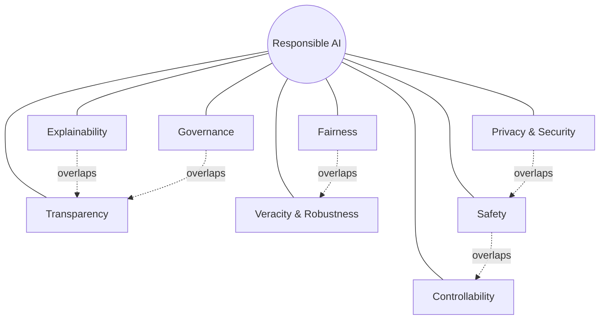
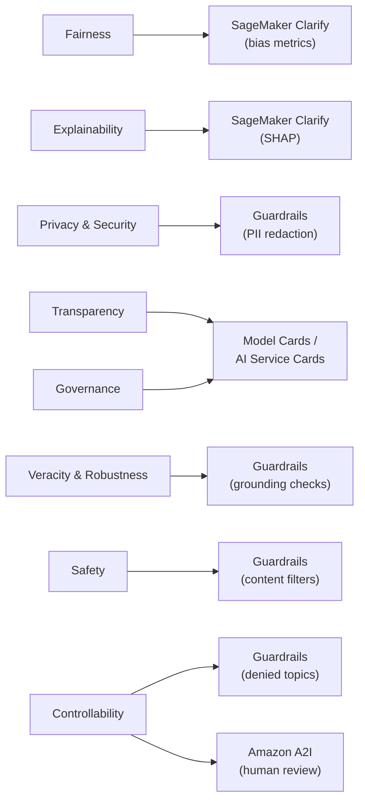
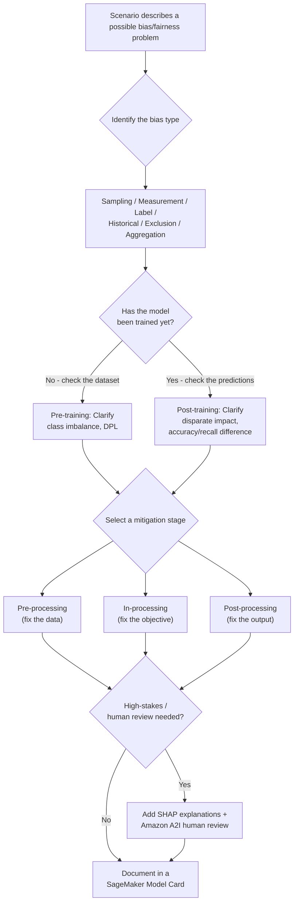
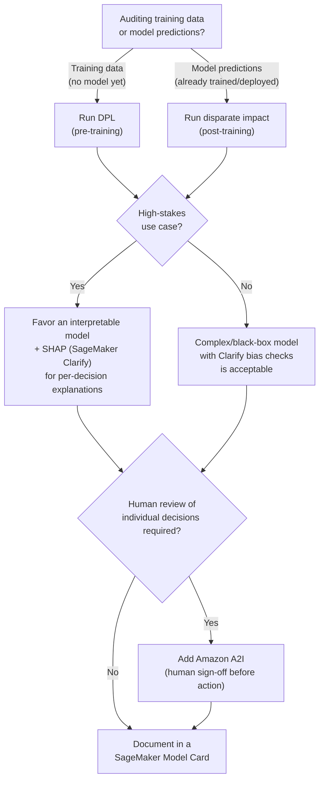

# Domain 4 Fast Track: Guidelines for Responsible AI

**Condensed guide** · full guide: [`docs/domain-4-guidelines-for-responsible-ai.md`](../domain-4-guidelines-for-responsible-ai.md) (2,250 lines) · **Last verified:** 2026-09-05

## How to use this fast track

This is a ~40%-length condensation of the full Domain 4 study guide, built
on top of that guide's own [Quick-reference cheat
sheet](../domain-4-guidelines-for-responsible-ai.md#quick-reference-cheat-sheet)
(line 1645) and expanded with the comparison tables, decision tables, and
Mermaid diagrams needed to stand on its own as a fast pre-exam review. It
keeps **every testable concept** from the source — disparate impact, every
bias-detection metric, every SageMaker Clarify capability, and every
monitoring approach — while trimming the worked-example narration,
step-by-step scenarios, and repeated "AWS example" paragraphs down to their
one-line takeaways. Every section links back to the corresponding section
of the full guide for the complete explanation, worked examples, and
practice questions.

Domain 4 makes up roughly **14% of scored questions** on the AWS
Certified AI Practitioner (AIF-C01) exam. Read this fast track the day
before the exam, or any time you already know the material and just need
the tables refreshed; read the [full guide](../domain-4-guidelines-for-responsible-ai.md)
first if any of these terms are new to you.

**Where each section comes from**, for jumping straight to the full
prose, mini-quiz, and AWS example behind any condensed table below:

| This fast track | Full guide section | Approx. full-guide lines |
|---|---|---|
| 1. Core dimensions | [Section 1](../domain-4-guidelines-for-responsible-ai.md#1-core-dimensions-of-responsible-ai) | 56–227 |
| 2. Bias and fairness | [Section 2](../domain-4-guidelines-for-responsible-ai.md#2-identifying-bias-and-fairness-issues-in-training-data-and-model-outputs) | 229–541 |
| 3. AWS tools | [Section 3](../domain-4-guidelines-for-responsible-ai.md#3-aws-tools-for-responsible-ai) + 5 worked examples | 544–959, 1176–1639 |
| 4. Legal and ethical | [Section 4](../domain-4-guidelines-for-responsible-ai.md#4-legal-and-ethical-considerations) | 960–1065 |
| 5. Performance vs. interpretability | [Section 5](../domain-4-guidelines-for-responsible-ai.md#5-balancing-model-performance-and-interpretability) | 1068–1173 |
| Monitoring | Scattered `SageMaker Model Monitor` mentions across Sections 2–3 and every worked example | — |
| Decision framework | [Decision framework](../domain-4-guidelines-for-responsible-ai.md#decision-framework-choosing-a-bias-metric-and-layering-tools-for-high-stakes-ai) | 1687–1742 |
| Rapid-fire key terms | [Key terms glossary](../domain-4-guidelines-for-responsible-ai.md#key-terms-glossary) (37 terms, condensed to the highest-yield ~30 here) | 1826–1916 |

## Table of contents

- [1. Core dimensions of responsible AI](#1-core-dimensions-of-responsible-ai)
- [2. Bias and fairness](#2-bias-and-fairness)
- [3. AWS tools for responsible AI](#3-aws-tools-for-responsible-ai)
- [4. Legal and ethical considerations](#4-legal-and-ethical-considerations)
- [5. Performance vs. interpretability](#5-performance-vs-interpretability)
- [AWS example scenarios at a glance](#aws-example-scenarios-at-a-glance)
- [Monitoring responsible AI in production](#monitoring-responsible-ai-in-production)
- [Decision framework: bias metric selection and tool layering](#decision-framework-bias-metric-selection-and-tool-layering)
- [Commonly confused term pairs](#commonly-confused-term-pairs)
- [Rapid-fire key terms](#rapid-fire-key-terms)
- [Rapid self-check](#rapid-self-check)
- [Common exam traps checklist](#common-exam-traps-checklist)
- [Cross-domain connections](#cross-domain-connections)
- [Where to go deeper](#where-to-go-deeper)

---

## 1. Core dimensions of responsible AI

AWS organizes responsible AI around **8 dimensions**. The exam gives a
one-sentence scenario and expects you to name the dimension and its
primary AWS tool:

| Dimension | Key question it answers | Primary AWS tool |
|---|---|---|
| **Fairness** | Does it treat individuals/groups equitably, without disadvantaging protected characteristics? | Amazon SageMaker Clarify (bias metrics) |
| **Explainability** | Why did the model produce *this specific* prediction? | Amazon SageMaker Clarify (SHAP explanations) |
| **Privacy and security** | Is personal data protected, and is the model protected from misuse/leakage? | Guardrails for Amazon Bedrock (PII redaction); Amazon Macie |
| **Transparency** | Is how the system was built, trained, and limited openly documented? | SageMaker Model Cards / AI Service Cards |
| **Veracity and robustness** | Is the output correct and reliable, even under noisy/adversarial input? | Guardrails for Amazon Bedrock (contextual grounding) |
| **Governance** | Are there policies/processes controlling the AI lifecycle and accountability? | SageMaker Model Cards; ML lineage tracking |
| **Safety** | Does the system avoid causing harm or generating dangerous content? | Guardrails for Amazon Bedrock (content filters) |
| **Controllability** | Can a human monitor, override, adjust, or stop the system? | Guardrails (denied topics); Amazon A2I (human review) |

**Fast disambiguation:** "why did it say that?" → **explainability** (one
prediction) vs. "is it documented/disclosed?" → **transparency** (whole
system). "does it work fairly across groups?" → **fairness** vs. "is the
output accurate/trustworthy under stress?" → **veracity and robustness**.
"can a human step in?" → **controllability**.

**How the dimensions relate to each other** — several dimensions
reinforce one another rather than existing in isolation (explainability
feeds transparency; privacy and safety overlap on data leakage; safety and
controllability overlap on stopping harmful behavior; governance
formalizes transparency into policy; fairness problems are frequently
veracity problems too):

**Dimension-to-tool mapping** — the same 8 facts as one graph instead of
eight bullets:

> **Exam tip:** Memorize the **specific word** each dimension maps to, not
> just the general idea — the exam's distractor answers are almost always
> a *different but plausible-sounding* dimension.

Full explanation, the healthcare-assistant AWS example, and the
mini-quiz: [full guide, Section 1](../domain-4-guidelines-for-responsible-ai.md#1-core-dimensions-of-responsible-ai).

---

## 2. Bias and fairness

**Bias ≠ variance — the exam's favorite trap.** "Bias" means two unrelated
things depending on context:

| | Statistical bias (Domain 1) | Fairness bias (this domain) |
|---|---|---|
| **What it measures** | How well a model *fits* the data | A model's *outcomes* across groups of people |
| **Paired concept** | Variance (bias-variance trade-off) | N/A — a fairness/training-data problem, not a fit problem |
| **Symptom** | Underfitting — the model is too simple | One group is systematically disadvantaged |
| **Fix** | More complex model, more features, less regularization | Rebalanced data, fairness constraints, output calibration |

A model can be statistically low-bias/low-variance (fits the data well)
and still be badly unfair to a demographic group — "fits the data well"
says nothing about whether the data or the outcomes across groups are
equitable. See [Domain 1, Section 7](../domain-1-fundamentals-of-ai-and-ml.md#7-overfitting-underfitting-and-the-biasvariance-trade-off)
for the statistical-bias side of this distinction.

**The 6 bias categories in training data:**

| Bias type | One-line definition | Scenario clue |
|---|---|---|
| **Sampling bias** | Training data doesn't represent the real-world population | Dataset overrepresents one demographic group |
| **Measurement bias** | Data collection/labeling systematically differs across groups | A proxy variable (e.g., ZIP code) correlates with a protected characteristic more than the real outcome |
| **Label bias / human bias** | Human annotators inject conscious/unconscious bias while labeling | Annotators rate similar content differently depending on subject group |
| **Historical bias** | Data accurately reflects a real world that is itself inequitable | Past lending/hiring decisions reflected discriminatory practices |
| **Exclusion bias** | Relevant data/features are removed, dropping signal a group needs | A feature important for fair treatment of a subgroup was dropped during cleaning |
| **Aggregation bias** | One model is applied uniformly to groups that need distinct treatment | A single model hides subgroup differences that actually matter |

**Bias-detection metrics — pick by lifecycle stage:**

| Question | Metric | Stage | Computed by |
|---|---|---|---|
| Does a positive label appear at a different rate across groups in the *dataset*? | **Difference in proportions of labels (DPL)** | Pre-training (no model yet) | SageMaker Clarify — dataset job |
| Is one class/group significantly underrepresented in the dataset? | **Class imbalance** | Pre-training | SageMaker Clarify — dataset job |
| Does a facially-neutral model produce different outcome rates across groups in its *predictions*? | **Disparate impact** | Post-training (trained model/endpoint) | SageMaker Clarify — model job |
| Does accuracy or recall differ materially across groups? | **Accuracy/recall difference** | Post-training | SageMaker Clarify — model job |

**Shortcut:** dataset or labels, no trained model yet → **DPL**/class
imbalance. Predictions, an endpoint, or a deployed model → **disparate
impact**/accuracy-recall difference. A dataset can pass DPL and still
produce disparate impact after training if the model amplifies a small
imbalance — that's why Clarify checks both stages, not just one.

**Bias-mitigation techniques compared:**

| Stage | When applied | What it does | Example technique | Requires retraining? |
|---|---|---|---|---|
| **Pre-processing** | Before training | Fix the data itself | Rebalance/oversample underrepresented groups; remove or transform a biased/proxy feature; augment thin segments | Yes (train on the fixed data) |
| **In-processing** | During training | Constrain the training objective | Add fairness constraints/regularization terms that penalize unfair outcomes | Yes (this *is* the training run) |
| **Post-processing** | After training, no retrain | Adjust outputs | Recalibrate/adjust prediction thresholds per group | No |

Pick the stage by **root cause**, not habit: an unfair proxy feature (e.g.
ZIP code standing in for race) is a pre-processing fix (drop/replace the
feature); a residual gap after retraining is often cheapest to close with
post-processing; a training objective that needs to actively balance
accuracy against fairness calls for in-processing.

**Detecting and mitigating a bias problem end to end:**

**Representativeness bias — the check Clarify can miss entirely.**
Demographic fairness metrics (DPL, disparate impact) compare outcomes
*across groups already present in the data*. **Representativeness bias**
is different: a whole *segment of the deployment population* (a region, a
market) is thin or absent from training data, so the model underperforms
there even though no protected group in the data is treated unfairly —
there's no group label to compute a disparity against, so Clarify has
nothing to flag, and a held-out test split from the same non-representative
pool will look clean too.

| | Demographic fairness bias | Representativeness bias |
|---|---|---|
| **Question it answers** | Are outcomes equitable *across groups present in the data*? | Does the training data *cover* the population the model will serve? |
| **Typical detection** | SageMaker Clarify: DPL, class imbalance (pre); disparate impact, accuracy/recall difference (post) | Compare training-data coverage per segment vs. expected deployment share; accuracy broken out *per segment*, not one aggregate score |
| **Why Clarify can miss it** | N/A — this is exactly what Clarify measures | A missing/thin segment has no meaningful group to compute a stable metric against |
| **Typical mitigation** | Rebalance classes, fairness constraints, threshold calibration per group | Collect/augment data for the underrepresented segment; sampling quotas per target segment |

> **Exam tip:** A model that "scores well on its held-out test set" but
> "performs far worse" for a specific **region, market, or deployment
> context** — not a demographic group treated unfairly — is testing
> **representativeness**, not a standard Clarify fairness metric. Also:
> a proxy variable named explicitly in a scenario (ZIP code, a
> "membership number" correlated with age) is almost always testing
> **measurement bias**, fixed by removing/transforming the feature, not
> by rebalancing classes.

Full explanation, the representativeness worked example, and the
mini-quiz: [full guide, Section 2](../domain-4-guidelines-for-responsible-ai.md#2-identifying-bias-and-fairness-issues-in-training-data-and-model-outputs).

---

## 3. AWS tools for responsible AI

| Tool | What it is | Primary use case | Applies to | When to choose it |
|---|---|---|---|---|
| **Amazon SageMaker Clarify** | Bias-detection and explainability tool | Measure pre-training/post-training bias metrics; generate SHAP-based feature attribution explanations | Datasets and trained models (typically SageMaker) | You need to detect/quantify bias or explain *why* a model made a specific prediction |
| **Amazon SageMaker Model Cards** | Structured model documentation | Record intended use, training data, evaluation results, limitations, risk rating | Models you build (typically SageMaker) | You need an auditable transparency/governance record for a model your organization built |
| **Guardrails for Amazon Bedrock** | Configurable runtime safety/privacy filter | Block denied topics, filter harmful/toxic content, redact PII, reduce hallucination via grounding checks | Foundation model inputs/outputs at inference time (Bedrock) | You need to control what a live generative AI application can say or must not say |
| **AI Service Cards** | AWS-published service documentation | Communicate intended use, limitations, and design considerations for an AWS AI service | AWS-managed AI services (e.g., Rekognition, Transcribe) | You need to evaluate whether a pre-built AWS AI service fits your use case responsibly |
| **Amazon A2I** | Human-in-the-loop review workflow builder | Route low-confidence or high-stakes predictions to human reviewers | Predictions from ML models or AWS AI services | You need a human to review/approve/correct outputs before they're acted on |

**The unifying pattern:** **Clarify** answers "is this biased / why did
the model decide this?"; **Model Cards** and **AI Service Cards** answer
"what is this model/service, and what are its documented limits?"
(self-authored vs. AWS-authored); **Guardrails** answers "what should
this live application never say or leak?"; **A2I** answers "who
double-checks this before it's used?"

**Guardrails for Amazon Bedrock — the five capabilities:**

| Capability | Blocks/does | Feeds which dimension |
|---|---|---|
| **Denied topics** | Blocks the model from engaging with specified topics entirely | Controllability |
| **Content filters** | Blocks harmful categories (hate, insults, sexual, violence, misconduct, prompt attacks) at configurable strength | Safety |
| **Word filters** | Blocks specific words/phrases (profanity, competitor names) | Safety |
| **Sensitive information filters** | Detects/redacts or blocks **PII** in prompts and responses | Privacy and security |
| **Contextual grounding checks** | Verifies a response is grounded in provided source content, reducing hallucination | Veracity and robustness |

> **Exam tip:** **Model Card = you fill it in** (a model you built,
> typically SageMaker). **AI Service Card = AWS publishes it, you read
> it** (an AWS-managed service). **Clarify = bias detection +
> explainability**; **Guardrails = runtime content/safety/privacy
> filtering** — different problems at different lifecycle stages.

**Bias-metric-and-tool decision flowchart** — the table above lists what
each tool *is*; this walks the same decisions as a single path: which bias
metric to run, when to layer SHAP, and when a human signs off:

**Three worked-example patterns condensed** (full walkthroughs in the full
guide's five "## Worked example" sections):

1. **Routing low-confidence predictions with Amazon A2I.** Pick a
   confidence threshold using [Domain 1 evaluation
   metrics](../domain-1-fundamentals-of-ai-and-ml.md#6-model-evaluation-basics)
   (AUC-ROC to compare thresholds; recall-weighted if a false negative is
   costlier than an unnecessary review). Predictions **below** the
   threshold skip any automated action and invoke A2I's `StartHumanLoop`
   instead, which runs a human review workflow built from three pieces: a
   **worker task template** (the reviewer-facing UI showing the case
   details and the model's low-confidence output, with fields for the
   reviewer's own assessment); a **flow definition** whose activation
   condition should use the *same* threshold as the routing logic so the
   two never drift apart; and the workforce itself.
   A **private workforce** (via Amazon Cognito), not public Mechanical
   Turk, is required whenever the review task exposes regulated data
   (e.g., PHI). **SageMaker Model Monitor** then watches the *share* of
   predictions falling below the threshold over time as a drift signal.
2. **Layering Clarify + Guardrails on one generative model across its
   lifecycle.** Run Clarify pre-launch on the model's training/fine-tuning
   data and post-training predictions; run Guardrails at runtime on every
   live input/output. Same model, two lifecycle stages, two tools — not
   one tool covering both.
3. **Pairing a classical ranker (Clarify) with a separate FM (Guardrails)
   as two distinct components.** When a scenario names a "ranking/scoring
   model" **plus** a separate foundation model that generates text, apply
   **Clarify only to the structured/tabular component** and **Guardrails
   only to the FM component** — never the reverse, and never one blended
   end-to-end metric, because an aggregate score can mask a real problem
   hiding in either half. Document both components in one system-level
   **Model Card**, but keep their monitoring streams (Model Monitor for
   the ranker, Guardrails intervention logs for the FM) independent.

> **Exam tip:** Two components named in one scenario — a structured/
> tabular model **plus** a text-generating FM — is the signal to reach for
> **Clarify on the structured model** and **Guardrails on the FM**, never
> one tool for the whole pipeline. A distractor that proposes running
> Clarify against the FM's generated output, or Guardrails against the
> ranking model's training data, is testing exactly this boundary.

**Two layering patterns — don't conflate them:**

| | One model, two lifecycle stages | Two components, two model types |
|---|---|---|
| **What's being audited** | The *same* fine-tuned foundation model | A classical/tabular model *and* a separate FM |
| **Clarify's role** | Pre-launch, on the FM's training/fine-tuning data | Ongoing, on the tabular ranking/scoring model only |
| **Guardrails' role** | Runtime, on the same FM's live input/output | Runtime, on the separate FM's live input/output only |
| **Do the tools ever swap targets?** | No — Clarify never touches runtime generations; Guardrails never touches training data | No — Clarify never touches the FM; Guardrails never touches the tabular model's training data |
| **Governance artifact** | One Model Card for the one model, referencing both audits | One system-level Model Card referencing both components' separate audits |

**RAG/foundation-model bias has no labeled dataset to run Clarify
against.** When a **RAG** application gives unfair or inconsistent
answers across groups, the failure usually traces to an
unrepresentative **retrieval corpus** (not enough source coverage for
some topics/paths) plus **hallucination filling the gap** when retrieval
returns weak matches — and because it disproportionately affects
underrepresented topics, the hallucination itself becomes a fairness
issue. Fix it RAG-natively: **curate/augment the Knowledge Base** (the
unstructured-data equivalent of pre-processing rebalancing), enable
**Guardrails contextual grounding checks** to catch fabricated,
ungrounded answers, **cite sources inline** (RAG's version of
transparency, since there's no trained model for Clarify to explain),
and route low-retrieval-confidence queries through **Amazon A2I**.

Full explanation and all five worked examples: [full guide, Section
3](../domain-4-guidelines-for-responsible-ai.md#3-aws-tools-for-responsible-ai).

---

## 4. Legal and ethical considerations

| Category | What it covers | AWS mitigation |
|---|---|---|
| **Intellectual property (IP)** | Who owns AI-generated content; whether training on/generating content resembling copyrighted material creates liability | Choose a Bedrock model whose provider offers **IP indemnification** (shifts legal risk away from the customer) — not every provider offers this |
| **Data privacy** | Obligations (e.g., **GDPR**) around personal data used to train or prompt a model; minimize collection, anonymize/pseudonymize, obtain consent, control **data residency** | Guardrails sensitive information filters redact **PII** at inference; **Amazon Macie** discovers/classifies sensitive data at rest in S3 |
| **Toxicity** | Hateful, harassing, obscene, or otherwise harmful generated content, intentional (jailbreaking/prompt injection) or not | Guardrails content filters; careful prompt design; **Amazon A2I** human review for sensitive-content applications |
| **Environmental impact** | Energy/compute/carbon footprint of training and running large foundation models | Reuse pretrained FMs via prompting/RAG/fine-tuning instead of pretraining from scratch; **AWS Customer Carbon Footprint Tool**; **AWS Well-Architected Framework Sustainability Pillar** |

> **Exam tip:** Reducing **copyright/IP risk** → look for **IP
> indemnification**, not a technical control like Guardrails (which
> addresses content safety and privacy, not copyright liability). Keep
> **toxicity** (harmful content), **data privacy** (personal data
> protection), and **IP** (ownership/liability) as three separate,
> non-overlapping categories — the exam tests them as distinct answers.

Full explanation, AWS example, and mini-quiz: [full guide, Section
4](../domain-4-guidelines-for-responsible-ai.md#4-legal-and-ethical-considerations).

---

## 5. Performance vs. interpretability

**Interpretability** is how easily a human can understand *how* a model
arrives at its outputs. The general trade-off:

| | Simple/interpretable models | Complex models |
|---|---|---|
| **Examples** | Linear regression, logistic regression, decision trees (esp. depth-limited) | Deep neural networks, large foundation models |
| **Accuracy on complex tasks** | Often lower | Often higher |
| **Can a human trace the exact decision path?** | Yes — explicit, human-readable rules | No — reasoning distributed across millions/billions of parameters (the [Domain 2 "black box" problem](../domain-2-fundamentals-of-generative-ai.md#3-advantages-and-disadvantages-of-generative-ai)) |
| **Favor when...** | High-stakes, regulated, high-impact decisions (credit, hiring, medical, criminal justice) — often a *legal* requirement | Low-stakes, purely performance-driven tasks (image tagging, recommendations, spam filtering) |

**Interpretability methods compared:**

| Method | How it works | Recovers interpretability from a black box? | Best for |
|---|---|---|---|
| **Natively interpretable model** | Choose a simple architecture (linear/logistic regression, shallow/monotonically-constrained decision tree) up front | N/A — never a black box to begin with | Regulatory requirements that the explanation reflect the model's **actual decision logic**, not an approximation |
| **Post-hoc SHAP (via SageMaker Clarify)** | Computes **Shapley Additive exPlanations** feature-attribution values for one prediction, after the model is already trained | Partially — approximates *why* a specific prediction was made, without requiring the underlying model to be simple | Showing *which factors mattered* for a complex/high-accuracy model, when exact traceability isn't legally required |

**SHAP is an approximation, not a trace.** SHAP values are an **additive
approximation** of a black-box model's local behavior around one
prediction — not an exact replay of the path the model took. When a
regulation requires an explanation to reflect the model's **actual
decision logic**, post-hoc SHAP on an otherwise-uninterpretable model does
not satisfy it; only a natively interpretable model does, even at an
accuracy cost. When the requirement is weaker — just show which factors
mattered — SHAP on a complex model is sufficient.

> **Exam tip:** "Must explain individual decisions to regulators/affected
> people" + regulated/high-stakes → favor **interpretability**, even at
> an accuracy cost. "Maximum accuracy, low individual stakes" → favor
> **performance**, and treat SHAP/Clarify as *added* transparency, not a
> substitute for choosing a simpler model. If the scenario specifically
> says the explanation must reflect the model's **actual decision logic**
> (not just contributing factors), that's disqualifying post-hoc SHAP on
> a black box — pick the natively interpretable model instead.

Full explanation, both bank/loan-approval AWS examples, and mini-quiz:
[full guide, Section 5](../domain-4-guidelines-for-responsible-ai.md#5-balancing-model-performance-and-interpretability).

---

## AWS example scenarios at a glance

Each numbered section's full "AWS example" paragraph condensed to a
one-row recap — useful for pattern-matching a new scenario against a
known one fast:

| Section | Scenario | Tools/concepts it exercises |
|---|---|---|
| 1. Dimensions | A healthcare generative AI assistant needs all 8 dimensions at once: fairness across patient demographics, explainability for clinicians, PII protection, documented limits, no hallucinated drug interactions, no harmful content, and a human override switch | Clarify, Guardrails (PII redaction + grounding + content filters), Model Cards, A2I |
| 2. Bias detection | A bank's credit-approval model shows a large **DPL** gap pre-training and a **disparate impact** gap post-training across demographic groups | SageMaker Clarify (both stages), pre-processing rebalancing, SageMaker Model Monitor |
| 3. AWS tools | A company documents a SageMaker text classifier with a **Model Card**, attaches **Guardrails** to a separate Bedrock chatbot, routes low-confidence classifier predictions through **A2I**, and reads Rekognition's **AI Service Card** before adopting it | Model Cards, Guardrails, A2I, AI Service Cards — four tools, four distinct jobs |
| 4. Legal/ethical | A media company mitigates **IP risk** by picking an indemnified Bedrock model, redacts **PII** from prompts with Guardrails, blocks **toxic** output with content filters, and checks the **Carbon Footprint Tool** before scheduling large batch image-generation jobs | IP indemnification, Guardrails, AWS Customer Carbon Footprint Tool, Sustainability Pillar |
| 5. Interpretability | A bank favors an interpretable loan-approval model with SHAP explanations for regulators; a separate team at the same bank picks a complex, high-accuracy model for low-stakes receipt-image tagging | SageMaker Clarify (SHAP), stakes-based model selection |

**Five full worked-example scenarios, condensed to their headline
pattern** (see [Section 3](#3-aws-tools-for-responsible-ai) above for the
three that revolve around tool selection):

- **E-commerce recommendation engine** — fairness + explainability +
  transparency + governance all on one deep-learning ranking model;
  historical bias found pre-training, mitigated, SHAP added post-launch,
  documented in a Model Card, governed with quarterly Model
  Monitor/Clarify review.
- **Small-business loan classifier** — a **proxy variable** (ZIP code)
  drives measurement bias; fixed by dropping the feature, not
  rebalancing; high-stakes lending flips the interpretability call toward
  a **natively interpretable** model instead of a black box with SHAP.
- **RAG-based HR assistant** — no labeled dataset for Clarify; bias comes
  from an unrepresentative **retrieval corpus** and hallucination filling
  retrieval gaps; fixed with corpus curation, Guardrails grounding
  checks, and inline source citation.
- **Regulatory explainability tradeoff** — a health-insurer's
  prior-authorization model must produce explanations reflecting the
  model's **actual decision logic**; post-hoc SHAP on a higher-accuracy
  ensemble is rejected in favor of a natively interpretable,
  monotonically-constrained tree, even at a 4-point AUC / 6-point recall
  cost.
- **Classical ranker + Bedrock FM pairing** — two components, two tools,
  never blended: Clarify audits the structured ranking model only,
  Guardrails audits the FM's generated copy only, and both are documented
  in one system-level Model Card with two independent monitoring streams.

**Concrete numbers worth remembering** — the exam sometimes gives actual
metric values and asks you to reason about the tradeoff, not just name a
concept:

| Worked example | Numbers | What they mean |
|---|---|---|
| A2I confidence-threshold selection (hospital triage) | 0.50 → 91% recall / 62% precision; 0.70 → 78% recall; 0.35 → 97% recall / 44% precision; **chosen: 0.35** | A missed urgent case (false negative) is costlier than an unnecessary review, so the team accepts lower precision for higher recall |
| Regulatory explainability tradeoff (prior-authorization) | Ensemble: 0.93 AUC-ROC / 88% recall; interpretable tree: 0.89 AUC-ROC / 82% recall — a **4-point AUC / 6-point recall gap** | The team accepts the gap because the regulation requires the *actual* decision logic, which only the natively interpretable model provides |
| E-commerce recommendation engine | Class imbalance + large DPL pre-training → mitigated → disparate impact drops to an acceptable range post-training | Textbook pre-processing-then-recheck pattern: fix the data, retrain, confirm with the post-training metric |

---

## Monitoring responsible AI in production

Bias and drift monitoring don't stop at launch — every worked example in
the full guide attaches an ongoing monitoring step after deployment:

| Monitoring approach | What it watches | Tool |
|---|---|---|
| **Bias drift on a classical/structured model** | Disparate impact / accuracy-recall difference moving over time as the population shifts | **SageMaker Model Monitor**, integrated with SageMaker Clarify |
| **Confidence-threshold drift** | The *share* of predictions falling below an A2I routing threshold — a rising share signals the population is drifting from what the model was trained on | SageMaker Model Monitor |
| **Runtime content/safety drift** | Guardrails intervention logs (blocked topics, filtered content, redacted PII) over time | Guardrails for Amazon Bedrock intervention logs |
| **Coverage/representativeness drift** | New regions/segments appearing in production traffic that aren't yet represented in training | SageMaker Model Monitor (data drift) + per-segment accuracy audits |
| **Performance-vs-interpretability drift** | Whether an accepted accuracy gap (interpretable model vs. an offline complex-model benchmark) widens over time | SageMaker Model Monitor |

**Two-component systems need two independent monitoring streams**, never
one blended metric: a classical ranking model and a paired foundation
model each get their own bias/content audit and their own ongoing
monitor, reviewed together on the same governance cadence (e.g.
quarterly) rather than merged into a single end-to-end number that could
hide a problem in either half.

**Governance closes the loop.** Monitoring output feeds back into the
**SageMaker Model Card** created at launch: a recurring review (commonly
quarterly) re-reads the Model Card against the latest Clarify/Model
Monitor metrics, and anything flagged as high-risk (e.g. a spike in
disparate impact) routes through **Amazon A2I** for human review before
it ships further — turning one-time bias mitigation into continuous
governance. See [Domain 5, Section
3](../domain-5-security-compliance-governance.md#3-aws-config-aws-audit-manager-and-aws-cloudtrail-for-ai-governance)
for the organizational/regulatory side of this same governance loop.

---

## Decision framework: bias metric selection and tool layering

**DPL vs. disparate impact — same tool, different question.** **DPL**
(pre-training) audits the *dataset itself*, before a model exists,
comparing how often the positive outcome label appears across groups in
historical data — answers "does our training data already encode an
imbalance?" **Disparate impact** (post-training) audits the *trained
model's predictions* on new inputs — answers "does the model I've already
built produce disparate outcomes in practice?" Shortcut: dataset/labels,
no model yet → DPL; predictions/endpoint/deployed model → disparate
impact.

**Layering tools for a high-stakes scenario — one full stack:**

1. Run Clarify's **DPL** (pre-training) and **disparate impact**
   (post-training) checks at their respective stages.
2. Add **SHAP** (via Clarify) so an individual adverse decision can be
   explained to the affected person or a regulator.
3. Capture the metrics, the mitigation applied, and the SHAP methodology
   in a **SageMaker Model Card** so the decision is auditable after the
   fact.
4. Route borderline or high-stakes individual predictions through
   **Amazon A2I** for human sign-off before any action is taken.
5. Attach **SageMaker Model Monitor** to watch for bias drift going
   forward, and schedule a recurring governance review of the Model Card
   against fresh metrics.

No single tool covers fairness, explainability, documentation, and human
oversight at once — a high-stakes scenario in the exam is usually testing
whether you can name the *combination*, not just one tool in isolation.

Full explanation and the healthcare-staffing worked example: [full guide,
decision
framework](../domain-4-guidelines-for-responsible-ai.md#decision-framework-choosing-a-bias-metric-and-layering-tools-for-high-stakes-ai).

---

## Commonly confused term pairs

The exam's distractor answers usually swap in one of these look-alike
terms — knowing the *distinguishing question* for each pair is worth more
than memorizing either definition alone:

| Pair | Distinguishing question | Answer |
|---|---|---|
| **Bias (fairness)** vs. **variance/statistical bias** | Is this about *unfair outcomes across groups* or about *how well a model fits the data*? | Fairness bias → this domain; variance/statistical bias → [Domain 1](../domain-1-fundamentals-of-ai-and-ml.md#7-overfitting-underfitting-and-the-biasvariance-trade-off) |
| **Explainability** vs. **transparency** | Is this about *one specific prediction* or *the whole system's documentation*? | One prediction → explainability; whole system → transparency |
| **DPL** vs. **disparate impact** | Is there a *trained model* yet? | No model yet, checking labels → DPL; trained model/predictions → disparate impact |
| **Demographic fairness bias** vs. **representativeness bias** | Does the group already have *rows/labels in the dataset*, or is a whole *segment missing*? | Present but treated unequally → fairness bias; thin/absent segment → representativeness bias |
| **SageMaker Model Card** vs. **AI Service Card** | Did *you* build the model, or is this an *AWS-managed* service? | You built it → Model Card; AWS-managed service → AI Service Card |
| **Amazon SageMaker Clarify** vs. **Guardrails for Amazon Bedrock** | Is this a *dataset/trained-model* check or a *live FM input/output* check? | Dataset/model → Clarify; live FM inference → Guardrails |
| **Pre-processing** vs. **in-processing** vs. **post-processing** | Is the fix applied to the *data*, the *training objective*, or the *output*, and does it require retraining? | Data (retrain) → pre-processing; objective (retrain) → in-processing; output (no retrain) → post-processing |
| **Toxicity** vs. **data privacy** vs. **intellectual property** | Is the concern *harmful content*, *personal data*, or *copyright/ownership*? | Harmful content → toxicity; personal data → data privacy; ownership/liability → IP |
| **Natively interpretable model** vs. **post-hoc SHAP** | Must the explanation reflect the model's *actual decision logic*, or just *which factors mattered*? | Actual decision logic required → natively interpretable model; factors-only is enough → post-hoc SHAP is sufficient |

---

## Rapid-fire key terms

- **Responsible AI** — designing, building, and operating AI systems that
  are fair, explainable, private/secure, transparent, veracious/robust,
  governed, safe, and controllable.
- **Fairness** — equitable treatment of individuals/groups without
  systematic disadvantage to protected groups.
- **Explainability** — describing, in human terms, why a model produced a
  *specific* output (per-prediction).
- **Transparency** — openly documenting how a system was built, trained,
  and intended to be used (system-wide).
- **Veracity and robustness** — accurate, reliable output that degrades
  gracefully under adversarial/noisy input.
- **Governance** — policies/processes controlling the AI lifecycle and
  accountability.
- **Safety** — preventing harm, including harmful generated content.
- **Controllability** — a human's ability to monitor, override, or stop a
  system.
- **Bias (fairness sense)** — systematic, unfair skew in outcomes caused
  by training data/process; **not** the same as statistical bias/variance.
- **Sampling bias** — training data doesn't represent the deployment
  population.
- **Representativeness bias** — a whole deployment segment is thin/absent
  from training data; no group label exists to compute a disparity, so
  standard fairness metrics miss it.
- **Historical bias** — accurately-collected data reflects a real world
  that is itself inequitable.
- **Measurement bias** — a proxy feature correlates with a protected
  characteristic more than with the real outcome.
- **Label/human bias** — annotators inject bias while labeling.
- **Exclusion bias** — removing a feature drops signal a group needs.
- **Aggregation bias** — one model applied where subgroups need distinct
  treatment.
- **Class imbalance** — a class/group is significantly underrepresented
  in a dataset (pre-training metric).
- **Difference in proportions of labels (DPL)** — pre-training metric
  comparing positive-label rate across groups in the *dataset*.
- **Disparate impact** — post-training metric comparing favorable-outcome
  rate across groups in *predictions*.
- **Pre-processing / in-processing / post-processing** — bias mitigation
  applied to the data / the training objective / the output, respectively.
- **Amazon SageMaker Clarify** — detects bias (pre- and post-training) and
  generates SHAP-based explainability reports.
- **SHAP (Shapley Additive exPlanations)** — feature-attribution values
  quantifying each input's contribution to one prediction; an
  *approximation*, not an exact decision trace.
- **Amazon SageMaker Model Cards** — structured documentation of intended
  use, training data, evaluation results, and limitations for a model you
  built.
- **AI Service Cards** — AWS-published documentation of an AWS-managed AI
  service's intended use and limitations.
- **Guardrails for Amazon Bedrock** — runtime safety/privacy filters:
  denied topics, content filters, word filters, sensitive information
  filters, contextual grounding checks.
- **Personally identifiable information (PII)** — data identifying a
  specific individual; a Guardrails sensitive-information-filter target.
- **Amazon Augmented AI (Amazon A2I)** — human-in-the-loop review
  workflows for low-confidence/high-stakes predictions.
- **Intellectual property (IP) indemnification** — a contractual
  protection some Bedrock model providers offer, shifting IP-infringement
  legal risk away from the customer.
- **Toxicity** — hateful, harassing, obscene, or otherwise harmful
  generated content.
- **Data residency** — the geographic location where data is
  stored/processed.
- **AWS Customer Carbon Footprint Tool** — reports estimated carbon
  emissions from a customer's AWS usage.
- **Interpretability** — how easily a human can understand how a model
  arrives at its outputs; trades off against raw performance.
- **Black box model** — a model whose internal decision process isn't
  easily understood by humans (typically deep learning/foundation
  models).
- **SageMaker Model Monitor** — watches a deployed model/endpoint for
  bias drift, data drift, and performance drift over time.
- **Variance** — a model's sensitivity to fluctuations in the training
  data; the statistical-bias counterpart, distinct from fairness bias
  (see [Domain 1](../domain-1-fundamentals-of-ai-and-ml.md#7-overfitting-underfitting-and-the-biasvariance-trade-off)).
- **Denied topics (Guardrails)** — a Guardrails configuration that blocks
  a model from engaging with specified topics.
- **Contextual grounding check (Guardrails)** — verifies a response is
  grounded in provided source content, reducing hallucination.
- **Amazon Macie** — discovers and classifies sensitive data (including
  PII) stored in Amazon S3.
- **AWS Well-Architected Framework Sustainability Pillar** — design
  principles for minimizing the environmental impact of workloads on AWS.

For the complete 30+ term glossary with full definitions:
[full guide, Key terms
glossary](../domain-4-guidelines-for-responsible-ai.md#key-terms-glossary).
For terms shared across domains: [`docs/master-glossary.md`](../master-glossary.md).

---

## Rapid self-check

Fifteen quick recall questions — cover the answer column and try each one
before checking it. These are new questions, not a repeat of the full
guide's practice set.

| # | Question | Answer |
|---|---|---|
| 1 | A dataset check for label-rate imbalance *before* any model is trained — which metric? | **Difference in proportions of labels (DPL)** |
| 2 | A deployed model produces different favorable-outcome rates across groups — which metric? | **Disparate impact** |
| 3 | ZIP code correlates strongly with race in a loan model's features — which bias category? | **Measurement bias** (proxy variable) |
| 4 | A model scores well on its held-out test set but fails badly for one geographic market barely present in training — which failure mode? | **Representativeness bias**, not a standard fairness metric |
| 5 | Which tool generates SHAP-based feature attribution for one prediction? | **Amazon SageMaker Clarify** |
| 6 | Which tool blocks a live Bedrock chatbot from discussing a specified topic? | **Guardrails for Amazon Bedrock** — denied topics |
| 7 | A regulation requires an explanation to reflect the model's *actual* decision logic — does post-hoc SHAP on a black box satisfy it? | **No** — only a natively interpretable model does |
| 8 | Who fills out a SageMaker Model Card vs. who publishes an AI Service Card? | **You** fill out a Model Card (your model); **AWS** publishes an AI Service Card (its managed service) |
| 9 | A scenario names a structured ranking model *and* a separate text-generating FM — which tool audits which? | **Clarify** on the ranking model, **Guardrails** on the FM — never swapped, never blended |
| 10 | What watches a deployed endpoint for bias drift after launch? | **SageMaker Model Monitor** |
| 11 | Which category of legal/ethical concern covers a Bedrock model possibly reproducing copyrighted training content? | **Intellectual property (IP)** — look for IP indemnification |
| 12 | A generative AI assistant occasionally fabricates a confident-sounding but ungrounded answer — which Guardrails capability catches this? | **Contextual grounding checks** |
| 13 | A team adds a fairness constraint to the training objective itself — which mitigation stage? | **In-processing** |
| 14 | A team recalibrates prediction thresholds per group after training, without retraining — which mitigation stage? | **Post-processing** |
| 15 | Which AWS tool reports the estimated carbon emissions of a customer's AWS usage? | **AWS Customer Carbon Footprint Tool** |

---

## Common exam traps checklist

- [ ] **Bias vs. variance** — bias is a fairness/training-data problem;
      variance is a model-sensitivity/overfitting problem from
      [Domain 1](../domain-1-fundamentals-of-ai-and-ml.md#7-overfitting-underfitting-and-the-biasvariance-trade-off).
      Don't conflate them.
- [ ] **Clarify measures bias both before *and* after training** — a
      *dataset* check pre-model is still a pre-training metric (DPL,
      class imbalance), not disparate impact.
- [ ] **Guardrails filters live inference content**; it does not detect
      training-data bias or generate explanations — that's Clarify's job.
- [ ] **Explainability ≠ transparency** — per-prediction vs. whole-system
      documentation.
- [ ] **High overall accuracy can hide unfairness to a minority
      subgroup** — always compare behavior across groups, not just the
      aggregate.
- [ ] **Representativeness gaps evade standard fairness metrics** — a
      clean Clarify report and a good held-out score don't rule out a
      thin/absent deployment segment.
- [ ] **A named proxy feature (ZIP code, a correlated ID number) usually
      signals measurement bias**, not a demographic label problem.
- [ ] **Two components (a structured/tabular model + a generative FM) need
      two tools** — Clarify on the structured model, Guardrails on the FM
      — never one tool for both, never one blended metric.
- [ ] **RAG bias has no labeled dataset for Clarify** — look for retrieval
      corpus curation, Guardrails grounding checks, and source citation
      instead.
- [ ] **SHAP is an approximation, not an exact decision trace** — a
      regulation requiring the *actual* decision logic disqualifies
      post-hoc SHAP on a black box; only a natively interpretable model
      satisfies it.
- [ ] **IP risk → IP indemnification**, not Guardrails (that's content
      safety/privacy, not copyright liability).
- [ ] **Model Card = self-authored** (a model you built); **AI Service
      Card = AWS-authored** (a service you're evaluating/adopting).
- [ ] **Fairness and veracity/robustness overlap** — a model that's
      unfair to a group is also producing unreliable output for that
      group, but the exam still expects the *more specific* dimension
      named in the scenario, not just "responsible AI" generically.
- [ ] **Governance is built on top of transparency, not a separate tool**
      — a recurring review that re-reads a Model Card against fresh
      Clarify/Model Monitor metrics is governance *using* an existing
      transparency artifact, not a new capability.
- [ ] **Reducing environmental impact means reusing a pretrained FM**
      (via prompting/RAG/fine-tuning) instead of pretraining from
      scratch — not simply "pick the smallest model," which can also be
      the right call but isn't the primary lever the exam tests.
- [ ] **A confidence threshold for A2I routing is not the same as
      temperature** — temperature is a generative-model sampling
      parameter with no meaning for a classical classifier's predicted
      probability.

---

## Cross-domain connections

Domain 4 leans on and feeds into every other domain guide — the exam
frequently blends a Domain 4 concept with one of these:

| Connects to | Shared concept | Why they're easy to conflate |
|---|---|---|
| [Domain 1, Section 7](../domain-1-fundamentals-of-ai-and-ml.md#7-overfitting-underfitting-and-the-biasvariance-trade-off) | Bias/variance trade-off | Same word "bias," completely different meaning (model fit vs. fairness) |
| [Domain 1, Section 6](../domain-1-fundamentals-of-ai-and-ml.md#6-model-evaluation-basics) | AUC-ROC, precision/recall, confusion matrix | The Amazon A2I confidence-threshold worked example is built entirely on Domain 1 evaluation metrics |
| [Domain 2, Section 3](../domain-2-fundamentals-of-generative-ai.md#3-advantages-and-disadvantages-of-generative-ai) | The "black box" problem | Domain 2 introduces why foundation models are hard to interpret; Domain 4 Section 5 builds the performance/interpretability decision on top of it |
| [Domain 3, Section 3](../domain-3-applications-of-foundation-models.md#3-retrieval-augmented-generation-rag-and-amazon-bedrock-knowledge-bases) | RAG and Knowledge Bases | The RAG-based HR assistant worked example applies Domain 4 fairness thinking to a Domain 3 architecture with no labeled training set |
| [Domain 5, Section 3](../domain-5-security-compliance-governance.md#3-aws-config-aws-audit-manager-and-aws-cloudtrail-for-ai-governance) | Governance, audit trails | Domain 4's Model Card creation is the artifact; Domain 5 covers the organizational/regulatory process built on top of it |
| [`cross-domain-scenario-questions.md`](../cross-domain-scenario-questions.md#practice-questions) | Pre- vs. post-training bias metric selection | Scenario questions 2, 13, 19, and 20 specifically test whether "dataset" vs. "predictions" language in a scenario picks DPL/class imbalance vs. disparate impact/representativeness |

---

## Where to go deeper

This fast track intentionally omits the full guide's step-by-step worked
examples, AWS-example paragraphs, mini-quizzes, and 20-question practice
set. Go back to the full guide for:

- [Domain overview and exam weighting](../domain-4-guidelines-for-responsible-ai.md#domain-overview)
- Five full "## Worked example" walkthroughs (e-commerce recommendation
  audit, classical ML loan-approval bias audit, RAG-based HR assistant
  bias/hallucination diagnosis, performance-vs-interpretability tradeoff,
  and pairing a classical ranker with a Bedrock FM)
- [Mini-quizzes](../domain-4-guidelines-for-responsible-ai.md#1-core-dimensions-of-responsible-ai)
  embedded after each numbered section
- [20 practice questions with a full answer
  key](../domain-4-guidelines-for-responsible-ai.md#practice-questions)

**What the 20 full-guide practice questions cover, by topic**, so you can
tell which of the tables above to re-check if you miss one:

| Question(s) | Topic |
|---|---|
| 1 | Identifying a responsible AI dimension from a scenario (fairness) |
| 2, 12 | SageMaker Clarify — pre-training DPL; SHAP feature attribution |
| 3, 18, 20 | SageMaker Model Cards, incl. distinguishing from AI Service Cards |
| 4, 16 | AI Service Cards; Guardrails denied topics |
| 5 | Guardrails contextual grounding checks |
| 6, 17 | Bias vs. variance; label/human bias |
| 7 | Historical bias |
| 8 | Amazon A2I human review routing |
| 9, 14 | IP indemnification; legal/ethical categories (select two) |
| 10 | Guardrails sensitive information filters (PII) |
| 11, 15 | Performance-vs-interpretability tradeoff by stakes |
| 13 | Environmental impact / reusing pretrained foundation models |
| 19 | Post-processing bias mitigation |

For an even more condensed, bullets-and-tables-only cram sheet, see
[`ULTRA-FAST-LEARN.md`](ULTRA-FAST-LEARN.md) in this same directory. For
an interactive, GitHub-flavored-Markdown quick-scan version of the same
verified facts — jump links, collapsible sections, and a self-check
checklist — see [`CHEAT-SHEET.md`](CHEAT-SHEET.md). For active-recall /
spaced-repetition practice on the same verified facts — importable as-is
into Anki or Quizlet — see [`FLASHCARDS.md`](FLASHCARDS.md) (and its
[`flashcards.tsv`](flashcards.tsv) companion). For material that
spans multiple domains, see
[`docs/cross-domain-concept-map.md`](../cross-domain-concept-map.md) and
[`docs/cross-domain-scenario-questions.md`](../cross-domain-scenario-questions.md).

[← Back to the full Domain 4 guide](../domain-4-guidelines-for-responsible-ai.md) · [Domain 5: Security, Compliance, and Governance for AI Solutions →](../domain-5-security-compliance-governance.md)
