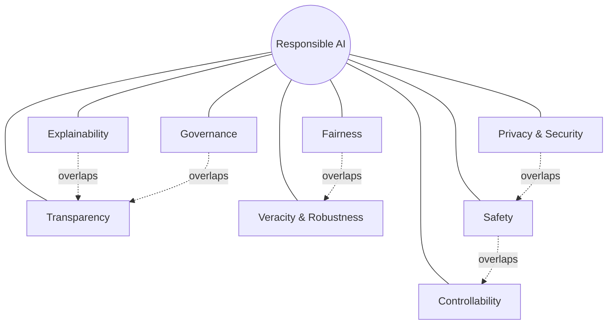
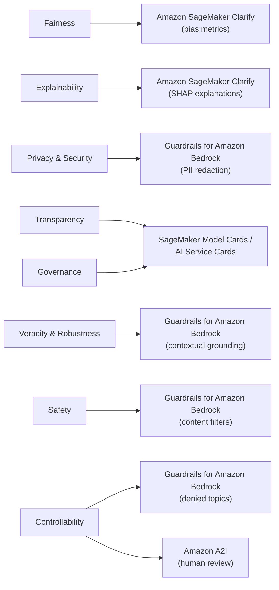
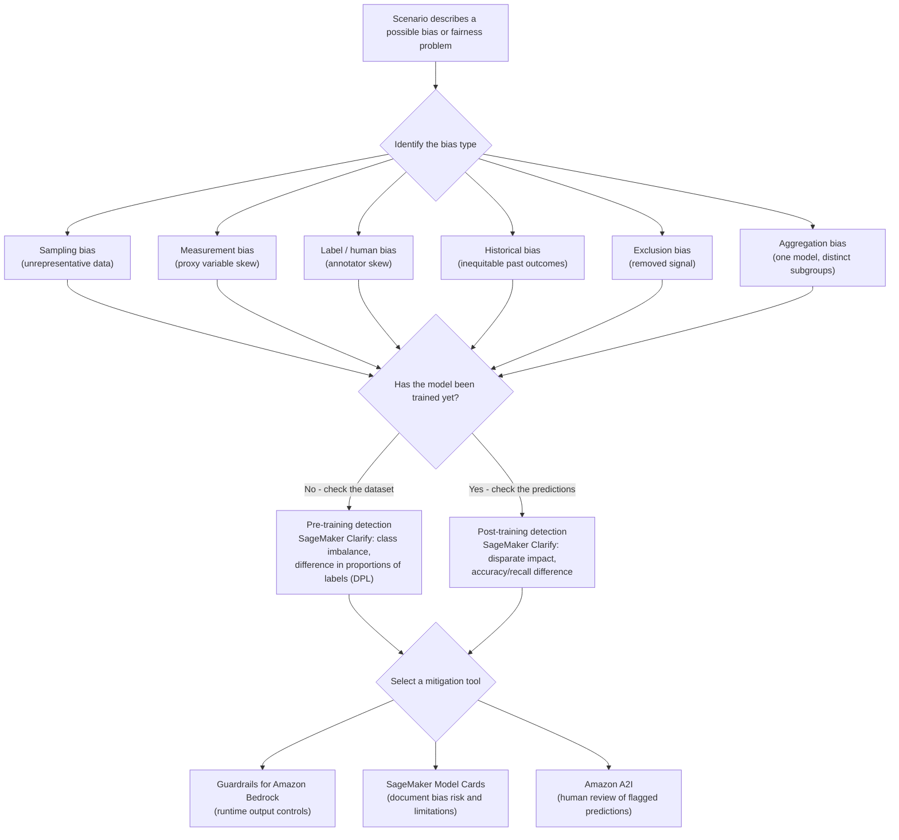

# Domain 4: Guidelines for Responsible AI

[← Domain 3: Applications of Foundation Models](domain-3-applications-of-foundation-models.md) · **Domain 4 of 5** · [Domain 5: Security, Compliance, and Governance for AI Solutions →](domain-5-security-compliance-governance.md)

## Table of contents

- [1. Core dimensions of responsible AI](#1-core-dimensions-of-responsible-ai)
- [2. Identifying bias and fairness issues in training data and model outputs](#2-identifying-bias-and-fairness-issues-in-training-data-and-model-outputs)
- [3. AWS tools for responsible AI](#3-aws-tools-for-responsible-ai)
- [4. Legal and ethical considerations](#4-legal-and-ethical-considerations)
- [5. Balancing model performance and interpretability](#5-balancing-model-performance-and-interpretability)
- [Worked example: auditing and documenting a responsible e-commerce recommendation engine](#worked-example-auditing-and-documenting-a-responsible-e-commerce-recommendation-engine)
- [Comparison table: AWS responsible AI tools at a glance](#comparison-table-aws-responsible-ai-tools-at-a-glance)
- [Quick-reference cheat sheet](#quick-reference-cheat-sheet)
- [Key terms glossary](#key-terms-glossary)
- [Practice questions](#practice-questions)
- [Answer key and explanations](#answer-key-and-explanations)

## Domain overview

Domain 4 makes up roughly **14% of scored questions** on the AWS Certified
AI Practitioner (AIF-C01) exam. It tests whether you understand what
**responsible AI** means in practice — the dimensions that make an AI
system trustworthy (fairness, explainability, privacy and security,
transparency, veracity and robustness, governance, safety, and
controllability), how to recognize bias and fairness problems in training
data and model outputs, which AWS tools help you build and document
responsible AI systems (Amazon SageMaker Clarify, SageMaker Model Cards,
Guardrails for Amazon Bedrock, AI Service Cards), the legal and ethical
issues generative AI raises (intellectual property, data privacy,
toxicity, environmental impact), and how to reason about the tradeoff
between a model's raw performance and how explainable/interpretable it is
for a given use case.

This domain matters because responsible AI is not an afterthought bolted
onto [Domain 1](domain-1-fundamentals-of-ai-and-ml.md)–[Domain 3](domain-3-applications-of-foundation-models.md) — it's tested as a first-class concern the exam expects
you to weigh in almost any scenario involving real users, regulated
industries, or generated content. Questions here are rarely about writing
code; they are scenario-based ("a company is concerned about X — which
practice, metric, or AWS tool addresses it?") and frequently hinge on
precise terminology (e.g., distinguishing *bias* from *variance*, or a
**Model Card** from an **AI Service Card**). This domain also sets up
[Domain 5](domain-5-security-compliance-governance.md) (security, compliance, and governance for AI solutions), which
goes deeper on the organizational and regulatory side of many of the same
themes.

---

## 1. Core dimensions of responsible AI

AWS defines responsible AI around a set of interrelated dimensions. The
exam expects you to recognize each dimension by its description and know
roughly which AWS capability supports it:

- **Fairness** — the AI system should treat individuals and groups
  equitably, without producing outcomes that systematically disadvantage
  people based on protected characteristics (e.g., race, gender, age).
  Fairness problems most often originate from **bias** in training data or
  model behavior ([Section 2](#2-identifying-bias-and-fairness-issues-in-training-data-and-model-outputs)).
- **Explainability** — the ability to describe, in human-understandable
  terms, *why* a model produced a particular prediction or output.
  Explainability is closely related to but distinct from **transparency**
  (below): explainability is about a specific prediction; transparency is
  about the system as a whole. AWS: **Amazon SageMaker Clarify** generates
  feature-attribution explanations (based on Shapley (SHAP) values) for
  individual predictions.
- **Privacy and security** — protecting the personal data used to train
  and run a model, and protecting the model itself from misuse, data
  leakage, or extraction attacks. AWS: **Guardrails for Amazon Bedrock**
  can detect and redact **personally identifiable information (PII)**;
  Amazon Macie discovers and classifies sensitive data at rest.
- **Transparency** — openly sharing information about how a system was
  built, what data it was trained on, its intended use, its limitations,
  and its known risks, so that users and stakeholders can make informed
  decisions about whether and how to rely on it. AWS: **SageMaker Model
  Cards** and **AI Service Cards** are the primary documentation
  mechanisms ([Section 3](#3-aws-tools-for-responsible-ai)).
- **Veracity and robustness** — the system produces **correct, reliable
  outputs** and continues to perform well when faced with unexpected,
  noisy, or adversarial inputs, rather than degrading unpredictably or
  hallucinating with confidence. AWS: **Guardrails for Amazon Bedrock**
  contextual grounding checks reduce hallucinated (non-veracious) output;
  thorough evaluation with **Amazon Bedrock Model Evaluation** tests
  robustness before deployment.
- **Governance** — the policies, processes, and accountability structures
  an organization puts in place to control how AI systems are built,
  reviewed, approved, deployed, and monitored over their lifecycle. AWS:
  SageMaker Model Cards and ML lineage tracking support governance by
  creating an auditable record; covered in more depth in [Domain 5](domain-5-security-compliance-governance.md#3-aws-config-aws-audit-manager-and-aws-cloudtrail-for-ai-governance).
- **Safety** — preventing the AI system from causing harm — physical,
  psychological, financial, or societal — including preventing it from
  generating harmful, hateful, or dangerous content. AWS: **Guardrails
  for Amazon Bedrock** content filters block categories such as hate,
  insults, violence, sexual content, and misconduct.
- **Controllability** — the ability of a human operator to monitor,
  override, adjust, or stop an AI system's behavior — for example, by
  tuning what topics it can discuss, requiring human approval for certain
  actions, or shutting it down entirely. AWS: Guardrails' denied topics
  and blocked messaging, and **Amazon Augmented AI (Amazon A2I)**
  human-review workflows, both give humans direct control over system
  behavior.

These dimensions overlap in practice: a **Guardrails for Amazon Bedrock**
configuration that redacts PII touches privacy, a content filter touches
safety, and a denied-topics list touches controllability — all from one
feature.

**Visual summary — how the 8 dimensions relate to each other:** none of
these dimensions exists in isolation; they form a wheel around one hub
concept (a system trustworthy enough to deploy), and several dimensions
directly reinforce each other (dashed lines below) — explainability feeds
transparency, privacy and safety overlap on data leakage, safety and
controllability overlap on stopping harmful behavior, governance
formalizes transparency into policy, and fairness problems are frequently
also veracity problems (a model that is unfair to a group is also
producing unreliable output for that group):

**Visual summary — how each dimension maps to an AWS tool:** the exam
frequently asks "which AWS capability addresses dimension X," so it helps
to see the dimension-to-tool mapping as one graph instead of eight
separate facts:

**AWS example:** A healthcare company deploying a generative AI assistant
needs: **fairness** (the assistant must not give worse guidance to some
patient demographics), **explainability** (clinicians need to understand
why a recommendation was made — supported by **SageMaker Clarify**),
**privacy** (patient data must never leak into responses — supported by
**Guardrails for Amazon Bedrock** PII redaction), **transparency**
(documented via a **SageMaker Model Card**), **veracity** (the assistant
must not hallucinate drug interactions — supported by **Guardrails**
contextual grounding checks), **safety** (no harmful medical
misinformation), and **controllability** (clinicians can override or shut
off the assistant at any time).

> **Exam tip:** The exam frequently gives a one-sentence scenario and asks
> "which dimension of responsible AI does this describe?" Memorize the
> **specific** word each dimension maps to: "why did the model say that?"
> → **explainability**; "is this documented and disclosed?" → **transparency**;
> "does it work equally well/fairly across groups?" → **fairness**; "can a
> human step in and stop it?" → **controllability**; "is the output
> trustworthy/accurate under stress?" → **veracity and robustness**.

#### Mini-quiz: Test your understanding of the core dimensions of responsible AI

Quick self-check before moving on — try to answer before reading the
explanation.

1. Which responsible AI dimension is most directly supported by Amazon
   SageMaker Clarify's SHAP-based feature attribution explanations?
   A. Governance
   B. Explainability
   C. Environmental impact
   D. Data residency

   **Answer: B** — Explainability is about describing, in
   human-understandable terms, why a model produced a specific prediction;
   SageMaker Clarify generates SHAP-based per-prediction explanations
   specifically for this purpose.

2. A hospital wants clinicians to be able to override or shut down a
   generative AI assistant at any time. Which dimension does this
   capability most directly address?
   A. Controllability
   B. Fairness
   C. Transparency
   D. Veracity and robustness

   **Answer: A** — Controllability is the ability of a human operator to
   monitor, override, adjust, or stop an AI system's behavior; letting
   clinicians shut off the assistant is a direct expression of that
   dimension.

3. Which AWS capability primarily supports the "transparency" dimension by
   documenting how a model was built, its training data, and its known
   limitations?
   A. Guardrails for Amazon Bedrock content filters
   B. Amazon SageMaker Model Cards
   C. Amazon Macie
   D. AWS Customer Carbon Footprint Tool

   **Answer: B** — SageMaker Model Cards are the primary mechanism for
   documenting a model's build details, intended use, and limitations,
   which is exactly what the transparency dimension requires. Guardrails
   (A) filters live inference content rather than documenting the model;
   Macie (C) discovers sensitive data at rest; the Carbon Footprint Tool
   (D) reports emissions, unrelated to transparency.

---

## 2. Identifying bias and fairness issues in training data and model outputs

**Bias** in ML is a systematic skew in a model's predictions caused by
problems in the training data or the training process — as distinct from
**variance**, which is a model's sensitivity to small fluctuations in the
training data (recall from [Domain 1](domain-1-fundamentals-of-ai-and-ml.md#7-overfitting-underfitting-and-the-biasvariance-trade-off): high bias underfits, high variance
overfits). Responsible AI bias is about *unfair skew*, most visibly along
demographic or protected-characteristic lines, and it can be introduced at
multiple points:

- **Sampling bias** — the training data does not represent the real-world
  population the model will be used on (e.g., a facial recognition
  dataset with mostly one demographic group).
- **Measurement bias** — the way data is collected or labeled
  systematically differs across groups (e.g., a proxy variable correlates
  more strongly with a protected characteristic than with the actual
  outcome of interest).
- **Label bias / human bias** — human annotators introduce their own
  conscious or unconscious biases when labeling training data.
- **Historical bias** — the data accurately reflects the real world, but
  the real world itself contains pre-existing societal inequities (e.g.,
  historical lending decisions that reflected discriminatory practices),
  so a model trained on it perpetuates that inequity.
- **Exclusion bias** — relevant data or features are removed or excluded
  from a dataset in a way that removes signal needed for a group to be
  fairly represented.
- **Aggregation bias** — a single model is applied uniformly across
  groups that actually need distinct treatment, hiding subgroup
  differences that matter.

**Detecting bias** requires comparing model behavior across groups, not
just measuring overall accuracy — a model can have high overall accuracy
while performing far worse for a minority subgroup. Common signals:

- **Class imbalance** — one class (or one demographic group) is
  significantly underrepresented in the training data.
- **Difference in proportions of labels (DPL)** — the positive outcome
  label appears at a different rate across groups in the training data.
- **Disparate impact** — a facially neutral model or policy produces a
  substantially different outcome rate across groups in practice.

**Mitigation techniques** apply at three stages of the ML lifecycle:

- **Pre-processing (before training)** — rebalance or augment the
  training data, remove or transform biased features, oversample
  underrepresented groups.
- **In-processing (during training)** — add fairness constraints or
  regularization terms to the training objective so the model is
  penalized for unfair outcomes.
- **Post-processing (after training)** — adjust prediction thresholds per
  group or recalibrate outputs after training completes, without
  retraining the model.

**Visual summary — bias detection and mitigation workflow:** given a
scenario, first identify which of the six bias types it describes, then
detect it with the appropriate SageMaker Clarify metric depending on
whether the model has been trained yet, then select an AWS tool to
mitigate or govern it:

**AWS example:** A bank builds a credit-approval model. Before training,
they run **Amazon SageMaker Clarify** on the training dataset and discover
a large **difference in proportions of labels** between two demographic
groups — a sign of potential historical bias baked into past approval
decisions. After training, they run SageMaker Clarify's post-training
bias metrics and find the model also has a materially different
**disparate impact** across those groups in its predictions. The team
responds with pre-processing (rebalancing the training set) and continues
monitoring bias drift over time with **Amazon SageMaker Model Monitor**.

> **Exam tip:** Know the difference between **bias** (systematic,
> unfair skew — a responsible-AI/fairness problem) and **variance**
> (sensitivity to training data fluctuations — an underfitting/overfitting
> problem from [Domain 1](domain-1-fundamentals-of-ai-and-ml.md#7-overfitting-underfitting-and-the-biasvariance-trade-off)); the exam tests both terms and expects you not to
> conflate them. Also remember that **SageMaker Clarify measures bias both
> before training (on the dataset) and after training (on model
> predictions)** — a scenario that mentions checking a *dataset* for bias
> before a model is even built is still a Clarify pre-training bias
> metric, not a post-training one.

#### Mini-quiz: Test your understanding of identifying bias and fairness issues

1. A facial recognition dataset contains mostly images of one demographic
   group, causing the trained model to perform far worse on
   underrepresented groups. Which type of bias does this describe?
   A. Historical bias
   B. Sampling bias
   C. Aggregation bias
   D. Measurement bias

   **Answer: B** — Sampling bias occurs when the training data does not
   represent the real-world population the model will be used on, exactly
   as described here. Historical bias (A) is about accurately-collected
   data reflecting pre-existing societal inequities; aggregation bias (C)
   is about applying one model where subgroups need distinct treatment;
   measurement bias (D) is about how data is collected or labeled
   differing systematically across groups.

2. Which SageMaker Clarify metric would you use, *before* a model is even
   trained, to check whether a positive outcome label appears at a
   different rate across demographic groups in the dataset?
   A. Disparate impact
   B. Difference in proportions of labels (DPL)
   C. SHAP value
   D. Accuracy difference

   **Answer: B** — DPL is a pre-training metric measuring how differently
   a positive label appears across groups in the dataset. Disparate impact
   (A) and accuracy difference (D) are post-training metrics computed on
   model predictions; a SHAP value (C) explains a specific prediction, it
   isn't a bias metric.

3. A team adds a fairness constraint to the training objective so the
   model is penalized during training for producing unfair outcomes
   across groups. Which stage of bias mitigation does this describe?
   A. Pre-processing
   B. Post-processing
   C. In-processing
   D. Data collection

   **Answer: C** — In-processing mitigation adds fairness constraints or
   regularization terms to the training objective itself. Pre-processing
   (A) adjusts the data before training starts; post-processing (B)
   adjusts outputs/thresholds after training without retraining; "data
   collection" (D) is not one of the three defined mitigation stages.

---

## 3. AWS tools for responsible AI

- **Amazon SageMaker Clarify** — detects potential **bias** in datasets
  (pre-training metrics, such as class imbalance and difference in
  proportions of labels) and in trained model predictions (post-training
  metrics, such as disparate impact), and generates **feature attribution
  explanations** using **SHAP (SHapley Additive exPlanations)** values to
  show which input features most influenced a given prediction. Clarify
  integrates with SageMaker Pipelines and SageMaker Model Monitor to
  continue checking for bias drift after deployment.
- **Amazon SageMaker Model Cards** — a structured, centralized place to
  document essential facts about a model you built and trained: intended
  use, training data description, evaluation results and metrics, risk
  rating, known limitations, and ethical considerations. Model Cards
  create a durable, auditable record that supports **transparency** and
  **governance**, and can be shared with stakeholders who need to decide
  whether a model is appropriate for a given use.
- **Guardrails for Amazon Bedrock** — a configurable safety and compliance
  layer applied to foundation model inputs and outputs, independent of
  which underlying FM is used. Key Guardrails capabilities:
  - **Denied topics** — block the model from engaging with specified
    topics entirely.
  - **Content filters** — block harmful content categories (hate,
    insults, sexual, violence, misconduct, and prompt attacks/prompt
    injection) at configurable strength thresholds.
  - **Word filters** — block specific words or phrases (e.g., profanity,
    competitor names).
  - **Sensitive information filters** — detect and redact or block
    **PII** in prompts and responses.
  - **Contextual grounding checks** — verify that a response is grounded
    in (and doesn't contradict) the provided source content, reducing
    **hallucination**.
- **AI Service Cards** — AWS's own public documentation, published by AWS,
  describing the **intended use cases, limitations, design
  considerations, and responsible AI best practices** for a specific
  pre-built AWS AI service (e.g., Amazon Rekognition, Amazon Transcribe).
  They are AWS's transparency artifact for its own managed AI services.
- **Amazon Augmented AI (Amazon A2I)** — a service for building
  **human-in-the-loop review workflows** so a person reviews and, if
  needed, corrects a model's low-confidence or high-stakes predictions
  before they're acted on — directly supporting **controllability** and
  **safety**.

**AWS example:** A company fine-tunes a custom text-classification model
on **Amazon SageMaker** and documents it with a **SageMaker Model Card**
(intended use, training data, evaluation metrics, limitations) before
approving it for production. Separately, they build a customer-facing
chatbot on **Amazon Bedrock** and attach **Guardrails for Amazon Bedrock**
to block denied topics, redact PII, and reduce hallucination via
contextual grounding checks. For predictions the classification model is
least confident about, they route the case through **Amazon A2I** for
human review. When evaluating whether to use **Amazon Rekognition** for a
new use case, they consult its published **AI Service Card** to understand
its documented limitations before deciding.

> **Exam tip:** A very common exam distinction: a **Model Card** documents
> a model **you** built (typically in SageMaker) — you fill it in. An
> **AI Service Card** documents an **AWS-managed AI service** (like
> Rekognition or Transcribe) — AWS publishes it, and you simply *read* it
> to understand the service's intended use and limitations before
> adopting it. Also remember **SageMaker Clarify = bias detection +
> explainability**, while **Guardrails for Amazon Bedrock = runtime
> content/safety/privacy filtering** — they solve different problems at
> different stages (dataset/model evaluation vs. live inference).

#### Mini-quiz: Test your understanding of AWS tools for responsible AI

1. Which AWS capability would you use to redact personally identifiable
   information (PII) from a live generative AI application's prompts and
   responses?
   A. Amazon SageMaker Clarify
   B. Guardrails for Amazon Bedrock sensitive information filters
   C. Amazon SageMaker Model Cards
   D. AI Service Cards

   **Answer: B** — Guardrails' sensitive information filters detect and
   redact or block PII in prompts and responses at inference time.
   SageMaker Clarify (A) detects bias and generates explanations, not PII
   redaction; Model Cards (C) and AI Service Cards (D) are documentation
   artifacts, not runtime controls.

2. A fraud-detection team wants low-confidence predictions automatically
   routed to a human reviewer before any action is taken. Which AWS
   service is purpose-built for this?
   A. Amazon Augmented AI (Amazon A2I)
   B. Amazon SageMaker Clarify
   C. Guardrails for Amazon Bedrock
   D. AI Service Cards

   **Answer: A** — Amazon A2I is designed specifically for
   human-in-the-loop review workflows for low-confidence or high-stakes
   predictions. Clarify (B) measures bias/explainability; Guardrails (C)
   filters generative AI content at inference time; AI Service Cards (D)
   are documentation, not a review workflow tool.

3. Which statement correctly distinguishes a SageMaker Model Card from an
   AI Service Card?
   A. Both document AWS-managed services only
   B. A Model Card documents a model the customer built; an AI Service
      Card is AWS-published documentation for an AWS-managed AI service
   C. A Model Card is a runtime content filter; an AI Service Card is a
      training data quality report
   D. They are interchangeable terms for the same artifact

   **Answer: B** — A Model Card is filled in by the organization that
   built the model (typically in SageMaker), while an AI Service Card is
   authored and published by AWS for one of its own managed AI services.
   A reverses this; C mischaracterizes both artifacts as technical
   controls rather than documentation; D is false since they serve
   distinct, non-interchangeable purposes.

---

## 4. Legal and ethical considerations

- **Intellectual property (IP)** — generative AI raises open legal
  questions about who owns AI-generated content, whether training a model
  on copyrighted data infringes that copyright, and whether generated
  output might unintentionally reproduce copyrighted material. Some
  foundation model providers on **Amazon Bedrock** offer **IP
  indemnification** for output generated by their models (for example,
  Amazon's own Titan models), which shifts some legal risk away from the
  customer — but this doesn't apply universally to every model, so
  scenarios about IP risk mitigation should be read carefully for which
  model/provider is involved.
- **Data privacy** — using personal data to train or prompt a model
  raises obligations under regulations such as **GDPR**, and general
  best practice: minimize collection of personal data, anonymize or
  pseudonymize where possible, obtain consent, and control **data
  residency** (where data is stored/processed geographically). AWS:
  **Guardrails for Amazon Bedrock** sensitive information filters redact
  **PII** at inference time; **Amazon Macie** discovers and classifies
  sensitive data (including PII) stored in Amazon S3.
- **Toxicity** — generative models can produce hateful, harassing,
  obscene, or otherwise toxic content, whether prompted intentionally
  (jailbreaking/prompt injection) or unintentionally. Mitigations include
  **Guardrails for Amazon Bedrock content filters**, careful prompt
  design, and human review (**Amazon A2I**) for sensitive-content
  applications.
- **Environmental impact** — training and running large foundation
  models consumes substantial energy and compute resources, with a real
  carbon and resource footprint. Considerations: choosing smaller/more
  efficient models when they meet the accuracy bar (see [Section 5](#5-balancing-model-performance-and-interpretability)),
  reusing pretrained foundation models via prompting/RAG/fine-tuning
  instead of pretraining from scratch, and consulting AWS sustainability
  guidance. AWS: the **AWS Customer Carbon Footprint Tool** reports the
  estimated carbon emissions associated with your AWS usage; the **AWS
  Well-Architected Framework's Sustainability Pillar** provides design
  principles for minimizing environmental impact.

**AWS example:** A media company builds a generative AI tool that
produces marketing copy and images. Legal flags two risks: (1) **IP
risk** — could generated images resemble copyrighted training images? The
company selects a Bedrock model whose provider offers **IP
indemnification** to reduce this exposure. (2) **Data privacy** — customer
names occasionally appear in prompts, so they enable **Guardrails for
Amazon Bedrock** sensitive information filters to redact PII
automatically. They also add **content filters** to prevent **toxic**
output reaching customers, and — because they run large-scale batch image
generation — they check the **AWS Customer Carbon Footprint Tool** and
choose to schedule large jobs to run efficiently rather than on-demand at
peak load, aligning with the **Well-Architected Sustainability Pillar**.

> **Exam tip:** If a scenario says a company wants to reduce **legal risk
> from AI-generated content potentially infringing copyright**, look for
> an answer involving a model/provider that offers **IP indemnification**
> on Amazon Bedrock — not a technical control like Guardrails, which
> addresses content safety and privacy, not copyright liability. Keep
> **toxicity** (harmful/offensive content — a safety concern) distinct
> from **data privacy** (protecting personal data) and from **IP** (who
> owns/may be liable for content) — the exam tests these as separate,
> non-overlapping legal/ethical categories.

#### Mini-quiz: Test your understanding of legal and ethical considerations

1. A company is concerned that its generative AI model on Amazon Bedrock
   could infringe copyright by reproducing training content too closely.
   Which consideration most directly helps mitigate this specific legal
   risk?
   A. Choosing a Bedrock model whose provider offers IP indemnification
   B. Enabling Guardrails content filters for violence
   C. Reducing the model's context window
   D. Enabling Amazon SageMaker Model Monitor

   **Answer: A** — IP indemnification is a contractual protection some
   Bedrock model providers offer that shifts legal risk of IP
   infringement claims on generated content away from the customer.
   Content filters (B) address harmful content categories, not copyright;
   context window size (C) and Model Monitor (D) are unrelated to legal
   IP exposure.

2. Which AWS tool helps an organization estimate the carbon emissions
   associated with its AWS usage, supporting environmental-impact
   considerations?
   A. AWS Customer Carbon Footprint Tool
   B. Amazon SageMaker Clarify
   C. Guardrails for Amazon Bedrock
   D. Amazon A2I

   **Answer: A** — The AWS Customer Carbon Footprint Tool reports the
   estimated carbon emissions associated with a customer's AWS usage.
   Clarify (B) measures bias, Guardrails (C) filters live content, and
   A2I (D) routes predictions for human review — none report emissions.

3. A generative AI chatbot must avoid producing hateful or harassing
   output. Which category of legal/ethical consideration does this
   concern fall under?
   A. Intellectual property
   B. Toxicity
   C. Data residency
   D. Environmental impact

   **Answer: B** — Toxicity refers to hateful, harassing, obscene, or
   otherwise harmful generated content. Intellectual property (A)
   concerns ownership/infringement of content; data residency (C)
   concerns where data is geographically stored/processed; environmental
   impact (D) concerns the energy/resource footprint of training and
   running models.

---

## 5. Balancing model performance and interpretability

**Interpretability** (sometimes called explainability at the whole-model
level) is how easily a human can understand *how* a model arrives at its
outputs. There is a well-known general tradeoff:

- **Simple, interpretable models** (linear regression, logistic
  regression, decision trees) let a human trace exactly how each input
  feature contributed to a prediction, but often achieve **lower
  accuracy** on complex, high-dimensional problems.
- **Complex models** (deep neural networks, large foundation models)
  frequently achieve **higher accuracy** on complex tasks (image
  recognition, language generation) but are much harder to interpret —
  the "black box" problem from [Domain 2](domain-2-fundamentals-of-generative-ai.md#3-advantages-and-disadvantages-of-generative-ai) — because their reasoning is
  distributed across millions or billions of parameters rather than
  explicit, human-readable rules.

**Which side of the tradeoff to prioritize depends on the use case:**

- **High-stakes, regulated, or high-impact decisions** — credit
  underwriting, hiring, medical diagnosis, criminal justice risk
  scoring — usually require **higher interpretability**, even at some
  cost to raw accuracy, because decisions must be explainable to
  regulators, auditors, and the affected individuals (and, in some
  jurisdictions, this is a legal requirement).
- **Lower-stakes or purely performance-driven tasks** — product image
  tagging, content recommendation, spam filtering — can usually
  prioritize **maximum accuracy/performance** even from a less
  interpretable model, since the cost of an unexplained individual
  mistake is low.

Even when a complex, less-interpretable model is chosen, you can partially
recover interpretability with **post-hoc explainability techniques**
rather than switching to a simpler model outright — most notably feature
attribution methods like **SHAP**, which SageMaker Clarify computes for
you to show which input features drove a specific prediction, without
requiring the underlying model itself to be simple.

**AWS example:** A bank building a loan-approval model needs decisions it
can explain to regulators and rejected applicants, so it favors a more
interpretable model architecture and uses **Amazon SageMaker Clarify** to
generate SHAP-based, per-decision explanations, accepting a small
reduction in raw predictive accuracy. A separate team at the same bank
builds an internal model to tag scanned receipt images by expense
category; because misclassifications are low-stakes and easily corrected,
they choose a more complex, higher-accuracy deep learning model and don't
require the same level of per-prediction explainability.

> **Exam tip:** When a scenario emphasizes **regulatory requirements,
> legal accountability, or the need to explain individual decisions to
> affected people**, the exam wants you to favor **interpretability**,
> even at some accuracy cost. When a scenario emphasizes **maximum
> accuracy on a complex task with low individual stakes**, the exam wants
> you to favor **performance**, and treat SHAP/Clarify explanations as a
> way to add *some* transparency to an otherwise complex model rather
> than a substitute for choosing a simpler one.

#### Mini-quiz: Test your understanding of balancing performance and interpretability

1. A bank must be able to explain individual loan-denial decisions to
   regulators and rejected applicants. Which type of model should it
   favor, all else equal?
   A. A complex deep learning model, for maximum accuracy
   B. A simpler, more interpretable model, even at some cost to accuracy
   C. Any model, since interpretability doesn't matter for regulated
      decisions
   D. The model with the largest possible number of parameters

   **Answer: B** — High-stakes, regulated decisions like loan denials
   usually require higher interpretability, even at some accuracy cost,
   because decisions must be explainable to regulators and affected
   individuals. A and D optimize for accuracy/scale at the expense of
   explainability; C ignores the regulatory requirement entirely.

2. Which technique lets a team partially recover interpretability from a
   complex, high-accuracy model without switching to a simpler model
   architecture?
   A. Lowering the model's temperature parameter
   B. SHAP-based feature attribution via Amazon SageMaker Clarify
   C. Enabling Guardrails denied topics
   D. Increasing the size of the training dataset

   **Answer: B** — Post-hoc explainability techniques like SHAP, computed
   by SageMaker Clarify, show which input features drove a specific
   prediction without requiring the underlying model to be simple.
   Temperature (A) affects output randomness, not interpretability;
   denied topics (C) is a Guardrails content control; a larger dataset
   (D) can improve accuracy but doesn't add interpretability.

3. For a low-stakes image-tagging task where misclassifications are easily
   corrected, which side of the performance/interpretability tradeoff
   should a team typically prioritize?
   A. Maximum interpretability, even at a significant accuracy cost
   B. Maximum performance/accuracy, since individual mistakes are
      low-stakes
   C. Neither — the team should avoid deploying any model
   D. Legal compliance requirements dictate the choice regardless of
      stakes

   **Answer: B** — Lower-stakes, purely performance-driven tasks can
   usually prioritize maximum accuracy even from a less interpretable
   model, since the cost of an unexplained individual mistake is low. A
   sacrifices accuracy unnecessarily; C is not a realistic option; D
   misapplies a consideration relevant to high-stakes, regulated
   scenarios, not this one.

---

## Worked example: auditing and documenting a responsible e-commerce recommendation engine

Sections 1–5 introduced the responsible AI dimensions, bias detection and
mitigation, the AWS tools that support them, legal/ethical considerations,
and the performance/interpretability tradeoff as separate topics. This
walkthrough follows one company through building a single system that has
to address all of them together, the way AIF-C01 scenario questions
combine them.

**Scenario:** ShopSmart, an online marketplace, is replacing its generic
"most popular items" carousel with a personalized recommendation engine
trained on two years of customer browsing, purchase, and return history.
Before launch, the company's responsible-AI review board requires the
team to address fairness, explainability, transparency, and governance —
the four [core dimensions](#1-core-dimensions-of-responsible-ai) it flags
as highest-risk for a system that directly shapes what products different
customers see.

1. **Audit the training data for bias before training.** Following the
   pre-training half of the [bias detection and mitigation
   workflow](#2-identifying-bias-and-fairness-issues-in-training-data-and-model-outputs),
   the data science team runs **Amazon SageMaker Clarify** on the
   two-year browsing/purchase dataset. It surfaces a **class imbalance**
   and a large **difference in proportions of labels (DPL)**: customers
   in one age bracket have far fewer recorded "purchased" labels, not
   because they buy less, but because ShopSmart's catalog historically
   under-stocked items relevant to that group — a textbook case of
   **historical bias** (the data was collected accurately, but reflects a
   pre-existing inequity in the catalog itself).
2. **Mitigate what was found.** The team applies a **pre-processing**
   fix — rebalancing and augmenting the underrepresented segment of the
   training data — rather than an in-processing fairness constraint,
   since the root problem is the data, not the training objective.
3. **Recheck after training.** Once trained, they rerun **SageMaker
   Clarify's** post-training metrics and confirm **disparate impact**
   across those age groups has dropped to an acceptable range; a residual
   gap is closed with a **post-processing** score adjustment rather than
   a full retrain.
4. **Choose a point on the performance/interpretability tradeoff.** Per
   [Section 5](#5-balancing-model-performance-and-interpretability), an
   individual recommendation is low-stakes — a bad suggestion costs a
   lost click, not a denied loan — so the team favors a complex,
   higher-accuracy deep learning ranking model and plans to recover
   explainability with **post-hoc SHAP** instead of sacrificing accuracy.
5. **Add explainability.** They enable **SageMaker Clarify** feature
   attribution on the deployed model so that, for any individual
   recommendation, a support agent or auditor can see which signals
   (recent views, past category purchases, items frequently bought
   together) drove that specific suggestion — turning the "black box"
   ranking model into something a human can inspect on demand.
6. **Document with a Model Card.** The team fills in a **SageMaker Model
   Card** capturing the model's intended use (personalized product
   ranking, not eligibility or pricing decisions), a description of the
   training data and its two-year window, the pre- and post-training bias
   metrics from steps 1–3 and the mitigations applied, evaluation
   results, a risk rating, and known limitations — including a
   **cold-start** limitation for brand-new customers with no browsing
   history, who fall back to the old "most popular" ranking.
7. **Close the legal/ethical gaps.** Per [Section
   4](#4-legal-and-ethical-considerations), browsing and purchase history is personal data, so the
   team pseudonymizes customer identifiers before they reach the training
   pipeline and confirms **Amazon Macie** finds no raw PII sitting
   unencrypted in the S3 training bucket. Because the model will be
   retrained on a recurring schedule rather than continuously, they also
   check the **AWS Customer Carbon Footprint Tool** and settle on a
   monthly retraining cadence instead of daily, balancing freshness
   against unnecessary compute and environmental cost.
8. **Establish governance and ongoing monitoring.** The review board signs
   off on launch only after the Model Card is complete, and the team
   attaches **Amazon SageMaker Model Monitor** to the production endpoint
   to watch for bias drift as customer behavior evolves after launch.
   They schedule a recurring quarterly review where the board re-reads
   the Model Card against the latest Clarify metrics, and route any
   recommendation flagged as high-risk (for example, a sudden spike in
   disparate impact for one segment) through **Amazon A2I** for human
   review before the ranking logic ships to all customers — closing the
   loop from one-time bias mitigation into continuous **governance**.

> **Exam tip:** Notice that fairness, explainability, transparency, and
> governance aren't solved by one tool each in isolation — **SageMaker
> Clarify** shows up twice (bias metrics *and* SHAP explanations), and the
> **Model Card** created in step 6 becomes the artifact the governance
> process in step 8 keeps re-checking. When a scenario describes an
> ongoing review cadence *referencing* a model's documented bias metrics
> and limitations, that's **governance built on top of transparency** —
> not a new, separate tool.

---

## Comparison table: AWS responsible AI tools at a glance

| Tool | What it is | Primary use case | Applies to | When to choose it |
|---|---|---|---|---|
| **Amazon SageMaker Clarify** | Bias-detection and explainability tool | Measure pre-training/post-training bias metrics; generate SHAP-based feature attribution explanations | Datasets and trained models (typically SageMaker) | You need to detect/quantify bias or explain *why* a model made a specific prediction |
| **Amazon SageMaker Model Cards** | Structured model documentation | Record intended use, training data, evaluation results, limitations, risk rating | Models you build (typically SageMaker) | You need an auditable transparency/governance record for a model your organization built |
| **Guardrails for Amazon Bedrock** | Configurable runtime safety/privacy filter | Block denied topics, filter harmful/toxic content, redact PII, reduce hallucination via grounding checks | Foundation model inputs/outputs at inference time (Bedrock) | You need to control what a live generative AI application can say or must not say |
| **AI Service Cards** | AWS-published service documentation | Communicate intended use, limitations, and design considerations for an AWS AI service | AWS-managed AI services (e.g., Rekognition, Transcribe) | You need to evaluate whether a pre-built AWS AI service fits your use case responsibly |
| **Amazon A2I** | Human-in-the-loop review workflow builder | Route low-confidence or high-stakes predictions to human reviewers | Predictions from ML models or AWS AI services | You need a human to review/approve/correct outputs before they're acted on |

> **Exam tip:** The unifying pattern: **Clarify** answers "is this
> biased / why did the model decide this?", **Model Cards** and **AI
> Service Cards** answer "what is this model/service, and what are its
> documented limits?" (self-authored vs. AWS-authored), **Guardrails**
> answers "what should this live application never say or leak?", and
> **A2I** answers "who double-checks this before it's used?"

---

## Quick-reference cheat sheet

A condensed, one-to-two page (print-friendly) recap of this domain's
highest-yield material for last-minute review right before the exam. It
restates material covered in full in [Section 1](#1-core-dimensions-of-responsible-ai), [Section 2](#2-identifying-bias-and-fairness-issues-in-training-data-and-model-outputs), and [Section 3](#3-aws-tools-for-responsible-ai) —
it is not a substitute for reading those sections, only a fast recall
aid once you already have.

**The 8 dimensions of responsible AI (Section 1) — recognize the keyword, know the AWS tool:**

| Dimension | Key question it answers | Primary AWS tool |
|---|---|---|
| Fairness | Does it treat individuals/groups equitably, without disadvantaging protected characteristics? | Amazon SageMaker Clarify (bias metrics) |
| Explainability | Why did the model produce *this specific* prediction? | Amazon SageMaker Clarify (SHAP explanations) |
| Privacy and security | Is personal data protected, and is the model protected from misuse/leakage? | Guardrails for Amazon Bedrock (PII redaction); Amazon Macie |
| Transparency | Is how the system was built, trained, and limited openly documented? | SageMaker Model Cards / AI Service Cards |
| Veracity and robustness | Is the output correct and reliable, even under noisy/adversarial input? | Guardrails for Amazon Bedrock (contextual grounding) |
| Governance | Are there policies/processes controlling the AI lifecycle and accountability? | SageMaker Model Cards; ML lineage tracking |
| Safety | Does the system avoid causing harm or generating dangerous content? | Guardrails for Amazon Bedrock (content filters) |
| Controllability | Can a human monitor, override, adjust, or stop the system? | Guardrails (denied topics); Amazon A2I (human review) |

**Fast disambiguation:** "why did it say that?" → **explainability**
(one prediction) vs. "is it documented/disclosed?" → **transparency**
(whole system). "does it work fairly across groups?" → **fairness**
vs. "is the output accurate/trustworthy under stress?" → **veracity and
robustness**. "can a human step in?" → **controllability**.

**The 6 bias categories in training data (Section 2) — match the scenario to the category:**

| Bias type | One-line definition | Scenario clue |
|---|---|---|
| Sampling bias | Training data doesn't represent the real-world population | Dataset overrepresents one demographic group |
| Measurement bias | Data collection/labeling systematically differs across groups | A proxy variable correlates with a protected characteristic more than the real outcome |
| Label bias / human bias | Human annotators inject conscious/unconscious bias while labeling | Annotators rate similar content differently depending on subject group |
| Historical bias | Data accurately reflects a real world that is itself inequitable | Past lending/hiring decisions reflected discriminatory practices |
| Exclusion bias | Relevant data/features are removed, dropping signal a group needs | A feature important for fair treatment of a subgroup was dropped during cleaning |
| Aggregation bias | One model is applied uniformly to groups that need distinct treatment | A single model hides subgroup differences that actually matter |

**Bias mitigation stages — one-line-per-stage recall:**

- **Pre-processing** → before training → rebalance/augment data, remove/transform biased features.
- **In-processing** → during training → add fairness constraints/regularization to the training objective.
- **Post-processing** → after training, no retraining → adjust prediction thresholds or recalibrate outputs per group.

**Bias detection metrics — pick by lifecycle stage:**

| Question | Metric | Stage |
|---|---|---|
| "Does a positive label appear at a different rate across groups in the dataset?" | Difference in proportions of labels (DPL) | Pre-training (dataset) |
| "Is one class/group significantly underrepresented in the dataset?" | Class imbalance | Pre-training (dataset) |
| "Does a facially-neutral model produce different outcome rates across groups?" | Disparate impact | Post-training (predictions) |

**Key definitions to have cold:** bias (systematic, unfair skew from
training data/process — a fairness problem) vs. variance (sensitivity to
training-data fluctuations — an underfitting/overfitting problem, not a
responsible-AI concept) · SHAP (feature-attribution values explaining a
single prediction) · PII (data that can identify a specific individual)
· disparate impact (post-training group-outcome gap) · DPL (pre-training
label-rate gap across groups).

**Common exam traps:**

- **Bias vs. variance** — bias is a fairness/training-data problem;
  variance is a model-sensitivity/overfitting problem from [Domain 1](domain-1-fundamentals-of-ai-and-ml.md#7-overfitting-underfitting-and-the-biasvariance-trade-off).
  Don't conflate them.
- **SageMaker Clarify measures bias both before *and* after training** —
  a scenario checking a *dataset* for bias pre-model is still a Clarify
  pre-training metric (DPL, class imbalance), not disparate impact.
- **Guardrails filters live inference content**; it does not detect bias
  in training data or generate explanations — that's Clarify's job, not
  Guardrails'.
- **Explainability ≠ transparency** — explainability is per-prediction
  ("why this output?"); transparency is system-wide documentation ("what
  is this model, and what are its limits?").
- A model can have **high overall accuracy while still being unfair to a
  minority subgroup** — always compare behavior across groups, not just
  aggregate accuracy.

---

## Key terms glossary

> Looking for a term from another domain? [`docs/master-glossary.md`](master-glossary.md) indexes every domain's key terms alphabetically with domain tags (e.g. `[D1, D3]`) and links back here.

- **Responsible AI** — the practice of designing, building, and operating
  AI systems that are fair, explainable, private and secure, transparent,
  veracious and robust, well-governed, safe, and controllable.
- **Fairness** — an AI system treats individuals and groups equitably
  without systematically disadvantaging protected groups.
- **Explainability** — the ability to describe, in human-understandable
  terms, why a model produced a specific output.
- **Transparency** — openly documenting how a system was built, trained,
  and intended to be used, including its limitations.
- **Veracity and robustness** — a system produces accurate, reliable
  output and degrades gracefully (rather than unpredictably) under
  unexpected or adversarial input.
- **Governance** — the policies and processes an organization uses to
  control the AI lifecycle and maintain accountability.
- **Safety** — preventing an AI system from causing harm, including
  generating harmful content.
- **Controllability** — the ability for humans to monitor, override, or
  stop an AI system's behavior.
- **Bias (ML fairness sense)** — a systematic, unfair skew in a model's
  predictions caused by problems in training data or the training
  process.
- **Variance** — a model's sensitivity to fluctuations in the training
  data (distinct from bias; see [Domain 1](domain-1-fundamentals-of-ai-and-ml.md#7-overfitting-underfitting-and-the-biasvariance-trade-off)).
- **Sampling bias** — training data does not represent the real-world
  population the model will serve.
- **Historical bias** — training data accurately reflects a real world
  that itself contains pre-existing societal inequities.
- **Label bias / human bias** — bias introduced by human annotators when
  labeling training data.
- **Class imbalance** — one class or group is significantly
  underrepresented in a dataset.
- **Difference in proportions of labels (DPL)** — a pre-training bias
  metric measuring how differently a positive label appears across
  groups in the dataset.
- **Disparate impact** — a post-training bias metric measuring how
  differently a model's outcomes fall across groups in practice.
- **Pre-processing (bias mitigation)** — mitigating bias by adjusting the
  training data before training.
- **In-processing (bias mitigation)** — mitigating bias by adding
  fairness constraints during training.
- **Post-processing (bias mitigation)** — mitigating bias by adjusting
  model outputs/thresholds after training, without retraining.
- **Amazon SageMaker Clarify** — AWS tool for detecting bias in datasets
  and models and generating SHAP-based explainability reports.
- **SHAP (Shapley Additive exPlanations)** — a feature-attribution method
  that quantifies how much each input feature contributed to a specific
  prediction.
- **Amazon SageMaker Model Cards** — structured documentation of a
  model's intended use, training data, evaluation results, and
  limitations.
- **AI Service Cards** — AWS-published documentation describing intended
  use, limitations, and design considerations of an AWS AI service.
- **Guardrails for Amazon Bedrock** — configurable safety/privacy filters
  applied to foundation model inputs and outputs at inference time.
- **Denied topics (Guardrails)** — a Guardrails configuration that blocks
  a model from engaging with specified topics.
- **Contextual grounding check (Guardrails)** — a Guardrails check that
  verifies a response is grounded in provided source content, reducing
  hallucination.
- **Personally identifiable information (PII)** — data that can identify
  a specific individual; a key target of privacy protections and
  Guardrails' sensitive information filters.
- **Amazon Augmented AI (Amazon A2I)** — a service for building
  human-in-the-loop review workflows for ML predictions.
- **Intellectual property (IP) indemnification** — a contractual
  protection (offered by some Bedrock model providers) that shifts legal
  risk of IP infringement claims on generated content away from the
  customer.
- **Toxicity** — hateful, harassing, obscene, or otherwise harmful
  generated content.
- **Data residency** — the geographic location where data is stored and
  processed, relevant to privacy and regulatory compliance.
- **AWS Customer Carbon Footprint Tool** — an AWS tool that reports
  estimated carbon emissions associated with a customer's AWS usage.
- **AWS Well-Architected Framework Sustainability Pillar** — design
  principles for minimizing the environmental impact of workloads on AWS.
- **Interpretability** — how easily a human can understand how a model
  arrives at its outputs; trades off against raw performance for complex
  models.
- **Black box model** — a model (typically a deep neural network or
  foundation model) whose internal decision process is not easily
  understood by humans.

---

## Practice questions

1. **[Beginner]** A hiring-decision model performs well overall but is later found to
   reject qualified candidates from one demographic group at a
   significantly higher rate than others. Which responsible AI dimension
   does this problem most directly violate?
   A. Governance
   B. Fairness
   C. Controllability
   D. Environmental sustainability

2. **[Intermediate]** Which AWS service should a data science team use to measure whether a
   training dataset shows a significant difference in the proportion of
   positive labels across two demographic groups, before a model is even
   trained?
   A. Guardrails for Amazon Bedrock
   B. Amazon SageMaker Clarify
   C. Amazon A2I
   D. AI Service Cards

3. **[Beginner]** A company wants to document, for internal governance purposes, the
   intended use, training data description, evaluation metrics, and known
   limitations of a custom model it trained on Amazon SageMaker. Which
   AWS capability is designed for exactly this?
   A. AI Service Cards
   B. Guardrails for Amazon Bedrock
   C. Amazon SageMaker Model Cards
   D. Amazon Macie

4. **[Intermediate]** A team is evaluating whether to adopt Amazon Rekognition for a new
   facial analysis use case and wants to understand AWS's own documented
   limitations and design considerations for the service before deciding.
   Where should they look?
   A. Amazon SageMaker Model Cards
   B. AI Service Cards
   C. Amazon SageMaker Clarify reports
   D. AWS Customer Carbon Footprint Tool

5. **[Intermediate]** A generative AI chatbot occasionally generates confident but
   fabricated answers not supported by the source documents it was given.
   Which Guardrails for Amazon Bedrock capability most directly addresses
   this?
   A. Denied topics
   B. Word filters
   C. Contextual grounding checks
   D. Content filters for violence

6. **[Beginner]** Which of the following best distinguishes bias from variance in a
   machine learning model?
   A. Bias is a model's sensitivity to small fluctuations in training data; variance is a systematic unfair skew
   B. Bias is a systematic, often unfair skew from data or training issues; variance is a model's sensitivity to fluctuations in the training data
   C. Bias and variance both refer exclusively to fairness across demographic groups
   D. Bias and variance are two names for the same concept

7. **[Intermediate]** A bank discovers that its loan approval model reflects discriminatory
   patterns present in decades of past lending decisions, even though the
   data was collected accurately. Which type of bias does this describe?
   A. Sampling bias
   B. Historical bias
   C. Measurement bias
   D. Aggregation bias

8. **[Beginner]** A company wants a low-confidence or high-stakes model prediction to be
   automatically routed to a human reviewer before any action is taken.
   Which AWS service is designed for this?
   A. Amazon A2I
   B. Amazon SageMaker Clarify
   C. Guardrails for Amazon Bedrock
   D. AI Service Cards

9. **[Intermediate]** A media company is concerned that images generated by a foundation
   model on Amazon Bedrock could expose it to copyright infringement
   claims. Which consideration would most directly reduce this specific
   legal risk?
   A. Enabling Guardrails content filters for violence
   B. Choosing a Bedrock model whose provider offers IP indemnification
   C. Lowering the model's temperature parameter
   D. Adding a SageMaker Model Card

10. **[Beginner]** Which of the following is an example of protecting data privacy in a
    generative AI application built on Amazon Bedrock?
    A. Using Guardrails sensitive information filters to redact PII from prompts and responses
    B. Using chain-of-thought prompting to improve reasoning accuracy
    C. Using SageMaker JumpStart to fine-tune a model
    D. Increasing the model's context window

11. **[Intermediate]** A financial institution is choosing between a simple, interpretable
    scoring model and a complex deep learning model for a credit
    underwriting decision that must be explained to regulators and
    rejected applicants. Which factor should weigh most heavily in favor
    of the simpler model?
    A. The simpler model always has lower training cost
    B. The simpler model requires less training data
    C. The simpler model is easier to interpret and explain to regulators and affected individuals, which is required for this high-stakes, regulated decision
    D. The simpler model has no risk of bias

12. **[Intermediate]** Which AWS tool would a data scientist use to generate a SHAP-based
    explanation showing which input features most influenced a specific
    model prediction?
    A. Amazon SageMaker Clarify
    B. Amazon A2I
    C. Guardrails for Amazon Bedrock
    D. AWS Customer Carbon Footprint Tool

13. **[Intermediate]** A company is concerned about the environmental impact of continuously
    training large foundation models from scratch. Which practice would
    most directly reduce this concern while still meeting business needs?
    A. Always choosing the largest available foundation model regardless of task
    B. Adapting an existing pretrained foundation model via prompting, RAG, or fine-tuning instead of pretraining a new model from scratch
    C. Disabling all model evaluation to save compute
    D. Running all training jobs at peak demand hours

14. **[Advanced]** Which combination of concerns falls under "legal and ethical
    considerations" for generative AI on the AIF-C01 exam? (Select TWO.)
    A. Intellectual property risk from training on or generating content similar to copyrighted material
    B. Data privacy obligations around personal data used in training or prompts
    C. Choosing the number of attention heads in a transformer
    D. Selecting the AWS Region with the lowest network latency
    E. Configuring a VPC subnet's CIDR block

15. **[Advanced]** A toy-recommendation model has low individual stakes per prediction —
    a wrong recommendation just means a less-relevant suggestion — but
    the business wants the highest possible accuracy. Which approach best
    fits the performance/interpretability tradeoff here?
    A. Use the simplest, most interpretable model available regardless of accuracy
    B. Favor a more complex, higher-accuracy model, since individual prediction stakes are low and full interpretability is less critical
    C. Refuse to deploy any model until it is 100% interpretable
    D. Use SageMaker Clarify explanations as a substitute for building any model at all

16. **[Beginner]** Which AWS capability is specifically designed to block a Bedrock
    foundation model from engaging with a configured list of prohibited
    subject areas entirely, regardless of how the user phrases the
    request?
    A. Denied topics in Guardrails for Amazon Bedrock
    B. SageMaker Model Cards
    C. Amazon SageMaker Clarify pre-training bias metrics
    D. AWS Customer Carbon Footprint Tool

17. **[Advanced]** A model trained on resumes systematically down-ranks candidates whose
    resumes were labeled by an annotator who, consciously or not, favored
    a particular educational background. Which type of bias does this
    best describe?
    A. Sampling bias
    B. Label bias / human bias
    C. Aggregation bias
    D. Environmental bias

18. **[Beginner]** What is the primary purpose of an Amazon SageMaker Model Card?
    A. To block harmful content from reaching end users in real time
    B. To document a model's intended use, training data, evaluation results, and limitations for transparency and governance
    C. To measure the carbon footprint of a training job
    D. To redact personally identifiable information from model inputs

19. **[Advanced]** A company's post-training bias analysis with Amazon SageMaker Clarify
    reveals a significant disparate impact across two demographic groups
    in the model's predictions. Which stage of bias mitigation would
    involve adjusting the model's output thresholds per group without
    retraining the model?
    A. Pre-processing
    B. In-processing
    C. Post-processing
    D. Data collection

20. **[Intermediate]** Which statement correctly distinguishes a SageMaker Model Card from
    an AI Service Card?
    A. A Model Card is authored by AWS for its own AI services; an AI Service Card is authored by customers for their own models
    B. A Model Card documents a model an organization built (e.g., in SageMaker); an AI Service Card is AWS-published documentation for an AWS-managed AI service
    C. They are two names for the exact same artifact
    D. A Model Card is only used for generative AI; an AI Service Card is only used for traditional ML

---

## Answer key and explanations

1. **B — Fairness.** A model that systematically disadvantages a
   demographic group in its outcomes is a fairness problem by definition.
   Governance (A) concerns oversight processes, not the outcome itself;
   controllability (C) concerns human ability to intervene; environmental
   sustainability (D) concerns resource/energy impact, unrelated to
   discriminatory outcomes.

2. **B — Amazon SageMaker Clarify.** Clarify computes pre-training bias
   metrics, including difference in proportions of labels, directly on a
   dataset before any model is trained. Guardrails (A) operates at
   inference time on a deployed generative model, not on a training
   dataset; A2I (C) routes predictions to human reviewers, it doesn't
   measure dataset bias; AI Service Cards (D) are documentation, not a
   measurement tool.

3. **C — Amazon SageMaker Model Cards.** Model Cards are purpose-built to
   record intended use, training data, evaluation results, and
   limitations for a model an organization trained. AI Service Cards (A)
   document AWS-managed services, not your own custom model; Guardrails
   (B) filters live inference content, it doesn't document a model; Macie
   (D) discovers and classifies sensitive data, unrelated to model
   documentation.

4. **B — AI Service Cards.** They are AWS's published documentation of
   intended use, limitations, and design considerations for its own AI
   services like Rekognition. Model Cards (A) are for models the
   *customer* built, not pre-built AWS services; Clarify reports (C)
   assess bias/explainability of a specific dataset or model, not general
   service documentation; the Carbon Footprint Tool (D) reports emissions,
   unrelated to service limitations.

5. **C — Contextual grounding checks.** This Guardrails feature verifies
   that a response is grounded in the provided source content, directly
   reducing hallucinated/fabricated answers. Denied topics (A) block
   entire subject areas, not ungrounded facts within an allowed topic;
   word filters (B) block specific words/phrases; content filters for
   violence (D) address harmful content categories, not factual grounding.

6. **B — Bias is a systematic, often unfair skew from data or training
   issues; variance is a model's sensitivity to fluctuations in the
   training data.** This is the precise definitional distinction the exam
   tests. A reverses the definitions; C incorrectly limits both terms to
   fairness only, when variance is a general ML concept unrelated to
   demographics; D is false since they describe different phenomena.

7. **B — Historical bias.** The data was collected accurately but
   reflects real-world, pre-existing societal inequities embedded in past
   decisions. Sampling bias (A) refers to unrepresentative data
   collection, not accurately-collected-but-inequitable outcomes;
   measurement bias (C) refers to systematically different data
   collection/labeling methods across groups; aggregation bias (D) refers
   to applying one model uniformly where subgroup differences matter.

8. **A — Amazon A2I.** Amazon Augmented AI is specifically built for
   human-in-the-loop review workflows for low-confidence or high-stakes
   predictions. SageMaker Clarify (B) measures bias/explainability, it
   doesn't route predictions for human review; Guardrails (C) filters
   generative AI content at inference time; AI Service Cards (D) are
   documentation, not a review workflow tool.

9. **B — Choosing a Bedrock model whose provider offers IP
   indemnification.** This directly and contractually addresses copyright
   infringement legal risk on generated content. Content filters for
   violence (A) address harmful content, not copyright; lowering
   temperature (C) reduces randomness but doesn't address legal
   copyright exposure; a Model Card (D) documents the model, it provides
   no legal protection.

10. **A — Using Guardrails sensitive information filters to redact PII
    from prompts and responses.** This is a direct, purpose-built privacy
    protection for a Bedrock application. Chain-of-thought prompting (B)
    improves reasoning, unrelated to privacy; fine-tuning with JumpStart
    (C) adapts a model but doesn't itself protect privacy; increasing the
    context window (D) affects how much text a model can process, not
    privacy protection.

11. **C — The simpler model is easier to interpret and explain to
    regulators and affected individuals, which is required for this
    high-stakes, regulated decision.** This captures the correct
    performance/interpretability tradeoff reasoning for regulated,
    high-stakes decisions. A and B are not reliably true in general and
    aren't the deciding factor described in the scenario; D is false —
    simpler models can still be biased.

12. **A — Amazon SageMaker Clarify.** Clarify generates SHAP-based
    feature-attribution explanations for individual model predictions.
    Amazon A2I (B) routes predictions to humans, it doesn't generate
    explanations; Guardrails (C) filters live content; the Carbon
    Footprint Tool (D) reports emissions, unrelated to explainability.

13. **B — Adapting an existing pretrained foundation model via prompting,
    RAG, or fine-tuning instead of pretraining a new model from scratch.**
    Reusing an existing FM avoids the enormous compute/energy cost of
    pretraining from scratch. Always choosing the largest model (A)
    increases resource use; disabling evaluation (C) doesn't reduce
    training energy and harms quality/safety; running at peak demand (D)
    does not reduce environmental impact and can increase strain on the
    grid.

14. **A and B — Intellectual property risk from training on or generating
    content similar to copyrighted material, and data privacy obligations
    around personal data used in training or prompts.** These are the
    legal/ethical considerations the exam associates with this domain.
    Attention heads (C) is a model architecture detail from [Domain 2](domain-2-fundamentals-of-generative-ai.md#1-generative-ai-core-concepts);
    Region selection for latency (D) and VPC subnet configuration (E) are
    infrastructure/networking concerns, not legal or ethical
    considerations.

15. **B — Favor a more complex, higher-accuracy model, since individual
    prediction stakes are low and full interpretability is less
    critical.** This matches the stated tradeoff: low individual stakes
    plus a stated priority on accuracy favors performance over
    interpretability. A ignores the stated business goal of highest
    accuracy; C is an unreasonable, unstated requirement; D
    mischaracterizes what Clarify explanations are for (adding partial
    transparency to a chosen model, not replacing the model).

16. **A — Denied topics in Guardrails for Amazon Bedrock.** This feature
    is purpose-built to block a model from engaging with configured
    subject areas regardless of phrasing. Model Cards (B) are
    documentation, not a runtime control; Clarify pre-training bias
    metrics (C) assess dataset bias, not topic restriction; the Carbon
    Footprint Tool (D) is unrelated to content control.

17. **B — Label bias / human bias.** An annotator's conscious or
    unconscious preferences shaping how training labels were assigned is
    the definition of label/human bias. Sampling bias (A) concerns
    unrepresentative data collection, not labeling; aggregation bias (C)
    concerns applying one model where subgroup differences matter;
    "environmental bias" (D) is not a recognized bias category in this
    context.

18. **B — To document a model's intended use, training data, evaluation
    results, and limitations for transparency and governance.** This is
    the defining purpose of a Model Card. Blocking harmful content in
    real time (A) describes Guardrails, not a Model Card; measuring
    carbon footprint (C) describes the AWS Customer Carbon Footprint
    Tool; redacting PII (D) describes Guardrails' sensitive information
    filters.

19. **C — Post-processing.** Adjusting output thresholds per group after
    a model has already been trained, without retraining, is the
    definition of post-processing bias mitigation. Pre-processing (A)
    happens before training on the data itself; in-processing (B) happens
    during training via constraints on the training objective; data
    collection (D) is not one of the three defined mitigation stages.

20. **B — A Model Card documents a model an organization built (e.g., in
    SageMaker); an AI Service Card is AWS-published documentation for an
    AWS-managed AI service.** This is the precise distinction the exam
    tests. A reverses the authorship; C is false, they are distinct
    artifacts for distinct purposes; D is false — both concepts apply
    regardless of whether the underlying model is generative or
    traditional ML.

---

[← Domain 3: Applications of Foundation Models](domain-3-applications-of-foundation-models.md) · **Domain 4 of 5** · [Domain 5: Security, Compliance, and Governance for AI Solutions →](domain-5-security-compliance-governance.md)