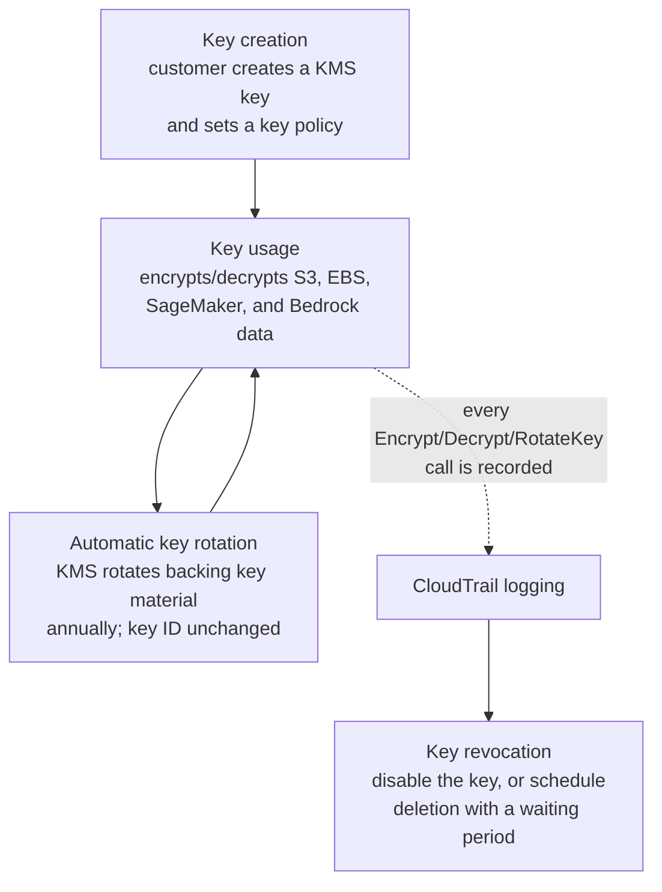
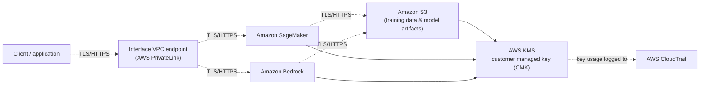
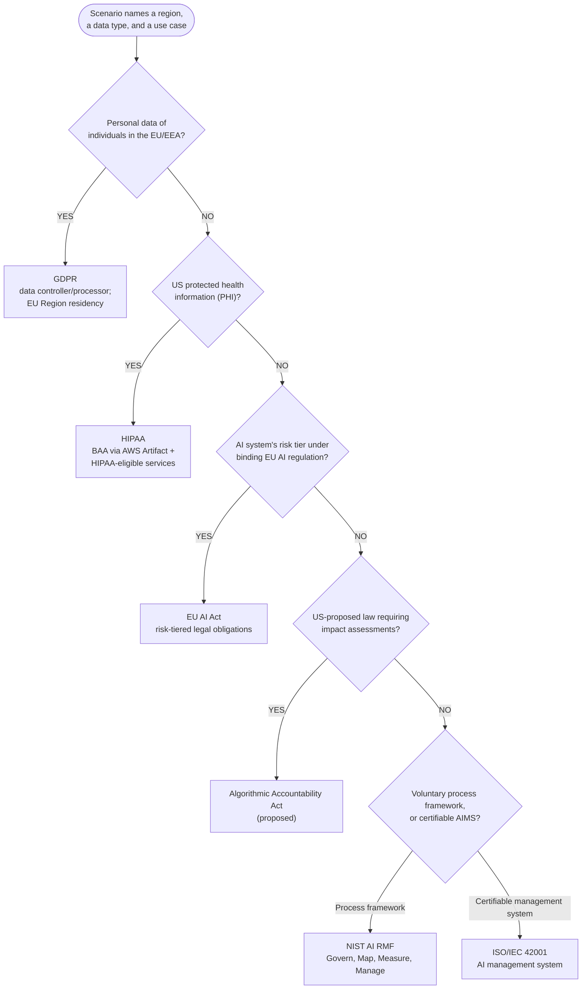

# Domain 5 Fast Track — Part 1: AI System Security & Compliance Frameworks

**Condensed guide (part 1 of 2)** · full guide: [`docs/domain-5-security-compliance-governance.md`](../domain-5-security-compliance-governance.md) (2,853 lines) · **Last verified:** 2026-09-05

## How to use this fast track

This is part 1 of a two-part, ~35%-length condensation of the full Domain 5
study guide, covering **Section 1 (Securing AI systems)** and **Section 2
(AWS compliance standards)** — IAM, encryption, network isolation, the
security-threat catalog, cost governance, MITRE ATLAS/OWASP, and all five
compliance frameworks (GDPR, HIPAA, NIST AI RMF, EU AI Act, ISO/IEC 42001).
**[Part 2](../domain-5-fast-track/part-2-governance-and-monitoring.md)**
covers Section 3 (AWS Config/Audit Manager/CloudTrail), Section 4 (data
governance), and Section 5 (the shared responsibility model), plus the
domain's two cross-cutting worked examples.

This part keeps **every testable concept** from its scope — every IAM/
encryption/network control, every named security threat and its
mitigation, both security frameworks, and every compliance framework's
scope, type, and requirements — while trimming worked-example narration
and repeated AWS-example paragraphs down to their one-line takeaways.
Every section links back to the corresponding section of the full guide
for the complete explanation, worked examples, and mini-quizzes.

Domain 5 makes up roughly **14% of scored questions** on the AWS
Certified AI Practitioner (AIF-C01) exam. Read this fast track the day
before the exam, or any time you already know the material and just need
the tables refreshed; read the [full guide](../domain-5-security-compliance-governance.md)
first if any of these terms are new to you.

**Where each section comes from**, for jumping straight to the full
prose, mini-quiz, and AWS example behind any condensed table below:

| This fast track | Full guide section | Approx. full-guide lines |
|---|---|---|
| 1. IAM roles and policies | [IAM roles and policies](../domain-5-security-compliance-governance.md#iam-roles-and-policies-for-ai-services) | 58–92 |
| 2. Data and model encryption | [Data encryption at rest and in transit](../domain-5-security-compliance-governance.md#data-encryption-at-rest-and-in-transit) + worked example | 93–238 |
| 3. AWS PrivateLink and VPC endpoints | [PrivateLink and VPC endpoints](../domain-5-security-compliance-governance.md#aws-privatelink-and-vpc-endpoints-for-ai-services) | 175–292 |
| 4. Source citation and data lineage | [Source citation and data lineage](../domain-5-security-compliance-governance.md#source-citation-and-data-lineage) + worked example | 293–360 |
| 5. Security threats and mitigations | [Common security threats](../domain-5-security-compliance-governance.md#common-security-threats-to-ai-systems-and-how-to-mitigate-them) + 2 worked examples | 361–665 |
| 6. Cost governance | [Cost governance](../domain-5-security-compliance-governance.md#cost-governance-bounding-total-spend-with-service-quotas-and-api-gateway-usage-plans) + 3 worked examples | 666–1016 |
| 7. Security frameworks | [MITRE ATLAS and OWASP Top 10](../domain-5-security-compliance-governance.md#security-frameworks-for-ai-systems-mitre-atlas-and-owasp-top-10-for-llm-applications) | 1017–1134 |
| 8. AWS Artifact | [AWS Artifact](../domain-5-security-compliance-governance.md#aws-artifact) + BAA/DPA decision guide | 1137–1197 |
| 9. The five compliance frameworks | [GDPR](../domain-5-security-compliance-governance.md#gdpr-general-data-protection-regulation-conceptual-level) through [ISO/IEC 42001](../domain-5-security-compliance-governance.md#isoiec-42001-and-the-algorithmic-accountability-act-conceptual-level) | 1198–1412 |
| 10. Compliance decision matrix | [Compliance framework decision matrix](../domain-5-security-compliance-governance.md#compliance-framework-decision-matrix) | 1413–1453 |
| 11. Requirements comparison matrix | [Requirements comparison matrix](../domain-5-security-compliance-governance.md#compliance-framework-requirements-comparison-matrix) + worked example | 1454–1608 |

## Table of contents

- [1. IAM roles and policies for AI services](#1-iam-roles-and-policies-for-ai-services)
- [2. Data and model encryption](#2-data-and-model-encryption)
- [3. AWS PrivateLink and VPC endpoints](#3-aws-privatelink-and-vpc-endpoints)
- [4. Source citation and data lineage](#4-source-citation-and-data-lineage)
- [5. Security threats and mitigations](#5-security-threats-and-mitigations)
- [6. Cost governance](#6-cost-governance)
- [7. Security frameworks: MITRE ATLAS and OWASP Top 10](#7-security-frameworks-mitre-atlas-and-owasp-top-10)
- [8. AWS Artifact: reports vs. agreements](#8-aws-artifact-reports-vs-agreements)
- [9. The five compliance frameworks](#9-the-five-compliance-frameworks)
- [10. Compliance decision matrix](#10-compliance-decision-matrix)
- [11. Requirements comparison matrix](#11-requirements-comparison-matrix)
- [AWS example scenarios at a glance](#aws-example-scenarios-at-a-glance)
- [Commonly confused term pairs](#commonly-confused-term-pairs)
- [Rapid-fire key terms](#rapid-fire-key-terms)
- [Rapid self-check](#rapid-self-check)
- [Common exam traps checklist](#common-exam-traps-checklist)
- [Cross-domain connections](#cross-domain-connections)
- [Where to go deeper](#where-to-go-deeper)

---

## 1. IAM roles and policies for AI services

IAM controls *who* (a user, group, or AWS service) can do *what* (an
action, e.g. `bedrock:InvokeModel`, `sagemaker:CreateTrainingJob`) on
*which resource*.

- **IAM policies** — JSON documents attached to users/groups/roles that
  grant or deny specific actions on specific resources.
- **IAM roles** — the preferred way for an AWS *service* to act on your
  behalf (e.g., a SageMaker training job assumes an **execution role** to
  read S3 training data and write artifacts back) — never embed long-term
  credentials in a service.
- **Least privilege** — scope a role to the narrowest actions/resources
  needed (e.g., `bedrock:InvokeModel` on one model ARN, not `bedrock:*` on
  `*`).
- **Resource-based policies** (e.g., an S3 bucket policy or a Bedrock
  model resource policy) restrict access independently of the caller's
  identity policy.
- **IAM Access Analyzer** continuously flags resource-based policies that
  share access with an external entity, validating that least-privilege
  configurations aren't unintentionally broader than intended.

> **Exam tip:** An AWS *service* calling another AWS service on a
> customer's behalf → attach an **IAM role** to the service, never embed
> an access key.

Full explanation and AWS example: [full guide, IAM roles and
policies](../domain-5-security-compliance-governance.md#iam-roles-and-policies-for-ai-services).

---

## 2. Data and model encryption

**Encryption at rest** protects stored data (S3, EBS, SageMaker/Bedrock
artifacts) via **AWS KMS**: an **AWS managed key** (e.g. `aws/s3`) for
convenience, or a **customer managed key (CMK)** when you need control
over the key policy, rotation, and auditability (every CMK use is logged
in CloudTrail). **Encryption in transit** protects data moving over the
network, enforced via **TLS/HTTPS** — the default for Bedrock/SageMaker
API calls.

**Data encryption vs. model encryption — two separately configured
targets.** A scenario often layers both: the **training data** in S3 is
encrypted with one CMK (protects confidentiality, e.g. PHI), while the
**trained model artifact** (e.g., a Bedrock custom model's fine-tuned
weights) is encrypted with a *separate* CMK (protects the model as
intellectual property against [model theft](#5-security-threats-and-mitigations)).
A scenario that mentions only one of the two has left the other gap open
— neither substitutes for the other, and both repeat independently per
Region since KMS keys are Region-scoped.

**KMS key lifecycle** — a CMK is created, used repeatedly, rotated
automatically (same key ID, prior backing material stays usable), logged
on every use, and eventually revoked:

| | AWS managed key (e.g. `aws/s3`) | Customer managed key (CMK) |
|---|---|---|
| Key policy control | AWS-controlled | Customer-controlled |
| Rotation | Automatic, no customer control | Automatic (annual) or manual; customer-controlled |
| Audit trail | Logged, but less granular policy control | Every Encrypt/Decrypt/GenerateDataKey call logged to CloudTrail |
| Choose when | Data isn't sensitive/regulated | Data is sensitive/regulated (PII, PHI, financial) and needs auditable, controllable access |

> **Exam tip:** "At rest" = data on disk (S3, EBS, KMS). "In transit" =
> data moving over the network (TLS/HTTPS). Don't confuse KMS (manages
> *keys*) with CloudTrail (*logs* key usage). If a scenario is silent on
> the *model artifact's* encryption while describing only training-data
> encryption (or vice versa), treat that as an open gap.

Full explanation, the Meridian Health multi-region HIPAA worked example,
and the mini-quiz: [full guide, Data encryption at rest and in
transit](../domain-5-security-compliance-governance.md#data-encryption-at-rest-and-in-transit).

---

## 3. AWS PrivateLink and VPC endpoints

By default, calls from a VPC to Bedrock/SageMaker travel over the public
AWS network backbone via public service endpoints. **AWS PrivateLink**
creates an **interface VPC endpoint** so traffic to a supported AWS
service stays entirely within the AWS network — no internet gateway, NAT
gateway, or public IP required.

| Scenario clue | Right answer | Why |
|---|---|---|
| Data must never traverse the public internet; isolated/air-gapped VPC | **VPC endpoint (PrivateLink)** | Keeps traffic on the AWS network entirely |
| (Distractor) "just route through a NAT gateway" | Wrong | NAT still routes through the public internet |
| (Distractor) "use a VPN" | Wrong | A VPN connects networks, not a VPC to an AWS service |

**End-to-end architecture** — a client reaches SageMaker/Bedrock through a
PrivateLink VPC endpoint (TLS in transit throughout), which read/write S3
data encrypted at rest with a CMK, with every key operation logged to
CloudTrail:

Full explanation, AWS example, and the encryption key management
mini-quiz: [full guide, AWS PrivateLink and VPC
endpoints](../domain-5-security-compliance-governance.md#aws-privatelink-and-vpc-endpoints-for-ai-services).

---

## 4. Source citation and data lineage

| Concept | Answers | AWS mechanism |
|---|---|---|
| **Source citation / attribution** | Can an end user *trust and verify* a generated answer? | Amazon Bedrock Knowledge Bases natively returns source document chunks + locations alongside generated responses |
| **Data lineage** | Can the *organization trace* a dataset/model's history for governance/audit? | Amazon SageMaker ML Lineage Tracking auto-records raw data → processing job → training job → model artifact → endpoint |
| **Provenance watermarking** | Can a suspicious image be *proven* AI-generated after the fact? | Titan Image Generator embeds an invisible, always-on watermark; Bedrock's detection API confirms its presence later |

Watermarking is distinct from **negative prompting** ("no text, no
watermark" — a Domain 2/3 prompt technique that keeps a *visible* logo out
of a rendered scene): the Titan watermark is an invisible, undisable
provenance marker, a Domain 5 transparency/accountability control, not a
prompting technique.

> **Exam tip:** Source citation = end-user trust in one response. Data
> lineage = tracing a dataset/model's *history* for governance. Watermark
> detection = proving AI provenance *after the fact*. Three distinct
> transparency mechanisms, tested as distinct answers.

Full explanation and the Titan watermarking worked example: [full guide,
Source citation and data
lineage](../domain-5-security-compliance-governance.md#source-citation-and-data-lineage).

---

## 5. Security threats and mitigations

AI/ML systems face threats beyond traditional application security
because the *data* and the *model* are themselves attack surfaces, and
outputs are often non-deterministic (the same prompt can yield different
outputs on different runs, so signature-based defenses don't work well).

| Threat | What happens | Primary mitigation |
|---|---|---|
| **Data poisoning** | Attacker corrupts training/fine-tuning data so the model misbehaves | Strict IAM/S3 access controls on training data, validation/provenance checks, dataset versioning (rollback) |
| **Prompt injection (direct)** | Malicious input in the user's own prompt overrides instructions | Guardrails for Amazon Bedrock — input filtering at the inference interface |
| **Prompt injection (indirect)** | Malicious instructions hidden in a *retrieved* document (e.g., RAG) are treated as instructions | **Pre-ingestion** data validation/sanitization of untrusted documents (preventative, at the source) + Amazon Macie + Guardrails on retrieved content/output as a backstop |
| **Model inversion / extraction** | Many crafted queries reconstruct training data or the model itself | Request throttling/rate limiting, output filtering (withhold raw confidence scores), least-privilege endpoint access |
| **Model drift** (not an attack) | Real-world accuracy erodes as production data diverges from training data | Continuous monitoring (CloudWatch, SageMaker Model Monitor) + a retraining pipeline |
| **Insecure output handling** | An app trusts/acts on raw LLM output (e.g., passes it to SQL) without validation | Validate/sanitize/parameterize LLM output before use; Guardrails output filtering |
| **Model denial of service** | Resource-exhausting or crafted inputs degrade availability / spike cost | Request throttling, **Service Quotas**, **API Gateway** usage plans |
| **Supply chain vulnerabilities** | A compromised third-party model/dataset/plugin is integrated | Source vetted models from Bedrock/SageMaker JumpStart; track approved versions in SageMaker Model Registry |
| **Sensitive information disclosure** | The model reveals PII/secrets memorized or leaked into context | Amazon Macie (discover/classify sensitive training sources) + Guardrails PII filters |
| **Insecure plugin design** | An LLM-agent's tool/plugin accepts unvalidated input or has overly broad permissions | Least-privilege IAM roles scoped to specific actions per Bedrock Agents action group/Lambda |
| **Excessive agency** | An agent is granted more permissions/autonomy than its task requires | Scope IAM execution roles/action groups to least privilege; require human approval for high-impact actions |
| **Overreliance** | Users trust fabricated/unverified LLM output | Guardrails contextual grounding checks + requiring cited sources |

**Differential privacy** — a complementary defense specifically against
model inversion/extraction, applied *during training*: clip each
example's gradient contribution and add calibrated noise (DP-SGD),
tracked as a **privacy budget (epsilon, ε)** — smaller ε = stronger
privacy guarantee but more accuracy loss. This is a different layer than
encryption at rest: encryption protects *stored* data; differential
privacy protects what a *deployed model's predictions* can reveal about
individual training records — neither substitutes for the other.

> **Exam tip:** Distinguish threats by *what* is attacked — data
> poisoning corrupts training data; prompt injection hijacks instructions
> at inference time; model inversion/extraction targets a deployed model
> through its API; model drift is degradation, not an attack. If a
> scenario asks how to stop a *deployed model's predictions* from leaking
> training records, the answer is differential privacy, not KMS.

Full explanation, all AWS examples, the indirect-prompt-injection and
differential-privacy worked examples, and two mini-quizzes: [full guide,
Common security
threats](../domain-5-security-compliance-governance.md#common-security-threats-to-ai-systems-and-how-to-mitigate-them).

---

## 6. Cost governance

Cost governance bounds an AI workload's **aggregate, worst-case spend** —
distinct from and complementary to Domain 3's *per-request* cost controls
(max tokens, Provisioned Throughput sizing). A tightly bounded per-call
cost still produces an unpredictable bill if nothing limits *how many*
calls can be made (the model denial-of-service threat above).

- **AWS Service Quotas** — account/Region-level limits (e.g., requests per
  minute against a Bedrock model); a hard backstop on total request
  volume across every caller.
- **Amazon API Gateway usage plans** — per-API-key throttling (steady-state
  + burst rate) and a quota (requests per day/week/month), capping how
  much a given caller can invoke an endpoint.

**Three threat models need three different knobs** — same two controls,
different configuration:

| Threat model | Signature | Configuration |
|---|---|---|
| Malicious abuse (credential stuffing, many keys each staying modest) | Many distinct identities, each individually under the radar | Tight **per-key throttle + low daily quota** on every key, plus an account-level **Service Quota** backstop so more stolen keys can't route around per-key limits |
| Accidental spike (a runaway retry loop) | One trusted identity briefly misbehaving | The usage plan's **burst limit** (a daily quota reacts too slowly for a spike measured in minutes) |
| Fixed monthly budget ceiling | A fixed dollar number regardless of cause | Work backward: ceiling ÷ worst-case per-request cost = max requests; set the usage plan's **monthly quota** below that, mirrored as the account's Service Quota |

**Instrumentation:** API Gateway publishes `4XXError` (includes `429`),
`Count`, `Latency` to `AWS/ApiGateway`; per-key detail requires access
logging (`$context.identity.apiKey`) queried via CloudWatch Logs
Insights. Service Quotas publishes utilization to `AWS/Usage`, with a
one-click "Create CloudWatch alarm" action (e.g., at 80% utilization).
Many keys each with a modest, even 429 count → threat model 1; one key
with a concentrated burst → threat model 2; a Service Quota alarm firing
*without* a matching 4XXError spike → threat model 3.

**SLA shapes which cost lever applies** — a hard per-request latency SLA
(e.g., a 2-second p99 chat assistant) rules out batching and favors
**Provisioned Throughput sized to the steady baseline** (not the peak) +
on-demand for burst overflow + a **response cache** for repeat questions.
A completion-window target with no individual caller waiting (e.g., an
overnight batch report) flips this: **Bedrock batch inference** is the
default lever, Provisioned Throughput becomes wasted spend (sits idle
between runs), and caching is pointless with no repeat-request pattern.

> **Exam tip:** "Bound how big/expensive *one* response is" → Domain 3
> (max tokens, Provisioned Throughput sizing). "Bound how *many* requests
> can be made in total" → Service Quotas / API Gateway usage plans. A
> scenario needing both gets both — not one substituting for the other,
> and not IAM alone (IAM governs *who* can call, not *how much*).

Full explanation and all three worked examples (three threat models,
sizing quotas for a multi-team workload, latency-critical vs. batch cost
optimization): [full guide, Cost
governance](../domain-5-security-compliance-governance.md#cost-governance-bounding-total-spend-with-service-quotas-and-api-gateway-usage-plans).

---

## 7. Security frameworks: MITRE ATLAS and OWASP Top 10

Two industry frameworks (neither is an AWS service) for reasoning about
AI-specific threats systematically:

| Framework | What it is | Recognize by |
|---|---|---|
| **MITRE ATLAS** | A knowledge base of adversary tactics/techniques against AI systems, modeled on MITRE ATT&CK | "Cataloging adversary tactics/techniques against AI systems generally" |
| **OWASP Top 10 for LLM Applications** | A prioritized checklist of the most critical LLM-application security risks (prompt injection, insecure output handling, training data poisoning, model DoS, etc.) | "A prioritized risk checklist specifically for LLM applications" |

Each OWASP category maps to the AWS mitigations already covered in
[Section 5](#5-security-threats-and-mitigations) above (prompt injection
→ Guardrails; training data poisoning → IAM/S3 + dataset versioning;
model DoS → Service Quotas/API Gateway; supply chain → Bedrock/JumpStart
+ Model Registry; sensitive information disclosure → Macie + Guardrails
PII filters; insecure plugin design/excessive agency → least-privilege
IAM; overreliance → grounding checks + citations; **model theft** →
least-privilege IAM on model artifacts, KMS encryption at rest, and
inference-endpoint throttling).

Full explanation, AWS example, and the securing-AI-systems mini-quiz:
[full guide, Security frameworks for AI
systems](../domain-5-security-compliance-governance.md#security-frameworks-for-ai-systems-mitre-atlas-and-owasp-top-10-for-llm-applications).

---

## 8. AWS Artifact: reports vs. agreements

**AWS Artifact** is a self-service portal for AWS's own compliance
material — it does not audit *your* account.

| Area | What it contains | Signature needed? |
|---|---|---|
| **Artifact Reports** | AWS's own third-party audit reports (SOC 1/2/3, ISO 27001, PCI DSS) | No — download only |
| **Artifact Agreements** | Legal agreements you review and accept online before sending regulated data to AWS (BAA, GDPR DPA) | Yes — accept online |

**BAA vs. DPA — pick by regulation:**

| Scenario | Agreement to accept | Why |
|---|---|---|
| Fine-tuning on patient records (PHI) | **Business Associate Addendum (BAA)** | AWS becomes a HIPAA "business associate" processing PHI |
| Sending EU customers' personal data to Bedrock | **GDPR Data Processing Addendum (DPA)** | AWS is the data processor; the DPA documents its contractual GDPR obligations |
| Same dataset is both PHI *and* EU personal data | **Both** | Two independent regulations — neither agreement substitutes for the other |
| Need proof AWS holds SOC 2/ISO 27001 certifications, no regulated data sent | **Neither** — use Artifact **Reports** | No agreement required just to read AWS's own audit reports |

Accepting the BAA is **necessary but not sufficient** for HIPAA: every AWS
service actually in use must also appear on AWS's published list of
HIPAA-eligible services (e.g., SageMaker, Comprehend Medical).

> **Exam tip:** *Download*, no signature → Artifact **Report**. *Execute /
> sign / accept* before sending regulated data → Artifact **Agreement** —
> BAA for PHI, DPA for GDPR personal data, both when the same data is
> covered by both.

Full explanation, the pre-deployment checklist, and AWS example: [full
guide, AWS
Artifact](../domain-5-security-compliance-governance.md#aws-artifact).

---

## 9. The five compliance frameworks

| Framework | Type | Scope | Covers | Key AIF-C01 concept |
|---|---|---|---|---|
| **GDPR** | Binding EU law | EU/EEA personal data, regardless of where the processing company is based | Personal data of individuals (broad) | AWS is the **data processor**; the customer is the **data controller**; use EU Regions for data residency |
| **HIPAA** | Binding US law | US protected health information (PHI) | PHI specifically | Requires a **BAA** (via AWS Artifact) + only **HIPAA-eligible services** |
| **NIST AI RMF** | Voluntary US framework | AI system risk, any geography (referenced globally) | Risk across the AI lifecycle (process, not data type) | Four functions: **Govern, Map, Measure, Manage** — not legally binding |
| **EU AI Act** | Binding EU law | AI systems placed on the EU market or affecting EU people | The AI system itself, tiered by risk | Risk tiers: **unacceptable** (banned), **high** (strict requirements), **limited** (transparency), **minimal** (unregulated) |
| **ISO/IEC 42001** | Voluntary international standard | Global, any organization | An **AI management system (AIMS)** — certifiable governance processes | Conceptually like ISO 27001 but for AI governance |

Also recognize the **Algorithmic Accountability Act** — *proposed* (not
yet binding) US legislation requiring impact assessments for automated
decision systems, testing the *direction* of AI legislation, not a
current legal requirement.

**NIST AI RMF's four functions mapped to AWS services** (a continuous
cycle across the AI lifecycle, not a one-time checklist):

```mermaid
flowchart TD
    GOVERN["GOVERN\nrisk culture, accountability"] --> AM_G["AWS Audit Manager"]
    GOVERN --> CFG_G["AWS Config conformance packs"]
    GOVERN --> MC_G["SageMaker Model Cards"]

    MAP["MAP\ncontext, intended use, risks"] --> MC_M["SageMaker Model Cards"]
    MAP --> CL_M["SageMaker Clarify (pre-training)"]
    MAP --> BR_M["Amazon Bedrock model selection"]

    MEASURE["MEASURE\nquantitative risk tracking"] --> CL_ME["SageMaker Clarify (post-training)"]
    MEASURE --> MON_ME["SageMaker Model Monitor"]
    MEASURE --> GR_ME["Guardrails for Amazon Bedrock"]

    MANAGE["MANAGE\nprioritize and respond"] --> CFG_MA["AWS Config"]
    MANAGE --> AM_MA["AWS Audit Manager"]
    MANAGE --> MON_MA["SageMaker Model Monitor triggers retraining"]
```

**Binding vs. voluntary — the type distinction the exam tests directly:**
**GDPR**, **HIPAA**, and the **EU AI Act** are legally binding laws.
**NIST AI RMF** and **ISO/IEC 42001** are voluntary. The **Algorithmic
Accountability Act** is proposed, not-yet-binding legislation.

> **Exam tip:** HIPAA is US healthcare-specific; GDPR is EU personal-data
> general regulation; the EU AI Act is EU AI-specific (risk tiers, not
> personal data). "PHI" always → HIPAA regardless of region context.
> "Risk tiers" for an AI system always → EU AI Act, not GDPR.

Full explanation, the multi-region NIST AI RMF worked example, and two
mini-quizzes: [full guide, GDPR](../domain-5-security-compliance-governance.md#gdpr-general-data-protection-regulation-conceptual-level)
through [ISO/IEC 42001](../domain-5-security-compliance-governance.md#isoiec-42001-and-the-algorithmic-accountability-act-conceptual-level).

---

## 10. Compliance decision matrix

A scenario question typically gives a region, a data type, and a use
case, then asks which framework/AWS control applies:

> **Exam tip:** Anchor on two clues together — *region* (EU vs. US vs.
> global) *plus* whether it's binding or voluntary. "PHI" always means
> HIPAA regardless of region; "risk tiers" always means the EU AI Act.

Full matrix table and AWS-service mapping: [full guide, Compliance
framework decision
matrix](../domain-5-security-compliance-governance.md#compliance-framework-decision-matrix).

---

## 11. Requirements comparison matrix

Once you know *which* framework applies, a second common scenario type
asks what it actually *requires* — cross-cut by four requirements that
repeat constantly:

| Framework | Encryption mandate | Audit logging | Data residency | Human oversight |
|---|---|---|---|---|
| GDPR | Not explicit — "appropriate" technical measures (Art. 32) | Not explicit — accountability principle (Art. 5(2)) | No blanket rule, but transfer restrictions push toward EU Regions | Art. 22 — right to human review of solely-automated decisions with legal effect |
| HIPAA | "Addressable" — must implement or document an equivalent alternative | **Required** — Security Rule mandates audit controls (§164.312(b)) | No geographic restriction | Not mandated by statute; expected operationally |
| NIST AI RMF | Not prescribed — defers to existing controls (KMS) | Recommended under Govern/Measure, not required | Not addressed | Recommended under Govern/Manage, not mandatory |
| EU AI Act | Indirect — high-risk "accuracy, robustness, cybersecurity" (Art. 15) | **Required** for high-risk systems (Art. 12) | Not general; focuses on data governance quality (Art. 10) | **Required** for high-risk systems (Art. 14) |
| ISO/IEC 42001 | Not prescribed — org selects controls per its own risk assessment | Required indirectly via AIMS monitoring/internal audit (Clause 9) | Not addressed | Via Annex A controls, scoped to org's own risk assessment |

> **Exam tip:** Sort by binding vs. voluntary, not by topic. HIPAA and the
> EU AI Act impose specific, checkable requirements; GDPR's are
> principle-based; NIST AI RMF and ISO/IEC 42001 recommend the same
> controls without mandating them. "Which framework *legally requires*
> audit logging for a high-risk AI system?" → EU AI Act, not NIST AI RMF.

**SageMaker Model Cards as the sign-off artifact:** a Model Card completed
for a regulated model (intended use, training data provenance, bias
assessment, known limitations, human-oversight controls, monitoring plan)
is the artifact a governance committee formally signs off on — it
satisfies the EU AI Act's high-risk documentation obligations and the
NIST AI RMF's Govern/Map functions. Don't confuse it with an **AI Service
Card** (AWS-authored, for an AWS-managed service — you read it, you never
fill it in).

Full explanation, requirements table caveats, and the full SageMaker
Model Card governance sign-off worked example: [full guide, Compliance
framework requirements comparison
matrix](../domain-5-security-compliance-governance.md#compliance-framework-requirements-comparison-matrix).

---

## AWS example scenarios at a glance

| Topic | Scenario | Tools/concepts it exercises |
|---|---|---|
| IAM | A SageMaker training job needs an execution role scoped to only its training-data and output buckets, not all of S3 | IAM execution roles, least privilege |
| Encryption | A HIPAA fine-tuning pipeline uses one CMK for training data and a *separate* CMK for the resulting model artifact | CMK, encryption at rest/in transit, model encryption |
| Networking | A financial firm's private-subnet SageMaker notebooks call Bedrock without touching the public internet | AWS PrivateLink, interface VPC endpoint |
| Threats | A RAG chatbot retrieves a forum post with hidden instructions telling it to leak the system prompt | Indirect prompt injection, pre-ingestion sanitization, Guardrails |
| Cost governance | A public Bedrock chatbot is targeted by many API keys each staying individually modest | Malicious abuse threat model, per-key throttle + Service Quota backstop |
| Frameworks | A security team wants a pre-launch LLM risk checklist and a way to map how each risk could be exploited | OWASP Top 10 for LLM Applications, MITRE ATLAS |
| Compliance | A US health insurer's EU subsidiary sends EU patients' health records to a Bedrock knowledge base | Both a BAA (HIPAA/PHI) and a DPA (GDPR) required |
| Governance sign-off | A bank's loan classifier Model Card documents bias mitigation and routes every score through A2I before a committee approves production | SageMaker Model Card, EU AI Act high-risk documentation, NIST AI RMF Govern/Map |

---

## Commonly confused term pairs

| Pair | Distinguishing question | Answer |
|---|---|---|
| **Data encryption** vs. **model encryption** | Is a scenario protecting the *raw training data* or the *trained model artifact*? | Training data → data-encryption CMK; model weights/IP → a separate model-encryption CMK |
| **PrivateLink/VPC endpoint** vs. **NAT gateway** vs. **VPN** | Must traffic *never* touch the public internet, or does it just need internal network connectivity? | Never public internet → PrivateLink; NAT still routes publicly; VPN connects networks, not a VPC to a service |
| **Direct** vs. **indirect prompt injection** | Does the malicious text arrive in the *user's own prompt*, or is it *already indexed* in a retrieved document? | User's prompt → Guardrails input filtering suffices; indexed document → needs pre-ingestion sanitization, Guardrails alone isn't sufficient |
| **Encryption at rest** vs. **differential privacy** | Does the risk come from *stored data access*, or from what a *deployed model's predictions* can reveal? | Stored data → KMS; model output leaking training records → differential privacy |
| **Service Quotas** vs. **API Gateway usage plans** | Is the limit account/Region-wide, or per API key/caller? | Account/Region-wide backstop → Service Quotas; per-caller throttle/quota → usage plans |
| **AWS Artifact Reports** vs. **Agreements** | Is a signature/acceptance required before sending regulated data? | No signature, just download → Reports; must accept online first → Agreements (BAA, DPA) |
| **GDPR** vs. **HIPAA** vs. **EU AI Act** | Personal data broadly, US health data specifically, or an AI system's risk tier? | Personal data (EU) → GDPR; PHI (US) → HIPAA; AI system risk tier (EU) → EU AI Act |
| **NIST AI RMF** vs. **ISO/IEC 42001** | A voluntary *process framework*, or a *certifiable management system*? | Process framework (Govern/Map/Measure/Manage) → NIST AI RMF; certifiable AIMS → ISO/IEC 42001 |
| **SageMaker Model Card** vs. **AI Service Card** | Did *you* build the model, or is it an *AWS-managed* service you're reading about? | You built it, you sign off → Model Card; AWS-authored, you read it → AI Service Card |

---

## Rapid-fire key terms

- **IAM execution role** — the role an AWS service (e.g., a SageMaker
  training job) assumes to act on your behalf without embedded
  credentials.
- **Least privilege** — granting only the specific actions/resources a
  role actually needs.
- **AWS KMS customer managed key (CMK)** — a key whose policy, rotation,
  and audit trail (via CloudTrail) the customer controls.
- **Encryption at rest / in transit** — protecting stored data (KMS) vs.
  data moving over the network (TLS/HTTPS).
- **Model encryption** — encrypting a trained model artifact itself (a
  separate KMS key from the training-data key), protecting it as IP.
- **AWS PrivateLink / interface VPC endpoint** — keeps traffic to a
  supported AWS service entirely within the AWS network.
- **Source citation** — a RAG system citing the documents backing a
  generated response (Amazon Bedrock Knowledge Bases).
- **Data lineage** — tracing a dataset/model's history through a pipeline
  (Amazon SageMaker ML Lineage Tracking).
- **Data poisoning** — deliberately corrupting training/fine-tuning data.
- **Prompt injection (direct / indirect)** — malicious input overriding
  instructions, either in the user's prompt or hidden in retrieved
  content.
- **Model inversion / extraction** — reconstructing training data or the
  model itself via crafted queries.
- **Differential privacy** — training-time noise addition (DP-SGD) that
  bounds how much any one record can influence the model, tracked via a
  privacy budget (ε).
- **Insecure output handling** — trusting/acting on raw LLM output without
  validation.
- **Model denial of service** — resource-exhausting inputs that degrade
  availability or spike cost.
- **Supply chain vulnerability** — a compromised third-party model,
  dataset, or plugin.
- **Sensitive information disclosure** — a model leaking PII/secrets it
  memorized or that leaked into context.
- **Insecure plugin design** — an LLM-agent tool/plugin with unvalidated
  input or overly broad permissions.
- **Excessive agency** — an agent granted more permissions/autonomy than
  its task requires.
- **Overreliance** — trusting unverified/fabricated LLM output.
- **AWS Service Quotas** — account/Region-level usage limits.
- **Amazon API Gateway usage plan** — per-API-key throttle + quota.
- **MITRE ATLAS** — a knowledge base of adversary tactics/techniques
  against AI systems.
- **OWASP Top 10 for LLM Applications** — a prioritized LLM-specific
  security risk checklist.
- **AWS Artifact** — a self-service portal for AWS's own compliance
  reports and agreements (not an audit of your account).
- **Business Associate Addendum (BAA)** — the AWS Artifact agreement
  required before processing PHI.
- **GDPR Data Processing Addendum (DPA)** — the AWS Artifact agreement
  documenting AWS's contractual obligations as GDPR data processor.
- **GDPR** — binding EU law on personal data; AWS is the data processor,
  the customer the data controller.
- **HIPAA** — binding US law on protected health information (PHI).
- **NIST AI Risk Management Framework (AI RMF)** — voluntary US guidance
  organized around Govern, Map, Measure, Manage.
- **EU AI Act** — binding EU regulation classifying AI systems into risk
  tiers (unacceptable/high/limited/minimal).
- **ISO/IEC 42001** — a certifiable international standard for an AI
  management system (AIMS).
- **Algorithmic Accountability Act** — proposed (not binding) US
  legislation requiring automated-decision impact assessments.

For the complete glossary: [full guide, Key terms
glossary](../domain-5-security-compliance-governance.md#key-terms-glossary).
For terms shared across domains: [`docs/master-glossary.md`](../master-glossary.md).

---

## Rapid self-check

Twelve quick recall questions — cover the answer column and try each one
before checking it. These are new questions, not a repeat of the full
guide's practice set.

| # | Question | Answer |
|---|---|---|
| 1 | An AWS service needs to call another AWS service on your behalf — what should you configure? | **An IAM role** (never an embedded access key) |
| 2 | A scenario describes training-data encryption but is silent on the model artifact's encryption — is that a solved gap? | **No** — the two are independently configured; silence on one leaves it open |
| 3 | A workload must never let traffic touch the public internet — which control? | **AWS PrivateLink (interface VPC endpoint)**, not a NAT gateway or VPN |
| 4 | Malicious instructions are hidden in a document already indexed in a RAG knowledge base — is Guardrails' input filtering alone sufficient? | **No** — needs pre-ingestion validation/sanitization of the source document |
| 5 | Which control stops a *deployed model's predictions* from leaking individual training records? | **Differential privacy**, not KMS/encryption at rest |
| 6 | An attacker cycles many API keys, each staying individually modest, to drive up a bill — which cost-governance knob? | A tight **per-key throttle + quota** on every key, plus an account-level **Service Quota** backstop |
| 7 | Which framework is a prioritized security-risk checklist specifically for LLM applications? | **OWASP Top 10 for LLM Applications** |
| 8 | A company needs to download AWS's SOC 2 report — Artifact Report or Agreement? | **Artifact Report** — no signature needed |
| 9 | The same dataset contains both PHI and EU personal data — which AWS Artifact agreement(s)? | **Both the BAA and the DPA** |
| 10 | Which framework is voluntary guidance organized around Govern, Map, Measure, and Manage? | **NIST AI RMF** |
| 11 | Which framework classifies AI systems into unacceptable/high/limited/minimal risk tiers? | **EU AI Act** |
| 12 | Which framework requires a certifiable AI management system (AIMS)? | **ISO/IEC 42001** |

---

## Common exam traps checklist

- [ ] **Data encryption and model encryption are two independent
      controls** — a scenario silent on one has left it unaddressed, not
      solved by the other.
- [ ] **PrivateLink ≠ NAT gateway ≠ VPN** — only PrivateLink keeps traffic
      entirely off the public internet.
- [ ] **Direct vs. indirect prompt injection need different defenses** —
      indirect injection requires pre-ingestion sanitization; Guardrails
      input filtering alone is not sufficient once malicious content is
      already indexed.
- [ ] **Differential privacy protects model output, not stored data** —
      don't reach for KMS when the leak is via a deployed model's
      predictions.
- [ ] **Model drift is degradation, not an attack** — its mitigation
      (monitoring + retraining) differs from access-control/filtering
      mitigations for actual attacks.
- [ ] **Service Quotas (account-wide) vs. API Gateway usage plans
      (per-key)** — pick the per-caller control for targeted abuse, the
      account-wide backstop for a hard ceiling regardless of source.
- [ ] **A hard per-request latency SLA rules out batching**; a
      completion-window target flips the default to batch inference.
- [ ] **MITRE ATLAS and OWASP Top 10 are frameworks, not AWS services** —
      the exam expects you to recognize them by name and purpose.
- [ ] **AWS Artifact Reports need no signature; Agreements do** — BAA for
      PHI, DPA for GDPR personal data.
- [ ] **Accepting a BAA is necessary but not sufficient for HIPAA** — the
      service used must also be on AWS's HIPAA-eligible services list.
- [ ] **"PHI" always signals HIPAA regardless of region; "risk tiers" for
      an AI system always signal the EU AI Act, not GDPR.**
- [ ] **Binding vs. voluntary is a hard line** — GDPR, HIPAA, and the EU
      AI Act are binding law; NIST AI RMF and ISO/IEC 42001 are
      voluntary; the Algorithmic Accountability Act is merely proposed.
- [ ] **A SageMaker Model Card is self-authored and sign-off-able; an AI
      Service Card is AWS-authored and read-only** — don't swap them when
      a scenario describes a governance committee approving a model.

---

## Cross-domain connections

| Connects to | Shared concept | Why they're easy to conflate |
|---|---|---|
| [Domain 3, cost governance](../domain-3-applications-of-foundation-models.md#cost-governance-bounding-per-request-cost-with-max-tokens-and-provisioned-throughput) | Per-request vs. aggregate cost control | Domain 3 bounds *one* response's cost (max tokens, Provisioned Throughput); this domain bounds *how many* requests can be made — the exam expects both together, not one substituting for the other |
| [Domain 4, Section 3](../domain-4-guidelines-for-responsible-ai.md#3-aws-tools-for-responsible-ai) | Guardrails for Amazon Bedrock | Domain 4 frames Guardrails as a responsible-AI control (safety, privacy dimensions); this domain frames the same tool as a security mitigation (prompt injection, output handling) — same service, two framings |
| [Domain 4, Legal and ethical considerations](../domain-4-guidelines-for-responsible-ai.md#4-legal-and-ethical-considerations) | Data privacy / GDPR | Domain 4 covers GDPR as a data-privacy legal/ethical concern; this domain covers it at the compliance-framework level (data controller/processor roles, residency) |
| [Domain 4, decision framework](../domain-4-guidelines-for-responsible-ai.md#decision-framework-choosing-a-bias-metric-and-layering-tools-for-high-stakes-ai) | SageMaker Model Cards | Domain 4 creates the Model Card as a bias/transparency artifact; this domain uses that same artifact for compliance and governance sign-off (EU AI Act, NIST AI RMF) |
| [`cross-domain-scenario-questions.md`](../cross-domain-scenario-questions.md#practice-questions) | Security vs. responsible-AI overlap | Several cross-domain scenario questions test whether a failure (e.g., indirect prompt injection leaking data) is framed as a security control, a responsible-AI practice, or both |

---

## Where to go deeper

This part intentionally omits the full guide's step-by-step worked
examples, AWS-example paragraphs, mini-quizzes, and the domain's shared
20-question practice set (which spans both parts). Go back to the full
guide for:

- [Domain overview and exam weighting](../domain-5-security-compliance-governance.md#domain-overview)
- The multi-region HIPAA encryption worked example, the Titan watermarking
  worked example, the indirect-prompt-injection worked example, the
  differential-privacy worked example, three cost-governance worked
  examples, the multi-region NIST AI RMF worked example, and the
  SageMaker Model Card governance sign-off worked example
- Five mini-quizzes embedded after the relevant subsections in Sections 1
  and 2
- [Practice questions and answer key](../domain-5-security-compliance-governance.md#practice-questions)

**Continue to [Part 2](../domain-5-fast-track/part-2-governance-and-monitoring.md)**
for governance and monitoring services (AWS Config, Audit Manager, and
CloudTrail), data governance strategies, the shared responsibility model,
and the domain's two cross-cutting worked examples.

For material that spans multiple domains, see
[`docs/cross-domain-concept-map.md`](../cross-domain-concept-map.md) and
[`docs/cross-domain-scenario-questions.md`](../cross-domain-scenario-questions.md).

[← Back to the full Domain 5 guide](../domain-5-security-compliance-governance.md#1-securing-ai-systems) · [Part 2 →](../domain-5-fast-track/part-2-governance-and-monitoring.md) · [Domain 4 Fast Track ←](../domain-4-fast-track/README.md)
