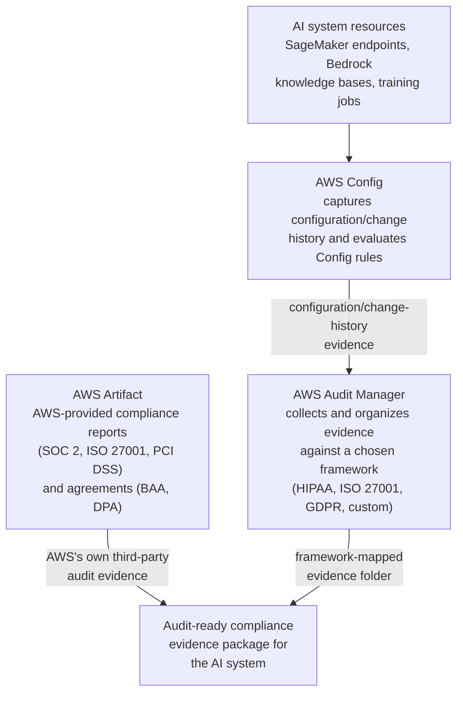
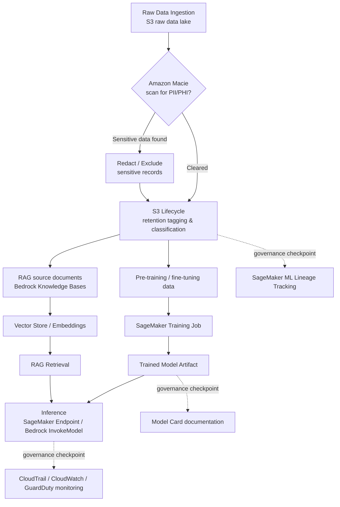

# Domain 5 Fast Track — Part 2: Governance, Audit, Data Governance & Shared Responsibility

**Condensed guide (part 2 of 2)** · full guide: [`docs/domain-5-security-compliance-governance.md`](../domain-5-security-compliance-governance.md) (2,853 lines) · **Last verified:** 2026-09-05

## How to use this fast track

This is part 2 of a two-part, ~35%-length condensation of the full Domain 5
study guide, covering **Section 3 (AWS Config, AWS Audit Manager, and AWS
CloudTrail for AI governance)**, **Section 4 (data governance strategies)**,
and **Section 5 (the AWS shared responsibility model applied to AI/ML
services)**, plus condensed pointers into the domain's two cross-cutting
worked examples and its shared quick-reference cheat sheet, glossary, and
practice question set. **[Part 1](../domain-5-fast-track/part-1-security-and-compliance.md)**
covers Section 1 (securing AI systems: IAM, encryption, PrivateLink,
source citation/lineage, security threats, cost governance, MITRE
ATLAS/OWASP) and Section 2 (the five compliance frameworks) — read that
part first if those topics are still new to you, since several of this
part's worked examples and exam traps assume them.

This part keeps **every testable concept** from its scope — the one-line
distinction between CloudTrail/Config/Audit Manager, every data-governance
control (Macie, S3 Lifecycle, data residency/sovereignty, CloudWatch,
GuardDuty), the full Bedrock-vs-SageMaker shared-responsibility split, and
the exam tips attached to each — while trimming worked-example narration
down to the one-line takeaway a scenario question actually tests, with a
link back to the full step-by-step walkthrough.

Domain 5 makes up roughly **14% of scored questions** on the AWS
Certified AI Practitioner (AIF-C01) exam. Read this fast track the day
before the exam, or any time you already know the material and just need
the tables refreshed; read the [full guide](../domain-5-security-compliance-governance.md)
first if any of these terms are new to you.

**Where each section comes from**, for jumping straight to the full
prose, mini-quiz, and worked example behind any condensed table below:

| This fast track | Full guide section | Approx. full-guide lines |
|---|---|---|
| 1. AWS Config, Audit Manager, and CloudTrail | [Section 3](../domain-5-security-compliance-governance.md#3-aws-config-aws-audit-manager-and-aws-cloudtrail-for-ai-governance) + worked example | 1654–1871 |
| 2. Data governance strategies | [Section 4](../domain-5-security-compliance-governance.md#4-data-governance-strategies) + worked example | 1873–2067 |
| 3. AWS shared responsibility model | [Section 5](../domain-5-security-compliance-governance.md#5-aws-shared-responsibility-model-applied-to-aiml-services) + worked example | 2069–2265 |
| 4. Two cross-cutting worked examples, condensed | [HIPAA lifecycle worked example](../domain-5-security-compliance-governance.md#worked-example-securing-and-governing-a-hipaa-regulated-bedrock-application-across-its-lifecycle) + [multi-region worked example](../domain-5-security-compliance-governance.md#worked-example-a-multi-region-bedrock-and-sagemaker-deployment-under-gdpr-hipaa-and-the-nist-ai-rmf) | 2267–2467 |
| Comparison table: governance and monitoring services | [Full guide table](../domain-5-security-compliance-governance.md#comparison-table-governance-and-monitoring-services) | 2470–2481 |
| Comparison table: regulations at a glance | [Full guide table](../domain-5-security-compliance-governance.md#comparison-table-governance-and-compliance-regulations-at-a-glance) | 2483–2492 |

## Table of contents

- [1. AWS Config, AWS Audit Manager, and AWS CloudTrail](#1-aws-config-aws-audit-manager-and-aws-cloudtrail)
- [2. Data governance strategies](#2-data-governance-strategies)
- [3. AWS shared responsibility model](#3-aws-shared-responsibility-model)
- [4. Two cross-cutting worked examples, condensed](#4-two-cross-cutting-worked-examples-condensed)
- [Comparison table: governance and monitoring services](#comparison-table-governance-and-monitoring-services)
- [Comparison table: governance and compliance regulations at a glance](#comparison-table-governance-and-compliance-regulations-at-a-glance)
- [AWS example scenarios at a glance](#aws-example-scenarios-at-a-glance)
- [Commonly confused term pairs](#commonly-confused-term-pairs)
- [Rapid-fire key terms](#rapid-fire-key-terms)
- [Rapid self-check](#rapid-self-check)
- [Common exam traps checklist](#common-exam-traps-checklist)
- [Cross-domain connections](#cross-domain-connections)
- [Where to go deeper](#where-to-go-deeper)

---

## 1. AWS Config, AWS Audit Manager, and AWS CloudTrail

These three services are frequently confused because they all relate to
"governance," but they answer different questions:

- **AWS CloudTrail** answers *"who did what, and when?"* — it logs API
  calls (e.g., every `bedrock:InvokeModel` or `sagemaker:CreateEndpoint`
  call, by whom, when).
- **AWS Config** answers *"what is my resource's configuration, and is it
  compliant?"* — it continuously records resource configuration state and
  evaluates it against **Config rules**, flagging drift over time.
- **AWS Audit Manager** answers *"can I produce audit-ready evidence for a
  compliance framework?"* — it collects evidence (built on CloudTrail and
  Config, plus manually uploaded evidence) and maps it to prebuilt or
  custom **frameworks** (GDPR, HIPAA, ISO 27001, SOC 2).

| Scenario clue | Right answer | Why |
|---|---|---|
| "Which service shows a bucket became public *three days ago*?" | **AWS Config** | Configuration *history*, not just the API call that changed it |
| "Show every API call against these training jobs for a forensic review" | **AWS CloudTrail** | Call-by-call activity log, not configuration state |
| "Assemble a HIPAA-mapped, audit-ready evidence package" | **AWS Audit Manager** | Organizes CloudTrail + Config evidence (plus manual uploads) against a framework |
| "Cover the physical/infrastructure layer AWS itself controls" | **AWS Artifact** | Config/Audit Manager only see the customer's own account, never AWS's infrastructure |

> **Exam tip:** Config and Audit Manager together produce evidence *about
> the customer's own resources*; Artifact supplies evidence *about AWS's
> own infrastructure*. Audit Manager doesn't independently generate
> primary evidence from scratch — it's built on top of CloudTrail and
> Config (plus whatever the customer uploads manually). Don't pick Audit
> Manager for a question that's really just asking for an API activity
> log or a configuration check.

**Worked example, condensed — assembling a SOC 2 Type II audit evidence
chain.** Meridian Lending's SageMaker fraud-scoring endpoint undergoes an
annual independent **SOC 2 Type II** examination — an auditor's opinion
on whether controls operated effectively *over an audit period*, not
just a snapshot at one point in time. Meridian's compliance lead builds
the evidence chain from CloudTrail (every invocation logged) and Config
(encryption/access configuration history), assembled by Audit Manager
into a framework-mapped evidence folder, then attaches AWS's own current
**SOC 2 Type II report** downloaded from **AWS Artifact** as evidence of
AWS's inherited controls — the auditor issues Meridian's opinion without
ever needing direct console access to Meridian's AWS account.

> **Exam tip:** A **SOC 2 Type II** report attests that controls operated
> effectively across an audit *period*; don't settle for a generic "SOC
> 2" recall when a scenario names the specific type. Audit Manager
> assembles the customer's own period-of-time evidence; Artifact
> separately supplies AWS's own SOC 2 Type II report as inherited-control
> evidence — a complete evidence chain needs both.

Full explanation, the worked scenarios, and the Meridian Lending SOC 2
worked example: [full guide, Section
3](../domain-5-security-compliance-governance.md#3-aws-config-aws-audit-manager-and-aws-cloudtrail-for-ai-governance)
and its [worked
example](../domain-5-security-compliance-governance.md#worked-example-assembling-a-soc-2-audit-evidence-chain-with-aws-config-audit-manager-and-artifact).

---

## 2. Data governance strategies

Data governance is enforced as a set of checkpoints across the full
ML/AI pipeline — from raw ingestion through classification and retention,
into training/fine-tuning/RAG retrieval, and out through inference:

- **Data lifecycle** — managing data from ingestion through storage, use,
  archival, and deletion. **S3 Lifecycle policies** transition training
  data to cheaper storage tiers or expire it automatically; deletion
  requests must actually remove data, including from derived artifacts
  where feasible.
- **Data residency** — keeping data within a required geographic
  boundary. On AWS this is achieved primarily by choosing which **AWS
  Region** stores and processes the data — AWS does **not** automatically
  replicate data across Regions unless configured to. **Data
  sovereignty** (data subject to the laws of the country it resides in)
  is closely related but distinct: residency is about *where* data
  physically sits, sovereignty is about *whose laws* govern it there.
- **Data monitoring** — ongoing observation of data access and content to
  detect risk:

| Service | Purpose | Distinguishing question |
|---|---|---|
| **Amazon Macie** | Discovers and classifies sensitive data (PII/PHI) in S3 | "Does this dataset contain sensitive data?" |
| **Amazon CloudWatch** | Monitors operational metrics/logs (invocation counts, latency, errors) | "What are this resource's operational metrics?" |
| **Amazon GuardDuty** | Continuous threat detection across an account | "Is there malicious activity here?" |

> **Exam tip:** If the question is about *discovering sensitive data* in
> storage, the answer is **Amazon Macie**. If it's about *operational
> metrics/logs*, it's **CloudWatch**. If it's about *threat detection*,
> it's **GuardDuty**. These three are common distractors for each other.
> CloudWatch's classical operational/drift metrics are not the same as
> monitoring a generative AI application's *output quality* — see the
> hallucination-drift worked example below.

**Worked example, condensed — monitoring hallucination-rate drift in a
production RAG assistant.** A Bedrock RAG assistant's hallucination rate
drifts from 2% to 8% over three months with **no model or code change**,
traced to knowledge-base documents updated without a matching
re-embedding pass. Because there's no ground-truth label for
"hallucinated," the team can't reuse SageMaker Model Monitor's
baseline-vs.-live statistical checks built for classical models; instead
a Bedrock LLM-as-judge call scores factual consistency, published as
custom CloudWatch metrics in the **`RAGAssistant/Quality`** namespace:
**`HallucinationRate`** and **`FactualConsistencyScore`**. A CloudWatch
alarm on `HallucinationRate` warns at **4%** (roughly two standard
deviations above the 2% baseline) and pages on-call via **Amazon SNS**
at **6%**. The fix is **refreshing and re-embedding the knowledge base
and retuning retrieval** — not retraining or fine-tuning the model, which
is the classical-drift answer instead.

> **Exam tip:** If a RAG application's answer quality degrades over time
> with no model or code change, suspect a stale or unsynced knowledge
> base, and expect the fix to be knowledge-base refresh/re-embedding —
> not model retraining.

Full explanation, the pipeline diagram's ASCII twin, and the full
Aurora Benefits worked example: [full guide, Section
4](../domain-5-security-compliance-governance.md#4-data-governance-strategies)
and its [worked
example](../domain-5-security-compliance-governance.md#worked-example-monitoring-hallucination-rate-drift-in-a-production-rag-assistant).

---

## 3. AWS shared responsibility model

Under the **AWS Shared Responsibility Model**, AWS is responsible for
**security "of" the cloud** (physical infrastructure, host OS,
virtualization, and the managed AI/ML service software itself). The
customer is responsible for **security "in" the cloud** (their data, IAM
configuration, encryption choices, network configuration, and the
content/quality of data fed into or retrieved from AI services).

The exact dividing line shifts with the service's **abstraction level**:

| | Amazon Bedrock (fully managed) | Amazon SageMaker (build/train/deploy your own) |
|---|---|---|
| Customer ("in the cloud") | IAM permissions, data sent to/from the model, guardrail configuration, encryption key choices | IAM permissions, training data pipeline, custom training/inference containers & code, VPC config for jobs |
| AWS ("of the cloud") | Physical infrastructure, host OS/virtualization, FM hosting & patching | Physical infrastructure, host OS/virtualization, underlying compute/storage infrastructure |
| Net effect | Thin customer slice — most responsibility is AWS-managed | Thicker customer slice — customer takes on more configuration/code |

> **Exam tip:** The more "managed"/abstracted the service (Bedrock >
> SageMaker JumpStart > SageMaker custom training), the less
> infrastructure security the customer must handle — but the customer is
> **always** responsible for their data and access configuration,
> regardless of abstraction level. Apply the split **per pipeline stage**,
> not once for a whole architecture: a pipeline that chains SageMaker into
> Bedrock keeps the same rule at every stage, but which stage a described
> failure occurred in determines whose responsibility the exam is
> actually asking about.

**Worked example, condensed — a SageMaker-to-Bedrock fine-tuning
pipeline.** Ferrous Analytics fine-tunes a foundation model on anonymized
transcripts across three stages: (1) SageMaker Processing cleans and
anonymizes raw data, (2) Bedrock model-customization fine-tunes on the
prepared dataset, (3) Bedrock Provisioned Throughput serves the custom
model.

| Stage | Customer responsibility | AWS responsibility |
|---|---|---|
| 1. SageMaker Processing (data prep) | Container image/code, IAM role scope, VPC config, enabling KMS encryption | Physical infrastructure, host OS, patching the SageMaker platform |
| 2. Bedrock fine-tuning | IAM policy scope, choice of training data, PrivateLink usage | Training compute infrastructure, foundation model weights |
| 3. Bedrock Provisioned Throughput (serving) | Guardrails configuration, invoke-access IAM policy, CloudTrail logging | Serving infrastructure, host OS, multi-tenant isolation |

**Contrasting incident:** the custom model occasionally echoes account
numbers from the fine-tuning data. This is **not** an AWS infrastructure
failure — it traces back to stage 1's anonymization code missing a
format variant, which is entirely Ferrous Analytics's "in the cloud"
responsibility to fix.

Full explanation and the full Ferrous Analytics walkthrough: [full guide,
Section
5](../domain-5-security-compliance-governance.md#5-aws-shared-responsibility-model-applied-to-aiml-services)
and its [worked
example](../domain-5-security-compliance-governance.md#worked-example-shared-responsibility-for-a-sagemaker-to-bedrock-fine-tuning-pipeline).

---

## 4. Two cross-cutting worked examples, condensed

The full guide strings together security, compliance, and governance
controls from **every** section of this domain (including Part 1's
Sections 1–2) into two continuous scenarios — exactly how AIF-C01
scenario questions are actually written. This fast track keeps only the
one-line takeaway per step; read the full guide for the complete
narration.

**MedNote — a HIPAA-regulated Bedrock clinical documentation assistant,
across its lifecycle:**

1. Least-privilege IAM execution role scoped to one fine-tuned model ARN;
   OWASP-checked ingestion code against indirect prompt injection.
2. Transcripts/notes encrypted at rest with a customer managed KMS key;
   Bedrock/SageMaker traffic stays on PrivateLink VPC endpoints.
3. A **BAA via AWS Artifact** covers U.S. PHI; **GDPR** data-residency
   obligations cover EU patient data separately — one agreement doesn't
   satisfy the other.
4. Two fully separate regional deployments (`us-east-1` / `eu-west-1`)
   with an SCP denying cross-Region calls operationalizes data residency.
5. A data lifecycle policy deletes raw transcripts 30 days after a note
   is finalized; Macie continuously scans for leaked PHI.
6. CloudTrail logs every invocation; Config evaluates encryption/public-
   access drift; Audit Manager assembles both into a HIPAA-mapped
   evidence folder.
7. An accidentally world-readable S3 bucket is MedNote's responsibility to
   fix, not AWS's — Config's drift detection is what caught it.
8. The audit closes using the Audit Manager evidence folder alone — no
   manual log-diving required, because every prior control was designed
   to produce that evidence automatically.

> **Exam tip:** When a scenario spans multiple regulations (e.g., HIPAA
> *and* a residency clause), don't assume one control satisfies both —
> HIPAA governs *who* may access PHI; residency governs *where* data
> physically lives.

**Northfield Genomics — a multi-region Bedrock + SageMaker deployment
under GDPR, HIPAA, and the NIST AI RMF:**

1. Sorts three frameworks by scope: HIPAA (binding, US PHI), GDPR
   (binding, EU personal/genetic data), NIST AI RMF (voluntary, applied
   because a SageMaker risk score changes a patient's care path).
2. Two fully separate regional stacks (`us-east-1` / `eu-central-1`) with
   an SCP denying cross-Region calls — this is what makes reconciling two
   different regional laws possible at all.
3. Two least-privilege IAM roles per Region (one for Bedrock, one for
   SageMaker); OWASP-checked for indirect prompt injection in lab-report
   text.
4. Region-local customer managed KMS keys; both runtimes reached only via
   PrivateLink VPC endpoints in each Region.
5. A U.S. BAA via Artifact covers `us-east-1`; GDPR has **no BAA
   equivalent** — `eu-central-1` instead documents data-controller status,
   lawful basis, and data-subject rights.
6. The NIST AI RMF applies identically to **both** Regions since it isn't
   jurisdiction-tied: Govern (risk review committee), Map (Model Card),
   Measure (SageMaker Clarify bias scans), Manage (a Config rule requiring
   an updated Model Card on redeployment).
7. One Audit Manager assessment reuses the same CloudTrail/Config evidence
   twice — a HIPAA-mapped folder for a U.S. auditor, a NIST AI RMF-aligned
   report for the board.
8. An open `eu-central-1` security group is Northfield's responsibility to
   fix, exactly as it would be for a single-Region, single-service system.
9. An EU patient's GDPR erasure request only touches the `eu-central-1`
   bucket and retraining run — the regional split means honoring it never
   forces a decision about a U.S. patient's HIPAA retention.

> **Exam tip:** Sort a multi-framework scenario first: **binding,
> region-scoped** laws (GDPR, HIPAA) apply only within their own
> jurisdiction and must be satisfied per Region; **voluntary, global**
> frameworks (NIST AI RMF) apply uniformly regardless of Region. A control
> satisfying one framework says nothing about another.

Full explanations of both worked examples: [full guide, HIPAA lifecycle
worked
example](../domain-5-security-compliance-governance.md#worked-example-securing-and-governing-a-hipaa-regulated-bedrock-application-across-its-lifecycle)
and [full guide, multi-region worked
example](../domain-5-security-compliance-governance.md#worked-example-a-multi-region-bedrock-and-sagemaker-deployment-under-gdpr-hipaa-and-the-nist-ai-rmf).

---

## Comparison table: governance and monitoring services

| Service | Primary purpose | Answers the question... | Typical AI/ML use case |
|---|---|---|---|
| AWS CloudTrail | Logs API activity (who, what, when) | "Who invoked this model / changed this resource, and when?" | Audit trail of every `InvokeModel` or `CreateEndpoint` call |
| AWS Config | Tracks resource configuration state & compliance rules over time | "Is this resource compliant, and when did its configuration change?" | Detect a SageMaker endpoint or S3 bucket that became unencrypted/public |
| AWS Audit Manager | Automates collection of audit evidence mapped to a framework | "Can I generate an audit-ready compliance report?" | Assemble evidence for a HIPAA or ISO 27001 audit of an AI system |
| Amazon Macie | Discovers and classifies sensitive data in S3 | "Does this dataset contain PII/PHI?" | Scan training data buckets before fine-tuning or RAG ingestion |
| Amazon GuardDuty | Continuous threat/anomaly detection | "Is there malicious activity in my account?" | Detect compromised credentials being used to access AI resources |
| AWS Artifact | On-demand access to AWS compliance reports & agreements (e.g., BAA) | "Where do I get AWS's own compliance certifications or sign a BAA?" | Download SOC 2 report or execute a HIPAA BAA |
| AWS PrivateLink / VPC endpoints | Keep traffic to AWS services off the public internet | "How do I call an AWS AI service privately from my VPC?" | Private connectivity from a SageMaker notebook to Bedrock Runtime |
| AWS IAM Access Analyzer | Identifies resources shared with external principals; validates least-privilege policies | "Does this IAM or resource policy grant broader access than intended?" | Confirm a Bedrock model resource policy or S3 training-data bucket isn't unintentionally shared externally |

Full table: [full guide, Comparison table: governance and monitoring
services](../domain-5-security-compliance-governance.md#comparison-table-governance-and-monitoring-services).

## Comparison table: governance and compliance regulations at a glance

| Regulation / framework | Type | Scope | Key AIF-C01-relevant idea |
|---|---|---|---|
| GDPR | Binding EU law | Personal data of EU/EEA individuals | Data controller/processor roles; data residency in EU Regions |
| HIPAA | Binding US law | Protected health information (PHI) | Requires a BAA (via AWS Artifact) and HIPAA-eligible services |
| EU AI Act | Binding EU law | AI systems, tiered by risk | Risk-based obligations: unacceptable/high/limited/minimal risk |
| NIST AI Risk Management Framework (AI RMF) | Voluntary US framework | AI risk management process | Govern, Map, Measure, Manage functions |
| ISO/IEC 42001 | Voluntary international standard | AI management system (AIMS) processes | Certifiable AI governance program, analogous to ISO 27001 |
| Algorithmic Accountability Act | Proposed US legislation | Automated decision systems | Would require algorithmic impact assessments |

Full table (and the compliance-framework detail behind each row): [full
guide, Comparison table: governance and compliance regulations at a
glance](../domain-5-security-compliance-governance.md#comparison-table-governance-and-compliance-regulations-at-a-glance),
[Part
1](../domain-5-fast-track/part-1-security-and-compliance.md#9-the-five-compliance-frameworks).

---

## AWS example scenarios at a glance

| Topic | Scenario | Tools/concepts it exercises |
|---|---|---|
| Governance/audit | An enterprise must prove every generative AI invocation is logged, no endpoint was ever left unencrypted, and produce a consolidated audit report | CloudTrail (activity log) + Config (compliance state) + Audit Manager (framework-mapped report) |
| Data governance | A company runs Macie against an internal document store before ingesting it into a Bedrock Knowledge Base | Amazon Macie, pre-ingestion PII/PHI screening |
| Data residency | A country's data sovereignty laws require training data to never leave its borders, even for disaster recovery | Region selection, no cross-Region replication |
| Data monitoring | A production RAG assistant's hallucination rate drifts upward with no code change | CloudWatch custom metrics, LLM-as-judge scoring, knowledge-base re-embedding |
| Shared responsibility | A misconfigured IAM policy lets any authenticated user invoke a fine-tuned Bedrock model | Customer's "security in the cloud" responsibility, regardless of Bedrock's managed infrastructure |
| Shared responsibility | A SageMaker-to-Bedrock pipeline occasionally leaks account numbers traced to an anonymization bug | Per-stage responsibility split, not one blanket rule for the whole pipeline |

---

## Commonly confused term pairs

| Pair | Distinguishing question | Answer |
|---|---|---|
| **AWS CloudTrail** vs. **AWS Config** | Does the question ask about an *API call event*, or a *configuration state over time*? | API call → CloudTrail; configuration/compliance drift → Config |
| **AWS Config** vs. **AWS Audit Manager** | Is the question about *detecting* configuration drift, or *assembling* a framework-mapped report? | Detecting drift → Config; assembling an audit-ready report (built on Config/CloudTrail) → Audit Manager |
| **AWS Audit Manager** vs. **AWS Artifact** | Is the evidence about the *customer's own* resources, or *AWS's* own infrastructure? | Customer's resources → Audit Manager; AWS's own compliance reports/agreements → Artifact |
| **Amazon Macie** vs. **Amazon CloudWatch** vs. **Amazon GuardDuty** | Sensitive-data discovery, operational metrics, or threat detection? | PII/PHI discovery → Macie; metrics/logs → CloudWatch; malicious activity → GuardDuty |
| **Data residency** vs. **data sovereignty** | Is the concern *where* data physically sits, or *whose laws* govern it there? | Physical location (Region choice) → residency; applicable jurisdiction's laws → sovereignty |
| **Classical model drift** vs. **RAG hallucination-rate drift** | Did the *model's* predictions degrade against a held-out set, or did a *knowledge base* go stale? | Model degradation → retrain; stale knowledge base → refresh/re-embed, not retrain |
| **Amazon Bedrock** vs. **Amazon SageMaker** shared-responsibility slice | Is the service fully managed, or a build/train/deploy-your-own workload? | Fully managed (thin customer slice) → Bedrock; build-your-own (thicker customer slice) → SageMaker |

---

## Rapid-fire key terms

- **AWS CloudTrail** — logs AWS API activity (who did what, and when) for
  auditing.
- **AWS Config** — records resource configuration history and evaluates
  compliance **Config rules**, flagging drift over time.
- **Config rules** — the compliance checks AWS Config continuously
  evaluates resource configuration against (e.g., "S3 buckets must not be
  public").
- **AWS Audit Manager** — automates evidence collection (built on
  CloudTrail and Config, plus manual uploads) mapped to a compliance
  framework.
- **Amazon Macie** — ML-powered service that discovers and classifies
  sensitive data (PII/PHI) in S3.
- **Amazon CloudWatch** — monitors operational metrics and logs, and can
  alarm on anomalies.
- **Amazon GuardDuty** — continuous threat/anomaly detection across an
  AWS account.
- **Data lifecycle** — managing data from ingestion through storage, use,
  archival, and deletion, e.g. via S3 Lifecycle policies.
- **S3 Lifecycle policies** — automated transitions of data to cheaper
  storage tiers, or automated expiration.
- **Data residency** — keeping data within a required geographic
  boundary, controlled primarily via AWS Region choice.
- **Data sovereignty** — the principle that data is subject to the laws
  of the country in which it resides.
- **Data monitoring** — ongoing observation of data access and content to
  detect risk (Macie, CloudWatch, GuardDuty).
- **Knowledge-base drift** — a RAG application's answer quality degrading
  because retrieved content is stale, distinct from classical model
  drift; fixed by refresh/re-embedding, not retraining.
- **AWS Shared Responsibility Model** — the division of security duties
  between AWS ("of the cloud") and the customer ("in the cloud").
- **Security "of" the cloud** — AWS's responsibility: physical
  infrastructure, host OS/virtualization, and the managed service
  software itself.
- **Security "in" the cloud** — the customer's responsibility: data, IAM
  configuration, encryption choices, network configuration, and access
  control, regardless of abstraction level.
- **Abstraction level** — how fully managed a service is (Bedrock >
  SageMaker JumpStart > SageMaker custom training); determines where the
  shared-responsibility line falls, but the customer's data/access
  responsibility never moves.
- **AWS Artifact** — self-service portal for AWS's own compliance reports
  and agreements (not an audit of the customer's account).
- **SOC 2 Type II** — an independent auditor's opinion that controls
  operated effectively over an audit *period*, not just a point-in-time
  snapshot; Meridian Lending's annual examination is the worked example.
- **HallucinationRate / FactualConsistencyScore** — custom CloudWatch
  metrics (namespace `RAGAssistant/Quality`) scoring a RAG assistant's
  output quality via an LLM-as-judge call; the `HallucinationRate` alarm
  warns at 4% and pages via SNS at 6%, against a 2% baseline.

For the complete glossary: [full guide, Key terms
glossary](../domain-5-security-compliance-governance.md#key-terms-glossary).
For terms shared across domains: [`docs/master-glossary.md`](../master-glossary.md).

---

## Rapid self-check

Twelve quick recall questions — cover the answer column and try each one
before checking it. These are new questions, not a repeat of the full
guide's practice set.

| # | Question | Answer |
|---|---|---|
| 1 | Which service shows a bucket became public *three days ago*, rather than just the API call that changed it? | **AWS Config** — configuration history over time, not CloudTrail's activity log |
| 2 | Which service assembles CloudTrail and Config evidence into a framework-mapped, audit-ready report? | **AWS Audit Manager** |
| 3 | Which service supplies evidence about AWS's *own* infrastructure that a customer's account can never generate itself? | **AWS Artifact** (its reports) |
| 4 | Before ingesting a document store into a Bedrock Knowledge Base, which service discovers whether it contains PII? | **Amazon Macie** |
| 5 | A country's laws require training data to never leave its borders, even for disaster recovery — what's the direct AWS mechanism? | Restrict storage/processing to the in-country **Region**, with no cross-Region replication enabled |
| 6 | A RAG assistant's hallucination rate rises over months with no model or code change — what's the likely cause and fix? | A **stale/unsynced knowledge base**; fix is refresh/re-embedding, not retraining |
| 7 | Under the shared responsibility model, who is always responsible for physical data center security, regardless of service? | **AWS** — "security of the cloud" |
| 8 | Why does custom Amazon SageMaker training place more security responsibility on the customer than fully-managed Bedrock? | The customer secures their own training containers, data pipeline, and custom code; AWS still secures the underlying infrastructure |
| 9 | A SageMaker-to-Bedrock pipeline leaks data traced to a stage-1 anonymization bug — whose responsibility is the fix? | The **customer's** — stage 1's code is "in the cloud," regardless of which stage a failure surfaces in later |
| 10 | A GDPR erasure request is honored in `eu-central-1` only — does this affect a HIPAA-governed record in `us-east-1`? | **No** — a fully separate regional deployment means honoring one region's obligation never forces a decision about the other's |
| 11 | Meridian Lending's annual independent examination of its SageMaker endpoint controls is which specific SOC 2 audit type? | **SOC 2 Type II** — controls operated effectively over a period, not just a point-in-time snapshot |
| 12 | A RAG assistant's `HallucinationRate` CloudWatch metric (namespace `RAGAssistant/Quality`) climbs above its 2% baseline — at what percentage does it warn, and at what percentage does it page on-call? | **Warns at 4%**, pages via **SNS at 6%** |

---

## Common exam traps checklist

- [ ] **CloudTrail ≠ Config ≠ Audit Manager** — activity log, configuration
      compliance state, and framework-mapped evidence assembly are three
      different jobs; none of the three does another's job.
- [ ] **AWS Audit Manager doesn't generate primary evidence from scratch**
      — it's built on top of CloudTrail and Config data (plus whatever a
      customer uploads manually).
- [ ] **Config and Audit Manager cover the customer's own resources; only
      AWS Artifact covers AWS's own infrastructure** — a complete audit
      package needs both halves.
- [ ] **Macie, CloudWatch, and GuardDuty are not interchangeable** —
      sensitive-data discovery, operational metrics, and threat detection
      are three distinct jobs.
- [ ] **AWS does not automatically replicate data across Regions** —
      data residency is enforced by Region selection plus explicitly
      disabling cross-Region replication, not by default behavior.
- [ ] **Data residency ≠ data sovereignty** — residency is *where* data
      sits; sovereignty is *whose laws* apply to it there.
- [ ] **RAG hallucination-rate drift is not classical model drift** — a
      stale knowledge base is fixed by refresh/re-embedding, not
      retraining or fine-tuning the model.
- [ ] **The shared-responsibility line never moves for the customer's own
      data and access configuration** — no matter how managed the
      service (Bedrock vs. SageMaker), the customer is always responsible
      for their data, IAM, and encryption choices.
- [ ] **Apply shared responsibility per pipeline stage, not once for a
      whole architecture** — a chained SageMaker-to-Bedrock pipeline keeps
      the same rule at every stage, but which stage failed determines
      whose responsibility it was.
- [ ] **A BAA satisfies HIPAA; it does nothing for GDPR, and vice versa**
      — a scenario spanning multiple regulations needs a control for
      each one, not a single control assumed to cover all of them.
- [ ] **"SOC 2" alone isn't the testable fact — Meridian Lending's audit
      is specifically a SOC 2 Type II examination**, attesting controls
      operated effectively over a period, not a point-in-time snapshot.
- [ ] **Aurora Benefits' hallucination-drift metrics have names** —
      `HallucinationRate` and `FactualConsistencyScore` in the
      `RAGAssistant/Quality` namespace, warning at 4% and paging at 6%
      against a 2% baseline — not just "a custom CloudWatch metric."

---

## Cross-domain connections

| Connects to | Shared concept | Why they're easy to conflate |
|---|---|---|
| [Domain 3, RAG and Knowledge Bases](../domain-3-applications-of-foundation-models.md) | Bedrock Knowledge Bases, retrieval quality | Domain 3 frames RAG/knowledge bases as an application-design pattern; this domain frames the same knowledge base as a data-governance and monitoring surface (staleness, drift, redaction before ingestion) |
| [Domain 4, monitoring responsible AI in production](../domain-4-guidelines-for-responsible-ai.md) | Ongoing production monitoring | Domain 4 frames monitoring as a responsible-AI practice (bias, fairness drift); this domain frames CloudWatch/Config/GuardDuty monitoring as a security/governance control — same instrumentation, two framings |
| [Part 1, Section 2 (compliance frameworks)](../domain-5-fast-track/part-1-security-and-compliance.md#9-the-five-compliance-frameworks) | GDPR, HIPAA, and the NIST AI RMF | Both cross-cutting worked examples in this part depend on the framework distinctions Part 1 covers — residency, BAAs, and binding-vs-voluntary status |
| [`cross-domain-scenario-questions.md`](../cross-domain-scenario-questions.md#practice-questions) | Governance vs. responsible-AI overlap | Several cross-domain scenario questions test whether a control (e.g., a Model Card, a monitoring alarm) is framed as a governance requirement, a responsible-AI practice, or both |

---

## Where to go deeper

This part intentionally omits the full guide's step-by-step worked-example
narration, AWS-example paragraphs, and mini-quizzes embedded after each
subsection of Sections 3–5. Go back to the full guide for:

- [Domain overview and exam weighting](../domain-5-security-compliance-governance.md#domain-overview)
- The full Meridian Lending SOC 2 audit-evidence worked example, the full
  Aurora Benefits hallucination-drift worked example, and the full
  Ferrous Analytics shared-responsibility worked example
- The full MedNote (HIPAA lifecycle) and Northfield Genomics (multi-region
  GDPR/HIPAA/NIST AI RMF) worked examples this part only condenses
- Three mini-quizzes embedded after the relevant subsections in Sections 3–5
- [Quick-reference cheat sheet](../domain-5-security-compliance-governance.md#quick-reference-cheat-sheet)
- [Key terms glossary](../domain-5-security-compliance-governance.md#key-terms-glossary)
- [Practice questions and answer key](../domain-5-security-compliance-governance.md#practice-questions) —
  the domain's shared 32-question practice set, spanning both parts

For material that spans multiple domains, see
[`docs/cross-domain-concept-map.md`](../cross-domain-concept-map.md) and
[`docs/cross-domain-scenario-questions.md`](../cross-domain-scenario-questions.md).

[← Part 1](../domain-5-fast-track/part-1-security-and-compliance.md) · [← Back to the full Domain 5 guide](../domain-5-security-compliance-governance.md#3-aws-config-aws-audit-manager-and-aws-cloudtrail-for-ai-governance) · [Domain 4 Fast Track ←](../domain-4-fast-track/README.md)
