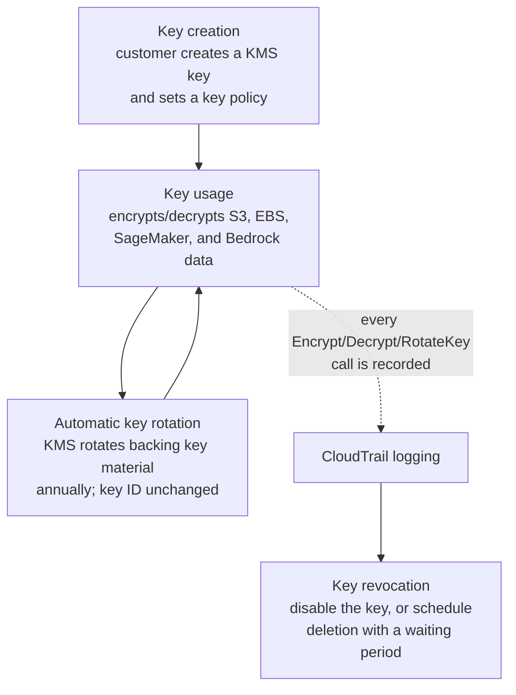
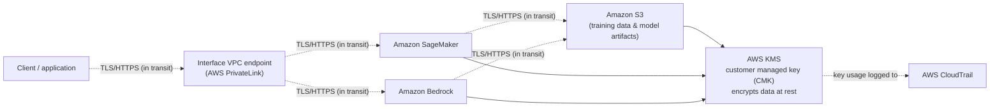
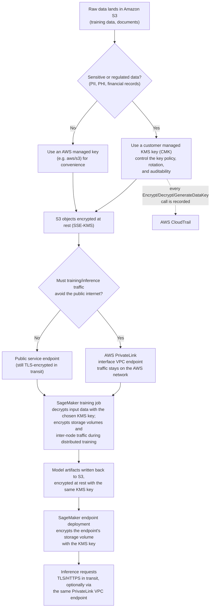

# Domain 5: Security, Compliance, and Governance for AI Solutions

*AWS Certified AI Practitioner (AIF-C01) — ~14% of exam*

[← Domain 4: Guidelines for Responsible AI](domain-4-guidelines-for-responsible-ai.md) · **Domain 5 of 5** · [README →](../README.md)

## Table of contents

- [1. Securing AI systems](#1-securing-ai-systems)
  - [IAM roles and policies for AI services](#iam-roles-and-policies-for-ai-services)
  - [Data encryption at rest and in transit](#data-encryption-at-rest-and-in-transit)
  - [AWS PrivateLink and VPC endpoints for AI services](#aws-privatelink-and-vpc-endpoints-for-ai-services)
  - [Source citation and data lineage](#source-citation-and-data-lineage)
  - [Common security threats to AI systems and how to mitigate them](#common-security-threats-to-ai-systems-and-how-to-mitigate-them)
  - [Security frameworks for AI systems: MITRE ATLAS and OWASP Top 10 for LLM Applications](#security-frameworks-for-ai-systems-mitre-atlas-and-owasp-top-10-for-llm-applications)
- [2. AWS compliance standards relevant to AI workloads](#2-aws-compliance-standards-relevant-to-ai-workloads)
  - [AWS Artifact](#aws-artifact)
  - [GDPR (General Data Protection Regulation) — conceptual level](#gdpr-general-data-protection-regulation-conceptual-level)
  - [HIPAA (Health Insurance Portability and Accountability Act) — conceptual level](#hipaa-health-insurance-portability-and-accountability-act-conceptual-level)
  - [NIST AI Risk Management Framework (AI RMF) — conceptual level](#nist-ai-risk-management-framework-ai-rmf-conceptual-level)
  - [EU AI Act — conceptual level](#eu-ai-act-conceptual-level)
  - [ISO/IEC 42001 and the Algorithmic Accountability Act — conceptual level](#isoiec-42001-and-the-algorithmic-accountability-act-conceptual-level)
- [3. AWS Config, AWS Audit Manager, and AWS CloudTrail for AI governance](#3-aws-config-aws-audit-manager-and-aws-cloudtrail-for-ai-governance)
- [4. Data governance strategies](#4-data-governance-strategies)
  - [Data lifecycle](#data-lifecycle)
  - [Data residency](#data-residency)
  - [Data monitoring](#data-monitoring)
- [5. AWS shared responsibility model applied to AI/ML services](#5-aws-shared-responsibility-model-applied-to-aiml-services)
- [Comparison table: governance and monitoring services](#comparison-table-governance-and-monitoring-services)
- [Comparison table: governance and compliance regulations at a glance](#comparison-table-governance-and-compliance-regulations-at-a-glance)
- [Key terms glossary](#key-terms-glossary)
- [Practice questions](#practice-questions)
- [Answer key](#answer-key)

## Domain overview

This domain tests whether you understand how to keep AI/ML workloads on AWS
secure, compliant, and governable — not how to build models. Expect
scenario questions about which IAM setup, encryption option, networking
control, or governance/audit service fits a described business or
regulatory requirement. AWS Certified AI Practitioner does not expect deep
security-engineering knowledge (that's the Security Specialty exam); it
expects you to recognize the *right AWS service or concept* for a
described need, and to understand the shared responsibility model as it
applies to managed AI services like Amazon Bedrock and Amazon SageMaker.
The two official task statements behind this domain are: (5.1) explain
methods to secure AI systems, and (5.2) recognize governance and
compliance regulations for AI systems.

## 1. Securing AI systems

### IAM roles and policies for AI services
AWS Identity and Access Management (IAM) controls *who* (a user, group, or
AWS service) can do *what* (an action, like `bedrock:InvokeModel` or
`sagemaker:CreateTrainingJob`) on *which resource*. AI services on AWS use
the same IAM model as the rest of AWS:
- **IAM policies** (JSON documents) attached to users, groups, or roles
  grant or deny specific actions on specific resources.
- **IAM roles** are the preferred way for AWS services to act on your
  behalf — for example, a SageMaker notebook or training job assumes an
  **execution role** that grants it permission to read training data from
  Amazon S3 and write model artifacts back, without embedding long-term
  credentials.
- Apply **least privilege**: grant only the specific actions needed (e.g.,
  scope a role to `bedrock:InvokeModel` on one specific foundation model
  ARN, rather than `bedrock:*` on `*`).
- **Resource-based policies** (e.g., an S3 bucket policy or a Bedrock
  model resource policy) can restrict access independently of the
  caller's identity policy.

**Example:** A SageMaker training job needs an IAM execution role with a
trust policy allowing the `sagemaker.amazonaws.com` service principal to
assume it, plus a permissions policy scoping S3 `GetObject`/`PutObject` to
only the specific training-data and output buckets — not all of S3.

**Exam tip:** If a question describes an AWS *service* needing to call
another AWS service on a customer's behalf, the answer is almost always
"attach an IAM role to the service" — not "embed an access key," which is
an anti-pattern AWS never recommends.

**IAM Access Analyzer** complements this by continuously analyzing
resource-based policies (like an S3 bucket policy or Bedrock model resource
policy) to identify resources shared with an external entity — helping
validate that least-privilege IAM configurations for AI workloads aren't
unintentionally broader than intended.

### Data encryption at rest and in transit
- **Encryption at rest** protects stored data (S3 objects, SageMaker
  model artifacts, EBS volumes, Bedrock fine-tuning data). AWS Key
  Management Service (AWS KMS) is the standard mechanism: use
  AWS-managed keys (e.g., `aws/s3`) for convenience, or **customer
  managed keys (CMKs)** when you need to control key policies, rotation,
  and auditability (every use of a CMK is logged in CloudTrail).
- **Encryption in transit** protects data moving over the network,
  enforced via TLS. API calls to Bedrock, SageMaker, and other AI
  services are encrypted in transit by default via HTTPS endpoints.
- Amazon SageMaker lets you encrypt notebook storage, training/inference
  storage volumes, and inter-node traffic during distributed training.
  Amazon Bedrock encrypts data at rest and in transit by default, and
  supports customer-managed KMS keys for custom models and fine-tuning
  data.

**Example:** A healthcare company fine-tuning a model on Amazon Bedrock
with patient data must use a customer-managed KMS key so that only
specifically authorized roles can decrypt the training data, and so all
decrypt operations are traceable via AWS CloudTrail.

**Exam tip:** "Encryption at rest" = data on disk (S3, EBS, KMS). "Encryption
in transit" = data moving over the network (TLS/HTTPS). Don't confuse
KMS (which manages *keys*) with CloudTrail (which *logs* key usage) — a
common distractor pairing.

**Visual summary — KMS key lifecycle:** the diagram below traces a
customer managed key from creation through routine use, automatic
rotation, CloudTrail logging, and eventual revocation:



### AWS PrivateLink and VPC endpoints for AI services
By default, calls from your VPC to an AWS service like Bedrock or
SageMaker travel over the public AWS network backbone via public service
endpoints. **AWS PrivateLink** lets you create an **interface VPC
endpoint** so that traffic to a supported AWS service stays entirely
within the AWS network and never traverses the public internet — no
internet gateway, NAT gateway, or public IP required.

**Example:** A financial services company wants its SageMaker notebook
instances (inside a private VPC subnet with no internet access) to call
the Bedrock Runtime API to invoke a foundation model. They create a
Bedrock interface VPC endpoint (powered by PrivateLink) in their VPC, and
attach a security group and VPC endpoint policy restricting which
principals can use it.

**Exam tip:** If a scenario says data must never traverse the public
internet, or a workload runs in an isolated/air-gapped VPC with no
internet gateway, the answer is a **VPC endpoint (PrivateLink)** — not a
NAT gateway (which still routes through the public internet) and not a
VPN (which connects networks, not a VPC to an AWS service).

**Visual summary — data security and encryption architecture:** the
diagram below shows a request flowing from a client through a private VPC
endpoint to SageMaker/Bedrock, encrypted in transit via TLS the whole way,
down to S3 storage encrypted at rest via a customer managed KMS key, with
every key operation logged to CloudTrail:



**Visual summary — end-to-end encryption pipeline and key-choice decision
points:** the diagram below traces raw data from Amazon S3 through a
SageMaker training job to a deployed inference endpoint, showing exactly
where each encryption decision is made and how PrivateLink fits into the
path:



### Source citation and data lineage
- **Source citation / attribution**: Retrieval-Augmented Generation (RAG)
  systems should cite the source documents used to generate a response,
  which improves trust and lets users verify claims. **Amazon Bedrock
  Knowledge Bases** natively returns source attribution (the specific
  document chunks and their locations) alongside generated responses.
- **Data lineage** tracks where data came from, how it was transformed,
  and how it flows through a pipeline into a trained model — important
  for debugging, reproducibility, and audit. **Amazon SageMaker ML
  Lineage Tracking** automatically records the lineage of datasets,
  processing jobs, training jobs, and model artifacts. **Amazon
  SageMaker Model Cards** document a model's intended use, training data,
  and evaluation results for governance and transparency.

**Example:** A company must prove to an auditor which exact training
dataset version produced a deployed fraud-detection model. SageMaker ML
Lineage Tracking provides a traceable graph from raw data → processing
job → training job → model artifact → endpoint.

**Exam tip:** Source citation is about *end-user trust in generated
output* (RAG citing documents); data lineage is about *tracing a
dataset/model's history for governance*. Don't conflate the two — the
exam tests both as distinct concepts under "transparency."

### Common security threats to AI systems and how to mitigate them
AI/ML systems face threats beyond traditional application security, because
the *data* and the *model* are themselves attack surfaces, and outputs are
often non-deterministic. The exam expects you to recognize each threat by
description and know the general mitigation category (AWS best practice or
MLOps practice), not implement a fix yourself.
- **Data poisoning** — an attacker deliberately corrupts training (or
  fine-tuning) data so the resulting model behaves incorrectly or
  maliciously. Mitigate with strict access controls on training data (IAM,
  S3 bucket policies), data validation/provenance checks, and dataset
  versioning so a poisoned version can be identified and rolled back.
- **Prompt injection** — malicious input tries to override a model's or
  application's original instructions (directly, in the user's prompt, or
  indirectly, hidden in a retrieved document in a RAG pipeline). Mitigate
  with **Guardrails for Amazon Bedrock** (content filters, denied topics,
  contextual grounding checks) and by treating retrieved content as
  untrusted input, not instructions.
- **Model inversion / extraction attacks** — an adversary sends many
  crafted queries to a deployed model to try to reconstruct training data
  or replicate the model itself. Mitigate with request throttling/rate
  limiting, output filtering, and least-privilege access to inference
  endpoints.
- **Model performance degradation over time (model/data drift)** — a
  model's real-world accuracy erodes as production data distributions
  diverge from training data. Mitigate with continuous monitoring (Amazon
  CloudWatch, SageMaker Model Monitor) and a retraining pipeline as part of
  MLOps practice.

AI-specific security also differs from traditional software security in a
key way: traditional software is deterministic (the same input always
produces the same output, so signature-based defenses work well), while AI
systems are often **non-deterministic** — the same prompt can yield
different outputs on different runs — which means security controls must
focus on the data pipeline and inference interface, not just static code
scanning. Security considerations also span the AI system's stages:
**development** (secure data engineering — vetting the source, versioning,
and integrity of training data), **deployment** (IAM, encryption, and
network isolation, covered above), and **monitoring** (detecting anomalous
invocation patterns, [Section 4](#data-monitoring)). Guardrails for Amazon
Bedrock can also apply different controls (blocking, filtering) to
different content types/modalities it supports (e.g., text and image),
letting teams tune enforcement per content type rather than applying one
blanket rule.

**Example:** A company builds a RAG chatbot over public web documents. An
attacker plants hidden text in a web page instructing the model to reveal
confidential system prompts. This is an **indirect prompt injection**
attack; configuring Guardrails for Amazon Bedrock to filter suspicious
instructions in retrieved content is a direct mitigation.

**Exam tip:** Distinguish the threats by *what* is attacked: data
poisoning corrupts training data, prompt injection hijacks instructions at
inference time, and model inversion/extraction targets the deployed model
through its API. Model drift is degradation, not an attack — the
mitigation (monitoring + retraining) is different from the mitigation for
the other three (access control, input/output filtering).

### Security frameworks for AI systems: MITRE ATLAS and OWASP Top 10 for LLM Applications
Two industry frameworks help teams reason about AI-specific threats
systematically, and the exam expects you to recognize them by name and
purpose:
- **MITRE ATLAS** (Adversarial Threat Landscape for Artificial-Intelligence
  Systems) is a knowledge base of adversary tactics and techniques against
  AI systems, modeled on the well-known MITRE ATT&CK framework for
  traditional IT systems. It catalogs real-world attack patterns like data
  poisoning and model evasion so defenders can map their own AI system's
  exposure.
- **OWASP Top 10 for Large Language Model Applications** is a
  community-maintained list of the most critical security risks specific
  to LLM-based applications (e.g., prompt injection, insecure output
  handling, training data poisoning, model denial of service) — the
  generative-AI counterpart to the well-known OWASP Top 10 for web
  applications.

Both frameworks are used to *apply* structured thinking to AI security, a
distinct exam skill from *knowing* the underlying threats (previous
subsection).

**Example:** A security team building a Bedrock-powered support agent
wants a checklist of generative-AI-specific risks to test for before
launch. They use the OWASP Top 10 for LLM Applications as that checklist,
and reference MITRE ATLAS to understand how each risk could realistically
be exploited.

**Exam tip:** If a question describes *cataloging adversary
tactics/techniques* against AI systems generally, it's MITRE ATLAS; if it
describes a *prioritized risk checklist specifically for LLM
applications*, it's the OWASP Top 10 for LLM Applications. Neither is an
AWS service — both are external, vendor-neutral frameworks the exam
expects you to recognize by name.

#### Mini-quiz: Test your understanding of securing AI systems

Quick self-check before moving on — try to answer before reading the
explanation.

1. A SageMaker training job needs to read training data from Amazon S3 and
   write model artifacts back, without embedding any long-term AWS
   credentials in the training container. What should be configured?
   A. A hardcoded IAM user access key pair stored in the training script
   B. An IAM execution role with a trust policy allowing the
      `sagemaker.amazonaws.com` service principal to assume it, scoped to
      only the needed S3 actions
   C. A public S3 bucket policy allowing anonymous access
   D. A VPN connection between the training job and S3

   **Answer: B** — IAM execution roles let a SageMaker training job assume
   permissions on the customer's behalf without embedding long-term
   credentials, and least privilege means scoping the role to only the
   needed S3 actions.

2. A company invokes Amazon Bedrock Runtime from a client application and
   stores the resulting model artifacts in Amazon S3. Which pairing
   correctly matches the encryption mechanism to what it protects?
   A. TLS/HTTPS encrypts the data in transit to Bedrock Runtime; a KMS key
      encrypts the S3-stored artifacts at rest
   B. A KMS key encrypts data in transit; TLS/HTTPS encrypts data at rest
   C. TLS/HTTPS handles both at rest and in transit; KMS is not used
   D. Neither at-rest nor in-transit encryption applies to Bedrock by
      default

   **Answer: A** — TLS/HTTPS protects data moving over the network
   (encryption in transit); AWS KMS protects stored data like S3 model
   artifacts (encryption at rest). Reversing the two (B) is a common
   distractor.

3. A SageMaker notebook instance runs in a private VPC subnet with no
   internet gateway and needs to call the Bedrock Runtime API. What should
   be configured so the traffic never traverses the public internet?
   A. A NAT gateway with a route to the internet
   B. An interface VPC endpoint for Bedrock Runtime, powered by AWS
      PrivateLink
   C. A site-to-site VPN connection to AWS
   D. A public IP address attached to the notebook instance

   **Answer: B** — An interface VPC endpoint (AWS PrivateLink) keeps
   traffic to Bedrock entirely within the AWS network. A NAT gateway (A)
   still routes through the public internet, and a VPN (C) connects
   networks rather than a VPC to an AWS service.

4. An attacker gains write access to a training data S3 bucket and subtly
   alters a small number of labels to bias a fraud-detection model's
   behavior. Which threat is this?
   A. Prompt injection
   B. Data poisoning
   C. Model inversion / extraction
   D. Model drift

   **Answer: B** — Corrupting training data itself to manipulate a
   model's behavior is data poisoning. Prompt injection (A) hijacks
   instructions at inference time, model inversion (C) targets a deployed
   model through crafted queries, and model drift (D) is gradual
   degradation, not an attack.

---

## 2. AWS compliance standards relevant to AI workloads

### AWS Artifact
**AWS Artifact** is a self-service portal providing on-demand access to
AWS's compliance reports (SOC 1/2/3, ISO 27001, PCI DSS, etc.) and to
agreements you can review and accept online, including the **Business
Associate Addendum (BAA)** required for HIPAA-eligible workloads. It does
not scan or audit *your* AWS account — it gives you AWS's own third-party
audit reports and legal agreements.

**Example:** A company's compliance team needs proof that AWS's data
centers meet ISO 27001 requirements to satisfy an internal audit. They
download the relevant report from AWS Artifact Reports.

### GDPR (General Data Protection Regulation) — conceptual level
An EU regulation governing the processing of personal data of individuals
in the EU/EEA. Key AIF-C01-relevant concepts:
- AWS is generally the **data processor**; the customer is the **data
  controller** responsible for how personal data is used and for lawful
  basis of processing.
- Customers can use AWS Regions to help meet **data residency**
  requirements (keeping EU personal data within EU Regions).
- Concepts like the right to erasure and data minimization matter for AI
  training data pipelines (e.g., ensuring a person's data can be removed
  from a dataset and any downstream retrained model).

### HIPAA (Health Insurance Portability and Accountability Act) — conceptual level
A US law governing protected health information (PHI). To process PHI on
AWS, a customer must execute a **BAA** with AWS (obtained via AWS
Artifact), and use only **HIPAA-eligible services** configured according
to AWS's HIPAA guidance (e.g., encryption enabled, access controls
applied). Several AI/ML services, including Amazon SageMaker and Amazon
Comprehend Medical, are HIPAA-eligible under the BAA.

**Exam tip:** HIPAA is US healthcare-specific; GDPR is EU personal-data
general regulation. Both are checked at a *conceptual* level on this
exam — you need to know *what they protect and why AWS Artifact matters*,
not clause-by-clause legal detail. If a question mentions PHI, think BAA
+ HIPAA-eligible services. If it mentions EU citizens' personal data,
think GDPR + data residency + Regions.

### NIST AI Risk Management Framework (AI RMF) — conceptual level
A **voluntary** framework published by the US National Institute of
Standards and Technology (NIST) to help organizations manage risk
throughout an AI system's lifecycle. It is organized around four core
functions: **Govern** (cultivate a risk-management culture), **Map**
(identify context and risks), **Measure** (assess and track risks), and
**Manage** (prioritize and respond to risks). Unlike a law, the NIST AI
RMF is guidance an organization chooses to adopt — it is not legally
binding.

### EU AI Act — conceptual level
A **binding** European Union regulation (distinct from GDPR, which governs
personal data broadly) that specifically regulates AI systems by
classifying them into risk tiers — **unacceptable risk** (banned),
**high risk** (subject to strict requirements like risk management, data
governance, human oversight, and documentation), **limited risk**
(subject to transparency obligations, e.g., disclosing that content is
AI-generated), and **minimal risk** (largely unregulated). The exam
expects you to recognize the EU AI Act as risk-tiered AI-specific
regulation, distinct from GDPR's focus on personal data protection.

### ISO/IEC 42001 and the Algorithmic Accountability Act — conceptual level
- **ISO/IEC 42001** is an international standard for an **AI management
  system (AIMS)** — a certifiable set of processes for governing AI
  responsibly throughout its lifecycle, conceptually similar to how ISO
  27001 certifies an information security management system. An
  organization can pursue ISO/IEC 42001 certification to demonstrate a
  mature AI governance program.
- The **Algorithmic Accountability Act** is proposed US legislation that
  would require companies to conduct and report **impact assessments** for
  automated decision systems, evaluating them for bias, effectiveness, and
  other risks before and during deployment. It illustrates the *direction*
  of AI-specific legislation rather than being in force everywhere — the
  exam tests recognition of the concept, not its legal status.

**Example:** A multinational company deploying a high-risk AI hiring tool
in the EU must comply with the EU AI Act's high-risk obligations
(documentation, human oversight); pursuing ISO/IEC 42001 certification is
a voluntary step that helps demonstrate a mature governance program to
regulators and customers, while the NIST AI RMF offers a voluntary process
framework the company could use internally to structure that governance
work.

**Exam tip:** Keep the type straight: **GDPR** and the **EU AI Act** are
binding EU *laws*; **HIPAA** is a binding US *law*; the **NIST AI RMF** and
**ISO/IEC 42001** are *voluntary* frameworks/standards an organization
chooses to adopt; the **Algorithmic Accountability Act** is *proposed*
(not-yet-binding) US legislation. A question asking "which of these is
legally mandatory" hinges on this distinction.

#### Mini-quiz: Test your understanding of AWS compliance standards for AI workloads

Quick self-check before moving on — try to answer before reading the
explanation.

1. A compliance team needs to download AWS's SOC 2 report and execute a
   HIPAA Business Associate Addendum (BAA) before processing PHI on AWS.
   Which service should they use?
   A. AWS Config
   B. AWS Artifact
   C. AWS Audit Manager
   D. AWS CloudTrail

   **Answer: B** — AWS Artifact is the self-service portal for AWS's own
   compliance reports (like SOC 2) and agreements (like the HIPAA BAA).
   Audit Manager (C) builds evidence for *your* account, not AWS's own
   certifications.

2. When a company uses Amazon Bedrock to process the personal data of EU
   customers, which role does AWS typically play under GDPR?
   A. Data controller
   B. Data subject
   C. Data processor
   D. Supervisory authority

   **Answer: C** — AWS is generally the data processor, processing
   personal data on the customer's behalf, while the customer (as data
   controller) decides the purpose and means of processing.

3. Which statement correctly distinguishes the NIST AI Risk Management
   Framework (AI RMF) from the EU AI Act?
   A. Both are legally binding laws enforced identically worldwide
   B. The NIST AI RMF is a voluntary framework organizations may choose to
      adopt; the EU AI Act is a binding regulation that imposes
      risk-tiered legal obligations
   C. The NIST AI RMF only applies to healthcare AI; the EU AI Act only
      applies to financial AI
   D. The EU AI Act is voluntary guidance; the NIST AI RMF is binding law

   **Answer: B** — The NIST AI RMF is voluntary US guidance an
   organization chooses to adopt; the EU AI Act is a binding EU regulation
   that classifies AI systems into risk tiers with mandatory obligations.

---

## 3. AWS Config, AWS Audit Manager, and AWS CloudTrail for AI governance

These three services are frequently confused on the exam because they all
relate to "governance," but they answer different questions.

- **AWS CloudTrail** answers *"who did what, and when?"* It logs API
  calls made against your AWS account (e.g., every `bedrock:InvokeModel`
  or `sagemaker:CreateEndpoint` call, by whom, from where, at what time),
  which is essential for security investigations and proving
  accountability for AI system usage.
- **AWS Config** answers *"what is my resource's configuration, and is it
  compliant?"* It continuously records the configuration state of AWS
  resources (e.g., is a SageMaker endpoint's storage volume encrypted?)
  and evaluates them against **Config rules** (e.g., "S3 buckets must not
  be public"), flagging drift and non-compliance over time.
- **AWS Audit Manager** answers *"can I produce audit-ready evidence for
  a compliance framework?"* It continuously collects evidence (leveraging
  CloudTrail logs and Config data, among other sources) and maps it to
  prebuilt or custom **frameworks** (e.g., GDPR, HIPAA, ISO 27001) to
  streamline audit preparation.

**Example:** An enterprise must demonstrate to auditors that all
generative AI endpoint invocations are logged, that no SageMaker
endpoint was ever left unencrypted, and produce a consolidated audit
report mapped to their industry framework. This uses all three together:
CloudTrail for the invocation log, Config for continuous encryption
compliance checks, and Audit Manager to assemble the combined evidence
into an audit-ready report.

**Exam tip:** Memorize the one-line distinction: CloudTrail = API activity
log, Config = resource configuration/compliance state, Audit Manager =
automated evidence collection for audits. A question asking "which
service tells you a specific S3 bucket became publicly accessible three
days ago" is AWS Config (configuration history), not CloudTrail (which
would show the *API call* that changed it, but not evaluate compliance).

```
NEED TO ANSWER: which governance/monitoring service applies?
│
├─ "Who called this API, and when?" (API activity / who-did-what)
│   → AWS CloudTrail
│
├─ "Is this resource's configuration compliant, and did it drift
│   out of compliance over time?" (configuration compliance checks)
│   → AWS Config
│
└─ "Can I produce an audit-ready evidence report mapped to a
    compliance framework (HIPAA, ISO 27001, GDPR, etc.)?"
    → AWS Audit Manager (built on evidence from CloudTrail and Config)
```

#### Mini-quiz: Test your understanding of AWS Config, Audit Manager, and CloudTrail for AI governance

Quick self-check before moving on — try to answer before reading the
explanation.

1. Which service answers the question "who invoked this specific Bedrock
   model, and exactly when?"
   A. AWS Config
   B. AWS CloudTrail
   C. AWS Audit Manager
   D. Amazon CloudWatch

   **Answer: B** — AWS CloudTrail logs API calls, including who invoked a
   model and when, directly answering "who did what, when."

2. Which service continuously evaluates whether a SageMaker endpoint's
   storage remains encrypted over time, and flags a compliance violation
   if that configuration drifts?
   A. AWS CloudTrail
   B. AWS Config
   C. AWS Audit Manager
   D. Amazon Inspector

   **Answer: B** — AWS Config continuously records resource configuration
   state and evaluates it against rules, flagging drift such as
   encryption being disabled. CloudTrail (A) only logs the API call that
   changed it, without evaluating ongoing compliance.

3. Which service produces a consolidated, audit-ready report mapping
   CloudTrail and Config evidence to a compliance framework like
   ISO 27001?
   A. AWS Config
   B. AWS CloudTrail
   C. AWS Audit Manager
   D. Amazon Macie

   **Answer: C** — AWS Audit Manager collects evidence (leveraging
   CloudTrail and Config, among other sources) and maps it to prebuilt or
   custom frameworks to streamline audit preparation.

---

## 4. Data governance strategies

### Data lifecycle
Managing data from creation/ingestion through storage, use, archival, and
deletion. For AI workloads this includes classifying data sensitivity
(e.g., using tags), applying **S3 Lifecycle policies** to transition
training data to cheaper storage tiers or expire it, and ensuring
datasets no longer needed (or subject to deletion requests) are actually
removed, including from derived artifacts where feasible.

### Data residency
Ensuring data stays within a required geographic boundary (e.g., a
country or region) for legal or regulatory reasons. On AWS this is
primarily achieved by choosing which **AWS Region** stores and processes
the data — AWS does not automatically replicate data across Regions
unless you configure it to. Data sovereignty (data subject to the laws of
the country it resides in) is closely related.

### Data monitoring
Ongoing observation of data access and content to detect risk. Key
services:
- **Amazon Macie** uses machine learning to automatically discover and
  classify sensitive data (like PII) stored in Amazon S3, and alerts on
  risky exposure — directly relevant to AI training datasets that may
  contain sensitive information.
- **Amazon CloudWatch** monitors operational metrics and logs (e.g.,
  SageMaker endpoint invocation counts, latency, errors) and can alarm on
  anomalies.
- **Amazon GuardDuty** provides threat detection by continuously
  monitoring for malicious activity across an account.

**Example:** Before using an internal document store to build a Bedrock
Knowledge Base, a company runs Amazon Macie against the source S3 bucket
to discover and flag any documents containing PII, so they can be
excluded or redacted before ingestion.

**Exam tip:** If the question is about *discovering sensitive data*
(PII/PHI) in storage, the answer is Amazon Macie. If it's about
*operational metrics/logs*, it's CloudWatch. If it's about *threat
detection*, it's GuardDuty. These three are commonly offered as
distractors for each other.

#### Mini-quiz: Test your understanding of data governance strategies

Quick self-check before moving on — try to answer before reading the
explanation.

1. Before ingesting an internal document store into a Bedrock Knowledge
   Base, a company wants to automatically discover whether any of the
   source documents contain PII. Which service should they use?
   A. AWS Config
   B. Amazon Macie
   C. Amazon GuardDuty
   D. AWS Audit Manager

   **Answer: B** — Amazon Macie uses machine learning to automatically
   discover and classify sensitive data like PII stored in S3, directly
   fitting this pre-ingestion check.

2. A company operating in a country with strict data sovereignty laws
   must ensure AI training data never leaves that country's borders, even
   for disaster-recovery replication. What is the most direct AWS
   mechanism to help meet this requirement?
   A. Enabling AWS CloudTrail in all Regions
   B. Restricting storage and processing to the AWS Region located in
      that country, and not enabling cross-Region replication
   C. Downloading a residency certificate from AWS Artifact
   D. Enabling Amazon GuardDuty

   **Answer: B** — Choosing and restricting processing to the in-country
   Region, without cross-Region replication, is the direct AWS mechanism
   for controlling where data is geographically stored and processed.

3. A team wants aging training data automatically transitioned to
   cheaper storage tiers, and eventually expired, without manual
   intervention. What should they configure?
   A. Amazon S3 Lifecycle policies
   B. AWS Config rules
   C. AWS CloudTrail retention settings
   D. Amazon Macie classification jobs

   **Answer: A** — S3 Lifecycle policies automate transitioning data to
   cheaper storage tiers or expiring it, which is exactly how the data
   lifecycle stage of data governance is implemented on AWS.

---

## 5. AWS shared responsibility model applied to AI/ML services

Under the **AWS Shared Responsibility Model**, AWS is responsible for
**security "of" the cloud** — the physical infrastructure, host
operating system, virtualization layer, and the managed AI/ML service
software itself (e.g., patching the underlying Bedrock/SageMaker
platform). The customer is responsible for **security "in" the cloud** —
their data, how they configure IAM permissions, which encryption options
they enable, network configuration, and the content/quality of data they
feed into or retrieve from AI services.

The exact dividing line shifts with the **abstraction level** of the
service:
- **Amazon Bedrock** (fully managed, serverless foundation model access):
  AWS manages the underlying infrastructure and foundation models
  entirely; the customer is responsible for IAM permissions, data sent
  to/from the model, guardrail configuration, and encryption key choices.
- **Amazon SageMaker** (build/train/deploy your own models): the customer
  takes on more responsibility — e.g., securing custom training
  containers, managing the training data pipeline, configuring VPC
  settings for training jobs, and patching custom inference code —
  while AWS still secures the underlying compute/storage infrastructure.

```
                Amazon Bedrock                              Amazon SageMaker
        ┌─────────────────────────────┐            ┌─────────────────────────────┐
        │   CUSTOMER ("in the cloud")  │            │   CUSTOMER ("in the cloud")  │
        │  - IAM permissions           │            │  - IAM permissions           │
        │  - Data sent to/from model   │            │  - Training data pipeline    │
        │  - Guardrail configuration   │            │  - Custom training/inference │
        │  - Encryption key choices    │            │    containers & code         │
        │                              │            │  - VPC config for jobs       │
        ├─────────────────────────────┤            ├─────────────────────────────┤
        │     AWS ("of the cloud")     │            │     AWS ("of the cloud")     │
        │  - Physical infrastructure   │            │  - Physical infrastructure   │
        │  - Host OS / virtualization  │            │  - Host OS / virtualization  │
        │  - FM hosting & patching     │            │  - Underlying compute/       │
        │                              │            │    storage infrastructure    │
        └─────────────────────────────┘            └─────────────────────────────┘
        (thin customer slice — most            (thicker customer slice — customer
         responsibility is AWS-managed)          takes on more configuration/code)
```

**Example:** If a Bedrock foundation model itself has a vulnerability in
AWS's serving infrastructure, that is AWS's responsibility to patch. If a
company misconfigures an IAM policy so any authenticated AWS user can
invoke their fine-tuned Bedrock model, that misconfiguration is the
customer's responsibility.

**Exam tip:** A frequent trick: the more "managed"/abstracted the AI
service (Bedrock > SageMaker JumpStart > SageMaker custom training), the
less infrastructure security the customer must handle — but the customer
is **always** responsible for their data and access configuration,
regardless of how managed the service is.

#### Mini-quiz: Test your understanding of the AWS shared responsibility model

Quick self-check before moving on — try to answer before reading the
explanation.

1. Regardless of whether a workload uses Amazon Bedrock or Amazon
   SageMaker, which of the following is always AWS's responsibility under
   the shared responsibility model?
   A. Configuring the customer's IAM policies
   B. Physical security of the data centers hosting the service
   C. Choosing which training data to use
   D. Enabling encryption on customer resources

   **Answer: B** — Physical data center security is always "security of
   the cloud," which is AWS's responsibility regardless of which AI/ML
   service abstraction level is used. The other options are always the
   customer's responsibility.

2. Why does a custom Amazon SageMaker training and inference setup place
   a larger security responsibility on the customer than using
   fully-managed Amazon Bedrock?
   A. Because SageMaker is less secure than Bedrock by design
   B. Because the customer must secure their own training containers,
      data pipeline, and custom code, while AWS still secures the
      underlying infrastructure
   C. Because AWS takes no responsibility at all for SageMaker
   D. Because SageMaker does not support IAM

   **Answer: B** — With SageMaker's build/train/deploy model, the
   customer takes on more of the "in the cloud" slice (custom containers,
   data pipeline, code), while AWS continues to secure the underlying
   compute/storage infrastructure.

3. If a vulnerability is discovered in the underlying infrastructure that
   serves Amazon Bedrock foundation models, who is responsible for
   patching it?
   A. The customer
   B. AWS
   C. A third-party auditor
   D. Whichever party accepted the EU AI Act obligations

   **Answer: B** — Patching the underlying foundation-model serving
   infrastructure is "security of the cloud," which is AWS's
   responsibility for a fully managed service like Bedrock.

---

## Comparison table: governance and monitoring services

| Service | Primary purpose | Answers the question... | Typical AI/ML use case |
|---|---|---|---|
| AWS CloudTrail | Logs API activity (who, what, when) | "Who invoked this model / changed this resource, and when?" | Audit trail of every `InvokeModel` or `CreateEndpoint` call |
| AWS Config | Tracks resource configuration state & compliance rules over time | "Is this resource compliant, and when did its configuration change?" | Detect a SageMaker endpoint or S3 bucket that became unencrypted/public |
| AWS Audit Manager | Automates collection of audit evidence mapped to a framework | "Can I generate an audit-ready compliance report?" | Assemble evidence for a HIPAA or ISO 27001 audit of an AI system |
| Amazon Macie | Discovers and classifies sensitive data in S3 | "Does this dataset contain PII/PHI?" | Scan training data buckets before fine-tuning or RAG ingestion |
| Amazon GuardDuty | Continuous threat/anomaly detection | "Is there malicious activity in my account?" | Detect compromised credentials being used to access AI resources |
| AWS Artifact | On-demand access to AWS compliance reports & agreements (e.g., BAA) | "Where do I get AWS's own compliance certifications or sign a BAA?" | Download SOC 2 report or execute a HIPAA BAA |
| AWS PrivateLink / VPC endpoints | Keep traffic to AWS services off the public internet | "How do I call an AWS AI service privately from my VPC?" | Private connectivity from a SageMaker notebook to Bedrock Runtime |
| AWS IAM Access Analyzer | Identifies resources shared with external principals; validates least-privilege policies | "Does this IAM or resource policy grant broader access than intended?" | Confirm a Bedrock model resource policy or S3 training-data bucket isn't unintentionally shared externally |

## Comparison table: governance and compliance regulations at a glance

| Regulation / framework | Type | Scope | Key AIF-C01-relevant idea |
|---|---|---|---|
| GDPR | Binding EU law | Personal data of EU/EEA individuals | Data controller/processor roles; data residency in EU Regions |
| HIPAA | Binding US law | Protected health information (PHI) | Requires a BAA (via AWS Artifact) and HIPAA-eligible services |
| EU AI Act | Binding EU law | AI systems, tiered by risk | Risk-based obligations: unacceptable/high/limited/minimal risk |
| NIST AI Risk Management Framework (AI RMF) | Voluntary US framework | AI risk management process | Govern, Map, Measure, Manage functions |
| ISO/IEC 42001 | Voluntary international standard | AI management system (AIMS) processes | Certifiable AI governance program, analogous to ISO 27001 |
| Algorithmic Accountability Act | Proposed US legislation | Automated decision systems | Would require algorithmic impact assessments |

## Key terms glossary

> Looking for a term from another domain? [`docs/master-glossary.md`](master-glossary.md) indexes every domain's key terms alphabetically with domain tags (e.g. `[D1, D3]`) and links back here.

- **IAM (Identity and Access Management)** — AWS service for controlling authentication and authorization to AWS resources.
- **Least privilege** — Granting only the minimum permissions needed to perform a task.
- **Execution role** — An IAM role an AWS service (e.g., SageMaker) assumes to act on a customer's behalf.
- **AWS KMS (Key Management Service)** — Managed service for creating and controlling encryption keys.
- **Customer managed key (CMK)** — A KMS key the customer creates and controls the policy/rotation for, as opposed to an AWS-managed key.
- **Encryption at rest** — Protecting stored data via encryption.
- **Encryption in transit** — Protecting data moving across a network, typically via TLS.
- **AWS PrivateLink** — Technology providing private connectivity between VPCs and AWS services without traversing the public internet.
- **VPC endpoint** — The interface within a VPC that connects to a supported AWS service via PrivateLink (or, for gateway endpoints, S3/DynamoDB).
- **Data lineage** — A traceable record of a dataset's origin and transformations through a pipeline.
- **Source citation / attribution** — Referencing the source documents used to generate an AI response, as provided by Amazon Bedrock Knowledge Bases.
- **AWS Artifact** — Self-service portal for AWS compliance reports and agreements (e.g., BAA).
- **BAA (Business Associate Addendum)** — Agreement required with AWS before processing PHI under HIPAA.
- **GDPR** — EU regulation governing processing of personal data.
- **HIPAA** — US law governing protected health information (PHI).
- **Data controller / data processor** — Under GDPR, the controller decides how/why data is processed (usually the customer); the processor processes it on the controller's behalf (AWS).
- **AWS CloudTrail** — Service that logs AWS API activity for auditing.
- **AWS Config** — Service that records resource configuration history and evaluates compliance rules.
- **AWS Audit Manager** — Service that automates evidence collection mapped to compliance frameworks.
- **Amazon Macie** — ML-powered service that discovers and classifies sensitive data in S3.
- **Data residency** — Requirement that data remain stored/processed within a specific geographic location.
- **Data sovereignty** — The principle that data is subject to the laws of the country in which it is located.
- **Shared responsibility model** — The division of security duties between AWS ("of the cloud") and the customer ("in the cloud").
- **PII (Personally Identifiable Information)** — Data that can identify a specific individual.
- **Data poisoning** — An attack where training or fine-tuning data is deliberately corrupted to manipulate a model's behavior.
- **Model inversion (attack)** — An attack where an adversary uses crafted queries against a deployed model to try to reconstruct training data or replicate the model.
- **MITRE ATLAS** — A knowledge base of adversary tactics and techniques against AI systems, modeled on MITRE ATT&CK.
- **OWASP Top 10 for LLM Applications** — A prioritized list of the top security risks specific to large language model applications, such as prompt injection and training data poisoning.
- **IAM Access Analyzer** — An IAM feature that identifies resources (e.g., S3 buckets, Bedrock model resource policies) shared with entities outside your AWS account or organization.
- **NIST AI Risk Management Framework (AI RMF)** — A voluntary US framework (Govern, Map, Measure, Manage) for managing risk throughout an AI system's lifecycle.
- **EU AI Act** — A binding EU regulation that classifies AI systems into risk tiers (unacceptable, high, limited, minimal) and imposes obligations scaled to risk.
- **ISO/IEC 42001** — An international standard for a certifiable AI management system (AIMS), conceptually similar to ISO 27001 for information security.
- **Algorithmic Accountability Act** — Proposed US legislation that would require impact assessments for automated decision systems.

## Practice questions

1. **[Intermediate]** A company wants its SageMaker training jobs, running in a private VPC subnet with no internet gateway, to read training data from S3 without traversing the public internet. What should they configure?
   A. An internet gateway with a restrictive security group
   B. A gateway VPC endpoint for Amazon S3
   C. A NAT gateway
   D. A site-to-site VPN connection

2. **[Beginner]** Which AWS service should a compliance team use to download AWS's SOC 2 report and execute a HIPAA Business Associate Addendum?
   A. AWS Audit Manager
   B. AWS Config
   C. AWS Artifact
   D. AWS CloudTrail

3. **[Advanced]** (Multiple response — select TWO) Which of the following are the customer's responsibility, not AWS's, under the shared responsibility model when using Amazon Bedrock?
   A. Patching the underlying foundation model serving infrastructure
   B. Configuring IAM policies that control who can invoke a model
   C. Physical security of the data center
   D. Choosing whether to use a customer-managed KMS key for fine-tuning data
   E. Maintaining the hardware host operating system

4. **[Beginner]** A security team needs to know exactly which IAM principal called `bedrock:InvokeModel` on a specific model at 3:14 AM last Tuesday. Which service provides this?
   A. AWS Config
   B. AWS CloudTrail
   C. AWS Audit Manager
   D. Amazon CloudWatch

5. **[Beginner]** A retail company wants to automatically discover whether any documents in their S3-based product-review dataset contain customer PII before using them to fine-tune a model. Which service should they use?
   A. Amazon GuardDuty
   B. AWS Config
   C. Amazon Macie
   D. AWS Trusted Advisor

6. **[Intermediate]** Which statement about encryption at rest vs. in transit for Amazon Bedrock is correct?
   A. Bedrock only encrypts data in transit; data at rest is unencrypted by default
   B. Bedrock encrypts data both at rest and in transit by default, and supports customer-managed KMS keys for custom models
   C. Encryption at rest must be manually enabled by opening a support ticket
   D. Bedrock does not support customer-managed encryption keys under any circumstance

7. **[Intermediate]** A healthcare startup wants to process protected health information (PHI) using Amazon SageMaker. What must they do first, per AWS's HIPAA guidance?
   A. Nothing — all SageMaker features are automatically HIPAA-eligible with no action required
   B. Execute a Business Associate Addendum (BAA) with AWS via AWS Artifact and use only HIPAA-eligible service configurations
   C. Migrate to a GovCloud Region, which is mandatory for any HIPAA workload
   D. Purchase AWS Shield Advanced

8. **[Intermediate]** Which AWS service continuously evaluates whether a SageMaker endpoint's storage remains encrypted over time and flags a compliance violation if that configuration drifts?
   A. AWS CloudTrail
   B. AWS Config
   C. AWS Audit Manager
   D. Amazon Inspector

9. **[Intermediate]** A financial institution must produce a consolidated, audit-ready report showing evidence of compliance with an internal risk framework for its AI-powered fraud detection system, pulling from configuration history and API logs automatically. Which service is purpose-built for this?
   A. AWS Config
   B. AWS CloudTrail
   C. AWS Audit Manager
   D. Amazon Macie

10. **[Advanced]** In a GDPR context, when a company uses Amazon Bedrock to process personal data of EU customers, which role does AWS typically play?
    A. Data controller
    B. Data subject
    C. Data processor
    D. Supervisory authority

11. **[Beginner]** Which approach best helps a company satisfy an EU data residency requirement for training data used with SageMaker?
    A. Enable AWS Shield Advanced
    B. Store and process the data only within an EU AWS Region
    C. Enable CloudTrail logging
    D. Use a customer-managed KMS key

12. **[Beginner]** A RAG-based customer support chatbot built on Amazon Bedrock Knowledge Bases should let end users verify which document a generated answer came from. Which capability supports this directly?
    A. Data lineage tracking
    B. Source citation / attribution returned by Knowledge Bases
    C. AWS Config compliance rules
    D. IAM resource-based policies

13. **[Intermediate]** A data science team must be able to show an auditor exactly which raw dataset and processing job produced a specific deployed SageMaker model. Which capability provides this?
    A. Amazon Macie
    B. SageMaker ML Lineage Tracking
    C. AWS Artifact
    D. AWS PrivateLink

14. **[Advanced]** (Multiple response — select TWO) Which of the following are true about IAM execution roles used by SageMaker training jobs?
    A. They should be granted broad `*` permissions to avoid job failures
    B. They allow the SageMaker service to act on the customer's behalf without embedding long-term credentials
    C. Their trust policy must allow the `sagemaker.amazonaws.com` service principal to assume the role
    D. They are unnecessary if the training data bucket is public

15. **[Beginner]** Which service provides continuous, ML-driven threat detection for suspicious or malicious activity in an AWS account hosting AI workloads?
    A. Amazon Macie
    B. Amazon GuardDuty
    C. AWS Config
    D. AWS Audit Manager

16. **[Intermediate]** A company operating in a country with strict data sovereignty laws must ensure that data used by its AI application never leaves that country's borders, even for disaster recovery replication. What is the most direct AWS mechanism to help meet this requirement?
    A. Enabling AWS CloudTrail in all Regions
    B. Restricting data storage and processing to the AWS Region located in that country, and not enabling cross-Region replication
    C. Using AWS Artifact to download a residency certificate
    D. Enabling GuardDuty

17. **[Intermediate]** Under the shared responsibility model, which of the following is always AWS's responsibility, regardless of which AI/ML service (Bedrock or SageMaker) a customer uses?
    A. Configuring the customer's IAM policies correctly
    B. Physical security of the data centers hosting the service
    C. Choosing appropriate training data
    D. Enabling encryption on customer resources

18. **[Intermediate]** A team wants to keep all traffic between their on-premises data center-connected VPC and the Amazon Bedrock Runtime API off the public internet entirely. What should they implement?
    A. A NAT gateway in a public subnet
    B. An interface VPC endpoint for Bedrock Runtime, powered by AWS PrivateLink
    C. A public S3 bucket with restrictive bucket policy
    D. AWS Artifact private connectivity mode

19. **[Beginner]** Which statement correctly distinguishes AWS Config from AWS CloudTrail?
    A. Config logs API calls; CloudTrail tracks resource configuration compliance over time
    B. Config tracks resource configuration state and compliance rules over time; CloudTrail logs API call activity
    C. They are interchangeable and provide identical functionality
    D. Config is only for networking resources; CloudTrail is only for IAM resources

20. **[Intermediate]** A company wants to grant a Lambda function used in an AI pipeline only the ability to invoke one specific Bedrock model ARN, nothing else. Which principle and mechanism should they apply?
    A. Attach the `AdministratorAccess` managed policy for simplicity
    B. Apply least privilege via a scoped IAM policy naming the specific model ARN and the `bedrock:InvokeModel` action
    C. Rely on AWS Artifact to restrict access automatically
    D. Disable IAM entirely and use only network-level controls

21. **[Intermediate]** An attacker gains write access to a company's training data S3 bucket and subtly alters labels to bias a fraud-detection model. Which type of attack is this, and what is a primary AWS-based mitigation?
    A. Prompt injection; mitigate with Guardrails for Amazon Bedrock
    B. Data poisoning; mitigate with strict IAM/S3 bucket access controls and dataset versioning
    C. Model inversion; mitigate with request throttling
    D. Model drift; mitigate with SageMaker Model Monitor

22. **[Intermediate]** A RAG-based chatbot retrieves and summarizes public web pages. An attacker embeds hidden text in a web page instructing the model to ignore its system prompt and reveal internal data. What is this attack called, and which AWS capability most directly helps mitigate it?
    A. Data poisoning; AWS Config
    B. Model inversion; Amazon Macie
    C. Indirect prompt injection; Guardrails for Amazon Bedrock
    D. Model drift; Amazon CloudWatch

23. **[Beginner]** Which of the following best distinguishes MITRE ATLAS from the OWASP Top 10 for Large Language Model Applications?
    A. They are identical frameworks published by the same organization
    B. MITRE ATLAS is a broad knowledge base of adversary tactics/techniques against AI systems; the OWASP Top 10 for LLM Applications is a prioritized list of top risks specific to LLM applications
    C. MITRE ATLAS is an AWS service; OWASP Top 10 is a compliance law
    D. OWASP Top 10 for LLM Applications only applies to image-generation models

24. **[Intermediate]** A security team wants to confirm that no S3 bucket holding SageMaker training data, and no Bedrock model resource policy, has been unintentionally shared with an AWS account outside their organization. Which service is purpose-built for this check?
    A. AWS Audit Manager
    B. AWS IAM Access Analyzer
    C. Amazon Macie
    D. AWS Config

25. **[Intermediate]** Which statement correctly distinguishes the NIST AI Risk Management Framework (AI RMF) from the EU AI Act?
    A. Both are legally binding laws enforced identically worldwide
    B. The NIST AI RMF is a voluntary US framework for managing AI risk; the EU AI Act is a binding EU regulation that imposes risk-tiered legal obligations on AI systems
    C. The NIST AI RMF only applies to healthcare AI; the EU AI Act only applies to financial AI
    D. The EU AI Act is voluntary guidance; the NIST AI RMF is binding law

26. **[Advanced]** A company deploying a high-risk AI-powered hiring tool in the EU wants to (1) meet its legal obligations and (2) demonstrate a mature, certifiable AI governance program to customers. Which pairing correctly matches each need?
    A. (1) ISO/IEC 42001 certification is legally required; (2) the EU AI Act is optional
    B. (1) Comply with the EU AI Act's high-risk obligations (binding law); (2) pursue ISO/IEC 42001 certification (voluntary standard)
    C. (1) and (2) are both satisfied solely by executing a BAA via AWS Artifact
    D. (1) and (2) are both satisfied solely by enabling AWS Config

---

## Answer key

1. **B.** A gateway VPC endpoint for S3 keeps S3 traffic within the AWS network without needing internet access. (A) and (C) both require internet connectivity the private subnet lacks by design; (D) a VPN connects networks, it doesn't provide S3 access.
2. **C.** AWS Artifact is the self-service portal for AWS's compliance reports and agreements, including the HIPAA BAA. Audit Manager (A) builds evidence for *your* account's compliance, not AWS's own certifications; Config (B) tracks resource configuration; CloudTrail (D) logs API activity.
3. **B and D.** IAM policy configuration and KMS key choice are customer decisions ("security in the cloud"). Patching the model-serving infrastructure (A), physical data center security (C), and host OS maintenance (E) are all AWS's responsibility ("security of the cloud") for a fully managed service like Bedrock.
4. **B.** AWS CloudTrail records the identity, action, resource, and timestamp of every API call, exactly answering "who did what, when." Config (A) tracks configuration state, not individual API calls; Audit Manager (C) aggregates evidence rather than providing a raw call-level log; CloudWatch (D) is for metrics/operational logs, not identity-level API auditing.
5. **C.** Amazon Macie uses ML to discover and classify sensitive data like PII in S3. GuardDuty (A) detects threats, not sensitive data content; Config (B) tracks resource configuration; Trusted Advisor (D) gives cost/performance/security best-practice checks, not content-level PII discovery.
6. **B.** Bedrock encrypts data at rest and in transit by default and supports customer-managed KMS keys for custom models/fine-tuning data. (A), (C), and (D) all misstate Bedrock's default and configurable encryption behavior.
7. **B.** A BAA must be executed via AWS Artifact, and only HIPAA-eligible service configurations should be used for PHI. (A) is false — HIPAA eligibility requires deliberate configuration and the BAA; (C) GovCloud is not a HIPAA requirement; (D) Shield Advanced addresses DDoS protection, unrelated to HIPAA eligibility.
8. **B.** AWS Config continuously records configuration state and evaluates it against rules, flagging drift such as encryption being disabled. CloudTrail (A) logs the API call that changed it but doesn't itself evaluate ongoing compliance; Audit Manager (C) consumes evidence like this for reports rather than performing the continuous check itself; Inspector (D) is a vulnerability-scanning service, not a configuration-compliance tracker.
9. **C.** AWS Audit Manager is purpose-built to automatically collect evidence (including from Config and CloudTrail) and map it to a compliance framework for audit-ready reporting. Config (A) and CloudTrail (B) are underlying data sources, not the consolidated reporting tool; Macie (D) is for sensitive-data discovery.
10. **C.** AWS acts as the data processor, processing personal data on the customer's behalf, while the customer (as data controller) decides the purpose and means of processing. (A) is the customer's role, not AWS's; (B) and (D) don't describe AWS's role under GDPR.
11. **B.** Choosing and restricting processing to an EU Region is the direct AWS mechanism for data residency. Shield Advanced (A) is DDoS protection, CloudTrail (C) is API logging, and a KMS key (D) controls encryption — none of these control *where* data is geographically stored/processed.
12. **B.** Source citation/attribution, natively returned by Bedrock Knowledge Bases, lets end users trace a generated answer back to its source document. Data lineage (A) tracks a dataset's/model's history for governance, a related but distinct concept; Config rules (C) and IAM policies (D) are unrelated to end-user-facing citations.
13. **B.** SageMaker ML Lineage Tracking automatically records the graph connecting datasets, processing jobs, training jobs, and resulting model artifacts. Macie (A) discovers sensitive data; Artifact (C) provides AWS's own compliance reports; PrivateLink (D) is a networking feature.
14. **B and C.** Execution roles let SageMaker assume permissions on the customer's behalf without embedded credentials, and their trust policy must allow the `sagemaker.amazonaws.com` principal to assume them. (A) violates least privilege and is not a real requirement; (D) is false — the role is still needed regardless of bucket visibility, and a public bucket would itself be a security problem.
15. **B.** Amazon GuardDuty performs continuous, ML-driven threat detection across an account. Macie (A) focuses specifically on sensitive-data discovery, not general threat detection; Config (C) tracks configuration compliance; Audit Manager (D) aggregates audit evidence.
16. **B.** Restricting storage/processing to the in-country Region and avoiding cross-Region replication is the direct control over data location. CloudTrail (A) and GuardDuty (D) don't control data location; there is no "residency certificate" feature in AWS Artifact (C).
17. **B.** Physical data center security is always AWS's responsibility ("security of the cloud") regardless of which AI/ML service abstraction level is used. IAM configuration (A), training data selection (C), and enabling encryption (D) are always the customer's responsibility ("security in the cloud").
18. **B.** An interface VPC endpoint for Bedrock Runtime, backed by AWS PrivateLink, keeps that traffic off the public internet even from a VPC connected to on-premises infrastructure. A NAT gateway (A) still routes through the public internet; a public S3 bucket (C) is unrelated and insecure; "AWS Artifact private connectivity mode" (D) does not exist.
19. **B.** Config tracks resource configuration state and evaluates compliance rules over time; CloudTrail logs the underlying API call activity. (A) reverses the definitions; (C) and (D) misstate their scope and purpose.
20. **B.** Least privilege via a policy scoped to the specific model ARN and only the needed action (`bedrock:InvokeModel`) is the correct approach. `AdministratorAccess` (A) grossly over-grants; AWS Artifact (C) has no access-restriction function; disabling IAM (D) is not possible and would remove all access control.
21. **B.** This is data poisoning — the attacker corrupted training data itself. Restricting IAM/S3 access to the training data bucket and maintaining dataset versioning lets the team detect and roll back a poisoned dataset; prompt injection (A) targets inference-time instructions, model inversion (C) targets a deployed model's API, and model drift (D) is gradual degradation, not an attack.
22. **C.** Hiding malicious instructions inside retrieved content (rather than the user's own prompt) is indirect prompt injection; Guardrails for Amazon Bedrock can filter suspicious instructions and enforce content/topic policies on both input and output. Data poisoning (A) corrupts training data, model inversion (B) extracts information from a deployed model via queries, and model drift (D) is unrelated to malicious input.
23. **B.** MITRE ATLAS catalogs adversary tactics and techniques against AI systems broadly (mirroring MITRE ATT&CK for traditional IT); the OWASP Top 10 for LLM Applications is a narrower, prioritized checklist of the top security risks specific to LLM-based applications. Neither is an AWS service (C) or a law, and the OWASP list is not modality-restricted (D).
24. **B.** AWS IAM Access Analyzer continuously analyzes resource-based policies (S3 bucket policies, Bedrock model resource policies) to flag resources shared with entities outside your account/organization, directly answering "is this over-shared?" Audit Manager (A) assembles compliance evidence, Macie (C) discovers sensitive data content, and Config (D) tracks configuration compliance rather than external-sharing analysis specifically.
25. **B.** The NIST AI RMF is voluntary US guidance organized around Govern/Map/Measure/Manage; the EU AI Act is a binding EU regulation that classifies AI systems into risk tiers with mandatory obligations for higher-risk systems. (A), (C), and (D) all misstate which one is binding and their scope.
26. **B.** The EU AI Act's high-risk obligations are legally mandatory for a high-risk AI system operating in the EU, while ISO/IEC 42001 certification is a voluntary standard organizations pursue to demonstrate a mature AI management system. AWS Artifact/BAA (C) relates to HIPAA, not this scenario, and AWS Config (D) doesn't address either legal compliance or certification.

---

[← Domain 4: Guidelines for Responsible AI](domain-4-guidelines-for-responsible-ai.md) · **Domain 5 of 5** · [README →](../README.md)
